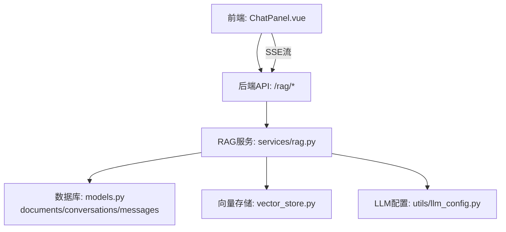
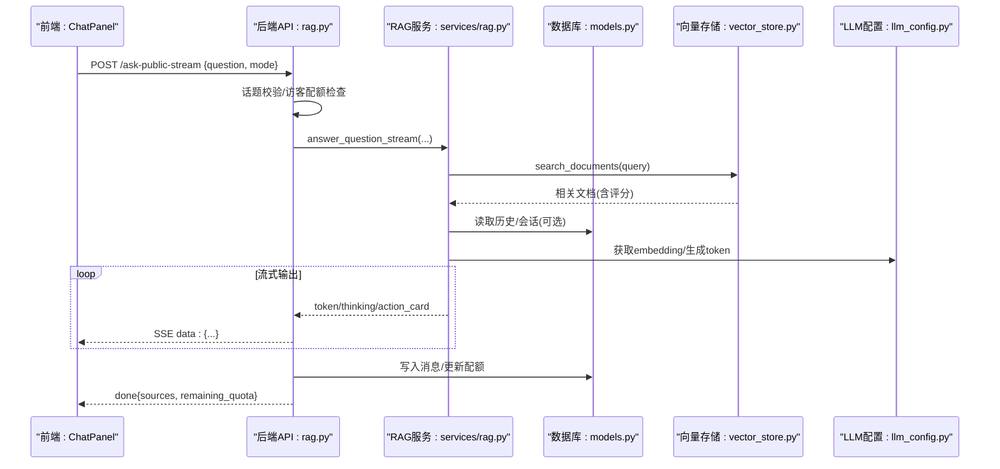
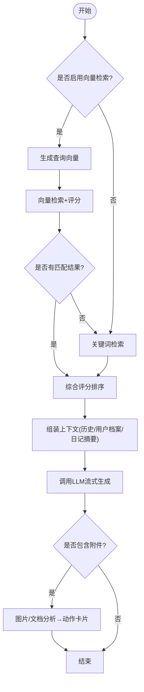
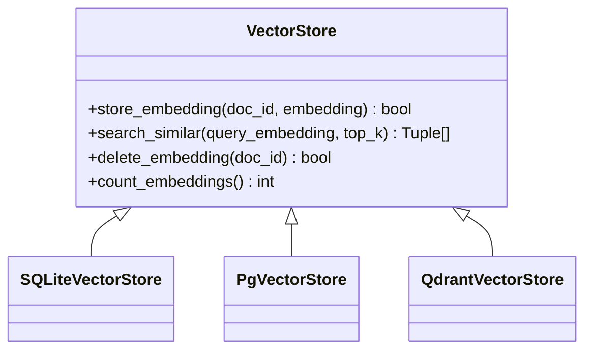
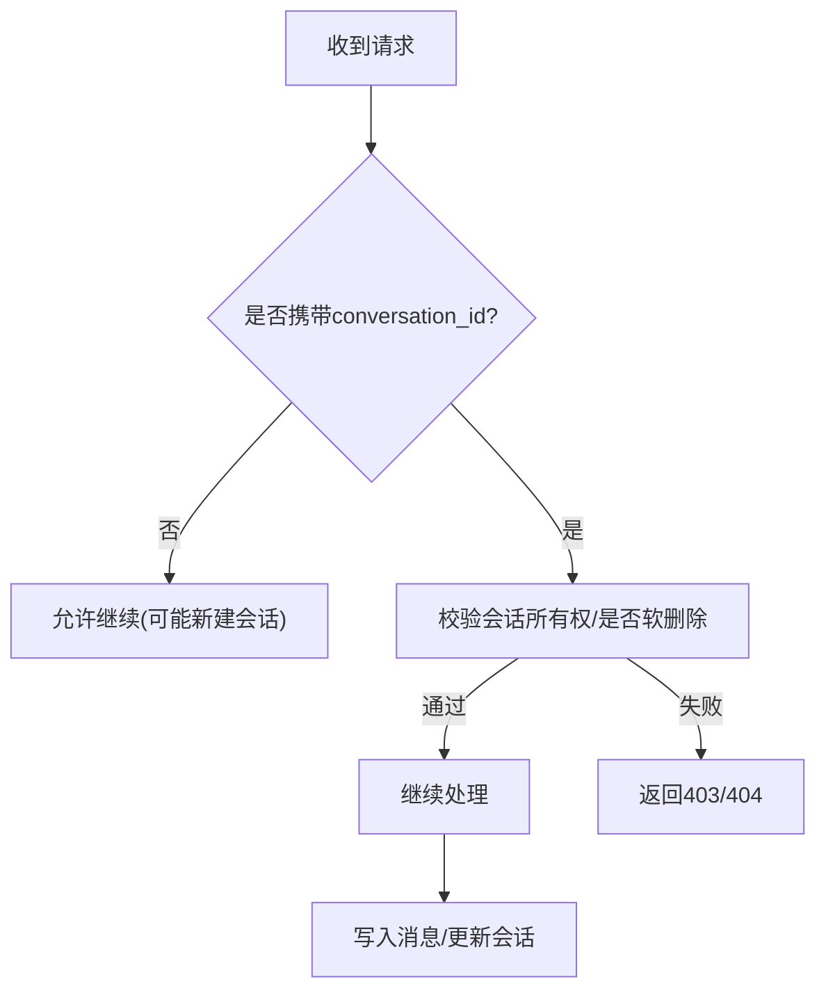
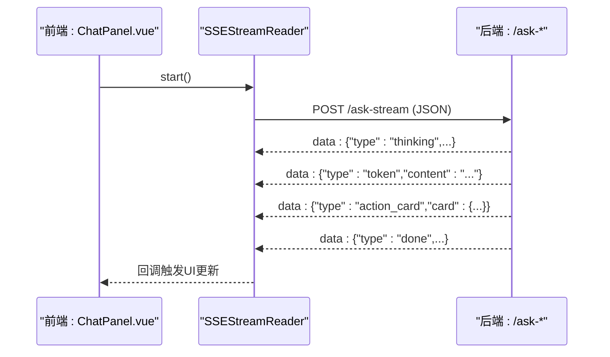
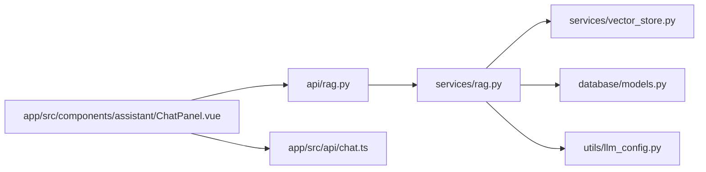

# AI助手系统

<cite>
**本文引用的文件**
- [README.md](file://README.md)
- [web/backend/api/rag.py](file://web/backend/api/rag.py)
- [web/backend/services/rag.py](file://web/backend/services/rag.py)
- [web/backend/services/vector_store.py](file://web/backend/services/vector_store.py)
- [web/backend/models/rag.py](file://web/backend/models/rag.py)
- [web/backend/database/models.py](file://web/backend/database/models.py)
- [web/app/src/api/chat.ts](file://web/app/src/api/chat.ts)
- [web/app/src/components/assistant/ChatPanel.vue](file://web/app/src/components/assistant/ChatPanel.vue)
- [configs/web_config.yaml](file://configs/web_config.yaml)
- [web/backend/utils/llm_config.py](file://web/backend/utils/llm_config.py)
</cite>

## 目录
1. [简介](#简介)
2. [项目结构](#项目结构)
3. [核心组件](#核心组件)
4. [架构总览](#架构总览)
5. [详细组件分析](#详细组件分析)
6. [依赖关系分析](#依赖关系分析)
7. [性能考量](#性能考量)
8. [故障排查指南](#故障排查指南)
9. [结论](#结论)
10. [附录](#附录)

## 简介
本技术文档围绕 SubSkin 的“小白助手”AI 智能问答能力，系统性阐述基于检索增强生成（RAG）的智能对话实现。内容涵盖向量数据库构建、语义检索算法、大模型集成、多轮对话管理、流式响应处理、上下文管理、错误恢复机制与用户交互优化；并给出 Prompt 工程策略、知识库更新机制、性能调优与监控方案，以及前后端 API 调用示例与前端集成要点。

## 项目结构
SubSkin 后端采用 FastAPI 提供 REST 与 SSE 接口，RAG 服务负责检索与生成，向量存储抽象支持 SQLite/pgvector/Qdrant；前端使用 Vue 3 + TypeScript，通过 SSE 流式接收 token、思考状态与动作卡片，渲染到聊天面板。

图表来源
- [web/app/src/components/assistant/ChatPanel.vue:17-53](file://web/app/src/components/assistant/ChatPanel.vue#L17-L53)
- [web/backend/api/rag.py:246-630](file://web/backend/api/rag.py#L246-L630)
- [web/backend/services/rag.py:456-523](file://web/backend/services/rag.py#L456-L523)
- [web/backend/services/vector_store.py:25-109](file://web/backend/services/vector_store.py#L25-L109)
- [web/backend/utils/llm_config.py:8-108](file://web/backend/utils/llm_config.py#L8-L108)

章节来源
- [README.md:29-65](file://README.md#L29-L65)
- [web/backend/api/rag.py:246-630](file://web/backend/api/rag.py#L246-L630)
- [web/backend/services/rag.py:456-523](file://web/backend/services/rag.py#L456-L523)
- [web/backend/services/vector_store.py:25-109](file://web/backend/services/vector_store.py#L25-L109)
- [web/backend/utils/llm_config.py:8-108](file://web/backend/utils/llm_config.py#L8-L108)

## 核心组件
- RAG 问答服务：负责检索、提示词组装、LLM 调用、流式输出与会话持久化。
- 向量存储抽象层：统一封装 SQLite/pgvector/Qdrant 的 embedding 存取与相似度搜索。
- 会话与消息模型：Conversation、Message、Document、GuestUsage 等用于多轮对话、访客配额与知识文档。
- 前端流式客户端：SSEStreamReader 解析 thinking/token/action_card/done 事件，驱动 UI 渲染。
- LLM 配置中心：按模块读取环境变量或数据库中的 provider/model/base_url/embedding_model 等配置。

章节来源
- [web/backend/services/rag.py:525-700](file://web/backend/services/rag.py#L525-L700)
- [web/backend/services/vector_store.py:25-109](file://web/backend/services/vector_store.py#L25-L109)
- [web/backend/database/models.py:255-297](file://web/backend/database/models.py#L255-L297)
- [web/app/src/api/chat.ts:168-272](file://web/app/src/api/chat.ts#L168-L272)
- [web/backend/utils/llm_config.py:111-135](file://web/backend/utils/llm_config.py#L111-L135)

## 架构总览
下图展示一次带附件的访客流式问答流程：前端发起 SSE 请求，后端校验话题与配额，检索知识库，必要时分析图片/文档，流式返回 token 与动作卡片，最终完成会话写入与配额统计。

图表来源
- [web/backend/api/rag.py:568-630](file://web/backend/api/rag.py#L568-L630)
- [web/backend/api/rag.py:632-861](file://web/backend/api/rag.py#L632-L861)
- [web/backend/services/rag.py:456-523](file://web/backend/services/rag.py#L456-L523)
- [web/backend/services/vector_store.py:71-90](file://web/backend/services/vector_store.py#L71-L90)
- [web/backend/utils/llm_config.py:8-108](file://web/backend/utils/llm_config.py#L8-L108)

## 详细组件分析

### RAG 检索与生成管线
- 检索策略：优先向量检索（可配置开关），失败或无配置时回退关键词检索；对无 embedding 或维度不匹配的文档走关键词召回合并排序。
- 评分加权：基础相似度 × 权威权重 × 时间衰减因子，保证权威与时效性。
- 提示工程：区分“智能问答”和“知心陪伴”两种模式，内置数据源优先级规则、网站功能导航、隐私保护与拒绝诊断等约束。
- 附件处理：图片走 VASI 分析，文档走报告解读，均产出 action_card 供前端交互确认保存。
- 会话与上下文：加载历史消息，聚合用户个人档案与近14天日记摘要注入上下文，控制长度避免超出上下文窗口。

图表来源
- [web/backend/services/rag.py:456-523](file://web/backend/services/rag.py#L456-L523)
- [web/backend/services/rag.py:525-700](file://web/backend/services/rag.py#L525-L700)
- [web/backend/api/rag.py:632-861](file://web/backend/api/rag.py#L632-L861)

章节来源
- [web/backend/services/rag.py:456-523](file://web/backend/services/rag.py#L456-L523)
- [web/backend/services/rag.py:525-700](file://web/backend/services/rag.py#L525-L700)
- [web/backend/api/rag.py:632-861](file://web/backend/api/rag.py#L632-L861)

### 向量存储抽象层
- 抽象接口：store_embedding/search_similar/delete_embedding/count_embeddings。
- SQLite 实现：将 embedding 以 JSON 文本存入 Document.embedding，内存计算余弦相似度，适合小规模数据。
- pgvector 实现：预留扩展点，当前回退至 SQLite。
- Qdrant 实现：独立向量库，支持集合自动创建与 HNSW 相似度检索。
- 选择策略：通过环境变量 VECTOR_STORE_BACKEND 动态切换后端。

图表来源
- [web/backend/services/vector_store.py:25-109](file://web/backend/services/vector_store.py#L25-L109)
- [web/backend/services/vector_store.py:112-154](file://web/backend/services/vector_store.py#L112-L154)
- [web/backend/services/vector_store.py:157-243](file://web/backend/services/vector_store.py#L157-L243)

章节来源
- [web/backend/services/vector_store.py:25-109](file://web/backend/services/vector_store.py#L25-L109)
- [web/backend/services/vector_store.py:112-154](file://web/backend/services/vector_store.py#L112-L154)
- [web/backend/services/vector_store.py:157-243](file://web/backend/services/vector_store.py#L157-L243)

### 会话管理与权限控制
- 会话所有权校验：已登录用户只能操作自己创建的会话；未认领的访客会话首次被登录后认领；软删除会话不可读不可写。
- 访客配额：按客户端指纹记录每日提问次数，超限返回限流；流式异常时尝试退款配额。
- 登录用户限速：按用户维度限制聊天频率，防止滥用。
- 会话与消息持久化：每次流式完成后写入 user/assistant 消息，支持历史列表与消息回放。

图表来源
- [web/backend/api/rag.py:188-226](file://web/backend/api/rag.py#L188-L226)
- [web/backend/api/rag.py:136-163](file://web/backend/api/rag.py#L136-L163)
- [web/backend/api/rag.py:864-959](file://web/backend/api/rag.py#L864-L959)

章节来源
- [web/backend/api/rag.py:188-226](file://web/backend/api/rag.py#L188-L226)
- [web/backend/api/rag.py:136-163](file://web/backend/api/rag.py#L136-L163)
- [web/backend/api/rag.py:864-959](file://web/backend/api/rag.py#L864-L959)

### 流式响应与前端集成
- 后端 SSE 事件类型：thinking（阶段提示）、token（增量文本）、action_card（动作卡片）、done（完成，含 sources/quota）。
- 前端 SSE 客户端：SSEStreamReader 解析 data: 行，分发到 onThinking/onToken/onActionCard/onDone/onError；支持取消与错误友好化。
- 聊天面板：根据 isStreaming 显示骨架屏与思考文案，流式追加回答，完成后展示参考来源与剩余配额提示。

图表来源
- [web/backend/api/rag.py:632-861](file://web/backend/api/rag.py#L632-L861)
- [web/app/src/api/chat.ts:168-272](file://web/app/src/api/chat.ts#L168-L272)
- [web/app/src/components/assistant/ChatPanel.vue:17-53](file://web/app/src/components/assistant/ChatPanel.vue#L17-L53)

章节来源
- [web/backend/api/rag.py:632-861](file://web/backend/api/rag.py#L632-L861)
- [web/app/src/api/chat.ts:168-272](file://web/app/src/api/chat.ts#L168-L272)
- [web/app/src/components/assistant/ChatPanel.vue:17-53](file://web/app/src/components/assistant/ChatPanel.vue#L17-L53)

### 提示工程策略
- 智能问答模式：强调权威来源优先级（S/A/B/C/D）、仅基于参考资料回答、拒绝诊断、引导社区板块、隐私保护。
- 知心陪伴模式：共情倾听、去医疗化、危机干预模板、CBT框架、语言风格约束。
- 安全与合规：敏感词过滤、危机信息放行、访客话题门控。

章节来源
- [web/backend/services/rag.py:525-700](file://web/backend/services/rag.py#L525-L700)
- [web/backend/services/rag.py:292-352](file://web/backend/services/rag.py#L292-L352)

### 知识库更新机制
- 文档模型：title/content/source/source_url/category/source_tier/authority_weight/pub_date/embedding。
- 向量入库：批量或增量将 embedding 写入 Document.embedding；可通过 vector_store 抽象切换后端。
- 检索融合：新文档即使尚未向量化也可通过关键词检索命中，保障即时可用。

章节来源
- [web/backend/database/models.py:255-271](file://web/backend/database/models.py#L255-L271)
- [web/backend/services/vector_store.py:61-69](file://web/backend/services/vector_store.py#L61-L69)
- [web/backend/services/rag.py:456-523](file://web/backend/services/rag.py#L456-L523)

### 性能调优与监控
- 检索优化：向量检索优先，失败回退关键词；维度不匹配文档跳过以避免误排。
- 并发与限流：登录用户聊天速率限制；访客每日配额；Nginx 关闭缓冲头确保 SSE 实时性。
- 监控建议：开启健康检查与指标端口；接入错误追踪；记录 embedding 生成与检索耗时。

章节来源
- [web/backend/api/rag.py:228-244](file://web/backend/api/rag.py#L228-L244)
- [web/backend/api/rag.py:534-630](file://web/backend/api/rag.py#L534-L630)
- [configs/web_config.yaml:232-252](file://configs/web_config.yaml#L232-L252)

## 依赖关系分析
- API 层依赖：FastAPI、SQLAlchemy、认证中间件、限流器。
- 服务层依赖：openai SDK（兼容 DashScope/Volc/OpenAI 等）、数据库模型、向量存储抽象、LLM 配置。
- 前端依赖：Fetch/SSE、AbortController、Pinia 状态、Vue 组件。

图表来源
- [web/backend/api/rag.py:246-630](file://web/backend/api/rag.py#L246-L630)
- [web/backend/services/rag.py:456-523](file://web/backend/services/rag.py#L456-L523)
- [web/backend/services/vector_store.py:25-109](file://web/backend/services/vector_store.py#L25-L109)
- [web/backend/utils/llm_config.py:8-108](file://web/backend/utils/llm_config.py#L8-L108)
- [web/app/src/components/assistant/ChatPanel.vue:17-53](file://web/app/src/components/assistant/ChatPanel.vue#L17-L53)
- [web/app/src/api/chat.ts:168-272](file://web/app/src/api/chat.ts#L168-L272)

章节来源
- [web/backend/api/rag.py:246-630](file://web/backend/api/rag.py#L246-L630)
- [web/backend/services/rag.py:456-523](file://web/backend/services/rag.py#L456-L523)
- [web/backend/services/vector_store.py:25-109](file://web/backend/services/vector_store.py#L25-L109)
- [web/backend/utils/llm_config.py:8-108](file://web/backend/utils/llm_config.py#L8-L108)
- [web/app/src/components/assistant/ChatPanel.vue:17-53](file://web/app/src/components/assistant/ChatPanel.vue#L17-L53)
- [web/app/src/api/chat.ts:168-272](file://web/app/src/api/chat.ts#L168-L272)

## 性能考量
- 向量检索与关键词检索混合，兼顾新文档即时可用与大规模检索效率。
- 通过环境变量控制是否启用向量检索与后端类型，便于不同规模部署。
- 会话历史与用户上下文裁剪，避免超出 LLM 上下文窗口。
- 流式传输减少首字延迟，提升用户体验。

[本节为通用指导，无需特定文件引用]

## 故障排查指南
- 访客配额耗尽：检查 guest_usages 表与客户端指纹；查看剩余配额接口。
- 会话无权访问：确认 conversation_id 归属与软删除状态。
- 向量检索失败：检查 embedding 维度一致性、provider 配置与 base_url。
- 流式中断：前端 onError 捕获并友好提示；后端异常时尝试退还访客配额。
- 附件分析失败：日志中查找 VASI/文档解读异常，确认临时文件元数据与权限。

章节来源
- [web/backend/api/rag.py:136-163](file://web/backend/api/rag.py#L136-L163)
- [web/backend/api/rag.py:188-226](file://web/backend/api/rag.py#L188-L226)
- [web/backend/api/rag.py:632-861](file://web/backend/api/rag.py#L632-L861)
- [web/backend/services/rag.py:456-523](file://web/backend/services/rag.py#L456-L523)
- [web/app/src/api/chat.ts:131-166](file://web/app/src/api/chat.ts#L131-L166)

## 结论
SubSkin 的 AI 助手以 RAG 为核心，结合向量检索与关键词回退、多模式提示工程、会话与上下文管理、流式响应与动作卡片，构建了面向白癜风患者的知识问答与心理陪伴能力。通过灵活的向量存储抽象与 LLM 配置中心，系统可在不同规模与供应商环境下稳定运行，并提供完善的权限、配额与错误恢复机制。

[本节为总结，无需特定文件引用]

## 附录

### API 调用示例（后端）
- 已登录用户提问
  - 方法: POST
  - 路径: /api/rag/ask
  - 请求体: { question, conversation_id?, mode? }
  - 响应: { answer, sources[], remaining_quota?, is_guest? }
- 访客免费提问
  - 方法: POST
  - 路径: /api/rag/ask-public
  - 请求体: { question, mode? }
  - 响应: 同上，含剩余配额
- 流式问答（已登录）
  - 方法: POST
  - 路径: /api/rag/ask-stream
  - 请求体: { question, conversation_id?, attachment_ids?, mode? }
  - 响应: text/event-stream，事件类型: thinking/token/action_card/done
- 流式问答（访客）
  - 方法: POST
  - 路径: /api/rag/ask-public-stream
  - 请求体: { question, attachment_ids?, mode? }
  - 响应: text/event-stream
- 上传临时文件
  - 方法: POST
  - 路径: /api/rag/upload-temp
  - 表单: file
  - 响应: { temp_url, temp_id, mime_type, size }
- 确认动作卡片
  - 方法: POST
  - 路径: /api/rag/confirm-action
  - 请求体: { conversation_id, card_type, card_data, action }
  - 响应: { success, message, resource_id? }

章节来源
- [web/backend/api/rag.py:246-630](file://web/backend/api/rag.py#L246-L630)
- [web/backend/models/rag.py:8-62](file://web/backend/models/rag.py#L8-L62)

### 前端集成要点（TypeScript）
- 流式客户端
  - 使用 chatApi.streamAsk / streamAskPublic 建立 SSE 连接
  - 监听 onThinking/onToken/onActionCard/onDone/onError 回调
  - 使用 AbortController 取消请求
- 错误友好化
  - toFriendlyError 将原始异常转换为中文提示
  - sanitizeAssistantText 清理异常后缀，避免暴露内部错误
- 聊天面板
  - 骨架屏与思考文案在 isStreaming 时显示
  - 完成后展示参考来源与剩余配额

章节来源
- [web/app/src/api/chat.ts:31-114](file://web/app/src/api/chat.ts#L31-L114)
- [web/app/src/api/chat.ts:116-166](file://web/app/src/api/chat.ts#L116-L166)
- [web/app/src/api/chat.ts:168-272](file://web/app/src/api/chat.ts#L168-L272)
- [web/app/src/components/assistant/ChatPanel.vue:17-53](file://web/app/src/components/assistant/ChatPanel.vue#L17-L53)

### 配置与环境变量
- LLM 配置
  - 支持 DashScope/VolcEngine/OpenAI 等多提供商
  - 通过 get_llm_config("rag") 获取嵌入与对话模型配置
- 向量存储后端
  - VECTOR_STORE_BACKEND=sqlite|pgvector|qdrant
  - VECTOR_STORE_DIMENSION=1536
  - QDRANT_URL/QDRANT_COLLECTION（Qdrant 模式）
- Web 配置
  - 数据库、Redis、LLM、RAG、监控等键值

章节来源
- [web/backend/utils/llm_config.py:8-108](file://web/backend/utils/llm_config.py#L8-L108)
- [web/backend/services/vector_store.py:245-265](file://web/backend/services/vector_store.py#L245-L265)
- [configs/web_config.yaml:61-112](file://configs/web_config.yaml#L61-L112)
- [configs/web_config.yaml:232-252](file://configs/web_config.yaml#L232-L252)