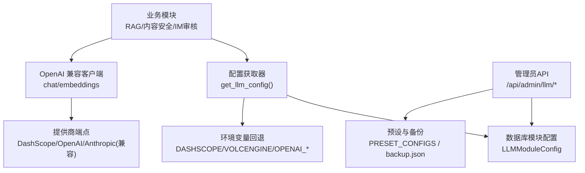
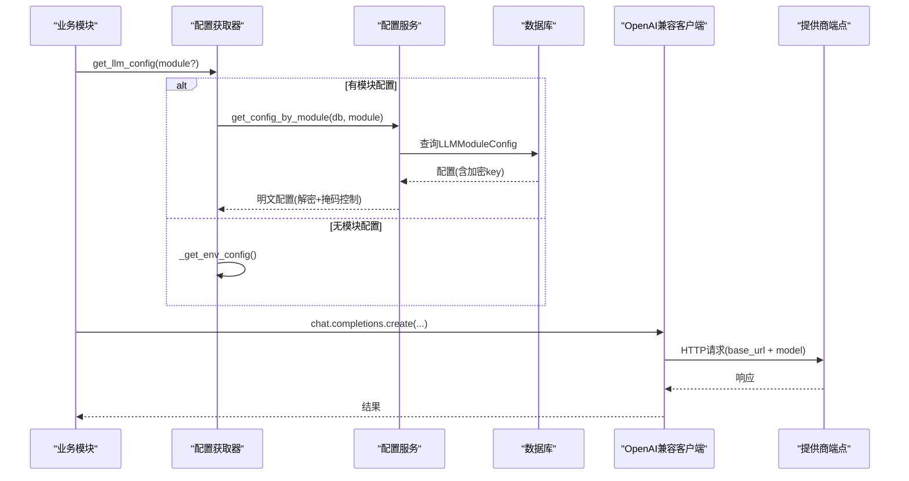
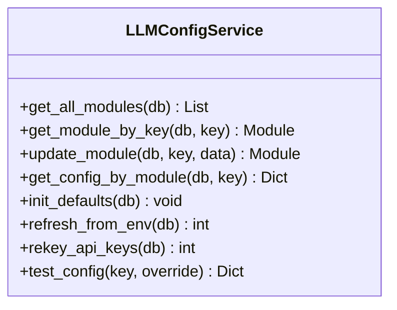
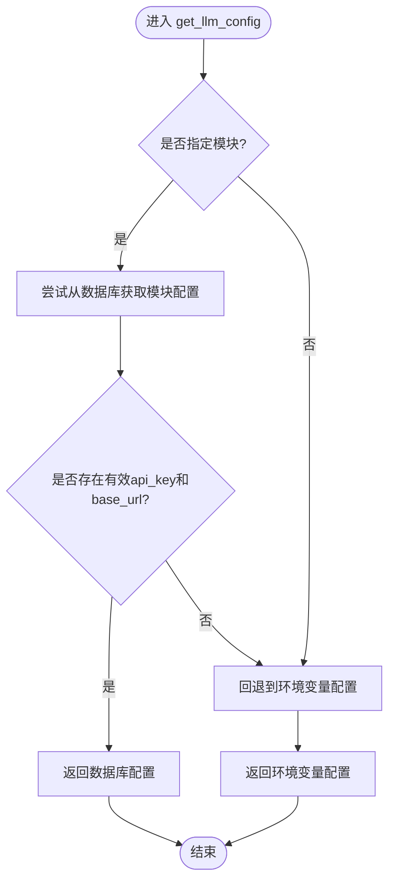
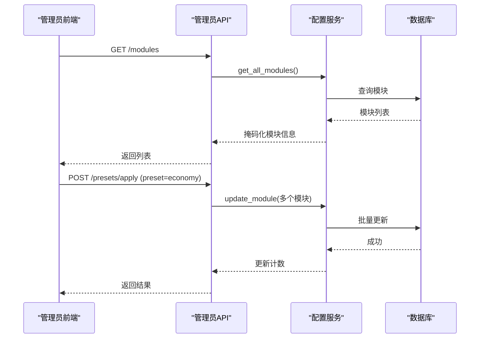
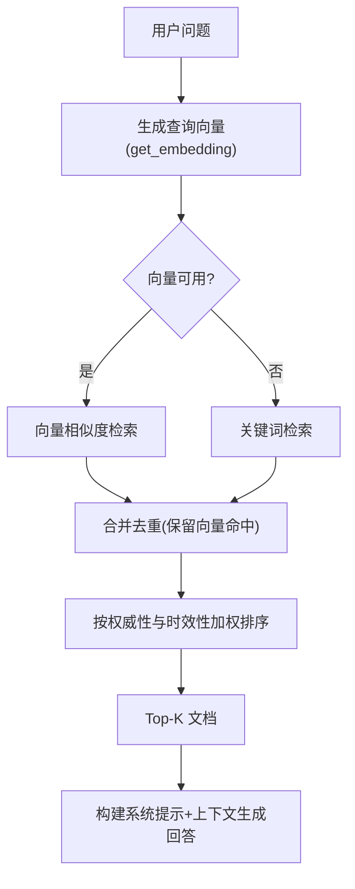
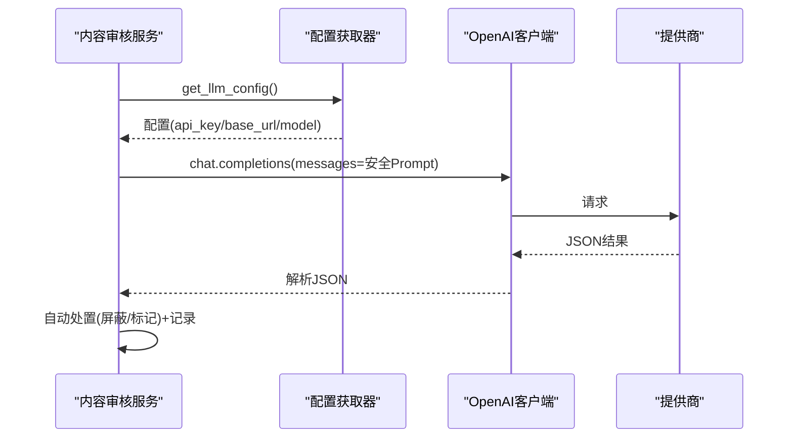
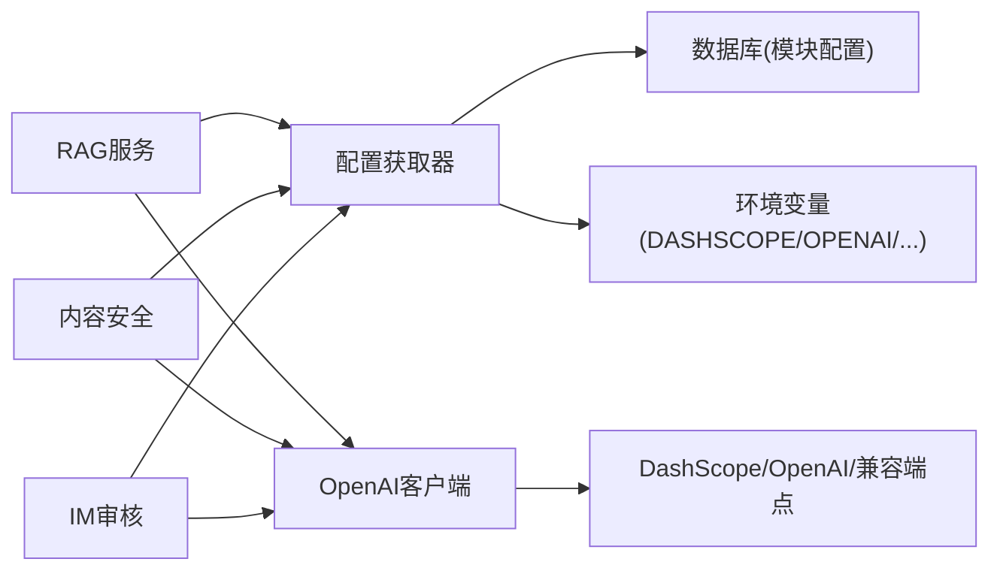

# LLM集成服务

<cite>
**本文引用的文件**
- [web/backend/services/llm_config_service.py](file://web/backend/services/llm_config_service.py)
- [web/backend/utils/llm_config.py](file://web/backend/utils/llm_config.py)
- [web/backend/api/llm_config_admin.py](file://web/backend/api/llm_config_admin.py)
- [web/backend/services/content_safety.py](file://web/backend/services/content_safety.py)
- [web/backend/services/im_moderation.py](file://web/backend/services/im_moderation.py)
- [web/backend/services/rag.py](file://web/backend/services/rag.py)
- [configs/web_config.yaml](file://configs/web_config.yaml)
- [requirements/ai.txt](file://requirements/ai.txt)
- [data/llm_config_backup.json](file://data/llm_config_backup.json)
- [web/backend/test_dashscope.py](file://web/backend/test_dashscope.py)
</cite>

## 目录
1. [简介](#简介)
2. [项目结构](#项目结构)
3. [核心组件](#核心组件)
4. [架构总览](#架构总览)
5. [详细组件分析](#详细组件分析)
6. [依赖关系分析](#依赖关系分析)
7. [性能与成本优化](#性能与成本优化)
8. [故障排查指南](#故障排查指南)
9. [结论](#结论)
10. [附录：配置示例与最佳实践](#附录：配置示例与最佳实践)

## 简介
本技术文档面向 Subskin 项目的“LLM 集成服务”，围绕多模型支持、Prompt 工程策略、参数调优与成本控制机制展开，详细说明对 OpenAI、Anthropic、DashScope（阿里云百炼）等提供商的集成方式，以及负载均衡与故障转移方案。同时覆盖模型选择策略、响应质量评估、安全过滤与内容审核，并提供可操作的模型配置示例与最佳实践。

## 项目结构
LLM 集成相关代码主要分布在后端服务的配置、调用与安全模块中：
- 配置层：统一从环境变量或数据库读取各模块的 provider、base_url、模型名与 API Key，并支持加密存储与掩码展示。
- 调用层：RAG、内容安全、IM 审核等模块通过统一的配置获取器构造 OpenAI 兼容客户端进行调用。
- 管理面：管理员 API 提供模块配置查询、更新、测试、备份恢复与预设应用。
- 配置与依赖：YAML 配置文件定义默认 LLM 能力与 RAG 参数；requirements 声明第三方库。

图表来源
- [web/backend/utils/llm_config.py:111-135](file://web/backend/utils/llm_config.py#L111-L135)
- [web/backend/services/llm_config_service.py:215-270](file://web/backend/services/llm_config_service.py#L215-L270)
- [web/backend/api/llm_config_admin.py:338-458](file://web/backend/api/llm_config_admin.py#L338-L458)

章节来源
- [web/backend/utils/llm_config.py:111-135](file://web/backend/utils/llm_config.py#L111-L135)
- [web/backend/services/llm_config_service.py:215-270](file://web/backend/services/llm_config_service.py#L215-L270)
- [web/backend/api/llm_config_admin.py:338-458](file://web/backend/api/llm_config_admin.py#L338-L458)
- [configs/web_config.yaml:80-134](file://configs/web_config.yaml#L80-L134)

## 核心组件
- 配置服务（LLMConfigService）：负责模块级 LLM 配置的增删改查、API Key 加解密、掩码展示、初始化默认值、从环境刷新、密钥重加密迁移、配置连通性测试。
- 配置获取器（get_llm_config）：优先按模块从数据库取配置，失败则回退到环境变量；支持 embedding_dimensions 透传。
- 管理员 API（/api/admin/llm/*）：模块列表、详情、更新、测试、提供商枚举、刷新、备份/恢复、预设预览与应用。
- 业务调用方：
  - RAG：检索增强问答，使用 embedding 与 chat 能力，内置关键词搜索与向量相似度混合检索。
  - 内容安全：基于 Prompt 的风控判定，自动处置（屏蔽/标记），用户违规记录与通知。
  - IM 审核：消息风控，自动处置与记录。

章节来源
- [web/backend/services/llm_config_service.py:183-270](file://web/backend/services/llm_config_service.py#L183-L270)
- [web/backend/utils/llm_config.py:8-108](file://web/backend/utils/llm_config.py#L8-L108)
- [web/backend/api/llm_config_admin.py:115-202](file://web/backend/api/llm_config_admin.py#L115-L202)
- [web/backend/services/rag.py:354-384](file://web/backend/services/rag.py#L354-L384)
- [web/backend/services/content_safety.py:54-86](file://web/backend/services/content_safety.py#L54-L86)
- [web/backend/services/im_moderation.py:91-121](file://web/backend/services/im_moderation.py#L91-L121)

## 架构总览
下图展示了从业务模块到提供商的完整调用链路，以及配置加载、安全审核与管理员控制的交互。

图表来源
- [web/backend/utils/llm_config.py:111-135](file://web/backend/utils/llm_config.py#L111-L135)
- [web/backend/services/llm_config_service.py:250-270](file://web/backend/services/llm_config_service.py#L250-L270)
- [web/backend/services/rag.py:354-384](file://web/backend/services/rag.py#L354-L384)

## 详细组件分析

### 配置服务（LLMConfigService）
- 功能要点
  - 模块级配置：provider、chat_model、vision_model、embedding_model、base_url、is_active。
  - API Key 安全：Fernet 加解密，支持旧默认密钥迁移与双重加密修复；接口返回一律掩码。
  - 初始化与刷新：根据环境变量优先级（DashScope > VolcEngine > OpenAI）初始化默认模块；支持运行时刷新。
  - 连通性测试：构造 OpenAI 客户端发送最小请求验证配置可用性。
- 复杂度与健壮性
  - 加解密失败时降级为明文告警，避免阻断流程。
  - 双重加密检测与修复，保证幂等迁移。
- 扩展点
  - RECOMMENDED_PROVIDERS 集中维护提供商元数据（名称、模型列表、base_url）。

图表来源
- [web/backend/services/llm_config_service.py:215-517](file://web/backend/services/llm_config_service.py#L215-L517)

章节来源
- [web/backend/services/llm_config_service.py:148-213](file://web/backend/services/llm_config_service.py#L148-L213)
- [web/backend/services/llm_config_service.py:272-393](file://web/backend/services/llm_config_service.py#L272-L393)
- [web/backend/services/llm_config_service.py:395-517](file://web/backend/services/llm_config_service.py#L395-L517)

### 配置获取器（get_llm_config）
- 行为
  - 若传入 module，先尝试从数据库拉取该模块配置；若存在有效 api_key 与 base_url 则直接返回。
  - 否则回退到环境变量：优先 DashScope，其次 VolcEngine，再 DeepSeek/Moonshot/MiniMax/Zhipuai/OpenAI。
  - 对 DashScope embedding 支持 dimensions 字段透传。
- 适用场景
  - RAG 检索、内容安全、IM 审核等模块均通过此函数获取统一配置。

图表来源
- [web/backend/utils/llm_config.py:8-108](file://web/backend/utils/llm_config.py#L8-L108)
- [web/backend/utils/llm_config.py:111-135](file://web/backend/utils/llm_config.py#L111-L135)

章节来源
- [web/backend/utils/llm_config.py:8-108](file://web/backend/utils/llm_config.py#L8-L108)
- [web/backend/utils/llm_config.py:111-135](file://web/backend/utils/llm_config.py#L111-L135)

### 管理员 API（/api/admin/llm/*）
- 能力
  - 模块 CRUD：列出、查看、更新模块配置。
  - 提供商枚举：返回支持的提供商及模型清单。
  - 配置测试：对指定模块执行最小聊天请求验证连通性。
  - 刷新：从环境变量刷新数据库中的模块配置。
  - 备份/恢复：将模块配置导出为 JSON（密文落盘，接口响应掩码），支持恢复。
  - 预设：提供实际/推荐/经济/强劲等多套预设，支持预览与批量应用。
- 安全
  - 所有接口需管理员鉴权。
  - 接口一律返回掩码，不暴露明文密钥。

图表来源
- [web/backend/api/llm_config_admin.py:115-202](file://web/backend/api/llm_config_admin.py#L115-L202)
- [web/backend/api/llm_config_admin.py:426-458](file://web/backend/api/llm_config_admin.py#L426-L458)

章节来源
- [web/backend/api/llm_config_admin.py:115-202](file://web/backend/api/llm_config_admin.py#L115-L202)
- [web/backend/api/llm_config_admin.py:338-458](file://web/backend/api/llm_config_admin.py#L338-L458)
- [web/backend/api/llm_config_admin.py:526-623](file://web/backend/api/llm_config_admin.py#L526-L623)

### RAG 智能问答
- 检索策略
  - 向量检索：通过 embedding 生成查询向量，计算余弦相似度；维度不匹配时跳过并记录警告。
  - 关键词检索：当向量检索不可用或无匹配时，回退到关键词匹配并按权威性与时效性加权。
  - 混合排序：合并向量与关键词结果，去重后按综合得分排序。
- 提示词工程
  - 系统提示明确职责边界（仅知识问答，拒绝诊断）、数据来源优先级（S/A/B/C/D）、隐私保护与网站导航引导。
- 参数与容错
  - 未配置 embedding 或调用失败时自动回退关键词检索。
  - 日志记录 embedding 调用细节便于追踪。

图表来源
- [web/backend/services/rag.py:354-384](file://web/backend/services/rag.py#L354-L384)
- [web/backend/services/rag.py:456-522](file://web/backend/services/rag.py#L456-L522)
- [web/backend/services/rag.py:525-636](file://web/backend/services/rag.py#L525-L636)

章节来源
- [web/backend/services/rag.py:354-384](file://web/backend/services/rag.py#L354-L384)
- [web/backend/services/rag.py:456-522](file://web/backend/services/rag.py#L456-L522)
- [web/backend/services/rag.py:525-636](file://web/backend/services/rag.py#L525-L636)

### 内容安全与 IM 审核
- 内容安全
  - 通过 Prompt 让模型输出 JSON 风险等级、类别、置信度与原因。
  - 自动处置策略：依据风险等级与置信度决定屏蔽或标记，并记录违规与通知。
  - 异常处理：服务异常时默认标记待审，避免漏放。
- IM 审核
  - 消息内容风控，高风险直接屏蔽，中低风险标记。
  - 记录审核结果与自动动作。

图表来源
- [web/backend/services/content_safety.py:54-86](file://web/backend/services/content_safety.py#L54-L86)
- [web/backend/services/content_safety.py:89-143](file://web/backend/services/content_safety.py#L89-L143)
- [web/backend/services/im_moderation.py:91-121](file://web/backend/services/im_moderation.py#L91-L121)

章节来源
- [web/backend/services/content_safety.py:54-86](file://web/backend/services/content_safety.py#L54-L86)
- [web/backend/services/content_safety.py:89-143](file://web/backend/services/content_safety.py#L89-L143)
- [web/backend/services/im_moderation.py:91-121](file://web/backend/services/im_moderation.py#L91-L121)

## 依赖关系分析
- 外部依赖
  - OpenAI SDK：用于 chat/completions 与 embeddings 调用（兼容 DashScope/OpenAI/其他 OpenAI 兼容端点）。
  - Anthropic SDK：requirements 中声明，当前实现以 OpenAI 兼容为主，可通过 base_url 切换。
  - 本地推理：可选 llama-cpp-python、transformers、torch 等，用于未来本地模型集成。
- 内部依赖
  - 配置获取器被 RAG、内容安全、IM 审核等模块复用。
  - 管理员 API 依赖配置服务与数据库模型。

图表来源
- [web/backend/services/rag.py:354-384](file://web/backend/services/rag.py#L354-L384)
- [web/backend/services/content_safety.py:54-86](file://web/backend/services/content_safety.py#L54-L86)
- [web/backend/utils/llm_config.py:8-108](file://web/backend/utils/llm_config.py#L8-L108)

章节来源
- [requirements/ai.txt:1-37](file://requirements/ai.txt#L1-L37)
- [web/backend/utils/llm_config.py:8-108](file://web/backend/utils/llm_config.py#L8-L108)

## 性能与成本优化
- 模型选择策略
  - 关键任务（如医疗报告解读、VASI 评估）：使用更强模型（如 qwen-vl-max、deepseek-pro 系列）。
  - 非关键任务（如摘要、翻译、简报）：使用性价比更高的模型（如 qwen-turbo、deepseek-flash）。
  - 嵌入模型：优先 text-embedding-v4/v3，必要时设置 dimensions 降低开销。
- 参数调优
  - temperature：安全审核使用低温度（如 0.1）提升稳定性；创意类任务可适当提高。
  - max_tokens：根据任务设定上限，避免过长响应造成浪费。
  - top_k：RAG 检索数量平衡召回与成本。
- 成本控制机制
  - 预设配置：经济/强劲两套预设快速切换，便于在不同阶段控制成本。
  - 回退策略：向量检索失败回退关键词检索，减少无效调用。
  - 缓存与限流：结合 Redis/diskcache 与速率限制工具减少重复调用与超限风险。
- 负载均衡与故障转移
  - 多提供商：通过配置服务与管理员 API 动态切换 provider 与 base_url。
  - 健康检查：管理员测试接口可快速验证连通性；异常时自动降级或标记待审。
  - 建议扩展：在调用层增加重试与熔断逻辑，结合多提供商轮询提升可用性。

章节来源
- [web/backend/api/llm_config_admin.py:338-458](file://web/backend/api/llm_config_admin.py#L338-L458)
- [web/backend/services/rag.py:456-522](file://web/backend/services/rag.py#L456-L522)
- [requirements/ai.txt:1-37](file://requirements/ai.txt#L1-L37)

## 故障排查指南
- 常见问题
  - API Key 未配置或无效：内容安全会跳过检测并返回安全默认值；RAG 会抛出未配置错误。
  - 向量维度不匹配：cosine_similarity 返回 0 并记录警告，RAG 会跳过该文档并回退关键词检索。
  - 双重加密：启动时 rekey 会自动修复，若二次解密失败会记录告警并跳过。
- 排查步骤
  - 使用管理员测试接口验证连通性（POST /modules/{module_key}/test）。
  - 检查环境变量与数据库模块配置是否一致（刷新后对比）。
  - 查看日志中关于 embedding、cosine_similarity、安全检测异常的记录。
  - 使用测试脚本验证 DashScope 的 embedding/chat 是否正常。

章节来源
- [web/backend/services/content_safety.py:54-86](file://web/backend/services/content_safety.py#L54-L86)
- [web/backend/services/rag.py:387-401](file://web/backend/services/rag.py#L387-L401)
- [web/backend/services/llm_config_service.py:395-469](file://web/backend/services/llm_config_service.py#L395-L469)
- [web/backend/test_dashscope.py:20-97](file://web/backend/test_dashscope.py#L20-L97)

## 结论
Subskin 的 LLM 集成服务通过模块化的配置管理与统一调用入口，实现了对多提供商的灵活接入与低成本运维。借助管理员 API 的预设与备份能力，团队可以快速在不同成本与性能之间切换。RAG 的混合检索与内容安全的 Prompt 驱动风控，保障了回答质量与平台合规。建议在调用层进一步引入重试、熔断与多提供商轮询，以提升整体可用性与鲁棒性。

## 附录：配置示例与最佳实践
- 提供商与模型
  - DashScope：chat 模型 qwen-plus/qwen-vl-max，embedding text-embedding-v4，base_url 指向兼容端点。
  - OpenAI：chat 模型 gpt-4o/gpt-4.1，embedding text-embedding-3-small/large。
  - Anthropic：通过 OpenAI 兼容模式接入（需确认 base_url 与模型映射）。
- 环境变量模板
  - DASHSCOPE_API_KEY、DASHSCOPE_BASE_URL、DASHSCOPE_CHAT_MODEL、DASHSCOPE_VISION_MODEL、DASHSCOPE_EMBEDDING_MODEL、DASHSCOPE_EMBEDDING_DIMENSIONS。
  - VOLCENGINE_API_KEY、VOLCENGINE_BASE_URL、VOLCENGINE_CHAT_ENDPOINT、VOLCENGINE_VISION_MODEL、VOLCENGINE_EMBEDDING_ENDPOINT。
  - OPENAI_API_KEY、OPENAI_BASE_URL、LLM_MODEL、OPENAI_VISION_MODEL、EMBEDDING_MODEL。
- 最佳实践
  - 敏感信息：API Key 必须通过环境变量注入，数据库内加密存储，接口一律掩码。
  - 安全合规：内容安全 Prompt 明确风险类别与处置策略；对用户隐私严格保护，拒绝诊断。
  - 性能优化：合理设置 temperature、max_tokens、top_k；向量检索失败自动回退关键词检索。
  - 成本管控：使用预设快速切换经济/强劲配置；监控 embedding 维度与 token 消耗。
  - 可观测性：记录 embedding 调用细节、相似度计算日志与安全检测异常，便于定位问题。

章节来源
- [web/backend/utils/llm_config.py:8-108](file://web/backend/utils/llm_config.py#L8-L108)
- [web/backend/services/llm_config_service.py:272-393](file://web/backend/services/llm_config_service.py#L272-L393)
- [configs/web_config.yaml:80-134](file://configs/web_config.yaml#L80-L134)
- [data/llm_config_backup.json:1-149](file://data/llm_config_backup.json#L1-L149)
- [web/backend/test_dashscope.py:20-97](file://web/backend/test_dashscope.py#L20-L97)