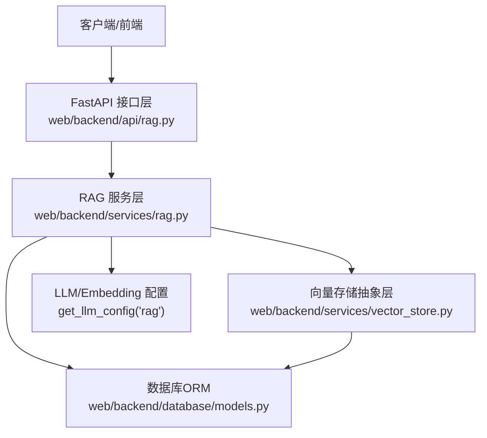
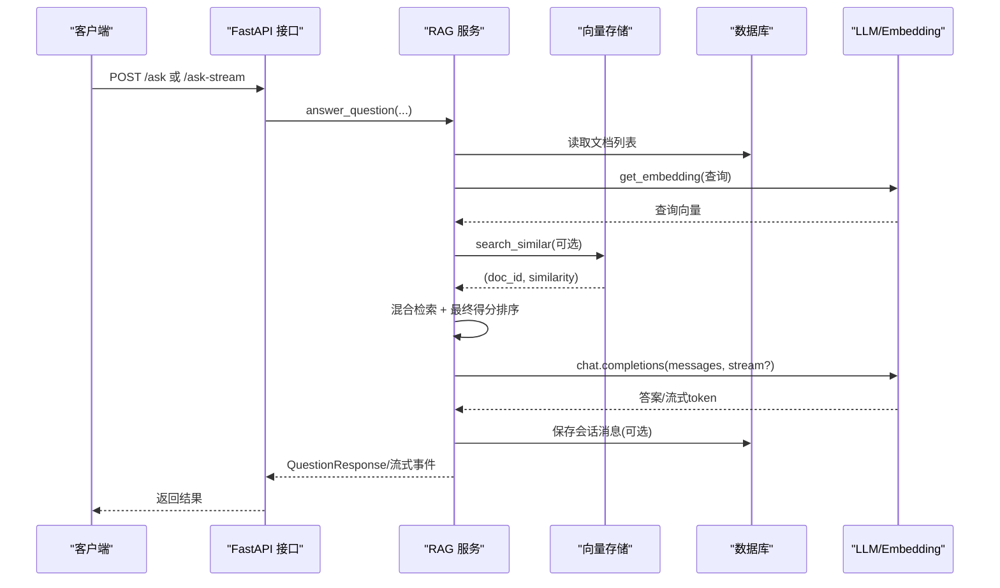
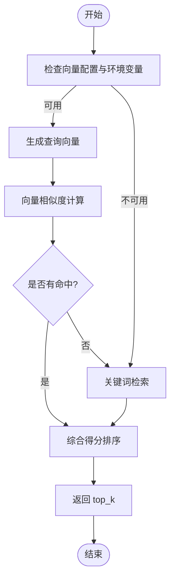
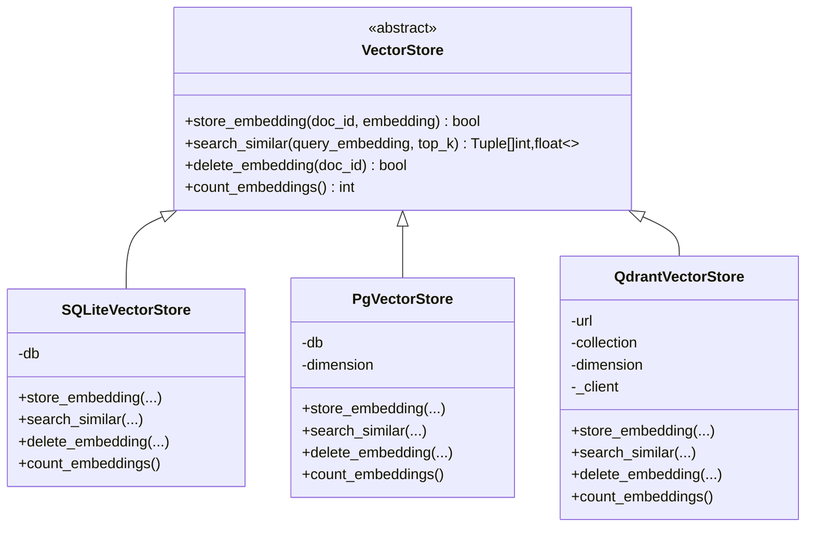
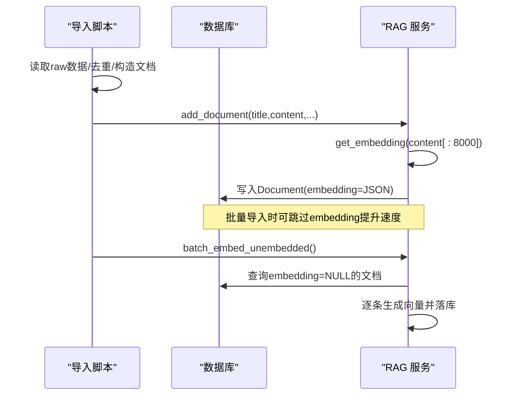
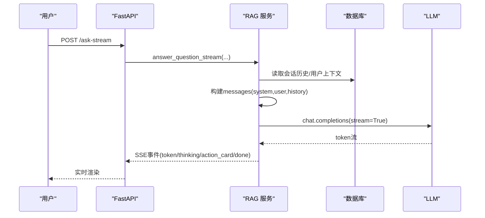
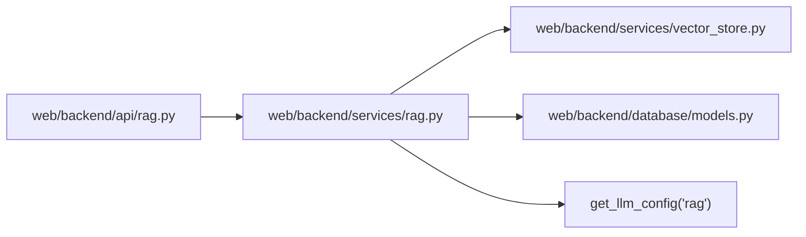

# RAG架构设计

<cite>
**本文引用的文件**
- [web/backend/services/rag.py](file://web/backend/services/rag.py)
- [web/backend/api/rag.py](file://web/backend/api/rag.py)
- [web/backend/models/rag.py](file://web/backend/models/rag.py)
- [web/backend/services/vector_store.py](file://web/backend/services/vector_store.py)
- [web/backend/database/models.py](file://web/backend/database/models.py)
- [web/backend/scripts/import_knowledge.py](file://web/backend/scripts/import_knowledge.py)
- [configs/web_config.yaml](file://configs/web_config.yaml)
</cite>

## 目录
1. [简介](#简介)
2. [项目结构](#项目结构)
3. [核心组件](#核心组件)
4. [架构总览](#架构总览)
5. [详细组件分析](#详细组件分析)
6. [依赖关系分析](#依赖关系分析)
7. [性能与扩展性](#性能与扩展性)
8. [检索质量评估](#检索质量评估)
9. [故障排查指南](#故障排查指南)
10. [结论](#结论)
11. [附录：API调用示例与集成指南](#附录api调用示例与集成指南)

## 简介
本技术文档围绕 Subskin 的检索增强生成（RAG）系统，系统性阐述基于向量数据库的语义检索实现、知识库构建流程、索引优化机制、缓存策略与性能调优方案。内容涵盖文档向量化、相似度计算、检索策略与结果排序算法、向量存储选型对比、检索质量评估指标与扩展性设计，并提供具体 API 调用示例与集成指南，帮助读者快速理解并落地使用。

## 项目结构
RAG 相关代码主要位于后端 FastAPI 应用中，采用“接口层—服务层—数据层”的分层组织：
- 接口层：FastAPI 路由负责请求校验、鉴权、限流、会话管理与流式响应。
- 服务层：封装问答、检索、用户上下文聚合、报告解读、向量化等核心逻辑。
- 数据层：SQLAlchemy ORM 模型与可选向量存储抽象层，支持 SQLite/pgvector/Qdrant。

**图表来源**
- [web/backend/api/rag.py:246-330](file://web/backend/api/rag.py#L246-L330)
- [web/backend/services/rag.py:456-522](file://web/backend/services/rag.py#L456-L522)
- [web/backend/services/vector_store.py:245-266](file://web/backend/services/vector_store.py#L245-L266)
- [web/backend/database/models.py:255-330](file://web/backend/database/models.py#L255-L330)

**章节来源**
- [web/backend/api/rag.py:246-330](file://web/backend/api/rag.py#L246-L330)
- [web/backend/services/rag.py:456-522](file://web/backend/services/rag.py#L456-L522)
- [web/backend/services/vector_store.py:245-266](file://web/backend/services/vector_store.py#L245-L266)
- [web/backend/database/models.py:255-330](file://web/backend/database/models.py#L255-L330)

## 核心组件
- 检索服务：提供混合检索（向量+关键词）、相似度计算、最终得分排序、降级回退能力。
- 向量存储抽象层：统一接口支持 SQLite/pgvector/Qdrant 三种后端，便于按规模演进。
- 知识库导入与增量向量化：支持批量导入与缺省 embedding 的补算任务。
- 问答编排：组装系统提示词、对话历史、用户个人上下文，调用 LLM 生成回答。
- 安全与合规：访客话题过滤、危机消息放行、会话所有权校验、速率限制。

**章节来源**
- [web/backend/services/rag.py:354-430](file://web/backend/services/rag.py#L354-L430)
- [web/backend/services/rag.py:456-522](file://web/backend/services/rag.py#L456-L522)
- [web/backend/services/vector_store.py:25-155](file://web/backend/services/vector_store.py#L25-L155)
- [web/backend/scripts/import_knowledge.py:171-233](file://web/backend/scripts/import_knowledge.py#L171-L233)
- [web/backend/api/rag.py:228-244](file://web/backend/api/rag.py#L228-L244)

## 架构总览
下图展示从请求到回答的端到端流程，包括检索、排序、LLM 生成与会话持久化。

**图表来源**
- [web/backend/api/rag.py:246-330](file://web/backend/api/rag.py#L246-L330)
- [web/backend/api/rag.py:534-629](file://web/backend/api/rag.py#L534-L629)
- [web/backend/services/rag.py:1254-1363](file://web/backend/services/rag.py#L1254-L1363)
- [web/backend/services/vector_store.py:71-90](file://web/backend/services/vector_store.py#L71-L90)

## 详细组件分析

### 检索服务与排序算法
- 向量检索：通过 get_embedding 获取查询向量，结合文档 embedding 计算余弦相似度；维度不匹配时记录告警并跳过该文档，避免错误排名。
- 关键词检索：对无 embedding 或向量检索未命中的文档进行关键词匹配，作为兜底保障新文档即时可检索。
- 最终得分：基础相似度 × 权威权重 × 时效加权（近一年略升、三年以内基准、更旧略降），再取 top_k。
- 降级策略：当嵌入配置不可用或调用失败时，自动回退到关键词检索。

**图表来源**
- [web/backend/services/rag.py:354-430](file://web/backend/services/rag.py#L354-L430)
- [web/backend/services/rag.py:456-522](file://web/backend/services/rag.py#L456-L522)

**章节来源**
- [web/backend/services/rag.py:354-430](file://web/backend/services/rag.py#L354-L430)
- [web/backend/services/rag.py:456-522](file://web/backend/services/rag.py#L456-L522)

### 向量存储抽象层与后端选型
- 抽象接口：定义 store_embedding、search_similar、delete_embedding、count_embeddings。
- SQLite 后端：将 embedding 以 JSON 文本存储在 documents.embedding 字段，内存中计算余弦相似度，适合小规模数据。
- pgvector 后端：预留原生向量类型与 HNSW/IVFFlat 索引路径，当前默认回退至 SQLite 实现。
- Qdrant 后端：独立向量数据库服务，适合大规模与高并发场景，需安装客户端并创建集合。

**图表来源**
- [web/backend/services/vector_store.py:25-155](file://web/backend/services/vector_store.py#L25-L155)
- [web/backend/services/vector_store.py:157-243](file://web/backend/services/vector_store.py#L157-L243)

**章节来源**
- [web/backend/services/vector_store.py:25-155](file://web/backend/services/vector_store.py#L25-L155)
- [web/backend/services/vector_store.py:157-243](file://web/backend/services/vector_store.py#L157-L243)

### 知识库构建与增量向量化
- 导入脚本：从 raw 数据加载 PubMed 文献，去重、筛选摘要，构造文档元数据与内容，调用 add_document 写入数据库并计算 embedding。
- 增量补算：batch_embed_unembedded 扫描 embedding 为空的文档，逐条生成向量并落库，带限速与失败重试。
- 配置项：web_config.yaml 中预留 vector_db 开关与类型选择，便于后续接入外部向量库。

**图表来源**
- [web/backend/scripts/import_knowledge.py:171-233](file://web/backend/scripts/import_knowledge.py#L171-L233)
- [web/backend/services/rag.py:1449-1559](file://web/backend/services/rag.py#L1449-L1559)
- [configs/web_config.yaml:61-78](file://configs/web_config.yaml#L61-L78)

**章节来源**
- [web/backend/scripts/import_knowledge.py:171-233](file://web/backend/scripts/import_knowledge.py#L171-L233)
- [web/backend/services/rag.py:1449-1559](file://web/backend/services/rag.py#L1449-L1559)
- [configs/web_config.yaml:61-78](file://configs/web_config.yaml#L61-L78)

### 问答编排与用户上下文注入
- 模式切换：knowledge（知识问答）与 counseling（心理陪伴）两种系统提示词，温度参数不同。
- 用户上下文：登录用户会聚合病案档案、近14天日记摘要、用药提醒与近期治疗事件，拼接成 ≤500 字符的上下文块注入 system prompt。
- 对话历史：按会话拉取最近 N 轮消息，避免上下文膨胀导致成本与窗口溢出。
- 附件处理：图片走 VASI 分析，文档走报告解读，生成 action_card 供前端交互。

**图表来源**
- [web/backend/api/rag.py:534-629](file://web/backend/api/rag.py#L534-L629)
- [web/backend/services/rag.py:880-916](file://web/backend/services/rag.py#L880-L916)
- [web/backend/services/rag.py:1296-1363](file://web/backend/services/rag.py#L1296-L1363)

**章节来源**
- [web/backend/services/rag.py:757-877](file://web/backend/services/rag.py#L757-L877)
- [web/backend/services/rag.py:880-916](file://web/backend/services/rag.py#L880-L916)
- [web/backend/services/rag.py:1296-1363](file://web/backend/services/rag.py#L1296-L1363)

### 安全、合规与会话权限
- 访客限频：每日固定次数，基于客户端指纹统计。
- 话题过滤：仅允许白癜风/皮肤健康相关问题，网站功能问题也放行；检测到自杀/自残意图的消息强制放行以便提供资源。
- 会话所有权：已登录用户只能访问自己拥有的会话，防止跨用户注入。
- 速率限制：登录用户聊天接口按用户维度限流，防止滥用。

**章节来源**
- [web/backend/api/rag.py:72-86](file://web/backend/api/rag.py#L72-L86)
- [web/backend/api/rag.py:136-163](file://web/backend/api/rag.py#L136-L163)
- [web/backend/api/rag.py:188-226](file://web/backend/api/rag.py#L188-L226)
- [web/backend/api/rag.py:228-244](file://web/backend/api/rag.py#L228-L244)
- [web/backend/services/rag.py:292-351](file://web/backend/services/rag.py#L292-L351)

## 依赖关系分析
- 接口层依赖服务层：路由调用 answer_question、answer_question_stream、search_documents 等。
- 服务层依赖数据层与向量存储：通过 SQLAlchemy 查询 Document，并通过向量存储抽象层执行相似搜索。
- 配置与外部服务：通过 get_llm_config("rag") 获取 Embedding/Chat 配置，调用 OpenAI 兼容接口。

**图表来源**
- [web/backend/api/rag.py:246-330](file://web/backend/api/rag.py#L246-L330)
- [web/backend/services/rag.py:456-522](file://web/backend/services/rag.py#L456-L522)
- [web/backend/services/vector_store.py:245-266](file://web/backend/services/vector_store.py#L245-L266)

**章节来源**
- [web/backend/api/rag.py:246-330](file://web/backend/api/rag.py#L246-L330)
- [web/backend/services/rag.py:456-522](file://web/backend/services/rag.py#L456-L522)
- [web/backend/services/vector_store.py:245-266](file://web/backend/services/vector_store.py#L245-L266)

## 性能与扩展性
- 向量存储选型建议：
  - SQLite：部署简单，适合小样本（<1万文档），内存计算余弦相似度。
  - pgvector：推荐升级路径，利用原生向量类型与 HNSW/IVFFlat 索引，适合中大规模。
  - Qdrant：独立服务，适合大规模与高并发，需维护服务与集合。
- 索引优化：
  - 在 pgvector 上建立 HNSW/IVFFlat 索引以提升近似最近邻搜索效率。
  - 控制 embedding 维度与 chunk 长度（如 content[:8000]），减少开销。
- 缓存策略：
  - 可在服务层增加查询向量缓存（Redis），键为 query_hash，值为 embedding，TTL 合理设置。
  - 对热门文档片段或答案做短期缓存，降低重复 LLM 调用。
- 性能调优：
  - 批量导入时可选择 skip_embedding 提升导入速度，随后通过增量向量化补算。
  - 流式输出减少首包延迟，提升用户体验。
  - 会话历史裁剪（最近 N 轮）控制上下文大小，降低成本与超时风险。

[本节为通用指导，无需特定文件引用]

## 检索质量评估
- 指标建议：
  - 召回率（Recall@k）：top_k 中是否包含相关文档。
  - 精确率（Precision@k）：top_k 中相关文档占比。
  - MRR（Mean Reciprocal Rank）：首个相关文档的平均排名倒数。
  - NDCG（Normalized Discounted Cumulative Gain）：考虑位置衰减的相关性度量。
- 评估方法：
  - 构建标注集（query, relevant_docs），离线跑检索并计算指标。
  - 在线 A/B 测试不同检索策略（纯向量 vs 混合检索）与排序权重（权威权重、时效加权）。
- 持续优化：
  - 调整权威权重与时效加权函数，观察对相关性影响。
  - 引入更多高质量来源（S/A级）提升权威权重分布。
  - 定期清理低质或重复文档，提升整体检索质量。

[本节为通用指导，无需特定文件引用]

## 故障排查指南
- 向量维度不匹配：日志记录警告并跳过该文档，确保不影响关键词兜底。
- 嵌入生成失败：自动降级到关键词检索，避免服务中断。
- 会话权限错误：403/404 明确提示无权访问或删除的会话。
- 访客配额耗尽：429 提示当日免费次数用完。
- 报告解读失败：回退到默认解读模板，保证基本可用性。

**章节来源**
- [web/backend/services/rag.py:387-401](file://web/backend/services/rag.py#L387-L401)
- [web/backend/services/rag.py:469-476](file://web/backend/services/rag.py#L469-L476)
- [web/backend/api/rag.py:188-226](file://web/backend/api/rag.py#L188-L226)
- [web/backend/api/rag.py:273-330](file://web/backend/api/rag.py#L273-L330)
- [web/backend/services/rag.py:1131-1192](file://web/backend/services/rag.py#L1131-L1192)

## 结论
Subskin 的 RAG 系统采用“向量+关键词”的混合检索策略，具备灵活的向量存储后端选择与完善的降级机制。通过权威权重与时效加权提升排序质量，结合用户上下文注入与流式输出优化体验。未来可通过 pgvector 或 Qdrant 扩展支撑更大规模数据，配合缓存与索引优化进一步提升性能与稳定性。

[本节为总结，无需特定文件引用]

## 附录：API调用示例与集成指南
- 已登录用户提问
  - 方法：POST
  - 路径：/ask
  - 请求体：{ question, conversation_id?, mode? }
  - 说明：按用户维度限流，支持模式切换（knowledge/counseling）。
  - 参考：[web/backend/api/rag.py:246-270](file://web/backend/api/rag.py#L246-L270)

- 访客免费提问
  - 方法：POST
  - 路径：/ask-public
  - 请求体：{ question, conversation_id?, mode? }
  - 说明：每日限额，话题过滤，返回剩余次数。
  - 参考：[web/backend/api/rag.py:273-330](file://web/backend/api/rag.py#L273-L330)

- 流式问答（已登录）
  - 方法：POST
  - 路径：/ask-stream
  - 请求体：{ question, conversation_id?, attachment_ids?, mode? }
  - 说明：SSE 流式返回 token、thinking、action_card、done 事件。
  - 参考：[web/backend/api/rag.py:534-629](file://web/backend/api/rag.py#L534-L629)

- 流式问答（访客）
  - 方法：POST
  - 路径：/ask-public-stream
  - 请求体：同 /ask-stream
  - 说明：访客配额校验与退款逻辑。
  - 参考：[web/backend/api/rag.py:568-629](file://web/backend/api/rag.py#L568-L629)

- 上传临时文件
  - 方法：POST
  - 路径：/upload-temp
  - 说明：用于图片/文档分析，限制类型与大小。
  - 参考：[web/backend/api/rag.py:345-383](file://web/backend/api/rag.py#L345-L383)

- 确认操作卡片
  - 方法：POST
  - 路径：/confirm-action
  - 说明：保存 VASI 评估、体检报告、日记草稿等。
  - 参考：[web/backend/api/rag.py:385-531](file://web/backend/api/rag.py#L385-L531)

- 会话管理
  - 列出会话：GET /conversations
  - 获取消息：GET /conversations/{conversation_id}/messages
  - 删除会话：DELETE /conversations/{conversation_id}
  - 参考：[web/backend/api/rag.py:864-959](file://web/backend/api/rag.py#L864-L959)

- 集成要点
  - 配置 LLM：通过 get_llm_config("rag") 设置 provider、api_key、base_url、embedding_model、chat_model。
  - 向量存储：环境变量 VECTOR_STORE_BACKEND 选择 sqlite/pgvector/qdrant；Qdrant 需配置 URL 与 collection。
  - 知识库导入：使用 import_knowledge.py 批量导入，必要时启用 skip_embedding 后通过 batch_embed_unembedded 补算。
  - 参考：
    - [web/backend/services/rag.py:354-384](file://web/backend/services/rag.py#L354-L384)
    - [web/backend/services/vector_store.py:245-266](file://web/backend/services/vector_store.py#L245-L266)
    - [web/backend/scripts/import_knowledge.py:171-233](file://web/backend/scripts/import_knowledge.py#L171-L233)

**章节来源**
- [web/backend/api/rag.py:246-330](file://web/backend/api/rag.py#L246-L330)
- [web/backend/api/rag.py:534-629](file://web/backend/api/rag.py#L534-L629)
- [web/backend/api/rag.py:345-531](file://web/backend/api/rag.py#L345-L531)
- [web/backend/api/rag.py:864-959](file://web/backend/api/rag.py#L864-L959)
- [web/backend/services/rag.py:354-384](file://web/backend/services/rag.py#L354-L384)
- [web/backend/services/vector_store.py:245-266](file://web/backend/services/vector_store.py#L245-L266)
- [web/backend/scripts/import_knowledge.py:171-233](file://web/backend/scripts/import_knowledge.py#L171-L233)