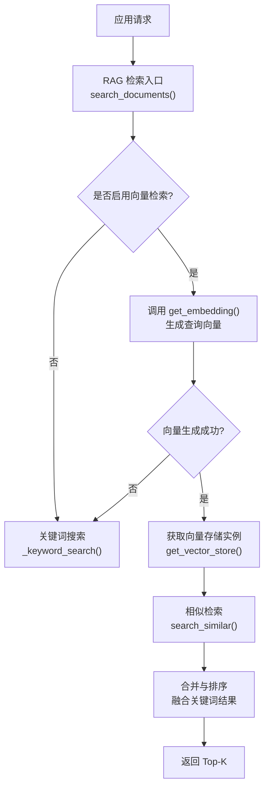
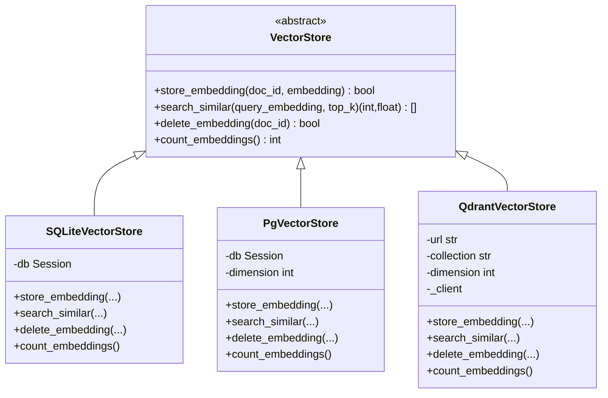
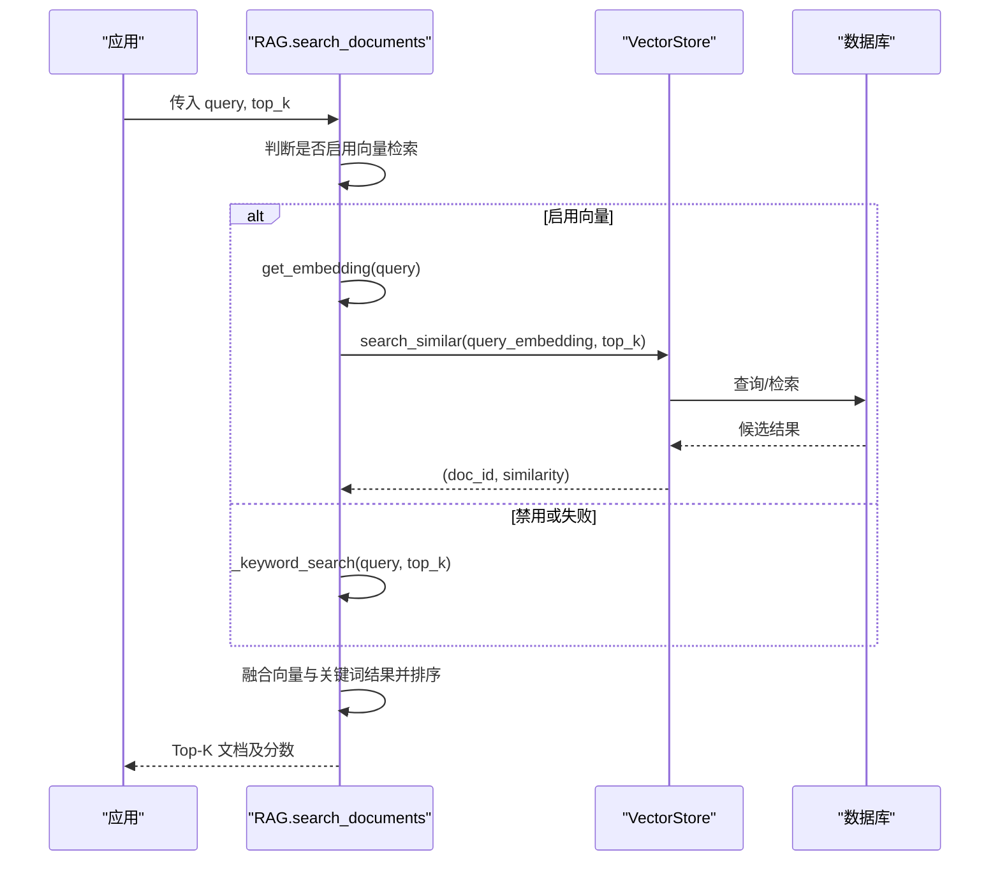
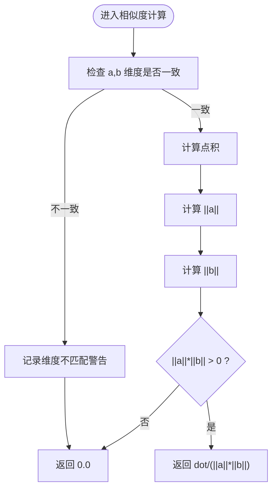
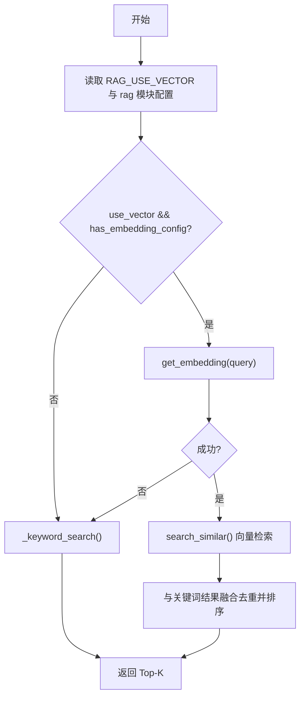
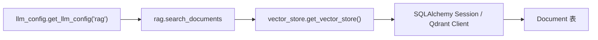

# 向量数据库设计

<cite>
**本文引用的文件**
- [vector_store.py](file://web/backend/services/vector_store.py)
- [rag.py](file://web/backend/services/rag.py)
- [models.py](file://web/backend/database/models.py)
- [llm_config.py](file://web/backend/utils/llm_config.py)
- [llm_config_admin.py](file://web/backend/api/llm_config_admin.py)
</cite>

## 目录
1. [简介](#简介)
2. [项目结构](#项目结构)
3. [核心组件](#核心组件)
4. [架构总览](#架构总览)
5. [详细组件分析](#详细组件分析)
6. [依赖关系分析](#依赖关系分析)
7. [性能考量](#性能考量)
8. [故障排查指南](#故障排查指南)
9. [结论](#结论)
10. [附录：配置与调优示例](#附录：配置与调优示例)

## 简介
本技术文档围绕 Subskin 的 RAG（检索增强生成）向量存储与检索链路，系统性阐述向量存储架构选型、索引构建策略、相似度计算实现、查询优化与扩展性设计。当前实现以 SQLite 为默认后端，预留 pgvector 与 Qdrant 两种高扩展后端；RAG 层提供混合检索（向量+关键词）与降级机制，确保在嵌入服务不可用或维度不匹配时仍能提供可用结果。

## 项目结构
与向量数据库相关的代码主要分布在以下位置：
- 向量存储抽象与多后端实现：web/backend/services/vector_store.py
- RAG 检索与相似度计算：web/backend/services/rag.py
- 知识库文档模型（含 embedding 字段）：web/backend/database/models.py
- LLM/Embedding 配置与模块级配置读取：web/backend/utils/llm_config.py
- 模块级推荐配置（含 embedding 模型选择）：web/backend/api/llm_config_admin.py

图表来源
- [rag.py:456-522](file://web/backend/services/rag.py#L456-L522)
- [vector_store.py:245-265](file://web/backend/services/vector_store.py#L245-L265)

章节来源
- [rag.py:456-522](file://web/backend/services/rag.py#L456-L522)
- [vector_store.py:245-265](file://web/backend/services/vector_store.py#L245-L265)

## 核心组件
- 向量存储抽象与多后端
  - 抽象接口：VectorStore（定义 store/search/delete/count）
  - 当前实现：SQLiteVectorStore（JSON 文本列存储 embedding，内存中计算余弦相似度）
  - 升级路径：PgVectorStore（pgvector + HNSW/IVFFlat）、QdrantVectorStore（独立向量库服务）
- RAG 检索与相似度
  - 查询向量生成：get_embedding() 通过 LLM 配置模块获取 provider/model/dimensions
  - 相似度计算：cosine_similarity() 严格校验维度一致性，避免错误截断导致误排
  - 混合检索：向量命中后与关键词搜索结果按分数融合，保证无向量化内容仍可召回
- 数据模型
  - Document 表包含 embedding 文本列（JSON），以及权威权重、发布时间等用于最终评分加权

章节来源
- [vector_store.py:25-109](file://web/backend/services/vector_store.py#L25-L109)
- [rag.py:354-401](file://web/backend/services/rag.py#L354-L401)
- [rag.py:456-522](file://web/backend/services/rag.py#L456-L522)
- [models.py:255-272](file://web/backend/database/models.py#L255-L272)

## 架构总览
系统采用“统一抽象 + 多后端”的向量存储架构，RAG 层屏蔽后端差异，支持运行时切换。默认 SQLite 适合小规模快速验证；生产环境可平滑迁移至 pgvector 或 Qdrant 以获得更高吞吐与更低延迟。

图表来源
- [vector_store.py:25-243](file://web/backend/services/vector_store.py#L25-L243)

章节来源
- [vector_store.py:25-243](file://web/backend/services/vector_store.py#L25-L243)

## 详细组件分析

### 向量存储抽象与实现
- 抽象接口定义了统一的增删查统计能力，便于后续替换后端而不影响上层调用。
- SQLite 实现将 embedding 以 JSON 字符串存储在 Text 列，查询时全表扫描并在内存中计算余弦相似度，适用于小数据量场景。
- PgVectorStore 预留了使用 pgvector 原生向量类型与 HNSW/IVFFlat 索引的方案，适合中大规模数据；当前未完全实现，回退到 SQLite。
- QdrantVectorStore 通过客户端连接外部向量库，具备高并发与水平扩展能力，适合大规模与高吞吐场景。

图表来源
- [rag.py:456-522](file://web/backend/services/rag.py#L456-L522)
- [vector_store.py:245-265](file://web/backend/services/vector_store.py#L245-L265)

章节来源
- [vector_store.py:25-243](file://web/backend/services/vector_store.py#L25-L243)
- [rag.py:456-522](file://web/backend/services/rag.py#L456-L522)

### 相似度计算与维度管理
- 查询向量生成：通过 get_llm_config("rag") 获取 provider、embedding_model、embedding_dimensions，调用 OpenAI 兼容接口生成向量。
- 余弦相似度：cosine_similarity() 会严格检查维度一致性，若不一致则返回 0 并记录告警，避免错误截断导致的误排名。
- 维度配置：
  - 环境变量：VECTOR_STORE_DIMENSION（默认 1536）
  - Embedding 维度：由 LLM 配置模块中的 embedding_dimensions 控制（如 DashScope text-embedding-v4 支持自定义维度）

图表来源
- [rag.py:387-401](file://web/backend/services/rag.py#L387-L401)

章节来源
- [rag.py:354-401](file://web/backend/services/rag.py#L354-L401)
- [llm_config.py:8-108](file://web/backend/utils/llm_config.py#L8-L108)

### 混合检索与降级策略
- 当 RAG_USE_VECTOR=false 或未配置 embedding 时，直接走关键词搜索。
- 向量检索失败（网络异常、API 限流、维度不匹配等）自动降级到关键词搜索。
- 对无 embedding 或 embedding 格式错误的文档，通过关键词搜索兜底，确保新增内容立即可被检索。

图表来源
- [rag.py:456-522](file://web/backend/services/rag.py#L456-L522)

章节来源
- [rag.py:456-522](file://web/backend/services/rag.py#L456-L522)

### 数据模型与存储空间管理
- Document.embedding 使用 Text 列存储 JSON 格式的浮点数组，便于快速接入与迁移。
- 建议在生产环境中：
  - 添加专用向量列（如 vector(1536)）并使用 pgvector 原生类型
  - 建立 HNSW/IVFFlat 索引以加速近似最近邻搜索
  - 定期清理无效/损坏的 embedding 记录，避免空间膨胀与检索污染

章节来源
- [models.py:255-272](file://web/backend/database/models.py#L255-L272)
- [vector_store.py:112-136](file://web/backend/services/vector_store.py#L112-L136)

### 索引更新机制
- 当前 SQLite 实现在写入时直接更新 embedding 字段，无异步批处理。
- 建议引入增量更新与批量写入：
  - 新增/修改文档后触发 embedding 重建或增量更新
  - 使用事务与批提交减少 IO 开销
  - 对 pgvector/Qdrant 后端，利用其原生索引更新机制（HNSW 动态插入、Qdrant 点更新）

章节来源
- [vector_store.py:61-69](file://web/backend/services/vector_store.py#L61-L69)
- [vector_store.py:130-136](file://web/backend/services/vector_store.py#L130-L136)

### 查询优化技术
- 混合检索：向量命中优先，关键词兜底，提升召回率与鲁棒性。
- 最终评分加权：结合 authority_weight 与 recency 进行综合打分，提高相关性。
- 维度校验：防止因维度不匹配导致的错误排名。
- 后端选择：根据数据规模与并发需求选择 SQLite/pgvector/Qdrant。

章节来源
- [rag.py:422-430](file://web/backend/services/rag.py#L422-L430)
- [rag.py:456-522](file://web/backend/services/rag.py#L456-L522)

## 依赖关系分析
- RAG 层依赖 LLM 配置模块获取 embedding 模型与维度；
- 向量存储层通过环境变量选择后端（sqlite/pgvector/qdrant）；
- 数据层通过 ORM 访问 Document 表，读写 embedding 字段。

图表来源
- [rag.py:456-522](file://web/backend/services/rag.py#L456-L522)
- [vector_store.py:245-265](file://web/backend/services/vector_store.py#L245-L265)
- [llm_config.py:111-135](file://web/backend/utils/llm_config.py#L111-L135)

章节来源
- [rag.py:456-522](file://web/backend/services/rag.py#L456-L522)
- [vector_store.py:245-265](file://web/backend/services/vector_store.py#L245-L265)
- [llm_config.py:111-135](file://web/backend/utils/llm_config.py#L111-L135)

## 性能考量
- 数据规模与后端选择
  - 小规模（<10k 文档）：SQLite 足够，开发/测试首选
  - 中大规模（10k-1M 文档）：推荐 pgvector + HNSW/IVFFlat
  - 高并发/分布式：推荐 Qdrant，支持水平扩展与高吞吐
- 相似度计算
  - 余弦相似度在 Python 中逐元素计算，注意避免大列表循环的性能瓶颈；必要时可引入 NumPy 或后端原生算子
- 索引与查询
  - pgvector：HNSW 适合低延迟近似检索；IVFFlat 适合离线建索引、在线稳定查询
  - Qdrant：合理设置距离度量、top_k 与过滤条件，降低网络往返与序列化成本
- 混合检索
  - 向量命中优先，关键词兜底，兼顾召回与时效性
- 资源与成本
  - Embedding API 调用频率与配额需监控；必要时引入缓存与批处理
  - 存储方面，Text(JSON) 占用较大，建议迁移到原生向量类型

[本节为通用性能指导，不直接分析具体文件]

## 故障排查指南
- 无法生成 embedding
  - 检查 LLM 配置（provider、api_key、base_url、embedding_model）
  - 确认网络连通性与配额限制
  - 参考日志：embedding 调用与失败降级信息
- 维度不匹配
  - 检查 VECTOR_STORE_DIMENSION 与 embedding_dimensions 的一致性
  - 查看 cosine_similarity 的维度不匹配告警
- 检索结果为空或质量差
  - 确认 RAG_USE_VECTOR 开关与 rag 模块配置
  - 检查文档是否有有效 embedding 且格式正确
  - 调整 top_k、融合权重与关键词兜底逻辑
- 后端切换问题
  - 确认 VECTOR_STORE_BACKEND 环境变量
  - 检查 pgvector 扩展安装与索引创建
  - 检查 Qdrant 服务地址与集合名

章节来源
- [rag.py:354-401](file://web/backend/services/rag.py#L354-L401)
- [rag.py:456-522](file://web/backend/services/rag.py#L456-L522)
- [vector_store.py:245-265](file://web/backend/services/vector_store.py#L245-L265)
- [llm_config.py:8-108](file://web/backend/utils/llm_config.py#L8-L108)

## 结论
Subskin 的向量检索系统以“统一抽象 + 多后端”为核心，当前以 SQLite 快速落地，同时预留 pgvector 与 Qdrant 的高扩展路径。RAG 层通过混合检索与降级策略保障可用性，配合严格的维度校验与评分加权提升检索质量。生产环境建议尽快迁移至 pgvector 或 Qdrant，并结合索引优化、批处理与监控，实现高性能、可扩展的知识检索。

[本节为总结性内容，不直接分析具体文件]

## 附录：配置与调优示例
- 环境变量
  - VECTOR_STORE_BACKEND=sqlite|pgvector|qdrant
  - VECTOR_STORE_DIMENSION=1536
  - QDRANT_URL=http://localhost:6333
  - QDRANT_COLLECTION=subskin_documents
  - RAG_USE_VECTOR=true|false
- LLM/Embedding 配置
  - 通过 llm_config.get_llm_config("rag") 获取 provider、embedding_model、embedding_dimensions
  - 推荐配置可在 llm_config_admin.PRESET_CONFIGS 中查看（例如 text-embedding-v4）
- 数据库迁移（pgvector）
  - 安装扩展：CREATE EXTENSION vector;
  - 添加向量列：ALTER TABLE documents ADD COLUMN embedding_vector vector(1536);
  - 创建索引：CREATE INDEX ON documents USING hnsw (embedding_vector vector_cosine_ops);
- 性能调优建议
  - 使用 pgvector HNSW/IVFFlat 索引，调整 m、ef_construction、ef_search 等参数
  - 对 Qdrant 设置合适的 distance、top_k 与过滤条件
  - 对 Python 侧相似度计算引入 NumPy 或后端原生算子以降低 CPU 开销
  - 对 embedding 生成进行缓存与批处理，减少 API 调用与延迟

章节来源
- [vector_store.py:245-265](file://web/backend/services/vector_store.py#L245-L265)
- [llm_config.py:8-108](file://web/backend/utils/llm_config.py#L8-L108)
- [llm_config_admin.py:338-358](file://web/backend/api/llm_config_admin.py#L338-L358)
- [vector_store.py:112-136](file://web/backend/services/vector_store.py#L112-L136)