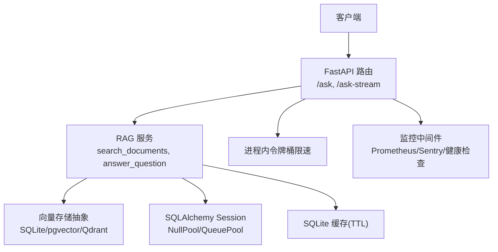
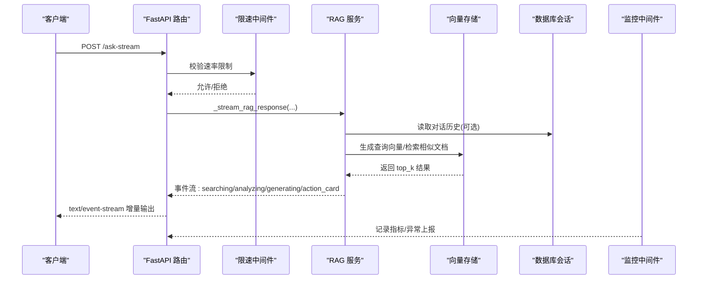
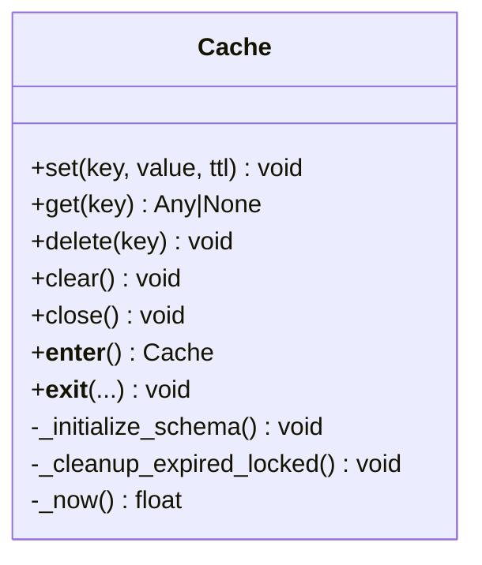
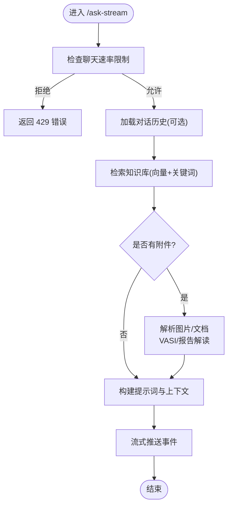
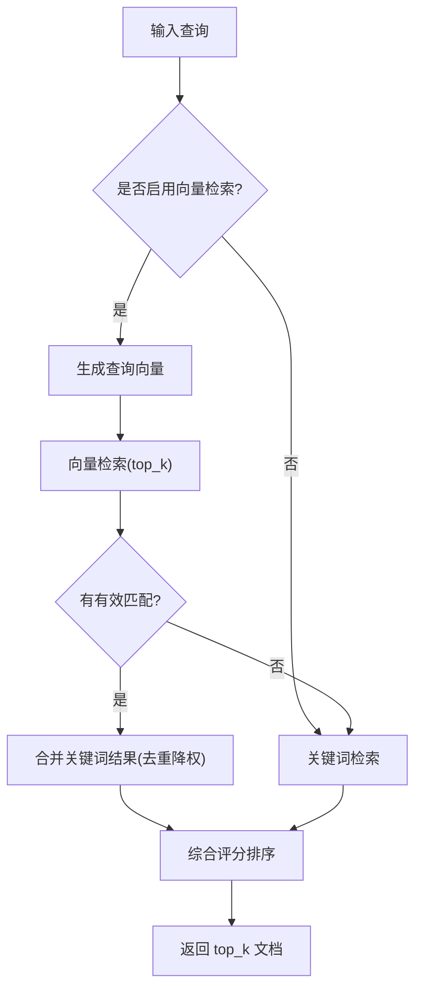
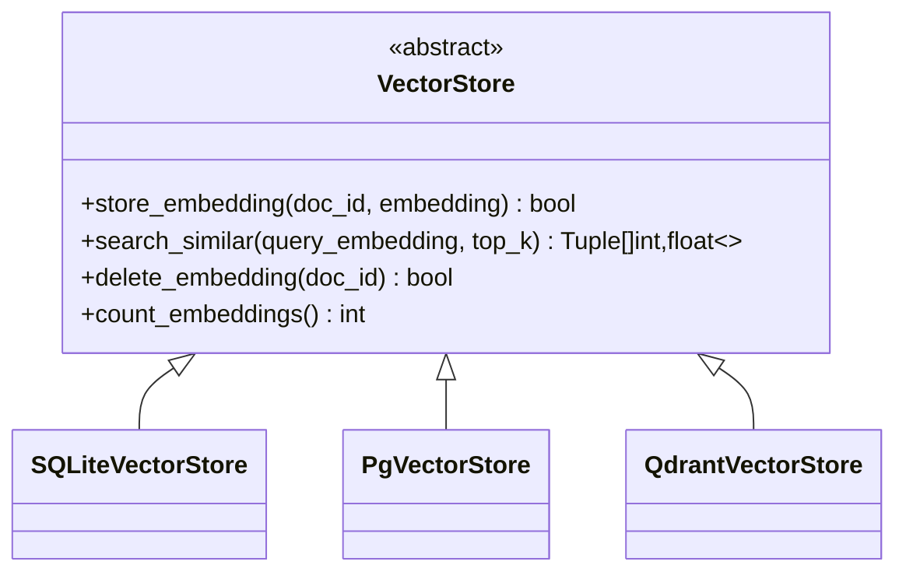
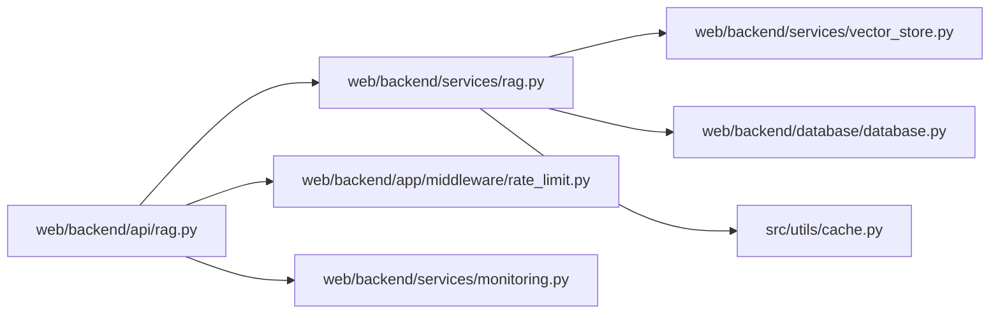

# 性能优化策略

<cite>
**本文引用的文件**   
- [src/utils/cache.py](file://src/utils/cache.py)
- [web/backend/services/rag.py](file://web/backend/services/rag.py)
- [web/backend/api/rag.py](file://web/backend/api/rag.py)
- [web/backend/database/database.py](file://web/backend/database/database.py)
- [web/backend/services/vector_store.py](file://web/backend/services/vector_store.py)
- [web/backend/app/middleware/rate_limit.py](file://web/backend/app/middleware/rate_limit.py)
- [web/backend/services/monitoring.py](file://web/backend/services/monitoring.py)
- [tests/test_cache.py](file://tests/test_cache.py)
</cite>

## 目录
1. [引言](#引言)
2. [项目结构](#项目结构)
3. [核心组件](#核心组件)
4. [架构总览](#架构总览)
5. [详细组件分析](#详细组件分析)
6. [依赖关系分析](#依赖关系分析)
7. [性能考量与调优](#性能考量与调优)
8. [故障排查指南](#故障排查指南)
9. [结论](#结论)
10. [附录：测试与评估方法](#附录测试与评估方法)

## 引言
本技术文档聚焦 Subskin RAG 系统的性能优化，围绕缓存策略、并发处理机制、内存管理与查询优化展开。重点说明多级缓存架构、异步流式响应、连接池配置与数据库查询优化，并给出性能监控指标、瓶颈分析与调优方案，以及可执行的测试方法与效果评估流程。

## 项目结构
RAG 系统的关键路径包括：API 层（请求接入、鉴权、限速）、服务层（检索、向量计算、LLM 调用）、存储层（SQLite/PostgreSQL/Qdrant 向量存储）与监控层（Sentry/Prometheus）。缓存模块为跨爬虫与 API 的通用能力，提供线程安全与 TTL 过期清理。

**图表来源** 
- [web/backend/api/rag.py](file://web/backend/api/rag.py)
- [web/backend/services/rag.py](file://web/backend/services/rag.py)
- [web/backend/services/vector_store.py](file://web/backend/services/vector_store.py)
- [web/backend/database/database.py](file://web/backend/database/database.py)
- [web/backend/app/middleware/rate_limit.py](file://web/backend/app/middleware/rate_limit.py)
- [web/backend/services/monitoring.py](file://web/backend/services/monitoring.py)
- [src/utils/cache.py](file://src/utils/cache.py)

**章节来源**
- [web/backend/api/rag.py](file://web/backend/api/rag.py)
- [web/backend/services/rag.py](file://web/backend/services/rag.py)
- [web/backend/database/database.py](file://web/backend/database/database.py)
- [web/backend/services/vector_store.py](file://web/backend/services/vector_store.py)
- [web/backend/app/middleware/rate_limit.py](file://web/backend/app/middleware/rate_limit.py)
- [web/backend/services/monitoring.py](file://web/backend/services/monitoring.py)
- [src/utils/cache.py](file://src/utils/cache.py)

## 核心组件
- SQLite 缓存（TTL、线程安全、自动清理）
- RAG 检索服务（混合检索：向量+关键词，相似度排序，时效加权）
- 向量存储抽象（SQLite/pgvector/Qdrant）
- 数据库连接与会话管理（SQLite NullPool、超时参数）
- 进程内限速器（按用户/IP 的令牌桶）
- 监控与告警（Sentry、Prometheus、健康检查）

**章节来源**
- [src/utils/cache.py](file://src/utils/cache.py)
- [web/backend/services/rag.py](file://web/backend/services/rag.py)
- [web/backend/services/vector_store.py](file://web/backend/services/vector_store.py)
- [web/backend/database/database.py](file://web/backend/database/database.py)
- [web/backend/app/middleware/rate_limit.py](file://web/backend/app/middleware/rate_limit.py)
- [web/backend/services/monitoring.py](file://web/backend/services/monitoring.py)

## 架构总览
下图展示一次“流式问答”的端到端流程，包含搜索、附件解析、对话历史加载、流式事件推送与限速控制。

**图表来源** 
- [web/backend/api/rag.py](file://web/backend/api/rag.py)
- [web/backend/services/rag.py](file://web/backend/services/rag.py)
- [web/backend/services/vector_store.py](file://web/backend/services/vector_store.py)
- [web/backend/database/database.py](file://web/backend/database/database.py)
- [web/backend/app/middleware/rate_limit.py](file://web/backend/app/middleware/rate_limit.py)
- [web/backend/services/monitoring.py](file://web/backend/services/monitoring.py)

## 详细组件分析

### 多级缓存架构（SQLite TTL 缓存）
- 设计要点
  - 线程安全：全局锁保护读写与过期清理
  - TTL 过期：访问时惰性清理 + 写入前清理
  - JSON 序列化：统一值格式，便于跨语言/进程共享
  - 上下文管理器：简化资源生命周期管理
- 复杂度与影响
  - get/set/delete/clear 均为 O(1) 键操作；过期清理按需触发
  - 适合热点 API 响应、外部 API 结果缓存，显著降低重复计算与 I/O
- 使用建议
  - 合理设置 TTL，避免热键长期占用
  - 大对象缓存需考虑序列化开销与内存峰值
  - 多进程部署建议引入分布式缓存（Redis）以共享状态

**图表来源** 
- [src/utils/cache.py](file://src/utils/cache.py)

**章节来源**
- [src/utils/cache.py](file://src/utils/cache.py)
- [tests/test_cache.py](file://tests/test_cache.py)

### 并发处理与流式响应
- 流式 SSE
  - 服务端逐步推送 thinking/analyzing/generating/action_card 等事件，提升首屏感知速度
  - 通过 headers 禁用代理缓冲，确保实时性
- 会话与权限
  - 会话所有权校验，防止跨用户注入或读取已删除会话
  - 访客与登录用户差异化限速与配额
- 附件处理
  - 临时上传文件带元数据（所有者），严格校验后再解析图片/文档

**图表来源** 
- [web/backend/api/rag.py](file://web/backend/api/rag.py)
- [web/backend/services/rag.py](file://web/backend/services/rag.py)

**章节来源**
- [web/backend/api/rag.py](file://web/backend/api/rag.py)
- [web/backend/services/rag.py](file://web/backend/services/rag.py)

### 内存管理与连接池配置
- SQLite 连接池
  - 使用 NullPool：按需创建连接、用完即关，避免 QueuePool 在高并发下耗尽导致单 worker 冻结
  - 设置 timeout=15 缓解写锁竞争导致的 locked 错误
- 会话管理
  - 每次请求获取独立 SessionLocal，finally 中关闭释放
- 内存优化建议
  - 控制单次查询返回字段，避免全表扫描与大对象
  - 对 embedding 等大字段采用延迟加载或分片读取
  - 流式响应减少一次性构造大响应体

**章节来源**
- [web/backend/database/database.py](file://web/backend/database/database.py)

### 查询优化与混合检索
- 混合检索策略
  - 优先向量检索（可配置开关），失败或无匹配时回退到关键词检索
  - 对无 embedding 或维度不匹配的文档走关键词兜底，保证新内容即时可见
- 评分与排序
  - 基础相似度 × 权威权重 × 时效加权，综合排序
  - 维度不一致时直接丢弃该文档，避免错误排名
- 数据库查询
  - 过滤空 content，减少无效比较
  - 控制 top_k 上限，限制后续 LLM 输入长度

**图表来源** 
- [web/backend/services/rag.py](file://web/backend/services/rag.py)

**章节来源**
- [web/backend/services/rag.py](file://web/backend/services/rag.py)

### 向量存储抽象（SQLite/pgvector/Qdrant）
- 抽象接口
  - store_embedding/search_similar/delete_embedding/count_embeddings
- 后端选择
  - SQLite：JSON 文本列存储，内存计算余弦相似度，适合小规模
  - pgvector：原生向量类型与索引，适合中大规模
  - Qdrant：独立向量库，适合高并发与大规模
- 扩展建议
  - 根据数据规模与并发需求切换后端
  - 对 pgvector 建立 HNSW/IVFFlat 索引，显著提升召回速度

**图表来源** 
- [web/backend/services/vector_store.py](file://web/backend/services/vector_store.py)

**章节来源**
- [web/backend/services/vector_store.py](file://web/backend/services/vector_store.py)

### 限速与配额控制
- 进程内令牌桶
  - 读接口：按 IP 限流
  - 写接口：按用户 ID（或 IP 回退）限流
  - 聊天接口：按用户 ID（或 IP 回退）限流，防止 LLM 成本滥用
- 访客配额
  - 每日固定次数，基于指纹统计与递增/退款逻辑
- 建议
  - 结合 Redis 实现分布式限流，支持多实例一致性
  - 动态调整窗口与阈值，应对突发流量

**章节来源**
- [web/backend/app/middleware/rate_limit.py](file://web/backend/app/middleware/rate_limit.py)
- [web/backend/api/rag.py](file://web/backend/api/rag.py)

### 监控与可观测性
- Sentry 集成
  - 自动捕获异常，过滤敏感头，支持采样率与环境标识
- Prometheus 指标
  - 请求总数、耗时直方图、进行中请求数
  - /metrics 端点供抓取
- 健康检查
  - 数据库连通性、磁盘空间检测

**章节来源**
- [web/backend/services/monitoring.py](file://web/backend/services/monitoring.py)

## 依赖关系分析
- API 层依赖服务层进行业务编排，服务层依赖向量存储与数据库会话
- 监控中间件包裹整个请求链路，采集指标与异常
- 缓存模块被爬虫与 API 复用，降低外部依赖压力

**图表来源** 
- [web/backend/api/rag.py](file://web/backend/api/rag.py)
- [web/backend/services/rag.py](file://web/backend/services/rag.py)
- [web/backend/services/vector_store.py](file://web/backend/services/vector_store.py)
- [web/backend/database/database.py](file://web/backend/database/database.py)
- [web/backend/app/middleware/rate_limit.py](file://web/backend/app/middleware/rate_limit.py)
- [web/backend/services/monitoring.py](file://web/backend/services/monitoring.py)
- [src/utils/cache.py](file://src/utils/cache.py)

**章节来源**
- [web/backend/api/rag.py](file://web/backend/api/rag.py)
- [web/backend/services/rag.py](file://web/backend/services/rag.py)
- [web/backend/services/vector_store.py](file://web/backend/services/vector_store.py)
- [web/backend/database/database.py](file://web/backend/database/database.py)
- [web/backend/app/middleware/rate_limit.py](file://web/backend/app/middleware/rate_limit.py)
- [web/backend/services/monitoring.py](file://web/backend/services/monitoring.py)
- [src/utils/cache.py](file://src/utils/cache.py)

## 性能考量与调优
- 缓存命中率
  - 目标：热点查询命中率 > 80%，TTL 按数据更新频率设定
  - 监控：缓存命中/未命中计数、平均 TTL 命中分布
- 向量检索性能
  - 小规模：SQLite JSON 列 + 内存余弦计算，top_k 控制在 5–10
  - 中大规模：迁移至 pgvector/Qdrant，建立近似最近邻索引
  - 监控：检索耗时、相似度计算耗时、top_k 分布
- 数据库连接与锁竞争
  - SQLite：NullPool + timeout=15，避免写锁阻塞
  - PostgreSQL：启用连接池预热、查询计划分析、慢查询日志
- 流式响应与网络
  - 禁用代理缓冲，减小首字节延迟
  - 控制事件大小与频率，避免前端渲染抖动
- 内存峰值
  - 避免一次性加载全部 embedding 或大文档
  - 使用分页与懒加载，及时释放会话与临时文件

[本节为通用指导，无需具体文件引用]

## 故障排查指南
- 常见问题
  - database is locked：检查 SQLite 写锁等待时间，适当增大 timeout；减少并发写
  - 向量维度不匹配：cosine_similarity 返回 0 并记录警告，应回退关键词检索
  - 限速频繁触发：检查用户/IP 基数与阈值，必要时扩容或调整窗口
  - 监控缺失：确认 Sentry DSN、Prometheus 环境变量与中间件注册
- 定位手段
  - 查看 /metrics 端点与 Sentry 事件
  - 增加关键路径日志（检索耗时、向量生成、LLM 调用）
  - 使用健康检查端点验证数据库与磁盘状态

**章节来源**
- [web/backend/database/database.py](file://web/backend/database/database.py)
- [web/backend/services/rag.py](file://web/backend/services/rag.py)
- [web/backend/app/middleware/rate_limit.py](file://web/backend/app/middleware/rate_limit.py)
- [web/backend/services/monitoring.py](file://web/backend/services/monitoring.py)

## 结论
通过多级缓存、混合检索、流式响应、连接池优化与完善的监控体系，Subskin RAG 系统在吞吐、延迟与稳定性方面具备良好基线。下一步可按数据规模与并发需求升级向量存储后端，并结合分布式缓存与限流进一步提升整体性能。

[本节为总结，无需具体文件引用]

## 附录：测试与评估方法
- 缓存单元测试
  - 覆盖命中/未命中、TTL 过期、删除与清空、线程安全
- RAG 功能测试
  - 验证混合检索与回退逻辑、事件流顺序、附件解析与权限校验
- 基准测试建议
  - 压测工具：locust/k6
  - 指标：P50/P95 延迟、QPS、错误率、缓存命中率、向量检索耗时
  - 场景：并发问答、批量上传解析、高频检索
- 效果评估
  - 对比优化前后关键指标变化，形成报告并纳入回归测试

**章节来源**
- [tests/test_cache.py](file://tests/test_cache.py)
- [web/backend/test_rag_qa.py](file://web/backend/test_rag_qa.py)