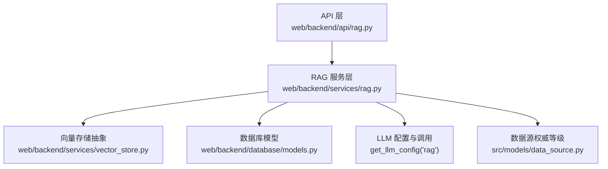
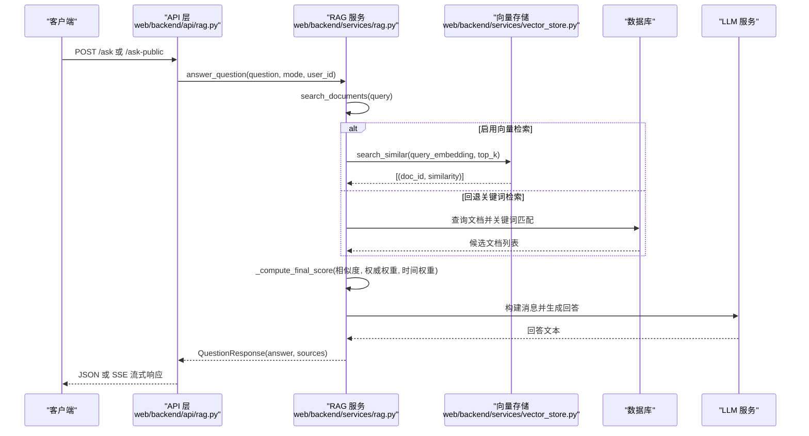
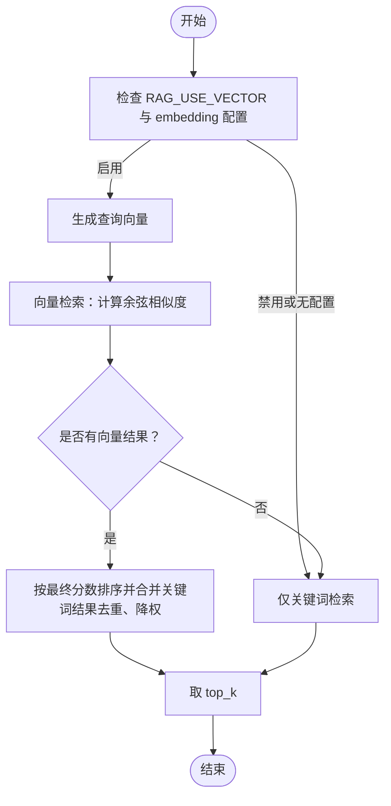
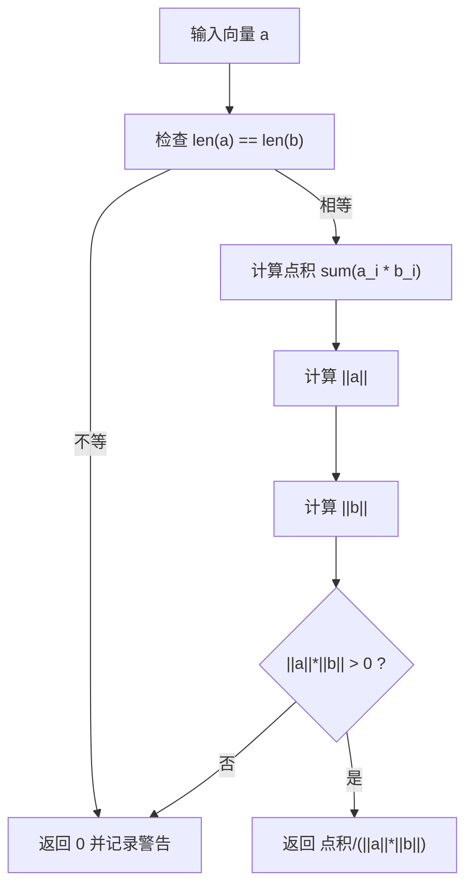
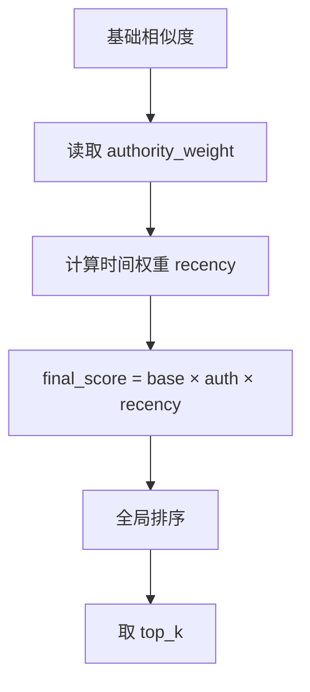
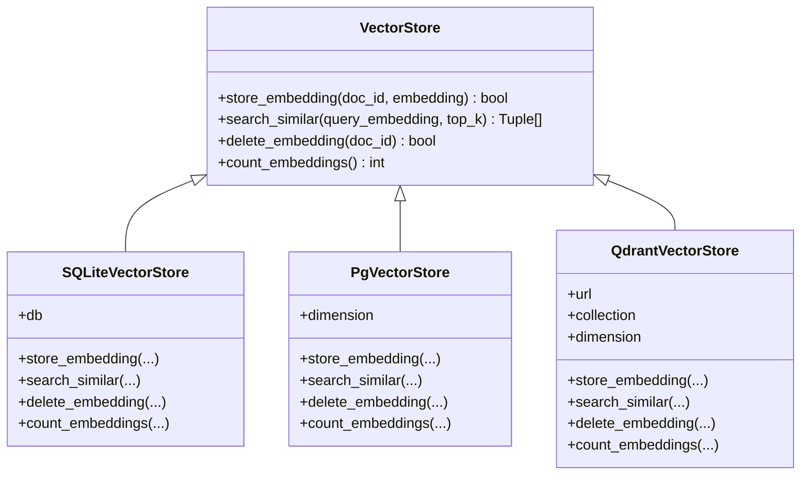
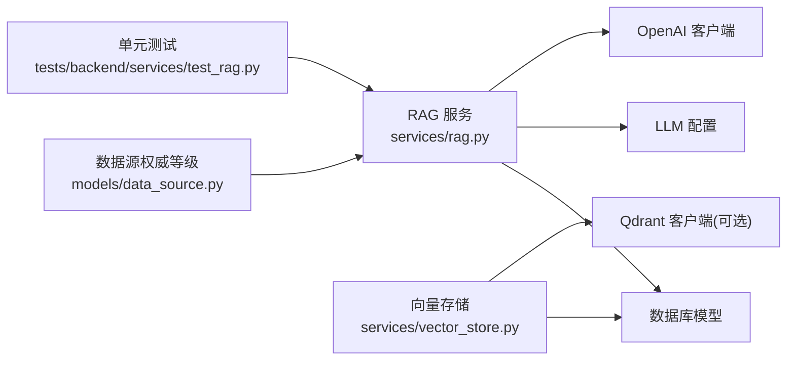

# 检索算法实现

<cite>
**本文引用的文件**
- [web/backend/services/rag.py](file://web/backend/services/rag.py)
- [web/backend/api/rag.py](file://web/backend/api/rag.py)
- [web/backend/models/rag.py](file://web/backend/models/rag.py)
- [web/backend/services/vector_store.py](file://web/backend/services/vector_store.py)
- [src/models/data_source.py](file://src/models/data_source.py)
- [tests/backend/services/test_rag.py](file://tests/backend/services/test_rag.py)
</cite>

## 目录
1. [简介](#简介)
2. [项目结构](#项目结构)
3. [核心组件](#核心组件)
4. [架构总览](#架构总览)
5. [详细组件分析](#详细组件分析)
6. [依赖关系分析](#依赖关系分析)
7. [性能与可扩展性](#性能与可扩展性)
8. [故障排查指南](#故障排查指南)
9. [结论](#结论)
10. [附录：参数调优与评估指标](#附录参数调优与评估指标)

## 简介
本技术文档聚焦 Subskin 项目的 RAG（检索增强生成）检索算法，系统性阐述混合检索策略（向量检索 + 关键词检索）、相似度计算、结果排序与重排机制，并深入说明余弦相似度、相关性评分模型、时间权重调整与权威性加权策略。同时给出检索质量评估指标、召回率优化与准确率提升方案，以及可操作的参数调优指南和实现要点路径。

## 项目结构
RAG 检索相关代码主要分布在后端服务层与 API 层：
- 检索与服务编排：web/backend/services/rag.py
- API 路由与流式响应：web/backend/api/rag.py
- 数据模型定义：web/backend/models/rag.py
- 向量存储抽象与多后端支持：web/backend/services/vector_store.py
- 数据来源权威等级与权重约定：src/models/data_source.py
- 单元测试覆盖部分逻辑：tests/backend/services/test_rag.py

**图表来源**
- [web/backend/api/rag.py:246-330](file://web/backend/api/rag.py#L246-L330)
- [web/backend/services/rag.py:456-522](file://web/backend/services/rag.py#L456-L522)
- [web/backend/services/vector_store.py:25-110](file://web/backend/services/vector_store.py#L25-L110)
- [src/models/data_source.py:12-22](file://src/models/data_source.py#L12-L22)

**章节来源**
- [web/backend/api/rag.py:246-330](file://web/backend/api/rag.py#L246-L330)
- [web/backend/services/rag.py:456-522](file://web/backend/services/rag.py#L456-L522)
- [web/backend/services/vector_store.py:25-110](file://web/backend/services/vector_store.py#L25-L110)
- [src/models/data_source.py:12-22](file://src/models/data_source.py#L12-L22)

## 核心组件
- 混合检索入口：search_documents(db, query, top_k)
  - 根据环境变量与 LLM 配置决定是否启用向量检索；若禁用或无 embedding 配置则回退到关键词检索。
  - 向量检索失败时自动降级为关键词检索，保证可用性。
- 关键词检索：_keyword_search(db, query, top_k)
  - 基于正则分词与标题+内容匹配度打分，结合最终评分函数进行排序。
- 相似度计算：cosine_similarity(a, b)
  - 严格维度校验，维度不匹配返回 0 并记录警告，避免错误排名。
- 相关性评分与重排：_compute_final_score(base_similarity, doc)
  - 将基础相似度与权威性权重、时间权重相乘得到最终分数，用于统一排序。
- 向量存储抽象：VectorStore 及 SQLite/PgVector/Qdrant 实现
  - 提供统一的 store/search/delete/count 接口，当前默认 SQLite 在内存中计算余弦相似度。
- 数据源权威等级：AuthorityTier 与 authority_weight
  - S/A/B/C/D 五级权威等级对应不同权重乘数，影响最终排序。

**章节来源**
- [web/backend/services/rag.py:387-430](file://web/backend/services/rag.py#L387-L430)
- [web/backend/services/rag.py:433-522](file://web/backend/services/rag.py#L433-L522)
- [web/backend/services/vector_store.py:25-110](file://web/backend/services/vector_store.py#L25-L110)
- [src/models/data_source.py:12-22](file://src/models/data_source.py#L12-L22)

## 架构总览
RAG 检索流程从 API 层进入，调用服务层执行混合检索，再构建提示词并调用 LLM 生成回答。向量存储抽象层屏蔽底层差异，支持 SQLite、PostgreSQL+pgvector、Qdrant。

**图表来源**
- [web/backend/api/rag.py:246-330](file://web/backend/api/rag.py#L246-L330)
- [web/backend/services/rag.py:1365-1446](file://web/backend/services/rag.py#L1365-L1446)
- [web/backend/services/vector_store.py:71-90](file://web/backend/services/vector_store.py#L71-L90)

## 详细组件分析

### 混合检索策略（向量检索 + 关键词检索）
- 向量检索开关与配置读取
  - 通过环境变量 RAG_USE_VECTOR 控制是否启用向量检索。
  - 使用 get_llm_config("rag") 判断是否具备 embedding 能力，避免与默认模块配置不一致导致误判。
- 向量检索流程
  - 生成查询向量后遍历文档 embedding，计算余弦相似度；维度不匹配的文档被跳过，确保不被错误排名。
  - 对有效结果按最终分数排序取 top_k。
- 关键词检索流程
  - 正则提取中英文词元，统计命中比例作为基础得分，再应用最终评分函数。
  - 若无关键词命中，给予低基础分并限制数量，保证兜底召回。
- 合并策略
  - 向量结果优先；未命中文档通过关键词检索补充，并按 ID 去重，关键词结果分数乘以 0.8 以让真实向量匹配占优。
  - 若向量结果为空，直接回退到关键词检索。

**图表来源**
- [web/backend/services/rag.py:456-522](file://web/backend/services/rag.py#L456-L522)

**章节来源**
- [web/backend/services/rag.py:456-522](file://web/backend/services/rag.py#L456-L522)

### 相似度计算方法（余弦相似度）
- 维度一致性校验
  - 若查询向量与文档向量维度不一致，返回 0 并记录警告，避免 zip 截断导致的“看似合理但错误”的相似度。
- 计算公式
  - 标准余弦相似度：点积除以范数乘积；任一范数为 0 时返回 0。
- 应用场景
  - 在 search_documents 与 SQLiteVectorStore.search_similar 中均使用该函数，确保一致性与安全性。

**图表来源**
- [web/backend/services/rag.py:387-401](file://web/backend/services/rag.py#L387-L401)

**章节来源**
- [web/backend/services/rag.py:387-401](file://web/backend/services/rag.py#L387-L401)

### 结果排序与重排机制（相关性评分模型）
- 基础相似度
  - 向量检索：余弦相似度；关键词检索：词元命中率。
- 权威性加权
  - 从文档字段 authority_weight 读取权重，缺失或非法时回退为 1.0。
- 时间权重调整
  - 根据 pub_date 计算年龄区间，近一年 1.1，1-3年 1.0，超过 3年 0.9；无法解析日期时回退为 1.0。
- 最终评分
  - final_score = base_similarity × authority_weight × recency_boost
  - 统一排序后取 top_k；关键词结果在合并时乘以 0.8 以保证向量匹配优先。

**图表来源**
- [web/backend/services/rag.py:404-430](file://web/backend/services/rag.py#L404-L430)
- [web/backend/services/rag.py:433-522](file://web/backend/services/rag.py#L433-L522)

**章节来源**
- [web/backend/services/rag.py:404-430](file://web/backend/services/rag.py#L404-L430)
- [web/backend/services/rag.py:433-522](file://web/backend/services/rag.py#L433-L522)

### 向量存储抽象与多后端
- 抽象接口
  - VectorStore 定义 store_embedding、search_similar、delete_embedding、count_embeddings。
- SQLite 实现
  - 使用 Text 列存储 JSON 格式的 embedding，内存中计算余弦相似度，适合小规模数据。
- PgVector 与 Qdrant
  - 预留扩展接口，PgVector 尚未完全实现会回退到 SQLite；Qdrant 通过独立服务提供高并发大规模检索。
- 选择策略
  - 通过环境变量 VECTOR_STORE_BACKEND 选择后端；VECTOR_STORE_DIMENSION 指定向量维度。

**图表来源**
- [web/backend/services/vector_store.py:25-110](file://web/backend/services/vector_store.py#L25-L110)
- [web/backend/services/vector_store.py:112-155](file://web/backend/services/vector_store.py#L112-L155)
- [web/backend/services/vector_store.py:157-243](file://web/backend/services/vector_store.py#L157-L243)

**章节来源**
- [web/backend/services/vector_store.py:25-110](file://web/backend/services/vector_store.py#L25-L110)
- [web/backend/services/vector_store.py:112-155](file://web/backend/services/vector_store.py#L112-L155)
- [web/backend/services/vector_store.py:157-243](file://web/backend/services/vector_store.py#L157-L243)

### API 与流式响应
- 已登录用户提问：/ask
  - 校验问题长度、会话所有权、用户级速率限制，调用 answer_question 并返回结构化响应。
- 访客免费提问：/ask-public
  - 话题相关性校验（白癜风/皮肤健康或网站功能），每日次数限制，调用 answer_question 并附加剩余配额信息。
- 流式问答：/ask-stream 与 /ask-public-stream
  - 使用 StreamingResponse 推送 SSE 事件，包含搜索、分析、生成等阶段状态，支持附件分析与动作卡片。

**章节来源**
- [web/backend/api/rag.py:246-330](file://web/backend/api/rag.py#L246-L330)
- [web/backend/api/rag.py:534-629](file://web/backend/api/rag.py#L534-L629)

## 依赖关系分析
- 服务层依赖
  - rag.py 依赖 database models（Document、Message、Conversation 等）、llm_config、openai 客户端。
  - vector_store.py 依赖 database models 与可选第三方库（qdrant-client）。
- 数据源权威等级
  - data_source.py 定义 AuthorityTier 与 authority_weight，指导检索排序中的权威性加权。
- 测试覆盖
  - test_rag.py 覆盖报告类型识别、LLM 不可用时的回退行为、用户上下文构建与注入等关键路径。

**图表来源**
- [web/backend/services/rag.py:18-31](file://web/backend/services/rag.py#L18-L31)
- [web/backend/services/vector_store.py:16-22](file://web/backend/services/vector_store.py#L16-L22)
- [src/models/data_source.py:12-22](file://src/models/data_source.py#L12-L22)
- [tests/backend/services/test_rag.py:1-232](file://tests/backend/services/test_rag.py#L1-L232)

**章节来源**
- [web/backend/services/rag.py:18-31](file://web/backend/services/rag.py#L18-L31)
- [web/backend/services/vector_store.py:16-22](file://web/backend/services/vector_store.py#L16-L22)
- [src/models/data_source.py:12-22](file://src/models/data_source.py#L12-L22)
- [tests/backend/services/test_rag.py:1-232](file://tests/backend/services/test_rag.py#L1-L232)

## 性能与可扩展性
- 性能特征
  - 向量检索在 SQLite 模式下为全表扫描 + 内存相似度计算，适合小规模数据；随着文档量增长，建议迁移至 pgvector 或 Qdrant 以获得索引加速。
  - 关键词检索为字符串匹配，复杂度与文档数量和词元数量线性相关。
- 可扩展性
  - 通过环境变量切换后端，无需修改业务逻辑；Qdrant 模式支持高并发与大规模检索。
  - 增量向量化：batch_embed_unembedded 支持每月批量补算 embedding，避免新文档长期不可检索。
- 资源与成本
  - 向量检索与 LLM 调用均有外部 API 成本；建议在高频场景缓存热门查询结果或采用更高效的向量后端。

[本节为通用性能讨论，不直接分析具体文件]

## 故障排查指南
- 常见问题与定位
  - 向量维度不匹配：cosine_similarity 返回 0 并记录警告，需检查 embedding 生成与存储过程。
  - 向量检索失败：自动降级关键词检索，检查 LLM 配置与网络连通性。
  - 权限与会话：/ask 与 /ask-stream 校验会话所有权与用户限速，异常时返回 403/429。
  - 访客配额：/ask-public 与 /ask-public-stream 每日限额，超限返回 429。
- 日志与调试
  - 关注 cosine_similarity 警告、embedding 生成失败日志、chat API 调用失败日志。
  - 使用单元测试验证报告类型识别与 LLM 不可用时的回退行为。

**章节来源**
- [web/backend/services/rag.py:387-401](file://web/backend/services/rag.py#L387-L401)
- [web/backend/services/rag.py:456-476](file://web/backend/services/rag.py#L456-L476)
- [web/backend/api/rag.py:228-243](file://web/backend/api/rag.py#L228-L243)
- [web/backend/api/rag.py:273-330](file://web/backend/api/rag.py#L273-L330)
- [tests/backend/services/test_rag.py:35-48](file://tests/backend/services/test_rag.py#L35-L48)

## 结论
Subskin 的 RAG 检索实现了稳健的混合检索策略：在向量检索可用时优先语义匹配，否则回退到关键词检索；通过权威性与时间权重对结果进行重排，兼顾准确性与时效性。向量存储抽象层支持多后端，便于随数据规模演进。配合完善的 API 限流与会话安全校验，整体系统具备良好的可用性与可扩展性。

[本节为总结性内容，不直接分析具体文件]

## 附录：参数调优与评估指标

### 参数调优指南
- 混合检索开关
  - RAG_USE_VECTOR：true/false，控制是否启用向量检索。
  - 建议在高维语义匹配需求开启，低资源环境可关闭以降低成本。
- 向量后端
  - VECTOR_STORE_BACKEND：sqlite/pgvector/qdrant，按数据规模与性能需求选择。
  - VECTOR_STORE_DIMENSION：与 embedding 模型维度一致，避免维度不匹配。
- 权威性与时间权重
  - authority_weight：依据数据源权威等级设置，S/A/B/C/D 对应不同乘数。
  - 时间权重函数可根据业务需求调整阈值（如近一年、1-3年、超过3年）。
- 关键词检索降权
  - 合并时关键词结果乘以 0.8，可根据实际效果微调该系数。
- 流式与超时
  - 流式响应适用于长答案；注意上游代理（如 Nginx）缓冲配置，避免中断。

**章节来源**
- [web/backend/services/rag.py:456-522](file://web/backend/services/rag.py#L456-L522)
- [web/backend/services/vector_store.py:245-266](file://web/backend/services/vector_store.py#L245-L266)
- [src/models/data_source.py:12-22](file://src/models/data_source.py#L12-L22)

### 检索质量评估指标
- 召回率（Recall@K）
  - 衡量前 K 个结果中包含相关文档的比例；可通过人工标注或规则匹配估算。
- 准确率（Precision@K）
  - 前 K 个结果中相关文档的比例；结合权威性与时间权重可提升精度。
- MRR（Mean Reciprocal Rank）
  - 首个相关文档位置的倒数均值，反映首答质量。
- NDCG（Normalized Discounted Cumulative Gain）
  - 考虑排序位置与相关度等级的综合指标，适合多级相关度场景。
- 覆盖率（Coverage）
  - 有 embedding 的文档占比；无 embedding 文档通过关键词检索兜底，需监控其贡献。
- 延迟与吞吐
  - 向量检索与 LLM 调用耗时；高峰期需评估并发与限流策略。

[本节为通用评估指标说明，不直接分析具体文件]

### 召回率优化与准确率提升方案
- 召回率优化
  - 扩大关键词匹配范围（如增加同义词、别名）；提高关键词检索的基础分阈值。
  - 对无 embedding 文档及时补算，减少“不可见”文档比例。
  - 降低关键词结果降权系数（如从 0.8 提升到 0.9），增强兜底召回。
- 准确率提升
  - 强化权威性与时间权重：提高 S/A 级来源权重，适当降低陈旧文档权重。
  - 引入更多语义特征：改进 embedding 模型或增加查询改写（如术语标准化）。
  - 重排策略：结合用户上下文与历史对话，动态调整排序。

**章节来源**
- [web/backend/services/rag.py:404-430](file://web/backend/services/rag.py#L404-L430)
- [web/backend/services/rag.py:433-522](file://web/backend/services/rag.py#L433-L522)
- [web/backend/services/rag.py:1493-1559](file://web/backend/services/rag.py#L1493-L1559)