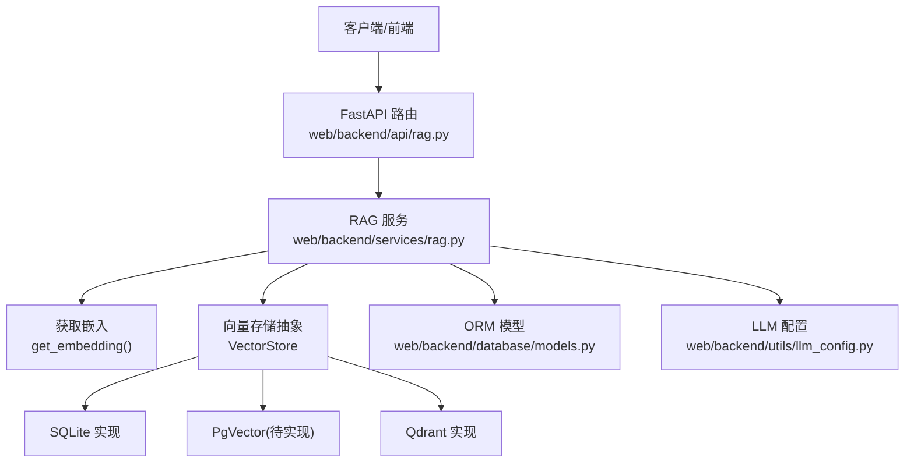
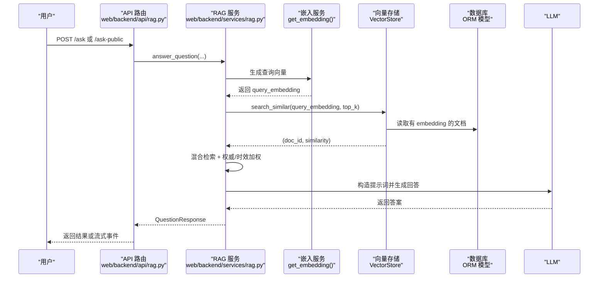
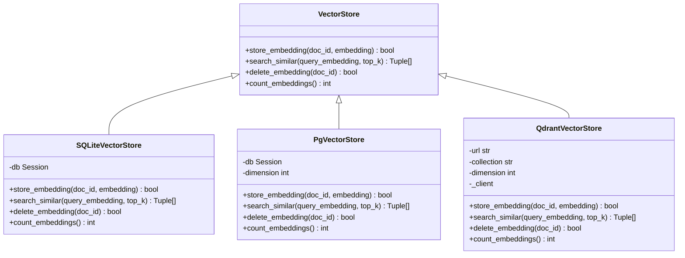
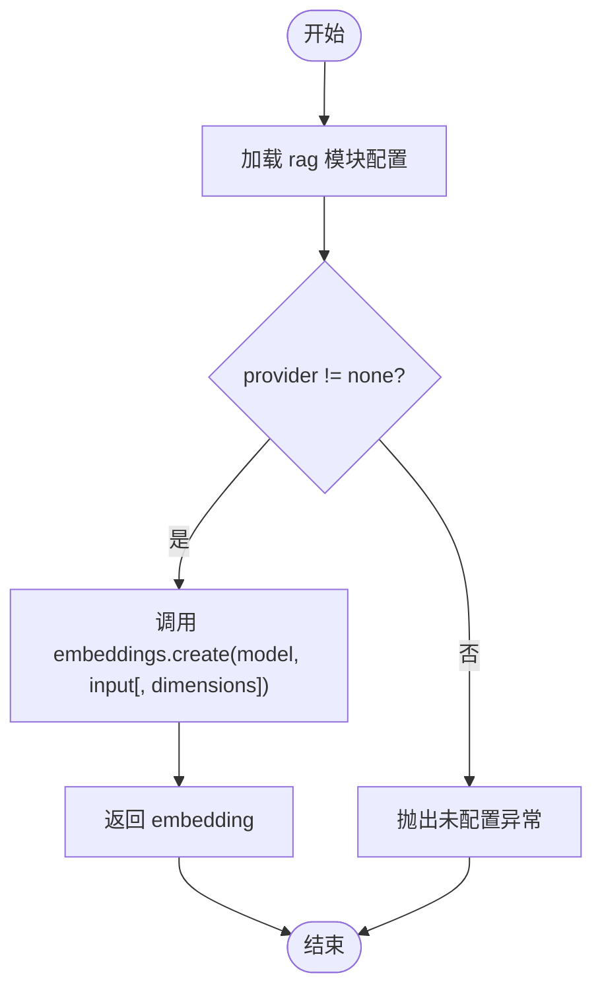
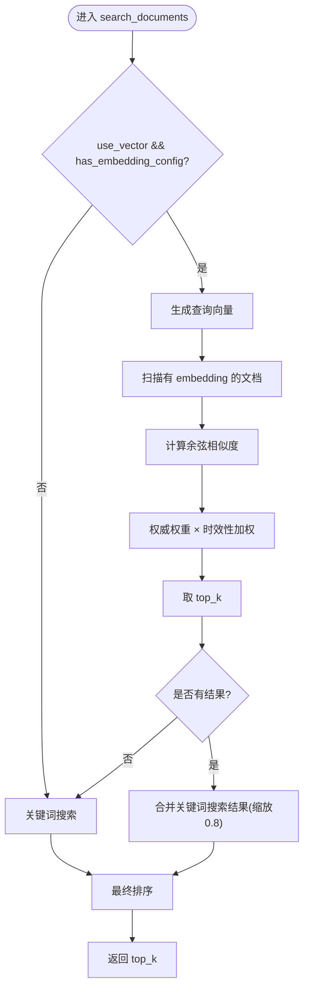
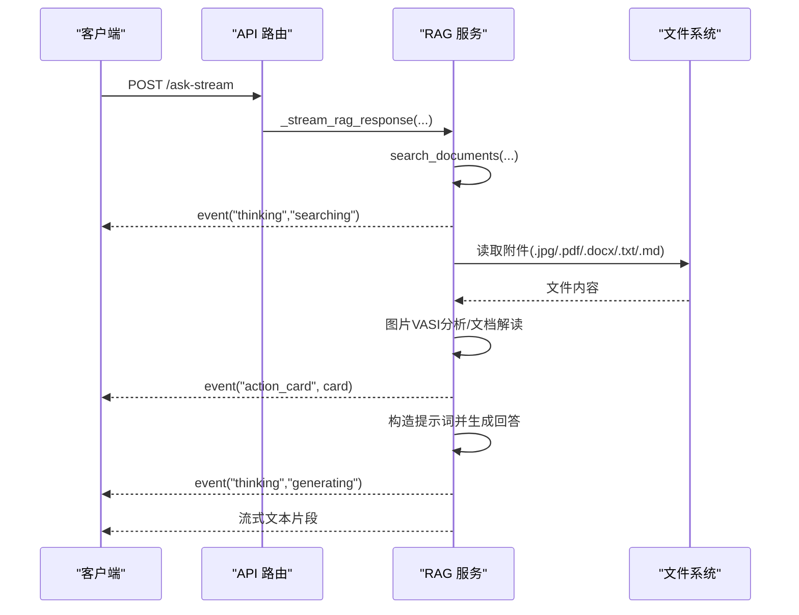
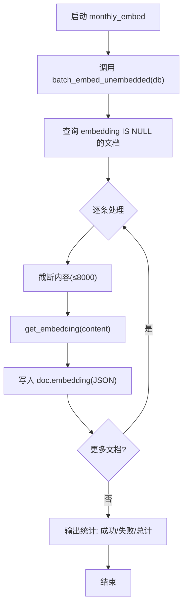
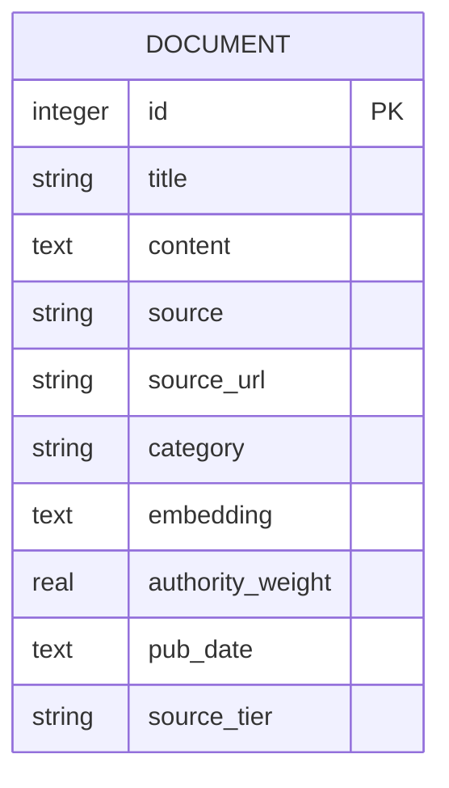
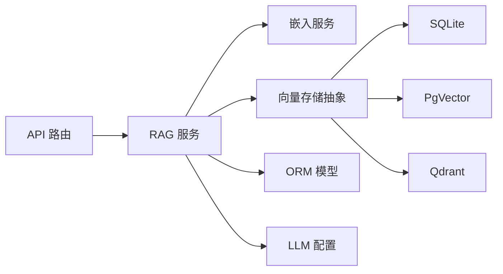

# 向量化处理流程

<cite>
**本文引用的文件**
- [web/backend/services/vector_store.py](file://web/backend/services/vector_store.py)
- [web/backend/services/rag.py](file://web/backend/services/rag.py)
- [web/backend/api/rag.py](file://web/backend/api/rag.py)
- [web/backend/models/rag.py](file://web/backend/models/rag.py)
- [web/backend/utils/llm_config.py](file://web/backend/utils/llm_config.py)
- [web/backend/scripts/monthly_embed.py](file://web/backend/scripts/monthly_embed.py)
- [web/backend/database/models.py](file://web/backend/database/models.py)
</cite>

## 目录
1. [简介](#简介)
2. [项目结构](#项目结构)
3. [核心组件](#核心组件)
4. [架构总览](#架构总览)
5. [详细组件分析](#详细组件分析)
6. [依赖关系分析](#依赖关系分析)
7. [性能考量](#性能考量)
8. [故障排查指南](#故障排查指南)
9. [结论](#结论)
10. [附录](#附录)

## 简介
本技术文档聚焦 Subskin 的向量化处理流程，覆盖文本嵌入向量生成、向量存储管理、相似度检索与 RAG（检索增强生成）知识增强机制。文档从系统架构出发，逐步深入到关键组件的实现细节，包括向量模型选择、嵌入维度配置、索引构建策略、检索优化技术、向量数据库集成、批量处理管道、增量更新方案以及性能监控指标，并提供可操作的示例路径与评估方法，帮助读者快速理解并落地使用。

## 项目结构
Subskin 的向量化与 RAG 能力主要分布在后端服务层：
- 向量存储抽象层：提供统一接口，支持 SQLite、PostgreSQL+pgvector、Qdrant 三种后端。
- RAG 服务：负责查询向量化、相似度计算、混合检索（向量+关键词）、提示词构建与问答编排。
- API 层：对外暴露问答、流式回答、临时文件上传等接口，串联检索与 LLM 调用。
- 配置与工具：LLM 配置读取、时间工具等。
- 脚本：月度增量向量化脚本，用于对无 embedding 的文档进行批量补全。
- 数据模型：Document 等 ORM 模型定义，承载 embedding 字段与权重信息。

**图表来源**
- [web/backend/api/rag.py:246-330](file://web/backend/api/rag.py#L246-L330)
- [web/backend/services/rag.py:354-401](file://web/backend/services/rag.py#L354-L401)
- [web/backend/services/vector_store.py:25-266](file://web/backend/services/vector_store.py#L25-L266)
- [web/backend/utils/llm_config.py:8-135](file://web/backend/utils/llm_config.py#L8-L135)
- [web/backend/database/models.py:1-200](file://web/backend/database/models.py#L1-L200)

**章节来源**
- [web/backend/api/rag.py:246-330](file://web/backend/api/rag.py#L246-L330)
- [web/backend/services/rag.py:354-401](file://web/backend/services/rag.py#L354-L401)
- [web/backend/services/vector_store.py:25-266](file://web/backend/services/vector_store.py#L25-L266)
- [web/backend/utils/llm_config.py:8-135](file://web/backend/utils/llm_config.py#L8-L135)
- [web/backend/database/models.py:1-200](file://web/backend/database/models.py#L1-L200)

## 核心组件
- 向量存储抽象层（VectorStore）：定义统一的存储/检索/删除/计数接口，屏蔽后端差异。
- SQLite 向量存储：当前默认实现，将 embedding 以 JSON 字符串存储在 Text 列，内存中计算余弦相似度，适合小规模数据。
- PgVector 向量存储：预留扩展点，计划使用 pgvector 原生向量类型与 HNSW/IVFFlat 索引，适合中大规模数据。
- Qdrant 向量存储：独立向量数据库服务，适合高并发与大规模场景。
- RAG 服务：
  - get_embedding：通过 OpenAI 兼容接口调用 embedding 模型，支持百炼 dimensions 参数。
  - cosine_similarity：安全计算余弦相似度，维度不匹配时返回 0 并记录日志。
  - search_documents：混合检索（向量优先 + 关键词兜底），结合权威权重与时效性加权。
  - 提示词构建：智能问答与陪伴模式，严格的数据来源优先级与隐私保护规则。
- API 层：
  - /ask、/ask-public：同步问答，含访客配额限制与话题过滤。
  - /ask-stream、/ask-public-stream：流式 SSE 响应，分阶段输出“搜索/分析/生成”状态。
  - 临时文件上传与确认动作：支持图片 VASI 分析与报告解读卡片。
- 配置与工具：
  - llm_config：按环境变量或模块配置动态选择 provider、embedding_model、dimensions。
- 脚本：
  - monthly_embed：每月增量向量化，仅处理 embedding IS NULL 的文档。

**章节来源**
- [web/backend/services/vector_store.py:25-266](file://web/backend/services/vector_store.py#L25-L266)
- [web/backend/services/rag.py:354-401](file://web/backend/services/rag.py#L354-L401)
- [web/backend/services/rag.py:456-523](file://web/backend/services/rag.py#L456-L523)
- [web/backend/api/rag.py:246-330](file://web/backend/api/rag.py#L246-L330)
- [web/backend/api/rag.py:534-629](file://web/backend/api/rag.py#L534-L629)
- [web/backend/utils/llm_config.py:8-135](file://web/backend/utils/llm_config.py#L8-L135)
- [web/backend/scripts/monthly_embed.py:1-37](file://web/backend/scripts/monthly_embed.py#L1-L37)

## 架构总览
下图展示了从用户提问到答案生成的完整链路，包含向量检索、混合排序与 LLM 生成。

**图表来源**
- [web/backend/api/rag.py:246-330](file://web/backend/api/rag.py#L246-L330)
- [web/backend/services/rag.py:354-401](file://web/backend/services/rag.py#L354-L401)
- [web/backend/services/rag.py:456-523](file://web/backend/services/rag.py#L456-L523)
- [web/backend/services/vector_store.py:71-90](file://web/backend/services/vector_store.py#L71-L90)
- [web/backend/database/models.py:1-200](file://web/backend/database/models.py#L1-L200)

## 详细组件分析

### 向量存储抽象层与后端实现
- 抽象基类 VectorStore：定义 store_embedding、search_similar、delete_embedding、count_embeddings。
- SQLiteVectorStore：
  - 存储：将 embedding 序列化为 JSON 写入 Document.embedding。
  - 检索：加载所有非空 embedding，内存中计算余弦相似度，排序取 top_k。
  - 删除：将 embedding 置空。
  - 统计：计数非空 embedding 数量。
- PgVectorStore：预留扩展点，当前回退到 SQLite；建议升级至 pgvector 并使用 HNSW/IVFFlat 索引。
- QdrantVectorStore：
  - 自动创建集合（COSINE 距离）。
  - upsert 点向量，search 返回 id 与 score，delete 支持点选择器。
  - count 返回 points_count。

**图表来源**
- [web/backend/services/vector_store.py:25-266](file://web/backend/services/vector_store.py#L25-L266)

**章节来源**
- [web/backend/services/vector_store.py:25-266](file://web/backend/services/vector_store.py#L25-L266)

### 嵌入生成与相似度计算
- get_embedding：
  - 通过 OpenAI 兼容接口调用 embedding 模型。
  - 支持百炼 text-embedding-v4/v3 的 dimensions 参数。
  - 读取 rag 模块配置（provider/base_url/embedding_model/dimensions）。
- cosine_similarity：
  - 维度不一致时返回 0 并记录警告，避免错误排名。
  - 计算点积与范数，归一化得到余弦相似度。

**图表来源**
- [web/backend/services/rag.py:354-384](file://web/backend/services/rag.py#L354-L384)
- [web/backend/utils/llm_config.py:8-135](file://web/backend/utils/llm_config.py#L8-L135)

**章节来源**
- [web/backend/services/rag.py:354-401](file://web/backend/services/rag.py#L354-L401)
- [web/backend/utils/llm_config.py:8-135](file://web/backend/utils/llm_config.py#L8-L135)

### 混合检索与评分策略
- search_documents：
  - 若关闭向量或未配置 embedding，则回退为关键词搜索。
  - 生成查询向量后，遍历有 embedding 的文档计算相似度，合并权威权重与时效性加权。
  - 对无有效 embedding 的文档，通过关键词搜索兜底，并按 0.8 系数缩放分数，确保新内容可被检索。
- _compute_final_score：
  - 综合 authority_weight 与 recency_boost（近一年权重略高，较旧内容略降）。

**图表来源**
- [web/backend/services/rag.py:456-523](file://web/backend/services/rag.py#L456-L523)
- [web/backend/services/rag.py:404-431](file://web/backend/services/rag.py#L404-L431)

**章节来源**
- [web/backend/services/rag.py:456-523](file://web/backend/services/rag.py#L456-L523)
- [web/backend/services/rag.py:404-431](file://web/backend/services/rag.py#L404-L431)

### API 流式问答与附件处理
- /ask、/ask-public：同步问答，访客需通过话题校验与每日配额限制。
- /ask-stream、/ask-public-stream：SSE 流式响应，分阶段输出“搜索/分析/生成”状态。
- 附件处理：
  - 图片：调用 VASI 分析，生成 action_card 并推送。
  - 文档：提取文本并解读，生成报告卡片。
  - 权限控制：临时文件附带 .meta 所有者校验，访客禁止附件分析。

**图表来源**
- [web/backend/api/rag.py:534-629](file://web/backend/api/rag.py#L534-L629)
- [web/backend/api/rag.py:632-800](file://web/backend/api/rag.py#L632-L800)

**章节来源**
- [web/backend/api/rag.py:246-330](file://web/backend/api/rag.py#L246-L330)
- [web/backend/api/rag.py:534-629](file://web/backend/api/rag.py#L534-L629)
- [web/backend/api/rag.py:632-800](file://web/backend/api/rag.py#L632-L800)

### 批量与增量向量化
- monthly_embed：
  - 每月定时任务（systemd timer），调用 batch_embed_unembedded。
  - 仅处理 embedding IS NULL 的文档，避免重复计算。
- batch_embed_unembedded：
  - 读取无 embedding 的文档，截断内容（≤8000 字符）。
  - 调用 get_embedding 生成向量并持久化。
  - 每 10 条打印进度，失败计数与成功计数汇总。

**图表来源**
- [web/backend/scripts/monthly_embed.py:1-37](file://web/backend/scripts/monthly_embed.py#L1-L37)
- [web/backend/services/rag.py:1493-1535](file://web/backend/services/rag.py#L1493-L1535)

**章节来源**
- [web/backend/scripts/monthly_embed.py:1-37](file://web/backend/scripts/monthly_embed.py#L1-L37)
- [web/backend/services/rag.py:1493-1535](file://web/backend/services/rag.py#L1493-L1535)

### 数据模型与存储结构
- Document 模型：
  - 包含 title、content、source、source_url、category 等字段。
  - embedding 字段存储 JSON 格式的向量。
  - authority_weight、pub_date 等字段用于检索加权。
- 迁移脚本：
  - 添加 source_tier、authority_weight、pub_date 列，完善检索权重体系。

**图表来源**
- [web/backend/database/models.py:1-200](file://web/backend/database/models.py#L1-L200)
- [scripts/migration_add_source_tier.py:50-76](file://scripts/migration_add_source_tier.py#L50-L76)

**章节来源**
- [web/backend/database/models.py:1-200](file://web/backend/database/models.py#L1-L200)
- [scripts/migration_add_source_tier.py:50-76](file://scripts/migration_add_source_tier.py#L50-L76)

## 依赖关系分析
- API 层依赖 RAG 服务与数据库会话，负责鉴权、限速、配额与流式响应。
- RAG 服务依赖：
  - 嵌入服务（OpenAI 兼容接口）。
  - 向量存储抽象层（SQLite/PgVector/Qdrant）。
  - 数据库 ORM 模型（Document 等）。
  - LLM 配置（provider、base_url、embedding_model、dimensions）。
- 向量存储层依赖具体后端（SQLite、pgvector、qdrant-client）。

**图表来源**
- [web/backend/api/rag.py:246-330](file://web/backend/api/rag.py#L246-L330)
- [web/backend/services/rag.py:354-401](file://web/backend/services/rag.py#L354-L401)
- [web/backend/services/vector_store.py:25-266](file://web/backend/services/vector_store.py#L25-L266)
- [web/backend/utils/llm_config.py:8-135](file://web/backend/utils/llm_config.py#L8-L135)

**章节来源**
- [web/backend/api/rag.py:246-330](file://web/backend/api/rag.py#L246-L330)
- [web/backend/services/rag.py:354-401](file://web/backend/services/rag.py#L354-L401)
- [web/backend/services/vector_store.py:25-266](file://web/backend/services/vector_store.py#L25-L266)
- [web/backend/utils/llm_config.py:8-135](file://web/backend/utils/llm_config.py#L8-L135)

## 性能考量
- 向量存储选择：
  - SQLite：适合小规模数据（<10000 文档），内存计算余弦相似度，简单可靠。
  - PgVector：推荐升级，使用原生向量类型与 HNSW/IVFFlat 索引，适合中大规模数据。
  - Qdrant：适合高并发与大规模场景，具备独立服务与高效检索。
- 检索优化：
  - 混合检索：向量优先 + 关键词兜底，保证新内容即时可检索。
  - 权威权重与时效性加权：提升高质量与近期内容的排名。
  - 维度一致性检查：防止维度不匹配导致的错误相似度。
- 批量与增量：
  - 月度增量向量化：仅处理无 embedding 的文档，降低重复成本。
  - 内容截断：限制输入长度，减少 API 调用开销。
- 流式响应：
  - SSE 分阶段输出，改善用户体验与可观测性。

[本节为通用指导，无需特定文件引用]

## 故障排查指南
- 未配置 LLM API Key：
  - 现象：get_embedding 抛出未配置异常。
  - 处理：设置 DASHSCOPE_API_KEY/VOLCENGINE_API_KEY/OPENAI_API_KEY 等环境变量。
- 向量维度不匹配：
  - 现象：cosine_similarity 返回 0 并记录警告。
  - 处理：确保 embedding_model 与 dimensions 一致，必要时重新向量化。
- 向量存储后端不可用：
  - 现象：Qdrant 未安装客户端或服务未运行。
  - 处理：安装 qdrant-client 并启动 Qdrant 服务，或切换至 SQLite/PgVector。
- 访客配额耗尽：
  - 现象：/ask-public 返回 429。
  - 处理：等待次日重置或引导用户登录。
- 附件权限问题：
  - 现象：访客无法分析附件或跨用户访问被拒绝。
  - 处理：登录后操作，确保 .meta 文件存在且 owner_id 匹配。

**章节来源**
- [web/backend/services/rag.py:354-384](file://web/backend/services/rag.py#L354-L384)
- [web/backend/services/rag.py:387-401](file://web/backend/services/rag.py#L387-L401)
- [web/backend/services/vector_store.py:179-187](file://web/backend/services/vector_store.py#L179-L187)
- [web/backend/api/rag.py:273-330](file://web/backend/api/rag.py#L273-L330)
- [web/backend/api/rag.py:677-713](file://web/backend/api/rag.py#L677-L713)

## 结论
Subskin 的向量化处理流程以统一的向量存储抽象为核心，结合灵活的嵌入生成与混合检索策略，实现了稳定高效的 RAG 能力。当前默认 SQLite 实现便于快速部署与验证，未来可通过 PgVector 或 Qdrant 扩展至更大规模与更高并发场景。月度增量向量化与流式响应提升了系统的可维护性与用户体验。建议在生产环境优先采用 pgvector 或 Qdrant，并结合权威权重与时效性加权优化检索质量。

[本节为总结，无需特定文件引用]

## 附录
- 向量操作示例路径：
  - 生成嵌入：参考 [web/backend/services/rag.py:354-384](file://web/backend/services/rag.py#L354-L384)
  - 存储嵌入：参考 [web/backend/services/vector_store.py:61-69](file://web/backend/services/vector_store.py#L61-L69)
  - 相似检索：参考 [web/backend/services/vector_store.py:71-90](file://web/backend/services/vector_store.py#L71-L90)
  - 删除嵌入：参考 [web/backend/services/vector_store.py:92-100](file://web/backend/services/vector_store.py#L92-L100)
  - 统计数量：参考 [web/backend/services/vector_store.py:102-109](file://web/backend/services/vector_store.py#L102-L109)
- 检索效果评估方法：
  - 基于 top_k 结果的平均倒数秩（MRR）与命中率（Hit@k）。
  - 结合权威权重与时效性加权后的相关性人工评估。
  - 对比向量检索与关键词检索的召回率与准确率。
- 配置与环境变量：
  - 向量存储后端：VECTOR_STORE_BACKEND=sqlite|pgvector|qdrant
  - 嵌入维度：VECTOR_STORE_DIMENSION=1536
  - Qdrant 地址与集合：QDRANT_URL、QDRANT_COLLECTION
  - LLM 配置：DASHSCOPE_API_KEY/VOLCENGINE_API_KEY/OPENAI_API_KEY 等

**章节来源**
- [web/backend/services/vector_store.py:61-109](file://web/backend/services/vector_store.py#L61-L109)
- [web/backend/services/rag.py:354-384](file://web/backend/services/rag.py#L354-L384)
- [web/backend/utils/llm_config.py:8-135](file://web/backend/utils/llm_config.py#L8-L135)