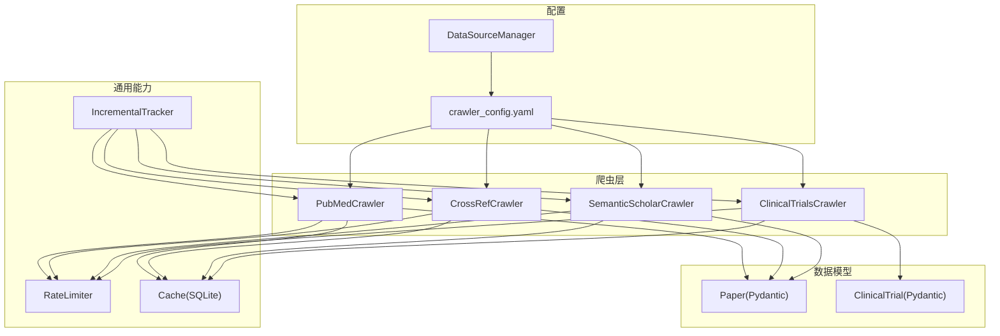
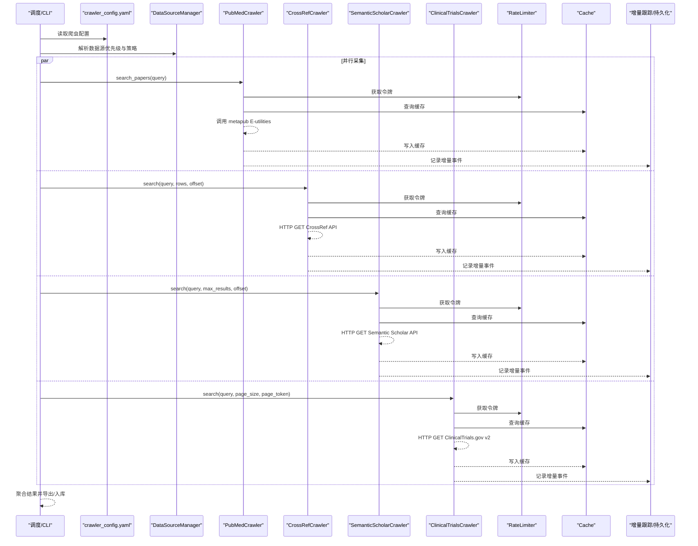
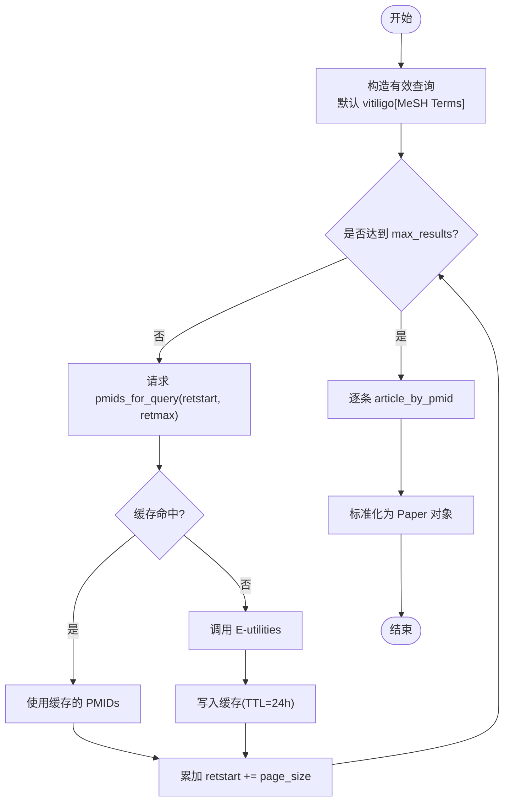
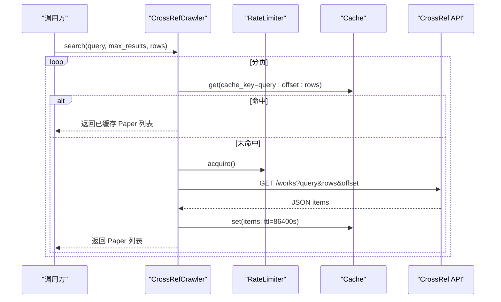
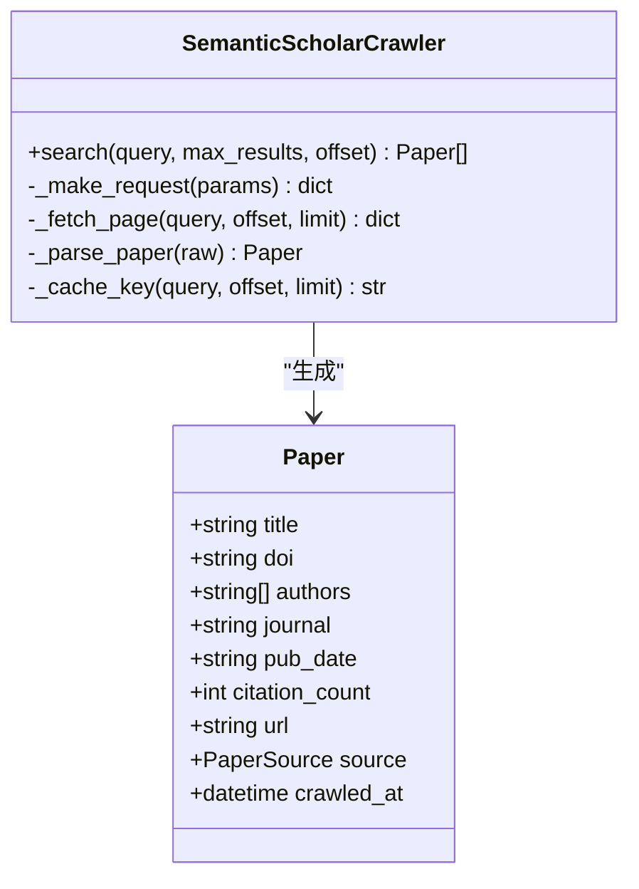
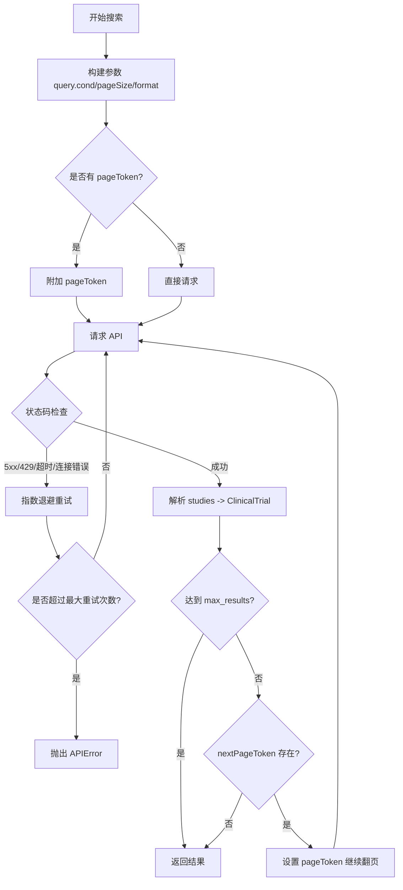
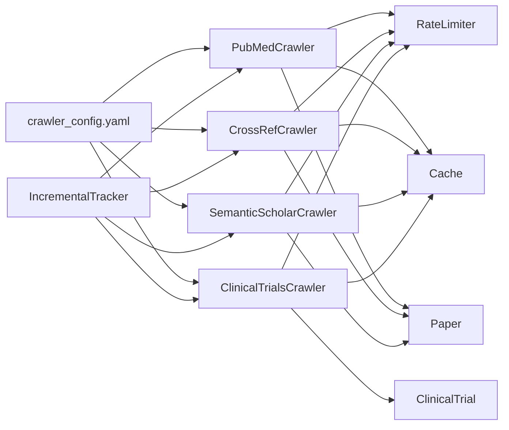

# 多源数据采集策略

<cite>
**本文引用的文件**   
- [pubmed_crawler.py](file://src/crawlers/pubmed_crawler.py)
- [crossref_crawler.py](file://src/crawlers/crossref_crawler.py)
- [semantic_scholar_crawler.py](file://src/crawlers/semantic_scholar_crawler.py)
- [clinical_trials_crawler.py](file://src/crawlers/clinical_trials_crawler.py)
- [rate_limiter.py](file://src/utils/rate_limiter.py)
- [cache.py](file://src/utils/cache.py)
- [paper.py](file://src/models/paper.py)
- [trial.py](file://src/models/trial.py)
- [crawler_config.yaml](file://configs/crawler_config.yaml)
- [data_source_manager.py](file://src/utils/data_source_manager.py)
- [incremental_tracker.py](file://src/utils/incremental_tracker.py)
- [test_pubmed_crawler.py](file://tests/test_pubmed_crawler.py)
- [test_semantic_scholar_crawler.py](file://tests/test_semantic_scholar_crawler.py)
- [test_clinical_trials_crawler.py](file://tests/test_clinical_trials_crawler.py)
- [README.md](file://README.md)
</cite>

## 目录
1. [简介](#简介)
2. [项目结构](#项目结构)
3. [核心组件](#核心组件)
4. [架构总览](#架构总览)
5. [详细组件分析](#详细组件分析)
6. [依赖关系分析](#依赖关系分析)
7. [性能与容量规划](#性能与容量规划)
8. [故障排查指南](#故障排查指南)
9. [结论](#结论)
10. [附录：爬虫配置示例与最佳实践](#附录爬虫配置示例与最佳实践)

## 简介
本技术文档面向 Subskin 项目的多源数据采集策略，覆盖 PubMed、CrossRef、Semantic Scholar、ClinicalTrials.gov 等学术数据源的采集实现。内容涵盖各数据源的 API 接口使用方式、查询语法、分页处理、速率限制、错误重试机制、NCBI API 密钥配置、请求频率控制、缓存策略与增量更新逻辑，并提供爬虫配置示例与常见故障处理方案。

## 项目结构
Subskin 的数据采集能力集中在 src/crawlers 目录下，每个数据源一个爬虫类；通用能力（速率限制、缓存、增量跟踪）位于 src/utils；数据模型位于 src/models；配置文件位于 configs/crawler_config.yaml。测试用例位于 tests 目录，用于验证分页、缓存、重试等行为。

**图表来源** 
- [pubmed_crawler.py:1-120](file://src/crawlers/pubmed_crawler.py#L1-L120)
- [crossref_crawler.py:1-80](file://src/crawlers/crossref_crawler.py#L1-L80)
- [semantic_scholar_crawler.py:1-80](file://src/crawlers/semantic_scholar_crawler.py#L1-L80)
- [clinical_trials_crawler.py:1-120](file://src/crawlers/clinical_trials_crawler.py#L1-L120)
- [rate_limiter.py:1-81](file://src/utils/rate_limiter.py#L1-L81)
- [cache.py:1-147](file://src/utils/cache.py#L1-L147)
- [paper.py:1-120](file://src/models/paper.py#L1-L120)
- [trial.py:1-120](file://src/models/trial.py#L1-L120)
- [crawler_config.yaml:1-143](file://configs/crawler_config.yaml#L1-L143)
- [data_source_manager.py:100-200](file://src/utils/data_source_manager.py#L100-L200)

**章节来源**
- [README.md:113-144](file://README.md#L113-L144)

## 核心组件
- 速率限制器 RateLimiter：基于令牌桶算法，线程安全，支持上下文管理器用法，确保对上游 API 的请求速率受控。
- 缓存 Cache：SQLite 后端，支持 TTL 过期清理，线程安全读写，键值存储 JSON 序列化对象。
- 增量跟踪 IncrementalTracker：记录每日新增/更新/失败事件，支持按日汇总与未处理记录查询。
- 数据模型 Paper/ClinicalTrial：Pydantic 模型，提供字段校验、默认值、转换方法等。

**章节来源**
- [rate_limiter.py:10-81](file://src/utils/rate_limiter.py#L10-L81)
- [cache.py:16-147](file://src/utils/cache.py#L16-L147)
- [incremental_tracker.py:53-120](file://src/utils/incremental_tracker.py#L53-L120)
- [paper.py:18-120](file://src/models/paper.py#L18-L120)
- [trial.py:67-150](file://src/models/trial.py#L67-L150)

## 架构总览
下图展示从配置加载到具体爬虫执行、再到结果归一化的整体流程。

**图表来源** 
- [crawler_config.yaml:1-143](file://configs/crawler_config.yaml#L1-L143)
- [data_source_manager.py:100-200](file://src/utils/data_source_manager.py#L100-L200)
- [pubmed_crawler.py:129-170](file://src/crawlers/pubmed_crawler.py#L129-L170)
- [crossref_crawler.py:60-122](file://src/crawlers/crossref_crawler.py#L60-L122)
- [semantic_scholar_crawler.py:231-284](file://src/crawlers/semantic_scholar_crawler.py#L231-L284)
- [clinical_trials_crawler.py:394-428](file://src/crawlers/clinical_trials_crawler.py#L394-L428)
- [rate_limiter.py:43-81](file://src/utils/rate_limiter.py#L43-L81)
- [cache.py:66-114](file://src/utils/cache.py#L66-L114)
- [incremental_tracker.py:100-129](file://src/utils/incremental_tracker.py#L100-L129)

## 详细组件分析

### PubMed 爬虫（PubMedCrawler）
- 接口与查询：通过 metapub.PubMedFetcher 调用 E-utilities，默认查询为 MeSH 术语“vitiligo[MeSH Terms]”，支持自定义 query 覆盖。
- 分页处理：_search_pmids_with_pagination 使用 retstart/retmax 分页，累计至 max_results 或返回空页停止。
- 速率限制：根据是否设置 NCBI_API_KEY 自动切换 10 req/s 或 3 req/s，并通过 RateLimiter 上下文管理。
- 缓存策略：对 pmid 列表与文章详情分别缓存，TTL 默认 24 小时。
- 重试机制：指数退避重试，识别超时、连接错误、5xx 等瞬态错误。
- 数据模型：输出 Paper 对象，包含 PMID、PMCID、DOI、标题、摘要、作者、期刊、发表日期、MeSH 词、关键词、来源、抓取时间等。

**图表来源** 
- [pubmed_crawler.py:129-170](file://src/crawlers/pubmed_crawler.py#L129-L170)
- [pubmed_crawler.py:171-215](file://src/crawlers/pubmed_crawler.py#L171-L215)
- [pubmed_crawler.py:312-362](file://src/crawlers/pubmed_crawler.py#L312-L362)

**章节来源**
- [pubmed_crawler.py:40-128](file://src/crawlers/pubmed_crawler.py#L40-L128)
- [pubmed_crawler.py:129-215](file://src/crawlers/pubmed_crawler.py#L129-L215)
- [pubmed_crawler.py:312-362](file://src/crawlers/pubmed_crawler.py#L312-L362)
- [test_pubmed_crawler.py:36-115](file://tests/test_pubmed_crawler.py#L36-L115)

### CrossRef 爬虫（CrossRefCrawler）
- 接口与查询：直接调用 https://api.crossref.org/works，参数包括 query、rows、offset、filter、sort。
- 分页处理：循环递增 offset，直到返回条目数小于 rows 或达到 max_results。
- 速率限制：默认 50 req/s（CrossRef 免费额度），通过 RateLimiter 控制。
- 缓存策略：以 query+offset+rows 为键缓存原始 items，避免重复请求。
- 重试机制：HTTP 异常时指数退避重试，最多 3 次。
- 数据模型：输出 Paper 对象，包含 DOI、标题、摘要、作者、期刊、发表日期、URL 等。

**图表来源** 
- [crossref_crawler.py:60-122](file://src/crawlers/crossref_crawler.py#L60-L122)
- [crossref_crawler.py:124-151](file://src/crawlers/crossref_crawler.py#L124-L151)

**章节来源**
- [crossref_crawler.py:31-88](file://src/crawlers/crossref_crawler.py#L31-L88)
- [crossref_crawler.py:90-151](file://src/crawlers/crossref_crawler.py#L90-L151)

### Semantic Scholar 爬虫（SemanticScholarCrawler）
- 接口与查询：调用 https://api.semanticscholar.org/graph/v1/paper/search，支持 fields 指定返回字段。
- 分页处理：使用 offset 和 limit，自动翻页直至 total 或达到 max_results。
- 速率限制：默认 1000 req/s，通过 RateLimiter 控制。
- 缓存策略：以 SHA-256(query:offset:limit) 作为缓存键，缓存原始响应。
- 重试机制：对 5xx、超时、连接错误进行指数退避重试，客户端错误立即抛出。
- 数据模型：输出 Paper 对象，包含 paperId、title、abstract、authors、venue、year、citationCount、url、externalIds 等。

**图表来源** 
- [semantic_scholar_crawler.py:34-74](file://src/crawlers/semantic_scholar_crawler.py#L34-L74)
- [semantic_scholar_crawler.py:192-229](file://src/crawlers/semantic_scholar_crawler.py#L192-L229)
- [paper.py:18-120](file://src/models/paper.py#L18-L120)

**章节来源**
- [semantic_scholar_crawler.py:34-74](file://src/crawlers/semantic_scholar_crawler.py#L34-L74)
- [semantic_scholar_crawler.py:93-160](file://src/crawlers/semantic_scholar_crawler.py#L93-L160)
- [semantic_scholar_crawler.py:231-284](file://src/crawlers/semantic_scholar_crawler.py#L231-L284)
- [test_semantic_scholar_crawler.py:90-136](file://tests/test_semantic_scholar_crawler.py#L90-L136)

### ClinicalTrials.gov 爬虫（ClinicalTrialsCrawler）
- 接口与查询：调用 https://clinicaltrials.gov/api/v2/studies，参数包括 query.cond、pageSize、format、pageToken。
- 分页处理：使用 nextPageToken 翻页，直到无 token 或无数据。
- 速率限制：默认 1 req/s，通过 RateLimiter 控制。
- 缓存策略：对请求参数排序后哈希生成 cache_key，缓存原始响应。
- 重试机制：对 5xx、429、超时、连接错误进行指数退避重试，非可重试错误立即抛出。
- 数据模型：输出 ClinicalTrial 对象，包含 NCT ID、标题、条件、干预措施、阶段、状态、招募人数、赞助方、日期、地点、URL 等。

**图表来源** 
- [clinical_trials_crawler.py:124-199](file://src/crawlers/clinical_trials_crawler.py#L124-L199)
- [clinical_trials_crawler.py:394-428](file://src/crawlers/clinical_trials_crawler.py#L394-L428)

**章节来源**
- [clinical_trials_crawler.py:88-116](file://src/crawlers/clinical_trials_crawler.py#L88-L116)
- [clinical_trials_crawler.py:124-199](file://src/crawlers/clinical_trials_crawler.py#L124-L199)
- [clinical_trials_crawler.py:394-428](file://src/crawlers/clinical_trials_crawler.py#L394-L428)
- [test_clinical_trials_crawler.py:134-179](file://tests/test_clinical_trials_crawler.py#L134-L179)

## 依赖关系分析
- 爬虫与通用能力耦合：所有爬虫均依赖 RateLimiter 与 Cache，保证稳定与高效。
- 数据模型统一：Paper 与 ClinicalTrial 作为统一输出，便于后续处理与导出。
- 配置驱动：crawler_config.yaml 定义各数据源的搜索词、速率限制、缓存 TTL、输出格式等。
- 增量跟踪：爬虫在关键路径记录增量事件，支持日报与通知。

**图表来源** 
- [pubmed_crawler.py:120-128](file://src/crawlers/pubmed_crawler.py#L120-L128)
- [crossref_crawler.py:46-58](file://src/crawlers/crossref_crawler.py#L46-L58)
- [semantic_scholar_crawler.py:53-74](file://src/crawlers/semantic_scholar_crawler.py#L53-L74)
- [clinical_trials_crawler.py:99-116](file://src/crawlers/clinical_trials_crawler.py#L99-L116)
- [crawler_config.yaml:1-143](file://configs/crawler_config.yaml#L1-L143)
- [incremental_tracker.py:100-129](file://src/utils/incremental_tracker.py#L100-L129)

**章节来源**
- [data_source_manager.py:100-200](file://src/utils/data_source_manager.py#L100-L200)
- [crawler_config.yaml:1-143](file://configs/crawler_config.yaml#L1-L143)

## 性能与容量规划
- 速率限制建议：
  - PubMed：有 NCBI_API_KEY 时 10 req/s，无 key 时 3 req/s。
  - CrossRef：50 req/s（免费额度）。
  - Semantic Scholar：1000 req/s（免费额度）。
  - ClinicalTrials.gov：保守 1 req/s，避免触发 429。
- 缓存策略：
  - 所有爬虫均启用 SQLite 缓存，TTL 默认 24 小时，显著降低重复请求。
  - 针对大结果集（如 PubMed 分页）优先缓存 pmid 列表与文章详情。
- 增量更新：
  - 使用 IncrementalTracker 记录每日新增/更新/失败事件，便于统计与通知。
- 并发与资源：
  - 爬虫内部使用 requests.Session 复用连接，减少握手开销。
  - 建议在调度层并行执行不同数据源，但需全局限速以避免被上游限流。

**章节来源**
- [pubmed_crawler.py:91-117](file://src/crawlers/pubmed_crawler.py#L91-L117)
- [crossref_crawler.py:54-58](file://src/crawlers/crossref_crawler.py#L54-L58)
- [semantic_scholar_crawler.py:61-74](file://src/crawlers/semantic_scholar_crawler.py#L61-L74)
- [clinical_trials_crawler.py:108-116](file://src/crawlers/clinical_trials_crawler.py#L108-L116)
- [cache.py:66-114](file://src/utils/cache.py#L66-L114)
- [incremental_tracker.py:130-199](file://src/utils/incremental_tracker.py#L130-L199)

## 故障排查指南
- 常见问题与定位：
  - 429 限流：检查 RateLimiter 配置与上游配额，适当降低并发或增加退避时间。
  - 5xx 服务器错误：确认网络连通性与上游服务状态，查看重试日志。
  - 超时/连接错误：调整 timeout 与 backoff_base_seconds，检查 DNS 与代理设置。
  - 缓存失效：检查 TTL 设置与 SQLite 文件权限，必要时清理缓存。
- 调试建议：
  - 开启详细日志，关注 _with_retries 与 _request_with_retry 的警告信息。
  - 使用测试用例模拟 API 响应，验证分页、缓存、重试逻辑。
  - 通过 IncrementalTracker 查询未处理记录，定位失败任务。

**章节来源**
- [pubmed_crawler.py:316-362](file://src/crawlers/pubmed_crawler.py#L316-L362)
- [crossref_crawler.py:124-151](file://src/crawlers/crossref_crawler.py#L124-L151)
- [semantic_scholar_crawler.py:111-160](file://src/crawlers/semantic_scholar_crawler.py#L111-L160)
- [clinical_trials_crawler.py:124-199](file://src/crawlers/clinical_trials_crawler.py#L124-L199)
- [test_pubmed_crawler.py:117-165](file://tests/test_pubmed_crawler.py#L117-L165)
- [test_semantic_scholar_crawler.py:198-200](file://tests/test_semantic_scholar_crawler.py#L198-L200)
- [test_clinical_trials_crawler.py:182-200](file://tests/test_clinical_trials_crawler.py#L182-L200)

## 结论
Subskin 的多源数据采集策略通过统一的速率限制、缓存与重试机制，实现了 PubMed、CrossRef、Semantic Scholar、ClinicalTrials.gov 的稳定采集。配置驱动与增量跟踪确保了可扩展性与可观测性。建议在生产环境中结合监控与告警，持续优化速率限制与缓存策略，提升采集效率与稳定性。

## 附录：爬虫配置示例与最佳实践
- 环境变量与密钥：
  - NCBI_API_KEY：设置后可将 PubMed 速率提升至 10 req/s。
  - SEMANTIC_SCHOLAR_API_KEY：可选，用于提高限额或访问受限功能。
- 爬虫配置要点（crawler_config.yaml）：
  - 搜索词：针对不同数据源定制查询语句，如 MeSH 术语、自由文本、JAK 抑制剂关键词。
  - 速率限制：根据上游配额设置合理 req/s，避免 429。
  - 分页参数：retmax/rows/limit/pageSize 与 offset/pageToken 配合，确保完整抓取。
  - 缓存 TTL：默认 24 小时，可根据数据更新频率调整。
  - 输出格式：JSON/Markdown，压缩开关与保留天数。
- 最佳实践：
  - 使用 DataSourceManager 统一管理数据源优先级与采集策略。
  - 在调度层并行执行不同数据源，但全局限速避免被上游限流。
  - 定期清理过期缓存与增量记录，保持系统健康。
  - 通过测试用例验证分页、缓存、重试逻辑，确保稳定性。

**章节来源**
- [crawler_config.yaml:1-143](file://configs/crawler_config.yaml#L1-L143)
- [data_source_manager.py:100-200](file://src/utils/data_source_manager.py#L100-L200)
- [README.md:103-109](file://README.md#L103-L109)