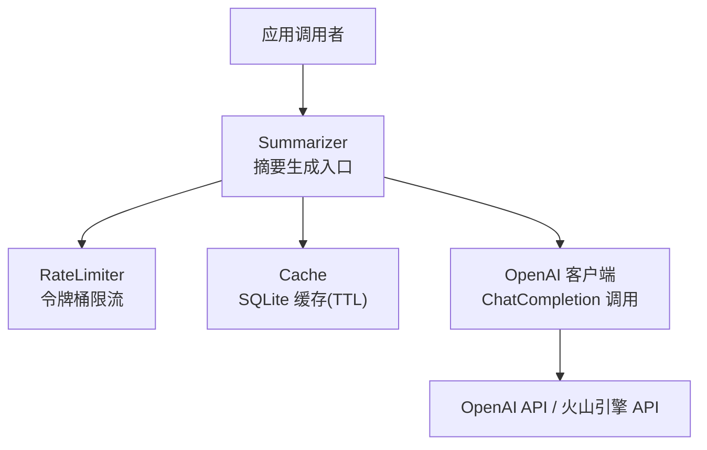
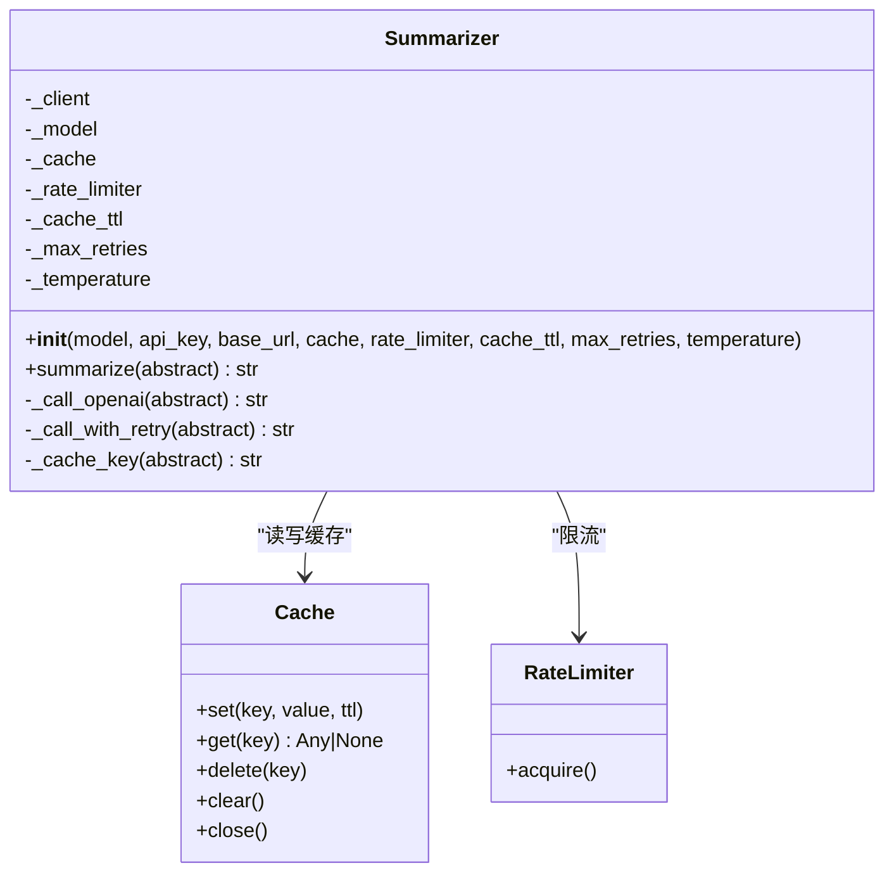
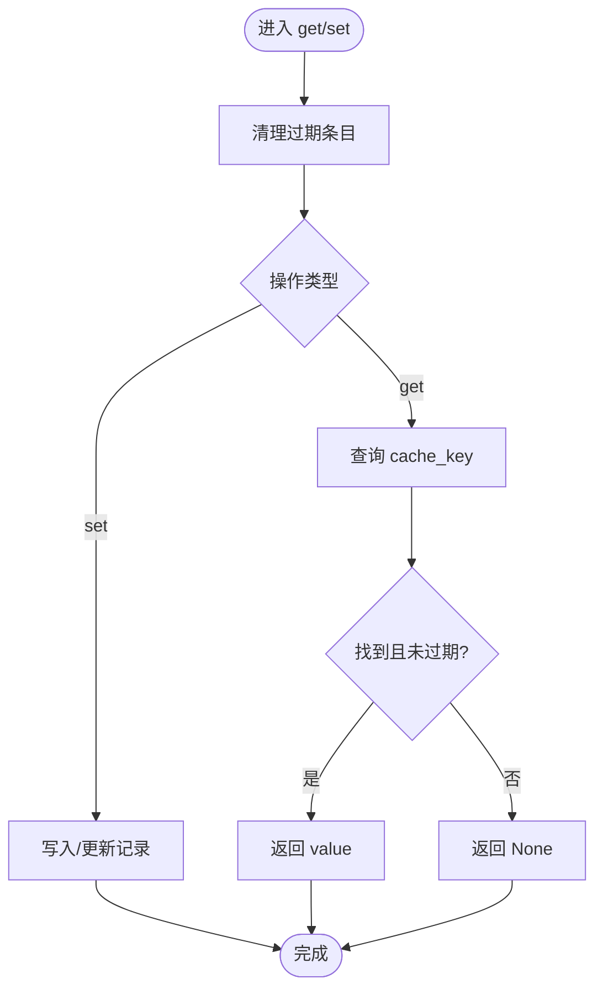
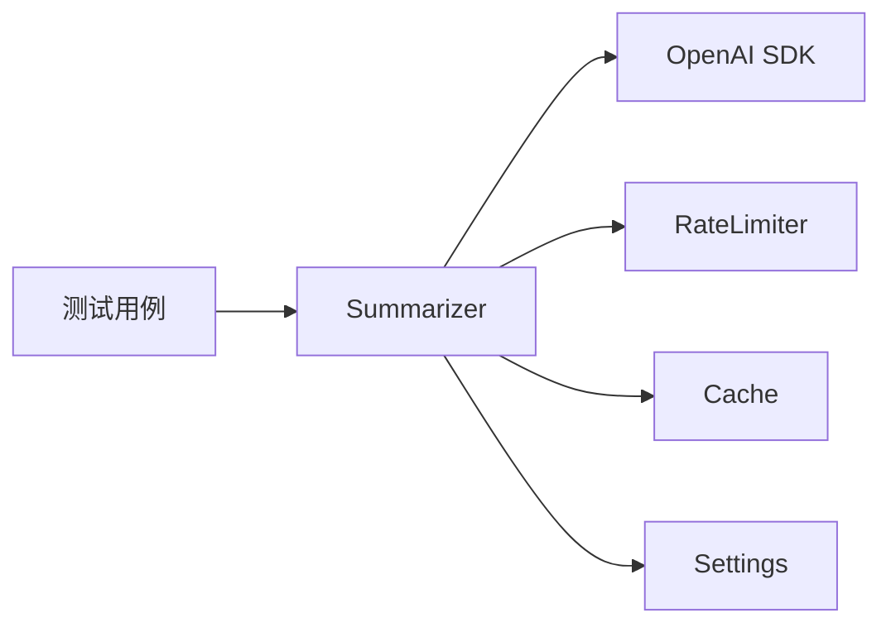

# AI摘要生成

<cite>
**本文引用的文件**
- [summarizer.py](file://src/processors/summarizer.py)
- [cache.py](file://src/utils/cache.py)
- [rate_limiter.py](file://src/utils/rate_limiter.py)
- [settings.py](file://src/settings/settings.py)
- [config.py](file://src/config.py)
- [web_config.yaml](file://configs/web_config.yaml)
- [test_summarizer.py](file://tests/test_summarizer.py)
</cite>

## 目录
1. [简介](#简介)
2. [项目结构](#项目结构)
3. [核心组件](#核心组件)
4. [架构总览](#架构总览)
5. [详细组件分析](#详细组件分析)
6. [依赖关系分析](#依赖关系分析)
7. [性能与调优](#性能与调优)
8. [故障排查指南](#故障排查指南)
9. [结论](#结论)
10. [附录：使用示例与参数调优](#附录使用示例与参数调优)

## 简介
本模块提供基于 OpenAI 兼容接口的医学论文摘要改写能力，支持 OpenAI 与火山引擎（Volcengine）两种后端。其目标是将英文医学摘要改写为面向患者的中文科普内容，强调通俗易懂、客观中立，并在输出中附带免责声明。Summarizer 类封装了提示词工程、API 调用、重试策略、速率限制与缓存系统，确保在配额与稳定性约束下稳定运行。

## 项目结构
围绕摘要生成的关键代码位于 src/processors/summarizer.py，配合 src/utils/cache.py 的 SQLite 缓存、src/utils/rate_limiter.py 的令牌桶限流器，以及 src/settings/settings.py 的环境配置加载。配置文件 configs/web_config.yaml 提供了 LLM 集成与提示模板等全局设置；测试用例 tests/test_summarizer.py 覆盖初始化、缓存命中、限流、重试与空响应等场景。

图表来源
- [summarizer.py:90-125](file://src/processors/summarizer.py#L90-L125)
- [rate_limiter.py:10-57](file://src/utils/rate_limiter.py#L10-L57)
- [cache.py:16-114](file://src/utils/cache.py#L16-L114)
- [settings.py:275-287](file://src/settings/settings.py#L275-L287)

章节来源
- [summarizer.py:1-247](file://src/processors/summarizer.py#L1-L247)
- [cache.py:1-147](file://src/utils/cache.py#L1-L147)
- [rate_limiter.py:1-81](file://src/utils/rate_limiter.py#L1-L81)
- [settings.py:17-328](file://src/settings/settings.py#L17-L328)
- [web_config.yaml:80-134](file://configs/web_config.yaml#L80-L134)
- [test_summarizer.py:1-401](file://tests/test_summarizer.py#L1-L401)

## 核心组件
- Summarizer：摘要生成主类，负责提示词组装、模型选择、API 调用、重试与缓存写入。
- Cache：线程安全的 SQLite 缓存，支持 TTL 过期清理与键值存取。
- RateLimiter：基于令牌桶算法的并发限流器，避免超出 API 配额。
- Settings：集中式配置加载，支持环境变量与 .env 文件，包含火山引擎与 OpenAI 相关键。

章节来源
- [summarizer.py:57-125](file://src/processors/summarizer.py#L57-L125)
- [cache.py:16-114](file://src/utils/cache.py#L16-L114)
- [rate_limiter.py:10-57](file://src/utils/rate_limiter.py#L10-L57)
- [settings.py:38-41](file://src/settings/settings.py#L38-L41)
- [settings.py:275-287](file://src/settings/settings.py#L275-L287)

## 架构总览
Summarizer 通过 settings 自动检测是否启用火山引擎 API；若未配置则回退到 OpenAI。每次 summarize 调用会先检查缓存，命中则直接返回；否则获取限流令牌后调用 ChatCompletion，并对连接超时、速率限制等可重试异常进行指数退避重试。成功后将结果写入缓存并返回。

```mermaid
sequenceDiagram
participant U as "调用方"
participant S as "Summarizer"
participant R as "RateLimiter"
participant C as "Cache"
participant O as "OpenAI/火山引擎"
U->>S : summarize(abstract)
S->>C : get(key=hash(abstract))
alt 缓存命中
C-->>S : summary
S-->>U : summary
else 缓存未命中
S->>R : acquire()
S->>O : chat.completions.create(messages, temperature)
alt 成功
O-->>S : response.choices[0].message.content
S->>C : set(key, summary, ttl)
S-->>U : summary
else 可重试错误
O-->>S : 连接超时/速率限制
S->>S : 指数退避重试(max_retries)
opt 仍失败
S-->>U : SummarizerError
end
end
end
```

图表来源
- [summarizer.py:140-202](file://src/processors/summarizer.py#L140-L202)
- [summarizer.py:204-246](file://src/processors/summarizer.py#L204-L246)
- [rate_limiter.py:43-57](file://src/utils/rate_limiter.py#L43-L57)
- [cache.py:66-114](file://src/utils/cache.py#L66-L114)

## 详细组件分析

### Summarizer 类
- 模型与后端选择：优先读取火山引擎配置（VOLCENGINE_API_KEY/VOLCENGINE_BASE_URL/VOLCENGINE_MODEL），否则回退到 OpenAI（OPENAI_API_KEY）。
- 提示词工程：内置系统提示词要求提取治疗方法、结果与结论，使用通俗语言，全中文输出，末尾附加免责声明；用户提示模板将原始摘要注入。
- API 调用：通过 OpenAI 兼容接口调用 chat.completions.create，传入 system 与 user 消息及 temperature。
- 重试策略：对连接错误、超时、速率限制三类异常进行最多 max_retries 次重试，采用初始 1s、倍增 2x 的指数退避。
- 缓存机制：以摘要文本的 SHA-256 哈希作为 key 前缀“summary:”，TTL 默认 30 天。
- 限流：默认 10 req/min 的令牌桶限流，缓存命中时跳过限流与 API 调用。

图表来源
- [summarizer.py:57-125](file://src/processors/summarizer.py#L57-L125)
- [summarizer.py:127-246](file://src/processors/summarizer.py#L127-L246)
- [cache.py:16-114](file://src/utils/cache.py#L16-L114)
- [rate_limiter.py:10-57](file://src/utils/rate_limiter.py#L10-L57)

章节来源
- [summarizer.py:29-50](file://src/processors/summarizer.py#L29-L50)
- [summarizer.py:90-125](file://src/processors/summarizer.py#L90-L125)
- [summarizer.py:140-202](file://src/processors/summarizer.py#L140-L202)
- [summarizer.py:204-246](file://src/processors/summarizer.py#L204-L246)

### 缓存系统（Cache）
- 存储介质：SQLite，表结构包含 cache_key、value、created_at、ttl、expires_at。
- 线程安全：内部使用锁保护数据库操作。
- TTL 清理：读取或写入时清理过期条目，避免脏读。
- 序列化：JSON 序列化任意可序列化的值。

图表来源
- [cache.py:35-64](file://src/utils/cache.py#L35-L64)
- [cache.py:66-114](file://src/utils/cache.py#L66-L114)

章节来源
- [cache.py:16-114](file://src/utils/cache.py#L16-L114)

### 速率限制（RateLimiter）
- 算法：令牌桶，按配置的请求速率周期性补充令牌。
- 行为：acquire 阻塞直到获得一个令牌，防止突发流量超过配额。
- 适用场景：与 Summarizer 结合，控制对外部 LLM 的请求频率。

章节来源
- [rate_limiter.py:10-57](file://src/utils/rate_limiter.py#L10-L57)

### 配置与环境变量
- 火山引擎优先：当存在 VOLCENGINE_API_KEY 时，Summarizer 自动使用该后端；否则回退到 OpenAI。
- 关键配置项：
  - OPENAI_API_KEY：OpenAI 密钥
  - VOLCENGINE_API_KEY、VOLCENGINE_BASE_URL、VOLCENGINE_MODEL：火山引擎密钥、基础 URL 与模型名
- 配置文件：configs/web_config.yaml 中的 llm 段提供 provider、openai/anthropic/local 子配置与提示模板，便于统一管理。

章节来源
- [settings.py:38-41](file://src/settings/settings.py#L38-L41)
- [settings.py:275-287](file://src/settings/settings.py#L275-L287)
- [web_config.yaml:80-134](file://configs/web_config.yaml#L80-L134)
- [config.py:1-10](file://src/config.py#L1-L10)

## 依赖关系分析
- Summarizer 依赖 OpenAI SDK 的 ChatCompletion 接口，并通过 settings 解析后端与模型。
- 通过 RateLimiter 控制并发与速率，通过 Cache 降低重复计算与网络开销。
- 测试覆盖初始化、缓存命中/未命中、限流、重试与空响应等路径，保证健壮性。

图表来源
- [summarizer.py:90-125](file://src/processors/summarizer.py#L90-L125)
- [test_summarizer.py:63-129](file://tests/test_summarizer.py#L63-L129)

章节来源
- [summarizer.py:90-125](file://src/processors/summarizer.py#L90-L125)
- [test_summarizer.py:149-249](file://tests/test_summarizer.py#L149-L249)

## 性能与调优
- 温度参数（temperature）：默认 0.3，适合科普摘要的稳定输出；如需更多创意表达可适当提高，但需权衡一致性。
- 缓存 TTL：默认 30 天，适用于确定性摘要；若业务需要更短生命周期，可在构造 Summarizer 时调整 cache_ttl。
- 限流速率：默认 10 req/min，可根据 API 配额与吞吐需求调整 RateLimiter 实例。
- 重试策略：最大重试次数与退避倍数已内置，可根据网络质量与服务端 SLA 调整 max_retries 与退避参数。
- 模型选择：优先使用火山引擎模型（如 doubao-4k），也可显式指定 OpenAI 模型（如 gpt-4）以获得不同质量/成本平衡。

章节来源
- [summarizer.py:90-125](file://src/processors/summarizer.py#L90-L125)
- [summarizer.py:170-202](file://src/processors/summarizer.py#L170-L202)
- [rate_limiter.py:10-57](file://src/utils/rate_limiter.py#L10-L57)
- [cache.py:66-114](file://src/utils/cache.py#L66-L114)

## 故障排查指南
- 缺少 API Key：初始化时若未提供 api_key 且环境变量缺失，将抛出 ValueError。请检查 OPENAI_API_KEY 或 VOLCENGINE_API_KEY。
- 空响应：若模型返回 choices 为空或 content 为 None，将抛出 SummarizerError。可检查输入摘要长度与格式。
- 连接超时/速率限制：触发可重试异常，模块会自动指数退避重试；若多次失败，请检查网络与配额。
- 缓存未命中：确认 Cache 实例是否正确传入，key 生成逻辑基于摘要文本哈希，确保输入一致。
- 限流阻塞：在高并发场景下，RateLimiter.acquire 可能阻塞等待令牌；可通过增大速率或引入队列缓解。

章节来源
- [summarizer.py:113-117](file://src/processors/summarizer.py#L113-L117)
- [summarizer.py:164-168](file://src/processors/summarizer.py#L164-L168)
- [summarizer.py:170-202](file://src/processors/summarizer.py#L170-L202)
- [test_summarizer.py:252-355](file://tests/test_summarizer.py#L252-L355)

## 结论
Summarizer 模块以稳定的重试、限流与缓存机制，结合精心设计的提示词工程，实现了从英文医学摘要到患者友好中文科普的可靠转换。通过火山引擎与 OpenAI 双后端支持与灵活配置，可在不同部署环境下取得质量与成本的平衡。建议在生产环境中结合监控与日志，持续优化温度、TTL 与限流参数，以满足业务需求。

## 附录：使用示例与参数调优
- 基本用法
  - 创建 Summarizer 实例，传入 api_key（或使用环境变量），可选传入自定义 model、base_url、cache、rate_limiter、cache_ttl、max_retries、temperature。
  - 调用 summarize(abstract) 获取中文科普摘要。
- 参数调优建议
  - temperature：0.1~0.5 区间内微调，追求准确性偏低温，追求多样性略高温。
  - cache_ttl：根据数据更新频率设定，医学知识变化较慢时可保持较长 TTL。
  - rate_limiter：根据 API 配额与并发量调整，避免触发服务端限流。
  - max_retries：网络不稳定时可适当增加，但需考虑整体延迟。
- 多模型支持
  - 火山引擎：设置 VOLCENGINE_API_KEY、VOLCENGINE_BASE_URL、VOLCENGINE_MODEL，Summarizer 自动切换。
  - OpenAI：设置 OPENAI_API_KEY，或通过参数显式指定 model。
- 提示词工程要点
  - 系统提示词明确角色、任务、规则与免责声明，确保输出风格统一。
  - 用户提示模板将原始摘要注入，保证信息完整性。
- 参考实现与测试
  - 参见测试用例中对初始化、缓存命中、限流、重试与空响应的断言，可作为集成与回归测试参考。

章节来源
- [summarizer.py:83-88](file://src/processors/summarizer.py#L83-L88)
- [summarizer.py:90-125](file://src/processors/summarizer.py#L90-L125)
- [summarizer.py:140-202](file://src/processors/summarizer.py#L140-L202)
- [test_summarizer.py:63-129](file://tests/test_summarizer.py#L63-L129)
- [test_summarizer.py:149-249](file://tests/test_summarizer.py#L149-L249)
- [test_summarizer.py:252-355](file://tests/test_summarizer.py#L252-L355)