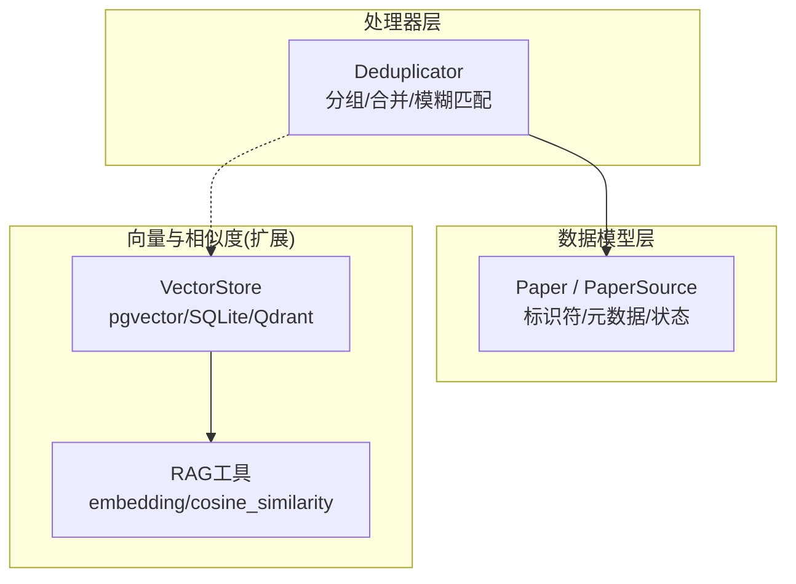
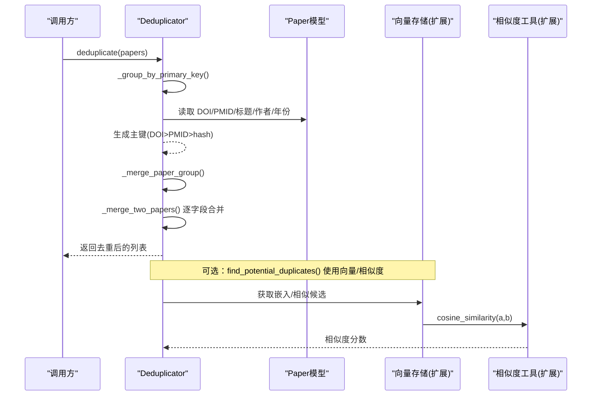
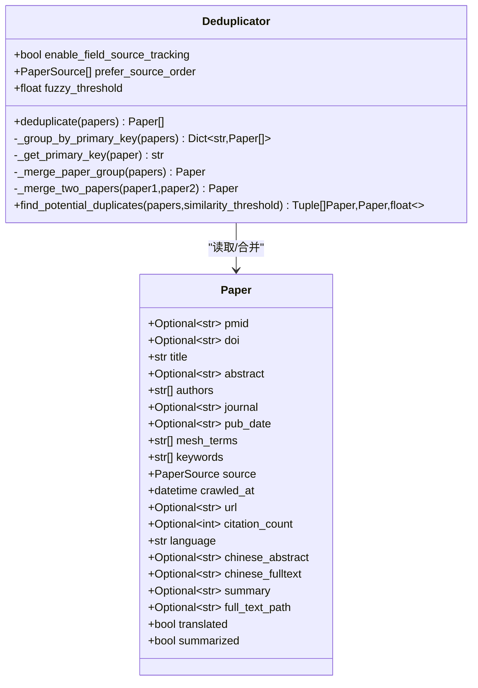
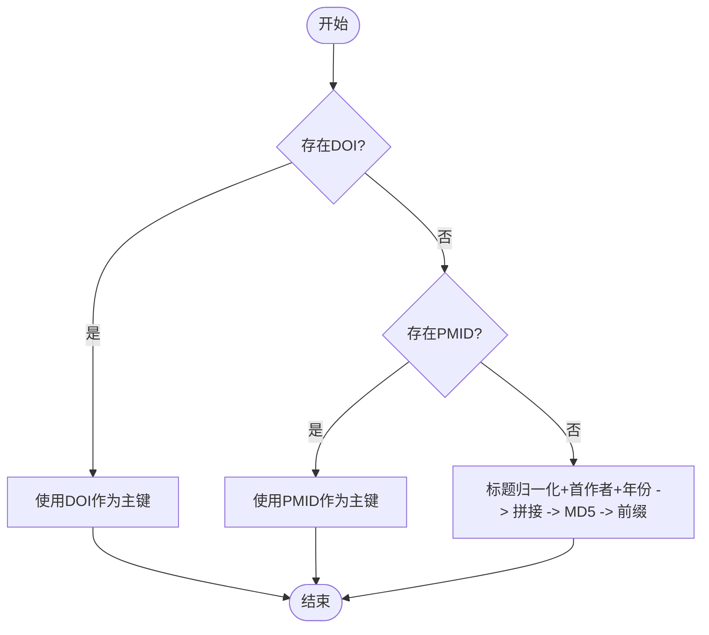
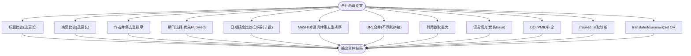
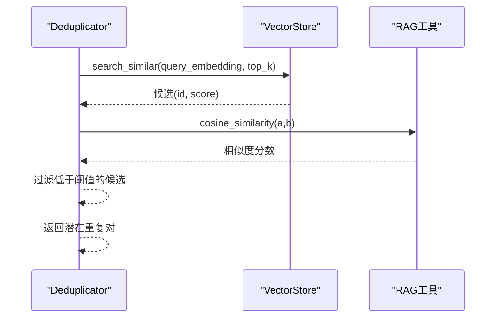
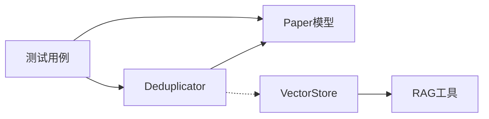

# 内容去重处理

<cite>
**本文引用的文件**   
- [src/processors/deduplicator.py](file://src/processors/deduplicator.py)
- [src/models/paper.py](file://src/models/paper.py)
- [tests/test_deduplicator.py](file://tests/test_deduplicator.py)
- [web/backend/services/vector_store.py](file://web/backend/services/vector_store.py)
- [web/backend/services/rag.py](file://web/backend/services/rag.py)
</cite>

## 目录
1. [简介](#简介)
2. [项目结构](#项目结构)
3. [核心组件](#核心组件)
4. [架构总览](#架构总览)
5. [详细组件分析](#详细组件分析)
6. [依赖关系分析](#依赖关系分析)
7. [性能考量](#性能考量)
8. [故障排查指南](#故障排查指南)
9. [结论](#结论)
10. [附录](#附录)

## 简介
本模块聚焦于“文献内容的智能去重”，围绕多来源（如 PubMed、Semantic Scholar）采集的论文记录进行统一合并与去重。当前实现以强标识符（DOI、PMID）为主键，辅以标题+作者+年份的哈希作为兜底分组；在组内进行字段级智能合并，优先保留更完整、更权威的信息，并维护来源偏好顺序。同时提供模糊匹配接口占位，为未来引入语义相似度计算预留扩展点。

## 项目结构
- 去重逻辑位于 src/processors/deduplicator.py，核心类 Deduplicator 负责分组、合并与可选的模糊匹配。
- 数据模型位于 src/models/paper.py，定义 Paper、PaperSource 等类型，支撑去重与合并过程。
- 单元测试位于 tests/test_deduplicator.py，覆盖基础去重、合并策略、来源优先级等场景。
- 向量检索与相似度计算相关能力位于 web/backend/services/vector_store.py 与 web/backend/services/rag.py，可作为未来语义相似度计算的扩展基础设施。

图表来源 
- [src/processors/deduplicator.py:28-319](file://src/processors/deduplicator.py#L28-L319)
- [src/models/paper.py:9-128](file://src/models/paper.py#L9-L128)
- [web/backend/services/vector_store.py:138-177](file://web/backend/services/vector_store.py#L138-L177)
- [web/backend/services/rag.py:387-401](file://web/backend/services/rag.py#L387-L401)

章节来源
- [src/processors/deduplicator.py:1-319](file://src/processors/deduplicator.py#L1-L319)
- [src/models/paper.py:1-263](file://src/models/paper.py#L1-L263)
- [tests/test_deduplicator.py:1-318](file://tests/test_deduplicator.py#L1-L318)
- [web/backend/services/vector_store.py:138-177](file://web/backend/services/vector_store.py#L138-L177)
- [web/backend/services/rag.py:387-401](file://web/backend/services/rag.py#L387-L401)

## 核心组件
- Deduplicator：实现按主键分组、字段级合并、来源优先级排序、以及模糊匹配接口（待实现）。
- Paper/PaperSource：描述论文实体与数据来源枚举，支撑去重与合并的数据契约。
- 向量存储与相似度工具：提供 embedding 生成与余弦相似度计算，为后续语义相似度去重提供基础。

章节来源
- [src/processors/deduplicator.py:28-319](file://src/processors/deduplicator.py#L28-L319)
- [src/models/paper.py:9-128](file://src/models/paper.py#L9-L128)
- [web/backend/services/vector_store.py:138-177](file://web/backend/services/vector_store.py#L138-L177)
- [web/backend/services/rag.py:387-401](file://web/backend/services/rag.py#L387-L401)

## 架构总览
下图展示去重流程从输入到输出的关键步骤，以及与数据模型的交互关系。

图表来源 
- [src/processors/deduplicator.py:57-90](file://src/processors/deduplicator.py#L57-L90)
- [src/processors/deduplicator.py:92-134](file://src/processors/deduplicator.py#L92-L134)
- [src/processors/deduplicator.py:135-285](file://src/processors/deduplicator.py#L135-L285)
- [web/backend/services/vector_store.py:138-177](file://web/backend/services/vector_store.py#L138-L177)
- [web/backend/services/rag.py:387-401](file://web/backend/services/rag.py#L387-L401)

## 详细组件分析

### Deduplicator 类设计
- 职责
  - 基于主键（DOI > PMID > 标题+首作者+年份哈希）将论文分组。
  - 对每组内论文执行字段级合并，遵循来源偏好顺序（默认 PubMed > Semantic Scholar）。
  - 暴露 find_potential_duplicates 接口用于未来模糊匹配（当前返回空列表）。
- 关键方法
  - deduplicate：入口，统计日志、分组、合并、输出结果。
  - _group_by_primary_key/_get_primary_key：主键生成与分组。
  - _merge_paper_group/_merge_two_papers：合并策略（标题长度、摘要长度、作者并集、期刊来源偏好、日期精度、MeSH/关键词并集、URL合并、引用数取最大、语言填充、DOI/PMID补全、crawled_at最新、处理状态OR运算）。
- 配置项
  - enable_field_source_tracking：是否追踪字段来源（当前未启用）。
  - prefer_source_order：来源优先级顺序（可自定义）。
  - fuzzy_title_similarity_threshold：模糊标题相似度阈值（当前未使用）。

图表来源 
- [src/processors/deduplicator.py:28-319](file://src/processors/deduplicator.py#L28-L319)
- [src/models/paper.py:18-128](file://src/models/paper.py#L18-L128)

章节来源
- [src/processors/deduplicator.py:28-319](file://src/processors/deduplicator.py#L28-L319)
- [src/models/paper.py:18-128](file://src/models/paper.py#L18-L128)

### 主键与指纹生成
- 主键优先级
  - DOI：最可靠且全局唯一。
  - PMID：次优，当无 DOI 时使用。
  - 标题+首作者+年份哈希：兜底方案，采用 MD5 前缀作为短键。
- 指纹生成细节
  - 标题归一化：小写、去空白、截断至固定长度。
  - 首作者与年份提取：若缺失则用空串替代。
  - 哈希输入拼接后生成 MD5 并截取前16位，形成稳定短键。

图表来源 
- [src/processors/deduplicator.py:111-134](file://src/processors/deduplicator.py#L111-L134)

章节来源
- [src/processors/deduplicator.py:111-134](file://src/processors/deduplicator.py#L111-L134)

### 字段级合并策略
- 标题：选择更长者（通常更完整）。
- 摘要：选择更长者（信息量更大）。
- 作者：集合并集去重后排序。
- 期刊：优先非空；两者都有时优先 PubMed 版本。
- 出版日期：优先更精确格式（分隔符越多越精确）。
- MeSH 术语与关键词：集合并集去重后排序。
- URL：不同则拼接（逗号分隔），否则取其一。
- 引用数：取最大值。
- 语言：优先 base 论文，缺失则填充。
- DOI/PMID：缺失则从另一条补充。
- 抓取时间：取较新者。
- 处理状态：translated/summarized 采用 OR 操作。

图表来源 
- [src/processors/deduplicator.py:174-285](file://src/processors/deduplicator.py#L174-L285)

章节来源
- [src/processors/deduplicator.py:174-285](file://src/processors/deduplicator.py#L174-L285)

### 模糊匹配与语义相似度（扩展点）
- 当前状态：find_potential_duplicates 返回空列表，预留扩展空间。
- 可扩展方向
  - 基于标题与作者的编辑距离或 Jaccard 相似度。
  - 基于向量嵌入的余弦相似度（需先对标题/摘要生成 embedding）。
  - 结合现有 vector_store 与 rag 工具，实现跨库候选召回与打分。

图表来源 
- [src/processors/deduplicator.py:287-306](file://src/processors/deduplicator.py#L287-L306)
- [web/backend/services/vector_store.py:138-177](file://web/backend/services/vector_store.py#L138-L177)
- [web/backend/services/rag.py:387-401](file://web/backend/services/rag.py#L387-L401)

章节来源
- [src/processors/deduplicator.py:287-306](file://src/processors/deduplicator.py#L287-L306)
- [web/backend/services/vector_store.py:138-177](file://web/backend/services/vector_store.py#L138-L177)
- [web/backend/services/rag.py:387-401](file://web/backend/services/rag.py#L387-L401)

### 去重规则配置与来源偏好
- 来源偏好顺序：默认 PubMed > Semantic Scholar，可通过 prefer_source_order 自定义。
- 字段来源追踪：enable_field_source_tracking 预留开关（当前未启用）。
- 模糊阈值：fuzzy_title_similarity_threshold 预留参数（当前未使用）。

章节来源
- [src/processors/deduplicator.py:45-55](file://src/processors/deduplicator.py#L45-L55)
- [src/processors/deduplicator.py:148-171](file://src/processors/deduplicator.py#L148-L171)

### 批量处理优化与内存管理
- 当前实现为一次性加载全部论文列表进行分组与合并，适合中小规模数据。
- 优化建议
  - 分块处理：将大列表切分为批次，降低峰值内存占用。
  - 流式合并：对每个分组增量合并，避免中间对象膨胀。
  - 缓存主键映射：对频繁出现的标题+作者+年份组合建立索引，减少哈希计算。
  - 惰性加载：仅对需要合并的分组执行深度字段合并。

[本节为通用指导，不直接分析具体文件]

### 效果评估与测试用例
- 基础去重：相同 DOI/PMID 应合并为一条；无标识符时使用标题+作者+年份哈希。
- 合并策略验证：标题/摘要长度优先、作者并集、期刊来源偏好、日期精度、MeSH/关键词并集、引用数取最大、URL合并、处理状态 OR。
- 来源优先级：默认 PubMed 优先，支持自定义顺序。
- 便捷函数：deduplicate_papers 提供一次性去重入口。

章节来源
- [tests/test_deduplicator.py:64-143](file://tests/test_deduplicator.py#L64-L143)
- [tests/test_deduplicator.py:145-260](file://tests/test_deduplicator.py#L145-L260)
- [tests/test_deduplicator.py:262-302](file://tests/test_deduplicator.py#L262-L302)
- [tests/test_deduplicator.py:304-315](file://tests/test_deduplicator.py#L304-L315)

## 依赖关系分析
- Deduplicator 依赖 Paper 模型进行字段访问与构造。
- 未来扩展依赖 vector_store 与 rag 工具进行向量检索与相似度计算。
- 测试用例通过构造 Paper 实例验证去重与合并行为。

图表来源 
- [src/processors/deduplicator.py:28-319](file://src/processors/deduplicator.py#L28-L319)
- [src/models/paper.py:18-128](file://src/models/paper.py#L18-L128)
- [web/backend/services/vector_store.py:138-177](file://web/backend/services/vector_store.py#L138-L177)
- [web/backend/services/rag.py:387-401](file://web/backend/services/rag.py#L387-L401)
- [tests/test_deduplicator.py:1-318](file://tests/test_deduplicator.py#L1-L318)

章节来源
- [src/processors/deduplicator.py:28-319](file://src/processors/deduplicator.py#L28-L319)
- [src/models/paper.py:18-128](file://src/models/paper.py#L18-L128)
- [web/backend/services/vector_store.py:138-177](file://web/backend/services/vector_store.py#L138-L177)
- [web/backend/services/rag.py:387-401](file://web/backend/services/rag.py#L387-L401)
- [tests/test_deduplicator.py:1-318](file://tests/test_deduplicator.py#L1-L318)

## 性能考量
- 时间复杂度
  - 分组阶段：O(N) 遍历构建主键映射。
  - 合并阶段：对每个分组内论文进行字段级合并，平均 O(G*M)，G 为分组大小，M 为字段数量。
- 空间复杂度
  - 主键映射表 O(N)。
  - 合并过程中创建新 Paper 对象，注意大文本字段（摘要、全文路径）可能带来额外内存。
- 优化建议
  - 分批处理与流式合并以降低峰值内存。
  - 对长文本字段采用懒加载或外部存储引用。
  - 预计算并缓存标题+作者+年份哈希以减少重复计算。

[本节为通用指导，不直接分析具体文件]

## 故障排查指南
- 常见问题
  - 未检测到重复：检查 DOI/PMID 是否正确；确认标题+作者+年份哈希是否一致。
  - 合并结果异常：核对来源偏好顺序与字段合并策略是否符合预期。
  - 模糊匹配无效：当前 find_potential_duplicates 未实现，需扩展向量检索与相似度计算。
- 调试建议
  - 开启日志：查看分组与合并过程的日志输出。
  - 单元测试：运行 test_deduplicator.py 验证基本行为。
  - 向量扩展：确保 vector_store 与 rag 工具可用，并正确生成 embedding。

章节来源
- [src/processors/deduplicator.py:75-90](file://src/processors/deduplicator.py#L75-L90)
- [tests/test_deduplicator.py:1-318](file://tests/test_deduplicator.py#L1-L318)
- [web/backend/services/vector_store.py:138-177](file://web/backend/services/vector_store.py#L138-L177)
- [web/backend/services/rag.py:387-401](file://web/backend/services/rag.py#L387-L401)

## 结论
当前去重模块以强标识符为主、哈希兜底，实现了稳健的多源论文合并与去重。字段级合并策略清晰、来源优先级可控，具备良好的可维护性与扩展性。未来可通过向量检索与相似度计算增强模糊匹配能力，进一步提升去重准确率与召回率。

[本节为总结性内容，不直接分析具体文件]

## 附录
- 使用示例
  - 基础去重：传入包含重复 DOI/PMID 的论文列表，返回合并后的唯一记录。
  - 自定义来源偏好：通过 prefer_source_order 调整合并时的字段来源优先级。
  - 模糊匹配扩展：实现 find_potential_duplicates，结合 vector_store 与 rag 工具进行语义相似度计算。

[本节为通用指导，不直接分析具体文件]