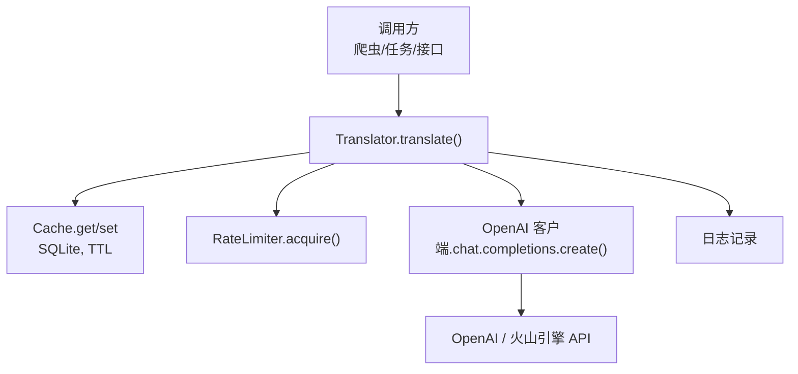
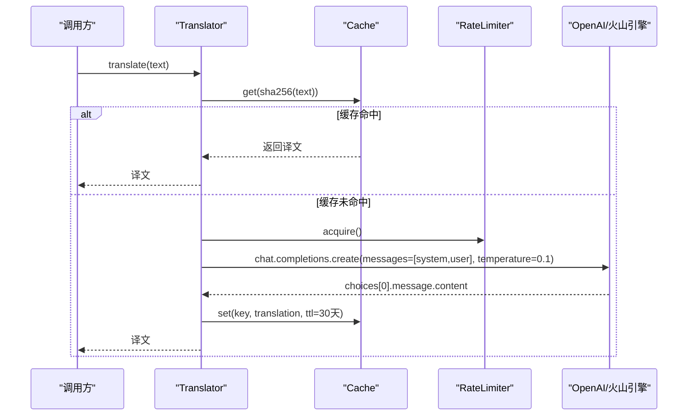
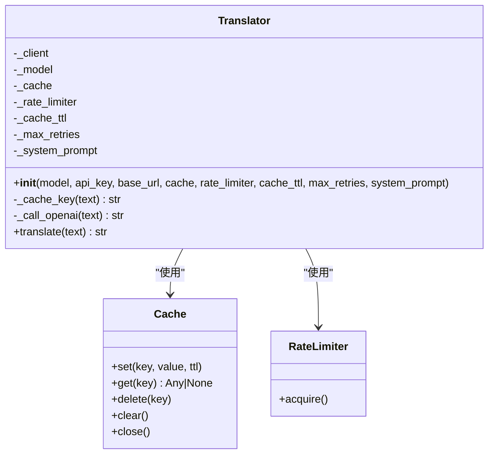
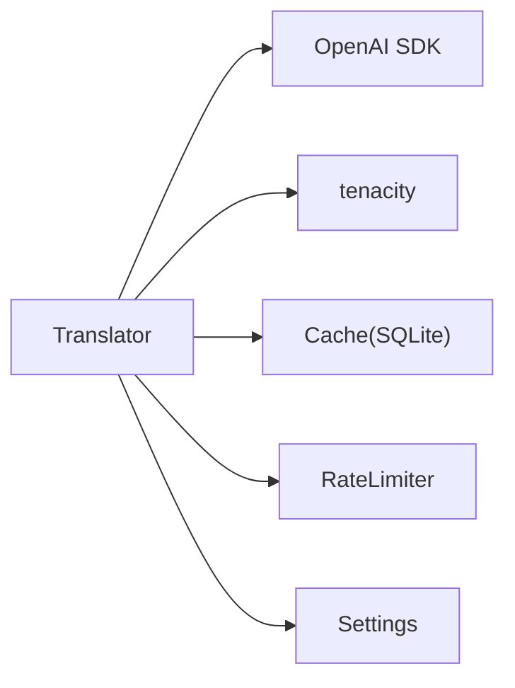

# 多语言翻译服务

<cite>
**本文引用的文件**
- [src/processors/translator.py](file://src/processors/translator.py)
- [tests/test_translator.py](file://tests/test_translator.py)
- [src/utils/cache.py](file://src/utils/cache.py)
- [src/utils/rate_limiter.py](file://src/utils/rate_limiter.py)
- [src/settings/settings.py](file://src/settings/settings.py)
- [src/config.py](file://src/config.py)
- [src/exceptions.py](file://src/exceptions.py)
</cite>

## 目录
1. [简介](#简介)
2. [项目结构](#项目结构)
3. [核心组件](#核心组件)
4. [架构总览](#架构总览)
5. [详细组件分析](#详细组件分析)
6. [依赖关系分析](#依赖关系分析)
7. [性能与优化](#性能与优化)
8. [故障排查指南](#故障排查指南)
9. [结论](#结论)
10. [附录：配置与使用示例](#附录配置与使用示例)

## 简介
本技术文档面向医学文献的多语言翻译服务，聚焦于英文摘要到中文的高质量翻译。系统基于 OpenAI 兼容的聊天模型（支持 OpenAI 与火山引擎），提供源语言检测、目标语言配置、翻译质量保障、专业术语处理、批量翻译优化、错误恢复机制以及缓存与速率限制等能力。文档从架构、数据流、关键算法、集成点、错误处理与性能调优等方面展开，并给出可操作的配置与排障建议。

## 项目结构
翻译服务位于 src/processors/translator.py，围绕 Translator 类构建，依赖以下通用工具：
- 缓存：src/utils/cache.py（SQLite 实现，线程安全，TTL）
- 速率限制：src/utils/rate_limiter.py（令牌桶算法）
- 配置：src/settings/settings.py（环境变量与 .env 加载，含火山引擎相关字段）
- 异常：src/exceptions.py（APIError 等）
- 测试：tests/test_translator.py（覆盖初始化、缓存命中、限流、重试等场景）

图表来源
- [src/processors/translator.py:195-250](file://src/processors/translator.py#L195-L250)
- [src/utils/cache.py:66-114](file://src/utils/cache.py#L66-L114)
- [src/utils/rate_limiter.py:43-57](file://src/utils/rate_limiter.py#L43-L57)

章节来源
- [src/processors/translator.py:1-251](file://src/processors/translator.py#L1-L251)
- [src/utils/cache.py:1-147](file://src/utils/cache.py#L1-L147)
- [src/utils/rate_limiter.py:1-81](file://src/utils/rate_limiter.py#L1-L81)
- [src/settings/settings.py:275-287](file://src/settings/settings.py#L275-L287)
- [tests/test_translator.py:1-259](file://tests/test_translator.py#L1-L259)

## 核心组件
- Translator：封装翻译流程，包括输入校验、缓存命中检查、速率控制、重试策略、API 调用与结果缓存。
- Cache：基于 SQLite 的线程安全缓存，支持 TTL 自动过期清理。
- RateLimiter：令牌桶实现的并发限速器，避免触发上游 API 限流。
- Settings：集中管理环境变量与 .env 配置，包含 OpenAI 与火山引擎相关键。
- 异常体系：统一 APIError 等异常类型，便于上层捕获与上报。

章节来源
- [src/processors/translator.py:65-133](file://src/processors/translator.py#L65-L133)
- [src/utils/cache.py:16-147](file://src/utils/cache.py#L16-L147)
- [src/utils/rate_limiter.py:10-81](file://src/utils/rate_limiter.py#L10-L81)
- [src/settings/settings.py:38-41](file://src/settings/settings.py#L38-L41)
- [src/settings/settings.py:275-287](file://src/settings/settings.py#L275-L287)
- [src/exceptions.py:29-39](file://src/exceptions.py#L29-L39)

## 架构总览
翻译服务采用“轻量入口 + 可插拔后端”的设计：
- 入口：Translator.translate(text) 提供统一的翻译接口。
- 后端：通过 OpenAI SDK 调用 OpenAI 或火山引擎的 Chat Completions 接口，二者共享同一客户端构造方式。
- 可靠性：tenacity 指数退避重试，针对速率限制、超时、连接失败、服务端错误进行自动恢复。
- 性能：SHA-256 确定性缓存键 + SQLite 持久化缓存 + 令牌桶限速，显著降低重复请求与外部延迟。
- 质量：系统提示词强调医学术语准确性、可读性与完整性，温度参数低以稳定输出。

图表来源
- [src/processors/translator.py:195-250](file://src/processors/translator.py#L195-L250)
- [src/utils/cache.py:66-114](file://src/utils/cache.py#L66-L114)
- [src/utils/rate_limiter.py:43-57](file://src/utils/rate_limiter.py#L43-L57)

## 详细组件分析

### Translator 类
职责与行为
- 初始化时自动选择后端：若配置了火山引擎密钥则优先使用；否则回退至 OpenAI。
- 输入校验：拒绝空文本。
- 缓存策略：对原文做 SHA-256 生成确定性键，默认 TTL 为 30 天。
- 速率控制：仅缓存未命中时获取令牌，避免无谓等待。
- 重试策略：对速率限制、超时、连接失败、服务端错误进行指数退避重试，最多 N 次。
- 质量保障：系统提示词约束术语准确性、可读性、结构与完整性；temperature 设为低值保证稳定性。

关键方法
- _cache_key(text): 生成确定性缓存键。
- _call_openai(text): 构造消息并调用聊天补全接口，解析响应内容。
- translate(text): 完整流程：校验→缓存→限速→重试→缓存→返回。

异常与错误处理
- 非重试错误（如参数错误）直接包装为 APIError。
- 重试耗尽后抛出 APIError，附带原始异常链以便定位。

章节来源
- [src/processors/translator.py:39-63](file://src/processors/translator.py#L39-L63)
- [src/processors/translator.py:100-133](file://src/processors/translator.py#L100-L133)
- [src/processors/translator.py:134-193](file://src/processors/translator.py#L134-L193)
- [src/processors/translator.py:195-250](file://src/processors/translator.py#L195-L250)
- [src/exceptions.py:29-39](file://src/exceptions.py#L29-L39)

#### 类图（代码级）

图表来源
- [src/processors/translator.py:65-133](file://src/processors/translator.py#L65-L133)
- [src/utils/cache.py:16-147](file://src/utils/cache.py#L16-L147)
- [src/utils/rate_limiter.py:10-81](file://src/utils/rate_limiter.py#L10-L81)

### 缓存模块（SQLite）
设计要点
- 线程安全：读写操作加锁，避免并发写冲突。
- TTL 过期：读取前清理过期条目，写入时计算 expires_at。
- 序列化：JSON 存储任意可序列化对象。
- 生命周期：支持上下文管理器自动关闭连接。

复杂度与性能
- 单次操作近似 O(1)，I/O 受 SQLite 影响；适合进程内缓存。
- 大体积文本建议合理设置 TTL 与定期清理。

章节来源
- [src/utils/cache.py:16-147](file://src/utils/cache.py#L16-L147)

### 速率限制器（令牌桶）
设计要点
- 令牌按时间线性补充，acquire 阻塞直到有可用令牌。
- 支持上下文管理器用法。
- 适用于保护外部 API 不被突发流量打满。

适用场景
- 翻译服务在缓存未命中时获取令牌，确保不超过配置的请求速率。

章节来源
- [src/utils/rate_limiter.py:10-81](file://src/utils/rate_limiter.py#L10-L81)

### 配置与环境变量
支持的翻译后端
- OpenAI：通过 OPENAI_API_KEY 启用，base_url 默认为官方地址。
- 火山引擎：通过 VOLCENGINE_API_KEY/VOLCENGINE_BASE_URL/VOLCENGINE_MODEL 启用，优先级高于 OpenAI。

其他相关配置
- LOG_LEVEL、LOG_FILE 用于日志级别与输出路径。
- REDIS_URL 预留扩展（当前缓存为 SQLite）。

章节来源
- [src/settings/settings.py:38-41](file://src/settings/settings.py#L38-L41)
- [src/settings/settings.py:275-287](file://src/settings/settings.py#L275-L287)
- [src/config.py:1-10](file://src/config.py#L1-L10)

## 依赖关系分析
- Translator 依赖 OpenAI SDK 与 tenacity。
- 依赖 Cache 与 RateLimiter 提升性能与稳定性。
- 依赖 Settings 提供统一的环境配置。
- 测试通过 Mock 验证缓存命中、限流、重试等行为。

图表来源
- [src/processors/translator.py:23-35](file://src/processors/translator.py#L23-L35)
- [src/utils/cache.py:8-13](file://src/utils/cache.py#L8-L13)
- [src/utils/rate_limiter.py:5-7](file://src/utils/rate_limiter.py#L5-L7)
- [src/settings/settings.py:17-28](file://src/settings/settings.py#L17-L28)

章节来源
- [src/processors/translator.py:23-35](file://src/processors/translator.py#L23-L35)
- [tests/test_translator.py:16-49](file://tests/test_translator.py#L16-L49)

## 性能与优化
- 缓存命中率：相同原文复用译文，默认 TTL 30 天，显著减少 API 调用。
- 速率限制：令牌桶平滑请求，避免触发上游限流。
- 重试策略：指数退避应对瞬时错误，提高成功率。
- 低温度参数：保证翻译结果稳定一致。
- 批处理建议：
  - 将待翻译文本去重后再批量提交，最大化缓存命中。
  - 分批次控制并发数，结合 RateLimiter 控制整体吞吐。
  - 对长文本分段翻译，降低单次请求大小与失败成本。
- 监控指标：
  - 缓存命中率、平均延迟、重试次数、失败率。
  - 日志中关注“Cache hit/miss”与重试事件。

[本节为通用指导，不直接分析具体文件]

## 故障排查指南
常见问题与定位
- 缺少 API 密钥：初始化时报错，需设置 OPENAI_API_KEY 或 VOLCENGINE_API_KEY。
- 空输入：translate 会抛出 ValueError，需在上层校验。
- 无有效返回：当 API 返回 choices 为空或内容为空时，抛出 APIError。
- 频繁限流：检查 RateLimiter 配置与上游配额，适当降低并发或增大 TTL。
- 重试耗尽：查看日志中的重试次数与错误类型，必要时调整 max_retries 或网络环境。

定位步骤
- 开启 INFO/DEBUG 日志，观察缓存命中与 API 调用。
- 检查环境变量与 .env 是否生效。
- 使用单元测试思路复现问题：Mock API 返回不同错误，验证重试与异常路径。

章节来源
- [src/processors/translator.py:100-133](file://src/processors/translator.py#L100-L133)
- [src/processors/translator.py:195-250](file://src/processors/translator.py#L195-L250)
- [tests/test_translator.py:52-118](file://tests/test_translator.py#L52-L118)
- [tests/test_translator.py:165-259](file://tests/test_translator.py#L165-L259)

## 结论
该翻译服务以 Translator 为核心，结合缓存、限速与重试机制，提供了稳定、高效且易于集成的医学文献英译中能力。通过系统提示词与低温度参数保障术语准确性与可读性；通过 SQLite 缓存与令牌桶限速提升吞吐与鲁棒性；通过环境变量与 .env 灵活切换 OpenAI 与火山引擎后端。建议在大规模场景中配合去重、分批与监控指标进一步优化。

[本节为总结性内容，不直接分析具体文件]

## 附录：配置与使用示例

### 配置项说明
- OPENAI_API_KEY：OpenAI 翻译与摘要所需密钥。
- VOLCENGINE_API_KEY/VOLCENGINE_BASE_URL/VOLCENGINE_MODEL：火山引擎翻译后端配置。
- LOG_LEVEL/LOG_FILE：日志级别与输出路径。
- REDIS_URL：预留扩展字段（当前缓存为 SQLite）。

章节来源
- [src/settings/settings.py:38-41](file://src/settings/settings.py#L38-L41)
- [src/settings/settings.py:275-287](file://src/settings/settings.py#L275-L287)
- [src/settings/settings.py:101-102](file://src/settings/settings.py#L101-L102)

### 使用示例（概念性）
- 初始化 Translator：传入 api_key、可选 model/base_url、cache、rate_limiter、max_retries、system_prompt。
- 调用 translate(text)：返回中文译文；若缓存命中则直接返回。
- 批量翻译：先对输入去重，再逐个调用 translate；利用缓存减少重复请求。

章节来源
- [src/processors/translator.py:100-133](file://src/processors/translator.py#L100-L133)
- [src/processors/translator.py:195-250](file://src/processors/translator.py#L195-L250)
- [tests/test_translator.py:72-144](file://tests/test_translator.py#L72-L144)

### 质量评估与术语处理
- 系统提示词要求保留专业术语准确性，必要时标注英文原文，同时保持通俗易懂。
- 低温度参数确保输出稳定，适合批量生产。
- 可通过自定义 system_prompt 进一步约束风格与格式。

章节来源
- [src/processors/translator.py:39-48](file://src/processors/translator.py#L39-L48)
- [src/processors/translator.py:169-180](file://src/processors/translator.py#L169-L180)

### 错误恢复机制
- 重试范围：速率限制、超时、连接失败、服务端错误。
- 重试策略：指数退避，最大尝试次数可配置。
- 非重试错误：立即包装为 APIError 并向上抛出。

章节来源
- [src/processors/translator.py:50-56](file://src/processors/translator.py#L50-L56)
- [src/processors/translator.py:232-245](file://src/processors/translator.py#L232-L245)
- [tests/test_translator.py:165-259](file://tests/test_translator.py#L165-L259)