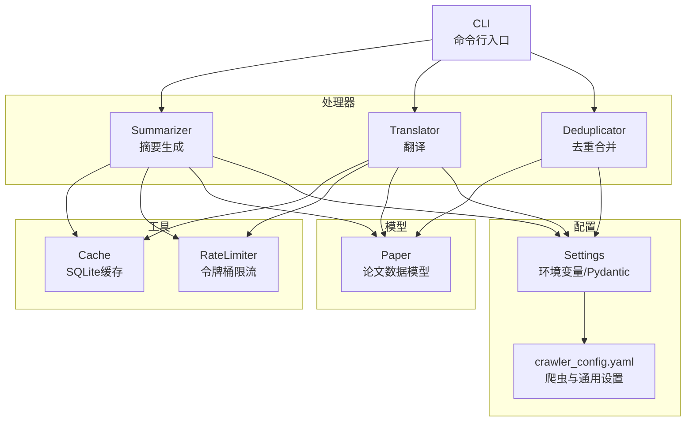
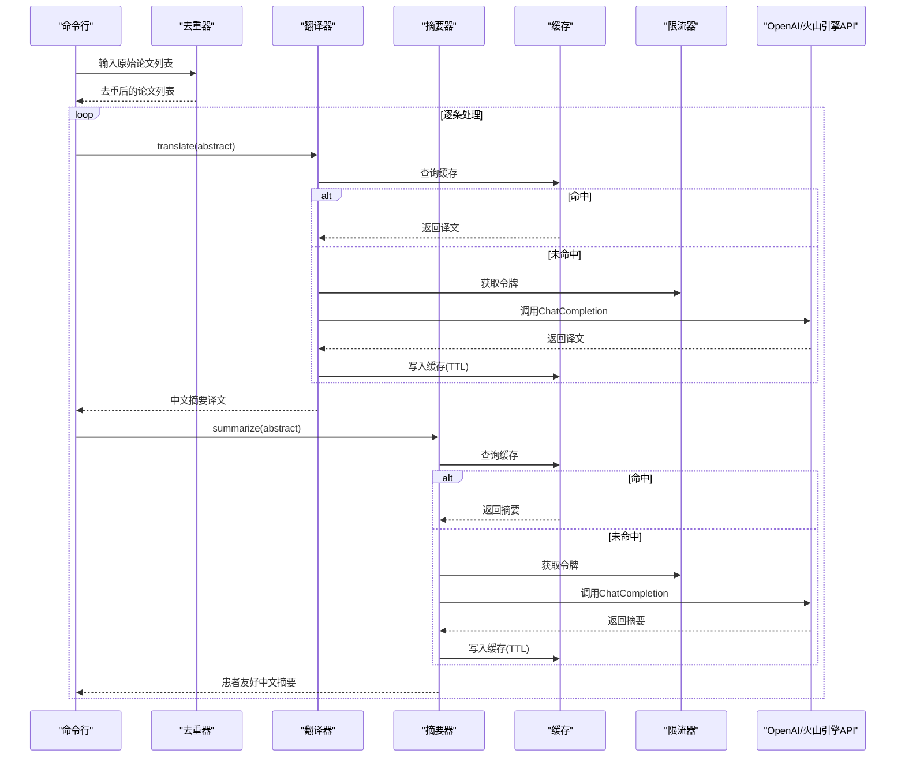
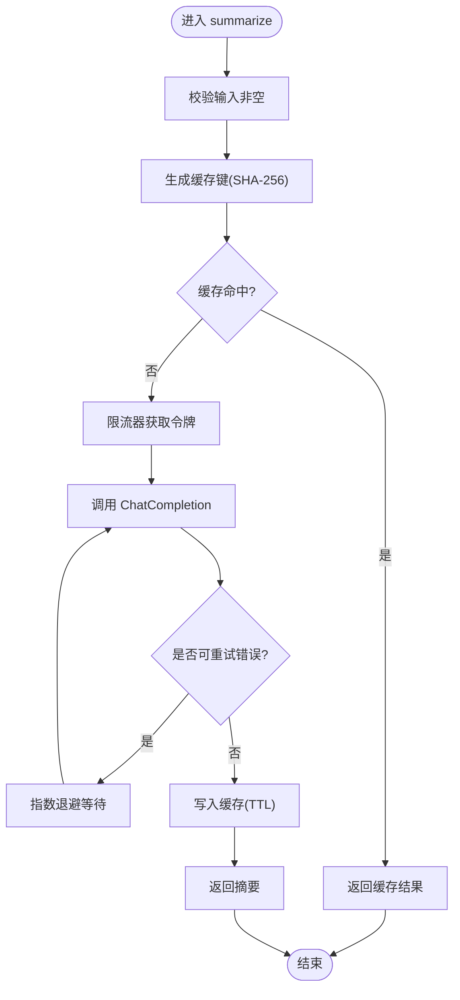
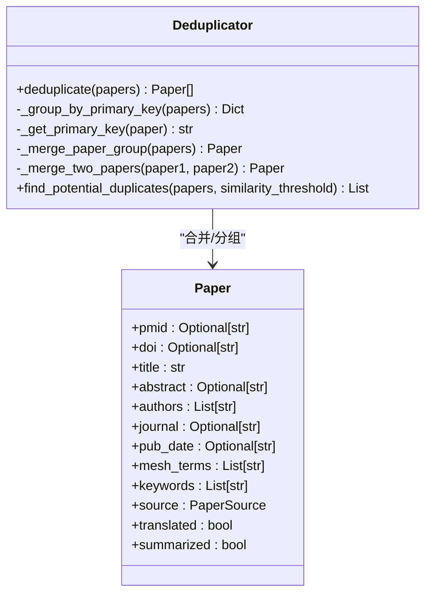
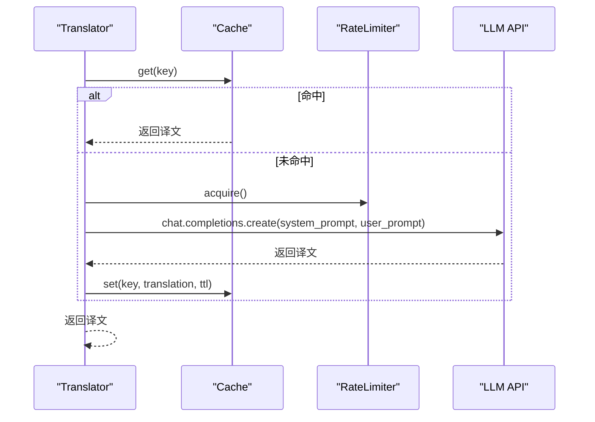
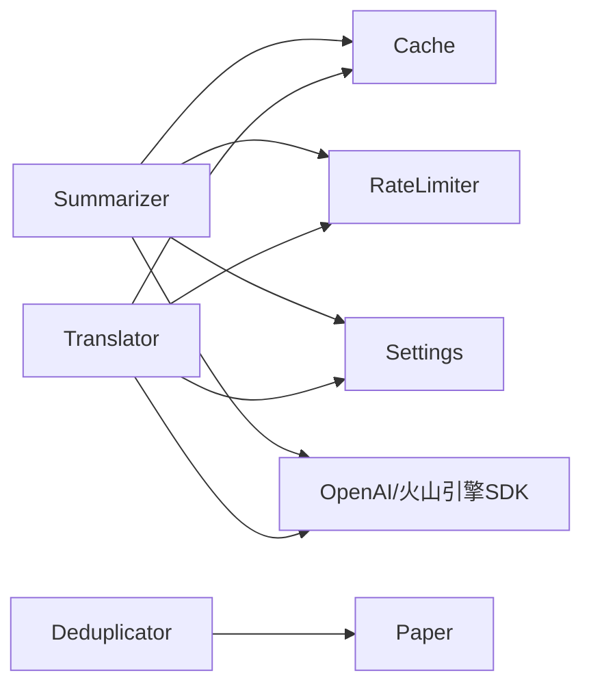

# 文本预处理流水线

<cite>
**本文引用的文件**   
- [src/processors/summarizer.py](file://src/processors/summarizer.py)
- [src/processors/deduplicator.py](file://src/processors/deduplicator.py)
- [src/processors/translator.py](file://src/processors/translator.py)
- [src/models/paper.py](file://src/models/paper.py)
- [src/utils/cache.py](file://src/utils/cache.py)
- [src/utils/rate_limiter.py](file://src/utils/rate_limiter.py)
- [src/settings/settings.py](file://src/settings/settings.py)
- [configs/crawler_config.yaml](file://configs/crawler_config.yaml)
- [src/cli.py](file://src/cli.py)
</cite>

## 目录
1. [简介](#简介)
2. [项目结构](#项目结构)
3. [核心组件](#核心组件)
4. [架构总览](#架构总览)
5. [详细组件分析](#详细组件分析)
6. [依赖关系分析](#依赖关系分析)
7. [性能考虑](#性能考虑)
8. [故障排查指南](#故障排查指南)
9. [结论](#结论)
10. [附录：配置与示例](#附录配置与示例)

## 简介
本技术文档围绕 Subskin 项目的“文本预处理流水线”展开，聚焦以下核心能力：
- 文献摘要生成：基于 OpenAI/火山引擎兼容 API 的 AI 摘要算法，输出面向患者的中文科普摘要。
- 内容去重处理：按 DOI/PMID 优先、标题+作者+年份哈希兜底的多源合并策略，支持字段级来源偏好与合并规则。
- 多语言翻译：英文医学摘要到中文的高质量翻译，集成限流、缓存与重试机制。
此外，文档还涵盖处理流程配置、批量处理优化、错误恢复机制、性能调优方案，并提供具体处理示例与参数配置指南。

## 项目结构
文本预处理相关代码集中在 src/processors 与 src/utils，数据模型在 src/models，配置通过 settings 与 YAML 管理，CLI 提供统一入口。

**图表来源** 
- [src/processors/summarizer.py:1-247](file://src/processors/summarizer.py#L1-L247)
- [src/processors/translator.py:1-251](file://src/processors/translator.py#L1-L251)
- [src/processors/deduplicator.py:1-319](file://src/processors/deduplicator.py#L1-L319)
- [src/models/paper.py:1-263](file://src/models/paper.py#L1-L263)
- [src/utils/cache.py:1-147](file://src/utils/cache.py#L1-L147)
- [src/utils/rate_limiter.py:1-81](file://src/utils/rate_limiter.py#L1-L81)
- [src/settings/settings.py:1-328](file://src/settings/settings.py#L1-L328)
- [configs/crawler_config.yaml:1-143](file://configs/crawler_config.yaml#L1-L143)
- [src/cli.py:1-330](file://src/cli.py#L1-L330)

**章节来源**
- [src/processors/summarizer.py:1-247](file://src/processors/summarizer.py#L1-L247)
- [src/processors/translator.py:1-251](file://src/processors/translator.py#L1-L251)
- [src/processors/deduplicator.py:1-319](file://src/processors/deduplicator.py#L1-L319)
- [src/models/paper.py:1-263](file://src/models/paper.py#L1-L263)
- [src/utils/cache.py:1-147](file://src/utils/cache.py#L1-L147)
- [src/utils/rate_limiter.py:1-81](file://src/utils/rate_limiter.py#L1-L81)
- [src/settings/settings.py:1-328](file://src/settings/settings.py#L1-L328)
- [configs/crawler_config.yaml:1-143](file://configs/crawler_config.yaml#L1-L143)
- [src/cli.py:1-330](file://src/cli.py#L1-L330)

## 核心组件
- Summarizer（摘要生成）
  - 使用 OpenAI/火山引擎兼容 ChatCompletion API，系统提示词约束输出为面向患者的中文科普摘要，包含治疗方法、结果、结论与免责声明。
  - 内置缓存键（SHA-256）、令牌桶限流、指数退避重试；默认温度较低以保证稳定性。
- Translator（翻译）
  - 将英文医学摘要翻译为中文，强调术语准确性与信息完整性，低温度保证一致性。
  - 同样具备缓存、限流与重试（tenacity），失败时抛出结构化异常。
- Deduplicator（去重合并）
  - 以 DOI > PMID > 标题+首作者+年份哈希为主键分组，按来源优先级合并字段（如 PubMed 优先），并维护作者集合、关键词、MeSH 等并集。
  - 保留处理状态位（translated/summarized）的 OR 语义。
- Cache（缓存）
  - SQLite 实现，线程安全，TTL 过期清理，支持 get/set/delete/clear。
- RateLimiter（限流）
  - 令牌桶算法，可配置请求速率，阻塞式获取令牌，支持上下文管理器。
- Settings（配置）
  - Pydantic 强类型配置，从环境变量或 .env 加载，包含 OpenAI/Volcengine 密钥、模型、基础 URL 等。
- Paper（数据模型）
  - 定义论文元数据、标识符、翻译与摘要结果字段、处理状态等，含日期/DOI/URL 校验。

**章节来源**
- [src/processors/summarizer.py:1-247](file://src/processors/summarizer.py#L1-L247)
- [src/processors/translator.py:1-251](file://src/processors/translator.py#L1-L251)
- [src/processors/deduplicator.py:1-319](file://src/processors/deduplicator.py#L1-L319)
- [src/utils/cache.py:1-147](file://src/utils/cache.py#L1-L147)
- [src/utils/rate_limiter.py:1-81](file://src/utils/rate_limiter.py#L1-L81)
- [src/settings/settings.py:1-328](file://src/settings/settings.py#L1-L328)
- [src/models/paper.py:1-263](file://src/models/paper.py#L1-L263)

## 架构总览
文本预处理流水线由“采集→去重→翻译→摘要→导出”组成，其中翻译与摘要均依赖统一的 LLM 客户端、缓存与限流器，去重模块负责多源聚合与字段合并。

**图表来源** 
- [src/processors/deduplicator.py:1-319](file://src/processors/deduplicator.py#L1-L319)
- [src/processors/translator.py:1-251](file://src/processors/translator.py#L1-L251)
- [src/processors/summarizer.py:1-247](file://src/processors/summarizer.py#L1-L247)
- [src/utils/cache.py:1-147](file://src/utils/cache.py#L1-L147)
- [src/utils/rate_limiter.py:1-81](file://src/utils/rate_limiter.py#L1-L81)

## 详细组件分析

### 摘要生成（Summarizer）
- 算法要点
  - 系统提示词约束输出结构与免责声明，用户提示模板注入待处理的英文摘要。
  - 自动选择 Volcengine 或 OpenAI 客户端（依据 settings 中的 VOLCENGINE_* 或 OPENAI_API_KEY）。
  - 缓存键为摘要文本的 SHA-256，避免重复计算。
  - 指数退避重试（连接超时、限流、网络错误），最终失败抛出 SummarizerError。
- 关键方法
  - summarize：校验输入→查缓存→限流→调用LLM→写缓存→返回。
  - _call_openai/_call_with_retry：封装单次调用与重试逻辑。
- 复杂度与性能
  - 时间复杂度 O(1) 每次调用（受限于外部 API），空间复杂度 O(1)。
  - 通过缓存显著降低重复调用成本；限流保护配额。

**图表来源** 
- [src/processors/summarizer.py:1-247](file://src/processors/summarizer.py#L1-L247)

**章节来源**
- [src/processors/summarizer.py:1-247](file://src/processors/summarizer.py#L1-L247)

### 内容去重（Deduplicator）
- 主键策略
  - 首选 DOI，其次 PMID，最后以“标题前缀+首作者+年份”的 MD5 哈希作为兜底分组键。
- 合并策略
  - 按来源优先级排序（默认 PubMed > Semantic Scholar），以首个来源为基础，逐项合并字段：
    - 标题/摘要：取更长更完整者
    - 作者/关键词/MeSH：并集去重
    - 期刊：优先非空且遵循来源优先级
    - 出版日期：更精确者优先
    - 引用数：取最大值
    - 处理状态：OR 语义
- 扩展点
  - find_potential_duplicates 预留模糊匹配接口（当前返回空，可扩展 Levenshtein/Jaccard）。

**图表来源** 
- [src/processors/deduplicator.py:1-319](file://src/processors/deduplicator.py#L1-L319)
- [src/models/paper.py:1-263](file://src/models/paper.py#L1-L263)

**章节来源**
- [src/processors/deduplicator.py:1-319](file://src/processors/deduplicator.py#L1-L319)
- [src/models/paper.py:1-263](file://src/models/paper.py#L1-L263)

### 翻译服务（Translator）
- 算法要点
  - 系统提示词强调医学术语准确性与信息完整性，用户提示注入待翻译文本。
  - 自动选择 Volcengine 或 OpenAI 客户端，失败抛出自定义 APIError。
  - 使用 tenacity 进行指数退避重试，缓存 TTL 默认 30 天。
- 关键方法
  - translate：校验输入→查缓存→限流→调用LLM→写缓存→返回。
  - _call_openai：封装单次调用与异常分类（可重试/不可重试）。

**图表来源** 
- [src/processors/translator.py:1-251](file://src/processors/translator.py#L1-L251)
- [src/utils/cache.py:1-147](file://src/utils/cache.py#L1-L147)
- [src/utils/rate_limiter.py:1-81](file://src/utils/rate_limiter.py#L1-L81)

**章节来源**
- [src/processors/translator.py:1-251](file://src/processors/translator.py#L1-L251)

### 数据模型（Paper）
- 关键字段
  - 标识符：pmid、pmcid、doi
  - 元数据：title、abstract、authors、journal、pub_date、mesh_terms、keywords
  - 来源与时间：source、crawled_at
  - 翻译与摘要：chinese_abstract、chinese_fulltext、summary
  - 处理状态：translated、summarized
- 校验
  - pub_date 格式校验与年份提取
  - doi 基本格式校验与 URL 中提取
  - url 协议补全

**章节来源**
- [src/models/paper.py:1-263](file://src/models/paper.py#L1-L263)

### 缓存与限流
- Cache
  - SQLite 存储，线程安全锁，TTL 过期清理，支持 JSON 序列化存取。
- RateLimiter
  - 令牌桶算法，按秒填充令牌，acquire 阻塞直到可用，支持 with 上下文。

**章节来源**
- [src/utils/cache.py:1-147](file://src/utils/cache.py#L1-L147)
- [src/utils/rate_limiter.py:1-81](file://src/utils/rate_limiter.py#L1-L81)

### 配置与环境
- Settings
  - 通过 Pydantic 强类型加载，支持 .env 与环境变量覆盖。
  - 关键键：OPENAI_API_KEY、VOLCENGINE_API_KEY/BASE_URL/MODEL、LOG_LEVEL、WORKER_PROCESSES、MAX_CONCURRENT_TASKS 等。
- crawler_config.yaml
  - 定义各数据源的搜索词、API 限制、分页与过滤条件，以及通用重试/超时/日志/监控/数据保留策略。

**章节来源**
- [src/settings/settings.py:1-328](file://src/settings/settings.py#L1-L328)
- [configs/crawler_config.yaml:1-143](file://configs/crawler_config.yaml#L1-L143)

## 依赖关系分析
- 组件耦合
  - Summarizer/Translator 共同依赖 Cache、RateLimiter、Settings 与 OpenAI SDK。
  - Deduplicator 依赖 Paper 模型与枚举 PaperSource。
- 外部依赖
  - OpenAI SDK（兼容火山引擎）
  - SQLite（本地缓存）
  - tenacity（重试）
- 潜在循环
  - 无直接循环依赖；处理器之间解耦，通过 CLI 编排。

**图表来源** 
- [src/processors/summarizer.py:1-247](file://src/processors/summarizer.py#L1-L247)
- [src/processors/translator.py:1-251](file://src/processors/translator.py#L1-L251)
- [src/processors/deduplicator.py:1-319](file://src/processors/deduplicator.py#L1-L319)
- [src/utils/cache.py:1-147](file://src/utils/cache.py#L1-L147)
- [src/utils/rate_limiter.py:1-81](file://src/utils/rate_limiter.py#L1-L81)
- [src/settings/settings.py:1-328](file://src/settings/settings.py#L1-L328)
- [src/models/paper.py:1-263](file://src/models/paper.py#L1-L263)

**章节来源**
- [src/processors/summarizer.py:1-247](file://src/processors/summarizer.py#L1-L247)
- [src/processors/translator.py:1-251](file://src/processors/translator.py#L1-L251)
- [src/processors/deduplicator.py:1-319](file://src/processors/deduplicator.py#L1-L319)
- [src/utils/cache.py:1-147](file://src/utils/cache.py#L1-L147)
- [src/utils/rate_limiter.py:1-81](file://src/utils/rate_limiter.py#L1-L81)
- [src/settings/settings.py:1-328](file://src/settings/settings.py#L1-L328)
- [src/models/paper.py:1-263](file://src/models/paper.py#L1-L263)

## 性能考虑
- 缓存命中率
  - 翻译与摘要均使用确定性键（SHA-256），相同输入直接命中，减少 API 调用。
  - 建议合理设置 TTL（默认 30 天），根据数据更新频率调整。
- 限流与并发
  - RateLimiter 默认 10 req/min，可按 API 配额调高；结合 MAX_CONCURRENT_TASKS 控制并发任务数。
- 重试与退避
  - 指数退避避免瞬时抖动导致雪崩；对连接超时、限流、服务器错误有效。
- I/O 与存储
  - SQLite 缓存适合单机轻量场景；高并发可替换为 Redis（settings 中已预留 REDIS_URL）。
- 批处理优化
  - 批量读取 JSON→去重→翻译→摘要→导出，尽量复用同一 Cache/RateLimiter 实例以减少开销。
- 模型与温度
  - 摘要/翻译使用较低 temperature（0.1~0.3）提升稳定性与一致性。

[本节为通用指导，不直接分析具体文件]

## 故障排查指南
- 常见错误
  - 缺少 API Key：初始化时报错，检查 OPENAI_API_KEY 或 VOLCENGINE_API_KEY。
  - 限流触发：RateLimitError，适当降低并发或提高限流阈值。
  - 网络超时/连接失败：APITimeoutError/APIConnectionError，检查网络与代理设置。
  - 空响应：OpenAI 返回空 choices/content，检查 prompt 长度与模型能力。
- 定位步骤
  - 查看日志级别（LOG_LEVEL=DEBUG）确认缓存命中/未命中与重试次数。
  - 验证 settings.validate() 与 missing_keys() 输出。
  - 临时关闭缓存（传入 None）判断是否为缓存污染。
- 恢复策略
  - 增加 max_retries 与 backoff 上限；对不可重试错误记录并跳过继续处理。
  - 对大文件分批处理，失败项单独落盘以便重试。

**章节来源**
- [src/processors/translator.py:1-251](file://src/processors/translator.py#L1-L251)
- [src/processors/summarizer.py:1-247](file://src/processors/summarizer.py#L1-L247)
- [src/settings/settings.py:1-328](file://src/settings/settings.py#L1-L328)

## 结论
Subskin 文本预处理流水线以“去重→翻译→摘要”为核心路径，借助统一的缓存与限流机制保障稳定与高效。通过可插拔的 LLM 后端（OpenAI/火山引擎）与严格的配置管理，既满足医学内容的准确性要求，又兼顾患者可读性。建议在大规模批处理场景中结合数据库/Redis 与异步任务队列进一步提升吞吐与容错能力。

[本节为总结，不直接分析具体文件]

## 附录：配置与示例

### 处理流程配置
- Settings 关键项
  - OPENAI_API_KEY / VOLCENGINE_API_KEY：LLM 认证
  - VOLCENGINE_BASE_URL / VOLCENGINE_MODEL：火山引擎兼容端点与模型名
  - LOG_LEVEL / LOG_FILE：日志级别与文件
  - WORKER_PROCESSES / MAX_CONCURRENT_TASKS / TASK_TIMEOUT_SECONDS：并发与超时
- crawler_config.yaml
  - 数据源搜索词、API 限制、分页与过滤条件
  - 通用重试/超时/输出/日志/监控/数据保留策略

**章节来源**
- [src/settings/settings.py:1-328](file://src/settings/settings.py#L1-L328)
- [configs/crawler_config.yaml:1-143](file://configs/crawler_config.yaml#L1-L143)

### 批量处理优化
- 推荐流程
  - 读取 raw JSON → Deduplicator.deduplicate → 遍历翻译 → 遍历摘要 → 导出
- 资源复用
  - 单进程内共享 Cache/RateLimiter 实例，减少初始化与锁竞争
- 分片与断点续跑
  - 按批次切分文件，记录已处理 ID 集合，失败后仅重放失败批次

[本节为通用指导，不直接分析具体文件]

### 错误恢复机制
- 重试策略
  - 指数退避（max_retries=3，初始间隔 1s，倍增）
- 异常分类
  - 可重试：限流、超时、连接、5xx
  - 不可重试：参数错误、空响应、权限不足
- 降级与隔离
  - 单个条目失败不影响整体；失败项写入 error.json 便于后续修复

**章节来源**
- [src/processors/translator.py:1-251](file://src/processors/translator.py#L1-L251)
- [src/processors/summarizer.py:1-247](file://src/processors/summarizer.py#L1-L247)

### 性能调优方案
- 缓存
  - 增大 TTL 至 30 天以上；热点键预热
- 限流
  - 根据 API 配额上调 requests_per_second；必要时拆分多进程
- 并发
  - 调整 MAX_CONCURRENT_TASKS 与 WORKER_PROCESSES，观察 CPU/IO 瓶颈
- 模型
  - 选择性价比更高的模型；降低 temperature 提升一致性

[本节为通用指导，不直接分析具体文件]

### 具体处理示例与参数指南
- CLI 命令
  - 抓取与导出：crawl-pubmed / crawl-scholar / export-markdown
  - 处理与更新：process / update / status
- 典型用法
  - python -m src.cli crawl-pubmed --query "vitiligo" --output data/raw/pubmed.json --limit 100
  - python -m src.cli export-markdown --input data/raw/papers.json --output data/exports/ --collection vitiligo_weekly
- 参数说明
  - --input/--output：输入输出路径
  - --query/--condition：搜索词
  - --limit：最大条目数
  - --collection：命名合集导出

**章节来源**
- [src/cli.py:1-330](file://src/cli.py#L1-L330)