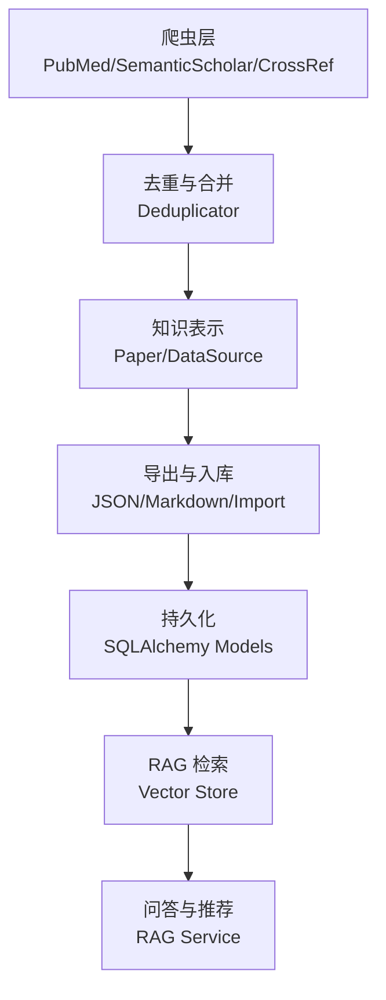
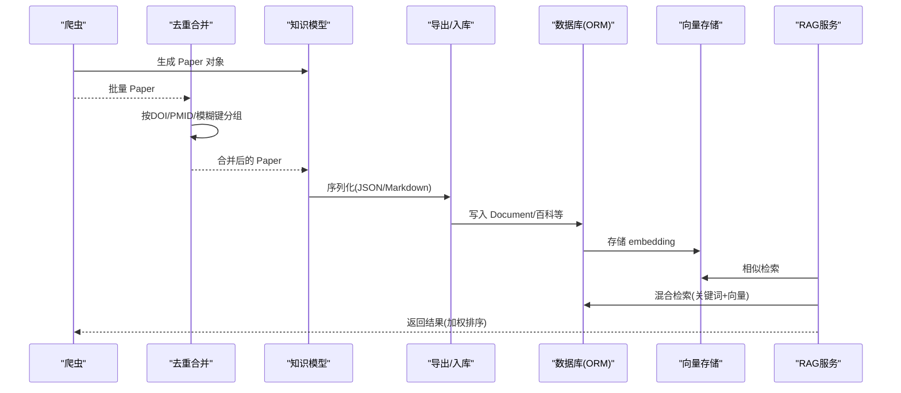
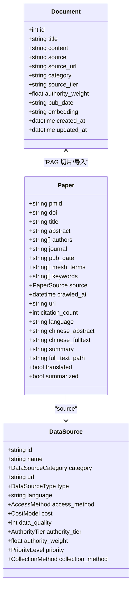
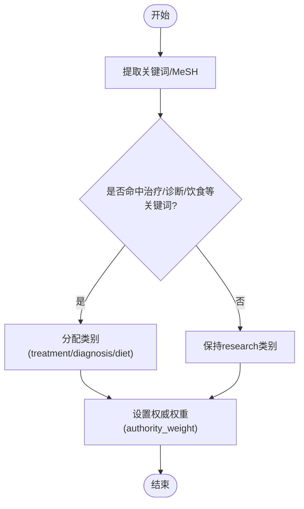
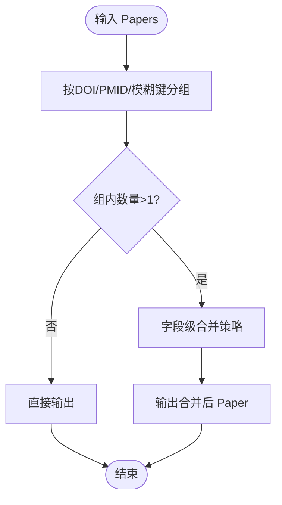
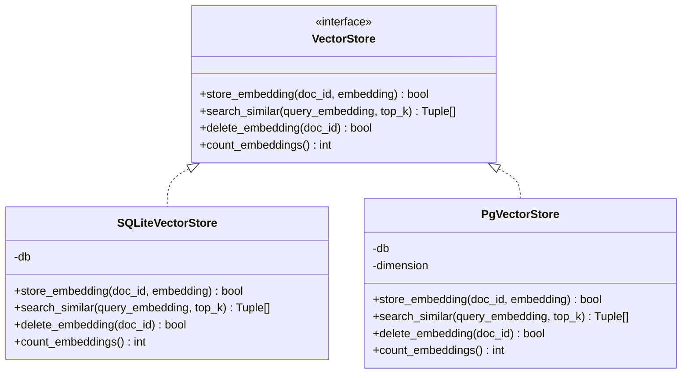
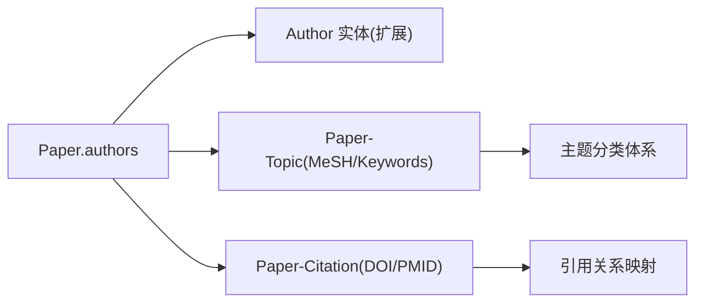
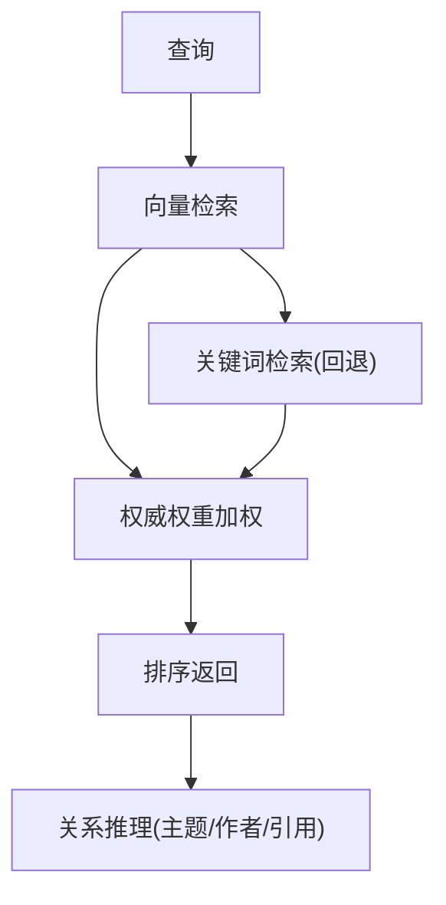
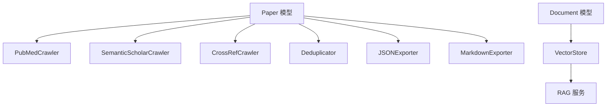

# 知识图谱构建

<cite>
**本文引用的文件**   
- [src/models/paper.py](file://src/models/paper.py)
- [src/models/data_source.py](file://src/models/data_source.py)
- [src/crawlers/pubmed_crawler.py](file://src/crawlers/pubmed_crawler.py)
- [src/crawlers/semantic_scholar_crawler.py](file://src/crawlers/semantic_scholar_crawler.py)
- [src/crawlers/crossref_crawler.py](file://src/crawlers/crossref_crawler.py)
- [src/processors/deduplicator.py](file://src/processors/deduplicator.py)
- [src/exporters/json_exporter.py](file://src/exporters/json_exporter.py)
- [src/exporters/markdown_exporter.py](file://src/exporters/markdown_exporter.py)
- [web/backend/database/models.py](file://web/backend/database/models.py)
- [web/backend/services/vector_store.py](file://web/backend/services/vector_store.py)
- [web/backend/services/rag.py](file://web/backend/services/rag.py)
- [web/backend/scripts/import_knowledge.py](file://web/backend/scripts/import_knowledge.py)
- [configs/web_config.yaml](file://configs/web_config.yaml)
- [src/scheduler/update_scheduler.py](file://src/scheduler/update_scheduler.py)
</cite>

## 目录
1. [引言](#引言)
2. [项目结构](#项目结构)
3. [核心组件](#核心组件)
4. [架构总览](#架构总览)
5. [详细组件分析](#详细组件分析)
6. [依赖关系分析](#依赖关系分析)
7. [性能考量](#性能考量)
8. [故障排查指南](#故障排查指南)
9. [结论](#结论)
10. [附录](#附录)

## 引言
本技术文档围绕 Subskin 项目的“知识图谱构建”目标，系统阐述实体与关系抽取、概念关联建模、知识表示方法与图谱存储设计。结合现有代码库中的论文采集、去重合并、RAG 检索、向量存储与数据库模型，给出面向“论文元数据结构化、作者关系网络、主题分类体系、引用关系映射”的可落地方案，并补充查询优化、关系推理机制、版本控制与一致性保证策略，以及可视化展示建议。

## 项目结构
Subskin 的知识图谱相关能力由以下模块协同实现：
- 数据采集层：多源论文抓取（PubMed、Semantic Scholar、CrossRef）
- 数据治理层：去重合并、导出（JSON/Markdown）、增量更新
- 知识表示层：Pydantic 模型定义（Paper、DataSource 等）
- 检索与增强层：RAG 服务、向量存储抽象（SQLite/pgvector/Qdrant）
- 持久化层：SQLAlchemy ORM 模型（含 Document、Encyclopedia 等）
- 配置与调度：Web 配置（数据库、Redis、向量库）、定时任务与增量去重

**图表来源** 
- [src/crawlers/pubmed_crawler.py:129-152](file://src/crawlers/pubmed_crawler.py#L129-L152)
- [src/crawlers/semantic_scholar_crawler.py:196-237](file://src/crawlers/semantic_scholar_crawler.py#L196-L237)
- [src/crawlers/crossref_crawler.py:159-201](file://src/crawlers/crossref_crawler.py#L159-L201)
- [src/processors/deduplicator.py:57-90](file://src/processors/deduplicator.py#L57-L90)
- [src/models/paper.py:18-128](file://src/models/paper.py#L18-L128)
- [src/models/data_source.py:98-170](file://src/models/data_source.py#L98-L170)
- [src/exporters/json_exporter.py:41-85](file://src/exporters/json_exporter.py#L41-L85)
- [src/exporters/markdown_exporter.py:67-131](file://src/exporters/markdown_exporter.py#L67-L131)
- [web/backend/database/models.py:255-272](file://web/backend/database/models.py#L255-L272)
- [web/backend/services/vector_store.py:51-109](file://web/backend/services/vector_store.py#L51-L109)
- [web/backend/services/rag.py:456-522](file://web/backend/services/rag.py#L456-L522)

**章节来源**
- [src/crawlers/pubmed_crawler.py:129-152](file://src/crawlers/pubmed_crawler.py#L129-L152)
- [src/crawlers/semantic_scholar_crawler.py:196-237](file://src/crawlers/semantic_scholar_crawler.py#L196-L237)
- [src/crawlers/crossref_crawler.py:159-201](file://src/crawlers/crossref_crawler.py#L159-L201)
- [src/processors/deduplicator.py:57-90](file://src/processors/deduplicator.py#L57-L90)
- [src/models/paper.py:18-128](file://src/models/paper.py#L18-L128)
- [src/models/data_source.py:98-170](file://src/models/data_source.py#L98-L170)
- [src/exporters/json_exporter.py:41-85](file://src/exporters/json_exporter.py#L41-L85)
- [src/exporters/markdown_exporter.py:67-131](file://src/exporters/markdown_exporter.py#L67-L131)
- [web/backend/database/models.py:255-272](file://web/backend/database/models.py#L255-L272)
- [web/backend/services/vector_store.py:51-109](file://web/backend/services/vector_store.py#L51-L109)
- [web/backend/services/rag.py:456-522](file://web/backend/services/rag.py#L456-L522)

## 核心组件
- 论文数据模型（Paper）：统一标识（PMID/DOI/URL）、标题、摘要、作者、期刊、发表日期、MeSH/关键词、来源、抓取时间、翻译与摘要状态等
- 数据源模型（DataSource）：权威等级（S/A/B/C/D）、权重、质量评分、优先级、采集方式、访问方法、成本模型等
- 爬虫组件：PubMed、Semantic Scholar、CrossRef 的标准化解析与 Paper 对象构造
- 去重合并器（Deduplicator）：按 DOI > PMID > 标题+作者+年份哈希分组，字段级合并策略
- 导出器：JSON/Markdown 结构化输出，便于离线分析与导入
- RAG 服务：混合检索（向量+关键词），相似度计算、权威性与时效性加权
- 向量存储抽象：SQLite/pgvector/Qdrant 统一接口
- 数据库模型：Document（RAG 文档）、Encyclopedia（百科文章与修订）、用户与社区相关表等

**章节来源**
- [src/models/paper.py:18-128](file://src/models/paper.py#L18-L128)
- [src/models/data_source.py:98-170](file://src/models/data_source.py#L98-L170)
- [src/crawlers/pubmed_crawler.py:224-259](file://src/crawlers/pubmed_crawler.py#L224-L259)
- [src/crawlers/semantic_scholar_crawler.py:196-237](file://src/crawlers/semantic_scholar_crawler.py#L196-L237)
- [src/crawlers/crossref_crawler.py:159-201](file://src/crawlers/crossref_crawler.py#L159-L201)
- [src/processors/deduplicator.py:174-275](file://src/processors/deduplicator.py#L174-L275)
- [src/exporters/json_exporter.py:41-85](file://src/exporters/json_exporter.py#L41-L85)
- [src/exporters/markdown_exporter.py:67-131](file://src/exporters/markdown_exporter.py#L67-L131)
- [web/backend/database/models.py:255-272](file://web/backend/database/models.py#L255-L272)
- [web/backend/services/vector_store.py:51-109](file://web/backend/services/vector_store.py#L51-L109)
- [web/backend/services/rag.py:456-522](file://web/backend/services/rag.py#L456-L522)

## 架构总览
下图展示了从数据采集到知识检索的整体流程，涵盖实体抽取、关系建模、知识表示与存储、以及 RAG 检索与问答。

**图表来源** 
- [src/crawlers/pubmed_crawler.py:129-152](file://src/crawlers/pubmed_crawler.py#L129-L152)
- [src/processors/deduplicator.py:57-90](file://src/processors/deduplicator.py#L57-L90)
- [src/exporters/json_exporter.py:41-85](file://src/exporters/json_exporter.py#L41-L85)
- [web/backend/database/models.py:255-272](file://web/backend/database/models.py#L255-L272)
- [web/backend/services/vector_store.py:51-109](file://web/backend/services/vector_store.py#L51-L109)
- [web/backend/services/rag.py:456-522](file://web/backend/services/rag.py#L456-L522)

## 详细组件分析

### 实体与关系抽取
- 实体类型
  - 论文（Paper）：PMID/DOI/URL、标题、摘要、作者、期刊、发表日期、MeSH/关键词、来源、抓取时间、语言、翻译与摘要状态
  - 数据源（DataSource）：权威等级、权重、质量评分、优先级、采集方式、访问方法、成本模型
  - 文档（Document）：用于 RAG 的知识片段，包含标题、内容、来源、类别、权威权重、发布时间、embedding
- 关系类型
  - 作者-论文（Author-Paper）：通过 authors 列表建立
  - 论文-主题（Paper-Topic）：通过 keywords/mesh_terms 建立
  - 论文-引用（Paper-Citation）：通过 citation_count 与外部标识（DOI/PMID）可推导
  - 数据源-论文（Source-Paper）：source 字段标注来源
- 抽取实现
  - PubMed 抓取：规范化作者、MeSH、关键词、发表日期，构造 Paper
  - Semantic Scholar 抓取：externalIds、authors、url、year 等字段映射
  - CrossRef 抓取：author/given/family、abstract、DOI、container-title、pub_date 解析

**图表来源** 
- [src/models/paper.py:18-128](file://src/models/paper.py#L18-L128)
- [src/models/data_source.py:98-170](file://src/models/data_source.py#L98-L170)
- [web/backend/database/models.py:255-272](file://web/backend/database/models.py#L255-L272)

**章节来源**
- [src/crawlers/pubmed_crawler.py:224-259](file://src/crawlers/pubmed_crawler.py#L224-L259)
- [src/crawlers/semantic_scholar_crawler.py:196-237](file://src/crawlers/semantic_scholar_crawler.py#L196-L237)
- [src/crawlers/crossref_crawler.py:159-201](file://src/crawlers/crossref_crawler.py#L159-L201)
- [src/models/paper.py:18-128](file://src/models/paper.py#L18-L128)
- [src/models/data_source.py:98-170](file://src/models/data_source.py#L98-L170)
- [web/backend/database/models.py:255-272](file://web/backend/database/models.py#L255-L272)

### 概念关联建模
- 主题分类体系
  - 基于 keywords 与 mesh_terms 构建主题词表；在 import_knowledge 脚本中根据关键词集合自动归类（如 treatment/diagnosis/diet 等）
- 权威等级与权重
  - DataSource.authority_tier 与 authority_weight 影响 RAG 检索排序；RAG 服务对权威性与时效性进行加权
- 作者关系网络
  - 通过 authors 列表聚合，后续可扩展为 Author 实体与 Author-Paper 关系，支持共现网络与影响力分析

**图表来源** 
- [web/backend/scripts/import_knowledge.py:77-115](file://web/backend/scripts/import_knowledge.py#L77-L115)
- [src/models/data_source.py:118-125](file://src/models/data_source.py#L118-L125)
- [web/backend/services/rag.py:422-431](file://web/backend/services/rag.py#L422-L431)

**章节来源**
- [web/backend/scripts/import_knowledge.py:77-115](file://web/backend/scripts/import_knowledge.py#L77-L115)
- [src/models/data_source.py:118-125](file://src/models/data_source.py#L118-L125)
- [web/backend/services/rag.py:422-431](file://web/backend/services/rag.py#L422-L431)

### 知识表示方法
- Pydantic 模型约束：Paper/DataSource 使用 Field/validator 确保格式与范围校验（如 DOI、URL、data_quality）
- 结构化导出：JSONExporter 将 Paper/Trial 序列化为 JSON，支持日期目录与元数据；MarkdownExporter 生成带 frontmatter 的结构化文档
- 增量与去重：Deduplicator 按 DOI/PMID/模糊键分组，字段级合并（标题长度、摘要长度、作者并集、期刊非空优先、日期精度、MeSH/关键词并集、URL 合并、引用次数取最大、抓取时间取最新）

**图表来源** 
- [src/processors/deduplicator.py:57-90](file://src/processors/deduplicator.py#L57-L90)
- [src/processors/deduplicator.py:174-275](file://src/processors/deduplicator.py#L174-L275)
- [src/exporters/json_exporter.py:41-85](file://src/exporters/json_exporter.py#L41-L85)
- [src/exporters/markdown_exporter.py:67-131](file://src/exporters/markdown_exporter.py#L67-L131)

**章节来源**
- [src/processors/deduplicator.py:57-90](file://src/processors/deduplicator.py#L57-L90)
- [src/processors/deduplicator.py:174-275](file://src/processors/deduplicator.py#L174-L275)
- [src/exporters/json_exporter.py:41-85](file://src/exporters/json_exporter.py#L41-L85)
- [src/exporters/markdown_exporter.py:67-131](file://src/exporters/markdown_exporter.py#L67-L131)

### 图谱存储设计
- 关系型存储（SQLAlchemy）
  - Document：RAG 文档主表，包含标题、内容、来源、类别、权威权重、发布时间、embedding（Text JSON）
  - EncyclopediaArticle/Revision：百科文章与修订记录，支持版本历史与评论投票
  - 其他业务表：用户、社区、IM、审计日志等（与知识图谱间接关联）
- 向量存储（VectorStore 抽象）
  - SQLiteVectorStore：当前默认实现，embedding 以 JSON Text 存储，内存计算余弦相似度
  - PgVectorStore：推荐升级路径，使用 pgvector 原生向量类型与 HNSW/IVFFlat 索引
  - Qdrant：可选独立向量数据库服务
- 配置与环境
  - web_config.yaml 提供数据库连接池、Redis 缓存、向量库类型与集合名配置

**图表来源** 
- [web/backend/services/vector_store.py:25-136](file://web/backend/services/vector_store.py#L25-L136)
- [web/backend/database/models.py:255-272](file://web/backend/database/models.py#L255-L272)
- [configs/web_config.yaml:61-78](file://configs/web_config.yaml#L61-L78)

**章节来源**
- [web/backend/services/vector_store.py:25-136](file://web/backend/services/vector_store.py#L25-L136)
- [web/backend/database/models.py:255-272](file://web/backend/database/models.py#L255-L272)
- [configs/web_config.yaml:61-78](file://configs/web_config.yaml#L61-L78)

### 论文元数据结构化、作者关系网络、主题分类体系、引用关系映射
- 元数据结构化
  - Paper 字段覆盖标识、标题、摘要、作者、期刊、日期、MeSH/关键词、来源、抓取时间、语言、翻译与摘要状态、全文路径等
- 作者关系网络
  - 通过 authors 列表聚合，后续可扩展 Author 实体与 Author-Paper 关系，支持共现网络与影响力分析
- 主题分类体系
  - import_knowledge 脚本根据关键词集合自动归类（treatment/diagnosis/diet 等），并结合 MeSH 术语提升准确性
- 引用关系映射
  - 通过 citation_count 与外部标识（DOI/PMID）建立引用关系；未来可扩展引用图（Paper-Citation）

**图表来源** 
- [src/models/paper.py:48-69](file://src/models/paper.py#L48-L69)
- [web/backend/scripts/import_knowledge.py:77-115](file://web/backend/scripts/import_knowledge.py#L77-L115)

**章节来源**
- [src/models/paper.py:48-69](file://src/models/paper.py#L48-L69)
- [web/backend/scripts/import_knowledge.py:77-115](file://web/backend/scripts/import_knowledge.py#L77-L115)

### 图谱查询优化、关系推理机制、版本控制和一致性保证
- 查询优化
  - 混合检索：向量相似度 + 关键词匹配，维度不匹配时回退关键词搜索
  - 权威性与时效性加权：authority_weight 与 pub_date 计算 recency boost
  - 索引与分页：Database 模型中对常用字段建立索引（如 source_url、title、created_at）
- 关系推理
  - 基于 MeSH/Keywords 的主题推理；基于 authors 的作者共现推理；基于 DOI/PMID 的引用推断
- 版本控制
  - EncyclopediaRevision 记录文章修订历史，支持审核与投票
  - PostVersion 记录帖子版本历史
- 一致性保证
  - Deduplicator 字段级合并策略保证多源数据一致性
  - update_scheduler 增量去重：预加载 DB 中已有 source_url/title，避免重复 embedding 调用

**图表来源** 
- [web/backend/services/rag.py:456-522](file://web/backend/services/rag.py#L456-L522)
- [web/backend/services/rag.py:422-431](file://web/backend/services/rag.py#L422-L431)
- [src/scheduler/update_scheduler.py:950-981](file://src/scheduler/update_scheduler.py#L950-L981)
- [web/backend/database/models.py:680-723](file://web/backend/database/models.py#L680-L723)

**章节来源**
- [web/backend/services/rag.py:456-522](file://web/backend/services/rag.py#L456-L522)
- [web/backend/services/rag.py:422-431](file://web/backend/services/rag.py#L422-L431)
- [src/scheduler/update_scheduler.py:950-981](file://src/scheduler/update_scheduler.py#L950-L981)
- [web/backend/database/models.py:680-723](file://web/backend/database/models.py#L680-L723)

### 具体图谱构建示例与可视化展示方案
- 构建示例
  - 从 PubMed/Semantic Scholar/CrossRef 抓取论文，构造 Paper 对象
  - 使用 Deduplicator 去重合并，生成统一知识单元
  - 通过 JSON/Markdown 导出，或导入到 Database（Document/Encyclopedia）
  - 生成 embedding 并存入 VectorStore，供 RAG 检索
- 可视化方案
  - 作者共现网络：节点=作者，边=共同作者，支持聚类与中心性分析
  - 主题-论文二分图：节点=主题(MeSH/Keywords)，边=论文-主题关联
  - 引用关系图：节点=论文，边=引用关系，支持时间轴与影响力传播
  - 知识图谱平台：Neo4j/Graphistry/React Flow 等前端可视化

[本节为概念性说明，不直接分析具体文件]

## 依赖关系分析
- 组件耦合
  - 爬虫依赖 Paper 模型；去重依赖 Paper；导出依赖 Paper/Trial；RAG 依赖 Document 与 VectorStore
- 外部依赖
  - metapub（PubMed）、OpenAI SDK（embedding）、SQLAlchemy（ORM）、Redis（缓存）
- 潜在循环依赖
  - 当前实现无循环导入；RAG 服务通过 get_llm_config("rag") 获取配置，避免默认模块不一致

**图表来源** 
- [src/models/paper.py:18-128](file://src/models/paper.py#L18-L128)
- [src/crawlers/pubmed_crawler.py:129-152](file://src/crawlers/pubmed_crawler.py#L129-L152)
- [src/crawlers/semantic_scholar_crawler.py:196-237](file://src/crawlers/semantic_scholar_crawler.py#L196-L237)
- [src/crawlers/crossref_crawler.py:159-201](file://src/crawlers/crossref_crawler.py#L159-L201)
- [src/processors/deduplicator.py:57-90](file://src/processors/deduplicator.py#L57-L90)
- [src/exporters/json_exporter.py:41-85](file://src/exporters/json_exporter.py#L41-L85)
- [src/exporters/markdown_exporter.py:67-131](file://src/exporters/markdown_exporter.py#L67-L131)
- [web/backend/database/models.py:255-272](file://web/backend/database/models.py#L255-L272)
- [web/backend/services/vector_store.py:51-109](file://web/backend/services/vector_store.py#L51-L109)
- [web/backend/services/rag.py:456-522](file://web/backend/services/rag.py#L456-L522)

**章节来源**
- [src/models/paper.py:18-128](file://src/models/paper.py#L18-L128)
- [src/crawlers/pubmed_crawler.py:129-152](file://src/crawlers/pubmed_crawler.py#L129-L152)
- [src/crawlers/semantic_scholar_crawler.py:196-237](file://src/crawlers/semantic_scholar_crawler.py#L196-L237)
- [src/crawlers/crossref_crawler.py:159-201](file://src/crawlers/crossref_crawler.py#L159-L201)
- [src/processors/deduplicator.py:57-90](file://src/processors/deduplicator.py#L57-L90)
- [src/exporters/json_exporter.py:41-85](file://src/exporters/json_exporter.py#L41-L85)
- [src/exporters/markdown_exporter.py:67-131](file://src/exporters/markdown_exporter.py#L67-L131)
- [web/backend/database/models.py:255-272](file://web/backend/database/models.py#L255-L272)
- [web/backend/services/vector_store.py:51-109](file://web/backend/services/vector_store.py#L51-L109)
- [web/backend/services/rag.py:456-522](file://web/backend/services/rag.py#L456-L522)

## 性能考量
- 向量检索性能
  - SQLite 适合小规模数据（<10000 文档），pgvector 推荐用于中大规模（10^4-10^6）
  - 维度不匹配会返回 0 相似度并跳过，避免错误排名
- 增量去重
  - update_scheduler 预加载 DB 中已有 source_url/title，避免重复 embedding 调用，节省 API 费用
- 并发与限流
  - PubMedCrawler 支持速率限制与指数退避重试，NCBI API Key 提升请求上限

[本节为通用指导，不直接分析具体文件]

## 故障排查指南
- 常见问题
  - 未配置 LLM API Key：get_embedding 抛出异常，需设置 DASHSCOPE_API_KEY/VOLCENGINE_API_KEY/OPENAI_API_KEY
  - 向量维度不匹配：cosine_similarity 返回 0 并记录警告，检查 embedding 模型与存储维度
  - 爬虫失败：metapub 未安装或 NCBI_API_KEY 缺失导致速率限制
- 排查步骤
  - 检查 configs/web_config.yaml 的 vector_db 配置与 DATABASE_URL/REDIS_URL
  - 查看 update_scheduler 日志确认增量去重是否生效
  - 验证 Document.embedding 是否为有效 JSON 数组

**章节来源**
- [web/backend/services/rag.py:354-384](file://web/backend/services/rag.py#L354-L384)
- [web/backend/services/rag.py:387-401](file://web/backend/services/rag.py#L387-L401)
- [src/crawlers/pubmed_crawler.py:91-117](file://src/crawlers/pubmed_crawler.py#L91-L117)
- [configs/web_config.yaml:61-78](file://configs/web_config.yaml#L61-L78)
- [src/scheduler/update_scheduler.py:950-981](file://src/scheduler/update_scheduler.py#L950-L981)

## 结论
Subskin 的知识图谱构建以 Paper/DataSource 为核心模型，结合多源爬虫、去重合并、RAG 检索与向量存储，形成从数据采集到知识服务的完整闭环。通过权威等级与时效性加权、混合检索与增量去重，保障检索质量与系统效率。未来可扩展 Author 实体与引用关系图，进一步提升图谱的深度与广度。

[本节为总结性内容，不直接分析具体文件]

## 附录
- 最佳实践
  - 统一标识（DOI/PMID）优先，模糊匹配作为兜底
  - 字段级合并策略保证多源数据一致性
  - 向量存储选择与规模匹配，pgvector 推荐升级
  - 增量去重与缓存策略降低 API 成本
- 可视化建议
  - 使用 Neo4j Browser/Graphistry/React Flow 展示作者共现、主题-论文、引用关系
  - 前端交互支持时间轴、聚类、中心性指标

[本节为概念性说明，不直接分析具体文件]