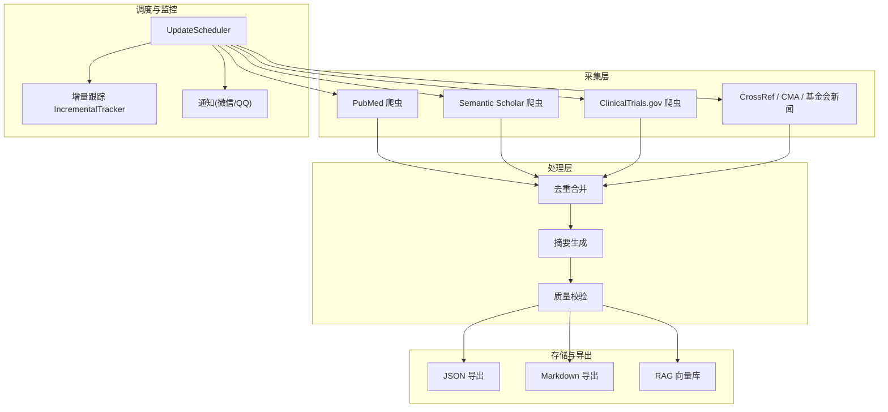
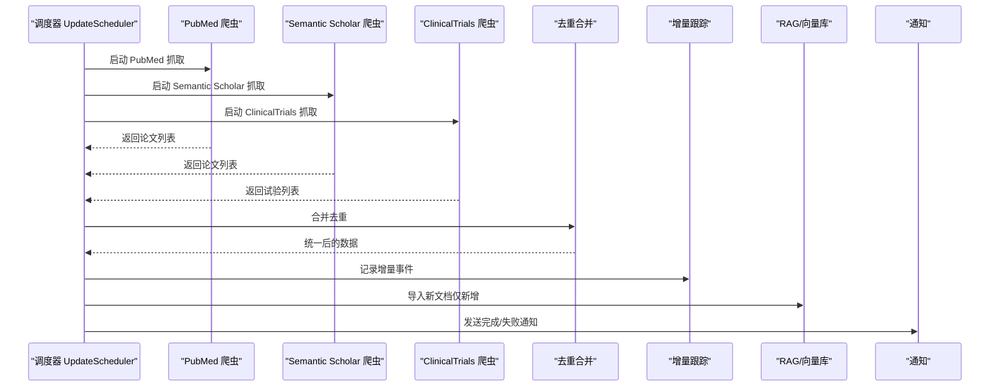
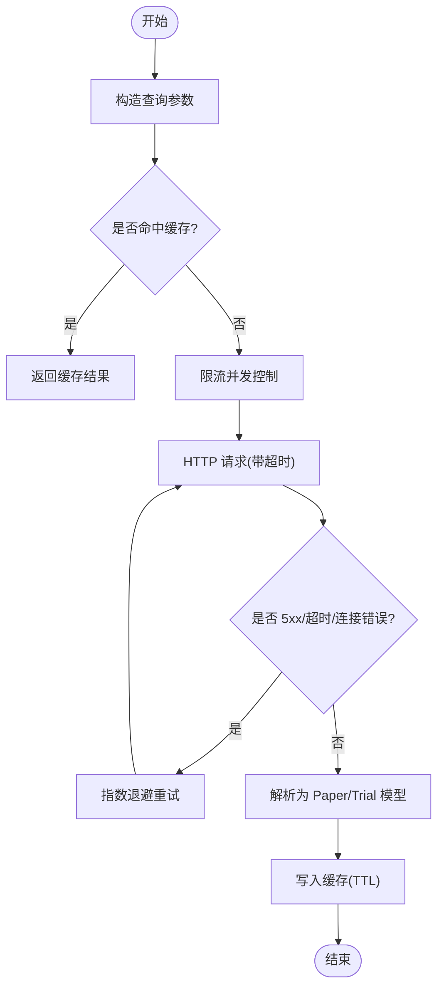
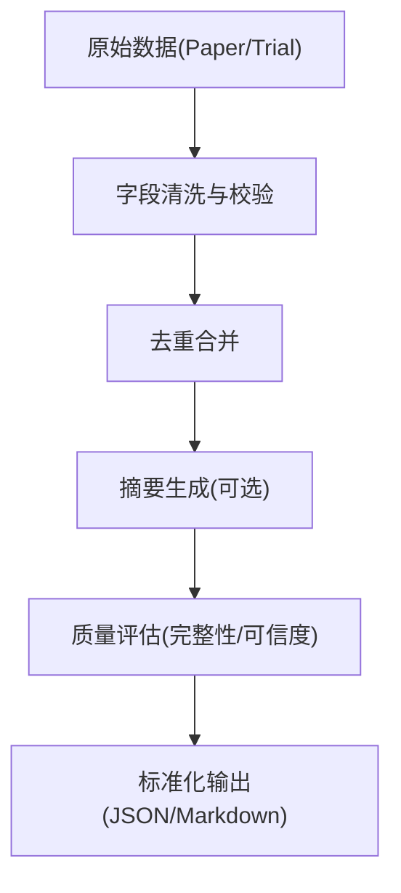
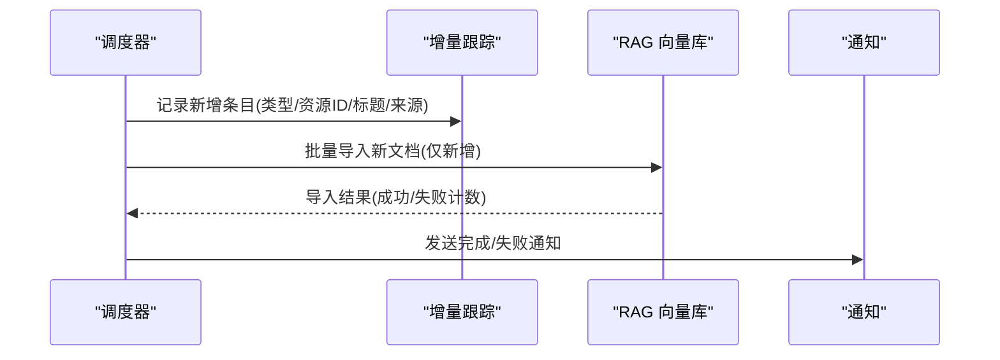
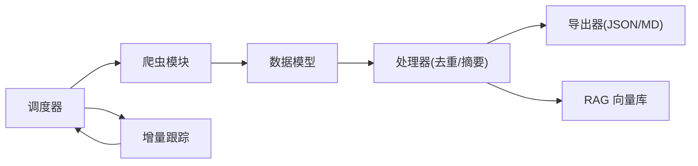

# 知识库构建流程

<cite>
**本文引用的文件**
- [README.md](file://README.md)
- [Makefile](file://Makefile)
- [scheduler_config.json](file://scheduler_config.json)
- [configs/crawler_config.yaml](file://configs/crawler_config.yaml)
- [src/cli.py](file://src/cli.py)
- [src/config.py](file://src/config.py)
- [src/models/paper.py](file://src/models/paper.py)
- [src/processors/deduplicator.py](file://src/processors/deduplicator.py)
- [src/processors/summarizer.py](file://src/processors/summarizer.py)
- [src/exporters/json_exporter.py](file://src/exporters/json_exporter.py)
- [src/scheduler/update_scheduler.py](file://src/scheduler/update_scheduler.py)
- [src/utils/incremental_tracker.py](file://src/utils/incremental_tracker.py)
- [src/crawlers/pubmed_crawler.py](file://src/crawlers/pubmed_crawler.py)
- [src/crawlers/semantic_scholar_crawler.py](file://src/crawlers/semantic_scholar_crawler.py)
- [src/crawlers/clinical_trials_crawler.py](file://src/crawlers/clinical_trials_crawler.py)
</cite>

## 目录
1. [简介](#简介)
2. [项目结构](#项目结构)
3. [核心组件](#核心组件)
4. [架构总览](#架构总览)
5. [详细组件分析](#详细组件分析)
6. [依赖关系分析](#依赖关系分析)
7. [性能与可扩展性](#性能与可扩展性)
8. [故障排查指南](#故障排查指南)
9. [结论](#结论)
10. [附录：示例与自动化配置](#附录示例与自动化配置)

## 简介
本技术文档面向 Subskin 项目的“知识库构建流程”，围绕多源数据采集、文本预处理流水线、向量化处理（增量嵌入）与知识图谱/检索增强生成（RAG）入库进行系统化说明。重点覆盖以下方面：
- 多源采集策略：PubMed、Semantic Scholar、ClinicalTrials.gov、CrossRef、CMA、基金会新闻等
- 文本预处理：内容清洗、摘要生成、去重合并、质量评估
- 向量化与增量更新：仅对新增内容进行 embedding，已入库的 source_url 跳过
- 版本管理与数据治理：调度状态、执行历史、增量记录、通知上报
- 自动化流程与 CLI：命令行入口、定时任务、导出与归档

## 项目结构
Subskin 的知识库构建由 Python 数据管道驱动，核心位于 src 目录；调度与配置集中在 scheduler_config.json 与 configs/crawler_config.yaml；CLI 提供统一入口；模型定义在 models；处理器与导出器分别负责去重、摘要与导出。

图表来源
- [src/scheduler/update_scheduler.py:218-381](file://src/scheduler/update_scheduler.py#L218-L381)
- [src/crawlers/pubmed_crawler.py:129-152](file://src/crawlers/pubmed_crawler.py#L129-L152)
- [src/crawlers/semantic_scholar_crawler.py:231-284](file://src/crawlers/semantic_scholar_crawler.py#L231-L284)
- [src/crawlers/clinical_trials_crawler.py:394-428](file://src/crawlers/clinical_trials_crawler.py#L394-L428)
- [src/processors/deduplicator.py:57-90](file://src/processors/deduplicator.py#L57-L90)
- [src/processors/summarizer.py:204-246](file://src/processors/summarizer.py#L204-L246)
- [src/exporters/json_exporter.py:41-62](file://src/exporters/json_exporter.py#L41-L62)
- [src/utils/incremental_tracker.py:100-128](file://src/utils/incremental_tracker.py#L100-L128)

章节来源
- [README.md:46-50](file://README.md#L46-L50)
- [Makefile:109-122](file://Makefile#L109-L122)
- [scheduler_config.json:1-11](file://scheduler_config.json#L1-L11)
- [configs/crawler_config.yaml:1-143](file://configs/crawler_config.yaml#L1-L143)

## 核心组件
- 多源爬虫：PubMed、Semantic Scholar、ClinicalTrials.gov、CrossRef、CMA、基金会新闻等，均具备缓存、限流、重试机制
- 数据模型：Paper/ClinicalTrial 等 Pydantic 模型，统一字段与校验
- 处理器：去重合并（按 DOI/PMID/标题+作者哈希）、摘要生成（OpenAI/火山引擎兼容）、翻译（预留）
- 导出器：JSON/Markdown 导出，支持集合化输出与元数据
- 调度器：周期任务编排、并发执行各爬虫、结果汇总、增量记录、通知上报
- 增量跟踪：SQLite 持久化每日变更，支持统计与清理

章节来源
- [src/models/paper.py:18-127](file://src/models/paper.py#L18-L127)
- [src/processors/deduplicator.py:28-90](file://src/processors/deduplicator.py#L28-L90)
- [src/processors/summarizer.py:57-126](file://src/processors/summarizer.py#L57-L126)
- [src/exporters/json_exporter.py:19-62](file://src/exporters/json_exporter.py#L19-L62)
- [src/scheduler/update_scheduler.py:79-156](file://src/scheduler/update_scheduler.py#L79-L156)
- [src/utils/incremental_tracker.py:53-128](file://src/utils/incremental_tracker.py#L53-L128)

## 架构总览
下图展示从采集到入库的端到端流程，包括调度、并发执行、增量记录与通知。

图表来源
- [src/scheduler/update_scheduler.py:218-381](file://src/scheduler/update_scheduler.py#L218-L381)
- [src/crawlers/pubmed_crawler.py:129-152](file://src/crawlers/pubmed_crawler.py#L129-L152)
- [src/crawlers/semantic_scholar_crawler.py:231-284](file://src/crawlers/semantic_scholar_crawler.py#L231-L284)
- [src/crawlers/clinical_trials_crawler.py:394-428](file://src/crawlers/clinical_trials_crawler.py#L394-L428)
- [src/processors/deduplicator.py:57-90](file://src/processors/deduplicator.py#L57-L90)
- [src/utils/incremental_tracker.py:100-128](file://src/utils/incremental_tracker.py#L100-L128)

## 详细组件分析

### 多源数据采集
- PubMed 爬虫
  - 使用 metapub 获取 PMID 列表并分页拉取文章详情
  - 自动识别 NCBI API Key 提升速率限制
  - 内置缓存、限流、指数退避重试
- Semantic Scholar 爬虫
  - 通过 Graph API 搜索论文，支持分页与字段裁剪
  - 请求级缓存键、限流与超时重试
- ClinicalTrials.gov 爬虫
  - v2 API 查询，解析干预措施、阶段、状态、地点等
  - 针对 429/5xx 的重试策略与错误分类
- 其他来源
  - CrossRef、CMA、基金会新闻等由调度器统一编排

图表来源
- [src/crawlers/pubmed_crawler.py:154-188](file://src/crawlers/pubmed_crawler.py#L154-L188)
- [src/crawlers/semantic_scholar_crawler.py:93-160](file://src/crawlers/semantic_scholar_crawler.py#L93-L160)
- [src/crawlers/clinical_trials_crawler.py:124-199](file://src/crawlers/clinical_trials_crawler.py#L124-L199)

章节来源
- [src/crawlers/pubmed_crawler.py:40-127](file://src/crawlers/pubmed_crawler.py#L40-L127)
- [src/crawlers/semantic_scholar_crawler.py:34-73](file://src/crawlers/semantic_scholar_crawler.py#L34-L73)
- [src/crawlers/clinical_trials_crawler.py:88-116](file://src/crawlers/clinical_trials_crawler.py#L88-L116)
- [configs/crawler_config.yaml:12-143](file://configs/crawler_config.yaml#L12-L143)

### 文本预处理流水线
- 内容清洗
  - 字段标准化（标题、作者、日期、URL、DOI）
  - 空值与非法格式过滤
- 摘要生成
  - 基于 OpenAI/火山引擎兼容接口，系统提示词约束输出风格与免责声明
  - 请求级限流与缓存，异常重试
- 去重合并
  - 主键优先级：DOI > PMID > 标题+首作者+年份哈希
  - 字段级合并策略（作者并集、MeSH 并集、引用数取最大等）
- 质量评估
  - 完整性校验（必需字段、标识符）
  - 来源可信度标记（如 CMA 权威权重）

图表来源
- [src/models/paper.py:129-187](file://src/models/paper.py#L129-L187)
- [src/processors/deduplicator.py:92-172](file://src/processors/deduplicator.py#L92-L172)
- [src/processors/summarizer.py:127-168](file://src/processors/summarizer.py#L127-L168)
- [src/exporters/json_exporter.py:30-62](file://src/exporters/json_exporter.py#L30-L62)

章节来源
- [src/processors/deduplicator.py:28-90](file://src/processors/deduplicator.py#L28-L90)
- [src/processors/summarizer.py:57-126](file://src/processors/summarizer.py#L57-L126)
- [src/models/paper.py:18-127](file://src/models/paper.py#L18-L127)

### 向量化处理流程与增量更新
- 增量策略
  - 仅对新增内容做 embedding，已入库的 source_url 直接跳过
  - 每周日凌晨 3:00 统一执行（可配置），降低调用成本
- 导入与入库
  - 调度器在完成爬取后尝试将新文档导入 RAG 向量库
  - 增量记录持久化至 SQLite，便于审计与通知

图表来源
- [scheduler_config.json:1-11](file://scheduler_config.json#L1-L11)
- [src/scheduler/update_scheduler.py:342-381](file://src/scheduler/update_scheduler.py#L342-L381)
- [src/utils/incremental_tracker.py:100-128](file://src/utils/incremental_tracker.py#L100-L128)

章节来源
- [scheduler_config.json:1-11](file://scheduler_config.json#L1-L11)
- [src/scheduler/update_scheduler.py:218-381](file://src/scheduler/update_scheduler.py#L218-L381)
- [src/utils/incremental_tracker.py:53-128](file://src/utils/incremental_tracker.py#L53-L128)

### 知识图谱构建方法
当前仓库未实现显式图数据库或三元组抽取模块。建议采用如下方案以对接现有 RAG：
- 实体与关系抽取
  - 利用 LLM 从摘要/全文中抽取疾病-药物-靶点-研究等实体及关系
  - 输出为 JSON-LD 或 CSV 三元组，供后续图数据库导入
- 图谱存储与查询
  - 可选 Neo4j/GraphDB 等，建立节点与边索引
  - 结合 RAG 检索时，先图检索候选子图，再向量检索片段
- 与现有流程集成
  - 在“摘要生成”之后增加“图谱抽取”步骤
  - 将图谱 ID 与 source_url 关联，支撑溯源与可视化

[本节为概念性设计，不直接映射具体代码文件]

## 依赖关系分析
- 爬虫依赖
  - metapub（PubMed）、requests（SS/CTGov）、BeautifulSoup（CMA）
  - 共享工具：Cache、RateLimiter、Logger
- 模型与处理器
  - Pydantic 模型校验与序列化
  - 去重合并、摘要生成、导出器
- 调度与监控
  - 线程并发执行爬虫，SQLite 持久化状态与增量记录
  - 可选微信/QQ 通知

图表来源
- [src/crawlers/pubmed_crawler.py:21-26](file://src/crawlers/pubmed_crawler.py#L21-L26)
- [src/crawlers/semantic_scholar_crawler.py:15-19](file://src/crawlers/semantic_scholar_crawler.py#L15-L19)
- [src/crawlers/clinical_trials_crawler.py:11-22](file://src/crawlers/clinical_trials_crawler.py#L11-L22)
- [src/models/paper.py:1-7](file://src/models/paper.py#L1-L7)
- [src/processors/deduplicator.py:18-24](file://src/processors/deduplicator.py#L18-L24)
- [src/processors/summarizer.py:13-22](file://src/processors/summarizer.py#L13-L22)
- [src/scheduler/update_scheduler.py:8-22](file://src/scheduler/update_scheduler.py#L8-L22)
- [src/utils/incremental_tracker.py:9-17](file://src/utils/incremental_tracker.py#L9-L17)

章节来源
- [src/crawlers/pubmed_crawler.py:40-127](file://src/crawlers/pubmed_crawler.py#L40-L127)
- [src/crawlers/semantic_scholar_crawler.py:34-73](file://src/crawlers/semantic_scholar_crawler.py#L34-L73)
- [src/crawlers/clinical_trials_crawler.py:88-116](file://src/crawlers/clinical_trials_crawler.py#L88-L116)
- [src/models/paper.py:18-127](file://src/models/paper.py#L18-L127)
- [src/processors/deduplicator.py:28-90](file://src/processors/deduplicator.py#L28-L90)
- [src/processors/summarizer.py:57-126](file://src/processors/summarizer.py#L57-L126)
- [src/scheduler/update_scheduler.py:79-156](file://src/scheduler/update_scheduler.py#L79-L156)
- [src/utils/incremental_tracker.py:53-128](file://src/utils/incremental_tracker.py#L53-L128)

## 性能与可扩展性
- 限流与缓存
  - 各爬虫均使用 RateLimiter 与 Cache，避免超频与重复请求
  - 合理设置 TTL 与页大小，平衡时效与成本
- 并发与超时
  - 调度器对每个爬虫使用线程并发执行，单任务超时保护
  - 指数退避重试提升鲁棒性
- 增量与批处理
  - 仅对新增内容做 embedding，减少调用量
  - 批量导入 RAG，提高吞吐
- 扩展建议
  - 引入分布式队列（如 Redis/RabbitMQ）解耦采集与处理
  - 对大文档分块与并行向量化
  - 增加质量评分与人工审核环节

[本节提供通用指导，不直接分析具体文件]

## 故障排查指南
- 常见错误定位
  - 网络超时/连接错误：检查限流、重试与代理设置
  - API 限流（429）：降低并发或延长间隔
  - 解析失败：核对字段映射与空值处理
- 日志与状态
  - 查看调度器日志与执行历史
  - 检查增量记录表，确认是否重复记录或遗漏
- 快速恢复
  - 调整 scheduler_config.json 的频率与时间窗口
  - 清理过期缓存与临时文件

章节来源
- [src/scheduler/update_scheduler.py:257-305](file://src/scheduler/update_scheduler.py#L257-L305)
- [src/utils/incremental_tracker.py:272-285](file://src/utils/incremental_tracker.py#L272-L285)
- [configs/crawler_config.yaml:117-143](file://configs/crawler_config.yaml#L117-L143)

## 结论
Subskin 的知识库构建流程以“多源采集 + 标准化处理 + 增量向量化 + 通知闭环”为核心，具备高可用与可扩展特性。通过严格的限流、缓存、重试与增量策略，在保证数据质量的同时有效控制成本。未来可在图谱抽取、质量评分与人工审核等方面进一步增强。

[本节为总结性内容，不直接分析具体文件]

## 附录：示例与自动化配置
- 命令行示例
  - 抓取 PubMed：python -m src.cli crawl-pubmed --query "vitiligo" --output data/raw/pubmed.json --limit 100
  - 抓取 Semantic Scholar：python -m src.cli crawl-scholar --query "vitiligo treatment" --output data/raw/scholar.json
  - 抓取临床试验：python -m src.cli crawl-trials --condition "vitiligo" --output data/raw/trials.json
  - 运行定时更新：python -m src.cli update
  - 查看调度状态：python -m src.cli status
  - 导出 Markdown：python -m src.cli export-markdown --input data/raw/papers.json --output data/exports/
- 调度配置
  - 频率：weekly
  - 时间：每周日 03:00
  - 备注：仅对新增内容做 embedding，已入库的 source_url 跳过
- 爬虫配置要点
  - PubMed：API Key、速率限制、分页、语言与文章类型过滤
  - Semantic Scholar：字段选择、年份范围、最低引用阈值
  - ClinicalTrials：状态、阶段、干预类型、分页与最大页数
- 数据质量控制
  - 必填字段校验（标题、标识符）
  - 来源可信度标记（如 CMA 权威权重）
  - 去重合并策略（DOI/PMID/模糊匹配）
- 版本管理策略
  - 增量记录持久化（SQLite）
  - 执行历史与状态表
  - 定期清理旧记录
- 自动化流程
  - Makefile 提供常用命令（安装、测试、爬虫、构建）
  - 调度器自动编排多源采集、导入与通知

章节来源
- [src/cli.py:28-208](file://src/cli.py#L28-L208)
- [scheduler_config.json:1-11](file://scheduler_config.json#L1-L11)
- [configs/crawler_config.yaml:12-143](file://configs/crawler_config.yaml#L12-L143)
- [Makefile:109-122](file://Makefile#L109-L122)
- [src/utils/incremental_tracker.py:272-285](file://src/utils/incremental_tracker.py#L272-L285)