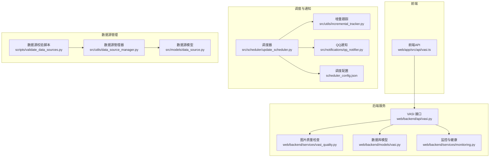
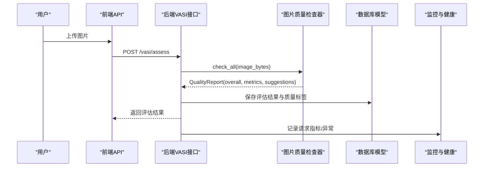
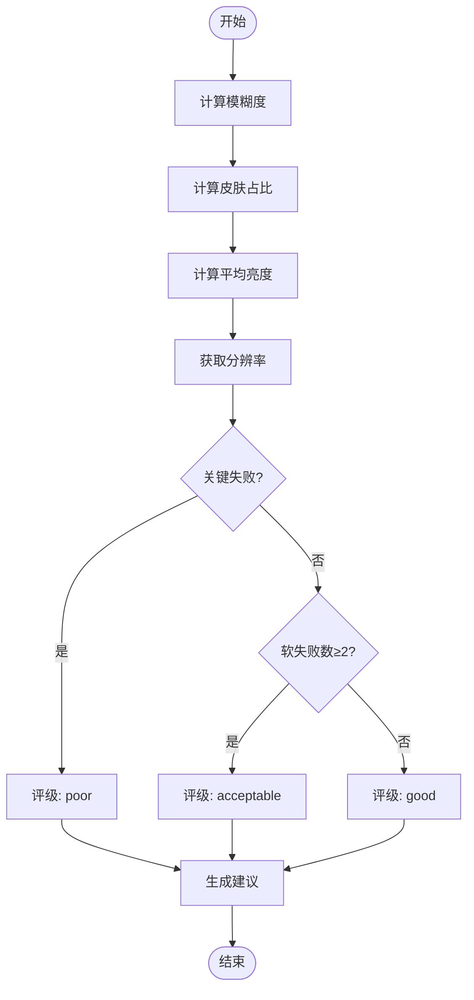
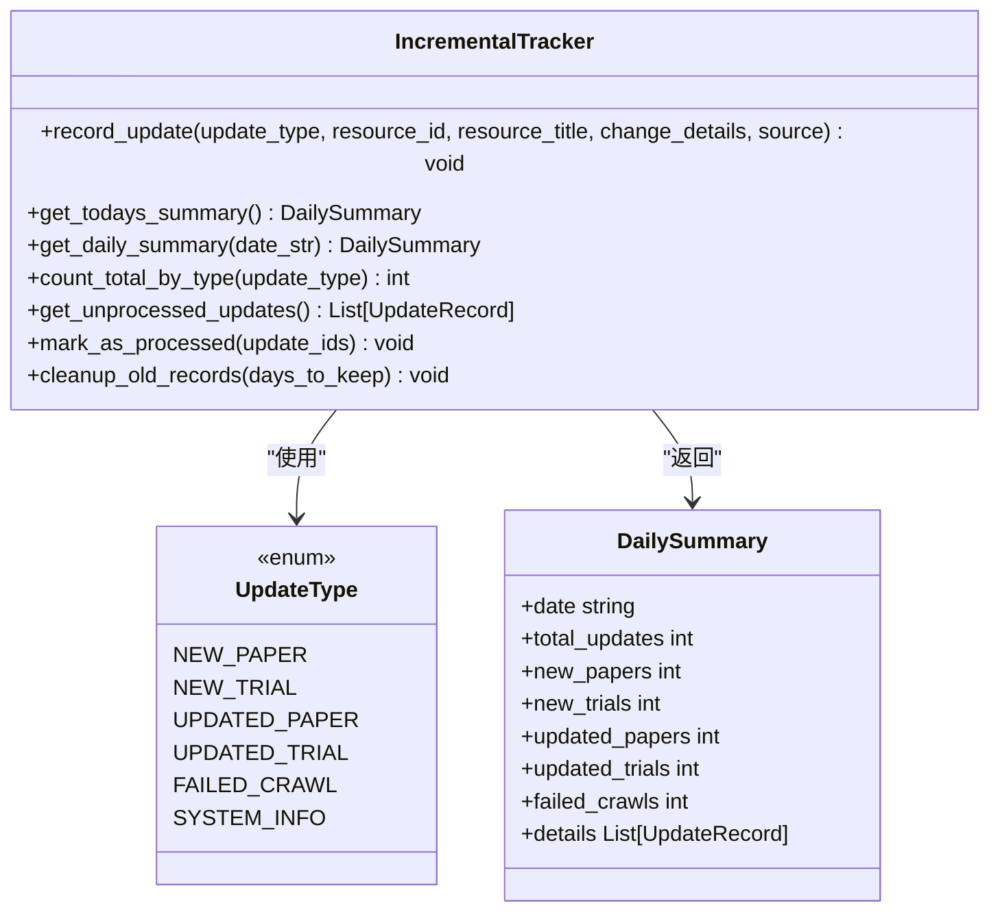
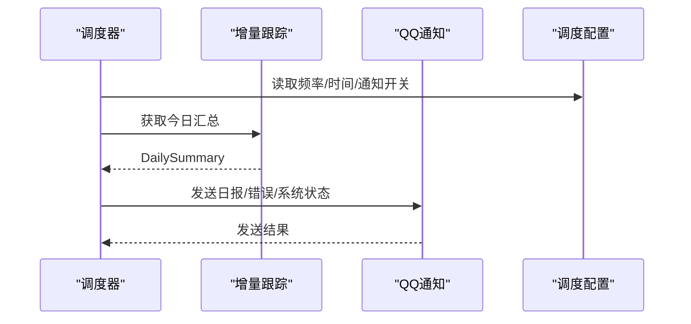
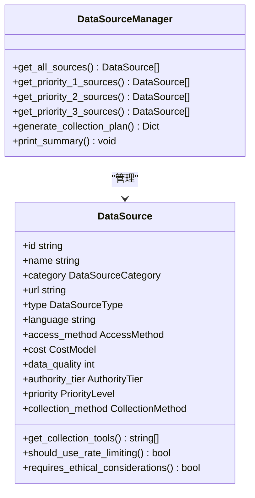
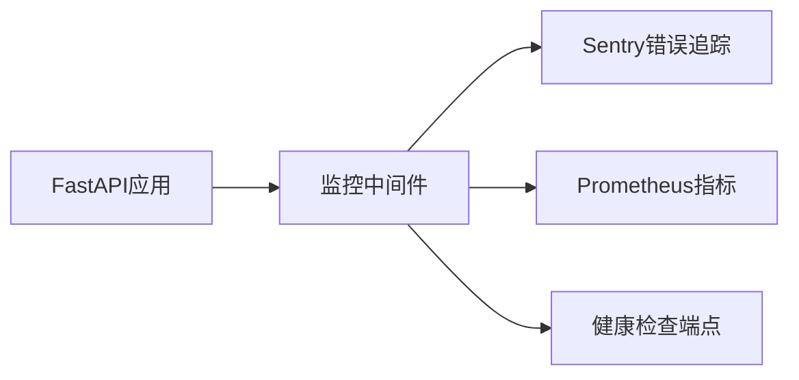
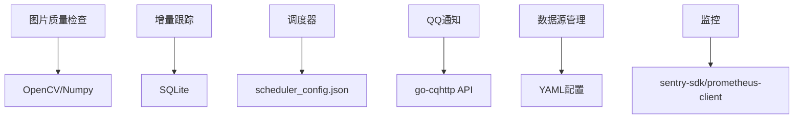

# 质量评估体系

<cite>
**本文引用的文件**
- [web/backend/services/vasi_quality.py](file://web/backend/services/vasi_quality.py)
- [src/utils/incremental_tracker.py](file://src/utils/incremental_tracker.py)
- [src/scheduler/update_scheduler.py](file://src/scheduler/update_scheduler.py)
- [scheduler_config.json](file://scheduler_config.json)
- [src/models/data_source.py](file://src/models/data_source.py)
- [src/utils/data_source_manager.py](file://src/utils/data_source_manager.py)
- [scripts/validate_data_sources.py](file://scripts/validate_data_sources.py)
- [web/backend/api/vasi.py](file://web/backend/api/vasi.py)
- [web/backend/models/vasi.py](file://web/backend/models/vasi.py)
- [web/app/src/api/vasi.ts](file://web/app/src/api/vasi.ts)
- [web/backend/services/monitoring.py](file://web/backend/services/monitoring.py)
- [src/notifications/qq_notifier.py](file://src/notifications/qq_notifier.py)
- [hermes_plan/2026-04-26-vasi-phase1-upgrade.md](file://hermes_plan/2026-04-26-vasi-phase1-upgrade.md)
</cite>

## 目录
1. [简介](#简介)
2. [项目结构](#项目结构)
3. [核心组件](#核心组件)
4. [架构总览](#架构总览)
5. [详细组件分析](#详细组件分析)
6. [依赖关系分析](#依赖关系分析)
7. [性能考量](#性能考量)
8. [故障排查指南](#故障排查指南)
9. [结论](#结论)
10. [附录](#附录)

## 简介
本技术文档面向 Subskin 知识库的质量评估体系，覆盖数据质量指标定义、完整性检查、准确性验证与时效性监控机制；并说明增量更新跟踪、数据源健康检查、异常检测与自动修复策略。同时给出质量评分算法、阈值配置、报告生成与告警通知的实现要点，并提供可操作的质量评估配置与质量问题排查指南。

## 项目结构
质量评估体系由“图片质量检查”“增量更新跟踪”“调度与通知”“数据源模型与管理”“监控与健康检查”等模块组成：
- 图片质量检查：基于 OpenCV/Numpy 的模糊度、皮肤占比、亮度与分辨率检测，输出结构化质量报告与建议。
- 增量更新跟踪：以 SQLite 记录每日新增/更新/失败事件，支持按日汇总与未处理记录查询。
- 调度与通知：定时任务读取配置，执行爬取与向量化，结合增量跟踪结果通过 QQ 机器人发送日报与系统状态。
- 数据源模型与管理：Pydantic 模型校验数据源配置，管理器加载 YAML 配置并生成采集计划。
- 监控与健康检查：Sentry 错误追踪、Prometheus 指标收集、/api/health 健康端点。

**图表来源**
- [web/app/src/api/vasi.ts:109-146](file://web/app/src/api/vasi.ts#L109-L146)
- [web/backend/api/vasi.py:858-913](file://web/backend/api/vasi.py#L858-L913)
- [web/backend/services/vasi_quality.py:1-285](file://web/backend/services/vasi_quality.py#L1-L285)
- [web/backend/models/vasi.py:95-128](file://web/backend/models/vasi.py#L95-L128)
- [web/backend/services/monitoring.py:1-260](file://web/backend/services/monitoring.py#L1-L260)
- [src/scheduler/update_scheduler.py:79-111](file://src/scheduler/update_scheduler.py#L79-L111)
- [src/utils/incremental_tracker.py:1-298](file://src/utils/incremental_tracker.py#L1-L298)
- [src/notifications/qq_notifier.py:1-593](file://src/notifications/qq_notifier.py#L1-L593)
- [scheduler_config.json:1-11](file://scheduler_config.json#L1-L11)
- [src/models/data_source.py:1-284](file://src/models/data_source.py#L1-L284)
- [src/utils/data_source_manager.py:1-381](file://src/utils/data_source_manager.py#L1-L381)
- [scripts/validate_data_sources.py:80-123](file://scripts/validate_data_sources.py#L80-L123)

**章节来源**
- [web/backend/services/vasi_quality.py:1-285](file://web/backend/services/vasi_quality.py#L1-L285)
- [src/utils/incremental_tracker.py:1-298](file://src/utils/incremental_tracker.py#L1-L298)
- [src/scheduler/update_scheduler.py:79-111](file://src/scheduler/update_scheduler.py#L79-L111)
- [scheduler_config.json:1-11](file://scheduler_config.json#L1-L11)
- [src/models/data_source.py:1-284](file://src/models/data_source.py#L1-L284)
- [src/utils/data_source_manager.py:1-381](file://src/utils/data_source_manager.py#L1-L381)
- [scripts/validate_data_sources.py:80-123](file://scripts/validate_data_sources.py#L80-L123)
- [web/backend/api/vasi.py:858-913](file://web/backend/api/vasi.py#L858-L913)
- [web/backend/models/vasi.py:95-128](file://web/backend/models/vasi.py#L95-L128)
- [web/backend/services/monitoring.py:1-260](file://web/backend/services/monitoring.py#L1-L260)
- [web/app/src/api/vasi.ts:109-146](file://web/app/src/api/vasi.ts#L109-L146)
- [src/notifications/qq_notifier.py:1-593](file://src/notifications/qq_notifier.py#L1-L593)

## 核心组件
- 图片质量检查器（VasiQualityChecker）：计算模糊度（拉普拉斯方差）、皮肤区域占比（HSV/YCrCb双空间）、平均亮度、分辨率，输出整体评级与中文建议。
- 增量更新跟踪器（IncrementalTracker）：记录每日新增论文/试验、更新与失败事件，提供按日汇总与未处理记录查询。
- 调度器（UpdateScheduler）：读取 scheduler_config.json，协调增量更新与通知。
- 数据源模型与管理（DataSource/DataSourceManager）：YAML 配置解析、枚举校验、优先级分组、采集策略与质量标准。
- 监控与健康检查（Monitoring）：Sentry 集成、Prometheus 指标中间件、/api/health 健康端点。
- 通知系统（QQBotNotifier）：日报、错误告警、系统状态报告，支持重试与超时控制。

**章节来源**
- [web/backend/services/vasi_quality.py:1-285](file://web/backend/services/vasi_quality.py#L1-L285)
- [src/utils/incremental_tracker.py:1-298](file://src/utils/incremental_tracker.py#L1-L298)
- [src/scheduler/update_scheduler.py:79-111](file://src/scheduler/update_scheduler.py#L79-L111)
- [src/models/data_source.py:1-284](file://src/models/data_source.py#L1-L284)
- [src/utils/data_source_manager.py:1-381](file://src/utils/data_source_manager.py#L1-L381)
- [web/backend/services/monitoring.py:1-260](file://web/backend/services/monitoring.py#L1-L260)
- [src/notifications/qq_notifier.py:1-593](file://src/notifications/qq_notifier.py#L1-L593)

## 架构总览
质量评估体系围绕“输入图像质量把关—后台处理—增量更新—监控告警”闭环展开：
- 前端上传图像至 /vasi/assess，后端调用质量检查器进行多维度检测，返回质量报告与建议。
- 调度器周期性运行，依据增量跟踪记录生成日报并通过 QQ 通知推送。
- 数据源管理确保采集配置有效，校验 URL、质量等级与工具推荐。
- 监控系统提供错误追踪、指标暴露与健康检查，保障系统稳定性。

**图表来源**
- [web/app/src/api/vasi.ts:109-146](file://web/app/src/api/vasi.ts#L109-L146)
- [web/backend/api/vasi.py:858-913](file://web/backend/api/vasi.py#L858-L913)
- [web/backend/services/vasi_quality.py:188-271](file://web/backend/services/vasi_quality.py#L188-L271)
- [web/backend/models/vasi.py:95-128](file://web/backend/models/vasi.py#L95-L128)
- [web/backend/services/monitoring.py:96-183](file://web/backend/services/monitoring.py#L96-L183)

## 详细组件分析

### 图片质量检查器（VasiQualityChecker）
- 指标定义
  - 模糊度：拉普拉斯方差，值越高越清晰；阈值用于判定是否合格。
  - 皮肤占比：HSV + YCrCb 双空间掩码求并集，计算皮肤像素比例。
  - 亮度：灰度图均值，判断过暗或过曝。
  - 分辨率：宽高尺寸，设定最低分辨率要求。
- 评分与分级
  - 综合判定：关键失败项（严重模糊、过暗、过曝、过低分辨率）直接降级为 poor；软失败项计数决定 acceptable/good。
  - 建议：根据各项不通过情况生成中文改进建议。
- 可用性降级
  - 若 OpenCV/Numpy 不可用，返回 acceptable 并提示更新后重试。

**图表来源**
- [web/backend/services/vasi_quality.py:39-63](file://web/backend/services/vasi_quality.py#L39-L63)
- [web/backend/services/vasi_quality.py:188-271](file://web/backend/services/vasi_quality.py#L188-L271)

**章节来源**
- [web/backend/services/vasi_quality.py:1-285](file://web/backend/services/vasi_quality.py#L1-L285)
- [hermes_plan/2026-04-26-vasi-phase1-upgrade.md:289-571](file://hermes_plan/2026-04-26-vasi-phase1-upgrade.md#L289-L571)

### 增量更新跟踪（IncrementalTracker）
- 数据结构
  - UpdateType：new_paper/new_trial/updated_paper/updated_trial/failed_crawl/system_info。
  - DailySummary：日期、总数、各类别计数与详情列表。
- 功能
  - record_update：记录单次更新事件（序列化变更详情）。
  - get_daily_summary/get_todays_summary：按日汇总与今日汇总。
  - get_unprocessed_updates/mark_as_processed：未处理记录查询与标记。
  - cleanup_old_records：清理过期记录。
- 索引与并发
  - 使用 SQLite 索引优化查询；线程锁保证并发安全。

**图表来源**
- [src/utils/incremental_tracker.py:20-50](file://src/utils/incremental_tracker.py#L20-L50)
- [src/utils/incremental_tracker.py:53-298](file://src/utils/incremental_tracker.py#L53-L298)

**章节来源**
- [src/utils/incremental_tracker.py:1-298](file://src/utils/incremental_tracker.py#L1-L298)

### 调度器与通知（UpdateScheduler & QQBotNotifier）
- 调度器
  - 读取 scheduler_config.json（频率、时间、最大运行时长、完成/失败通知开关）。
  - 维护 schedule_history 表，记录每次调度的起止时间、状态、爬取结果与条目数量。
- 通知
  - 日报：基于 DailySummary 格式化消息，包含新增/更新/失败统计与重点更新。
  - 错误告警：错误类型、详情与可选回溯信息。
  - 系统状态：爬虫健康、最后成功时间、运行时长、磁盘/内存使用率。
  - 重试与超时：对 go-cqhttp HTTP API 的请求具备重试逻辑与超时控制。

**图表来源**
- [src/scheduler/update_scheduler.py:79-111](file://src/scheduler/update_scheduler.py#L79-L111)
- [scheduler_config.json:1-11](file://scheduler_config.json#L1-L11)
- [src/notifications/qq_notifier.py:221-397](file://src/notifications/qq_notifier.py#L221-L397)

**章节来源**
- [src/scheduler/update_scheduler.py:79-111](file://src/scheduler/update_scheduler.py#L79-L111)
- [scheduler_config.json:1-11](file://scheduler_config.json#L1-L11)
- [src/notifications/qq_notifier.py:1-593](file://src/notifications/qq_notifier.py#L1-L593)

### 数据源模型与管理（DataSource & DataSourceManager）
- 模型
  - AuthorityTier/DataSourceCategory/DataSourceType/AccessMethod/CostModel/PriorityLevel/CollectionMethod：枚举约束数据类型。
  - DataSource：核心字段包括 id/name/category/url/type/language/access_method/cost/data_quality/authority_tier/priority/collection_method 等，含 URL 与 data_quality 校验。
- 管理器
  - 加载 YAML 配置，转换为 Pydantic 模型实例，构建 DataSourceConfig。
  - 提供按优先级/类别/类型/访问方式查询、生成采集计划、打印摘要等方法。
  - validate_configuration：检查优先级组引用与类别有效性。

**图表来源**
- [src/models/data_source.py:12-214](file://src/models/data_source.py#L12-L214)
- [src/utils/data_source_manager.py:26-98](file://src/utils/data_source_manager.py#L26-L98)
- [src/utils/data_source_manager.py:100-381](file://src/utils/data_source_manager.py#L100-L381)

**章节来源**
- [src/models/data_source.py:1-284](file://src/models/data_source.py#L1-L284)
- [src/utils/data_source_manager.py:1-381](file://src/utils/data_source_manager.py#L1-L381)
- [scripts/validate_data_sources.py:80-123](file://scripts/validate_data_sources.py#L80-L123)

### 监控与健康检查（Monitoring）
- Sentry 集成：初始化错误追踪，过滤敏感头信息，支持手动捕获异常。
- Prometheus 指标：HTTP 请求总数、耗时、进行中请求数；/metrics 端点暴露。
- 健康检查：/api/health 检查数据库连接与磁盘空间，返回 healthy/degraded/unhealthy。

**图表来源**
- [web/backend/services/monitoring.py:28-91](file://web/backend/services/monitoring.py#L28-L91)
- [web/backend/services/monitoring.py:96-183](file://web/backend/services/monitoring.py#L96-L183)
- [web/backend/services/monitoring.py:208-240](file://web/backend/services/monitoring.py#L208-L240)

**章节来源**
- [web/backend/services/monitoring.py:1-260](file://web/backend/services/monitoring.py#L1-L260)

## 依赖关系分析
- 图片质量检查依赖 OpenCV/Numpy；不可用时降级为 acceptable 并提示更新。
- 增量跟踪依赖 SQLite；使用索引优化按日查询与未处理记录检索。
- 调度器依赖 scheduler_config.json；通知依赖 go-cqhttp HTTP API。
- 数据源管理依赖 YAML 配置；模型层使用 Pydantic 进行强校验。
- 监控依赖 sentry-sdk 与 prometheus-client；环境变量控制启用。

**图表来源**
- [web/backend/services/vasi_quality.py:16-36](file://web/backend/services/vasi_quality.py#L16-L36)
- [src/utils/incremental_tracker.py:60-98](file://src/utils/incremental_tracker.py#L60-L98)
- [scheduler_config.json:1-11](file://scheduler_config.json#L1-L11)
- [src/notifications/qq_notifier.py:47-75](file://src/notifications/qq_notifier.py#L47-L75)
- [src/utils/data_source_manager.py:117-175](file://src/utils/data_source_manager.py#L117-L175)
- [web/backend/services/monitoring.py:28-63](file://web/backend/services/monitoring.py#L28-L63)

**章节来源**
- [web/backend/services/vasi_quality.py:16-36](file://web/backend/services/vasi_quality.py#L16-L36)
- [src/utils/incremental_tracker.py:60-98](file://src/utils/incremental_tracker.py#L60-L98)
- [scheduler_config.json:1-11](file://scheduler_config.json#L1-L11)
- [src/notifications/qq_notifier.py:47-75](file://src/notifications/qq_notifier.py#L47-L75)
- [src/utils/data_source_manager.py:117-175](file://src/utils/data_source_manager.py#L117-L175)
- [web/backend/services/monitoring.py:28-63](file://web/backend/services/monitoring.py#L28-L63)

## 性能考量
- 图片质量检查
  - 模糊度计算采用灰度化与降采样加速；皮肤检测使用双空间掩码提升鲁棒性。
  - 当 OpenCV/Numpy 缺失时快速降级，避免阻塞主流程。
- 增量跟踪
  - 使用 SQLite 索引（日期、类型、已处理标志）提升查询效率；批量标记已处理减少 IO。
- 调度与通知
  - 配置化频率与最大运行时长，避免长时间占用资源；通知具备重试与超时控制。
- 监控
  - Prometheus 指标按路由模板聚合，降低基数；健康检查仅轻量探测。

[本节为通用性能指导，无需特定文件引用]

## 故障排查指南
- 图片质量检查失败
  - 现象：blur_score=0、skin_ratio=0、brightness_mean=0、resolution=(0,0)。
  - 原因：OpenCV/Numpy 未安装或图像解码失败。
  - 处理：安装依赖或更新环境；检查图像格式；查看日志中的警告信息。
  - 参考路径：[web/backend/services/vasi_quality.py:16-36](file://web/backend/services/vasi_quality.py#L16-L36)、[web/backend/services/vasi_quality.py:273-280](file://web/backend/services/vasi_quality.py#L273-L280)
- 增量跟踪写入失败
  - 现象：change_details JSON 序列化异常。
  - 原因：变更详情包含不可序列化对象。
  - 处理：修正数据结构；查看 CacheError 异常信息。
  - 参考路径：[src/utils/incremental_tracker.py:117-121](file://src/utils/incremental_tracker.py#L117-L121)
- 调度器未执行或超时
  - 现象：schedule_history 无新记录或状态为失败。
  - 原因：scheduler_config.json 配置错误或运行时间超限。
  - 处理：检查频率/时间/最大运行时长；查看日志与状态。
  - 参考路径：[scheduler_config.json:1-11](file://scheduler_config.json#L1-L11)、[src/scheduler/update_scheduler.py:79-111](file://src/scheduler/update_scheduler.py#L79-L111)
- 通知发送失败
  - 现象：QQ 机器人无消息或报错。
  - 原因：go-cqhttp 不可达或 API 返回失败。
  - 处理：检查 CQHTTP_HOST/PORT/TIMEOUT/MAX_RETRIES/RETRY_DELAY；测试连接；重试。
  - 参考路径：[src/notifications/qq_notifier.py:76-125](file://src/notifications/qq_notifier.py#L76-L125)、[src/notifications/qq_notifier.py:505-530](file://src/notifications/qq_notifier.py#L505-L530)
- 数据源配置无效
  - 现象：URL 非法或 data_quality 超出范围。
  - 原因：YAML 配置不符合模型约束。
  - 处理：修正 URL 格式与质量等级；运行校验脚本。
  - 参考路径：[src/models/data_source.py:172-184](file://src/models/data_source.py#L172-L184)、[scripts/validate_data_sources.py:80-123](file://scripts/validate_data_sources.py#L80-L123)
- 健康检查异常
  - 现象：/api/health 返回 unhealthy/degraded。
  - 原因：数据库连接失败或磁盘空间不足。
  - 处理：检查数据库引擎与磁盘剩余空间。
  - 参考路径：[web/backend/services/monitoring.py:208-240](file://web/backend/services/monitoring.py#L208-L240)

**章节来源**
- [web/backend/services/vasi_quality.py:16-36](file://web/backend/services/vasi_quality.py#L16-L36)
- [web/backend/services/vasi_quality.py:273-280](file://web/backend/services/vasi_quality.py#L273-L280)
- [src/utils/incremental_tracker.py:117-121](file://src/utils/incremental_tracker.py#L117-L121)
- [scheduler_config.json:1-11](file://scheduler_config.json#L1-L11)
- [src/scheduler/update_scheduler.py:79-111](file://src/scheduler/update_scheduler.py#L79-L111)
- [src/notifications/qq_notifier.py:76-125](file://src/notifications/qq_notifier.py#L76-L125)
- [src/notifications/qq_notifier.py:505-530](file://src/notifications/qq_notifier.py#L505-L530)
- [src/models/data_source.py:172-184](file://src/models/data_source.py#L172-L184)
- [scripts/validate_data_sources.py:80-123](file://scripts/validate_data_sources.py#L80-L123)
- [web/backend/services/monitoring.py:208-240](file://web/backend/services/monitoring.py#L208-L240)

## 结论
Subskin 质量评估体系通过严格的多维度图片质量检查、可靠的增量更新跟踪、灵活的调度与通知机制、健壮的数据源模型管理与完善的监控健康检查，构建了从数据采集到质量反馈的完整闭环。该体系具备良好的可扩展性与容错能力，适用于持续演进的知识库质量治理。

[本节为总结性内容，无需特定文件引用]

## 附录

### 质量评分算法与阈值配置
- 模糊度阈值
  - BLUR_THRESHOLD_CLEAR：高于此值为非常清晰。
  - BLUR_THRESHOLD_ACCEPTABLE：低于此值判定为模糊。
- 皮肤占比阈值
  - SKIN_RATIO_MIN：最小皮肤区域占比，适配近景白斑拍摄。
- 亮度阈值
  - BRIGHTNESS_DARK_THRESHOLD：低于此值判定过暗。
  - BRIGHTNESS_OVEREXPOSED_THRESHOLD：高于此值判定过曝。
- 分辨率阈值
  - MIN_WIDTH/MIN_HEIGHT：最低分辨率要求。
- 综合评级规则
  - 关键失败项触发 poor；软失败项计数决定 acceptable/good。
- 参考路径
  - [web/backend/services/vasi_quality.py:39-63](file://web/backend/services/vasi_quality.py#L39-L63)
  - [web/backend/services/vasi_quality.py:208-271](file://web/backend/services/vasi_quality.py#L208-L271)
  - [hermes_plan/2026-04-26-vasi-phase1-upgrade.md:309-427](file://hermes_plan/2026-04-26-vasi-phase1-upgrade.md#L309-L427)

**章节来源**
- [web/backend/services/vasi_quality.py:39-63](file://web/backend/services/vasi_quality.py#L39-L63)
- [web/backend/services/vasi_quality.py:208-271](file://web/backend/services/vasi_quality.py#L208-L271)
- [hermes_plan/2026-04-26-vasi-phase1-upgrade.md:309-427](file://hermes_plan/2026-04-26-vasi-phase1-upgrade.md#L309-L427)

### 增量更新跟踪与报告生成
- 记录类型：new_paper/new_trial/updated_paper/updated_trial/failed_crawl/system_info。
- 报告内容：日期、新增/更新/失败统计、重点更新列表。
- 通知渠道：QQ 机器人私聊/群消息，支持重试与超时。
- 参考路径
  - [src/utils/incremental_tracker.py:20-50](file://src/utils/incremental_tracker.py#L20-L50)
  - [src/utils/incremental_tracker.py:130-199](file://src/utils/incremental_tracker.py#L130-L199)
  - [src/notifications/qq_notifier.py:221-280](file://src/notifications/qq_notifier.py#L221-L280)

**章节来源**
- [src/utils/incremental_tracker.py:20-50](file://src/utils/incremental_tracker.py#L20-L50)
- [src/utils/incremental_tracker.py:130-199](file://src/utils/incremental_tracker.py#L130-L199)
- [src/notifications/qq_notifier.py:221-280](file://src/notifications/qq_notifier.py#L221-L280)

### 数据源健康检查与自动修复策略
- 健康检查
  - URL 格式校验、data_quality 范围校验、颜色格式校验。
  - 管理器 validate_configuration 检查优先级组引用与类别有效性。
- 自动修复
  - 数据源配置错误在构造阶段抛出异常，阻止无效配置进入系统。
  - 校验脚本提供逐项验证与工具推荐检查。
- 参考路径
  - [src/models/data_source.py:172-184](file://src/models/data_source.py#L172-L184)
  - [src/utils/data_source_manager.py:82-98](file://src/utils/data_source_manager.py#L82-L98)
  - [scripts/validate_data_sources.py:80-123](file://scripts/validate_data_sources.py#L80-L123)

**章节来源**
- [src/models/data_source.py:172-184](file://src/models/data_source.py#L172-L184)
- [src/utils/data_source_manager.py:82-98](file://src/utils/data_source_manager.py#L82-L98)
- [scripts/validate_data_sources.py:80-123](file://scripts/validate_data_sources.py#L80-L123)

### 告警通知与监控集成
- 告警类型：日报、错误告警、系统状态报告。
- 监控集成：Sentry 错误追踪、Prometheus 指标、/api/health 健康端点。
- 参考路径
  - [src/notifications/qq_notifier.py:283-397](file://src/notifications/qq_notifier.py#L283-L397)
  - [web/backend/services/monitoring.py:28-91](file://web/backend/services/monitoring.py#L28-L91)
  - [web/backend/services/monitoring.py:96-183](file://web/backend/services/monitoring.py#L96-L183)
  - [web/backend/services/monitoring.py:208-240](file://web/backend/services/monitoring.py#L208-L240)

**章节来源**
- [src/notifications/qq_notifier.py:283-397](file://src/notifications/qq_notifier.py#L283-L397)
- [web/backend/services/monitoring.py:28-91](file://web/backend/services/monitoring.py#L28-L91)
- [web/backend/services/monitoring.py:96-183](file://web/backend/services/monitoring.py#L96-L183)
- [web/backend/services/monitoring.py:208-240](file://web/backend/services/monitoring.py#L208-L240)