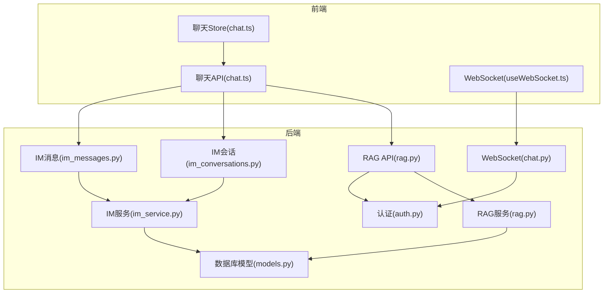
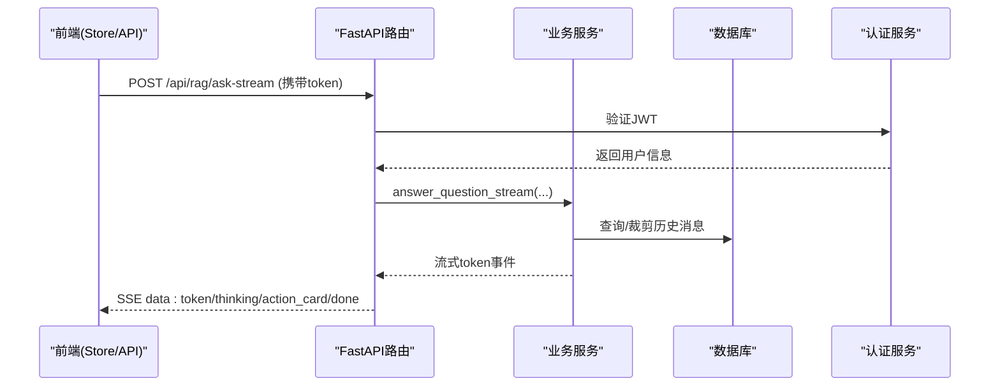
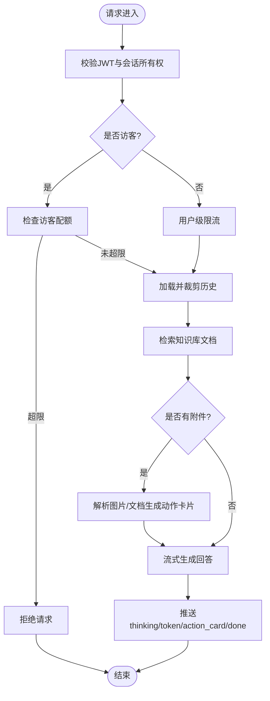
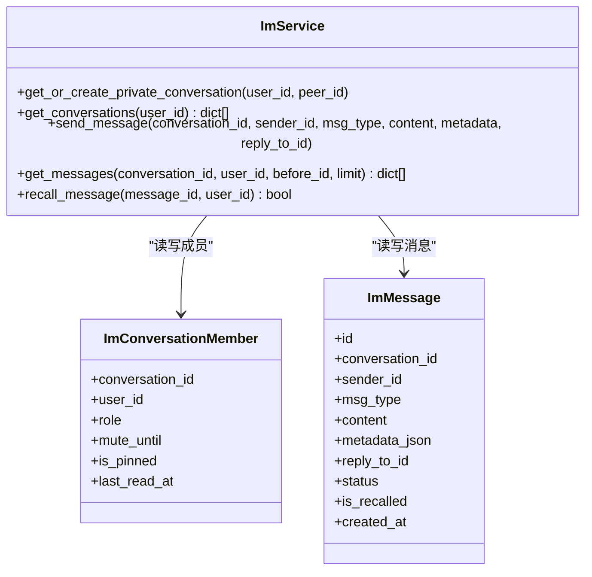
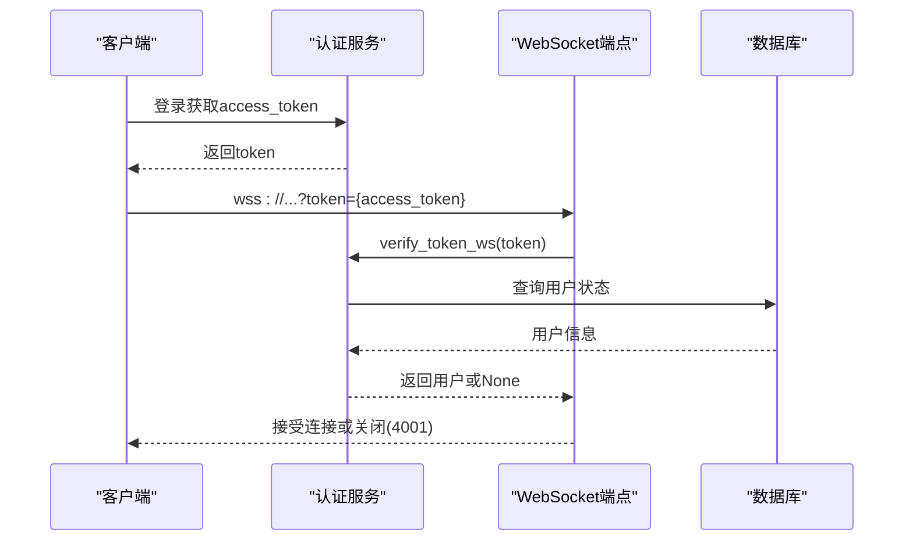
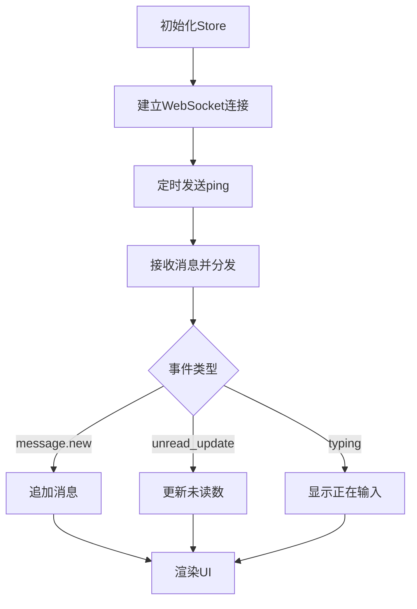
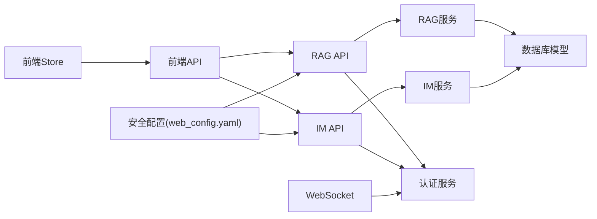

# 对话管理系统

<cite>
**本文引用的文件**
- [web/backend/api/rag.py](file://web/backend/api/rag.py)
- [web/backend/services/rag.py](file://web/backend/services/rag.py)
- [web/backend/database/models.py](file://web/backend/database/models.py)
- [web/backend/services/auth.py](file://web/backend/services/auth.py)
- [web/backend/ws/chat.py](file://web/backend/ws/chat.py)
- [web/app/src/stores/chat.ts](file://web/app/src/stores/chat.ts)
- [web/app/src/api/chat.ts](file://web/app/src/api/chat.ts)
- [web/app/src/composables/useWebSocket.ts](file://web/app/src/composables/useWebSocket.ts)
- [web/backend/api/im_conversations.py](file://web/backend/api/im_conversations.py)
- [web/backend/api/im_messages.py](file://web/backend/api/im_messages.py)
- [web/backend/services/im_service.py](file://web/backend/services/im_service.py)
- [configs/web_config.yaml](file://configs/web_config.yaml)
</cite>

## 目录
1. [简介](#简介)
2. [项目结构](#项目结构)
3. [核心组件](#核心组件)
4. [架构总览](#架构总览)
5. [详细组件分析](#详细组件分析)
6. [依赖关系分析](#依赖关系分析)
7. [性能考量](#性能考量)
8. [故障排查指南](#故障排查指南)
9. [结论](#结论)
10. [附录：会话操作API与使用示例](#附录会话操作api与使用示例)

## 简介
本技术文档围绕 Subskin 的对话管理系统，系统性阐述多轮对话状态管理、会话持久化、上下文维护与消息历史存储机制；并覆盖用户认证集成、权限控制、会话隔离与安全策略。同时给出对话生命周期管理、内存优化策略、并发处理方案与错误恢复机制，并提供具体的会话操作 API 与前端使用示例，帮助开发者快速理解与扩展系统能力。

## 项目结构
对话管理系统由后端 FastAPI 服务、数据库模型、认证鉴权、RAG 问答流式接口、IM 即时通讯与 WebSocket 实时通道、以及前端 Vue/Pinia 状态管理与 SSE/WebSocket 客户端组成。关键模块分布如下：
- 后端 API：RAG 对话接口（含访客与登录态）、IM 会话与消息接口
- 业务服务：RAG 问答与上下文裁剪、IM 会话与消息服务
- 数据模型：对话、消息、访客用量、用户与凭证等
- 认证鉴权：JWT 访问令牌、刷新令牌、WebSocket 鉴权
- 前端：聊天 Store、SSE 流式读取、WebSocket 连接管理

**图表来源**
- [web/backend/api/rag.py](file://web/backend/api/rag.py)
- [web/backend/services/rag.py](file://web/backend/services/rag.py)
- [web/backend/database/models.py](file://web/backend/database/models.py)
- [web/backend/services/auth.py](file://web/backend/services/auth.py)
- [web/backend/ws/chat.py](file://web/backend/ws/chat.py)
- [web/app/src/stores/chat.ts](file://web/app/src/stores/chat.ts)
- [web/app/src/api/chat.ts](file://web/app/src/api/chat.ts)
- [web/app/src/composables/useWebSocket.ts](file://web/app/src/composables/useWebSocket.ts)
- [web/backend/api/im_conversations.py](file://web/backend/api/im_conversations.py)
- [web/backend/api/im_messages.py](file://web/backend/api/im_messages.py)
- [web/backend/services/im_service.py](file://web/backend/services/im_service.py)

**章节来源**
- [web/backend/api/rag.py](file://web/backend/api/rag.py)
- [web/backend/services/rag.py](file://web/backend/services/rag.py)
- [web/backend/database/models.py](file://web/backend/database/models.py)
- [web/backend/services/auth.py](file://web/backend/services/auth.py)
- [web/backend/ws/chat.py](file://web/backend/ws/chat.py)
- [web/app/src/stores/chat.ts](file://web/app/src/stores/chat.ts)
- [web/app/src/api/chat.ts](file://web/app/src/api/chat.ts)
- [web/app/src/composables/useWebSocket.ts](file://web/app/src/composables/useWebSocket.ts)
- [web/backend/api/im_conversations.py](file://web/backend/api/im_conversations.py)
- [web/backend/api/im_messages.py](file://web/backend/api/im_messages.py)
- [web/backend/services/im_service.py](file://web/backend/services/im_service.py)

## 核心组件
- RAG 对话接口：提供已登录与访客两种提问入口，支持流式响应、附件分析与动作卡片交互，内置会话所有权校验与会话隔离。
- IM 会话与消息：私聊会话创建、消息发送与撤回、分页拉取、已读标记、禁言与拉黑保护。
- 认证与鉴权：JWT 访问令牌、刷新令牌、文件专用短时效令牌、WebSocket 令牌校验。
- 数据模型：Conversation、Message、GuestUsage、ImConversation、ImMessage、ImMessageRead、UserCredential 等。
- 前端状态与通信：Pinia Store 管理消息与思考阶段，SSE 流式读取，WebSocket 心跳与事件分发。

**章节来源**
- [web/backend/api/rag.py](file://web/backend/api/rag.py)
- [web/backend/services/rag.py](file://web/backend/services/rag.py)
- [web/backend/database/models.py](file://web/backend/database/models.py)
- [web/backend/services/auth.py](file://web/backend/services/auth.py)
- [web/backend/ws/chat.py](file://web/backend/ws/chat.py)
- [web/app/src/stores/chat.ts](file://web/app/src/stores/chat.ts)
- [web/app/src/api/chat.ts](file://web/app/src/api/chat.ts)
- [web/app/src/composables/useWebSocket.ts](file://web/app/src/composables/useWebSocket.ts)
- [web/backend/api/im_conversations.py](file://web/backend/api/im_conversations.py)
- [web/backend/api/im_messages.py](file://web/backend/api/im_messages.py)
- [web/backend/services/im_service.py](file://web/backend/services/im_service.py)

## 架构总览
对话管理系统采用分层架构：前端通过 REST/SSE/WebSocket 与后端交互；后端以 FastAPI 路由为入口，调用业务服务层进行领域逻辑处理；数据层通过 SQLAlchemy ORM 访问数据库。认证鉴权贯穿所有受保护接口，会话隔离在 RAG 与 IM 中均有实现。

**图表来源**
- [web/backend/api/rag.py](file://web/backend/api/rag.py)
- [web/backend/services/rag.py](file://web/backend/services/rag.py)
- [web/backend/services/auth.py](file://web/backend/services/auth.py)
- [web/app/src/api/chat.ts](file://web/app/src/api/chat.ts)

**章节来源**
- [web/backend/api/rag.py](file://web/backend/api/rag.py)
- [web/backend/services/rag.py](file://web/backend/services/rag.py)
- [web/backend/services/auth.py](file://web/backend/services/auth.py)
- [web/app/src/api/chat.ts](file://web/app/src/api/chat.ts)

## 详细组件分析

### RAG 对话与会话持久化
- 会话所有权与隔离：通过会话ID关联 Conversation，校验 user_id 与 owner 一致性，软删除不可读/写，防止跨用户注入。
- 上下文维护：按 conversation_id 加载 Message 历史，限制最近 N 条（默认20）避免上下文溢出与成本膨胀。
- 访客配额：基于客户端指纹统计每日次数，超限拒绝；失败时回退计数。
- 流式响应：SSE 推送 thinking/token/action_card/done 事件，前端增量渲染。
- 附件分析：临时上传文件带 .meta 记录所有者，仅允许本人分析；支持图片与文档解析生成动作卡片。

**图表来源**
- [web/backend/api/rag.py](file://web/backend/api/rag.py)
- [web/backend/services/rag.py](file://web/backend/services/rag.py)

**章节来源**
- [web/backend/api/rag.py](file://web/backend/api/rag.py)
- [web/backend/services/rag.py](file://web/backend/services/rag.py)
- [web/backend/database/models.py](file://web/backend/database/models.py)

### IM 会话与消息
- 私聊会话：自动检测或创建两人会话，防自聊与拉黑。
- 消息收发：成员校验、禁言保护、更新最后消息时间、通知其他成员。
- 分页与已读：before_id 游标分页，last_read_at 计算未读数。
- 撤回：2分钟内可撤回，内容替换为“[消息已撤回]”。

**图表来源**
- [web/backend/services/im_service.py](file://web/backend/services/im_service.py)
- [web/backend/database/models.py](file://web/backend/database/models.py)

**章节来源**
- [web/backend/api/im_conversations.py](file://web/backend/api/im_conversations.py)
- [web/backend/api/im_messages.py](file://web/backend/api/im_messages.py)
- [web/backend/services/im_service.py](file://web/backend/services/im_service.py)
- [web/backend/database/models.py](file://web/backend/database/models.py)

### 认证与权限控制
- JWT 访问令牌：包含子主体、类型、过期时间；支持管理员长时效。
- 刷新令牌：独立表存储，支持撤销与清理。
- 文件专用令牌：短时效、scope=files，仅用于文件读取。
- WebSocket 鉴权：从查询参数解析 token，校验用户活跃与封禁状态。
- 会话隔离：RAG 会话所有权校验，IM 成员校验与拉黑保护。

**图表来源**
- [web/backend/services/auth.py](file://web/backend/services/auth.py)
- [web/backend/ws/chat.py](file://web/backend/ws/chat.py)

**章节来源**
- [web/backend/services/auth.py](file://web/backend/services/auth.py)
- [web/backend/ws/chat.py](file://web/backend/ws/chat.py)

### 前端状态管理与实时通信
- Pinia Store：维护消息列表、思考阶段、动作卡片、会话切换与历史加载。
- SSE 流式读取：SSEStreamReader 解析 data: JSON 事件，映射到 onThinking/onToken/onActionCard/onDone。
- WebSocket：心跳 ping/pong、消息类型分发、断线重连与最大重试次数。

**图表来源**
- [web/app/src/stores/chat.ts](file://web/app/src/stores/chat.ts)
- [web/app/src/api/chat.ts](file://web/app/src/api/chat.ts)
- [web/app/src/composables/useWebSocket.ts](file://web/app/src/composables/useWebSocket.ts)

**章节来源**
- [web/app/src/stores/chat.ts](file://web/app/src/stores/chat.ts)
- [web/app/src/api/chat.ts](file://web/app/src/api/chat.ts)
- [web/app/src/composables/useWebSocket.ts](file://web/app/src/composables/useWebSocket.ts)

## 依赖关系分析
- API 层依赖认证服务与数据库会话，业务服务封装领域逻辑，模型定义表结构与关系。
- 前端依赖后端 API 与 WebSocket，SSE 与 WS 分别用于流式响应与实时事件。
- 安全配置通过 web_config.yaml 启用速率限制、CORS、CSP 与安全头。

**图表来源**
- [web/backend/api/rag.py](file://web/backend/api/rag.py)
- [web/backend/services/rag.py](file://web/backend/services/rag.py)
- [web/backend/database/models.py](file://web/backend/database/models.py)
- [web/backend/services/auth.py](file://web/backend/services/auth.py)
- [web/backend/ws/chat.py](file://web/backend/ws/chat.py)
- [web/app/src/stores/chat.ts](file://web/app/src/stores/chat.ts)
- [web/app/src/api/chat.ts](file://web/app/src/api/chat.ts)
- [configs/web_config.yaml](file://configs/web_config.yaml)

**章节来源**
- [web/backend/api/rag.py](file://web/backend/api/rag.py)
- [web/backend/services/rag.py](file://web/backend/services/rag.py)
- [web/backend/database/models.py](file://web/backend/database/models.py)
- [web/backend/services/auth.py](file://web/backend/services/auth.py)
- [web/backend/ws/chat.py](file://web/backend/ws/chat.py)
- [web/app/src/stores/chat.ts](file://web/app/src/stores/chat.ts)
- [web/app/src/api/chat.ts](file://web/app/src/api/chat.ts)
- [configs/web_config.yaml](file://configs/web_config.yaml)

## 性能考量
- 上下文裁剪：限制最近20条历史，避免 LLM 上下文溢出与成本膨胀。
- 访客配额与限流：按客户端指纹与用户维度限制频率，防止滥用。
- 流式响应：SSE 逐步推送 token，降低首屏延迟。
- 数据库索引：会话、消息、已读记录均建立合适索引，提升查询效率。
- 内存优化：前端增量渲染，避免一次性加载大量历史；后端按需加载与裁剪。

[本节为通用指导，不直接分析具体文件]

## 故障排查指南
- 认证失败：检查 JWT 令牌有效性、用户状态（活跃/封禁）、WebSocket 连接码 4001。
- 会话无权访问：确认 conversation_id 归属与 is_deleted 状态。
- 访客配额耗尽：查看 guest_usages 记录与客户端指纹。
- 附件分析失败：检查临时文件 .meta 所有者匹配与文件类型。
- 消息撤回失败：确认发送者身份与2分钟时限。
- 限流触发：检查 per-user 与 per-minute 限制配置。

**章节来源**
- [web/backend/services/auth.py](file://web/backend/services/auth.py)
- [web/backend/api/rag.py](file://web/backend/api/rag.py)
- [web/backend/services/im_service.py](file://web/backend/services/im_service.py)

## 结论
Subskin 对话管理系统通过清晰的层次划分、严格的认证与权限控制、健壮的会话隔离与上下文裁剪、以及高效的流式与实时通信，提供了稳定可扩展的多轮对话与即时通讯能力。结合前端状态管理与安全配置，系统在用户体验与安全性之间取得良好平衡。

[本节为总结性内容，不直接分析具体文件]

## 附录：会话操作API与使用示例

### RAG 对话 API
- POST /api/rag/ask：已登录用户提问，返回答案与来源
- POST /api/rag/ask-public：访客免费提问，限制主题与次数
- GET /api/rag/guest-quota：获取访客剩余次数
- POST /api/rag/upload-temp：上传临时文件（需登录）
- POST /api/rag/confirm-action：确认保存动作卡片（VASI/报告/日记）
- POST /api/rag/ask-stream：流式提问（SSE）
- POST /api/rag/ask-public-stream：访客流式提问（SSE）

使用示例（前端）：
- 同步提问：chatApi.ask(question, conversationId, mode)
- 流式提问：chatApi.streamAsk(question, conversationId, mode)
- 访客流式：chatApi.streamAskPublic(question, mode)

**章节来源**
- [web/backend/api/rag.py](file://web/backend/api/rag.py)
- [web/app/src/api/chat.ts](file://web/app/src/api/chat.ts)

### IM 会话与消息 API
- GET /api/im/conversations：列出会话
- POST /api/im/conversations/private：创建私聊会话
- GET /api/im/conversations/{id}/messages：分页拉取消息
- POST /api/im/conversations/{id}/read：标记已读
- POST /api/im/conversations/{id}/pin：置顶/取消置顶
- POST /api/im/messages：发送消息（文本/媒体/引用）
- POST /api/im/messages/{id}/recall：撤回消息（2分钟内）

使用示例（前端）：
- 拉取会话：imApi.getConversations()
- 发送消息：imApi.sendMessage({conversation_id, msg_type, content, metadata, reply_to_id})
- 标记已读：imApi.markRead(conversation_id)

**章节来源**
- [web/backend/api/im_conversations.py](file://web/backend/api/im_conversations.py)
- [web/backend/api/im_messages.py](file://web/backend/api/im_messages.py)

### 安全配置
- 速率限制：requests_per_minute/hour
- CORS：允许的源
- CSP：指令集
- 安全头：HSTS、XSS保护、Content-Type选项、Frame Options

**章节来源**
- [configs/web_config.yaml](file://configs/web_config.yaml)