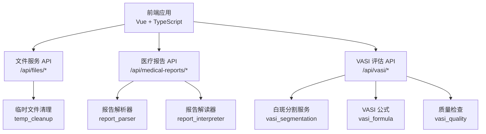
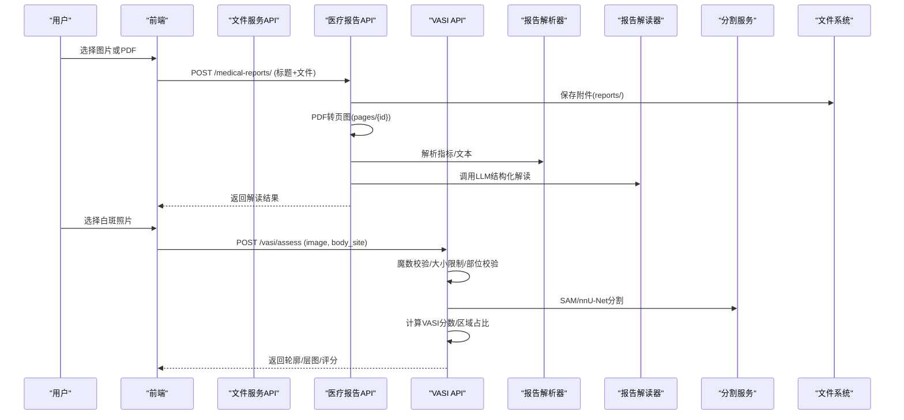
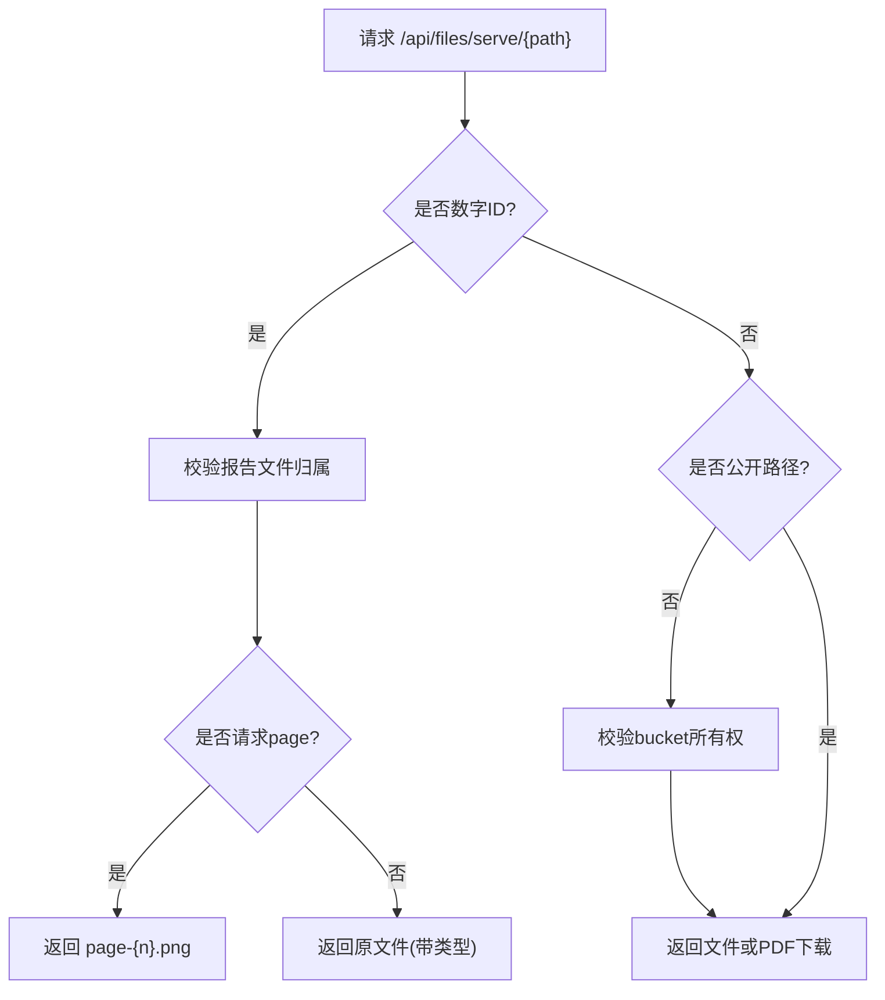
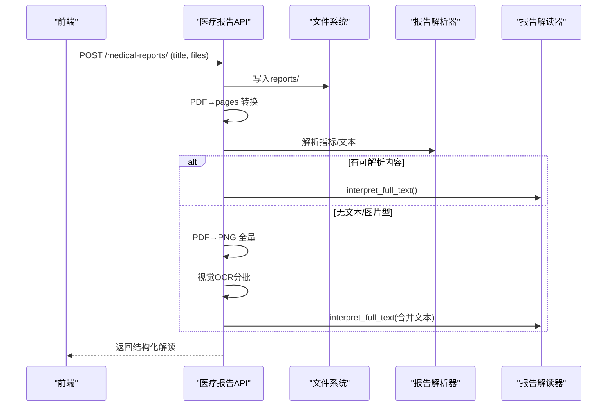
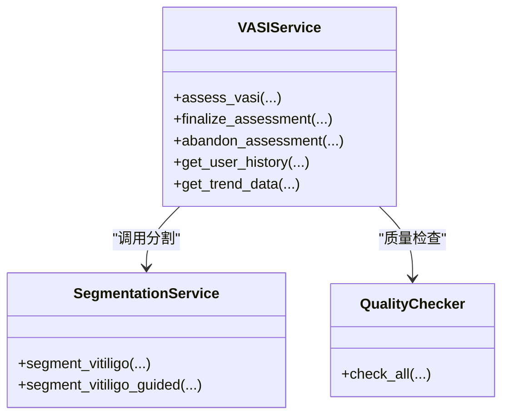
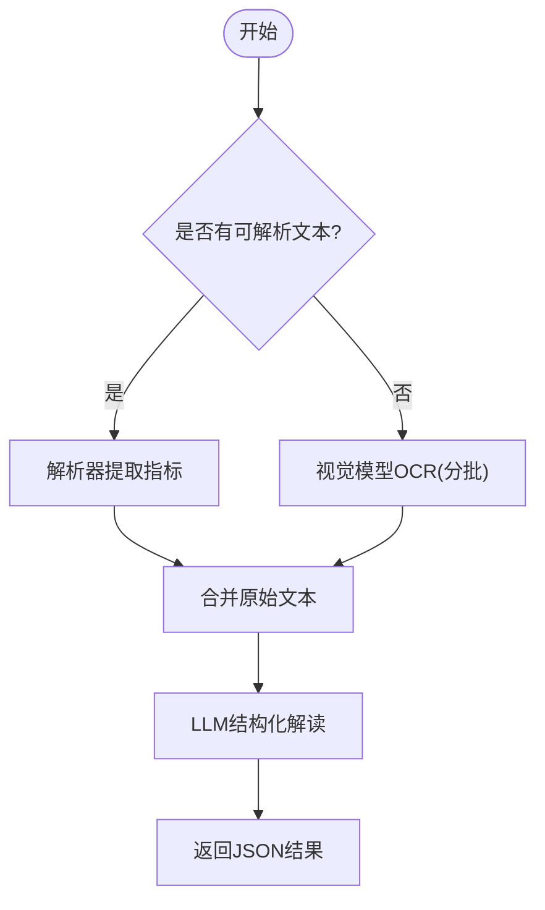
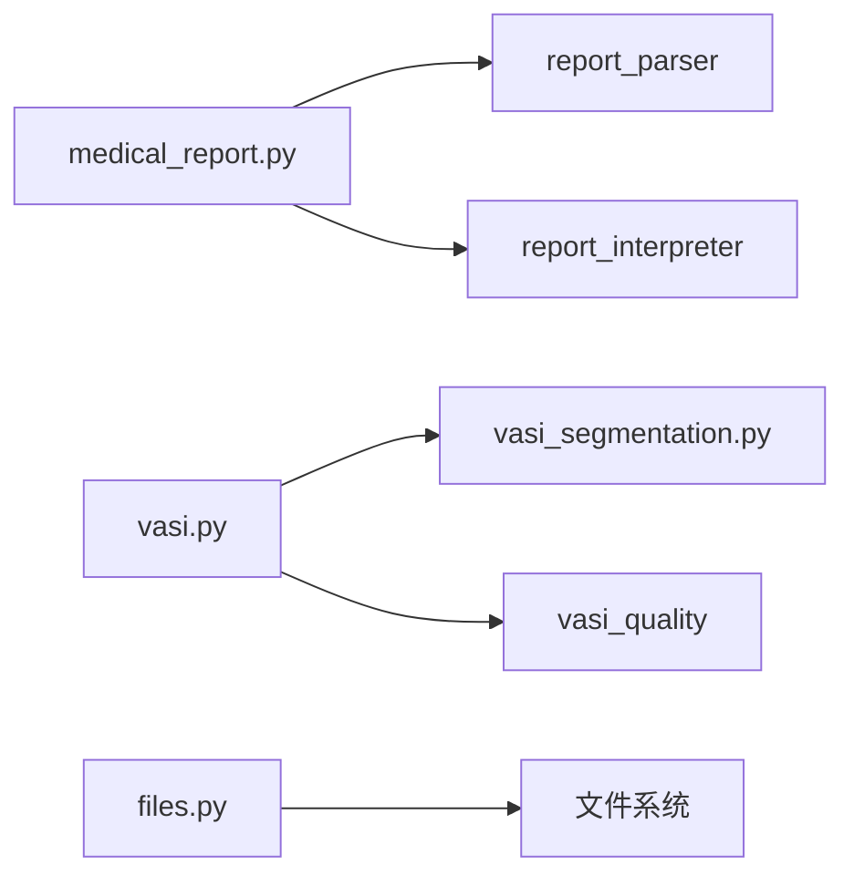

# 文件分析功能

<cite>
**本文引用的文件**
- [web/backend/api/files.py](file://web/backend/api/files.py)
- [web/backend/api/medical_report.py](file://web/backend/api/medical_report.py)
- [web/backend/api/vasi.py](file://web/backend/api/vasi.py)
- [web/backend/services/vasi_segmentation.py](file://web/backend/services/vasi_segmentation.py)
- [web/backend/services/vasi.py](file://web/backend/services/vasi.py)
- [web/backend/services/medical/report_interpreter.py](file://web/backend/services/medical/report_interpreter.py)
- [web/backend/services/temp_cleanup.py](file://web/backend/services/temp_cleanup.py)
- [web/app/src/composables/useVasiUpload.ts](file://web/app/src/composables/useVasiUpload.ts)
- [web/app/src/components/tracker/ReportUploader.vue](file://web/app/src/components/tracker/ReportUploader.vue)
- [web/app/src/api/medical-report.ts](file://web/app/src/api/medical-report.ts)
</cite>

## 目录
1. [简介](#简介)
2. [项目结构](#项目结构)
3. [核心组件](#核心组件)
4. [架构总览](#架构总览)
5. [详细组件分析](#详细组件分析)
6. [依赖关系分析](#依赖关系分析)
7. [性能考量](#性能考量)
8. [故障排查指南](#故障排查指南)
9. [结论](#结论)
10. [附录：API与前端示例](#附录api与前端示例)

## 简介
本技术文档聚焦 Subskin 的“文件分析”能力，覆盖图片上传处理、PDF 文档解析、医学报告解读与 VASI（白癜风面积严重程度指数）评估集成。重点说明文件格式验证、大小限制、安全扫描、临时文件管理；并深入讲解图像分割算法、文本提取技术、OCR 识别与结果展示。文末提供具体的文件上传 API 与前端处理代码路径，便于快速对接与二次开发。

## 项目结构
围绕文件分析的关键路径包括：
- 后端 API：文件服务、医疗报告、VASI 评估
- 后端服务：分割、公式计算、质量检查、临时文件清理、报告解读
- 前端：上传交互、质量检查、报告列表与对比、文件预览

图表来源
- [web/backend/api/files.py:293-331](file://web/backend/api/files.py#L293-L331)
- [web/backend/api/medical_report.py:214-275](file://web/backend/api/medical_report.py#L214-L275)
- [web/backend/api/vasi.py:45-165](file://web/backend/api/vasi.py#L45-L165)
- [web/backend/services/temp_cleanup.py:15-52](file://web/backend/services/temp_cleanup.py#L15-L52)

章节来源
- [web/backend/api/files.py:293-331](file://web/backend/api/files.py#L293-L331)
- [web/backend/api/medical_report.py:214-275](file://web/backend/api/medical_report.py#L214-L275)
- [web/backend/api/vasi.py:45-165](file://web/backend/api/vasi.py#L45-L165)

## 核心组件
- 文件服务（files.py）
  - 提供受控的文件访问令牌、按桶策略的权限校验、PDF 分页预览、HTML 内嵌查看器。
  - 支持 PDF 转页图、页面级访问控制、临时文件清理入口。
- 医疗报告（medical_report.py）
  - 报告创建、附件存储、PDF 自动转页图、OCR 文本提取、LLM 结构化解读、多报告对比。
- VASI 评估（vasi.py + vasi_segmentation.py）
  - 图片上传校验（含魔数校验）、部位校验、SAM 分割、nnU-Net 回退、双阶段相对亮度检测、用户修正与评分重算。
- 报告解读（report_interpreter.py）
  - 基于视觉模型 OCR 的两阶段流程：全量文本提取 → LLM 结构化解读（分节、红黄绿风险）。
- 临时文件管理（temp_cleanup.py）
  - 定时清理过期临时文件，避免磁盘膨胀。

章节来源
- [web/backend/api/files.py:37-331](file://web/backend/api/files.py#L37-L331)
- [web/backend/api/medical_report.py:214-727](file://web/backend/api/medical_report.py#L214-L727)
- [web/backend/api/vasi.py:45-165](file://web/backend/api/vasi.py#L45-L165)
- [web/backend/services/vasi_segmentation.py:278-432](file://web/backend/services/vasi_segmentation.py#L278-L432)
- [web/backend/services/medical/report_interpreter.py:18-61](file://web/backend/services/medical/report_interpreter.py#L18-L61)
- [web/backend/services/temp_cleanup.py:15-52](file://web/backend/services/temp_cleanup.py#L15-L52)

## 架构总览
文件分析的整体数据流如下：

图表来源
- [web/backend/api/medical_report.py:214-275](file://web/backend/api/medical_report.py#L214-L275)
- [web/backend/api/medical_report.py:506-573](file://web/backend/api/medical_report.py#L506-L573)
- [web/backend/api/vasi.py:45-165](file://web/backend/api/vasi.py#L45-L165)
- [web/backend/services/vasi_segmentation.py:278-432](file://web/backend/services/vasi_segmentation.py#L278-L432)

## 详细组件分析

### 文件服务（上传、鉴权、预览、清理）
- 访问令牌与鉴权
  - 提供短时效文件访问令牌，降低泄露风险；支持 Bearer 或文件专用令牌。
  - 按 bucket 策略校验所有权：avatar、community、reports、files、im、temp、vasi 等。
- 文件读取与预览
  - 支持直接 serve 与 HTML 内嵌 viewer；PDF 强制下载或在 pages 目录以 PNG 分页浏览。
  - 支持按 file_id 获取页面图片 URL。
- 临时文件清理
  - 提供清理接口，删除超过阈值的 temp 文件。

图表来源
- [web/backend/api/files.py:293-331](file://web/backend/api/files.py#L293-L331)
- [web/backend/api/files.py:341-370](file://web/backend/api/files.py#L341-L370)
- [web/backend/api/files.py:373-476](file://web/backend/api/files.py#L373-L476)

章节来源
- [web/backend/api/files.py:37-331](file://web/backend/api/files.py#L37-L331)
- [web/backend/api/files.py:334-338](file://web/backend/api/files.py#L334-L338)

### 医疗报告上传与解读（PDF/图片）
- 上传与存储
  - 支持多文件上传，自动保存到 reports 目录；记录文件名、类型、大小、顺序。
  - 自动将 PDF 转换为 pages/{file_id}/page-*.png，供浏览器分页预览。
- 文本提取与OCR
  - 优先尝试 PDF 文本层提取；若无文本或为图片型报告，则使用视觉模型进行全量 OCR（分批发送，避免上下文超限）。
  - 将 OCR 结果拼接后进入第二阶段：LLM 结构化解读，输出分节、异常项、建议、患者信息等。
- 对比与趋势
  - 支持多份报告对比，生成关键变化与叙述性总结。

图表来源
- [web/backend/api/medical_report.py:214-275](file://web/backend/api/medical_report.py#L214-L275)
- [web/backend/api/medical_report.py:506-573](file://web/backend/api/medical_report.py#L506-L573)
- [web/backend/api/medical_report.py:665-694](file://web/backend/api/medical_report.py#L665-L694)

章节来源
- [web/backend/api/medical_report.py:214-275](file://web/backend/api/medical_report.py#L214-L275)
- [web/backend/api/medical_report.py:506-573](file://web/backend/api/medical_report.py#L506-L573)
- [web/backend/api/medical_report.py:665-694](file://web/backend/api/medical_report.py#L665-L694)

### VASI 评估与图像分割
- 输入校验与安全
  - 魔数校验：确保上传内容为真实 JPG/PNG/WebP，防止伪装文件进入后续管线。
  - 大小限制：最大 10MB（可在质量检查端点单独限制到 20MB）。
  - 部位白名单校验。
- 分割算法
  - 主路径：SAM 自动分割 + 皮肤前景检测 + 相对亮度阈值（皮肤中位 L* + 偏移）定位白斑。
  - 回退路径：当 SAM 不可用或皮肤区域不足时，采用 CV 两阶段检测（HSV+YCrCb 皮肤前景 + 相对亮度白斑检测）。
  - 可选远程 nnU-Net 服务作为额外回退。
- 用户修正与评分
  - 支持提交用户修正轮廓或双层掩膜（肤色层/白斑层），重新计算区域占比与 VASI 分数。
  - 记录差异指标（Dice、像素差）用于训练与自进化。

图表来源
- [web/backend/services/vasi.py:159-200](file://web/backend/services/vasi.py#L159-L200)
- [web/backend/services/vasi_segmentation.py:278-432](file://web/backend/services/vasi_segmentation.py#L278-L432)

章节来源
- [web/backend/api/vasi.py:45-165](file://web/backend/api/vasi.py#L45-L165)
- [web/backend/services/vasi.py:559-590](file://web/backend/services/vasi.py#L559-L590)
- [web/backend/services/vasi_segmentation.py:278-432](file://web/backend/services/vasi_segmentation.py#L278-L432)

### 报告解读（OCR + LLM）
- 两阶段流程
  - 阶段一：视觉模型 OCR 提取全部页面文字（分批发送，避免上下文限制）。
  - 阶段二：文本模型对完整文本进行结构化解读，输出分节、异常项、建议、患者信息、风险等级等。
- 健壮性
  - JSON 截断恢复、空结果兜底、模型不可用时的降级提示。

图表来源
- [web/backend/api/medical_report.py:506-573](file://web/backend/api/medical_report.py#L506-L573)
- [web/backend/services/medical/report_interpreter.py:18-61](file://web/backend/services/medical/report_interpreter.py#L18-L61)

章节来源
- [web/backend/api/medical_report.py:506-573](file://web/backend/api/medical_report.py#L506-L573)
- [web/backend/services/medical/report_interpreter.py:18-61](file://web/backend/services/medical/report_interpreter.py#L18-L61)

### 临时文件管理与安全
- 临时文件
  - 上传至 data/uploads/temp，附带 .meta 文件记录所有者 ID。
  - 定时任务清理超过 24 小时的临时文件，释放磁盘空间。
- 访问控制
  - 所有文件访问需通过鉴权；PDF 在微信等 WebView 中强制下载，避免渲染风险。
  - 报告文件仅允许所属用户访问；社区图片仅在公开且未被屏蔽时可见。

章节来源
- [web/backend/services/temp_cleanup.py:15-52](file://web/backend/services/temp_cleanup.py#L15-L52)
- [web/backend/api/files.py:138-227](file://web/backend/api/files.py#L138-L227)
- [web/backend/api/files.py:293-331](file://web/backend/api/files.py#L293-L331)

## 依赖关系分析
- 模块耦合
  - medical_report.py 依赖 report_parser 与 report_interpreter，形成“解析→解读”流水线。
  - vasi.py 依赖 segmentation、quality checker、formula，形成“校验→分割→评分”流水线。
  - files.py 提供统一文件访问入口，被前后端共同消费。
- 外部依赖
  - 视觉/文本模型：OpenAI 兼容客户端（qwen-vl-plus 等）。
  - PDF 渲染：PyMuPDF（fitz）。
  - 图像处理：Pillow、OpenCV、NumPy。
  - 深度学习：Segment Anything Model（SAM）、可选 nnU-Net 远程服务。

图表来源
- [web/backend/api/medical_report.py:214-275](file://web/backend/api/medical_report.py#L214-L275)
- [web/backend/api/vasi.py:45-165](file://web/backend/api/vasi.py#L45-L165)
- [web/backend/api/files.py:293-331](file://web/backend/api/files.py#L293-L331)

章节来源
- [web/backend/api/medical_report.py:214-275](file://web/backend/api/medical_report.py#L214-L275)
- [web/backend/api/vasi.py:45-165](file://web/backend/api/vasi.py#L45-L165)
- [web/backend/api/files.py:293-331](file://web/backend/api/files.py#L293-L331)

## 性能考量
- 批处理与限流
  - OCR 分批发送（每批最多 8 页），避免视觉模型上下文溢出。
  - 分页查询限制上限（如历史/列表 limit ≤ 50）。
- 资源优化
  - PDF 转页图使用 150 DPI，平衡清晰度与体积。
  - SAM 快速/精确模式切换，减少 CPU/GPU 压力。
- 缓存与复用
  - SAM 模型与生成器全局缓存，避免重复加载。
  - 报告解读结果持久化，避免重复计算。

[本节为通用指导，不直接分析具体文件]

## 故障排查指南
- 无法从报告中提取有效数据
  - 可能原因：PDF 无文本层、图片模糊、OCR 失败。
  - 处理：确认文件清晰；必要时重试；检查 LLM 配置。
- 图片过大或格式不符
  - 前端限制 10MB，后端魔数校验拒绝非图片内容。
  - 处理：压缩图片、确认扩展名与实际一致。
- 权限错误
  - 访问他人报告或社区图片被拒。
  - 处理：确认登录态与文件归属；检查 bucket 策略。
- 临时文件未清理
  - 检查定时任务是否运行；手动调用清理接口。

章节来源
- [web/backend/api/medical_report.py:488-503](file://web/backend/api/medical_report.py#L488-L503)
- [web/backend/services/vasi.py:559-590](file://web/backend/services/vasi.py#L559-L590)
- [web/backend/api/files.py:138-227](file://web/backend/api/files.py#L138-L227)
- [web/backend/services/temp_cleanup.py:15-52](file://web/backend/services/temp_cleanup.py#L15-L52)

## 结论
Subskin 的文件分析功能以“安全可控、可扩展、可解释”为核心设计原则：
- 安全：魔数校验、桶级权限、短时效令牌、PDF 强制下载。
- 可扩展：模块化解析/解读/分割，支持远程模型与回退策略。
- 可解释：结构化输出、分节风险标注、用户修正闭环。
该体系既能满足体检报告的自动化解读，也能支撑 VASI 评估的专业需求，并通过前端交互提升用户体验。

[本节为总结，不直接分析具体文件]

## 附录：API与前端示例

### 文件服务 API
- 获取文件访问令牌
  - GET /api/files/access-token
- 文件预览/下载
  - GET /api/files/serve/{file_path}?access_token=...
  - GET /api/files/pages/{file_id}/{page_name}
  - GET /api/files/view/{file_id}?access_token=...
- 临时文件清理
  - DELETE /api/files/cleanup-temp

章节来源
- [web/backend/api/files.py:37-48](file://web/backend/api/files.py#L37-L48)
- [web/backend/api/files.py:293-331](file://web/backend/api/files.py#L293-L331)
- [web/backend/api/files.py:341-370](file://web/backend/api/files.py#L341-L370)
- [web/backend/api/files.py:373-476](file://web/backend/api/files.py#L373-L476)
- [web/backend/api/files.py:334-338](file://web/backend/api/files.py#L334-L338)

### 医疗报告 API
- 列表/详情/删除
  - GET /api/medical-reports/?limit=&offset=
  - GET /api/medical-reports/{report_id}
  - DELETE /api/medical-reports/{report_id}
- 上传报告（支持图片/PDF）
  - POST /api/medical-reports/ (Form: title, tags?, files[])
- 触发解读
  - POST /api/medical-reports/{report_id}/interpret (Form: user_age?, user_gender?)
- 获取解读结果
  - GET /api/medical-reports/{report_id}/interpretation
- 报告对比
  - POST /api/medical-reports/compare (body: report_ids[])

章节来源
- [web/backend/api/medical_report.py:185-211](file://web/backend/api/medical_report.py#L185-L211)
- [web/backend/api/medical_report.py:214-275](file://web/backend/api/medical_report.py#L214-L275)
- [web/backend/api/medical_report.py:330-351](file://web/backend/api/medical_report.py#L330-L351)
- [web/backend/api/medical_report.py:403-423](file://web/backend/api/medical_report.py#L403-L423)
- [web/backend/api/medical_report.py:426-503](file://web/backend/api/medical_report.py#L426-L503)
- [web/backend/api/medical_report.py:754-772](file://web/backend/api/medical_report.py#L754-L772)
- [web/backend/api/medical_report.py:278-327](file://web/backend/api/medical_report.py#L278-L327)

### VASI 评估 API
- 创建评估
  - POST /api/vasi/assess (Form: image, body_site, precision?, has_reference?)
- 确认/放弃草稿
  - POST /api/vasi/assess/{assessment_id}/finalize
  - POST /api/vasi/assess/{assessment_id}/abandon
- 历史/趋势
  - GET /api/vasi/history?limit=&offset=&body_site=&start_date=&end_date=
  - GET /api/vasi/trend?body_site=&days=
- 单条详情
  - GET /api/vasi/assess/{assessment_id}
- 图片质量检查
  - POST /api/vasi/check-photo-quality (Form: image)
- 用户修正轮廓
  - POST /api/vasi/assess/{assessment_id}/contour (body: contours, mask_image?, skin_mask_image?, lesion_mask_image?, depigmentation_level?)

章节来源
- [web/backend/api/vasi.py:45-165](file://web/backend/api/vasi.py#L45-L165)
- [web/backend/api/vasi.py:167-201](file://web/backend/api/vasi.py#L167-L201)
- [web/backend/api/vasi.py:204-256](file://web/backend/api/vasi.py#L204-L256)
- [web/backend/api/vasi.py:259-350](file://web/backend/api/vasi.py#L259-L350)
- [web/backend/api/vasi.py:448-472](file://web/backend/api/vasi.py#L448-L472)
- [web/backend/api/vasi.py:511-541](file://web/backend/api/vasi.py#L511-L541)
- [web/backend/api/vasi.py:544-737](file://web/backend/api/vasi.py#L544-L737)

### 前端处理示例（路径参考）
- VASI 上传与质量检查
  - useVasiUpload.ts：文件选择、拖拽、预览、质量检查、状态管理
  - ReportUploader.vue：报告上传、预览、触发解读、文件打开
  - medical-report.ts：封装医疗报告 API 调用（创建、解读、对比、文件URL构建）

章节来源
- [web/app/src/composables/useVasiUpload.ts:1-111](file://web/app/src/composables/useVasiUpload.ts#L1-L111)
- [web/app/src/components/tracker/ReportUploader.vue:1-308](file://web/app/src/components/tracker/ReportUploader.vue#L1-L308)
- [web/app/src/api/medical-report.ts:1-220](file://web/app/src/api/medical-report.ts#L1-L220)