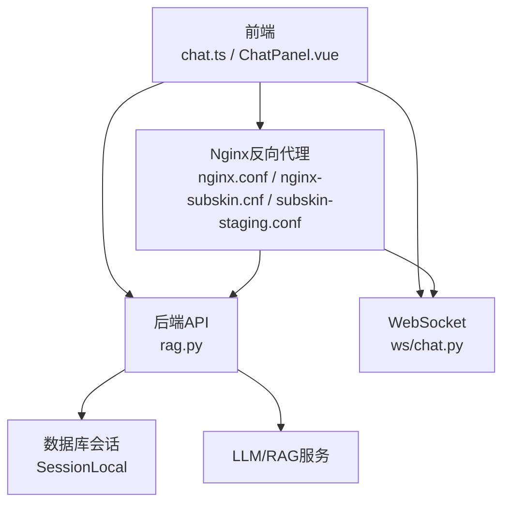
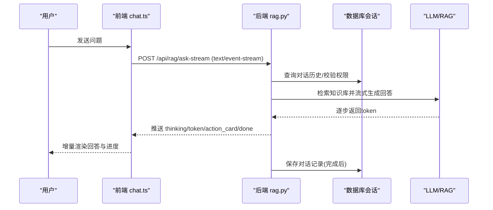
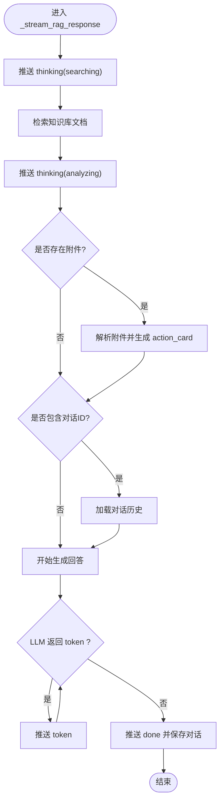
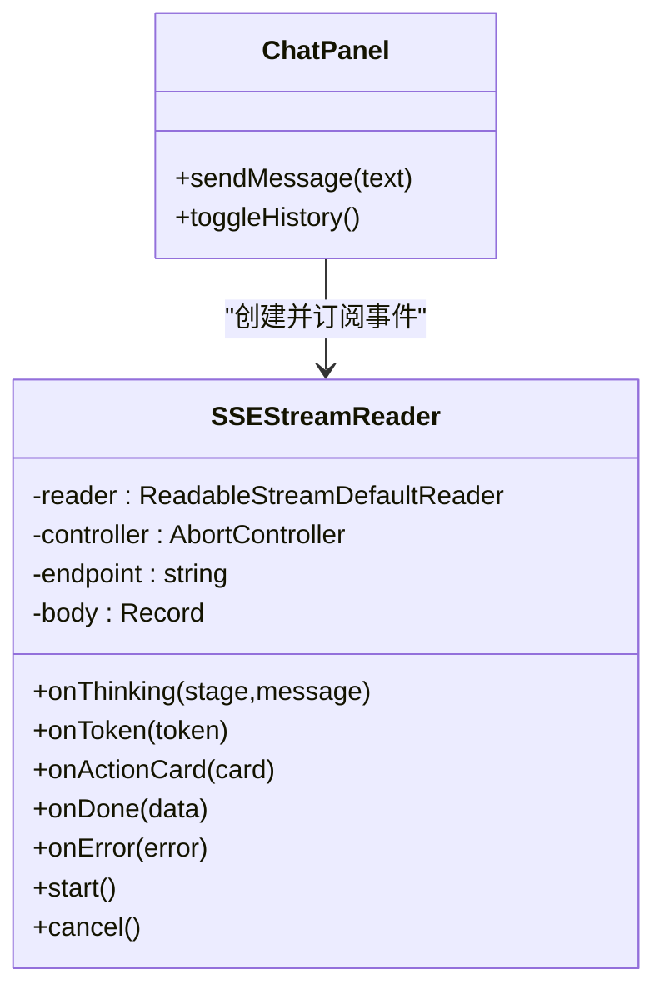
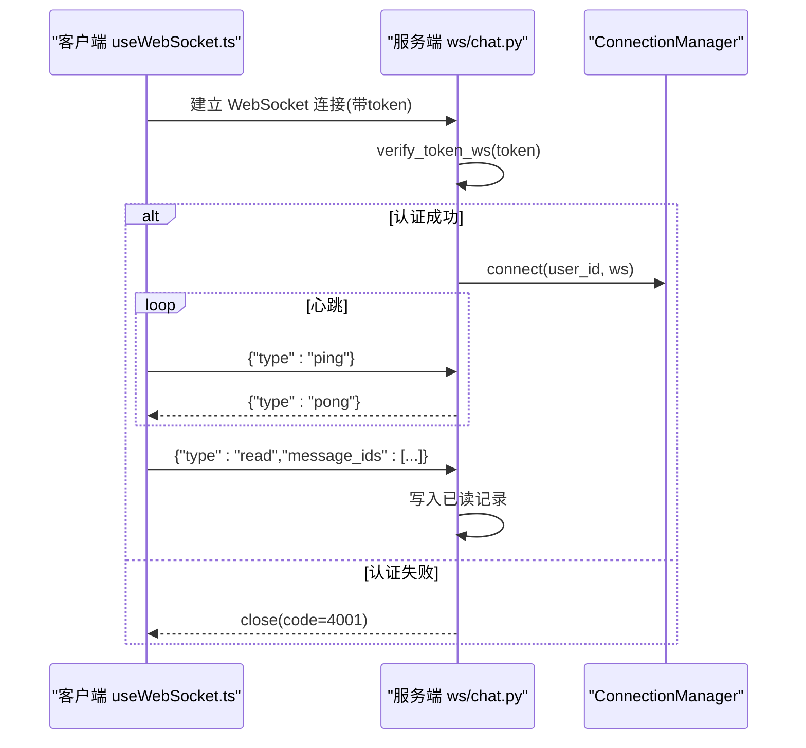
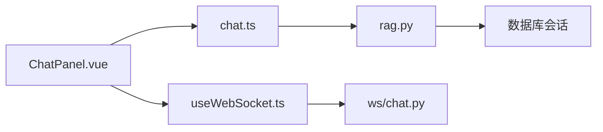

# 流式响应处理

<cite>
**本文引用的文件**   
- [web/backend/api/rag.py](file://web/backend/api/rag.py)
- [web/app/src/api/chat.ts](file://web/app/src/api/chat.ts)
- [web/app/src/components/assistant/ChatPanel.vue](file://web/app/src/components/assistant/ChatPanel.vue)
- [web/backend/ws/chat.py](file://web/backend/ws/chat.py)
- [web/app/src/composables/useWebSocket.ts](file://web/app/src/composables/useWebSocket.ts)
- [web/deploy/nginx.conf](file://web/deploy/nginx.conf)
- [web/deploy/nginx-subskin.cnf](file://web/deploy/nginx-subskin.cnf)
- [web/deploy/subskin-staging.conf](file://web/deploy/subskin-staging.conf)
</cite>

## 目录
1. [简介](#简介)
2. [项目结构](#项目结构)
3. [核心组件](#核心组件)
4. [架构总览](#架构总览)
5. [详细组件分析](#详细组件分析)
6. [依赖关系分析](#依赖关系分析)
7. [性能考量](#性能考量)
8. [故障排查指南](#故障排查指南)
9. [结论](#结论)
10. [附录](#附录)

## 简介
本技术文档聚焦 Subskin 的流式响应处理，围绕 Server-Sent Events（SSE）与 WebSocket 两种实时通信方案展开。重点包括：
- SSE 实现细节、分块传输、进度反馈、中断处理与连接管理
- 前端事件处理、错误重试机制与兼容性处理
- 与 WebSocket 替代方案的对比、性能优化策略与部署配置要点
- 前后端集成示例路径与最佳实践

## 项目结构
与流式响应相关的代码主要分布在以下位置：
- 后端 API：RAG 流式问答接口与事件生成器
- 前端客户端：SSE 读取器、事件分发与 UI 渲染
- 实时通道：WebSocket 聊天与心跳保活
- 反向代理：Nginx 对长连接与流式响应的超时与缓冲设置

**图表来源**
- [web/backend/api/rag.py:534-629](file://web/backend/api/rag.py#L534-L629)
- [web/app/src/api/chat.ts:116-271](file://web/app/src/api/chat.ts#L116-L271)
- [web/backend/ws/chat.py:14-51](file://web/backend/ws/chat.py#L14-L51)
- [web/deploy/nginx.conf:37-47](file://web/deploy/nginx.conf#L37-L47)
- [web/deploy/nginx-subskin.cnf:16-25](file://web/deploy/nginx-subskin.cnf#L16-L25)
- [web/deploy/subskin-staging.conf:18-27](file://web/deploy/subskin-staging.conf#L18-L27)

**章节来源**
- [web/backend/api/rag.py:534-729](file://web/backend/api/rag.py#L534-L729)
- [web/app/src/api/chat.ts:116-271](file://web/app/src/api/chat.ts#L116-L271)
- [web/backend/ws/chat.py:14-51](file://web/backend/ws/chat.py#L14-L51)
- [web/deploy/nginx.conf:37-47](file://web/deploy/nginx.conf#L37-L47)
- [web/deploy/nginx-subskin.cnf:16-25](file://web/deploy/nginx-subskin.cnf#L16-L25)
- [web/deploy/subskin-staging.conf:18-27](file://web/deploy/subskin-staging.conf#L18-L27)

## 核心组件
- 后端流式生成器：以 text/event-stream 协议逐条推送 thinking/token/action_card/done/error 等事件
- 前端 SSE 读取器：基于 ReadableStream + TextDecoder 解析 data: 行，按事件类型回调
- 前端 UI 层：将 token 增量渲染为回答文本，thinking 作为骨架屏提示，action_card 作为交互卡片
- WebSocket 通道：用于 IM 场景的心跳、已读回执与消息推送
- Nginx 反向代理：关闭缓冲、延长读取超时，确保长连接稳定

**章节来源**
- [web/backend/api/rag.py:632-861](file://web/backend/api/rag.py#L632-L861)
- [web/app/src/api/chat.ts:168-271](file://web/app/src/api/chat.ts#L168-L271)
- [web/app/src/components/assistant/ChatPanel.vue:17-54](file://web/app/src/components/assistant/ChatPanel.vue#L17-L54)
- [web/backend/ws/chat.py:14-51](file://web/backend/ws/chat.py#L14-L51)
- [web/deploy/nginx.conf:37-47](file://web/deploy/nginx.conf#L37-L47)

## 架构总览
SSE 流式问答的关键调用链如下：

**图表来源**
- [web/app/src/api/chat.ts:186-226](file://web/app/src/api/chat.ts#L186-L226)
- [web/backend/api/rag.py:534-565](file://web/backend/api/rag.py#L534-L565)
- [web/backend/api/rag.py:632-861](file://web/backend/api/rag.py#L632-L861)

**章节来源**
- [web/app/src/api/chat.ts:186-226](file://web/app/src/api/chat.ts#L186-L226)
- [web/backend/api/rag.py:534-565](file://web/backend/api/rag.py#L534-L565)
- [web/backend/api/rag.py:632-861](file://web/backend/api/rag.py#L632-L861)

## 详细组件分析

### 后端 SSE 生成器（RAG 流式问答）
- 路由定义：/ask-stream 与 /ask-public-stream，分别支持登录用户与访客
- 媒体类型：text/event-stream，禁用缓存与代理缓冲
- 事件序列：
  - thinking：搜索/分析/生成阶段提示
  - action_card：附件分析结果（图片 VASI、报告解读、日记草稿）
  - token：逐字输出回答内容
  - done：完成事件，携带 sources、remaining_quota、is_guest 等元信息
- 异常处理：未完成时回滚访客配额计数，确保公平使用

**图表来源**
- [web/backend/api/rag.py:632-861](file://web/backend/api/rag.py#L632-L861)

**章节来源**
- [web/backend/api/rag.py:534-629](file://web/backend/api/rag.py#L534-L629)
- [web/backend/api/rag.py:632-861](file://web/backend/api/rag.py#L632-L861)

### 前端 SSE 读取器与事件处理
- 连接建立：fetch POST 请求，设置 Authorization 头，获取 ReadableStream
- 数据解析：TextDecoder 解码字节流，按行拆分，过滤 data: 前缀，JSON 解析事件体
- 事件分发：onThinking/onToken/onActionCard/onDone/onError 回调
- 中断控制：AbortController 取消请求，ReadableStream.cancel() 释放资源
- 错误处理：网络异常、HTTP 非 2xx、流读取失败统一转友好文案

**图表来源**
- [web/app/src/api/chat.ts:168-271](file://web/app/src/api/chat.ts#L168-L271)
- [web/app/src/components/assistant/ChatPanel.vue:17-54](file://web/app/src/components/assistant/ChatPanel.vue#L17-L54)

**章节来源**
- [web/app/src/api/chat.ts:116-271](file://web/app/src/api/chat.ts#L116-L271)
- [web/app/src/components/assistant/ChatPanel.vue:17-54](file://web/app/src/components/assistant/ChatPanel.vue#L17-L54)

### WebSocket 替代方案（IM 聊天）
- 连接管理：ConnectionManager 维护 active 连接映射，支持 send_to_user/broadcast_unread_count
- 认证与鉴权：verify_token_ws 校验 token，未授权直接关闭连接
- 心跳保活：客户端定时 ping，服务端 pong 响应
- 业务事件：read 回执、unread_update 等

**图表来源**
- [web/backend/ws/chat.py:14-51](file://web/backend/ws/chat.py#L14-L51)
- [web/app/src/composables/useWebSocket.ts:11-42](file://web/app/src/composables/useWebSocket.ts#L11-L42)

**章节来源**
- [web/backend/ws/chat.py:14-51](file://web/backend/ws/chat.py#L14-L51)
- [web/app/src/composables/useWebSocket.ts:11-42](file://web/app/src/composables/useWebSocket.ts#L11-L42)

### 分块传输与进度反馈
- 分块传输：后端通过 generator 逐条 yield event(...)，前端按行解析
- 进度反馈：thinking 事件提供阶段提示；token 事件提供增量文本
- 附件处理：action_card 承载图片/文档分析结果，供前端渲染交互卡片

**章节来源**
- [web/backend/api/rag.py:632-861](file://web/backend/api/rag.py#L632-L861)
- [web/app/src/api/chat.ts:230-271](file://web/app/src/api/chat.ts#L230-L271)

### 中断处理与连接管理
- 前端中断：AbortController.abort() 触发 AbortError，避免 onError 误报
- 资源释放：reader.cancel() 清理流读取器
- 后端资源：finally 中关闭数据库会话，异常时回滚访客配额

**章节来源**
- [web/app/src/api/chat.ts:264-271](file://web/app/src/api/chat.ts#L264-L271)
- [web/backend/api/rag.py:851-861](file://web/backend/api/rag.py#L851-L861)

### 错误重试机制
- 前端错误分类：toFriendlyError 将认证/限流/超时等错误转为友好文案
- 后端异常保护：guest 配额在失败时退款，避免不公平消耗
- 建议增强：可引入指数退避重试（如网络抖动），但需考虑幂等性与用户体验

**章节来源**
- [web/app/src/api/chat.ts:131-149](file://web/app/src/api/chat.ts#L131-L149)
- [web/backend/api/rag.py:851-861](file://web/backend/api/rag.py#L851-L861)

### 兼容性处理
- SSE 兼容性：浏览器不支持流式读取时降级提示
- WebSocket 兼容：根据协议选择 ws/wss，自动处理重连与心跳
- Nginx 兼容：关闭缓冲、设置合理超时，避免中间件截断长连接

**章节来源**
- [web/app/src/api/chat.ts:221-225](file://web/app/src/api/chat.ts#L221-L225)
- [web/app/src/composables/useWebSocket.ts:16-18](file://web/app/src/composables/useWebSocket.ts#L16-L18)
- [web/deploy/nginx.conf:37-47](file://web/deploy/nginx.conf#L37-L47)

## 依赖关系分析
- 前端 chat.ts 依赖后端 /api/rag/* 接口，使用 Fetch API 与 ReadableStream
- ChatPanel.vue 消费 chatApi 的 streamAsk/streamAskPublic，绑定事件回调
- 后端 rag.py 依赖数据库会话与会话模型，调用 LLM/RAG 服务
- WebSocket 模块独立于 SSE，用于 IM 场景，共享认证逻辑

**图表来源**
- [web/app/src/components/assistant/ChatPanel.vue:17-54](file://web/app/src/components/assistant/ChatPanel.vue#L17-L54)
- [web/app/src/api/chat.ts:116-271](file://web/app/src/api/chat.ts#L116-L271)
- [web/backend/api/rag.py:534-629](file://web/backend/api/rag.py#L534-L629)
- [web/backend/ws/chat.py:14-51](file://web/backend/ws/chat.py#L14-L51)

**章节来源**
- [web/app/src/components/assistant/ChatPanel.vue:17-54](file://web/app/src/components/assistant/ChatPanel.vue#L17-L54)
- [web/app/src/api/chat.ts:116-271](file://web/app/src/api/chat.ts#L116-L271)
- [web/backend/api/rag.py:534-629](file://web/backend/api/rag.py#L534-L629)
- [web/backend/ws/chat.py:14-51](file://web/backend/ws/chat.py#L14-L51)

## 性能考量
- 后端：
  - 使用 generator 逐条推送事件，减少内存占用
  - 数据库会话及时关闭，异常时回滚配额
- 前端：
  - 增量渲染 token，避免整段拼接导致的卡顿
  - 合理设置 buffer 与解码策略，避免重复解析
- 反向代理：
  - 关闭 proxy_buffering，避免 Nginx 缓冲导致延迟
  - 设置合理的 proxy_read_timeout，适应长耗时任务

[本节为通用指导，不直接分析具体文件]

## 故障排查指南
- 常见问题：
  - 流式读取失败：检查网络连接、浏览器兼容性、AbortError 是否被误捕获
  - 认证失败：确认 Authorization 头是否正确传递
  - 限流/额度用尽：前端 toFriendlyError 已做友好提示，后端 guest 配额退款
  - 长连接超时：检查 Nginx proxy_read_timeout 与后端响应时间
- 定位方法：
  - 前端控制台查看 onError 回调与网络面板
  - 后端日志关注 RAG stream failed before completion 与配额退款记录

**章节来源**
- [web/app/src/api/chat.ts:131-149](file://web/app/src/api/chat.ts#L131-L149)
- [web/backend/api/rag.py:851-861](file://web/backend/api/rag.py#L851-L861)

## 结论
Subskin 的流式响应处理以 SSE 为核心，结合前端增量渲染与后端事件驱动，实现了低延迟、高吞吐的实时交互体验。WebSocket 作为 IM 场景的补充，提供了双向通信与心跳保活能力。通过合理的 Nginx 配置与错误处理策略，系统在稳定性与用户体验之间取得了良好平衡。未来可进一步增强重试机制与监控指标，提升鲁棒性。

[本节为总结，不直接分析具体文件]

## 附录
- 前端集成要点：
  - 使用 createSSEConnection 发起流式请求，绑定 onThinking/onToken/onActionCard/onDone/onError
  - 通过 AbortController 控制中断，确保资源释放
- 后端配置要点：
  - 设置 media_type="text/event-stream"，禁用缓存与代理缓冲
  - 异常时回滚访客配额，保证公平性
- Nginx 配置要点：
  - 关闭 proxy_buffering，设置足够长的 proxy_read_timeout
  - 静态资源缓存与 Service Worker 不缓存策略

**章节来源**
- [web/app/src/api/chat.ts:116-271](file://web/app/src/api/chat.ts#L116-L271)
- [web/backend/api/rag.py:534-565](file://web/backend/api/rag.py#L534-L565)
- [web/deploy/nginx.conf:37-47](file://web/deploy/nginx.conf#L37-L47)
- [web/deploy/nginx-subskin.cnf:16-25](file://web/deploy/nginx-subskin.cnf#L16-L25)
- [web/deploy/subskin-staging.conf:18-27](file://web/deploy/subskin-staging.conf#L18-L27)