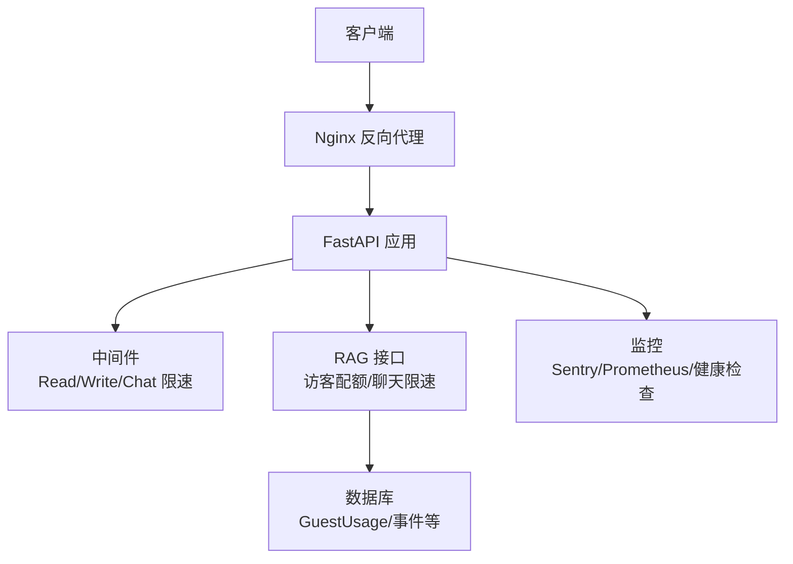
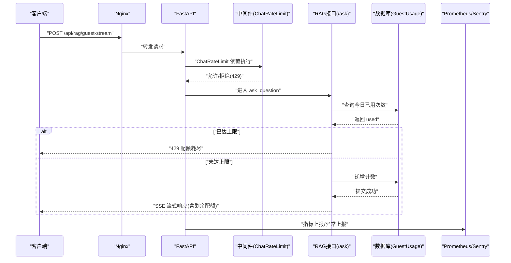
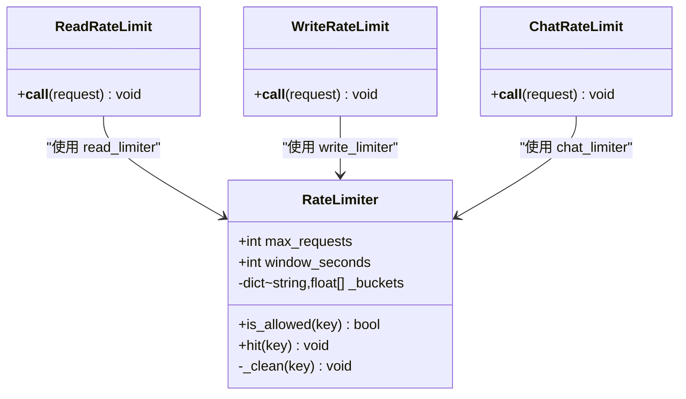
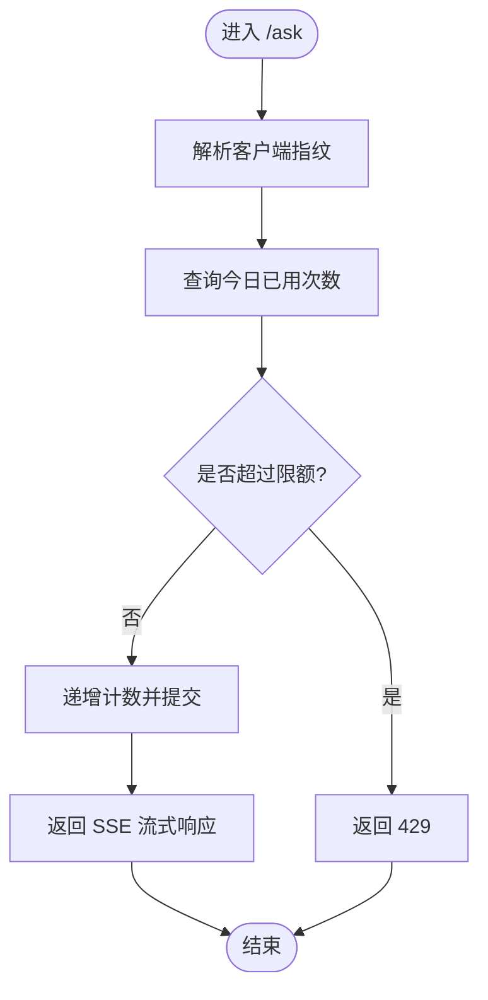
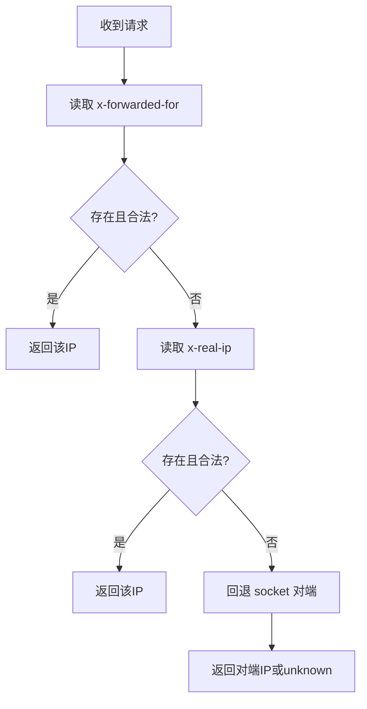
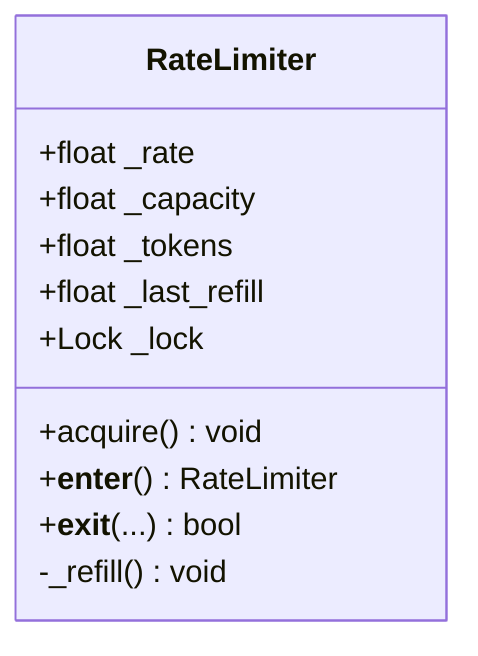
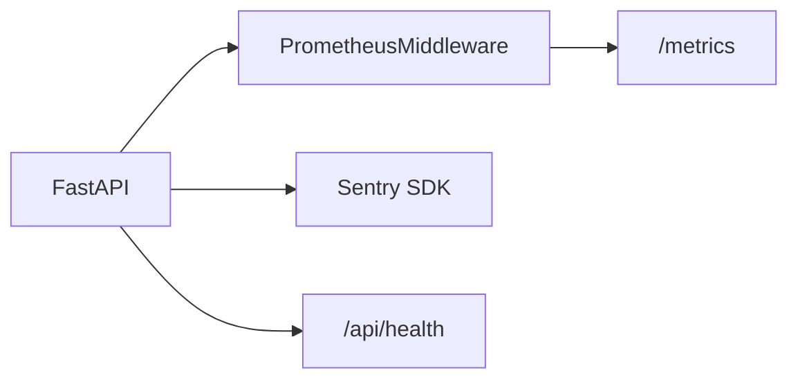
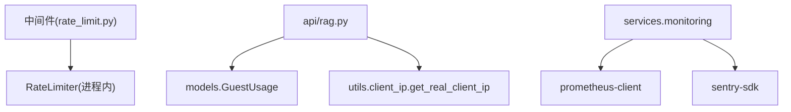

# 速率限制与配额管理

<cite>
**本文引用的文件**   
- [web/backend/app/middleware/rate_limit.py](file://web/backend/app/middleware/rate_limit.py)
- [web/backend/api/rag.py](file://web/backend/api/rag.py)
- [web/backend/utils/client_ip.py](file://web/backend/utils/client_ip.py)
- [web/backend/database/models.py](file://web/backend/database/models.py)
- [configs/web_config.yaml](file://configs/web_config.yaml)
- [src/utils/rate_limiter.py](file://src/utils/rate_limiter.py)
- [web/backend/services/monitoring.py](file://web/backend/services/monitoring.py)
- [web/backend/api/events.py](file://web/backend/api/events.py)
- [tests/test_rate_limiter.py](file://tests/test_rate_limiter.py)
</cite>

## 目录
1. [简介](#简介)
2. [项目结构](#项目结构)
3. [核心组件](#核心组件)
4. [架构总览](#架构总览)
5. [详细组件分析](#详细组件分析)
6. [依赖关系分析](#依赖关系分析)
7. [性能考量](#性能考量)
8. [故障排查指南](#故障排查指南)
9. [结论](#结论)
10. [附录](#附录)

## 简介
本技术文档聚焦 Subskin 的速率限制与配额管理，覆盖访客配额控制、用户级限速、IP 指纹识别与防滥用机制。重点说明：
- 访客每日配额（按客户端指纹）与已登录用户的每分钟请求数限制
- 进程内令牌桶/滑动窗口限流器实现与扩展点
- IP 真实地址解析（Nginx 反代场景）
- 监控告警（Sentry/Prometheus）、健康检查与弹性扩容建议
- 配额统计、使用监控、告警通知与面板集成方法
- 具体限流配置示例与最佳实践

## 项目结构
与速率限制和配额相关的代码主要分布在后端中间件、API 层、工具库与配置文件中：
- 中间件：定义读/写/聊天三类限速依赖
- API：访客配额校验、增量计数、退款补偿、聊天接口限速
- 工具：真实客户端 IP 解析
- 数据模型：访客用量表 GuestUsage
- 配置：安全与速率限制开关、Redis 配置项预留
- 通用限流器：线程安全的令牌桶算法实现
- 监控：Prometheus 指标与健康检查

**图表来源**
- [web/backend/app/middleware/rate_limit.py:1-96](file://web/backend/app/middleware/rate_limit.py#L1-L96)
- [web/backend/api/rag.py:25-629](file://web/backend/api/rag.py#L25-L629)
- [web/backend/utils/client_ip.py:1-40](file://web/backend/utils/client_ip.py#L1-L40)
- [web/backend/database/models.py:213-242](file://web/backend/database/models.py#L213-L242)
- [web/backend/services/monitoring.py:1-260](file://web/backend/services/monitoring.py#L1-L260)

**章节来源**
- [web/backend/app/middleware/rate_limit.py:1-96](file://web/backend/app/middleware/rate_limit.py#L1-L96)
- [web/backend/api/rag.py:25-629](file://web/backend/api/rag.py#L25-L629)
- [web/backend/utils/client_ip.py:1-40](file://web/backend/utils/client_ip.py#L1-L40)
- [web/backend/database/models.py:213-242](file://web/backend/database/models.py#L213-L242)
- [web/backend/services/monitoring.py:1-260](file://web/backend/services/monitoring.py#L1-L260)

## 核心组件
- 进程内限流器（滑动窗口）
  - 提供 read/write/chat 三类实例，分别对 IP、用户 ID（或回退 IP）进行每分钟请求数限制
  - 通过 FastAPI 依赖注入在路由中启用
- 访客配额（按客户端指纹）
  - 基于数据库 GuestUsage 表记录每日提问次数，达到阈值返回 429
  - 支持查询剩余配额、失败时退款补偿
- 真实客户端 IP 解析
  - 优先 X-Forwarded-For，其次 X-Real-IP，最后 socket 对端
- 通用令牌桶限流器
  - 线程安全，适用于爬虫/外部调用等场景
- 监控与告警
  - Sentry 错误追踪、Prometheus 指标采集、健康检查端点

**章节来源**
- [web/backend/app/middleware/rate_limit.py:1-96](file://web/backend/app/middleware/rate_limit.py#L1-L96)
- [web/backend/api/rag.py:124-186](file://web/backend/api/rag.py#L124-L186)
- [web/backend/utils/client_ip.py:1-40](file://web/backend/utils/client_ip.py#L1-L40)
- [src/utils/rate_limiter.py:1-81](file://src/utils/rate_limiter.py#L1-L81)
- [web/backend/services/monitoring.py:1-260](file://web/backend/services/monitoring.py#L1-L260)

## 架构总览
下图展示一次“访客聊天”请求从进入 Nginx 到返回 SSE 响应的完整流程，包括配额校验、限速拦截与监控埋点。

**图表来源**
- [web/backend/app/middleware/rate_limit.py:68-84](file://web/backend/app/middleware/rate_limit.py#L68-L84)
- [web/backend/api/rag.py:228-244](file://web/backend/api/rag.py#L228-L244)
- [web/backend/api/rag.py:597-629](file://web/backend/api/rag.py#L597-L629)
- [web/backend/services/monitoring.py:185-203](file://web/backend/services/monitoring.py#L185-L203)

## 详细组件分析

### 组件一：进程内限流器（滑动窗口）
- 设计要点
  - 以时间窗口内的请求时间戳列表作为桶，定期清理过期时间戳
  - is_allowed/hit 原子性由单进程内存保证；多实例部署需分布式方案
- 适用场景
  - 社区读接口（IP 维度）、写接口（用户 ID 维度，回退 IP）、聊天接口（用户 ID 维度，回退 IP）
- 扩展建议
  - 替换为 Redis 滑动窗口/计数器，支持水平扩展与持久化

**图表来源**
- [web/backend/app/middleware/rate_limit.py:10-36](file://web/backend/app/middleware/rate_limit.py#L10-L36)
- [web/backend/app/middleware/rate_limit.py:39-84](file://web/backend/app/middleware/rate_limit.py#L39-L84)

**章节来源**
- [web/backend/app/middleware/rate_limit.py:1-96](file://web/backend/app/middleware/rate_limit.py#L1-L96)

### 组件二：访客配额与聊天限速
- 访客配额
  - 通过客户端指纹（优先代理头解析真实 IP）定位 GuestUsage 记录
  - 达到 GUEST_DAILY_LIMIT 即返回 429；否则递增计数并返回剩余次数
  - 失败路径支持退款补偿，避免误扣
- 聊天限速
  - 已登录用户按 user_id 限速，匿名按 IP 回退，防止 LLM 成本滥用
- 关键流程

**图表来源**
- [web/backend/api/rag.py:136-163](file://web/backend/api/rag.py#L136-L163)
- [web/backend/api/rag.py:166-186](file://web/backend/api/rag.py#L166-L186)
- [web/backend/api/rag.py:597-629](file://web/backend/api/rag.py#L597-L629)

**章节来源**
- [web/backend/api/rag.py:124-186](file://web/backend/api/rag.py#L124-L186)
- [web/backend/api/rag.py:597-629](file://web/backend/api/rag.py#L597-L629)

### 组件三：真实客户端 IP 解析
- 策略
  - 优先 x-forwarded-for 首个合法 IP，其次 x-real-ip，最后 socket 对端
  - 过滤非法片段，确保返回可解析 IP
- 用途
  - 访客配额、IP 限速、审计日志等

**图表来源**
- [web/backend/utils/client_ip.py:14-39](file://web/backend/utils/client_ip.py#L14-L39)

**章节来源**
- [web/backend/utils/client_ip.py:1-40](file://web/backend/utils/client_ip.py#L1-L40)

### 组件四：通用令牌桶限流器（线程安全）
- 算法
  - 基于单调时钟维护令牌余额，按固定速率补充
  - acquire() 阻塞直到获得令牌，支持上下文管理器
- 测试
  - 覆盖不同速率下的吞吐与时延特性，以及并发安全性

**图表来源**
- [src/utils/rate_limiter.py:10-81](file://src/utils/rate_limiter.py#L10-L81)

**章节来源**
- [src/utils/rate_limiter.py:1-81](file://src/utils/rate_limiter.py#L1-L81)
- [tests/test_rate_limiter.py:1-54](file://tests/test_rate_limiter.py#L1-L54)

### 组件五：监控与告警
- Sentry
  - 自动捕获异常，过滤敏感信息，支持采样率与环境标识
- Prometheus
  - 暴露 /metrics，收集 HTTP 请求总量、耗时、并发数
- 健康检查
  - /api/health 检查数据库连通性与磁盘空间

**图表来源**
- [web/backend/services/monitoring.py:96-203](file://web/backend/services/monitoring.py#L96-L203)
- [web/backend/services/monitoring.py:208-241](file://web/backend/services/monitoring.py#L208-L241)

**章节来源**
- [web/backend/services/monitoring.py:1-260](file://web/backend/services/monitoring.py#L1-L260)

## 依赖关系分析
- 中间件依赖
  - ReadRateLimit/WriteRateLimit/ChatRateLimit 均依赖各自的 RateLimiter 实例
- API 依赖
  - RAG 接口依赖 GuestUsage 模型与 client_ip 工具
- 监控依赖
  - 可选依赖 prometheus-client、sentry-sdk，未安装则降级

**图表来源**
- [web/backend/app/middleware/rate_limit.py:10-36](file://web/backend/app/middleware/rate_limit.py#L10-L36)
- [web/backend/api/rag.py:25-31](file://web/backend/api/rag.py#L25-L31)
- [web/backend/utils/client_ip.py:1-40](file://web/backend/utils/client_ip.py#L1-L40)
- [web/backend/services/monitoring.py:113-139](file://web/backend/services/monitoring.py#L113-L139)

**章节来源**
- [web/backend/app/middleware/rate_limit.py:1-96](file://web/backend/app/middleware/rate_limit.py#L1-L96)
- [web/backend/api/rag.py:25-629](file://web/backend/api/rag.py#L25-L629)
- [web/backend/utils/client_ip.py:1-40](file://web/backend/utils/client_ip.py#L1-L40)
- [web/backend/services/monitoring.py:1-260](file://web/backend/services/monitoring.py#L1-L260)

## 性能考量
- 进程内限流器
  - 优点：零外部依赖、低延迟
  - 缺点：重启丢失、多实例不一致
  - 建议：生产环境迁移至 Redis 滑动窗口/计数器
- 访客配额
  - 当前基于数据库逐条更新，高并发下可能成为瓶颈
  - 建议：引入 Redis 原子计数（INCR+TTL），异步落库合并
- 监控开销
  - Prometheus 指标维度需控制基数（如 endpoint 模板化）
  - Sentry 采样率按需调整，避免过多噪声

[本节为通用指导，不直接分析具体文件]

## 故障排查指南
- 常见问题
  - 429 频繁出现：检查中间件阈值、访客配额上限、Nginx 代理头是否正确
  - 配额未扣减：检查失败路径退款逻辑与事务提交
  - 监控缺失：确认环境变量与依赖安装
- 诊断步骤
  - 查看 /api/health 健康状态
  - 抓取 /metrics 指标，观察 429 比率与请求耗时
  - 检查 Sentry 错误堆栈与上下文
  - 核对 GuestUsage 当日记录与指纹一致性

**章节来源**
- [web/backend/services/monitoring.py:208-241](file://web/backend/services/monitoring.py#L208-L241)
- [web/backend/services/monitoring.py:185-203](file://web/backend/services/monitoring.py#L185-L203)
- [web/backend/api/rag.py:166-186](file://web/backend/api/rag.py#L166-L186)

## 结论
Subskin 的速率限制与配额体系在当前阶段以进程内限流与数据库配额为主，具备清晰的扩展点与监控能力。面向生产，建议：
- 将限流器迁移至 Redis，实现分布式一致性与持久化
- 优化访客配额写入路径，采用原子计数与异步落库
- 完善告警规则与容量规划，结合 Prometheus/Grafana 构建统一面板
- 强化安全策略（代理头校验、IP 白名单、异常行为检测）

[本节为总结，不直接分析具体文件]

## 附录

### 限流配置示例（基于现有中间件）
- 读接口（IP 维度）：60 次/分钟
- 写接口（用户维度，回退 IP）：10 次/分钟
- 聊天接口（用户维度，回退 IP）：20 次/分钟
- 访客每日配额：5 次（可通过常量调整）

**章节来源**
- [web/backend/app/middleware/rate_limit.py:29-36](file://web/backend/app/middleware/rate_limit.py#L29-L36)
- [web/backend/api/rag.py:57-59](file://web/backend/api/rag.py#L57-L59)

### 监控面板集成方法
- 启用 Prometheus
  - 设置环境变量 PROMETHEUS_ENABLED=true
  - 访问 /metrics 抓取指标
- 启用 Sentry
  - 设置 SENTRY_DSN、SENTRY_ENVIRONMENT、SENTRY_TRACES_SAMPLE_RATE
- 健康检查
  - 定时探测 /api/health，关注 database/disk 状态

**章节来源**
- [web/backend/services/monitoring.py:185-203](file://web/backend/services/monitoring.py#L185-L203)
- [web/backend/services/monitoring.py:246-260](file://web/backend/services/monitoring.py#L246-L260)

### 弹性扩容建议
- 多实例部署
  - 使用 Redis 共享限流状态，避免各实例独立计数导致超限
- 水平扩展
  - 针对高并发配额写入，引入消息队列异步落库，削峰填谷
- 资源监控
  - 结合系统资源接口（CPU/内存/磁盘）与业务指标联动扩缩容

[本节为通用指导，不直接分析具体文件]