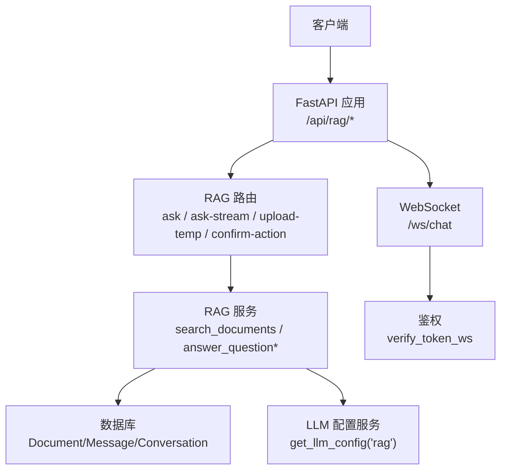
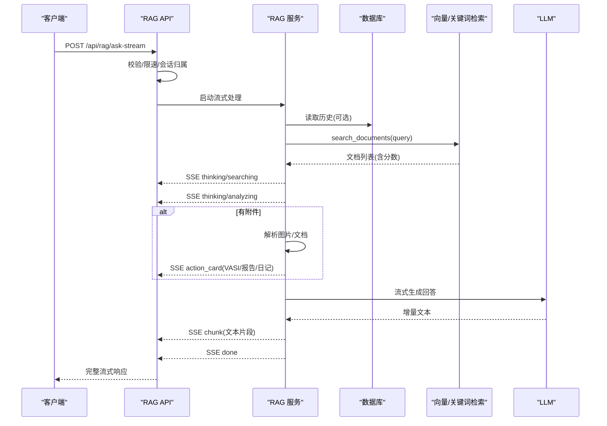
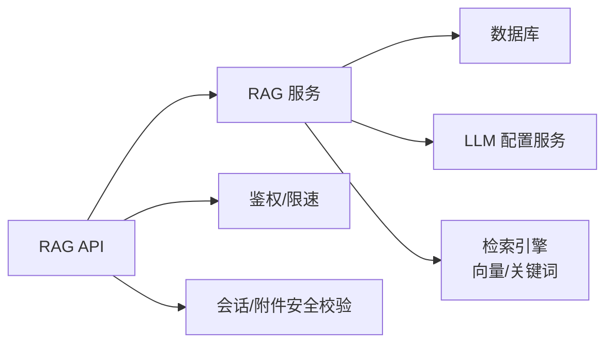

# AI问答API

<cite>
**本文引用的文件**
- [web/backend/api/rag.py](file://web/backend/api/rag.py)
- [web/backend/services/rag.py](file://web/backend/services/rag.py)
- [web/backend/models/rag.py](file://web/backend/models/rag.py)
- [web/backend/ws/chat.py](file://web/backend/ws/chat.py)
- [web/backend/app/main.py](file://web/backend/app/main.py)
- [web/backend/services/llm_config_service.py](file://web/backend/services/llm_config_service.py)
- [tests/backend/api/test_rag.py](file://tests/backend/api/test_rag.py)
</cite>

## 目录
1. [简介](#简介)
2. [项目结构](#项目结构)
3. [核心组件](#核心组件)
4. [架构总览](#架构总览)
5. [详细接口说明](#详细接口说明)
6. [依赖关系分析](#依赖关系分析)
7. [性能与优化建议](#性能与优化建议)
8. [故障排查指南](#故障排查指南)
9. [结论](#结论)
10. [附录：事件与消息格式](#附录事件与消息格式)

## 简介
本API文档面向AI问答系统，覆盖RAG检索增强生成的核心能力：对话消息发送、流式响应处理、知识库查询、会话管理、临时附件上传与解析、访客配额控制、以及LLM配置管理。同时提供WebSocket实时通信协议（用于即时通讯读已读等）及SSE流式事件规范，帮助前端快速集成并实现“边搜边答”的流畅体验。

## 项目结构
后端采用FastAPI模块化路由组织，RAG相关能力集中在以下位置：
- API层：web/backend/api/rag.py（REST端点）
- 服务层：web/backend/services/rag.py（检索、提示词构建、用户上下文聚合、向量/关键词混合检索）
- 数据模型：web/backend/models/rag.py（请求/响应Pydantic模型）
- WebSocket：web/backend/ws/chat.py（连接管理与消息处理）
- 应用入口：web/backend/app/main.py（路由注册、CORS、生命周期、WS挂载）
- LLM配置：web/backend/services/llm_config_service.py（模块级配置、密钥加密、默认初始化）
- 测试用例：tests/backend/api/test_rag.py（端到端验证SSE事件、权限、配额等）

图表来源
- [web/backend/app/main.py:280-342](file://web/backend/app/main.py#L280-L342)
- [web/backend/api/rag.py:246-630](file://web/backend/api/rag.py#L246-L630)
- [web/backend/services/rag.py:456-523](file://web/backend/services/rag.py#L456-L523)
- [web/backend/ws/chat.py:45-111](file://web/backend/ws/chat.py#L45-L111)

章节来源
- [web/backend/app/main.py:280-342](file://web/backend/app/main.py#L280-L342)

## 核心组件
- RAG REST API：提供同步问答、访客公开问答、流式问答、临时文件上传、动作确认保存等能力。
- RAG 服务：负责混合检索（向量+关键词）、提示词组装、用户上下文聚合、附件解析（图片VASI评估、文档解读）。
- WebSocket：维护在线连接、处理读已读、心跳ping/pong。
- LLM配置服务：按模块（如“rag”）管理供应商、模型、API Key加密存储与热更新。

章节来源
- [web/backend/api/rag.py:246-630](file://web/backend/api/rag.py#L246-L630)
- [web/backend/services/rag.py:525-700](file://web/backend/services/rag.py#L525-L700)
- [web/backend/ws/chat.py:14-111](file://web/backend/ws/chat.py#L14-L111)
- [web/backend/services/llm_config_service.py:215-340](file://web/backend/services/llm_config_service.py#L215-L340)

## 架构总览
RAG问答流程（流式）：
1. 客户端调用POST /api/rag/ask-stream或/ask-public-stream，携带问题、可选conversation_id、可选attachment_ids、可选mode。
2. 服务端校验长度、话题相关性（访客）、访客配额、登录态与会话所有权。
3. 执行检索：优先向量检索，回退到关键词检索；合并去重并按综合得分排序。
4. 生成思考事件：thinking/searching → analyzing → generating。
5. 若存在附件：解析图片（VASI评分/分期/面积）或文档（报告解读），推送action_card事件。
6. 构造历史上下文（如有conversation_id），调用LLM流式生成回答片段，逐条推送。
7. 结束事件done，返回最终答案与来源。

图表来源
- [web/backend/api/rag.py:534-630](file://web/backend/api/rag.py#L534-L630)
- [web/backend/services/rag.py:456-523](file://web/backend/services/rag.py#L456-L523)

## 详细接口说明

### 通用说明
- 基础路径：/api/rag
- 认证：除“public”接口外均需Bearer Token
- 内容类型：JSON（上传为multipart/form-data）
- 错误码：400/401/403/404/422/429/500（具体见各接口）

#### 1) 同步问答（已登录）
- 方法：POST /api/rag/ask
- 鉴权：需要
- 请求体：QuestionRequest
  - question: string（最大2000字符）
  - conversation_id: string?（会话ID，用于上下文）
  - mode: string?（"knowledge"|"counseling"）
- 响应：QuestionResponse
  - answer: string
  - sources: list<Source>
  - remaining_quota: int?（仅访客流式时附带）
  - is_guest: bool?（仅访客流式时附带）
- 行为要点：
  - 会话所有权校验（防止跨用户读写）
  - 用户级速率限制
  - 支持模式切换（知识问答/心理陪伴）

章节来源
- [web/backend/api/rag.py:246-270](file://web/backend/api/rag.py#L246-L270)
- [web/backend/models/rag.py:8-12](file://web/backend/models/rag.py#L8-L12)
- [web/backend/models/rag.py:28-42](file://web/backend/models/rag.py#L28-L42)

#### 2) 同步问答（访客）
- 方法：POST /api/rag/ask-public
- 鉴权：不需要
- 请求体：同QuestionRequest
- 响应：同QuestionResponse（可能包含remaining_quota/is_guest）
- 行为要点：
  - 话题相关性校验（白癜风/皮肤健康/站点功能/危机消息放行）
  - 访客每日次数限制（默认5次）
  - 失败不扣额度（异常保护）

章节来源
- [web/backend/api/rag.py:273-330](file://web/backend/api/rag.py#L273-L330)
- [web/backend/services/rag.py:292-351](file://web/backend/services/rag.py#L292-L351)

#### 3) 流式问答（已登录）
- 方法：POST /api/rag/ask-stream
- 鉴权：需要
- 请求体：QuestionRequestWithAttachments
  - question, conversation_id, attachment_ids?, mode
- 响应：text/event-stream（SSE）
- 事件类型：
  - thinking：阶段提示（searching/analyzing/generating/reading_document/analyzing_image）
  - action_card：卡片（vasi/report/diary）
  - chunk：回答片段
  - error：错误信息
  - done：完成
- 行为要点：
  - 会话所有权校验、用户级速率限制
  - 附件解析（图片→VASI卡片；文档→报告解读卡片；可自动生成日记草稿）
  - 访客配额不在此接口使用

章节来源
- [web/backend/api/rag.py:534-630](file://web/backend/api/rag.py#L534-L630)
- [tests/backend/api/test_rag.py:312-473](file://tests/backend/api/test_rag.py#L312-L473)

#### 4) 流式问答（访客）
- 方法：POST /api/rag/ask-public-stream
- 鉴权：不需要
- 请求体：同QuestionRequestWithAttachments
- 响应：text/event-stream（SSE）
- 行为要点：
  - 话题相关性校验、访客配额检查与递增
  - 失败时尝试退款（避免误扣额度）

章节来源
- [web/backend/api/rag.py:568-630](file://web/backend/api/rag.py#L568-L630)

#### 5) 临时文件上传
- 方法：POST /api/rag/upload-temp
- 鉴权：需要
- 表单字段：file（multipart/form-data）
- 响应：TempUploadResponse
  - temp_url, temp_id, mime_type, size
- 行为要点：
  - 允许类型：image/jpeg/png/webp, application/pdf, text/plain/markdown, doc/docx
  - 大小限制：10MB
  - 写入侧边元数据.meta记录所有者，后续附件解析需校验所有权

章节来源
- [web/backend/api/rag.py:345-382](file://web/backend/api/rag.py#L345-L382)

#### 6) 动作确认保存
- 方法：POST /api/rag/confirm-action
- 鉴权：需要
- 请求体：ConfirmActionRequest
  - conversation_id, card_type, card_data, action
- 响应：ConfirmActionResponse
  - success, message, resource_id?
- 行为要点：
  - 支持保存VASI测评、体检报告、社区日记（可公开分享）
  - 临时文件从uploads/temp迁移至持久化目录

章节来源
- [web/backend/api/rag.py:385-531](file://web/backend/api/rag.py#L385-L531)

#### 7) 访客配额查询
- 方法：GET /api/rag/guest-quota
- 鉴权：不需要
- 响应：{used, limit, remaining}

章节来源
- [web/backend/api/rag.py:333-342](file://web/backend/api/rag.py#L333-L342)

#### 8) WebSocket 实时通信
- 路径：/ws/chat?token=...
- 鉴权：通过token验证
- 事件：
  - 客户端→服务端：{"type":"ping"} → 服务端{"type":"pong"}
  - 客户端→服务端：{"type":"read","message_ids":[...]} → 服务端记录读已读
- 服务端→客户端：{"type":"unread_update","data":{"total_unread":N}}

章节来源
- [web/backend/ws/chat.py:14-111](file://web/backend/ws/chat.py#L14-L111)
- [web/backend/app/main.py:340-342](file://web/backend/app/main.py#L340-L342)

## 依赖关系分析
- API层依赖服务层进行业务逻辑封装，服务层依赖数据库与LLM配置服务。
- 检索策略：
  - 环境变量RAG_USE_VECTOR控制是否启用向量检索；未启用或未配置embedding则回退关键词检索。
  - 混合检索：向量结果与关键词结果合并去重，按综合得分排序。
- 安全与限流：
  - 会话所有权校验防止越权访问。
  - 用户级聊天速率限制（登录用户），访客按IP指纹+UA+路径前缀计算指纹并限制每日次数。
- 附件安全：
  - 临时文件带.sidecar .meta记录所有者，解析时严格校验user_id匹配。

图表来源
- [web/backend/services/rag.py:456-523](file://web/backend/services/rag.py#L456-L523)
- [web/backend/api/rag.py:188-244](file://web/backend/api/rag.py#L188-L244)

章节来源
- [web/backend/services/rag.py:456-523](file://web/backend/services/rag.py#L456-L523)
- [web/backend/api/rag.py:188-244](file://web/backend/api/rag.py#L188-L244)

## 性能与优化建议
- 检索优化
  - 合理设置top_k，平衡召回与延迟。
  - 对无embedding或维度不匹配的文档，自动回退关键词检索，确保新入库内容立即可查。
  - 结合权威权重与时效性加权，提升高质量文档排名。
- 流式传输
  - 使用SSE减少首字节延迟，前端应增量渲染。
  - 关闭代理缓冲（X-Accel-Buffering: no）避免中间层缓存阻塞。
- 附件处理
  - 大文件分片上传与异步解析，避免阻塞主线程。
  - 图片与文档解析失败时降级，不影响问答主流程。
- 限流与配额
  - 登录用户按用户维度限流，访客按指纹维度限流，防止滥用。
  - 失败时尝试退款访客额度，提升用户体验。
- LLM配置
  - 使用模块级配置（如“rag”）隔离不同场景的模型与Key，便于灰度与回滚。
  - 定期刷新配置与环境变量，支持动态切换供应商与模型。

[本节为通用指导，无需特定文件引用]

## 故障排查指南
- 401 未授权
  - 检查Token是否有效，WS连接是否携带正确token。
- 403 无权访问会话
  - 检查conversation_id是否属于当前用户，或被删除。
- 400 非法输入
  - 问题为空或超长；访客问题非相关主题；不支持的文件类型。
- 422 参数校验失败
  - 请求体字段缺失或类型不符。
- 429 频率限制
  - 登录用户聊天过快或访客当日次数用尽。
- 500 内部错误
  - 检查LLM配置是否正确（provider/base_url/api_key），向量维度是否一致，数据库连接是否正常。

章节来源
- [web/backend/api/rag.py:228-244](file://web/backend/api/rag.py#L228-L244)
- [web/backend/api/rag.py:273-330](file://web/backend/api/rag.py#L273-L330)
- [web/backend/ws/chat.py:45-111](file://web/backend/ws/chat.py#L45-L111)

## 结论
本API提供了完整的RAG问答能力，涵盖同步与流式两种交互方式，支持附件解析与动作确认保存，具备完善的权限、配额与安全机制。配合WebSocket可实现实时IM能力。通过模块化的LLM配置服务，系统可灵活切换供应商与模型，满足多场景需求。建议在生产环境关注检索质量、流式渲染体验与资源占用监控，持续优化性能与稳定性。

[本节为总结，无需特定文件引用]

## 附录：事件与消息格式

### SSE事件类型（流式问答）
- thinking
  - stage: searching | analyzing | generating | reading_document | analyzing_image
  - message: 人类可读的阶段提示
- action_card
  - card: {type: vasi|report|diary, ...}
- chunk
  - 文本片段（由服务层流式输出）
- error
  - message: 错误描述
- done
  - 表示流结束

章节来源
- [web/backend/api/rag.py:632-800](file://web/backend/api/rag.py#L632-L800)
- [tests/backend/api/test_rag.py:312-473](file://tests/backend/api/test_rag.py#L312-L473)

### WebSocket事件
- 客户端→服务端
  - {"type":"ping"}
  - {"type":"read","message_ids":[...]}
- 服务端→客户端
  - {"type":"pong"}
  - {"type":"unread_update","data":{"total_unread":N}}

章节来源
- [web/backend/ws/chat.py:45-111](file://web/backend/ws/chat.py#L45-L111)

### 请求/响应模型
- QuestionRequest
  - question, conversation_id?, mode?
- QuestionRequestWithAttachments
  - question, conversation_id?, attachment_ids?, mode?
- QuestionResponse
  - answer, sources[], remaining_quota?, is_guest?
- TempUploadResponse
  - temp_url, temp_id, mime_type, size
- ConfirmActionRequest/Response
  - conversation_id, card_type, card_data, action; success, message, resource_id?

章节来源
- [web/backend/models/rag.py:8-62](file://web/backend/models/rag.py#L8-L62)