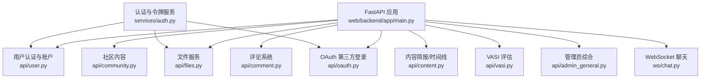
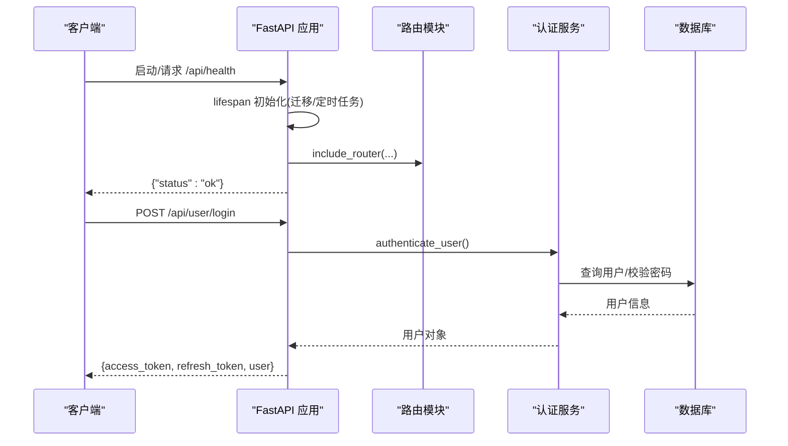
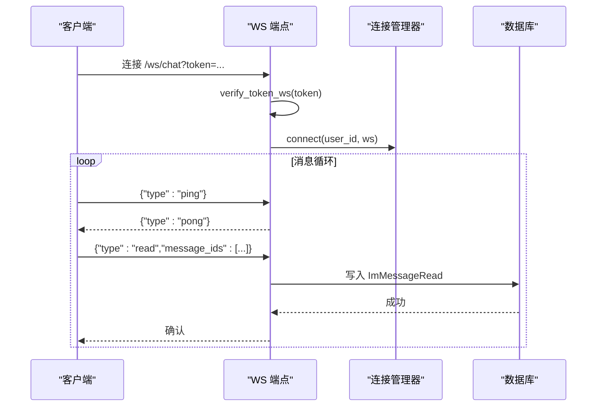
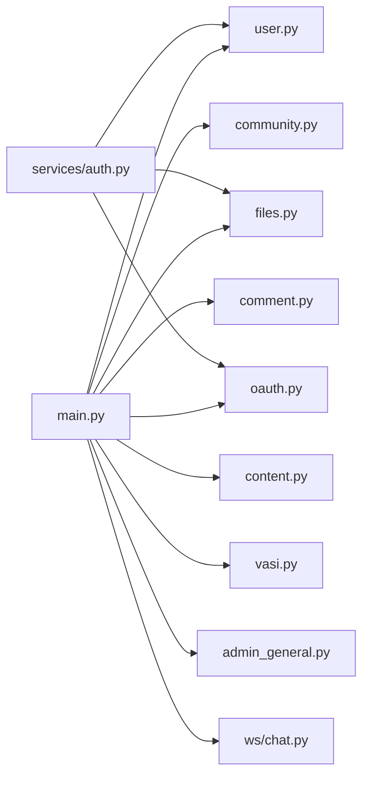

# API接口文档

<cite>
**本文引用的文件**   
- [web/backend/app/main.py](file://web/backend/app/main.py)
- [web/backend/api/user.py](file://web/backend/api/user.py)
- [web/backend/api/content.py](file://web/backend/api/content.py)
- [web/backend/api/comment.py](file://web/backend/api/comment.py)
- [web/backend/api/community.py](file://web/backend/api/community.py)
- [web/backend/api/files.py](file://web/backend/api/files.py)
- [web/backend/api/admin_general.py](file://web/backend/api/admin_general.py)
- [web/backend/api/vasi.py](file://web/backend/api/vasi.py)
- [web/backend/ws/chat.py](file://web/backend/ws/chat.py)
- [web/backend/services/auth.py](file://web/backend/services/auth.py)
- [web/backend/api/oauth.py](file://web/backend/api/oauth.py)
</cite>

## 目录
1. [简介](#简介)
2. [项目结构](#项目结构)
3. [核心组件](#核心组件)
4. [架构总览](#架构总览)
5. [详细组件分析](#详细组件分析)
6. [依赖关系分析](#依赖关系分析)
7. [性能考虑](#性能考虑)
8. [故障排查指南](#故障排查指南)
9. [结论](#结论)
10. [附录：API版本与兼容性、客户端集成指南](#附录api版本与兼容性客户端集成指南)

## 简介
本文件为 Subskin 项目的完整后端 API 接口文档，覆盖 RESTful 端点、WebSocket 实时通信、文件上传下载与管理后台专用接口。文档包含请求方法、URL 模式、认证方式、请求/响应 Schema、错误码与状态码定义，并提供版本管理策略、向后兼容保证与客户端集成指南。

## 项目结构
后端基于 FastAPI，采用模块化路由组织（按业务域拆分），统一在应用入口注册路由前缀与标签。关键入口与路由注册见主应用文件；各模块 API 分别位于 web/backend/api 下；WebSocket 端点在 ws/chat.py；认证与令牌服务在 services/auth.py。

**图表来源** 
- [web/backend/app/main.py:264-319](file://web/backend/app/main.py#L264-L319)
- [web/backend/api/user.py:80-82](file://web/backend/api/user.py#L80-L82)
- [web/backend/api/community.py:62](file://web/backend/api/community.py#L62)
- [web/backend/api/comment.py:16](file://web/backend/api/comment.py#L16)
- [web/backend/api/content.py:17](file://web/backend/api/content.py#L17)
- [web/backend/api/files.py:33](file://web/backend/api/files.py#L33)
- [web/backend/api/vasi.py:26](file://web/backend/api/vasi.py#L26)
- [web/backend/api/oauth.py:22](file://web/backend/api/oauth.py#L22)
- [web/backend/ws/chat.py:45](file://web/backend/ws/chat.py#L45)
- [web/backend/services/auth.py:32](file://web/backend/services/auth.py#L32)

**章节来源**
- [web/backend/app/main.py:264-319](file://web/backend/app/main.py#L264-L319)

## 核心组件
- 认证与授权
  - JWT Access Token、Refresh Token、短效文件访问 Token
  - 支持用户名/手机号/邮箱密码登录、短信验证码登录、邮箱验证码登录、微信/支付宝 OAuth 扫码登录
- 用户与账户
  - 注册、登录、个人信息更新、头像上传、绑定/解绑手机/邮箱、设置/重置密码、凭据列表
- 社区与内容
  - 帖子 CRUD、分类/标签、点赞、评论、收藏、合集、图片/音频/文件上传、同城定位、推荐流
- 评论系统
  - 页面级评论获取与提交（需审核）
- 文件服务
  - 短效文件访问 Token、受控文件读取、PDF 分页预览、HTML 内嵌查看器、IM 图片上传、临时文件清理
- VASI 评估
  - 图像上传评估、历史/趋势、轮廓修正、质量检查、草稿确认/放弃、批量删除
- 管理后台
  - 内容生成、系统资源与服务控制、日志拉取、批量向量化
- WebSocket 实时通信
  - 心跳、已读回执、未读数推送

**章节来源**
- [web/backend/services/auth.py:32-74](file://web/backend/services/auth.py#L32-L74)
- [web/backend/api/user.py:217-800](file://web/backend/api/user.py#L217-L800)
- [web/backend/api/community.py:219-758](file://web/backend/api/community.py#L219-L758)
- [web/backend/api/comment.py:19-33](file://web/backend/api/comment.py#L19-L33)
- [web/backend/api/files.py:37-503](file://web/backend/api/files.py#L37-L503)
- [web/backend/api/vasi.py:45-738](file://web/backend/api/vasi.py#L45-L738)
- [web/backend/api/admin_general.py:25-228](file://web/backend/api/admin_general.py#L25-L228)
- [web/backend/ws/chat.py:14-111](file://web/backend/ws/chat.py#L14-L111)

## 架构总览
应用启动时创建数据库表并初始化监控与 LLM 配置，注册所有路由与中间件（CORS、限流等）。健康检查与 WebSocket 端点也在入口中声明。

**图表来源** 
- [web/backend/app/main.py:228-269](file://web/backend/app/main.py#L228-L269)
- [web/backend/app/main.py:280-319](file://web/backend/app/main.py#L280-L319)
- [web/backend/app/main.py:345-349](file://web/backend/app/main.py#L345-L349)
- [web/backend/services/auth.py:153-176](file://web/backend/services/auth.py#L153-L176)

**章节来源**
- [web/backend/app/main.py:228-319](file://web/backend/app/main.py#L228-L319)

## 详细组件分析

### 认证与账户（/api/user）
- 认证方式
  - 表单密码登录：POST /api/user/login
  - 短信验证码登录：POST /api/user/login-by-phone
  - 邮箱验证码登录：POST /api/user/login-by-email
  - 手机号+密码登录：POST /api/user/login-by-phone-password
  - 邮箱+密码登录：POST /api/user/login-by-email-password
  - 刷新令牌：通过 Refresh Token 换取新 Access Token（由服务层提供）
- 常用端点
  - GET /api/user/me 或 /api/users/me：当前用户信息
  - PUT /api/user/me 或 /api/users/me：更新个人信息（禁止直接改 phone/email）
  - POST /api/user/me/avatar：上传头像（限制类型与大小）
  - POST /api/user/register：用户名+邮箱注册
  - POST /api/user/send-sms：发送短信验证码（含 IP 维度限速）
  - POST /api/user/send-email-code：发送邮件验证码
  - POST /api/user/register-by-phone：手机号验证码注册
  - POST /api/user/register-by-email：邮箱验证码注册
  - POST /api/user/bind-phone：绑定手机号（需验证码）
  - POST /api/user/bind-email：绑定邮箱（需验证码）
  - DELETE /api/user/credentials/{credential_id}：解绑凭据
  - GET /api/user/credentials：列出凭据
  - POST /api/user/set-password：设置密码
  - POST /api/user/reset-password：重置密码（会撤销该用户所有刷新令牌）
- 响应示例（登录）
  - access_token: string
  - refresh_token: string
  - token_type: "bearer"
  - user: object（包含用户基本信息）
- 错误码
  - 400：参数无效/重复注册/验证码错误
  - 401：用户名或密码错误/验证码错误或过期
  - 403：账号被禁用
  - 429：操作过于频繁（IP 维度验证码限速）
  - 500：短信/邮件发送失败

**章节来源**
- [web/backend/api/user.py:217-800](file://web/backend/api/user.py#L217-L800)
- [web/backend/services/auth.py:32-74](file://web/backend/services/auth.py#L32-L74)

### 社区内容（/api/community）
- 帖子
  - POST /api/community/posts：创建帖子（支持标题、正文、分类、标签、私密、日记字段、视频、城市、治疗分享等）
  - GET /api/community/posts：列表（支持分类、标签、类型、feed 类型、城市、私有可见性、游标分页）
  - GET /api/community/posts/{post_id}：详情
  - PUT /api/community/posts/{post_id}：更新
  - DELETE /api/community/posts/{post_id}：删除
  - POST /api/community/posts/{post_id}/like：点赞/取消点赞
  - POST /api/community/posts/{post_id}/comments：发表评论（需审核）
  - GET /api/community/posts/{post_id}/comments：评论列表
  - POST /api/community/posts/{post_id}/interact：交互埋点
  - PUT /api/community/posts/{post_id}/tags：更新标签
- 分类与标签
  - GET /api/community/categories：分类列表
  - GET /api/community/tags：标签列表（支持模糊搜索）
  - GET /api/community/tags/hot：热门标签
- 文件上传
  - POST /api/community/upload：上传图片
  - POST /api/community/upload/audio：上传音频
  - POST /api/community/upload/file：上传通用文件
- 其他
  - GET /api/community/user-location：基于 IP 的城市定位（缓存）
  - POST /api/community/check-claims：检测夸大宣传词
  - GET /api/community/my-diaries：我的私密日记（游标分页）
  - GET /api/community/diary-calendar：某月日历条目

**章节来源**
- [web/backend/api/community.py:114-758](file://web/backend/api/community.py#L114-L758)

### 评论系统（/api/comment）
- GET /api/comment/{page_path}：获取页面已批准评论列表
- POST /api/comment/：添加评论（需登录，进入审核流程）

**章节来源**
- [web/backend/api/comment.py:19-33](file://web/backend/api/comment.py#L19-L33)

### 内容简报与时间线（/api/content）
- GET /api/content/latest：最新文档列表（按更新时间倒序）
- GET /api/content/daily-briefing：最新每日研究简报摘要
- GET /api/content/timeline：研究进展时间线（按月聚合）

**章节来源**
- [web/backend/api/content.py:22-161](file://web/backend/api/content.py#L22-L161)

### 文件服务（/api/files）
- 短效文件访问 Token
  - GET /api/files/access-token：返回短期文件读取 Token（默认 5 分钟）
- 文件读取
  - GET /api/files/serve/{file_path}：受控文件读取（支持 PDF 强制下载、图片直链）
  - GET /api/files/pages/{file_id}/{page_name}：PDF 分页图片预览
  - GET /api/files/view/{file_id}：HTML 内嵌查看器（自动适配图片/PDF/不支持格式）
- IM 图片上传
  - POST /api/files/upload/im-image：上传 IM 图片（返回 URL、文件名、大小）
- 临时文件清理
  - DELETE /api/files/cleanup-temp：清理临时上传（管理员可用）

权限与安全要点
- 文件路径白名单与归属校验（avatar、community、reports、files、im、temp、vasi 等 bucket）
- 支持两种鉴权：短效文件 Token（优先）或通用 Access Token（兼容旧客户端）
- PDF 以附件形式下载，避免部分 WebView 渲染问题

**章节来源**
- [web/backend/api/files.py:37-503](file://web/backend/api/files.py#L37-L503)
- [web/backend/services/auth.py:59-94](file://web/backend/services/auth.py#L59-L94)

### VASI 评估（/api/vasi）
- 评估
  - POST /api/vasi/assess：上传白斑照片进行评分（支持 quick/precise）
  - POST /api/vasi/assess/{assessment_id}/finalize：确认草稿
  - POST /api/vasi/assess/{assessment_id}/abandon：放弃草稿
  - GET /api/vasi/assess/{assessment_id}：详情
  - POST /api/vasi/assess/{assessment_id}/contour：提交用户修正轮廓（支持双图层 mask 计算）
  - DELETE /api/vasi/assess/{assessment_id}：删除单条评估
  - DELETE /api/vasi/assess/batch：批量删除
- 历史与趋势
  - GET /api/vasi/history：历史列表（支持部位、日期范围、分页）
  - GET /api/vasi/trend：趋势数据（用于曲线图）
- 辅助能力
  - POST /api/vasi/check-photo-quality：照片质量检查
  - POST /api/vasi/promptable/prepare：准备图片（分割预处理）
  - POST /api/vasi/promptable/click：点击提示预测
  - POST /api/vasi/promptable/refine-circle：圆形提示精修

错误处理
- 400：参数错误/评估错误
- 403：无权限/无效 cache_key
- 404：记录不存在
- 410：图片缓存失效
- 503：自进化模块不可用

**章节来源**
- [web/backend/api/vasi.py:45-738](file://web/backend/api/vasi.py#L45-L738)

### 管理后台（/api/admin）
- 内容生成
  - GET /api/admin/content/briefings：简报列表
  - POST /api/admin/content/generate-briefing：触发简报生成
- 系统监控
  - GET /api/admin/system/resources：CPU/内存/磁盘/数据库大小
  - GET /api/admin/system/services：服务状态
  - POST /api/admin/system/services/{service_name}/action：start/restart（安全限制）
  - GET /api/admin/system/logs：拉取日志（systemctl/journal 或文件）
- RAG
  - POST /api/admin/embed-batch：手动触发增量向量化

**章节来源**
- [web/backend/api/admin_general.py:25-228](file://web/backend/api/admin_general.py#L25-L228)

### 第三方登录（/api/oauth）
- 微信
  - GET /api/oauth/wechat/auth-url：获取授权链接
  - POST /api/oauth/wechat/callback：回调登录
  - GET /api/oauth/wechat/status：轮询状态
- 支付宝
  - GET /api/oauth/alipay/auth-url：获取授权链接
  - POST /api/oauth/alipay/callback：回调登录
  - GET /api/oauth/alipay/status：轮询状态

**章节来源**
- [web/backend/api/oauth.py:39-169](file://web/backend/api/oauth.py#L39-L169)

### WebSocket 实时通信（/ws/chat）
- 连接
  - WS /ws/chat?token=...：使用 Access Token 建立连接
- 消息协议
  - ping/pong：心跳保活
  - read：标记消息已读（服务端写入已读记录）
  - unread_update：未读数推送（服务端主动）
- 鉴权
  - 未通过验证将关闭连接（code 4001）

**图表来源** 
- [web/backend/ws/chat.py:45-111](file://web/backend/ws/chat.py#L45-L111)

**章节来源**
- [web/backend/ws/chat.py:14-111](file://web/backend/ws/chat.py#L14-L111)

## 依赖关系分析
- 路由注册与依赖注入
  - 主应用集中 include_router，按前缀划分模块
  - 依赖 get_db、auth、get_current_user_optional 等
- 认证依赖
  - 多数写操作需要 auth 依赖（JWT Access Token）
  - 文件服务支持短效文件 Token 或兼容 Access Token
- 外部服务
  - 短信/邮件发送（可配置 provider）
  - ip-api.com 定位（线程池调用，避免阻塞事件循环）
  - 系统服务控制（systemctl）、日志采集（journalctl/tail）

**图表来源** 
- [web/backend/app/main.py:280-319](file://web/backend/app/main.py#L280-L319)
- [web/backend/services/auth.py:32-74](file://web/backend/services/auth.py#L32-L74)

**章节来源**
- [web/backend/app/main.py:280-319](file://web/backend/app/main.py#L280-L319)

## 性能考虑
- 读写限流
  - 写操作对用户维度限流（如发帖、评论、点赞）
  - 验证码发送按 IP 维度限速（默认每小时上限）
- 数据库优化
  - 批量转换模型避免 N+1 查询（社区帖子列表）
  - 游标分页提升大数据集加载性能
- 异步与线程池
  - 同步 HTTP 调用（ip-api.com）放入线程池，避免阻塞事件循环
- 文件服务
  - 短效文件 Token 降低泄露风险
  - PDF 分页预览减少大文件传输压力

[本节为通用指导，不直接分析具体文件]

## 故障排查指南
- 常见错误码
  - 400：参数校验失败、验证码错误、重复注册
  - 401：未认证/凭证无效/账号未激活
  - 403：权限不足/账号被封禁或禁言
  - 404：资源不存在
  - 413：文件过大
  - 429：频率限制
  - 500：服务器内部错误（短信/邮件/服务异常）
  - 503：服务不可用（自进化模块/第三方服务）
- 调试建议
  - 使用 /api/health 检查服务状态
  - 管理后台 /api/admin/system/logs 拉取日志
  - 关注 CORS 配置与 ALLOWED_ORIGINS
  - 文件访问失败时检查短效 Token 是否有效且未被复用

**章节来源**
- [web/backend/app/main.py:345-349](file://web/backend/app/main.py#L345-L349)
- [web/backend/api/admin_general.py:192-217](file://web/backend/api/admin_general.py#L192-L217)

## 结论
Subskin 后端以 FastAPI 为核心，按业务域拆分路由，提供完善的认证体系、社区内容、文件服务、VASI 评估、管理后台与 WebSocket 实时通信。通过短效文件 Token、读写限流、游标分页与线程池优化，兼顾安全性与性能。建议客户端严格遵循鉴权流程、合理处理错误码与重试策略，并在生产环境启用监控与审计。

[本节为总结性内容，不直接分析具体文件]

## 附录：API版本与兼容性、客户端集成指南
- 版本管理策略
  - 应用版本：1.0.0（定义于应用元数据）
  - 路由前缀：/api/*，未来可通过 /api/v1/* 引入新版本
  - 向后兼容：文件服务兼容旧版 Access Token；新增字段保持可选
- 认证集成
  - 登录成功后保存 access_token 与 refresh_token
  - 后续请求在 Authorization: Bearer <access_token>
  - 文件访问建议使用 /api/files/access-token 获取短效 Token
- 请求/响应规范
  - 统一 JSON 响应体，错误响应包含 detail 字段
  - 时间字段使用 ISO 8601 UTC
- 错误处理
  - 客户端根据状态码分支处理（401 跳转登录、403 提示权限、429 冷却等待）
- 安全建议
  - 不要将 access_token 暴露到前端日志或 Referer
  - 定期轮换 refresh_token，必要时调用重置密码撤销全部会话

**章节来源**
- [web/backend/app/main.py:264-269](file://web/backend/app/main.py#L264-L269)
- [web/backend/services/auth.py:43-74](file://web/backend/services/auth.py#L43-L74)
- [web/backend/api/files.py:37-49](file://web/backend/api/files.py#L37-L49)