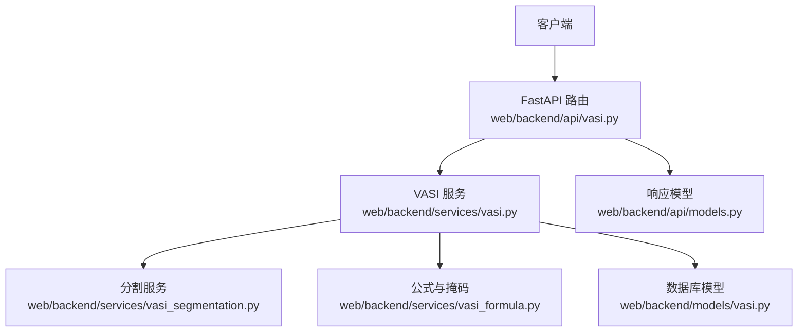
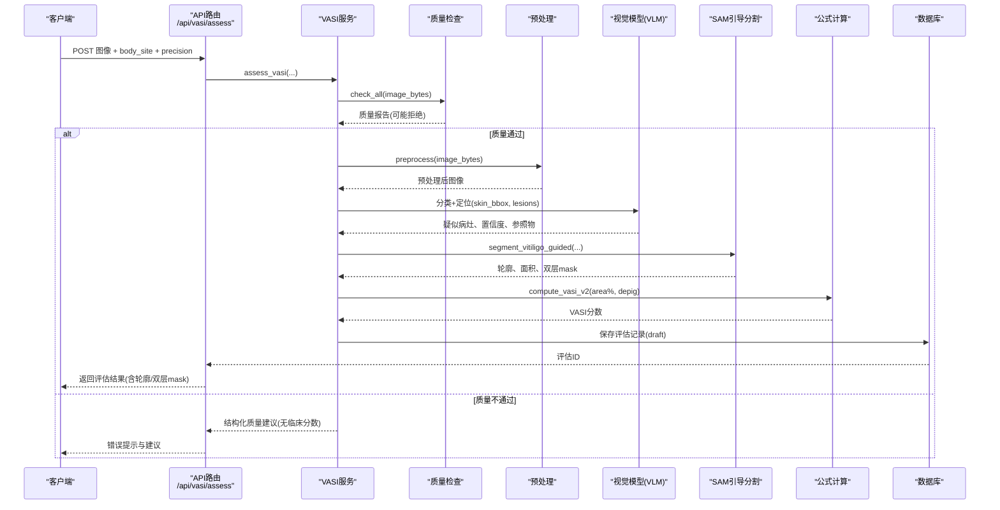
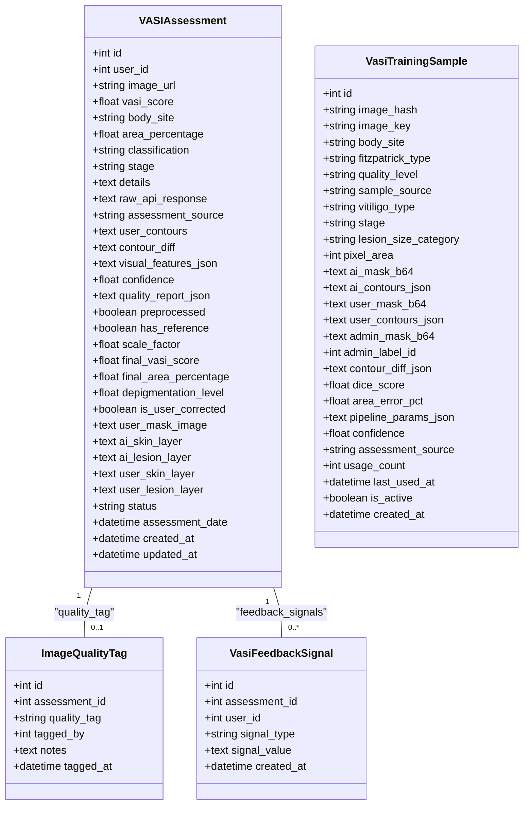

# VASI评估API

<cite>
**本文引用的文件**
- [web/backend/api/vasi.py](file://web/backend/api/vasi.py)
- [web/backend/services/vasi.py](file://web/backend/services/vasi.py)
- [web/backend/models/vasi.py](file://web/backend/models/vasi.py)
- [web/backend/api/models.py](file://web/backend/api/models.py)
- [web/backend/services/vasi_segmentation.py](file://web/backend/services/vasi_segmentation.py)
- [web/backend/services/vasi_formula.py](file://web/backend/services/vasi_formula.py)
- [tests/backend/api/test_vasi.py](file://tests/backend/api/test_vasi.py)
</cite>

## 目录
1. [简介](#简介)
2. [项目结构](#项目结构)
3. [核心组件](#核心组件)
4. [架构总览](#架构总览)
5. [详细组件分析](#详细组件分析)
6. [依赖关系分析](#依赖关系分析)
7. [性能考虑](#性能考虑)
8. [故障排查指南](#故障排查指南)
9. [结论](#结论)
10. [附录：完整调用流程示例](#附录完整调用流程示例)

## 简介
本文件为 VASI（白癜风面积严重程度指数）白斑评估系统的后端 API 文档，覆盖图像上传、AI分割处理、3D模型渲染数据准备、评估结果计算、历史记录与趋势查询、批量删除、图片质量检查等接口。文档同时说明图像格式要求、分割算法参数、评估指标计算方法，并提供从上传到报告生成的端到端调用示例。

## 项目结构
VASI 相关代码主要位于 web/backend 下：
- API 路由层：web/backend/api/vasi.py
- 业务服务层：web/backend/services/vasi.py
- 数据模型：web/backend/models/vasi.py
- API 响应模型：web/backend/api/models.py
- 分割服务：web/backend/services/vasi_segmentation.py
- 公式与掩码计算：web/backend/services/vasi_formula.py
- 测试用例：tests/backend/api/test_vasi.py

图表来源
- [web/backend/api/vasi.py:45-164](file://web/backend/api/vasi.py#L45-L164)
- [web/backend/services/vasi.py:159-243](file://web/backend/services/vasi.py#L159-L243)
- [web/backend/services/vasi_segmentation.py:278-432](file://web/backend/services/vasi_segmentation.py#L278-L432)
- [web/backend/services/vasi_formula.py:71-101](file://web/backend/services/vasi_formula.py#L71-L101)
- [web/backend/models/vasi.py:26-104](file://web/backend/models/vasi.py#L26-L104)
- [web/backend/api/models.py:9-44](file://web/backend/api/models.py#L9-L44)

章节来源
- [web/backend/api/vasi.py:1-800](file://web/backend/api/vasi.py#L1-L800)
- [web/backend/services/vasi.py:1-800](file://web/backend/services/vasi.py#L1-L800)
- [web/backend/models/vasi.py:1-328](file://web/backend/models/vasi.py#L1-L328)
- [web/backend/api/models.py:1-94](file://web/backend/api/models.py#L1-L94)

## 核心组件
- 路由层（API）：提供 /assess、/history、/trend、/check-photo-quality、轮廓修正、批量删除等接口。
- 服务层（Service）：封装评估流程、输入校验、图片存储、AI调用编排、历史与趋势查询、删除逻辑。
- 分割服务：基于 SAM 的自动/引导式分割，结合皮肤区域检测与相对亮度阈值，支持快速与精确两种模式。
- 公式与掩码：按部位体表面积权重计算 VASI v2，支持双层掩码（皮肤层+白斑层）面积计算。
- 数据模型：评估记录、质量标签、反馈信号、训练样本、模型版本等。

章节来源
- [web/backend/api/vasi.py:45-738](file://web/backend/api/vasi.py#L45-L738)
- [web/backend/services/vasi.py:159-800](file://web/backend/services/vasi.py#L159-L800)
- [web/backend/services/vasi_segmentation.py:278-800](file://web/backend/services/vasi_segmentation.py#L278-L800)
- [web/backend/services/vasi_formula.py:71-195](file://web/backend/services/vasi_formula.py#L71-L195)
- [web/backend/models/vasi.py:26-104](file://web/backend/models/vasi.py#L26-L104)

## 架构总览
下图展示一次完整的评估请求从前端到后端再到 AI 服务的调用序列。

图表来源
- [web/backend/api/vasi.py:45-164](file://web/backend/api/vasi.py#L45-L164)
- [web/backend/services/vasi.py:159-243](file://web/backend/services/vasi.py#L159-L243)
- [web/backend/services/vasi.py:602-800](file://web/backend/services/vasi.py#L602-L800)
- [web/backend/services/vasi_segmentation.py:690-800](file://web/backend/services/vasi_segmentation.py#L690-L800)
- [web/backend/services/vasi_formula.py:71-101](file://web/backend/services/vasi_formula.py#L71-L101)

## 详细组件分析

### 接口定义与行为
- 创建评估 POST /api/vasi/assess
  - 表单字段：image(file)、body_site(string)、precision("quick"/"precise")、has_reference("true"/"false")
  - 功能：上传图片→质量检查→预处理→VLM定位→SAM引导分割→计算VASI→保存草稿→返回结果（含轮廓、双层mask、疑似病灶、置信度等）
  - 认证：需要当前用户
  - 错误：图片过大/格式不支持/magic byte校验失败/无效部位 → 400；其他异常 → 500
- 确认/放弃草稿
  - POST /api/vasi/assess/{id}/finalize → 状态 draft→active
  - POST /api/vasi/assess/{id}/abandon → 状态 abandoned
- 获取历史 GET /api/vasi/history
  - 支持分页 limit/offset、部位筛选、日期范围
  - 仅返回 active 状态的评估
- 获取详情 GET /api/vasi/assess/{id}
  - 返回单条评估详情（含用户修正后的轮廓/双层mask）
- 趋势查询 GET /api/vasi/trend
  - 返回 days 天内评分变化趋势（仅 active）
- 图片质量检查 POST /api/vasi/check-photo-quality
  - 限制最大图片大小（20MB），返回模糊度、皮肤占比、亮度、分辨率等指标与建议
- 轮廓修正 POST /api/vasi/assess/{id}/contour
  - 提交用户修正的双层mask或单层mask，重新计算面积与VASI v2，记录差异与反馈信号
- 批量删除 DELETE /api/vasi/assess/batch
  - 批量删除指定评估记录（仅当前用户拥有的记录）
- 删除单条 DELETE /api/vasi/assess/{id}
  - 删除单条评估记录并标记关联的图像标注

章节来源
- [web/backend/api/vasi.py:45-738](file://web/backend/api/vasi.py#L45-L738)
- [web/backend/services/vasi.py:246-441](file://web/backend/services/vasi.py#L246-L441)
- [tests/backend/api/test_vasi.py:13-200](file://tests/backend/api/test_vasi.py#L13-L200)

### 图像文件格式与安全
- 支持的 MIME 类型：image/jpeg、image/png、image/jpg
- 安全校验：magic byte 验证，拒绝伪装类型的文件
- 大小限制：
  - 评估接口：最大 10MB
  - 质量检查接口：最大 20MB
- 上传路径：data/uploads/vasi，URL 以 /api/files/serve/vasi/{filename} 形式访问

章节来源
- [web/backend/services/vasi.py:120-124](file://web/backend/services/vasi.py#L120-L124)
- [web/backend/services/vasi.py:539-572](file://web/backend/services/vasi.py#L539-L572)
- [web/backend/services/vasi.py:573-600](file://web/backend/services/vasi.py#L573-L600)
- [web/backend/api/vasi.py:511-541](file://web/backend/api/vasi.py#L511-L541)

### 分割算法与参数
- 双精度模式：
  - quick：points_per_side=16，pred_iou_thresh=0.80，min_mask_region_area=200，~10s CPU
  - precise：points_per_side=32，pred_iou_thresh=0.88，stability_score_thresh=0.92，min_mask_region_area=100，~70s CPU
- 两阶段策略：先构建皮肤前景 mask，再在皮肤区域内用相对亮度阈值检测白斑；SAM 输出需与皮肤区域重叠≥阈值才采纳
- 引导式分割：使用 VLM 提供的 skin_bbox、lesion_centers、lesion_bboxes、edge_points 作为 prompt 提升准确性
- 回退机制：SAM不可用时回退至颜色空间方法；nnU-Net远程服务可用时作为额外回退

章节来源
- [web/backend/services/vasi_segmentation.py:33-121](file://web/backend/services/vasi_segmentation.py#L33-L121)
- [web/backend/services/vasi_segmentation.py:278-432](file://web/backend/services/vasi_segmentation.py#L278-L432)
- [web/backend/services/vasi_segmentation.py:690-800](file://web/backend/services/vasi_segmentation.py#L690-L800)
- [web/backend/services/vasi_segmentation.py:571-653](file://web/backend/services/vasi_segmentation.py#L571-L653)

### 评估指标与计算公式
- 部位体表面积权重：按 anatomical region 的 BSA_PERCENT 映射（中英文均支持）
- VASI v2 公式：hand_units = (area_pct_in_region / 100) * BSA；VASI = hand_units * depigmentation_level * 10，结果钳制在 [0,100]
- 双层掩码面积：area% = lesion_pixels / (skin ∪ lesion)_pixels；支持用户修正后重算 final_vasi_score 与 final_area_percentage
- 单层掩码面积：mask 中不透明像素占总像素的比例（用于兼容旧流程）

章节来源
- [web/backend/services/vasi_formula.py:19-68](file://web/backend/services/vasi_formula.py#L19-L68)
- [web/backend/services/vasi_formula.py:71-101](file://web/backend/services/vasi_formula.py#L71-L101)
- [web/backend/services/vasi_formula.py:117-165](file://web/backend/services/vasi_formula.py#L117-L165)
- [web/backend/services/vasi_formula.py:168-195](file://web/backend/services/vasi_formula.py#L168-L195)

### 3D模型渲染数据
- 双层 mask 数据 URL：
  - skin_layer_data_url：AI预填的皮肤层 PNG data URL
  - lesion_layer_data_url：AI预填的白斑层 PNG data URL
- 这些 data URL 可直接用于前端 3D 可视化叠加显示（如数字人/身体部位面板）

章节来源
- [web/backend/api/models.py:33-35](file://web/backend/api/models.py#L33-L35)
- [web/backend/api/vasi.py:81-158](file://web/backend/api/vasi.py#L81-L158)
- [web/backend/services/vasi_segmentation.py:387-432](file://web/backend/services/vasi_segmentation.py#L387-L432)

### 历史记录管理与数据导出
- 历史记录：GET /api/vasi/history 支持分页、部位筛选、日期范围；仅返回 active 评估
- 趋势数据：GET /api/vasi/trend 返回 days 内评分变化与总结（好转/稳定/恶化）
- 批量删除：DELETE /api/vasi/assess/batch 支持批量删除当前用户的评估记录
- 数据导出：系统未暴露专用导出接口；可通过历史/趋势接口拉取数据并在前端导出（CSV/JSON）

章节来源
- [web/backend/api/vasi.py:204-256](file://web/backend/api/vasi.py#L204-L256)
- [web/backend/api/vasi.py:448-472](file://web/backend/api/vasi.py#L448-L472)
- [web/backend/api/vasi.py:487-495](file://web/backend/api/vasi.py#L487-L495)
- [web/backend/services/vasi.py:282-334](file://web/backend/services/vasi.py#L282-L334)
- [web/backend/services/vasi.py:443-537](file://web/backend/services/vasi.py#L443-L537)

### 错误处理机制
- 输入校验错误：图片过大/格式不支持/magic byte校验失败/无效部位 → 400
- 资源不存在：评估记录不存在 → 404
- 服务不可用：自进化模块禁用 → 503
- 通用异常：捕获并返回 500
- 质量拒绝：当整体质量为 poor 时，直接返回结构化质量建议，不持久化临床分数

章节来源
- [web/backend/api/vasi.py:160-164](file://web/backend/api/vasi.py#L160-L164)
- [web/backend/api/vasi.py:269-270](file://web/backend/api/vasi.py#L269-L270)
- [web/backend/api/vasi.py:30-42](file://web/backend/api/vasi.py#L30-L42)
- [web/backend/services/vasi.py:614-629](file://web/backend/services/vasi.py#L614-L629)

### 性能优化策略
- 两级精度：quick 与 precise 模式平衡速度与精度
- 延迟加载与缓存：SAM 模型与生成器全局缓存，避免重复加载
- 异步任务：to_thread 将耗时操作放入线程池执行，避免阻塞事件循环
- 质量前置检查：提前拒绝低质量图片，节省AI成本
- 内存保护：质量检查接口限制最大图片大小
- 回退机制：SAM不可用时回退至颜色空间方法；nnU-Net远程服务作为额外回退

章节来源
- [web/backend/services/vasi_segmentation.py:33-121](file://web/backend/services/vasi_segmentation.py#L33-L121)
- [web/backend/services/vasi.py:614-629](file://web/backend/services/vasi.py#L614-L629)
- [web/backend/api/vasi.py:511-541](file://web/backend/api/vasi.py#L511-L541)
- [web/backend/services/vasi_segmentation.py:571-653](file://web/backend/services/vasi_segmentation.py#L571-L653)

## 依赖关系分析

图表来源
- [web/backend/models/vasi.py:26-104](file://web/backend/models/vasi.py#L26-L104)
- [web/backend/models/vasi.py:107-125](file://web/backend/models/vasi.py#L107-L125)
- [web/backend/models/vasi.py:179-204](file://web/backend/models/vasi.py#L179-L204)
- [web/backend/models/vasi.py:206-250](file://web/backend/models/vasi.py#L206-L250)

章节来源
- [web/backend/models/vasi.py:26-328](file://web/backend/models/vasi.py#L26-L328)

## 性能考虑
- 快速模式适用于移动端或实时交互场景；精确模式适合离线或高精度需求
- 质量检查前置可减少无效AI调用，降低延迟与成本
- 双层mask设计使面积计算更贴近临床意义，减少误判
- 回退机制确保在模型不可用时仍能提供基础能力

[本节为通用指导，不直接分析具体文件]

## 故障排查指南
- 图片质量差：根据质量检查返回的建议调整拍摄条件（清晰度、光照、皮肤占比）
- 分割失败：检查是否检测到足够皮肤区域；尝试精确模式或重新上传
- 评估结果为空：确认 body_site 是否为受支持值；检查 VLM 定位是否成功
- 权限问题：确保已登录且拥有对应评估记录的访问权限
- 服务不可用：若自进化模块禁用，相关管理接口会返回 503

章节来源
- [web/backend/api/vasi.py:511-541](file://web/backend/api/vasi.py#L511-L541)
- [web/backend/services/vasi_segmentation.py:331-336](file://web/backend/services/vasi_segmentation.py#L331-L336)
- [web/backend/services/vasi.py:614-629](file://web/backend/services/vasi.py#L614-L629)
- [web/backend/api/vasi.py:30-42](file://web/backend/api/vasi.py#L30-L42)

## 结论
本系统提供了完整的 VASI 白斑评估 API，涵盖从图像上传、AI分割、3D渲染数据准备到评估结果计算的全流程。通过质量检查、双层mask、部位权重公式与多精度模式，系统在准确性与性能之间取得良好平衡。历史记录、趋势查询与批量删除满足日常使用需求。错误处理与回退机制保障了服务的稳定性。

[本节为总结性内容，不直接分析具体文件]

## 附录：完整调用流程示例
以下示例演示从图像上传到报告生成的全过程（不含具体代码片段，仅提供调用步骤与字段说明）。

1. 上传图片并创建评估
   - 方法：POST /api/vasi/assess
   - 表单字段：
     - image: 二进制图片（JPG/PNG/JPEG，≤10MB）
     - body_site: 部位（如“面部”、“颈部”、“手部”等）
     - precision: "quick" 或 "precise"
     - has_reference: "true" 或 "false"（可选）
   - 成功响应包含：评估ID、VASI分数、面积百分比、分型、阶段、轮廓、双层mask data URL、置信度、疑似病灶、视觉特征等

2. 查看图片质量（可选）
   - 方法：POST /api/vasi/check-photo-quality
   - 返回：整体质量、模糊度、皮肤占比、亮度、分辨率、建议

3. 确认或放弃草稿
   - 确认：POST /api/vasi/assess/{id}/finalize
   - 放弃：POST /api/vasi/assess/{id}/abandon

4. 查看历史与趋势
   - 历史：GET /api/vasi/history?limit=10&offset=0&body_site=面部&start_date=YYYY-MM-DD&end_date=YYYY-MM-DD
   - 趋势：GET /api/vasi/trend?days=30&body_site=面部

5. 用户修正轮廓（可选）
   - 方法：POST /api/vasi/assess/{id}/contour
   - 请求体：
     - contours: 用户修正的轮廓数组
     - skin_mask_image: 皮肤层 PNG data URL（可选）
     - lesion_mask_image: 白斑层 PNG data URL（可选）
     - mask_image: 单层 mask PNG data URL（兼容旧流程，可选）
     - depigmentation_level: 去色素度 0-1（可选）
   - 返回：最终面积百分比、最终 VASI 分数、差异摘要

6. 删除记录
   - 单条：DELETE /api/vasi/assess/{id}
   - 批量：DELETE /api/vasi/assess/batch {"ids":[...]}

章节来源
- [web/backend/api/vasi.py:45-738](file://web/backend/api/vasi.py#L45-L738)
- [web/backend/api/models.py:9-44](file://web/backend/api/models.py#L9-L44)
- [tests/backend/api/test_vasi.py:13-200](file://tests/backend/api/test_vasi.py#L13-L200)