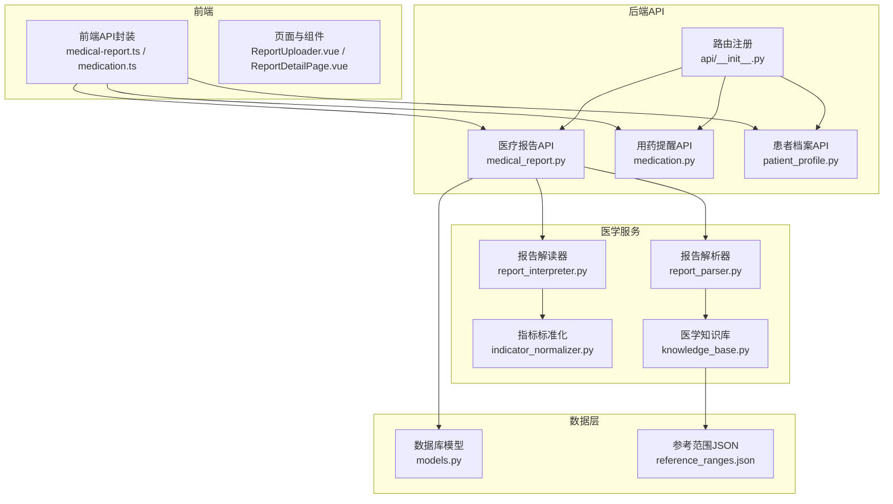
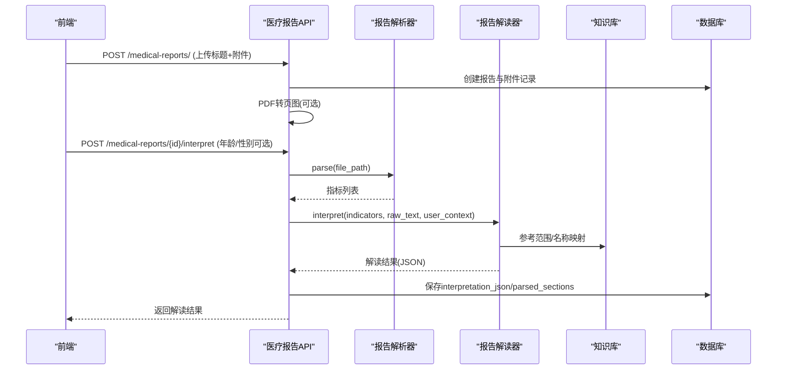
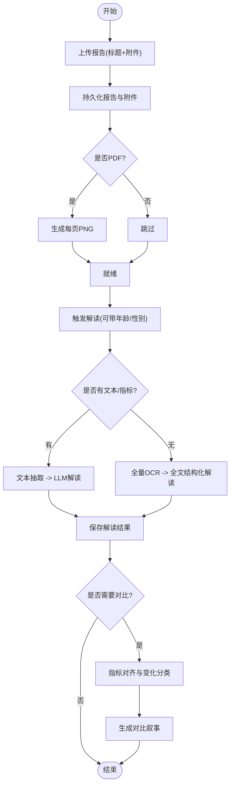
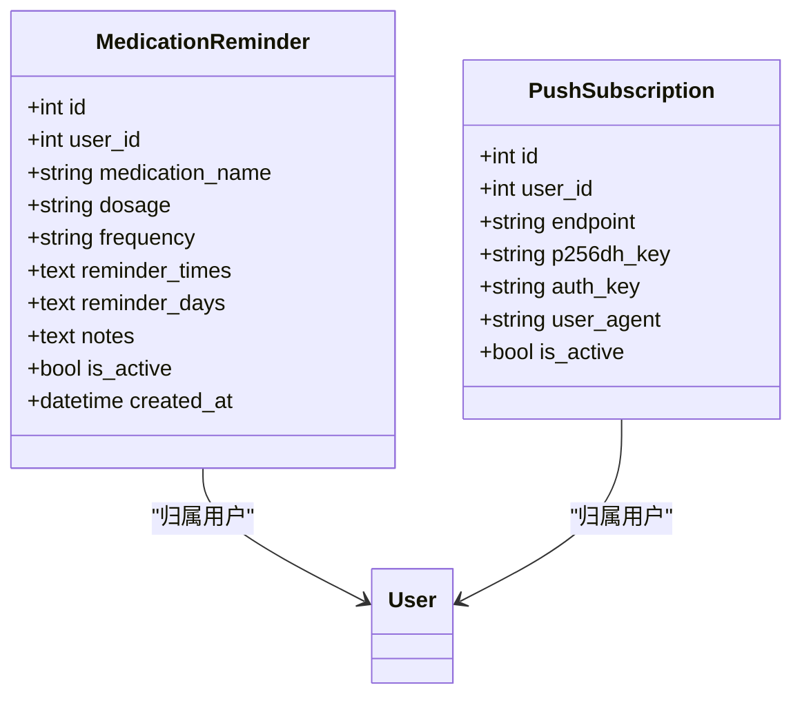
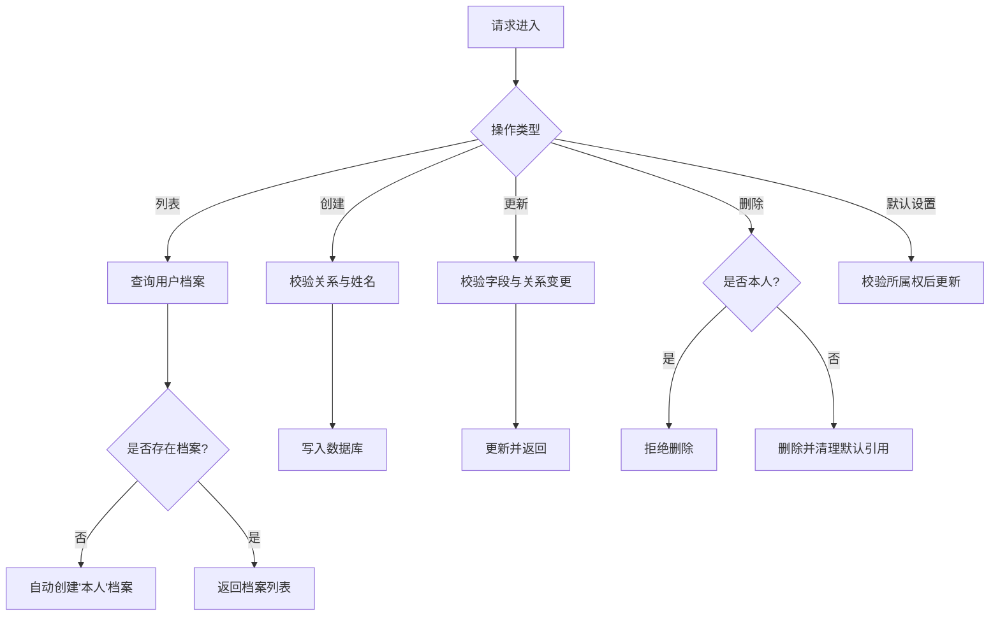
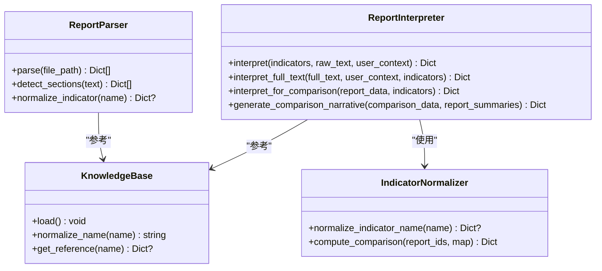
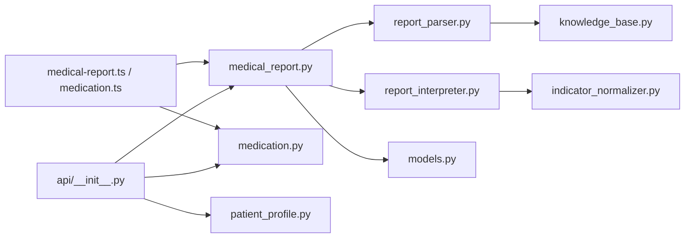
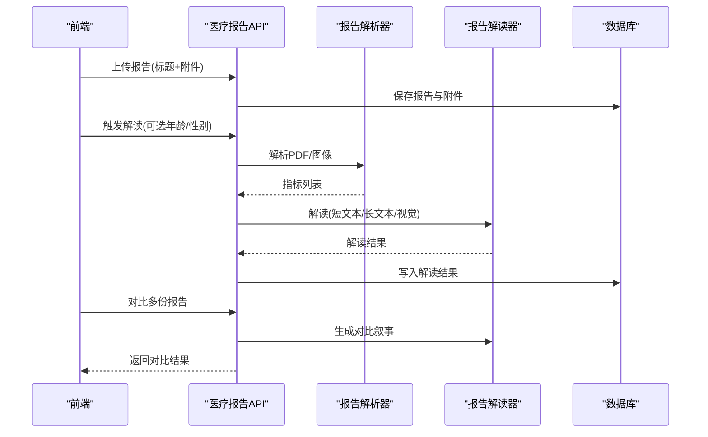
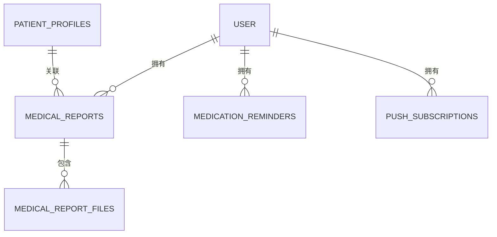

# 医疗数据API

<cite>
**本文引用的文件**
- [medical_report.py](file://web/backend/api/medical_report.py)
- [medication.py](file://web/backend/api/medication.py)
- [patient_profile.py](file://web/backend/api/patient_profile.py)
- [report_parser.py](file://web/backend/services/medical/report_parser.py)
- [report_interpreter.py](file://web/backend/services/medical/report_interpreter.py)
- [indicator_normalizer.py](file://web/backend/services/medical/indicator_normalizer.py)
- [knowledge_base.py](file://web/backend/services/medical/knowledge_base.py)
- [reference_ranges.json](file://data/medical_knowledge/reference_ranges.json)
- [models.py](file://web/backend/database/models.py)
- [redact.py](file://web/backend/utils/redact.py)
- [__init__.py](file://web/backend/api/__init__.py)
- [medical-report.ts](file://web/app/src/api/medical-report.ts)
- [medication.ts](file://web/app/src/api/medication.ts)
- [ReportUploader.vue](file://web/app/src/components/tracker/ReportUploader.vue)
- [ReportDetailPage.vue](file://web/app/src/views/ReportDetailPage.vue)
</cite>

## 目录
1. [简介](#简介)
2. [项目结构](#项目结构)
3. [核心组件](#核心组件)
4. [架构总览](#架构总览)
5. [详细组件分析](#详细组件分析)
6. [依赖关系分析](#依赖关系分析)
7. [性能考量](#性能考量)
8. [故障排查指南](#故障排查指南)
9. [结论](#结论)
10. [附录](#附录)

## 简介
本文件为医疗数据管理系统的API文档，覆盖以下能力：
- 医疗报告解析与解读：支持PDF/图片上传、OCR与文本抽取、结构化指标提取、AI解读与对比总结。
- 用药管理：提醒创建、更新、删除，以及Web Push订阅与VAPID公钥获取。
- 患者档案：多关系档案（本人/父母/孩子/伴侣/朋友/其他）、默认模块档案设置、自动创建“本人”档案。
- 数据标准化与隐私安全：指标名称标准化、参考范围知识库、数据脱敏、访问控制与审计。
- 工作流示例：从上传到解读、对比、关联档案的端到端流程。

## 项目结构
后端采用FastAPI模块化路由组织，医疗相关接口位于web/backend/api下；医学处理服务位于web/backend/services/medical；数据库模型在web/backend/database/models.py；前端调用通过web/app/src/api下的TS封装。

图表来源
- [__init__.py:1-62](file://web/backend/api/__init__.py#L1-L62)
- [medical_report.py:1-797](file://web/backend/api/medical_report.py#L1-L797)
- [medication.py:1-248](file://web/backend/api/medication.py#L1-L248)
- [patient_profile.py:1-297](file://web/backend/api/patient_profile.py#L1-L297)
- [report_parser.py:1-583](file://web/backend/services/medical/report_parser.py#L1-L583)
- [report_interpreter.py:1-800](file://web/backend/services/medical/report_interpreter.py#L1-L800)
- [indicator_normalizer.py:1-460](file://web/backend/services/medical/indicator_normalizer.py#L1-L460)
- [knowledge_base.py:1-71](file://web/backend/services/medical/knowledge_base.py#L1-L71)
- [models.py:580-779](file://web/backend/database/models.py#L580-L779)
- [reference_ranges.json:1-51](file://data/medical_knowledge/reference_ranges.json#L1-L51)

章节来源
- [__init__.py:1-62](file://web/backend/api/__init__.py#L1-L62)

## 核心组件
- 医疗报告API：提供报告的CRUD、附件管理、解读触发、解读结果查询、报告对比、PDF分页预览等。
- 用药提醒API：提醒的增删改查与Web Push订阅管理。
- 患者档案API：档案CRUD、关系校验、默认模块档案设置。
- 医学服务：报告解析（PDF/图像OCR）、指标标准化、参考范围知识库、AI解读与对比叙事生成。
- 数据模型：MedicalReport、MedicalReportFile、MedicationReminder、PushSubscription、PatientProfile等。
- 隐私与安全：数据脱敏工具、访问控制（认证依赖）、审计日志模型。

章节来源
- [medical_report.py:1-797](file://web/backend/api/medical_report.py#L1-L797)
- [medication.py:1-248](file://web/backend/api/medication.py#L1-L248)
- [patient_profile.py:1-297](file://web/backend/api/patient_profile.py#L1-L297)
- [report_parser.py:1-583](file://web/backend/services/medical/report_parser.py#L1-L583)
- [report_interpreter.py:1-800](file://web/backend/services/medical/report_interpreter.py#L1-L800)
- [indicator_normalizer.py:1-460](file://web/backend/services/medical/indicator_normalizer.py#L1-L460)
- [knowledge_base.py:1-71](file://web/backend/services/medical/knowledge_base.py#L1-L71)
- [models.py:580-779](file://web/backend/database/models.py#L580-L779)
- [redact.py:1-53](file://web/backend/utils/redact.py#L1-L53)

## 架构总览
系统以FastAPI为中心，前端通过TS封装调用后端REST接口；医学处理能力由专用服务模块实现，结合本地知识库与LLM进行报告解读与对比总结。

图表来源
- [medical_report.py:214-276](file://web/backend/api/medical_report.py#L214-L276)
- [medical_report.py:426-504](file://web/backend/api/medical_report.py#L426-L504)
- [report_parser.py:209-228](file://web/backend/services/medical/report_parser.py#L209-L228)
- [report_interpreter.py:18-43](file://web/backend/services/medical/report_interpreter.py#L18-L43)
- [knowledge_base.py:21-52](file://web/backend/services/medical/knowledge_base.py#L21-L52)
- [models.py:581-604](file://web/backend/database/models.py#L581-L604)

## 详细组件分析

### 医疗报告API
- 功能要点
  - 列表/详情/删除：按用户隔离，分页限制。
  - 创建报告：表单提交标题与标签，支持多文件上传；自动将PDF转换为每页PNG用于在线查看。
  - 解读触发：优先使用文本抽取；若无文本则走视觉两阶段（全量OCR + 全文结构化解读）。
  - 解读结果：包含风险等级、摘要、指标、异常项、建议、免责声明、患者信息抽取等。
  - 对比：对多份报告指标对齐并计算变化类型，生成对比叙事。
  - 文件分页：按file_id返回PDF分页图片URL。
- 关键路径
  - GET /medical-reports/
  - POST /medical-reports/
  - GET /medical-reports/{id}
  - DELETE /medical-reports/{id}
  - POST /medical-reports/{id}/interpret
  - GET /medical-reports/{id}/interpretation
  - POST /medical-reports/compare
  - GET /medical-reports/files/{file_id}/pages

图表来源
- [medical_report.py:214-276](file://web/backend/api/medical_report.py#L214-L276)
- [medical_report.py:426-504](file://web/backend/api/medical_report.py#L426-L504)
- [medical_report.py:665-695](file://web/backend/api/medical_report.py#L665-L695)
- [report_parser.py:209-228](file://web/backend/services/medical/report_parser.py#L209-L228)
- [report_interpreter.py:44-61](file://web/backend/services/medical/report_interpreter.py#L44-L61)
- [indicator_normalizer.py:406-460](file://web/backend/services/medical/indicator_normalizer.py#L406-L460)

章节来源
- [medical_report.py:185-212](file://web/backend/api/medical_report.py#L185-L212)
- [medical_report.py:214-276](file://web/backend/api/medical_report.py#L214-L276)
- [medical_report.py:278-328](file://web/backend/api/medical_report.py#L278-L328)
- [medical_report.py:330-352](file://web/backend/api/medical_report.py#L330-L352)
- [medical_report.py:354-380](file://web/backend/api/medical_report.py#L354-L380)
- [medical_report.py:382-401](file://web/backend/api/medical_report.py#L382-L401)
- [medical_report.py:403-424](file://web/backend/api/medical_report.py#L403-L424)
- [medical_report.py:426-504](file://web/backend/api/medical_report.py#L426-L504)
- [medical_report.py:506-574](file://web/backend/api/medical_report.py#L506-L574)
- [medical_report.py:665-695](file://web/backend/api/medical_report.py#L665-L695)
- [medical_report.py:697-728](file://web/backend/api/medical_report.py#L697-L728)

### 用药提醒API
- 功能要点
  - 提醒CRUD：支持频率、时间、日期、备注、激活状态。
  - Web Push订阅：注册/取消订阅，获取VAPID公钥。
- 关键路径
  - GET /medication/reminders
  - POST /medication/reminders
  - PUT /medication/reminders/{id}
  - DELETE /medication/reminders/{id}
  - POST /medication/push/subscribe
  - DELETE /medication/push/unsubscribe
  - GET /medication/push/vapid-public-key

图表来源
- [models.py:1119-1143](file://web/backend/database/models.py#L1119-L1143)

章节来源
- [medication.py:86-99](file://web/backend/api/medication.py#L86-L99)
- [medication.py:101-121](file://web/backend/api/medication.py#L101-L121)
- [medication.py:124-161](file://web/backend/api/medication.py#L124-L161)
- [medication.py:163-184](file://web/backend/api/medication.py#L163-L184)
- [medication.py:186-219](file://web/backend/api/medication.py#L186-L219)
- [medication.py:221-240](file://web/backend/api/medication.py#L221-L240)
- [medication.py:242-248](file://web/backend/api/medication.py#L242-L248)

### 患者档案API
- 功能要点
  - 关系白名单校验（本人/父母/孩子/伴侣/朋友/其他）。
  - “本人”档案唯一性约束与不可删除保护。
  - 自动创建“本人”档案（首次查询时）。
  - 模块默认档案设置（追踪/报告/日记）及权限校验。
- 关键路径
  - GET /patient-profiles/
  - POST /patient-profiles/
  - PUT /patient-profiles/{id}
  - DELETE /patient-profiles/{id}
  - GET /user/module-defaults
  - PUT /user/module-defaults

图表来源
- [patient_profile.py:102-116](file://web/backend/api/patient_profile.py#L102-L116)
- [patient_profile.py:118-143](file://web/backend/api/patient_profile.py#L118-L143)
- [patient_profile.py:145-212](file://web/backend/api/patient_profile.py#L145-L212)
- [patient_profile.py:214-252](file://web/backend/api/patient_profile.py#L214-L252)
- [patient_profile.py:254-297](file://web/backend/api/patient_profile.py#L254-L297)

章节来源
- [patient_profile.py:1-297](file://web/backend/api/patient_profile.py#L1-L297)

### 医学数据处理服务
- 报告解析器
  - 支持PDF文本抽取与表格抽取、图像OCR。
  - 行级指标解析、多指标行解析、单位与参考范围提取、状态判定。
- 报告解读器
  - 短文本/长文本双分支：指标+片段或全文结构化解读。
  - 视觉模式：两阶段OCR（全量页面）+ 全文结构化解读。
  - 输出标准化：风险等级、摘要、指标、异常项、建议、免责声明、患者信息抽取。
  - 对比叙事：基于指标变化生成关键变化与建议。
- 指标标准化与知识库
  - 指标名称归一化、单位族与面板分类、参考范围加载与匹配。
  - 指标对齐与变化分类（新异常/已恢复/持续异常/大变化/稳定/未测量）。

图表来源
- [report_parser.py:164-228](file://web/backend/services/medical/report_parser.py#L164-L228)
- [report_parser.py:285-333](file://web/backend/services/medical/report_parser.py#L285-L333)
- [report_interpreter.py:18-61](file://web/backend/services/medical/report_interpreter.py#L18-L61)
- [report_interpreter.py:62-116](file://web/backend/services/medical/report_interpreter.py#L62-L116)
- [indicator_normalizer.py:203-217](file://web/backend/services/medical/indicator_normalizer.py#L203-L217)
- [indicator_normalizer.py:406-460](file://web/backend/services/medical/indicator_normalizer.py#L406-L460)
- [knowledge_base.py:21-52](file://web/backend/services/medical/knowledge_base.py#L21-L52)

章节来源
- [report_parser.py:1-583](file://web/backend/services/medical/report_parser.py#L1-L583)
- [report_interpreter.py:1-800](file://web/backend/services/medical/report_interpreter.py#L1-L800)
- [indicator_normalizer.py:1-460](file://web/backend/services/medical/indicator_normalizer.py#L1-L460)
- [knowledge_base.py:1-71](file://web/backend/services/medical/knowledge_base.py#L1-L71)
- [reference_ranges.json:1-51](file://data/medical_knowledge/reference_ranges.json#L1-L51)

### 数据模型与存储
- MedicalReport：用户、档案关联、标题/标签、AI解读JSON、分区结构化、患者信息抽取、时间戳。
- MedicalReportFile：报告附件URL、文件名、大小、类型、顺序。
- MedicationReminder：药品名、剂量、频率、时间/日期、备注、激活状态、推送订阅ID。
- PushSubscription：endpoint、密钥、UA、激活状态。
- PatientProfile：关系、基本信息、诊断日期、白癜风分型、备注、是否本人。
- AuditLog：操作审计（分享/公开/撤销/导出），含IP脱敏存储。

章节来源
- [models.py:581-604](file://web/backend/database/models.py#L581-L604)
- [models.py:606-621](file://web/backend/database/models.py#L606-L621)
- [models.py:1119-1143](file://web/backend/database/models.py#L1119-L1143)
- [models.py:623-648](file://web/backend/database/models.py#L623-L648)

### 隐私与安全
- 数据脱敏：手机号、邮箱、姓名、IP地址脱敏规则。
- 访问控制：所有接口通过认证依赖（auth/get_current_user）确保用户隔离。
- 合规声明：解读结果附带免责声明，强调非诊断依据。
- 审计日志：记录敏感操作的主体、内容、时间、范围与可撤销性。

章节来源
- [redact.py:1-53](file://web/backend/utils/redact.py#L1-L53)
- [medical_report.py:185-212](file://web/backend/api/medical_report.py#L185-L212)
- [medication.py:86-99](file://web/backend/api/medication.py#L86-L99)
- [patient_profile.py:102-116](file://web/backend/api/patient_profile.py#L102-L116)
- [models.py:623-648](file://web/backend/database/models.py#L623-L648)
- [report_interpreter.py:15-15](file://web/backend/services/medical/report_interpreter.py#L15-L15)

## 依赖关系分析
- 路由注册：api/__init__.py统一导入各模块路由。
- 前端调用：medical-report.ts与medication.ts封装HTTP请求。
- 服务依赖：医疗报告API依赖解析器、解读器、知识库与数据库模型。
- 外部依赖：OpenAI兼容客户端用于LLM调用；PyMuPDF/pdfplumber/PaddleOCR用于文本与OCR。

图表来源
- [__init__.py:1-62](file://web/backend/api/__init__.py#L1-L62)
- [medical_report.py:1-31](file://web/backend/api/medical_report.py#L1-L31)
- [medication.py:1-19](file://web/backend/api/medication.py#L1-L19)
- [report_parser.py:1-8](file://web/backend/services/medical/report_parser.py#L1-L8)
- [report_interpreter.py:1-12](file://web/backend/services/medical/report_interpreter.py#L1-L12)
- [indicator_normalizer.py:1-4](file://web/backend/services/medical/indicator_normalizer.py#L1-L4)
- [knowledge_base.py:1-6](file://web/backend/services/medical/knowledge_base.py#L1-L6)
- [models.py:581-604](file://web/backend/database/models.py#L581-L604)
- [medical-report.ts:167-204](file://web/app/src/api/medical-report.ts#L167-L204)
- [medication.ts:1-72](file://web/app/src/api/medication.ts#L1-L72)

章节来源
- [__init__.py:1-62](file://web/backend/api/__init__.py#L1-L62)
- [medical-report.ts:167-204](file://web/app/src/api/medical-report.ts#L167-L204)
- [medication.ts:1-72](file://web/app/src/api/medication.ts#L1-L72)

## 性能考量
- OCR与PDF转换：PDF转页图与全量OCR可能耗时，建议异步处理与缓存；当前实现按需转换与批处理（每批8页）。
- LLM调用：长文本解读与对比叙事需较大token预算，注意超时与重试策略；失败回退机制已内置。
- 数据库查询：列表分页限制最大limit，避免过大结果集；附件查询按order排序。
- 内存与I/O：大文件上传与读取需注意内存占用；PDF渲染质量与DPI平衡。

[本节为通用指导，不直接分析具体文件]

## 故障排查指南
- 无法解读报告
  - 检查是否上传了附件；若仅图片且OCR失败，确认视觉模型配置与网络连通。
  - 查看日志中OCR与LLM调用错误信息。
- 对比失败
  - 至少需要两份报告且均已解读；确保存在可对比指标。
- 推送订阅无效
  - 检查VAPID公钥配置与浏览器订阅回调；确认endpoint唯一性与is_active状态。
- 患者档案操作报错
  - 关系不在白名单或“本人”唯一性冲突；删除“本人”档案被拒绝。

章节来源
- [medical_report.py:426-504](file://web/backend/api/medical_report.py#L426-L504)
- [medical_report.py:278-328](file://web/backend/api/medical_report.py#L278-L328)
- [medication.py:186-219](file://web/backend/api/medication.py#L186-L219)
- [patient_profile.py:28-45](file://web/backend/api/patient_profile.py#L28-L45)
- [patient_profile.py:214-252](file://web/backend/api/patient_profile.py#L214-L252)

## 结论
本系统围绕医疗报告解析、用药管理与患者档案三大核心能力，构建了从数据摄取、标准化、AI解读到对比与可视化的完整闭环。通过严格的访问控制、数据脱敏与审计机制，保障隐私与合规。建议在部署环境中优化OCR与LLM调用性能，并结合业务需求扩展指标库与知识库。

[本节为总结性内容，不直接分析具体文件]

## 附录

### API定义与请求响应示例
- 医疗报告
  - GET /medical-reports/?limit=20&offset=0
  - POST /medical-reports/ (FormData: title, tags, files[])
  - GET /medical-reports/{id}
  - DELETE /medical-reports/{id}
  - POST /medical-reports/{id}/interpret (FormData: user_age?, user_gender?)
  - GET /medical-reports/{id}/interpretation
  - POST /medical-reports/compare (JSON: report_ids[])
  - GET /medical-reports/files/{file_id}/pages
- 用药提醒
  - GET /medication/reminders
  - POST /medication/reminders (JSON: ReminderCreate)
  - PUT /medication/reminders/{id} (JSON: ReminderUpdate)
  - DELETE /medication/reminders/{id}
  - POST /medication/push/subscribe (JSON: PushSubscriptionCreate)
  - DELETE /medication/push/unsubscribe (Query: endpoint)
  - GET /medication/push/vapid-public-key

章节来源
- [medical_report.py:185-212](file://web/backend/api/medical_report.py#L185-L212)
- [medical_report.py:214-276](file://web/backend/api/medical_report.py#L214-L276)
- [medical_report.py:278-328](file://web/backend/api/medical_report.py#L278-L328)
- [medication.py:86-99](file://web/backend/api/medication.py#L86-L99)
- [medication.py:101-121](file://web/backend/api/medication.py#L101-L121)
- [medication.py:124-161](file://web/backend/api/medication.py#L124-L161)
- [medication.py:163-184](file://web/backend/api/medication.py#L163-L184)
- [medication.py:186-219](file://web/backend/api/medication.py#L186-L219)
- [medication.py:221-240](file://web/backend/api/medication.py#L221-L240)
- [medication.py:242-248](file://web/backend/api/medication.py#L242-L248)

### 前端调用示例
- 医疗报告
  - medical-report.ts：list/get/create/delete/interpret/getInterpretation
- 用药提醒
  - medication.ts：getReminders/createReminder/updateReminder/deleteReminder/subscribePush/unsubscribePush/getVapidPublicKey

章节来源
- [medical-report.ts:167-204](file://web/app/src/api/medical-report.ts#L167-L204)
- [medication.ts:1-72](file://web/app/src/api/medication.ts#L1-L72)

### 工作流示例：报告上传到解读与对比

图表来源
- [medical_report.py:214-276](file://web/backend/api/medical_report.py#L214-L276)
- [medical_report.py:426-504](file://web/backend/api/medical_report.py#L426-L504)
- [report_parser.py:209-228](file://web/backend/services/medical/report_parser.py#L209-L228)
- [report_interpreter.py:44-61](file://web/backend/services/medical/report_interpreter.py#L44-L61)
- [models.py:581-604](file://web/backend/database/models.py#L581-L604)

### 数据模型ER图

图表来源
- [models.py:581-604](file://web/backend/database/models.py#L581-L604)
- [models.py:606-621](file://web/backend/database/models.py#L606-L621)
- [models.py:1119-1143](file://web/backend/database/models.py#L1119-L1143)

### 前端交互要点
- 报告上传与解读：ReportUploader.vue负责上传与触发解读，ReportDetailPage.vue展示解读结果与档案关联确认。
- 用药提醒：medication.ts封装提醒与推送订阅接口，便于前端统一管理。

章节来源
- [ReportUploader.vue:121-167](file://web/app/src/components/tracker/ReportUploader.vue#L121-L167)
- [ReportDetailPage.vue:160-180](file://web/app/src/views/ReportDetailPage.vue#L160-L180)
- [medication.ts:1-72](file://web/app/src/api/medication.ts#L1-L72)