# 即时通讯API

<cite>
**本文引用的文件**
- [im_messages.py](file://web/backend/api/im_messages.py)
- [im_conversations.py](file://web/backend/api/im_conversations.py)
- [im_friends.py](file://web/backend/api/im_friends.py)
- [im_groups.py](file://web/backend/api/im_groups.py)
- [chat.py](file://web/backend/ws/chat.py)
- [im_service.py](file://web/backend/services/im_service.py)
- [models.py](file://web/backend/database/models.py)
- [im_anti_fraud.py](file://web/backend/services/im_anti_fraud.py)
- [im_moderation.py](file://web/backend/services/im_moderation.py)
- [im.ts](file://web/app/src/api/im.ts)
- [im.ts（store）](file://web/app/src/stores/im.ts)
</cite>

## 目录
1. [简介](#简介)
2. [项目结构](#项目结构)
3. [核心组件](#核心组件)
4. [架构总览](#架构总览)
5. [详细组件分析](#详细组件分析)
6. [依赖关系分析](#依赖关系分析)
7. [性能与扩展性](#性能与扩展性)
8. [故障排查指南](#故障排查指南)
9. [结论](#结论)
10. [附录：完整聊天场景调用示例](#附录完整聊天场景调用示例)

## 简介
本文件为即时通讯系统的API文档，覆盖消息收发、会话管理、好友关系、群组功能、WebSocket实时通信、消息持久化、已读回执、消息撤回、内容安全与防骚扰等能力。同时提供前端调用路径与典型聊天场景的端到端调用示例，帮助快速集成与排障。

## 项目结构
后端采用FastAPI模块化路由组织IM相关接口，业务逻辑集中在服务层，数据模型定义在数据库ORM中；前端通过TS API封装与Pinia状态管理配合WebSocket实现实时交互。

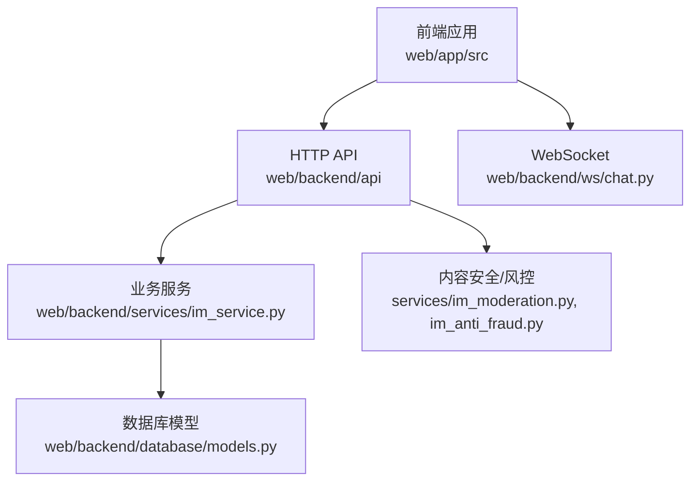

图表来源
- [im_messages.py:1-78](file://web/backend/api/im_messages.py#L1-L78)
- [im_conversations.py:1-103](file://web/backend/api/im_conversations.py#L1-L103)
- [im_friends.py:1-144](file://web/backend/api/im_friends.py#L1-L144)
- [im_groups.py:1-183](file://web/backend/api/im_groups.py#L1-L183)
- [chat.py:1-111](file://web/backend/ws/chat.py#L1-L111)
- [im_service.py:1-419](file://web/backend/services/im_service.py#L1-L419)
- [models.py:88-137](file://web/backend/database/models.py#L88-L137)
- [im_moderation.py:1-148](file://web/backend/services/im_moderation.py#L1-L148)
- [im_anti_fraud.py:1-83](file://web/backend/services/im_anti_fraud.py#L1-L83)

章节来源
- [im_messages.py:1-78](file://web/backend/api/im_messages.py#L1-L78)
- [im_conversations.py:1-103](file://web/backend/api/im_conversations.py#L1-L103)
- [im_friends.py:1-144](file://web/backend/api/im_friends.py#L1-L144)
- [im_groups.py:1-183](file://web/backend/api/im_groups.py#L1-L183)
- [chat.py:1-111](file://web/backend/ws/chat.py#L1-L111)
- [im_service.py:1-419](file://web/backend/services/im_service.py#L1-L419)
- [models.py:88-137](file://web/backend/database/models.py#L88-L137)
- [im_moderation.py:1-148](file://web/backend/services/im_moderation.py#L1-L148)
- [im_anti_fraud.py:1-83](file://web/backend/services/im_anti_fraud.py#L1-L83)

## 核心组件
- HTTP API路由
  - 消息：发送、撤回
  - 会话：列表、创建私聊、分页拉取历史、标记已读、置顶
  - 好友：申请、接受/拒绝、列表
  - 群组：创建、成员增删、群信息更新
- WebSocket实时通道
  - 鉴权连接、心跳ping/pong、已读回执上报、未读数推送
- 业务服务层
  - 会话与消息生命周期、权限校验、禁言控制、通知生成、好友关系维护
- 数据模型
  - 用户、会话、成员、消息、已读记录、好友请求、违规记录等
- 安全与风控
  - 关键词过滤、AI内容审核、反垃圾检测、机器人行为评分

章节来源
- [im_messages.py:1-78](file://web/backend/api/im_messages.py#L1-L78)
- [im_conversations.py:1-103](file://web/backend/api/im_conversations.py#L1-L103)
- [im_friends.py:1-144](file://web/backend/api/im_friends.py#L1-L144)
- [im_groups.py:1-183](file://web/backend/api/im_groups.py#L1-L183)
- [chat.py:1-111](file://web/backend/ws/chat.py#L1-L111)
- [im_service.py:1-419](file://web/backend/services/im_service.py#L1-L419)
- [models.py:88-137](file://web/backend/database/models.py#L88-L137)
- [im_moderation.py:1-148](file://web/backend/services/im_moderation.py#L1-L148)
- [im_anti_fraud.py:1-83](file://web/backend/services/im_anti_fraud.py#L1-L83)

## 架构总览
系统由前端、HTTP API、WebSocket、服务层与数据库组成。消息写入后通过通知机制与WebSocket事件驱动前端实时更新；已读回执通过WebSocket上报并落库；内容安全与风控在消息处理链路中拦截高风险内容。

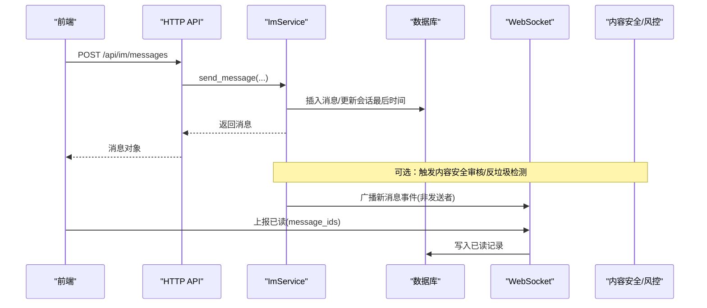

图表来源
- [im_messages.py:41-78](file://web/backend/api/im_messages.py#L41-L78)
- [im_service.py:215-286](file://web/backend/services/im_service.py#L215-L286)
- [chat.py:45-111](file://web/backend/ws/chat.py#L45-L111)
- [im_moderation.py:91-148](file://web/backend/services/im_moderation.py#L91-L148)
- [im_anti_fraud.py:14-41](file://web/backend/services/im_anti_fraud.py#L14-L41)

## 详细组件分析

### 消息收发API
- 发送消息
  - 路径：POST /api/im/messages
  - 入参：conversation_id、msg_type、content、metadata、reply_to_id
  - 限流：单用户每分钟最多N条（内存滑动窗口）
  - 权限：必须是会话成员且未被禁言
  - 返回：序列化后的消息对象
- 撤回消息
  - 路径：POST /api/im/messages/{message_id}/recall
  - 规则：仅本人消息且在2分钟内可撤回
  - 返回：状态ok

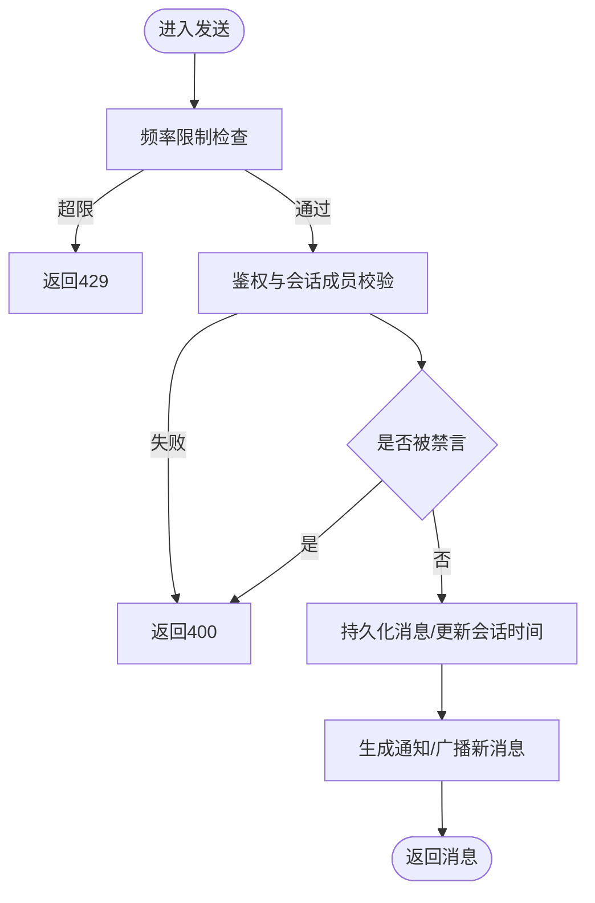

图表来源
- [im_messages.py:23-78](file://web/backend/api/im_messages.py#L23-L78)
- [im_service.py:215-286](file://web/backend/services/im_service.py#L215-L286)

章节来源
- [im_messages.py:1-78](file://web/backend/api/im_messages.py#L1-L78)
- [im_service.py:215-286](file://web/backend/services/im_service.py#L215-L286)

### 会话管理API
- 列出会话：GET /api/im/conversations
- 创建私聊：POST /api/im/conversations/private
- 获取历史消息：GET /api/im/conversations/{conversation_id}/messages?before_id=&limit=
- 标记已读：POST /api/im/conversations/{conversation_id}/read
- 置顶/取消置顶：POST /api/im/conversations/{conversation_id}/pin

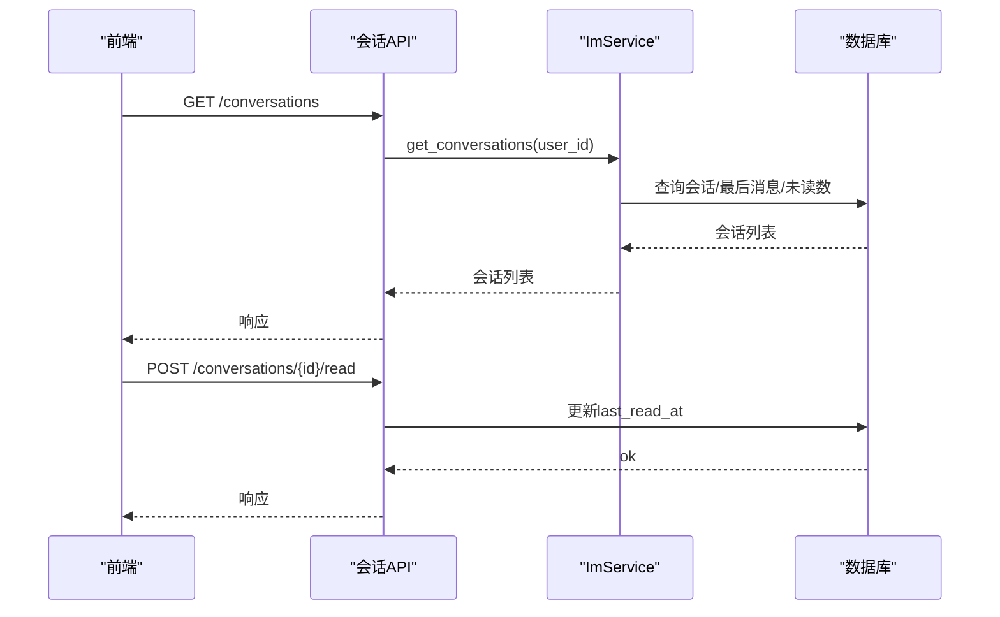

图表来源
- [im_conversations.py:21-103](file://web/backend/api/im_conversations.py#L21-L103)
- [im_service.py:90-194](file://web/backend/services/im_service.py#L90-L194)

章节来源
- [im_conversations.py:1-103](file://web/backend/api/im_conversations.py#L1-L103)
- [im_service.py:90-194](file://web/backend/services/im_service.py#L90-L194)

### 好友关系API
- 发送好友请求：POST /api/im/friends/request
- 查看待处理请求：GET /api/im/friends/requests
- 接受/拒绝请求：POST /api/im/friends/requests/{request_id}/accept|decline
- 好友列表：GET /api/im/friends

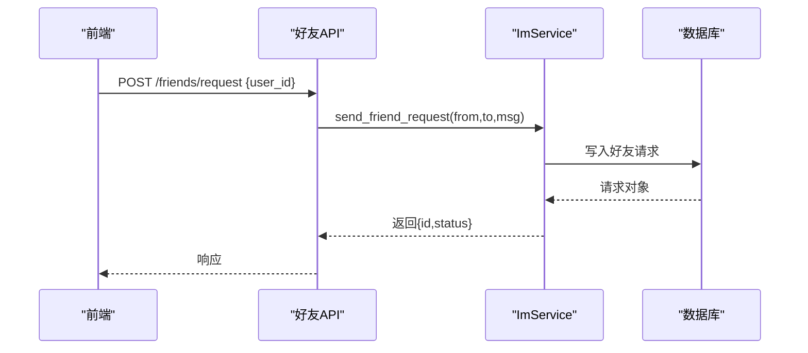

图表来源
- [im_friends.py:24-144](file://web/backend/api/im_friends.py#L24-L144)
- [im_service.py:335-418](file://web/backend/services/im_service.py#L335-L418)

章节来源
- [im_friends.py:1-144](file://web/backend/api/im_friends.py#L1-L144)
- [im_service.py:335-418](file://web/backend/services/im_service.py#L335-L418)

### 群组功能API
- 创建群组：POST /api/im/groups
- 成员列表：GET /api/im/groups/{group_id}/members
- 添加成员：POST /api/im/groups/{group_id}/members
- 移除成员：DELETE /api/im/groups/{group_id}/members/{user_id}
- 更新群信息：PUT /api/im/groups/{group_id}/info

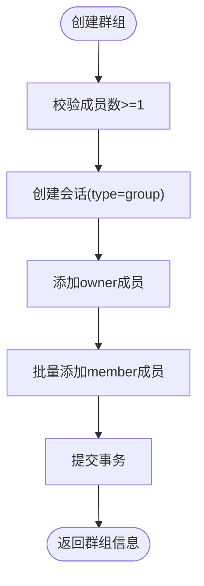

图表来源
- [im_groups.py:24-183](file://web/backend/api/im_groups.py#L24-L183)

章节来源
- [im_groups.py:1-183](file://web/backend/api/im_groups.py#L1-L183)

### WebSocket实时通信
- 连接鉴权：/ws/chat?token=...
- 心跳：客户端发送{type:"ping"}，服务端回复{type:"pong"}
- 已读回执：客户端发送{type:"read", message_ids:[...]}，服务端写入已读表
- 未读数推送：服务端向用户推送unread_update事件

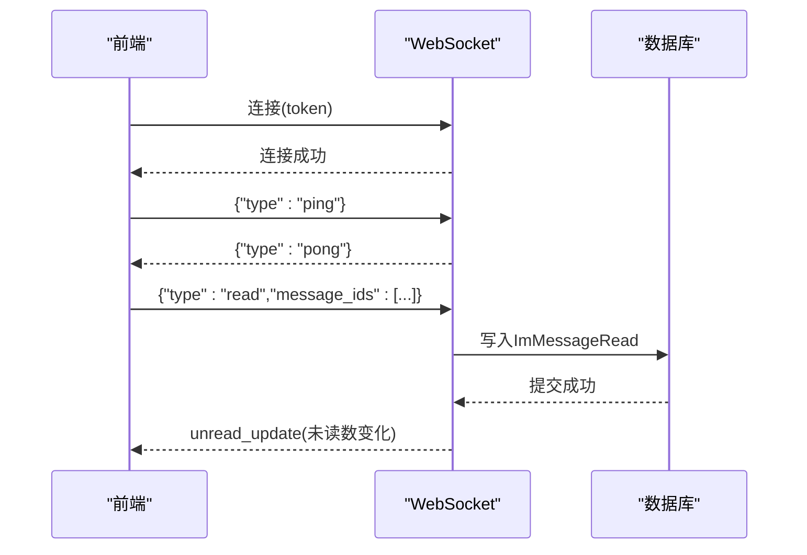

图表来源
- [chat.py:14-111](file://web/backend/ws/chat.py#L14-L111)

章节来源
- [chat.py:1-111](file://web/backend/ws/chat.py#L1-L111)

### 内容安全与防骚扰
- 关键词白名单/黑名单：敏感词命中直接判定高风险
- AI内容审核：基于配置的外部LLM进行风险分类与置信度评估
- 反垃圾检测：多会话重复内容、短时间高频发送等模式识别
- 机器人行为评分：基于消息间隔、方差、内容多样性等指标

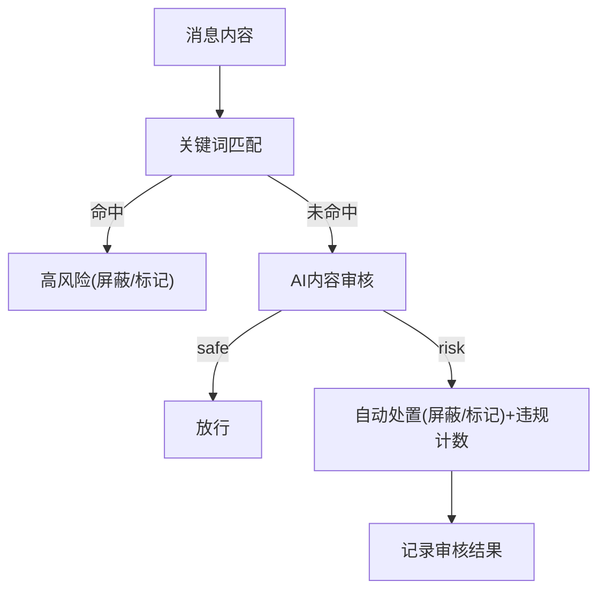

图表来源
- [im_moderation.py:16-88](file://web/backend/services/im_moderation.py#L16-L88)
- [im_moderation.py:91-148](file://web/backend/services/im_moderation.py#L91-L148)
- [im_anti_fraud.py:14-83](file://web/backend/services/im_anti_fraud.py#L14-L83)

章节来源
- [im_moderation.py:1-148](file://web/backend/services/im_moderation.py#L1-L148)
- [im_anti_fraud.py:1-83](file://web/backend/services/im_anti_fraud.py#L1-L83)

### 数据模型概览
- 用户：基础信息与状态（隐私模式、封禁等）
- 会话与成员：私聊/群聊，角色与静音设置
- 消息与已读：消息类型、内容、元数据、撤回标记、已读时间
- 好友请求：状态机（pending/accepted/declined）
- 违规记录：用于风控策略联动

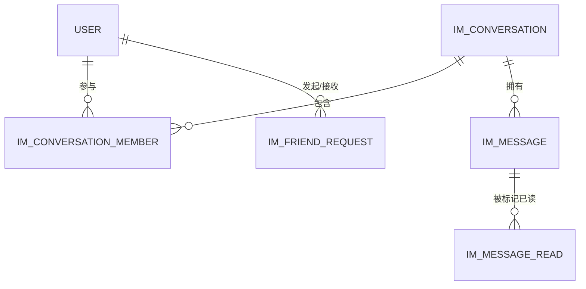

图表来源
- [models.py:88-137](file://web/backend/database/models.py#L88-L137)
- [im_service.py:11-19](file://web/backend/services/im_service.py#L11-L19)

章节来源
- [models.py:88-137](file://web/backend/database/models.py#L88-L137)
- [im_service.py:11-19](file://web/backend/services/im_service.py#L11-L19)

## 依赖关系分析
- API层依赖认证与数据库会话注入
- 服务层集中处理业务规则（权限、禁言、未读数计算、通知）
- WebSocket独立于HTTP，使用同一鉴权流程
- 内容安全模块可异步或同步接入消息链路

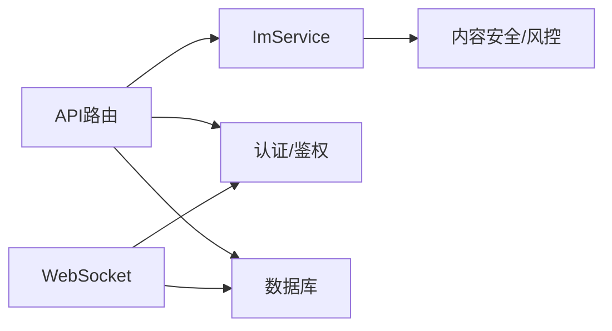

图表来源
- [im_messages.py:1-78](file://web/backend/api/im_messages.py#L1-L78)
- [im_conversations.py:1-103](file://web/backend/api/im_conversations.py#L1-L103)
- [chat.py:1-111](file://web/backend/ws/chat.py#L1-L111)
- [im_service.py:1-419](file://web/backend/services/im_service.py#L1-L419)
- [im_moderation.py:1-148](file://web/backend/services/im_moderation.py#L1-L148)

章节来源
- [im_messages.py:1-78](file://web/backend/api/im_messages.py#L1-L78)
- [im_conversations.py:1-103](file://web/backend/api/im_conversations.py#L1-L103)
- [chat.py:1-111](file://web/backend/ws/chat.py#L1-L111)
- [im_service.py:1-419](file://web/backend/services/im_service.py#L1-L419)
- [im_moderation.py:1-148](file://web/backend/services/im_moderation.py#L1-L148)

## 性能与扩展性
- 限流保护：发送接口内置分钟级滑动窗口限流，防止滥用
- 未读数计算：按会话维度统计，避免全量扫描
- 分页拉取：历史消息支持before_id游标分页，降低单次负载
- 可扩展点
  - 多媒体消息：通过msg_type与metadata承载图片/语音/文件URL与元信息
  - 消息加密：可在metadata中附加加密参数，服务端不解析明文
  - 内容安全：可接入更多外部审核服务或本地模型
  - 反垃圾：可结合IP/设备指纹与账号画像提升准确率

[本节为通用建议，不直接分析具体文件]

## 故障排查指南
- 发送频繁被拒
  - 现象：429错误
  - 原因：超过每分钟上限
  - 处理：降低发送频率或优化重试策略
- 无法发送消息
  - 现象：400错误“不是会话成员”或“已被禁言”
  - 处理：确认成员关系与禁言状态
- 无法撤回消息
  - 现象：400错误“只能撤回自己的消息”或“超过2分钟无法撤回”
  - 处理：检查发送者与时间窗口
- WebSocket已读无效
  - 现象：未读数不更新
  - 处理：确认message_ids有效且用户为会话成员；检查数据库写入与事务提交
- 内容被误判
  - 现象：正常消息被屏蔽
  - 处理：调整敏感词列表或AI提示词；复核审核日志

章节来源
- [im_messages.py:23-78](file://web/backend/api/im_messages.py#L23-L78)
- [im_service.py:215-331](file://web/backend/services/im_service.py#L215-L331)
- [chat.py:58-111](file://web/backend/ws/chat.py#L58-L111)
- [im_moderation.py:36-148](file://web/backend/services/im_moderation.py#L36-L148)

## 结论
本IM系统以清晰的API分层与稳健的服务层为核心，提供完整的消息、会话、好友与群组能力，并通过WebSocket实现低延迟的实时体验。内容安全与防骚扰机制保障社区健康。建议在后续迭代中完善多媒体消息、端到端加密与更细粒度的风控策略。

[本节为总结性内容，不直接分析具体文件]

## 附录：完整聊天场景调用示例
以下示例基于前端API封装与状态管理，展示从登录到发消息、收到消息、撤回与已读的完整流程。

- 初始化与加载
  - 调用：imApi.getConversations()
  - 作用：获取会话列表与未读数
- 打开会话与拉取历史
  - 调用：imApi.getMessages(convId, beforeId?)
  - 作用：分页拉取历史消息
- 发送消息
  - 调用：imApi.sendMessage({conversation_id, msg_type, content, metadata})
  - 作用：发送文本/多媒体消息（多媒体通过metadata携带URL与元信息）
- 标记已读
  - 调用：imApi.markRead(convId)
  - 作用：将当前会话标记为已读
- 撤回消息
  - 调用：imApi.recallMessage(msgId)
  - 作用：撤回本人2分钟内的消息
- WebSocket事件
  - 事件：message.new、message.recall、unread_update
  - 作用：实时追加消息、更新撤回状态、刷新未读数

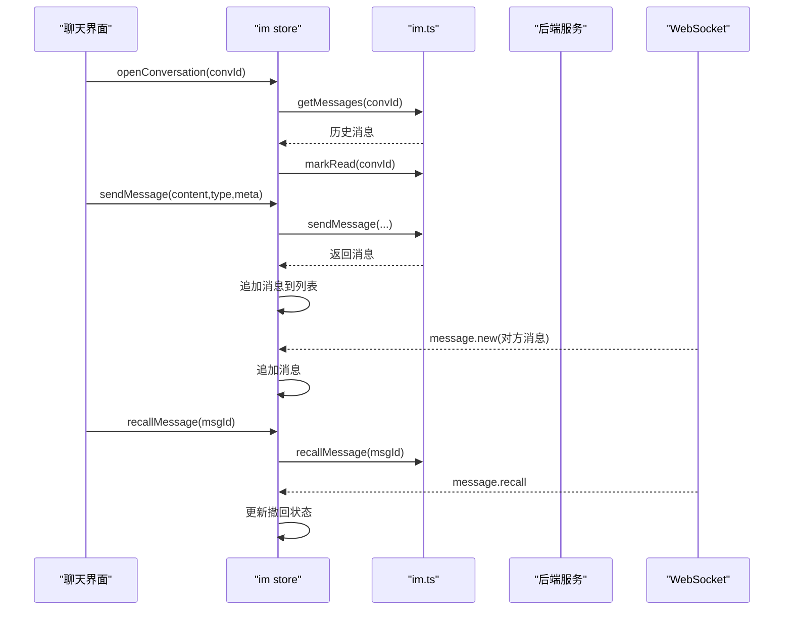

图表来源
- [im.ts（store）:41-116](file://web/app/src/stores/im.ts#L41-L116)
- [im.ts:1-54](file://web/app/src/api/im.ts#L1-L54)
- [im_messages.py:41-78](file://web/backend/api/im_messages.py#L41-L78)
- [im_conversations.py:45-81](file://web/backend/api/im_conversations.py#L45-L81)
- [chat.py:45-111](file://web/backend/ws/chat.py#L45-L111)

章节来源
- [im.ts:1-54](file://web/app/src/api/im.ts#L1-L54)
- [im.ts（store）:1-116](file://web/app/src/stores/im.ts#L1-L116)
- [im_messages.py:41-78](file://web/backend/api/im_messages.py#L41-L78)
- [im_conversations.py:45-81](file://web/backend/api/im_conversations.py#L45-L81)
- [chat.py:45-111](file://web/backend/ws/chat.py#L45-L111)