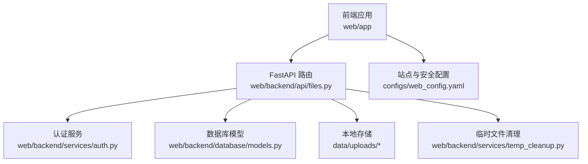
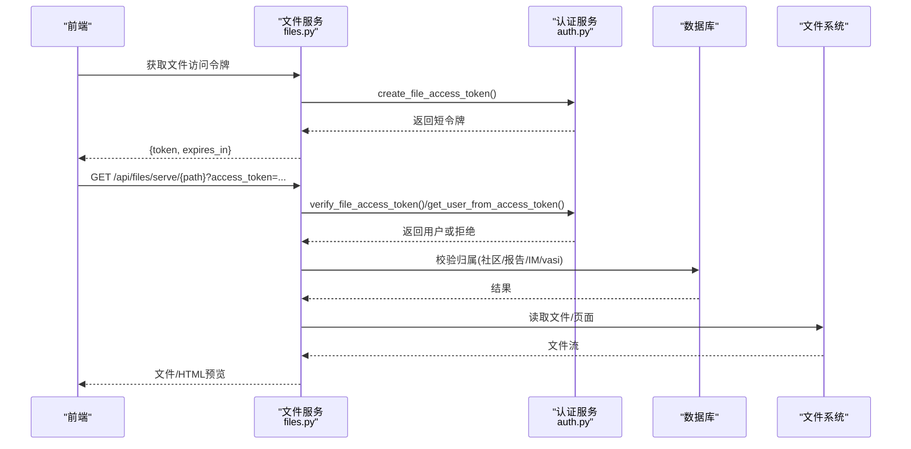
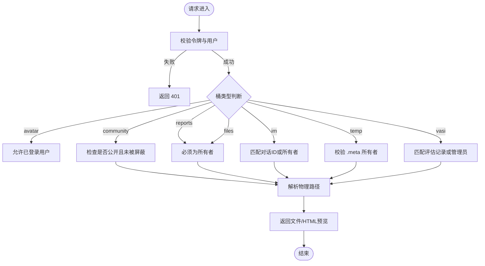
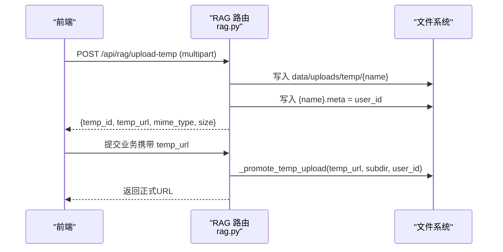
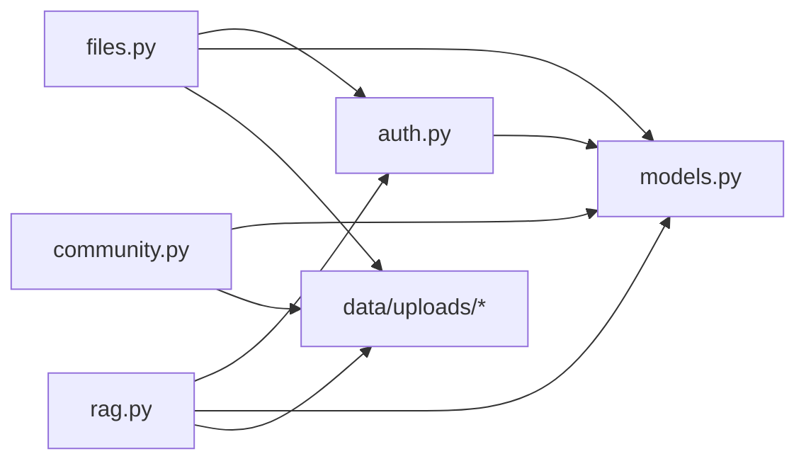
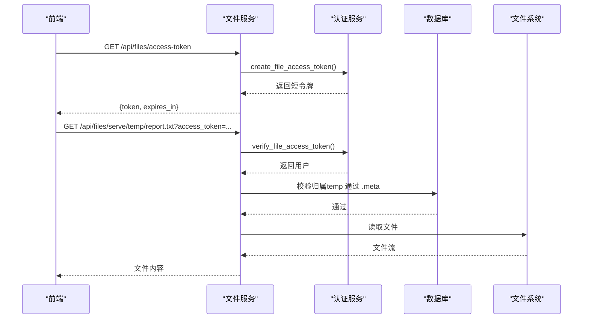

# 文件管理API

<cite>
**本文引用的文件**
- [web/backend/api/files.py](file://web/backend/api/files.py)
- [web/backend/services/auth.py](file://web/backend/services/auth.py)
- [web/backend/database/models.py](file://web/backend/database/models.py)
- [web/backend/api/rag.py](file://web/backend/api/rag.py)
- [web/backend/services/temp_cleanup.py](file://web/backend/services/temp_cleanup.py)
- [configs/web_config.yaml](file://configs/web_config.yaml)
- [tests/backend/api/test_files.py](file://tests/backend/api/test_files.py)
- [web/app/src/utils/file-url.ts](file://web/app/src/utils/file-url.ts)
</cite>

## 目录
1. [简介](#简介)
2. [项目结构](#项目结构)
3. [核心组件](#核心组件)
4. [架构总览](#架构总览)
5. [详细组件分析](#详细组件分析)
6. [依赖关系分析](#依赖关系分析)
7. [性能考虑](#性能考虑)
8. [故障排查指南](#故障排查指南)
9. [结论](#结论)
10. [附录](#附录)

## 简介
本文件管理系统提供基于 FastAPI 的文件上传、下载、预览与清理能力，覆盖社区图片、IM 图片、医疗报告文件、临时文件等场景。系统通过短生命周期“仅文件访问”令牌（file token）与常规 JWT 访问令牌双重机制保障安全访问；支持 PDF 分页预览与 HTML 内嵌查看器；提供临时文件自动清理策略。当前实现以本地文件系统存储为主，设计文档中规划了云存储集成方案（如 S3/OSS），便于后续扩展。

## 项目结构
- 后端 API：位于 web/backend/api，包含 files.py（文件服务）、rag.py（临时上传与处理入口）、community.py（社区文件上传）。
- 认证与安全：web/backend/services/auth.py 提供 JWT、刷新令牌与文件专用短令牌签发与校验。
- 数据模型：web/backend/database/models.py 定义用户、会话、评论等业务实体，供权限校验与审计使用。
- 配置：configs/web_config.yaml 集中站点、认证、数据库、CORS、安全头等配置。
- 前端工具：web/app/src/utils/file-url.ts 提供文件访问令牌缓存与 URL 拼接逻辑。
- 测试：tests/backend/api/test_files.py 覆盖鉴权、路径解析、临时文件清理等行为。

**图示来源**
- [web/backend/api/files.py:293-331](file://web/backend/api/files.py#L293-L331)
- [web/backend/services/auth.py:59-93](file://web/backend/services/auth.py#L59-L93)
- [web/backend/database/models.py:88-153](file://web/backend/database/models.py#L88-L153)
- [web/backend/services/temp_cleanup.py:15-52](file://web/backend/services/temp_cleanup.py#L15-L52)
- [configs/web_config.yaml:25-60](file://configs/web_config.yaml#L25-L60)

**章节来源**
- [web/backend/api/files.py:293-331](file://web/backend/api/files.py#L293-L331)
- [web/backend/services/auth.py:59-93](file://web/backend/services/auth.py#L59-L93)
- [configs/web_config.yaml:25-60](file://configs/web_config.yaml#L25-L60)

## 核心组件
- 文件访问令牌接口：用于签发短生命周期、仅文件读取的令牌，降低泄露风险。
- 文件服务接口：统一鉴权、路径解析、类型推断与响应返回，支持按 ID 或相对路径访问。
- 临时文件上传与迁移：RAG 模块提供临时上传、元数据记录与迁移至正式目录的能力。
- 临时文件清理：定时或手动清理过期临时文件，释放磁盘空间。
- 安全与访问控制：基于桶（bucket）与所有权校验的细粒度访问控制，支持社区公开图、私有报告、IM 私聊图等。

**章节来源**
- [web/backend/api/files.py:37-48](file://web/backend/api/files.py#L37-L48)
- [web/backend/api/files.py:293-331](file://web/backend/api/files.py#L293-L331)
- [web/backend/api/rag.py:89-133](file://web/backend/api/rag.py#L89-L133)
- [web/backend/services/temp_cleanup.py:15-52](file://web/backend/services/temp_cleanup.py#L15-L52)
- [web/backend/api/files.py:138-227](file://web/backend/api/files.py#L138-L227)

## 架构总览
下图展示了从前端到后端的完整请求链路：前端获取短生命周期文件令牌，调用文件服务进行上传、下载与预览；服务端通过认证服务校验令牌并执行路径与权限检查；必要时查询数据库确认归属关系；最终返回文件或页面视图。

**图示来源**
- [web/backend/api/files.py:37-48](file://web/backend/api/files.py#L37-L48)
- [web/backend/api/files.py:293-331](file://web/backend/api/files.py#L293-L331)
- [web/backend/services/auth.py:59-93](file://web/backend/services/auth.py#L59-L93)
- [web/backend/database/models.py:88-153](file://web/backend/database/models.py#L88-L153)

## 详细组件分析

### 文件访问令牌接口
- 功能：为已登录用户签发短生命周期、仅文件读取的令牌，避免长令牌泄露导致的风险扩大。
- 参数：无（需已登录上下文）。
- 返回：{token, expires_in}。
- 安全：令牌类型为 file，作用域为 files，仅被文件服务接受。

**章节来源**
- [web/backend/api/files.py:37-48](file://web/backend/api/files.py#L37-L48)
- [web/backend/services/auth.py:59-74](file://web/backend/services/auth.py#L59-L74)

### 文件服务接口
- 端点：GET /api/files/serve/{file_path}
- 鉴权：优先使用文件访问令牌，其次回退到常规访问令牌；未通过则返回 401。
- 路径解析：将相对路径限制在 data/uploads 下，防止路径穿越。
- 访问控制：根据桶（avatar/community/reports/files/im/temp/vasi）进行所有权与公开性校验。
- 响应：PDF 强制下载；图片与其他格式默认 inline 预览；支持按页预览 PDF。
- 错误：401 未授权、403 无权访问、404 文件不存在、500 服务异常。

**图示来源**
- [web/backend/api/files.py:72-94](file://web/backend/api/files.py#L72-L94)
- [web/backend/api/files.py:138-227](file://web/backend/api/files.py#L138-L227)
- [web/backend/api/files.py:293-331](file://web/backend/api/files.py#L293-L331)

**章节来源**
- [web/backend/api/files.py:293-331](file://web/backend/api/files.py#L293-L331)
- [web/backend/api/files.py:138-227](file://web/backend/api/files.py#L138-L227)

### 临时文件上传与迁移（RAG）
- 临时上传：POST /api/rag/upload-temp（由 RAG 模块提供），写入 data/uploads/temp，并生成 .meta 记录所有者。
- 允许类型：image/jpeg、image/png、image/webp、application/pdf、text/plain、text/markdown、Word 文档等。
- 迁移：_promote_temp_upload 将临时文件移动到目标子目录（如 medical-reports），并清理 .meta。
- 安全：迁移时校验 .meta 中的 owner_id 与当前用户一致，否则拒绝。

**图示来源**
- [web/backend/api/rag.py:89-133](file://web/backend/api/rag.py#L89-L133)
- [web/backend/api/rag.py:60-69](file://web/backend/api/rag.py#L60-L69)

**章节来源**
- [web/backend/api/rag.py:60-69](file://web/backend/api/rag.py#L60-L69)
- [web/backend/api/rag.py:89-133](file://web/backend/api/rag.py#L89-L133)

### 临时文件清理
- 触发方式：手动 DELETE /api/files/cleanup-temp（需登录）；也可通过后台任务周期性运行。
- 策略：删除 data/uploads/temp 下超过指定最大年龄的文件，并清理空目录。
- 返回：{deleted_count}。

**章节来源**
- [web/backend/api/files.py:334-338](file://web/backend/api/files.py#L334-L338)
- [web/backend/services/temp_cleanup.py:15-52](file://web/backend/services/temp_cleanup.py#L15-L52)
- [tests/backend/api/test_files.py:70-96](file://tests/backend/api/test_files.py#L70-L96)

### 社区文件上传
- 端点：POST /api/community/upload/file
- 行为：读取文件内容，调用社区服务写入 data/uploads/files，返回文件 URL、名称、大小与类型。
- 错误：400 参数错误、500 服务器错误。

**章节来源**
- [web/backend/api/community.py:732-757](file://web/backend/api/community.py#L732-L757)

### 文件预览与查看器
- 端点：GET /api/files/view/{file_id}
- 行为：根据文件类型与是否存在预转换页面，返回 HTML 预览（PDF 分页、图片全屏、不支持格式提示下载）。
- 安全：复用文件访问令牌或生成访问令牌，确保仅授权用户可访问。

**章节来源**
- [web/backend/api/files.py:373-476](file://web/backend/api/files.py#L373-L476)

### 前端文件令牌缓存与 URL 构建
- 功能：缓存短生命周期文件令牌，减少重复请求；为文件 URL 附加 access_token 参数。
- 位置：web/app/src/utils/file-url.ts

**章节来源**
- [web/app/src/utils/file-url.ts:1-34](file://web/app/src/utils/file-url.ts#L1-L34)

## 依赖关系分析
- 路由层：files.py、rag.py、community.py 暴露 HTTP 接口。
- 认证层：auth.py 提供 JWT、刷新令牌与文件专用令牌签发与校验。
- 数据层：models.py 定义用户与会话等实体，用于权限校验与审计。
- 存储层：data/uploads 下的多桶目录组织不同用途文件；临时文件通过 .meta 标记所有者。
- 配置层：web_config.yaml 管理认证、数据库、CORS、安全头等。

**图示来源**
- [web/backend/api/files.py:293-331](file://web/backend/api/files.py#L293-L331)
- [web/backend/api/rag.py:89-133](file://web/backend/api/rag.py#L89-L133)
- [web/backend/api/community.py:732-757](file://web/backend/api/community.py#L732-L757)
- [web/backend/services/auth.py:59-93](file://web/backend/services/auth.py#L59-L93)
- [web/backend/database/models.py:88-153](file://web/backend/database/models.py#L88-L153)

**章节来源**
- [web/backend/api/files.py:293-331](file://web/backend/api/files.py#L293-L331)
- [web/backend/api/rag.py:89-133](file://web/backend/api/rag.py#L89-L133)
- [web/backend/api/community.py:732-757](file://web/backend/api/community.py#L732-L757)
- [web/backend/services/auth.py:59-93](file://web/backend/services/auth.py#L59-L93)
- [web/backend/database/models.py:88-153](file://web/backend/database/models.py#L88-L153)

## 性能考虑
- 大文件上传：当前实现直接读取内存（UploadFile.read()），适合中小文件；对超大文件建议引入分片上传与断点续传（参考设计文档中的 S3 Multipart Upload 方案）。
- 预览优化：PDF 预转换为分页 PNG 可减少浏览器渲染压力；图片建议使用 WebP 压缩以提升加载速度。
- 临时文件清理：定期清理过期临时文件，避免磁盘占用增长。
- 并发与限流：结合 CORS、速率限制与安全头配置，提升整体稳定性。

[本节为通用指导，不直接分析具体文件]

## 故障排查指南
- 401 未授权：检查是否提供有效的文件访问令牌或常规访问令牌；确认用户状态正常。
- 403 无权访问：检查桶与所有权规则（社区公开性、报告/IM/vasi 归属）；确认 .meta 文件存在且 owner_id 正确。
- 404 文件不存在：确认路径解析结果存在于 data/uploads 下；PDF 分页文件名可能为零填充变体。
- 500 服务异常：查看日志定位具体异常；检查文件系统权限与数据库连接。
- 临时文件未清理：确认清理接口被调用或后台任务正常运行；检查最大年龄阈值。

**章节来源**
- [web/backend/api/files.py:293-331](file://web/backend/api/files.py#L293-L331)
- [web/backend/api/files.py:138-227](file://web/backend/api/files.py#L138-L227)
- [web/backend/services/temp_cleanup.py:15-52](file://web/backend/services/temp_cleanup.py#L15-L52)
- [tests/backend/api/test_files.py:21-67](file://tests/backend/api/test_files.py#L21-L67)

## 结论
本文件管理系统提供了安全的文件访问与预览能力，涵盖临时文件上传、迁移与清理，以及社区与医疗报告的精细化访问控制。通过短生命周期文件令牌与桶级权限校验，有效降低了泄露风险。未来可结合云存储（S3/OSS）与分片上传进一步提升可扩展性与性能。

[本节为总结，不直接分析具体文件]

## 附录

### API 清单与说明
- 文件访问令牌
  - 方法：GET
  - 路径：/api/files/access-token
  - 说明：签发短生命周期、仅文件读取的令牌
  - 返回：{token, expires_in}
  - 参考：[web/backend/api/files.py:37-48](file://web/backend/api/files.py#L37-L48)

- 文件服务
  - 方法：GET
  - 路径：/api/files/serve/{file_path}
  - 说明：鉴权后返回文件；PDF 强制下载；支持 page 参数预览分页
  - 参考：[web/backend/api/files.py:293-331](file://web/backend/api/files.py#L293-L331)

- 文件查看器
  - 方法：GET
  - 路径：/api/files/view/{file_id}
  - 说明：返回 HTML 预览（PDF 分页、图片全屏、不支持格式提示下载）
  - 参考：[web/backend/api/files.py:373-476](file://web/backend/api/files.py#L373-L476)

- 临时文件清理
  - 方法：DELETE
  - 路径：/api/files/cleanup-temp
  - 说明：删除过期临时文件，返回删除数量
  - 参考：[web/backend/api/files.py:334-338](file://web/backend/api/files.py#L334-L338)

- 临时文件上传（RAG）
  - 方法：POST
  - 路径：/api/rag/upload-temp
  - 说明：上传到临时目录，生成 .meta 记录所有者
  - 允许类型：image/jpeg、image/png、image/webp、application/pdf、text/plain、text/markdown、Word 文档
  - 参考：[web/backend/api/rag.py:60-69](file://web/backend/api/rag.py#L60-L69)、[web/backend/api/rag.py:89-133](file://web/backend/api/rag.py#L89-L133)

- 社区文件上传
  - 方法：POST
  - 路径：/api/community/upload/file
  - 说明：上传到 data/uploads/files，返回文件 URL、名称、大小与类型
  - 参考：[web/backend/api/community.py:732-757](file://web/backend/api/community.py#L732-L757)

### 支持的图片格式与压缩
- 支持格式：JPEG、PNG、WebP（临时上传与社区上传均支持）
- 压缩建议：使用 WebP 质量约 85% 以获得更好体积比（参考设计文档）
- 参考：[web/backend/api/rag.py:60-69](file://web/backend/api/rag.py#L60-L69)、[docs/design/feature-upload-ai-knowledge-base.md:104-112](file://docs/design/feature-upload-ai-knowledge-base.md#L104-L112)

### 存储策略
- 当前实现：本地文件系统 data/uploads，按桶组织（avatar、community、reports、files、im、temp、vasi）
- 云存储规划：S3/OSS 多桶、生命周期管理、CDN 加速、预签名 URL（参考设计文档）
- 参考：[docs/design/feature-upload-ai-knowledge-base.md:84-112](file://docs/design/feature-upload-ai-knowledge-base.md#L84-L112)

### 安全访问控制
- 令牌机制：短生命周期文件令牌 + 常规 JWT 访问令牌
- 桶级权限：avatar 公共（需登录）、community 公开性校验、reports/files/im/vasi 严格所有权校验、temp 通过 .meta 校验
- 参考：[web/backend/services/auth.py:59-93](file://web/backend/services/auth.py#L59-L93)、[web/backend/api/files.py:138-227](file://web/backend/api/files.py#L138-L227)

### 批量操作与云存储集成
- 批量上传：图像标注模块提供批量创建记录（admin/image-labels/batch-upload），适用于训练数据导入
- 云存储集成：设计文档提出 S3/OSS 多桶、生命周期、CDN 与成本优化方案
- 参考：[web/backend/api/image_label.py:967-998](file://web/backend/api/image_label.py#L967-L998)、[docs/design/feature-upload-ai-knowledge-base.md:71-121](file://docs/design/feature-upload-ai-knowledge-base.md#L71-L121)

### 示例流程（序列图）

**图示来源**
- [web/backend/api/files.py:37-48](file://web/backend/api/files.py#L37-L48)
- [web/backend/api/files.py:293-331](file://web/backend/api/files.py#L293-L331)
- [web/backend/services/auth.py:59-93](file://web/backend/services/auth.py#L59-L93)