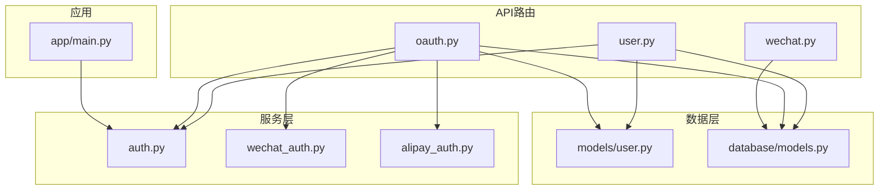
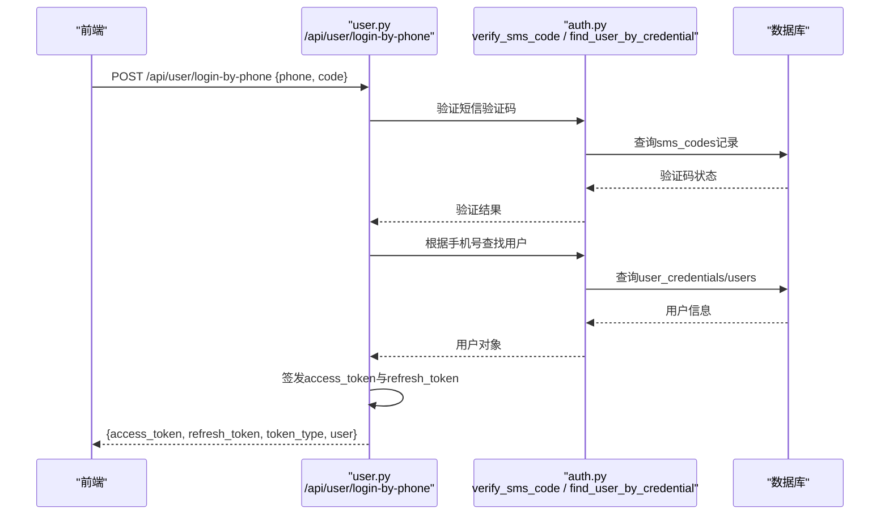
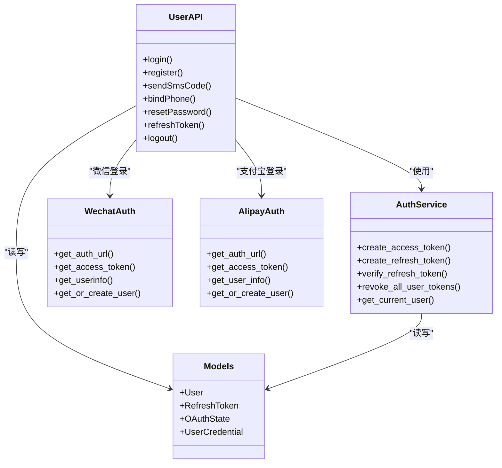

# 用户认证API

<cite>
**本文引用的文件**   
- [web/backend/api/user.py](file://web/backend/api/user.py)
- [web/backend/services/auth.py](file://web/backend/services/auth.py)
- [web/backend/api/oauth.py](file://web/backend/api/oauth.py)
- [web/backend/services/wechat_auth.py](file://web/backend/services/wechat_auth.py)
- [web/backend/services/alipay_auth.py](file://web/backend/services/alipay_auth.py)
- [web/backend/models/user.py](file://web/backend/models/user.py)
- [web/backend/database/models.py](file://web/backend/database/models.py)
- [web/backend/app/main.py](file://web/backend/app/main.py)
</cite>

## 目录
1. [简介](#简介)
2. [项目结构](#项目结构)
3. [核心组件](#核心组件)
4. [架构总览](#架构总览)
5. [详细接口说明](#详细接口说明)
6. [依赖关系分析](#依赖关系分析)
7. [性能与可扩展性](#性能与可扩展性)
8. [故障排查指南](#故障排查指南)
9. [结论](#结论)
10. [附录：安全最佳实践](#附录安全最佳实践)

## 简介
本文件为用户认证模块的完整API文档，覆盖以下能力：
- 多方式注册与登录（用户名/邮箱/手机号、短信验证码、邮箱验证码）
- JWT访问令牌与刷新令牌管理（签发、校验、刷新、撤销）
- OAuth第三方登录（微信、支付宝），含状态参数与轮询机制
- 密码设置与重置（基于短信或邮箱验证码）
- 绑定/解绑手机号与邮箱
- 登出（撤销全部刷新令牌）

所有端点均提供HTTP方法、URL路径、请求参数、响应格式与错误码说明，并附带典型流程示例与安全建议。

## 项目结构
认证相关代码主要分布在后端FastAPI应用中：
- API路由层：user.py、oauth.py、wechat.py
- 服务层：auth.py（JWT与密码）、wechat_auth.py、alipay_auth.py
- 数据模型：models/user.py（Pydantic请求/响应）、database/models.py（ORM）
- 应用启动与生命周期：main.py（定时清理过期刷新令牌）

图表来源
- [web/backend/api/user.py:1-120](file://web/backend/api/user.py#L1-L120)
- [web/backend/api/oauth.py:1-60](file://web/backend/api/oauth.py#L1-L60)
- [web/backend/services/auth.py:1-120](file://web/backend/services/auth.py#L1-L120)
- [web/backend/services/wechat_auth.py:1-80](file://web/backend/services/wechat_auth.py#L1-L80)
- [web/backend/services/alipay_auth.py:1-120](file://web/backend/services/alipay_auth.py#L1-L120)
- [web/backend/models/user.py:1-120](file://web/backend/models/user.py#L1-L120)
- [web/backend/database/models.py:60-120](file://web/backend/database/models.py#L60-L120)
- [web/backend/app/main.py:240-278](file://web/backend/app/main.py#L240-L278)

章节来源
- [web/backend/api/user.py:1-120](file://web/backend/api/user.py#L1-L120)
- [web/backend/api/oauth.py:1-60](file://web/backend/api/oauth.py#L1-L60)
- [web/backend/services/auth.py:1-120](file://web/backend/services/auth.py#L1-L120)
- [web/backend/models/user.py:1-120](file://web/backend/models/user.py#L1-L120)
- [web/backend/database/models.py:60-120](file://web/backend/database/models.py#L60-L120)
- [web/backend/app/main.py:240-278](file://web/backend/app/main.py#L240-L278)

## 核心组件
- 认证服务（auth.py）
  - 密码哈希与校验（bcrypt）
  - JWT访问令牌签发与解析（HS256，可配置过期时间）
  - 刷新令牌持久化（数据库表refresh_tokens），支持单条撤销与批量撤销
  - 当前用户解析（从Access Token提取sub=用户名，校验活跃与封禁状态）
- 用户API（user.py）
  - 多种登录/注册端点（用户名/邮箱/手机号、验证码、密码）
  - 绑定/解绑手机号与邮箱（需验证码）
  - 设置/重置密码（重置时强制撤销该用户全部刷新令牌）
  - 刷新令牌与登出（撤销全部刷新令牌）
- OAuth服务（oauth.py + wechat_auth.py + alipay_auth.py）
  - 生成授权URL与state（CSRF防护）
  - 回调处理（code换取access_token，获取用户信息，自动创建/关联用户）
  - 扫码状态轮询（status接口返回confirmed并下发令牌）
- 数据模型（models/user.py, database/models.py）
  - Pydantic模型定义请求/响应结构
  - ORM模型：User、RefreshToken、OAuthState、UserCredential等

章节来源
- [web/backend/services/auth.py:1-309](file://web/backend/services/auth.py#L1-L309)
- [web/backend/api/user.py:1-200](file://web/backend/api/user.py#L1-L200)
- [web/backend/api/oauth.py:1-169](file://web/backend/api/oauth.py#L1-L169)
- [web/backend/services/wechat_auth.py:1-156](file://web/backend/services/wechat_auth.py#L1-L156)
- [web/backend/services/alipay_auth.py:1-190](file://web/backend/services/alipay_auth.py#L1-L190)
- [web/backend/models/user.py:1-138](file://web/backend/models/user.py#L1-L138)
- [web/backend/database/models.py:60-180](file://web/backend/database/models.py#L60-L180)

## 架构总览
下图展示一次“手机验证码登录”的调用序列，体现前端、API、服务层与数据库之间的交互。

图表来源
- [web/backend/api/user.py:526-546](file://web/backend/api/user.py#L526-L546)
- [web/backend/services/auth.py:113-127](file://web/backend/services/auth.py#L113-L127)
- [web/backend/database/models.py:30-43](file://web/backend/database/models.py#L30-L43)

章节来源
- [web/backend/api/user.py:526-546](file://web/backend/api/user.py#L526-L546)
- [web/backend/services/auth.py:113-127](file://web/backend/services/auth.py#L113-L127)
- [web/backend/database/models.py:30-43](file://web/backend/database/models.py#L30-L43)

## 详细接口说明

### 通用约定
- 鉴权方式：Bearer Token（Authorization: Bearer <access_token>）
- 成功响应：JSON，包含业务字段；部分接口返回Token结构体
- 错误响应：HTTP状态码+detail消息，常见401/403/400/404/429/500

### 用户注册与登录

#### 用户名/密码登录
- 方法：POST
- 路径：/api/user/login
- 请求体：表单（username/password）
- 响应：Token（access_token, refresh_token, token_type, user）
- 错误码：401（用户名或密码错误）

章节来源
- [web/backend/api/user.py:217-229](file://web/backend/api/user.py#L217-L229)
- [web/backend/services/auth.py:153-176](file://web/backend/services/auth.py#L153-L176)

#### 手机号验证码登录
- 方法：POST
- 路径：/api/user/login-by-phone
- 请求体：{ phone, code }
- 响应：Token
- 错误码：401（验证码错误或已过期）、404（未注册）

章节来源
- [web/backend/api/user.py:526-546](file://web/backend/api/user.py#L526-L546)

#### 手机号+密码登录
- 方法：POST
- 路径：/api/user/login-by-phone-password
- 请求体：{ phone, password }
- 响应：Token
- 错误码：401（手机号或密码错误）、403（账号禁用）

章节来源
- [web/backend/api/user.py:548-580](file://web/backend/api/user.py#L548-L580)

#### 邮箱验证码登录
- 方法：POST
- 路径：/api/user/login-by-email
- 请求体：{ email, code }
- 响应：Token
- 错误码：401（验证码错误或已过期）、404（未注册）

章节来源
- [web/backend/api/user.py:582-602](file://web/backend/api/user.py#L582-L602)

#### 邮箱+密码登录
- 方法：POST
- 路径：/api/user/login-by-email-password
- 请求体：{ email, password }
- 响应：Token
- 错误码：401（邮箱或密码错误）、403（账号禁用）

章节来源
- [web/backend/api/user.py:664-696](file://web/backend/api/user.py#L664-L696)

#### 用户名注册
- 方法：POST
- 路径：/api/user/register
- 请求体：{ username, password, email? }
- 响应：用户信息（不含敏感字段）
- 错误码：400（用户名/邮箱重复）

章节来源
- [web/backend/api/user.py:364-417](file://web/backend/api/user.py#L364-L417)

#### 手机号注册
- 方法：POST
- 路径：/api/user/register-by-phone
- 请求体：{ phone, code, password? }
- 响应：Token
- 错误码：400（验证码错误或已过期、手机号已注册）

章节来源
- [web/backend/api/user.py:484-524](file://web/backend/api/user.py#L484-L524)

#### 邮箱注册
- 方法：POST
- 路径：/api/user/register-by-email
- 请求体：{ email, code, username?, password }
- 响应：Token
- 错误码：400（验证码错误或已过期、邮箱已注册、用户名重复）

章节来源
- [web/backend/api/user.py:604-662](file://web/backend/api/user.py#L604-L662)

### 验证码发送

#### 发送短信验证码
- 方法：POST
- 路径：/api/user/send-sms
- 请求体：{ phone }
- 响应：{ status, message[, code] }
- 错误码：429（IP维度限频）、500（发送失败）
- 备注：开发模式下可能直接返回验证码

章节来源
- [web/backend/api/user.py:454-467](file://web/backend/api/user.py#L454-L467)

#### 发送邮件验证码
- 方法：POST
- 路径：/api/user/send-email-code
- 请求体：{ email, purpose }（purpose: login|register|reset|bind）
- 响应：{ status, message[, code] }
- 错误码：429（IP维度限频）、500（发送失败）

章节来源
- [web/backend/api/user.py:469-482](file://web/backend/api/user.py#L469-L482)

### 绑定与解绑

#### 绑定手机号
- 方法：POST
- 路径：/api/user/bind-phone
- 请求体：{ phone, code }
- 响应：{ detail, credential_id }
- 错误码：400（验证码错误或已过期、冲突）

章节来源
- [web/backend/api/user.py:698-716](file://web/backend/api/user.py#L698-L716)

#### 绑定邮箱
- 方法：POST
- 路径：/api/user/bind-email
- 请求体：{ email, code }
- 响应：{ detail, credential_id }
- 错误码：400（验证码错误或已过期、冲突）

章节来源
- [web/backend/api/user.py:718-736](file://web/backend/api/user.py#L718-L736)

#### 解绑凭证
- 方法：DELETE
- 路径：/api/user/credentials/{credential_id}
- 响应：{ detail }
- 错误码：400（无法解绑最后一个登录方式）、404（凭证不存在）

章节来源
- [web/backend/api/user.py:738-754](file://web/backend/api/user.py#L738-L754)

#### 查看凭证列表
- 方法：GET
- 路径：/api/user/credentials
- 响应：[CredentialResponse...]

章节来源
- [web/backend/api/user.py:756-762](file://web/backend/api/user.py#L756-L762)

### 密码管理

#### 设置密码
- 方法：POST
- 路径：/api/user/set-password
- 请求体：{ password }
- 响应：{ detail }
- 说明：为社交登录用户首次设置密码

章节来源
- [web/backend/api/user.py:764-774](file://web/backend/api/user.py#L764-L774)

#### 重置密码
- 方法：POST
- 路径：/api/user/reset-password
- 请求体：{ cred_type, credential_id, code, new_password }
  - cred_type: phone|email
  - credential_id: 手机号或邮箱
- 响应：{ detail }
- 行为：重置成功后撤销该用户全部刷新令牌，强制其他设备重新登录
- 错误码：400（验证码错误或已过期）、404（账号不存在）

章节来源
- [web/backend/api/user.py:776-800](file://web/backend/api/user.py#L776-L800)

### 令牌管理

#### 刷新令牌
- 方法：POST
- 路径：/api/user/refresh-token
- 请求体：{ refresh_token }
- 响应：Token（新的access_token与refresh_token）
- 行为：旧refresh_token被撤销，颁发新refresh_token
- 错误码：401（刷新令牌无效或已过期）

章节来源
- [web/backend/api/user.py:803-821](file://web/backend/api/user.py#L803-L821)
- [web/backend/services/auth.py:96-151](file://web/backend/services/auth.py#L96-L151)

#### 登出
- 方法：POST
- 路径：/api/user/logout
- 响应：{ status, message }
- 行为：撤销该用户全部刷新令牌（包括其他设备）

章节来源
- [web/backend/api/user.py:823-827](file://web/backend/api/user.py#L823-L827)
- [web/backend/services/auth.py:140-151](file://web/backend/services/auth.py#L140-L151)

### 个人信息

#### 获取当前用户
- 方法：GET
- 路径：/api/user/me
- 鉴权：需要Bearer Token
- 响应：用户信息（含私有字段）

章节来源
- [web/backend/api/user.py:231-240](file://web/backend/api/user.py#L231-L240)

#### 更新昵称
- 方法：GET
- 路径：/api/user/check-nickname
- 查询参数：nickname
- 响应：{ available, reason? }

章节来源
- [web/backend/api/user.py:242-259](file://web/backend/api/user.py#L242-L259)

#### 更新个人资料
- 方法：PUT
- 路径：/api/user/me
- 请求体：UserProfileUpdate（username, patient_relation等）
- 说明：手机号/邮箱修改必须通过绑定流程完成
- 响应：用户信息

章节来源
- [web/backend/api/user.py:261-319](file://web/backend/api/user.py#L261-L319)

#### 上传头像
- 方法：POST
- 路径：/api/user/me/avatar
- 请求体：multipart/form-data（image/*，最大5MB）
- 响应：用户信息

章节来源
- [web/backend/api/user.py:321-362](file://web/backend/api/user.py#L321-L362)

### OAuth第三方登录

#### 微信授权URL
- 方法：GET
- 路径：/api/oauth/wechat/auth-url
- 响应：{ auth_url, state }
- 说明：前端跳转至auth_url进行扫码授权

章节来源
- [web/backend/api/oauth.py:39-45](file://web/backend/api/oauth.py#L39-L45)
- [web/backend/services/wechat_auth.py:36-53](file://web/backend/services/wechat_auth.py#L36-L53)

#### 微信回调
- 方法：POST
- 路径：/api/oauth/wechat/callback
- 请求体：{ code, state }
- 响应：Token
- 错误码：400（state无效或过期）、500（登录服务不可用）

章节来源
- [web/backend/api/oauth.py:47-77](file://web/backend/api/oauth.py#L47-L77)
- [web/backend/services/wechat_auth.py:80-114](file://web/backend/services/wechat_auth.py#L80-L114)

#### 微信登录状态轮询
- 方法：GET
- 路径：/api/oauth/wechat/status
- 查询参数：state
- 响应：{ status, access_token?, refresh_token?, token_type? }
- 说明：当status=confirmed时返回令牌

章节来源
- [web/backend/api/oauth.py:79-100](file://web/backend/api/oauth.py#L79-L100)

#### 支付宝授权URL
- 方法：GET
- 路径：/api/oauth/alipay/auth-url
- 响应：{ auth_url, state }

章节来源
- [web/backend/api/oauth.py:102-108](file://web/backend/api/oauth.py#L102-L108)
- [web/backend/services/alipay_auth.py:107-116](file://web/backend/services/alipay_auth.py#L107-L116)

#### 支付宝回调
- 方法：POST
- 路径：/api/oauth/alipay/callback
- 请求体：{ code, state }
- 响应：Token
- 错误码：400（state无效或过期、无法获取access_token）、500（登录服务不可用）

章节来源
- [web/backend/api/oauth.py:110-146](file://web/backend/api/oauth.py#L110-L146)
- [web/backend/services/alipay_auth.py:118-148](file://web/backend/services/alipay_auth.py#L118-L148)

#### 支付宝登录状态轮询
- 方法：GET
- 路径：/api/oauth/alipay/status
- 查询参数：state
- 响应：同微信status

章节来源
- [web/backend/api/oauth.py:148-169](file://web/backend/api/oauth.py#L148-L169)

### 微信JSSDK签名（辅助）
- 方法：GET
- 路径：/api/wechat/jssdk-config
- 查询参数：url（当前页面完整URL）
- 响应：{ appId, timestamp, nonceStr, signature }
- 用途：前端使用微信JS-SDK时的签名配置

章节来源
- [web/backend/api/wechat.py:75-93](file://web/backend/api/wechat.py#L75-L93)

## 依赖关系分析
- API层依赖服务层：
  - user.py依赖auth.py（JWT、密码、刷新令牌）、sms/email服务、credential服务
  - oauth.py依赖wechat_auth.py、alipay_auth.py以及auth.py
- 数据层：
  - models/user.py定义请求/响应结构
  - database/models.py定义ORM模型（User、RefreshToken、OAuthState、UserCredential等）
- 应用层：
  - main.py中启动后台任务定期清理过期/撤销的刷新令牌，防止数据库膨胀

图表来源
- [web/backend/api/user.py:1-200](file://web/backend/api/user.py#L1-L200)
- [web/backend/services/auth.py:1-151](file://web/backend/services/auth.py#L1-L151)
- [web/backend/services/wechat_auth.py:1-156](file://web/backend/services/wechat_auth.py#L1-L156)
- [web/backend/services/alipay_auth.py:1-190](file://web/backend/services/alipay_auth.py#L1-L190)
- [web/backend/database/models.py:60-180](file://web/backend/database/models.py#L60-L180)

章节来源
- [web/backend/api/user.py:1-200](file://web/backend/api/user.py#L1-L200)
- [web/backend/services/auth.py:1-151](file://web/backend/services/auth.py#L1-L151)
- [web/backend/services/wechat_auth.py:1-156](file://web/backend/services/wechat_auth.py#L1-L156)
- [web/backend/services/alipay_auth.py:1-190](file://web/backend/services/alipay_auth.py#L1-L190)
- [web/backend/database/models.py:60-180](file://web/backend/database/models.py#L60-L180)

## 性能与可扩展性
- 刷新令牌清理：应用启动后每24小时执行一次清理，删除过期或被撤销的刷新令牌，避免数据库膨胀
- 验证码发送限流：按IP维度限制每小时发送次数，防止分布式刷验证码
- 头像上传大小限制：最大5MB，减少存储压力
- 异步审核：头像和昵称变更触发异步内容审核，不阻塞主流程

章节来源
- [web/backend/app/main.py:240-278](file://web/backend/app/main.py#L240-L278)
- [web/backend/api/user.py:419-452](file://web/backend/api/user.py#L419-L452)
- [web/backend/api/user.py:321-362](file://web/backend/api/user.py#L321-L362)

## 故障排查指南
- 401 无法验证凭据
  - 检查Authorization头是否携带正确的Bearer Token
  - Access Token是否过期（默认较长有效期，但仍可能因服务端策略调整而缩短）
- 401 刷新令牌无效或已过期
  - 确认refresh_token未被撤销或过期
  - 若密码重置过，刷新令牌会被全部撤销，需重新登录
- 403 账号已被封禁
  - 检查用户user_status是否为banned，必要时联系管理员解封
- 429 操作过于频繁
  - 验证码发送存在IP维度限频，等待一段时间再试
- 500 短信/邮件发送失败
  - 检查短信/邮件服务商配置与环境变量
- 微信/支付宝登录失败
  - 检查state是否有效且未过期
  - 检查回调地址与第三方平台配置一致
  - 查看日志中的具体错误信息

章节来源
- [web/backend/services/auth.py:179-252](file://web/backend/services/auth.py#L179-L252)
- [web/backend/api/user.py:803-827](file://web/backend/api/user.py#L803-L827)
- [web/backend/api/user.py:454-482](file://web/backend/api/user.py#L454-L482)
- [web/backend/api/oauth.py:47-100](file://web/backend/api/oauth.py#L47-L100)

## 结论
本认证模块提供了完善的用户注册、登录、令牌管理与第三方登录能力，结合验证码与权限控制，满足多端场景的安全需求。通过JWT与刷新令牌的组合，既保证了短期访问的安全性，又提升了用户体验。同时，系统内置了限流、清理、异步审核等机制，确保在高并发与长期运行下的稳定性。

## 附录：安全最佳实践
- 令牌管理
  - 将refresh_token安全存储（如HttpOnly Cookie或安全存储），避免泄露
  - Access Token尽量短效，配合刷新机制使用
  - 登出时务必调用logout接口撤销全部刷新令牌
- 密码安全
  - 使用强密码策略（长度、复杂度）
  - 重置密码后，系统会撤销全部刷新令牌，强制重新登录
- 验证码安全
  - 严格校验验证码目的（login/register/reset/bind）
  - 启用IP维度限频，防止滥用
- OAuth安全
  - 使用state参数防CSRF，并在服务端校验
  - 回调地址需与第三方平台配置一致
- 隐私保护
  - 敏感字段（手机号、邮箱）在批量列表中脱敏显示
  - 管理员查看联系方式需审计日志记录