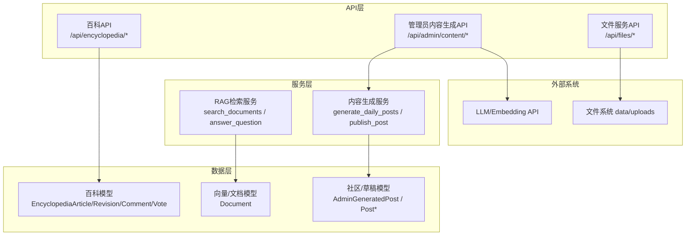
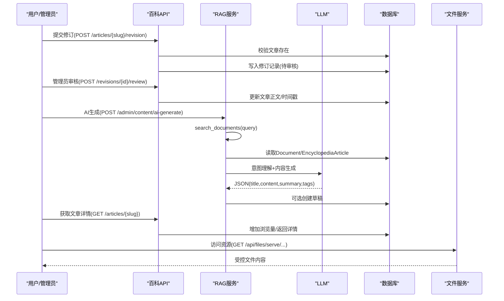
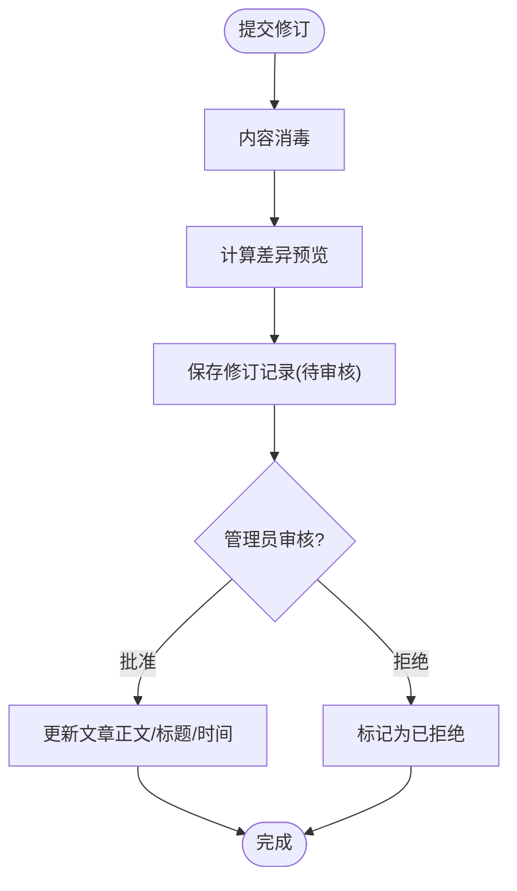
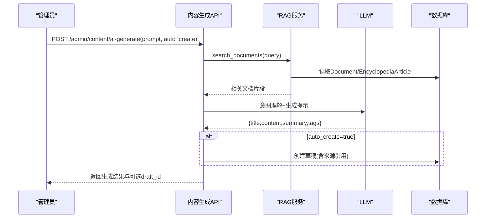
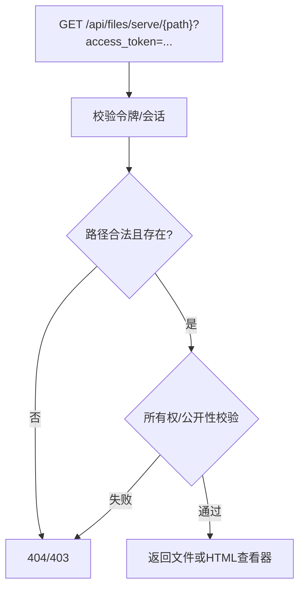
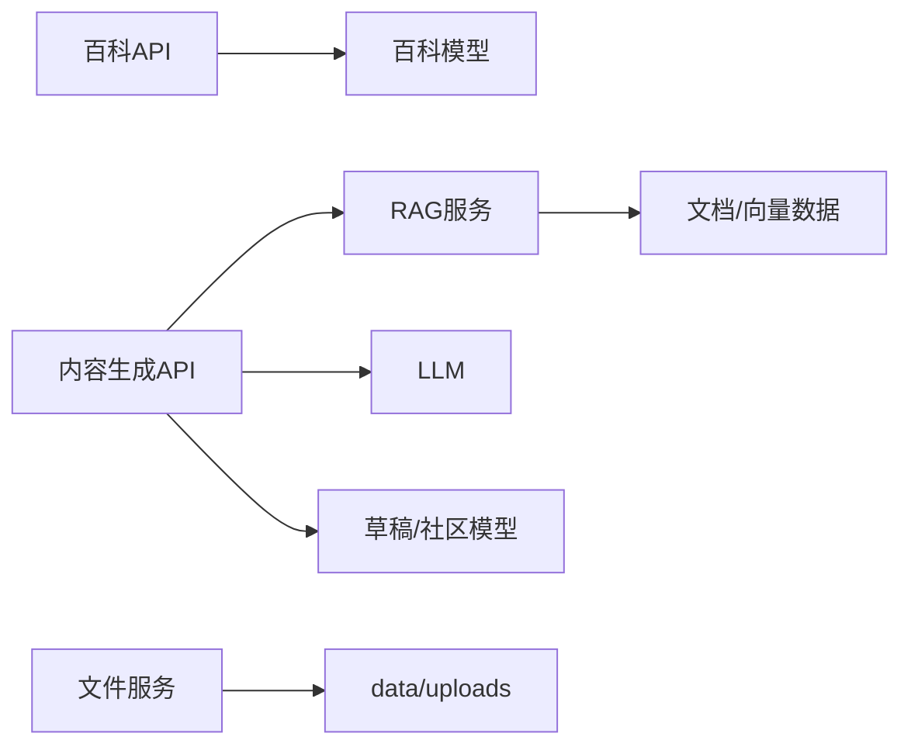
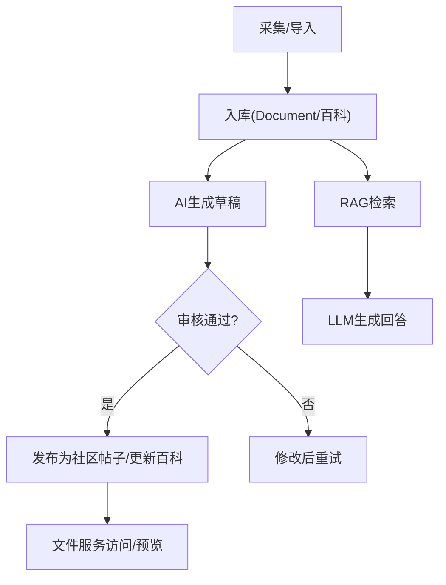

# 百科知识API

<cite>
**本文引用的文件**
- [encyclopedia.py](file://web/backend/api/encyclopedia.py)
- [models_encyclopedia.py](file://web/backend/database/models_encyclopedia.py)
- [content_generation_admin.py](file://web/backend/api/content_generation_admin.py)
- [content_generation.py](file://web/backend/services/content_generation.py)
- [rag.py](file://web/backend/services/rag.py)
- [files.py](file://web/backend/api/files.py)
- [cache.py](file://src/utils/cache.py)
- [import_encyclopedia_md.py](file://scripts/import_encyclopedia_md.py)
- [markdown_exporter.py](file://src/exporters/markdown_exporter.py)
- [web_config.yaml](file://configs/web_config.yaml)
</cite>

## 目录
1. [简介](#简介)
2. [项目结构](#项目结构)
3. [核心组件](#核心组件)
4. [架构总览](#架构总览)
5. [详细组件分析](#详细组件分析)
6. [依赖关系分析](#依赖关系分析)
7. [性能与缓存策略](#性能与缓存策略)
8. [故障排查指南](#故障排查指南)
9. [结论](#结论)
10. [附录：完整工作流示例](#附录完整工作流示例)

## 简介
本文件为“百科知识库”的API文档，覆盖内容CRUD、版本控制（修订与审核）、搜索索引（RAG向量/关键词混合检索）、分类标签、Markdown编辑与渲染、图片资源管理、AI内容生成（自动摘要、来源引用、质量评估）等能力。同时提供搜索优化、缓存策略与性能调优建议，并给出从采集到发布的内容管理工作流示例。

## 项目结构
后端采用FastAPI路由组织API，数据库模型定义在独立模块中；RAG服务负责检索与问答；内容生成服务对接LLM进行自动化内容生产；文件服务统一鉴权与访问控制；缓存工具提供轻量TTL存储；脚本支持将VitePress Markdown导入数据库。

**图表来源**
- [encyclopedia.py:187-586](file://web/backend/api/encyclopedia.py#L187-L586)
- [content_generation_admin.py:128-549](file://web/backend/api/content_generation_admin.py#L128-L549)
- [content_generation.py:272-425](file://web/backend/services/content_generation.py#L272-L425)
- [rag.py:456-523](file://web/backend/services/rag.py#L456-L523)
- [files.py:293-331](file://web/backend/api/files.py#L293-L331)

**章节来源**
- [encyclopedia.py:1-586](file://web/backend/api/encyclopedia.py#L1-L586)
- [content_generation_admin.py:1-549](file://web/backend/api/content_generation_admin.py#L1-L549)
- [content_generation.py:1-425](file://web/backend/services/content_generation.py#L1-L425)
- [rag.py:1-800](file://web/backend/services/rag.py#L1-L800)
- [files.py:1-503](file://web/backend/api/files.py#L1-L503)

## 核心组件
- 百科文章与修订：提供文章列表、详情、修订提交、修订历史、审核、回滚、投票、评论等接口。
- RAG检索：支持向量相似度与关键词混合检索，用于AI内容生成与问答。
- 内容生成：管理员通过自然语言提示生成草稿，支持自动创建草稿、批量发布。
- 文件服务：统一的文件上传、鉴权、预览与下载，支持PDF分页预览与HTML查看器。
- 缓存：SQLite-backed TTL缓存，可用于响应级或查询级缓存。
- 导入与导出：将VitePress Markdown导入百科库；支持Markdown导出。

**章节来源**
- [models_encyclopedia.py:18-134](file://web/backend/database/models_encyclopedia.py#L18-L134)
- [rag.py:456-523](file://web/backend/services/rag.py#L456-L523)
- [content_generation_admin.py:238-549](file://web/backend/api/content_generation_admin.py#L238-L549)
- [files.py:293-476](file://web/backend/api/files.py#L293-L476)
- [cache.py:16-147](file://src/utils/cache.py#L16-L147)
- [import_encyclopedia_md.py:83-97](file://scripts/import_encyclopedia_md.py#L83-L97)
- [markdown_exporter.py:104-131](file://src/exporters/markdown_exporter.py#L104-L131)

## 架构总览
百科知识库以API为中心，围绕“内容—检索—生成—发布—展示”的主链路构建。用户可浏览百科文章并提交修订，管理员审核通过后更新正文；AI内容生成基于RAG检索知识库与原始数据，产出草稿供管理员发布至社区；文件服务保障资源安全访问。

**图表来源**
- [encyclopedia.py:227-361](file://web/backend/api/encyclopedia.py#L227-L361)
- [content_generation_admin.py:343-549](file://web/backend/api/content_generation_admin.py#L343-L549)
- [rag.py:456-523](file://web/backend/services/rag.py#L456-L523)
- [files.py:293-331](file://web/backend/api/files.py#L293-L331)

## 详细组件分析

### 百科文章与修订（CRUD + 版本控制）
- 分类树与文章列表：按分类聚合已发布文章，返回标题、摘要、图标、更新时间等。
- 文章详情：按slug获取详情，自动增加浏览量，附带修订计数。
- 修订提交：用户提交新内容与变更说明，服务端做轻量消毒并生成diff预览，状态为待审核。
- 修订历史：按文章ID列出所有修订，支持按状态过滤。
- 审核与回滚：管理员可批准/拒绝修订；批准时更新文章正文与标题；支持回滚到指定版本。
- 投票：用户对修订进行点赞/点踩，支持切换与取消。
- 评论：支持树形回复，默认需审核。

**图表来源**
- [encyclopedia.py:139-183](file://web/backend/api/encyclopedia.py#L139-L183)
- [encyclopedia.py:227-361](file://web/backend/api/encyclopedia.py#L227-L361)

**章节来源**
- [encyclopedia.py:187-586](file://web/backend/api/encyclopedia.py#L187-L586)
- [models_encyclopedia.py:18-134](file://web/backend/database/models_encyclopedia.py#L18-L134)

### RAG检索与AI内容生成
- 检索策略：优先使用向量相似度（若启用），否则回退到关键词匹配；对无嵌入或维度不匹配的文档采用关键词结果合并，保证新内容即时可检索。
- 内容生成流程：解析管理员自然语言需求→提取关键词→检索知识库/原始数据/百科→组装提示词→调用LLM生成JSON→可选自动创建草稿→返回标题、正文、摘要、标签与来源。
- 质量与来源：生成结果包含来源引用列表，便于追溯与人工复核。

**图表来源**
- [content_generation_admin.py:343-549](file://web/backend/api/content_generation_admin.py#L343-L549)
- [rag.py:456-523](file://web/backend/services/rag.py#L456-L523)

**章节来源**
- [content_generation_admin.py:238-549](file://web/backend/api/content_generation_admin.py#L238-L549)
- [content_generation.py:272-425](file://web/backend/services/content_generation.py#L272-L425)
- [rag.py:456-523](file://web/backend/services/rag.py#L456-L523)

### 文件资源管理与预览
- 统一鉴权：通过短生命周期文件访问令牌或会话令牌验证访问权限，防止越权。
- 路径校验：严格限制请求路径位于uploads目录内，防止路径穿越。
- 多场景访问：社区图片、报告文件、IM图片、VASI训练图、临时文件等均有明确的所有权与公开性判定。
- 预览能力：PDF转页PNG后分页预览；图片全屏查看；不支持格式提供下载入口。

**图表来源**
- [files.py:37-94](file://web/backend/api/files.py#L37-L94)
- [files.py:138-227](file://web/backend/api/files.py#L138-L227)
- [files.py:293-331](file://web/backend/api/files.py#L293-L331)
- [files.py:373-476](file://web/backend/api/files.py#L373-L476)

**章节来源**
- [files.py:1-503](file://web/backend/api/files.py#L1-L503)

### Markdown编辑与富文本转换
- 前端渲染：使用MarkdownIt渲染，并通过DOMPurify进行XSS防护，保留必要的HTML块。
- 后端消毒：对修订内容执行轻量消毒，剔除危险标签与事件处理器，降低注入风险。
- 导入导出：支持将VitePress docs中的Markdown导入数据库；支持将论文/条目导出为Markdown（含frontmatter与免责声明）。

**章节来源**
- [encyclopedia.py:125-147](file://web/backend/api/encyclopedia.py#L125-L147)
- [import_encyclopedia_md.py:53-97](file://scripts/import_encyclopedia_md.py#L53-L97)
- [markdown_exporter.py:104-131](file://src/exporters/markdown_exporter.py#L104-L131)

### 分类与标签
- 百科分类：文章表包含category字段，列表接口按分类聚合返回。
- 内容生成标签：AI生成结果包含tags，并可结合预设标签池进行补充；草稿持久化tag_names。
- 社区标签：发布时将标签序列化为JSON存储，便于后续筛选与统计。

**章节来源**
- [encyclopedia.py:187-216](file://web/backend/api/encyclopedia.py#L187-L216)
- [content_generation.py:24-57](file://web/backend/services/content_generation.py#L24-L57)
- [content_generation_admin.py:100-125](file://web/backend/api/content_generation_admin.py#L100-L125)

## 依赖关系分析
- API与服务耦合：百科API直接操作百科模型；内容生成API依赖RAG服务与LLM配置；文件服务依赖认证与路径校验逻辑。
- 数据流向：RAG检索→LLM生成→草稿入库→发布为社区帖子；百科修订经审核后更新文章正文。
- 外部依赖：OpenAI兼容接口用于聊天与嵌入；SQLite缓存用于轻量缓存；文件系统用于资源存储。

**图表来源**
- [encyclopedia.py:187-586](file://web/backend/api/encyclopedia.py#L187-L586)
- [content_generation_admin.py:238-549](file://web/backend/api/content_generation_admin.py#L238-L549)
- [rag.py:456-523](file://web/backend/services/rag.py#L456-L523)
- [files.py:293-331](file://web/backend/api/files.py#L293-L331)

**章节来源**
- [content_generation_admin.py:238-549](file://web/backend/api/content_generation_admin.py#L238-L549)
- [rag.py:456-523](file://web/backend/services/rag.py#L456-L523)
- [files.py:293-331](file://web/backend/api/files.py#L293-L331)

## 性能与缓存策略
- 检索优化
  - 向量优先：当环境变量允许且配置有效时，优先使用embedding相似度检索；维度不匹配或异常时回退关键词。
  - 关键词回退：对无嵌入或维度不匹配的文档，通过关键词结果合并确保新内容即时可见。
  - 最近度与权威性加权：最终得分综合相似度、权威权重与发布时间，提升相关性。
- 缓存策略
  - 轻量缓存：使用SQLite-backed Cache实现TTL缓存，适用于热点查询或中间结果缓存。
  - 配置项：可通过web_config.yaml配置Redis URL与默认TTL，用于更高级缓存与会话。
- 性能建议
  - 合理设置top_k与max_tokens，避免过大上下文导致延迟上升。
  - 对高频读接口（如文章详情、分类树）可引入缓存层减少DB压力。
  - 文件服务通过短令牌访问，降低长链接暴露风险与带宽浪费。

**章节来源**
- [rag.py:456-523](file://web/backend/services/rag.py#L456-L523)
- [cache.py:16-147](file://src/utils/cache.py#L16-L147)
- [web_config.yaml:61-78](file://configs/web_config.yaml#L61-L78)

## 故障排查指南
- 404文章不存在：检查slug是否有效且is_published为真。
- 403无权访问：确认文件路径属于允许目录，且当前用户拥有访问权限或该资源为公开。
- 400修订已被处理：仅pending状态的修订可审核；已处理状态不可重复操作。
- AI生成失败：检查LLM配置（provider/base_url/api_key）与网络连通性；确认返回JSON可解析。
- 检索为空：确认RAG_USE_VECTOR与embedding配置；必要时回退关键词检索。

**章节来源**
- [encyclopedia.py:150-157](file://web/backend/api/encyclopedia.py#L150-L157)
- [encyclopedia.py:318-330](file://web/backend/api/encyclopedia.py#L318-L330)
- [files.py:55-94](file://web/backend/api/files.py#L55-L94)
- [content_generation_admin.py:496-499](file://web/backend/api/content_generation_admin.py#L496-L499)
- [rag.py:456-476](file://web/backend/services/rag.py#L456-L476)

## 结论
本API体系围绕百科内容的协作编辑、版本控制与AI增强生成，构建了从采集、检索、生成到发布的闭环。通过严格的文件鉴权与内容消毒，保障了安全性；借助RAG混合检索与缓存策略，提升了检索与响应性能。建议在大规模使用时结合Redis缓存与CDN加速，进一步优化体验。

## 附录：完整工作流示例
- 内容采集与入库
  - 使用爬虫/导入脚本将外部资料与VitePress Markdown导入数据库，形成Document与百科文章。
- 内容生成与草稿
  - 管理员调用AI生成接口，传入自然语言需求；系统检索知识库与百科，生成标题、正文、摘要与标签，可选择自动创建草稿。
- 审核与发布
  - 管理员审阅草稿，调整内容与标签后发布为社区帖子；或提交百科修订，经审核批准后更新文章正文。
- 资源管理
  - 上传图片/附件至data/uploads，通过文件服务鉴权访问；PDF可分页预览，图片可直接查看。
- 检索与问答
  - 用户提问时，RAG服务混合检索知识库与百科，结合LLM生成答案并推荐相关社区板块。

[本节为概念性流程图，无需源码映射]