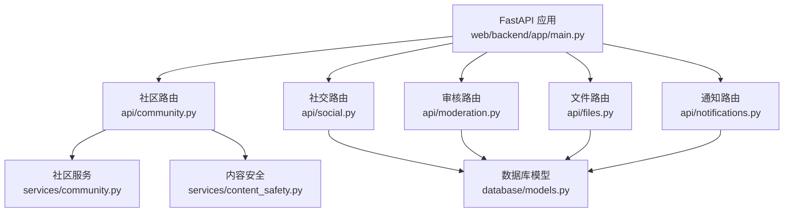
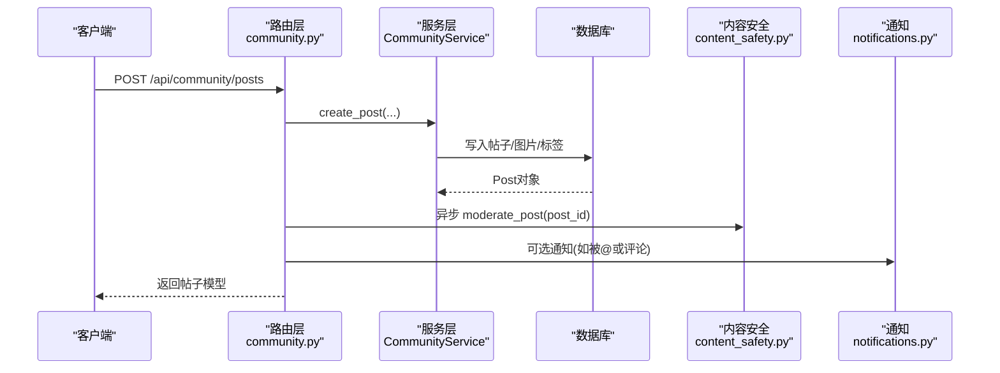
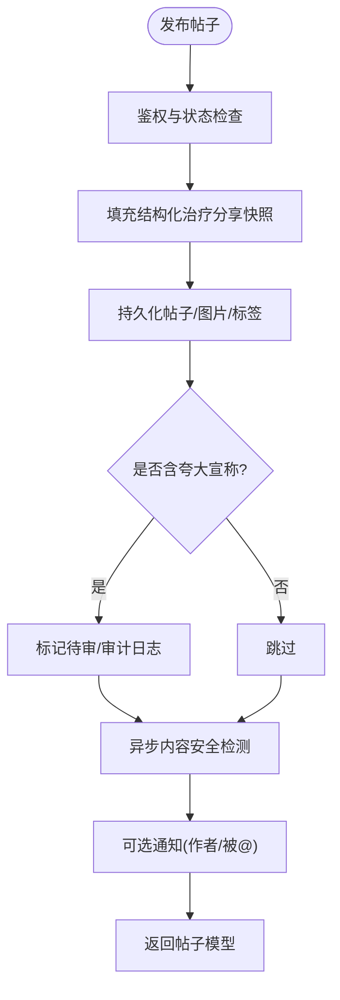
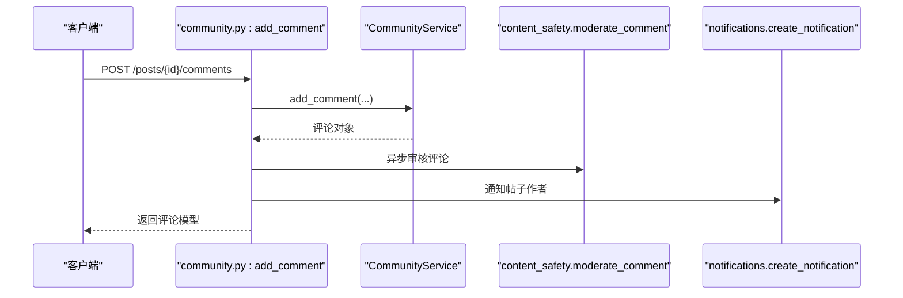
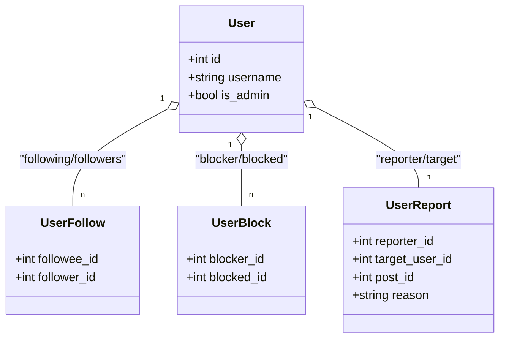
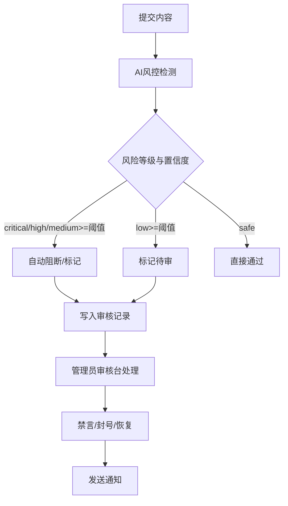
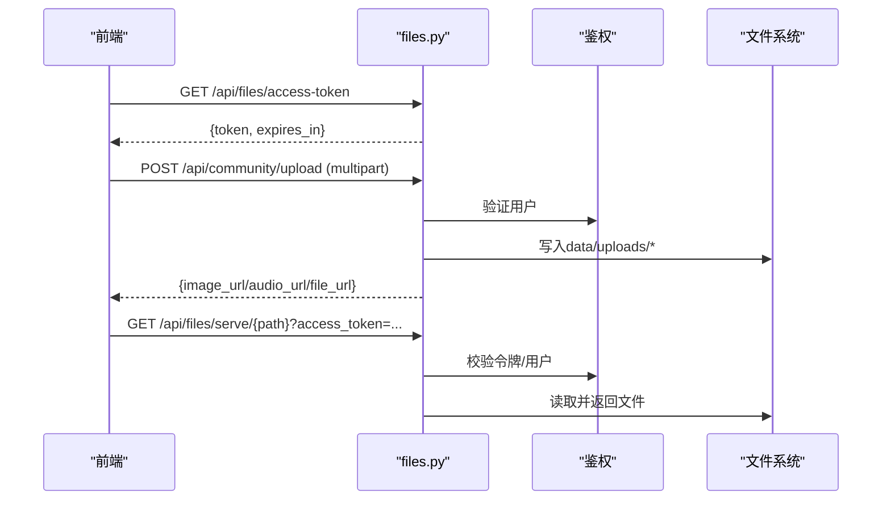
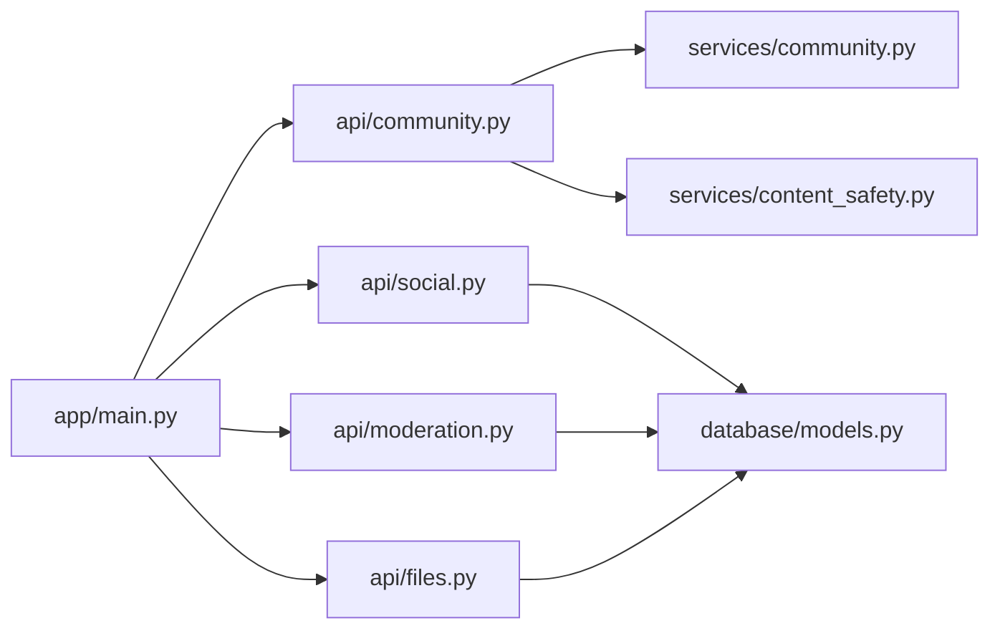

# 社区功能API

<cite>
**本文引用的文件**
- [web/backend/app/main.py](file://web/backend/app/main.py)
- [web/backend/api/community.py](file://web/backend/api/community.py)
- [web/backend/api/social.py](file://web/backend/api/social.py)
- [web/backend/api/moderation.py](file://web/backend/api/moderation.py)
- [web/backend/api/files.py](file://web/backend/api/files.py)
- [web/backend/api/notifications.py](file://web/backend/api/notifications.py)
- [web/backend/services/community.py](file://web/backend/services/community.py)
- [web/backend/models/community.py](file://web/backend/models/community.py)
- [web/backend/services/content_safety.py](file://web/backend/services/content_safety.py)
- [web/backend/database/models.py](file://web/backend/database/models.py)
</cite>

## 目录
1. [简介](#简介)
2. [项目结构](#项目结构)
3. [核心组件](#核心组件)
4. [架构总览](#架构总览)
5. [详细组件分析](#详细组件分析)
6. [依赖关系分析](#依赖关系分析)
7. [性能与扩展性](#性能与扩展性)
8. [故障排查指南](#故障排查指南)
9. [结论](#结论)
10. [附录：完整接口清单与调用示例](#附录完整接口清单与调用示例)

## 简介
本文件为社区平台“帖子发布、评论互动、关注关系、内容审核、富文本上传、社交功能（点赞/收藏/分享/标签）”的完整API文档。覆盖认证鉴权、权限控制、反垃圾策略、内容审核流程，并提供用户交互场景的调用示例与最佳实践。

## 项目结构
后端采用 FastAPI 模块化路由组织，社区相关能力集中在以下模块：
- 路由层：community、social、moderation、files、notifications
- 服务层：CommunityService、ContentSafety、RecommendationService（推荐/信息流）
- 数据模型：Post、Comment、Tag、UserFollow、UserBlock、UserReport、ContentModeration、UserNotification 等
- 应用入口：统一注册路由与中间件

图表来源
- [web/backend/app/main.py:280-319](file://web/backend/app/main.py#L280-L319)

章节来源
- [web/backend/app/main.py:280-319](file://web/backend/app/main.py#L280-L319)

## 核心组件
- 社区帖子与内容管理：创建/更新/删除/列表/详情、分类与标签、图片/音频/附件上传、视频嵌入、私密日记、同城定位、信息流（推荐/热门/关注/同城）。
- 评论互动：新增评论、分页查询、异步内容安全检测、评论通知。
- 社交关系：关注/取关、拉黑/取消拉黑、举报、公开主页与作品列表。
- 内容审核：AI风控判定、自动处置、管理员审核台、违规记录与处罚（禁言/封号）、通知。
- 文件与媒体：受控访问令牌、路径校验、按桶权限控制、PDF分页预览、IM图片上传。
- 通知：点赞/评论/关注/收藏等事件通知、未读数、批量已读。

章节来源
- [web/backend/api/community.py:219-353](file://web/backend/api/community.py#L219-L353)
- [web/backend/api/social.py:29-334](file://web/backend/api/social.py#L29-L334)
- [web/backend/api/moderation.py:108-370](file://web/backend/api/moderation.py#L108-L370)
- [web/backend/api/files.py:37-331](file://web/backend/api/files.py#L37-L331)
- [web/backend/api/notifications.py:84-186](file://web/backend/api/notifications.py#L84-L186)
- [web/backend/services/community.py:44-200](file://web/backend/services/community.py#L44-L200)
- [web/backend/services/content_safety.py:54-200](file://web/backend/services/content_safety.py#L54-L200)

## 架构总览
社区API通过路由层接收请求，调用服务层完成业务逻辑，持久化到数据库并触发通知或审核流程。文件服务提供细粒度访问控制与预览能力。

图表来源
- [web/backend/api/community.py:219-293](file://web/backend/api/community.py#L219-L293)
- [web/backend/services/community.py:136-200](file://web/backend/services/community.py#L136-L200)
- [web/backend/services/content_safety.py:103-145](file://web/backend/services/content_safety.py#L103-L145)
- [web/backend/api/notifications.py:84-109](file://web/backend/api/notifications.py#L84-L109)

## 详细组件分析

### 帖子与内容管理（发布/编辑/列表/详情/标签/上传）
- 发布帖子：支持标题、HTML/JSON内容、分类、图片、标签、视频、城市、私密/日记、结构化治疗分享；包含夸大宣称检查、审计日志、异步内容安全检测。
- 更新/删除：仅作者可操作，更新时同样处理结构化治疗分享与审计。
- 列表/详情：支持分类/标签/类型过滤、推荐/热门/关注/同城信息流、游标分页、私密可见性控制。
- 标签：更新帖子标签、获取热门标签、模糊搜索标签。
- 上传：图片/音频/通用文件上传，返回URL供前端富文本使用。

图表来源
- [web/backend/api/community.py:219-293](file://web/backend/api/community.py#L219-L293)
- [web/backend/services/community.py:87-134](file://web/backend/services/community.py#L87-L134)
- [web/backend/services/content_safety.py:103-145](file://web/backend/services/content_safety.py#L103-L145)

章节来源
- [web/backend/api/community.py:175-353](file://web/backend/api/community.py#L175-L353)
- [web/backend/api/community.py:683-757](file://web/backend/api/community.py#L683-L757)
- [web/backend/models/community.py:88-176](file://web/backend/models/community.py#L88-L176)

### 评论互动（新增/列表/安全检测/通知）
- 新增评论：需登录，写频限制，账号状态校验（封禁/禁言），异步内容安全检测，评论后通知帖子作者。
- 列表评论：分页查询，支持当前用户上下文。

图表来源
- [web/backend/api/community.py:587-643](file://web/backend/api/community.py#L587-L643)
- [web/backend/services/content_safety.py:190-200](file://web/backend/services/content_safety.py#L190-L200)
- [web/backend/api/notifications.py:84-109](file://web/backend/api/notifications.py#L84-L109)

章节来源
- [web/backend/api/community.py:587-660](file://web/backend/api/community.py#L587-L660)

### 社交关系（关注/取关/拉黑/举报/主页）
- 关注/取关：幂等关注、禁止关注自己、拉黑状态下不可关注。
- 拉黑/取消拉黑：自动解除双向关注。
- 举报：提交举报原因，关联帖子ID可选。
- 公开主页：统计发帖数、关注/粉丝数、是否已关注。

图表来源
- [web/backend/api/social.py:29-334](file://web/backend/api/social.py#L29-L334)
- [web/backend/database/models.py:88-137](file://web/backend/database/models.py#L88-L137)

章节来源
- [web/backend/api/social.py:29-334](file://web/backend/api/social.py#L29-L334)

### 内容审核（AI风控+人工审核+处罚）
- AI风控：基于LLM的风险等级与类别判定，自动处置（阻断/标记/放行）。
- 审核台：管理员查看待审、历史、用户违规档案，执行批准/拒绝/升级，支持禁言/封号。
- 通知：审核结果与处罚通知用户。

图表来源
- [web/backend/services/content_safety.py:54-145](file://web/backend/services/content_safety.py#L54-L145)
- [web/backend/api/moderation.py:108-370](file://web/backend/api/moderation.py#L108-L370)

章节来源
- [web/backend/services/content_safety.py:54-200](file://web/backend/services/content_safety.py#L54-L200)
- [web/backend/api/moderation.py:108-370](file://web/backend/api/moderation.py#L108-L370)

### 文件与媒体（上传/访问/预览）
- 上传：图片/音频/通用文件上传，返回URL；IM图片上传。
- 访问控制：短时效文件访问令牌、路径白名单、按桶权限校验（avatar/community/reports/files/im/temp/vasi）。
- 预览：PDF分页图片、图片全屏、不支持格式下载提示。

图表来源
- [web/backend/api/files.py:37-331](file://web/backend/api/files.py#L37-L331)
- [web/backend/api/community.py:683-757](file://web/backend/api/community.py#L683-L757)

章节来源
- [web/backend/api/files.py:37-331](file://web/backend/api/files.py#L37-L331)
- [web/backend/api/files.py:479-503](file://web/backend/api/files.py#L479-L503)

### 通知系统（点赞/评论/关注/收藏）
- 事件通知：点赞、评论、关注、收藏、私信、系统、审核等。
- 列表与未读：分页、未读计数、批量已读。

章节来源
- [web/backend/api/notifications.py:84-186](file://web/backend/api/notifications.py#L84-L186)

## 依赖关系分析
- 路由依赖：main.py 统一挂载各模块路由，形成清晰的命名空间。
- 服务耦合：community.py 强依赖 CommunityService 与 content_safety；social.py 依赖数据库模型；moderation.py 依赖 ContentModeration/UserViolation/UserNotification。
- 文件安全：files.py 对 data/uploads 下不同桶实施严格路径与所有权校验。

图表来源
- [web/backend/app/main.py:280-319](file://web/backend/app/main.py#L280-L319)
- [web/backend/api/community.py:1-21](file://web/backend/api/community.py#L1-L21)
- [web/backend/api/social.py:1-19](file://web/backend/api/social.py#L1-L19)
- [web/backend/api/moderation.py:1-22](file://web/backend/api/moderation.py#L1-L22)
- [web/backend/api/files.py:1-34](file://web/backend/api/files.py#L1-L34)

章节来源
- [web/backend/app/main.py:280-319](file://web/backend/app/main.py#L280-L319)

## 性能与扩展性
- 信息流分页：使用游标分页避免深度偏移查询；批量转换帖子模型减少N+1查询。
- 异步审核：发布/评论后异步调用内容安全检测，不阻塞主流程。
- 写频限制：写操作对用户进行限流，防止滥用。
- 文件访问：短时效令牌降低泄露风险；按桶权限控制提升安全性。
- 可扩展点：推荐/热门/同城信息流可通过 RecommendationService 扩展；内容安全可接入更多风控规则。

[本节为通用指导，无需特定文件引用]

## 故障排查指南
- 发布失败：检查用户状态（banned/muted）、写频限制、分类是否存在、结构化治疗分享字段合法性。
- 评论失败：确认账号未被封禁/禁言、帖子存在且可评论。
- 审核异常：检查LLM配置与网络；若异常会标记待审，需在审核台处理。
- 文件访问失败：确认访问令牌有效、路径在白名单内、桶权限匹配。
- 通知缺失：检查是否给自己发通知（会被忽略）、数据库写入是否成功。

章节来源
- [web/backend/api/community.py:219-293](file://web/backend/api/community.py#L219-L293)
- [web/backend/api/community.py:587-643](file://web/backend/api/community.py#L587-L643)
- [web/backend/services/content_safety.py:54-86](file://web/backend/services/content_safety.py#L54-L86)
- [web/backend/api/files.py:72-227](file://web/backend/api/files.py#L72-L227)
- [web/backend/api/notifications.py:84-109](file://web/backend/api/notifications.py#L84-L109)

## 结论
本API体系围绕社区内容生产与消费构建，覆盖从发布、互动到审核、权限与文件的完整闭环。通过异步审核、写频限制、细粒度文件访问控制与通知机制，兼顾用户体验与安全合规。建议在生产环境完善LLM风控策略、监控关键指标（审核通过率、违规率、文件访问失败率）并持续优化推荐与信息流质量。

[本节为总结，无需特定文件引用]

## 附录：完整接口清单与调用示例

### 认证与鉴权
- 所有需要登录的接口均要求携带有效令牌；部分接口支持可选用户上下文。
- 文件访问可使用短时效文件访问令牌，降低泄露风险。

章节来源
- [web/backend/api/files.py:37-48](file://web/backend/api/files.py#L37-L48)
- [web/backend/api/files.py:72-94](file://web/backend/api/files.py#L72-L94)

### 帖子与内容
- POST /api/community/posts：发布帖子（支持图片/视频/标签/城市/私密/日记/结构化治疗分享）
- PUT /api/community/posts/{post_id}：更新帖子
- DELETE /api/community/posts/{post_id}：删除帖子
- GET /api/community/posts：列表（支持分类/标签/类型/推荐/热门/关注/同城/私密过滤）
- GET /api/community/posts/{post_id}：详情
- PUT /api/community/posts/{post_id}/tags：更新标签
- GET /api/community/tags/hot：热门标签
- GET /api/community/categories：分类列表
- GET /api/community/my-diaries：我的日记
- GET /api/community/diary-calendar：日历条目

章节来源
- [web/backend/api/community.py:175-353](file://web/backend/api/community.py#L175-L353)
- [web/backend/models/community.py:88-176](file://web/backend/models/community.py#L88-L176)

### 评论
- POST /api/community/posts/{post_id}/comments：新增评论
- GET /api/community/posts/{post_id}/comments：评论列表

章节来源
- [web/backend/api/community.py:587-660](file://web/backend/api/community.py#L587-L660)

### 社交关系
- POST /api/community/follow/{user_id}：关注
- DELETE /api/community/follow/{user_id}：取关
- GET /api/community/follow/following：我关注的用户
- GET /api/community/follow/followers：关注我的用户
- POST /api/community/block/{user_id}：拉黑
- DELETE /api/community/block/{user_id}：取消拉黑
- GET /api/community/block/list：已拉黑列表
- POST /api/community/report：举报
- GET /api/community/profile/{user_id}：公开主页
- GET /api/community/profile/{user_id}/posts：用户公开帖子

章节来源
- [web/backend/api/social.py:29-334](file://web/backend/api/social.py#L29-L334)

### 内容审核
- GET /api/moderation/pending：待审列表（管理员）
- POST /api/moderation/{moderation_id}/review：审核处理（批准/拒绝/升级，支持禁言/封号）
- GET /api/moderation/user/{user_id}：用户违规档案（管理员）
- POST /api/moderation/user/{user_id}/action：管理员动作（mute/unmute/ban/unban）
- GET /api/moderation/notifications：通知列表（管理员）
- POST /api/moderation/notifications/{notification_id}/read：标记已读
- GET /api/moderation/notifications/unread-count：未读数
- GET /api/moderation/history：审核历史（管理员）

章节来源
- [web/backend/api/moderation.py:108-370](file://web/backend/api/moderation.py#L108-L370)

### 文件与媒体
- GET /api/files/access-token：获取文件访问令牌
- POST /api/community/upload：上传图片
- POST /api/community/upload/audio：上传音频
- POST /api/community/upload/file：上传文件
- GET /api/files/serve/{file_path}：受控文件访问
- GET /api/files/pages/{file_id}/{page_name}：PDF分页图片
- GET /api/files/view/{file_id}：在线预览（图片/PDF/下载）
- POST /api/files/upload/im-image：IM图片上传

章节来源
- [web/backend/api/files.py:37-331](file://web/backend/api/files.py#L37-L331)
- [web/backend/api/files.py:479-503](file://web/backend/api/files.py#L479-L503)

### 通知
- GET /api/notifications：通知列表（支持未读过滤）
- GET /api/notifications/unread-count：未读数
- POST /api/notifications/{id}/read：标记已读
- POST /api/notifications/read-all：全部已读

章节来源
- [web/backend/api/notifications.py:114-186](file://web/backend/api/notifications.py#L114-L186)

### 富文本编辑器集成要点
- 图片：先调用 /api/community/upload 获取图片URL，再插入富文本。
- 视频：在发布帖子时传入 video_url 与 video_thumbnail。
- 附件：通过 /api/community/upload/file 上传，将返回URL放入富文本。
- 安全：富文本内容会进入内容安全检测，必要时标记待审或被阻断。

章节来源
- [web/backend/api/community.py:219-293](file://web/backend/api/community.py#L219-L293)
- [web/backend/api/community.py:683-757](file://web/backend/api/community.py#L683-L757)
- [web/backend/services/content_safety.py:103-145](file://web/backend/services/content_safety.py#L103-L145)

### 权限控制与反垃圾策略
- 权限：
  - 私密帖子仅作者可见；非作者无法查看blocked内容。
  - 文件访问按桶与所有者校验，支持短时效令牌。
- 反垃圾：
  - 写频限制（limit_write_for_user）。
  - 账号状态校验（banned/muted）。
  - 夸大宣称检测与标记。
  - 异步AI内容安全检测，自动阻断或标记待审。

章节来源
- [web/backend/api/community.py:219-293](file://web/backend/api/community.py#L219-L293)
- [web/backend/api/files.py:121-227](file://web/backend/api/files.py#L121-L227)
- [web/backend/services/content_safety.py:54-145](file://web/backend/services/content_safety.py#L54-L145)

### 用户交互场景示例（步骤说明）
- 发布图文帖：
  1) 登录获取令牌
  2) 上传图片至 /api/community/upload，得到 image_url
  3) 调用 /api/community/posts，传入 title、content（含图片URL）、category_id、tag_names
  4) 等待异步审核结果（可在审核台查看）
- 评论并收到通知：
  1) 调用 /api/community/posts/{post_id}/comments 提交评论
  2) 后台异步审核评论
  3) 帖子作者收到评论通知
- 关注与同城信息流：
  1) 调用 /api/community/follow/{user_id} 关注
  2) 调用 /api/community/posts?feed_type=following 获取关注动态
  3) 如需同城，传入 city 或经纬度参数

[本节为流程说明，无需特定文件引用]