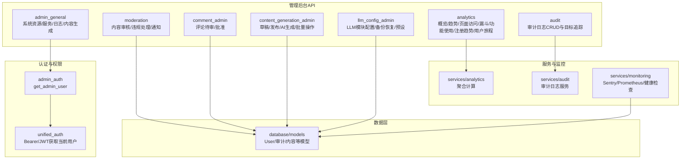
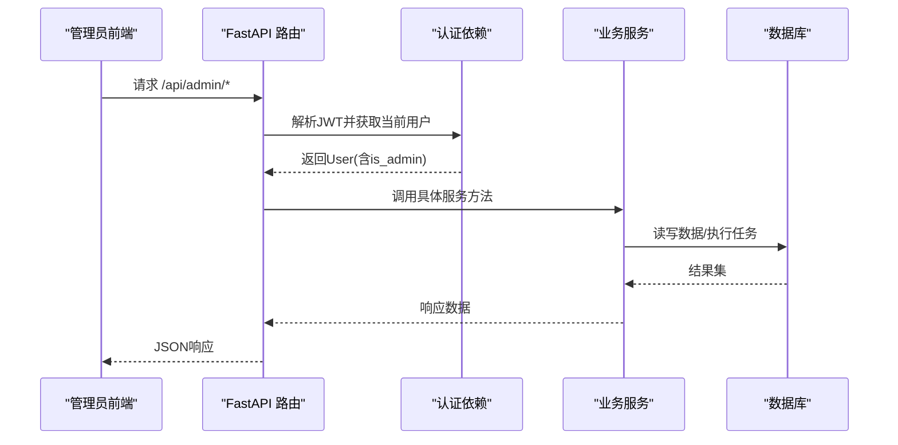
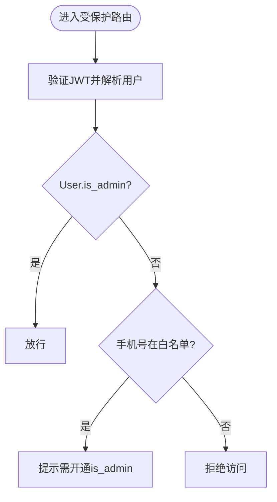
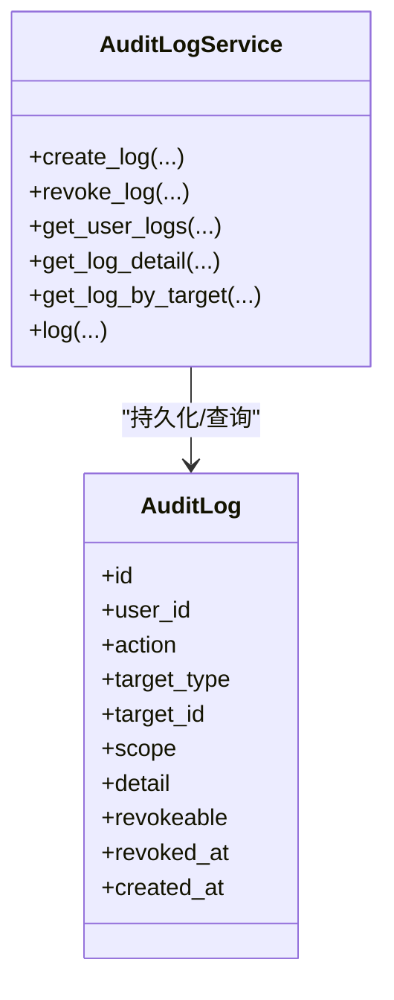
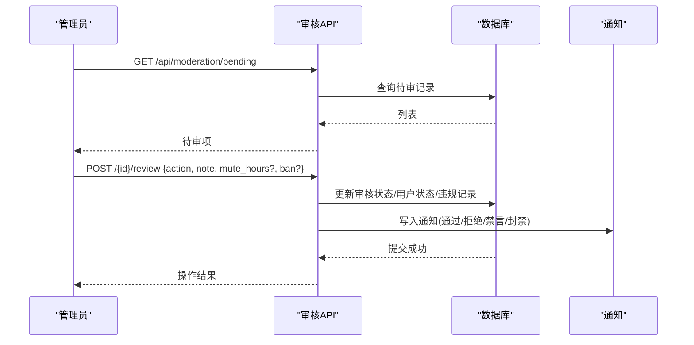
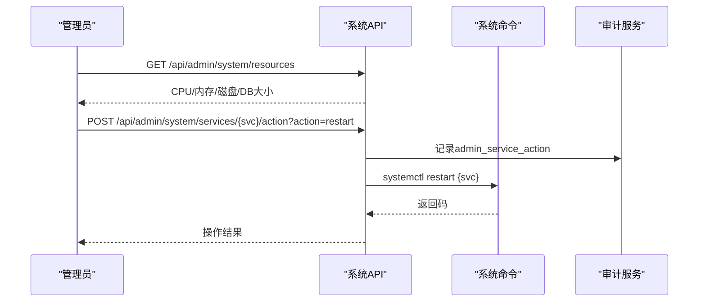
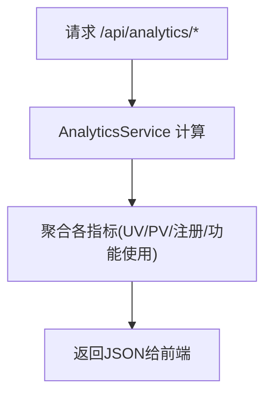
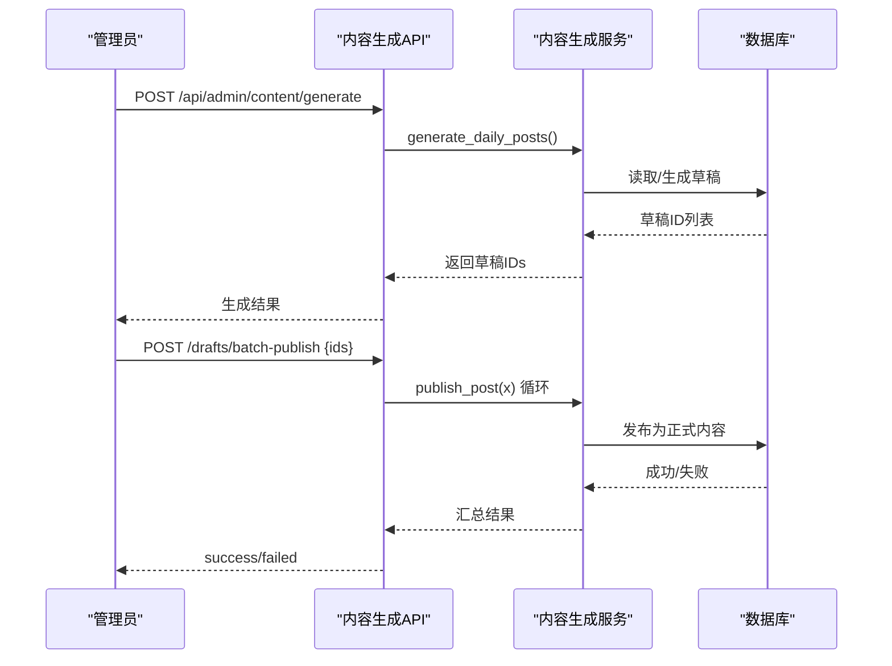
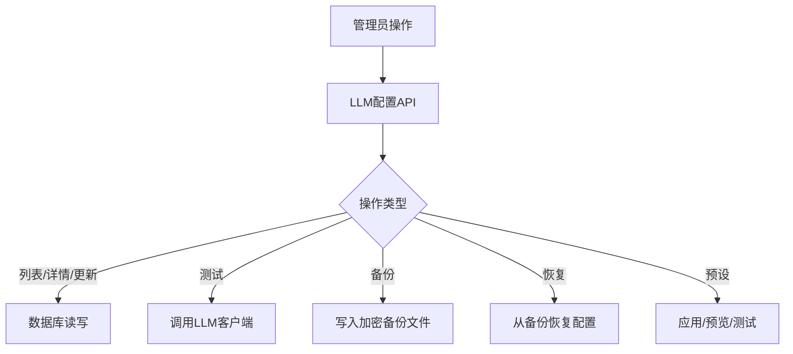
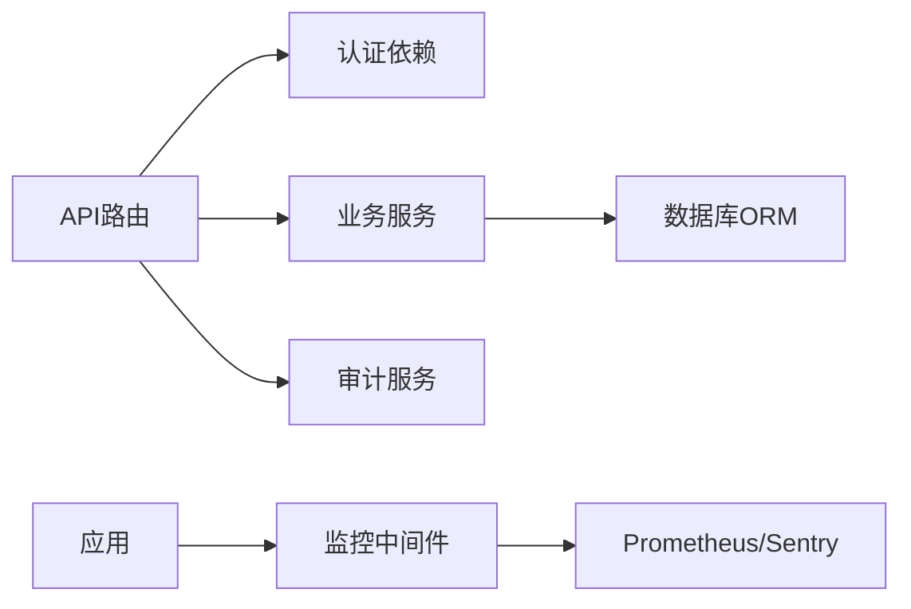

# 管理后台API

<cite>
**本文引用的文件**
- [web/backend/api/admin_general.py](file://web/backend/api/admin_general.py)
- [web/backend/api/analytics.py](file://web/backend/api/analytics.py)
- [web/backend/services/analytics.py](file://web/backend/services/analytics.py)
- [web/backend/api/audit.py](file://web/backend/api/audit.py)
- [web/backend/services/audit.py](file://web/backend/services/audit.py)
- [web/backend/api/moderation.py](file://web/backend/api/moderation.py)
- [web/backend/api/comment_admin.py](file://web/backend/api/comment_admin.py)
- [web/backend/api/content_generation_admin.py](file://web/backend/api/content_generation_admin.py)
- [web/backend/api/llm_config_admin.py](file://web/backend/api/llm_config_admin.py)
- [web/backend/services/admin_auth.py](file://web/backend/services/admin_auth.py)
- [web/backend/services/unified_auth.py](file://web/backend/services/unified_auth.py)
- [web/backend/services/monitoring.py](file://web/backend/services/monitoring.py)
- [web/backend/database/models.py](file://web/backend/database/models.py)
</cite>

## 目录
1. [简介](#简介)
2. [项目结构](#项目结构)
3. [核心组件](#核心组件)
4. [架构总览](#架构总览)
5. [详细组件分析](#详细组件分析)
6. [依赖关系分析](#依赖关系分析)
7. [性能考虑](#性能考虑)
8. [故障排查指南](#故障排查指南)
9. [结论](#结论)
10. [附录：接口清单与操作示例](#附录接口清单与操作示例)

## 简介
本文件为 Subskin 管理后台的 API 文档，覆盖用户管理、内容审核、系统监控、数据分析、配置管理等管理员专用能力。重点说明权限控制机制（管理员鉴权）、操作审计日志、系统健康检查、数据导出与批量操作、实时仪表板数据接口以及告警通知机制，并提供典型操作流程与最佳实践建议。

## 项目结构
后端采用 FastAPI 模块化路由组织，按功能划分多个 API 模块；鉴权与审计通过服务层统一封装；监控与指标由中间件提供；数据库模型集中在 ORM 定义中。

图表来源
- [web/backend/api/admin_general.py:20-228](file://web/backend/api/admin_general.py#L20-L228)
- [web/backend/api/analytics.py:11-88](file://web/backend/api/analytics.py#L11-L88)
- [web/backend/services/analytics.py:76-667](file://web/backend/services/analytics.py#L76-L667)
- [web/backend/api/audit.py:15-124](file://web/backend/api/audit.py#L15-L124)
- [web/backend/services/audit.py:11-136](file://web/backend/services/audit.py#L11-L136)
- [web/backend/api/moderation.py:22-418](file://web/backend/api/moderation.py#L22-L418)
- [web/backend/api/comment_admin.py:15-63](file://web/backend/api/comment_admin.py#L15-L63)
- [web/backend/api/content_generation_admin.py:24-549](file://web/backend/api/content_generation_admin.py#L24-L549)
- [web/backend/api/llm_config_admin.py:28-623](file://web/backend/api/llm_config_admin.py#L28-L623)
- [web/backend/services/admin_auth.py:1-56](file://web/backend/services/admin_auth.py#L1-L56)
- [web/backend/services/unified_auth.py:1-68](file://web/backend/services/unified_auth.py#L1-L68)
- [web/backend/services/monitoring.py:208-260](file://web/backend/services/monitoring.py#L208-L260)
- [web/backend/database/models.py:88-154](file://web/backend/database/models.py#L88-L154)

章节来源
- [web/backend/api/admin_general.py:20-228](file://web/backend/api/admin_general.py#L20-L228)
- [web/backend/api/analytics.py:11-88](file://web/backend/api/analytics.py#L11-L88)
- [web/backend/services/analytics.py:76-667](file://web/backend/services/analytics.py#L76-L667)
- [web/backend/api/audit.py:15-124](file://web/backend/api/audit.py#L15-L124)
- [web/backend/services/audit.py:11-136](file://web/backend/services/audit.py#L11-L136)
- [web/backend/api/moderation.py:22-418](file://web/backend/api/moderation.py#L22-L418)
- [web/backend/api/comment_admin.py:15-63](file://web/backend/api/comment_admin.py#L15-L63)
- [web/backend/api/content_generation_admin.py:24-549](file://web/backend/api/content_generation_admin.py#L24-L549)
- [web/backend/api/llm_config_admin.py:28-623](file://web/backend/api/llm_config_admin.py#L28-L623)
- [web/backend/services/admin_auth.py:1-56](file://web/backend/services/admin_auth.py#L1-L56)
- [web/backend/services/unified_auth.py:1-68](file://web/backend/services/unified_auth.py#L1-L68)
- [web/backend/services/monitoring.py:208-260](file://web/backend/services/monitoring.py#L208-L260)
- [web/backend/database/models.py:88-154](file://web/backend/database/models.py#L88-L154)

## 核心组件
- 管理员鉴权：基于 JWT Bearer 的当前用户解析，再校验 is_admin 或环境白名单二次门控。
- 审计日志：统一的审计记录创建、查询、撤销与目标追踪，敏感信息脱敏。
- 内容审核：待审队列、审核动作（通过/拒绝/升级）、违规与封禁/禁言、通知。
- 系统监控：CPU/内存/磁盘/数据库大小、服务状态、日志拉取、服务重启/启动。
- 数据分析：概览、趋势、页面访问、漏斗、功能使用、注册趋势、用户旅程。
- 内容生成：草稿管理、AI 辅助生成、批量发布/删除。
- LLM 配置：模块配置、测试连通性、备份/恢复、预设一键应用。
- 健康检查：/api/health 端点，包含数据库与磁盘检查。

章节来源
- [web/backend/services/admin_auth.py:34-56](file://web/backend/services/admin_auth.py#L34-L56)
- [web/backend/services/unified_auth.py:18-53](file://web/backend/services/unified_auth.py#L18-L53)
- [web/backend/api/audit.py:33-124](file://web/backend/api/audit.py#L33-L124)
- [web/backend/services/audit.py:15-136](file://web/backend/services/audit.py#L15-L136)
- [web/backend/api/moderation.py:108-418](file://web/backend/api/moderation.py#L108-L418)
- [web/backend/api/admin_general.py:79-228](file://web/backend/api/admin_general.py#L79-L228)
- [web/backend/api/analytics.py:14-88](file://web/backend/api/analytics.py#L14-L88)
- [web/backend/services/analytics.py:244-667](file://web/backend/services/analytics.py#L244-L667)
- [web/backend/api/content_generation_admin.py:128-549](file://web/backend/api/content_generation_admin.py#L128-L549)
- [web/backend/api/llm_config_admin.py:115-623](file://web/backend/api/llm_config_admin.py#L115-L623)
- [web/backend/services/monitoring.py:208-260](file://web/backend/services/monitoring.py#L208-L260)

## 架构总览
管理后台 API 以 FastAPI Router 为单位暴露能力，统一通过认证依赖注入当前用户，再由服务层完成业务逻辑与数据访问。关键流程如下：

图表来源
- [web/backend/services/unified_auth.py:18-53](file://web/backend/services/unified_auth.py#L18-L53)
- [web/backend/services/admin_auth.py:34-56](file://web/backend/services/admin_auth.py#L34-L56)
- [web/backend/api/admin_general.py:25-228](file://web/backend/api/admin_general.py#L25-L228)
- [web/backend/api/analytics.py:14-88](file://web/backend/api/analytics.py#L14-L88)
- [web/backend/services/analytics.py:76-667](file://web/backend/services/analytics.py#L76-L667)

## 详细组件分析

### 权限控制机制
- 统一认证：支持 Bearer/JWT 方式获取当前用户，未携带或无效将返回未授权。
- 管理员校验：
  - 优先检查 User.is_admin；
  - 若不在 is_admin，但手机号在 ADMIN_PHONES 环境变量白名单中，仍会提示需先开通 is_admin；
  - 否则直接拒绝。
- 适用场景：所有 /api/admin/* 路由均通过 get_admin_user 保护。

图表来源
- [web/backend/services/unified_auth.py:18-53](file://web/backend/services/unified_auth.py#L18-L53)
- [web/backend/services/admin_auth.py:22-56](file://web/backend/services/admin_auth.py#L22-L56)

章节来源
- [web/backend/services/unified_auth.py:18-53](file://web/backend/services/unified_auth.py#L18-L53)
- [web/backend/services/admin_auth.py:22-56](file://web/backend/services/admin_auth.py#L22-L56)

### 操作审计日志
- 能力：创建日志、按用户分页查询、查看单条详情、撤销可撤销日志、按目标类型+ID查询审计轨迹（非管理员仅能查自身）。
- 安全：IP 地址脱敏存储；敏感字段过滤。
- 管理操作审计：如系统服务控制、LLM 配置变更等均可通过 AuditLogService.log 记录。

图表来源
- [web/backend/services/audit.py:11-136](file://web/backend/services/audit.py#L11-L136)
- [web/backend/database/models.py:88-154](file://web/backend/database/models.py#L88-L154)

章节来源
- [web/backend/api/audit.py:33-124](file://web/backend/api/audit.py#L33-L124)
- [web/backend/services/audit.py:15-136](file://web/backend/services/audit.py#L15-L136)

### 内容审核
- 待审列表：支持风险等级筛选、分页。
- 审核动作：
  - approved：标记内容通过，发送“已通过”通知；
  - rejected：标记内容阻止，可选禁言/封号，写入违规记录与通知；
  - escalated：升级处理。
- 用户管理：对指定用户执行 mute/unmute/ban/unban，并同步更新用户状态与违规记录，同时发送通知。
- 通知：支持列表、已读标记、未读数统计。

图表来源
- [web/backend/api/moderation.py:108-418](file://web/backend/api/moderation.py#L108-L418)

章节来源
- [web/backend/api/moderation.py:108-418](file://web/backend/api/moderation.py#L108-L418)

### 评论管理（管理员）
- 待审评论列表：分页获取。
- 批准/拒绝：仅管理员可操作。

章节来源
- [web/backend/api/comment_admin.py:18-63](file://web/backend/api/comment_admin.py#L18-L63)

### 系统监控与服务控制
- 资源监控：CPU、内存、磁盘、数据库文件大小、系统运行时间。
- 服务状态：查询 subskin-backend、subskin-scheduler、nginx 是否 active。
- 服务控制：仅允许 start/restart，禁止 stop 以避免站点不可恢复；每次操作均记录审计日志。
- 日志拉取：支持 journalctl 或文件 tail 模式。
- 健康检查：/api/health 检查数据库连接与磁盘空间。

图表来源
- [web/backend/api/admin_general.py:79-216](file://web/backend/api/admin_general.py#L79-L216)
- [web/backend/services/audit.py:94-136](file://web/backend/services/audit.py#L94-L136)
- [web/backend/services/monitoring.py:208-260](file://web/backend/services/monitoring.py#L208-L260)

章节来源
- [web/backend/api/admin_general.py:79-216](file://web/backend/api/admin_general.py#L79-L216)
- [web/backend/services/monitoring.py:208-260](file://web/backend/services/monitoring.py#L208-L260)

### 数据分析与实时监控仪表板
- 概览：总用户数、今日UV/PV、新增用户、活跃用户。
- 趋势：近N日 UV/PV/新增用户。
- 页面访问：Top 页面 UV/PV。
- 漏斗：访问→注册→登录→功能使用转化。
- 功能使用：AI问答、评估、报告上传、发帖、评论、点赞、百科浏览。
- 注册趋势：累计注册用户曲线。
- 用户旅程：会话级页面路径归一化，输出 Sankey 节点与边。

图表来源
- [web/backend/api/analytics.py:14-88](file://web/backend/api/analytics.py#L14-L88)
- [web/backend/services/analytics.py:244-667](file://web/backend/services/analytics.py#L244-L667)

章节来源
- [web/backend/api/analytics.py:14-88](file://web/backend/api/analytics.py#L14-L88)
- [web/backend/services/analytics.py:244-667](file://web/backend/services/analytics.py#L244-L667)

### 内容生成与批量操作
- 草稿管理：列表、详情、更新、删除，支持状态与分类筛选、排序与分页。
- AI 生成：根据自然语言需求检索知识库/原始数据/百科，生成标题、正文、摘要、标签与来源引用，可选择自动创建草稿。
- 发布：单条发布与批量发布，失败项单独返回错误。
- 批量删除：仅允许删除未发布的草稿。

图表来源
- [web/backend/api/content_generation_admin.py:128-549](file://web/backend/api/content_generation_admin.py#L128-L549)

章节来源
- [web/backend/api/content_generation_admin.py:128-549](file://web/backend/api/content_generation_admin.py#L128-L549)

### LLM 配置管理
- 模块配置：列出、获取详情、更新、测试连通性。
- 供应商与模型：列出推荐供应商及模型映射。
- 备份/恢复：备份到文件（密文存储），恢复时兼容明文与密文，接口一律掩码返回。
- 预设：查看预设、预览差异、应用预设、针对模块应用预设、测试模块。

图表来源
- [web/backend/api/llm_config_admin.py:115-623](file://web/backend/api/llm_config_admin.py#L115-L623)

章节来源
- [web/backend/api/llm_config_admin.py:115-623](file://web/backend/api/llm_config_admin.py#L115-L623)

### 数据导出与批量操作
- 数据导出：
  - 每日简报：列出与触发生成（异步子进程），便于后续导出。
  - 向量化批量：手动触发对 embedding=NULL 的文档进行批量向量化。
- 批量操作：
  - 草稿批量发布/删除。
  - 内容审核批量处理（结合审核历史与列表）。
  - LLM 配置批量应用预设。

章节来源
- [web/backend/api/admin_general.py:25-74](file://web/backend/api/admin_general.py#L25-L74)
- [web/backend/api/admin_general.py:219-228](file://web/backend/api/admin_general.py#L219-L228)
- [web/backend/api/content_generation_admin.py:277-318](file://web/backend/api/content_generation_admin.py#L277-L318)
- [web/backend/api/llm_config_admin.py:416-500](file://web/backend/api/llm_config_admin.py#L416-L500)

### 告警通知机制
- 内容审核相关通知：通过/拒绝/禁言/封禁等事件写入通知表，支持列表、已读标记与未读数。
- 系统监控：
  - Sentry：可选集成，用于异常上报与过滤敏感信息。
  - Prometheus：可选启用，暴露 /metrics 端点收集HTTP请求计数、耗时、并发等指标。
  - 健康检查：/api/health 返回服务健康状态。

章节来源
- [web/backend/api/moderation.py:328-370](file://web/backend/api/moderation.py#L328-L370)
- [web/backend/services/monitoring.py:28-91](file://web/backend/services/monitoring.py#L28-L91)
- [web/backend/services/monitoring.py:96-203](file://web/backend/services/monitoring.py#L96-L203)
- [web/backend/services/monitoring.py:208-260](file://web/backend/services/monitoring.py#L208-L260)

## 依赖关系分析
- 路由层依赖认证依赖注入（统一认证与管理员鉴权）。
- 业务服务层负责聚合计算、外部工具调用与数据库交互。
- 审计服务贯穿管理操作，确保可追溯。
- 监控中间件对 HTTP 请求进行指标采集与健康检查。

图表来源
- [web/backend/services/unified_auth.py:18-53](file://web/backend/services/unified_auth.py#L18-L53)
- [web/backend/services/admin_auth.py:34-56](file://web/backend/services/admin_auth.py#L34-L56)
- [web/backend/services/audit.py:15-136](file://web/backend/services/audit.py#L15-L136)
- [web/backend/services/monitoring.py:96-203](file://web/backend/services/monitoring.py#L96-L203)

章节来源
- [web/backend/services/unified_auth.py:18-53](file://web/backend/services/unified_auth.py#L18-L53)
- [web/backend/services/admin_auth.py:34-56](file://web/backend/services/admin_auth.py#L34-L56)
- [web/backend/services/audit.py:15-136](file://web/backend/services/audit.py#L15-L136)
- [web/backend/services/monitoring.py:96-203](file://web/backend/services/monitoring.py#L96-L203)

## 性能考虑
- 分页与限制：列表接口普遍支持 limit/offset/page，避免一次性返回大量数据。
- 指标采集：Prometheus 中间件使用路由模板作为维度，降低基数爆炸风险。
- 异步与超时：系统服务控制与子进程调用设置超时，防止阻塞。
- 数据过滤：分析服务排除测试账号与管理员流量，保证指标准确性。
- 缓存与索引：数据库模型对常用字段建立索引（如用户UID、凭证查找等）。

[本节为通用指导，不直接分析具体文件]

## 故障排查指南
- 权限问题：确认 JWT 有效且用户 is_admin；若手机号在白名单但未开通 is_admin，需先执行管理员开通流程。
- 服务控制失败：检查 systemctl 可用性与服务名是否在允许列表；注意 stop 被禁用以防站点不可恢复。
- 审计日志：通过目标追踪接口查看特定对象的修改轨迹；非管理员只能看到自身操作。
- 监控与告警：
  - 健康检查：/api/health 返回 unhealthy 时检查数据库连接与磁盘空间。
  - Prometheus：确认 PROMETHEUS_ENABLED=true 且 prometheus-client 已安装。
  - Sentry：确认 SENTRY_DSN 配置正确，敏感头会被过滤。
- 内容生成失败：检查 LLM 配置与网络连通性；必要时使用测试模块配置接口验证。

章节来源
- [web/backend/services/admin_auth.py:34-56](file://web/backend/services/admin_auth.py#L34-L56)
- [web/backend/api/admin_general.py:135-189](file://web/backend/api/admin_general.py#L135-L189)
- [web/backend/api/audit.py:101-124](file://web/backend/api/audit.py#L101-L124)
- [web/backend/services/monitoring.py:208-260](file://web/backend/services/monitoring.py#L208-L260)
- [web/backend/api/llm_config_admin.py:161-182](file://web/backend/api/llm_config_admin.py#L161-L182)

## 结论
本管理后台 API 围绕管理员权限、审计可追溯、内容治理、系统运维与数据分析构建完整闭环。通过统一认证与管理员鉴权保障安全，借助审计日志与监控指标实现可观测与可回溯，配合内容审核与批量操作提升运营效率。建议在生产环境中启用 Sentry 与 Prometheus，严格限制管理员账号数量，并对高危操作（如服务控制）强制审计。

[本节为总结，不直接分析具体文件]

## 附录：接口清单与操作示例

### 管理员综合
- GET /api/admin/content/briefings：列出每日简报（分页）
- POST /api/admin/content/generate-briefing：触发生成简报
- GET /api/admin/system/resources：系统资源监控
- GET /api/admin/system/services：服务状态
- POST /api/admin/system/services/{service_name}/action：服务控制（start/restart）
- GET /api/admin/system/logs：系统日志拉取
- POST /api/admin/embed-batch：批量向量化

章节来源
- [web/backend/api/admin_general.py:25-228](file://web/backend/api/admin_general.py#L25-L228)

### 数据分析
- GET /api/analytics/overview：概览
- GET /api/analytics/trend：趋势
- GET /api/analytics/page-views：页面访问
- GET /api/analytics/funnel：漏斗
- GET /api/analytics/feature-usage：功能使用
- GET /api/analytics/registration-trend：注册趋势
- GET /api/analytics/user-journeys：用户旅程

章节来源
- [web/backend/api/analytics.py:14-88](file://web/backend/api/analytics.py#L14-L88)
- [web/backend/services/analytics.py:244-667](file://web/backend/services/analytics.py#L244-L667)

### 审计日志
- POST /api/audit/logs：创建审计日志
- GET /api/audit/logs：按用户分页查询
- GET /api/audit/logs/{log_id}：查看详情
- POST /api/audit/logs/{log_id}/revoke：撤销日志
- GET /api/audit/target/{target_type}/{target_id}：目标审计轨迹

章节来源
- [web/backend/api/audit.py:33-124](file://web/backend/api/audit.py#L33-L124)
- [web/backend/services/audit.py:15-136](file://web/backend/services/audit.py#L15-L136)

### 内容审核
- GET /api/moderation/pending：待审列表
- POST /api/moderation/{moderation_id}/review：审核动作
- GET /api/moderation/user/{user_id}：用户审核画像
- POST /api/moderation/user/{user_id}/action：用户处置（mute/unmute/ban/unban）
- GET /api/moderation/notifications：通知列表
- POST /api/moderation/notifications/{notification_id}/read：标记已读
- GET /api/moderation/notifications/unread-count：未读数
- GET /api/moderation/history：审核历史

章节来源
- [web/backend/api/moderation.py:108-418](file://web/backend/api/moderation.py#L108-L418)

### 评论管理（管理员）
- GET /api/comment_admin/pending：待审评论
- POST /api/comment_admin/{comment_id}/approve：批准/拒绝

章节来源
- [web/backend/api/comment_admin.py:18-63](file://web/backend/api/comment_admin.py#L18-L63)

### 内容生成（管理员）
- GET /api/admin/content/drafts：草稿列表
- GET /api/admin/content/drafts/{draft_id}：草稿详情
- PUT /api/admin/content/drafts/{draft_id}：更新草稿
- DELETE /api/admin/content/drafts/{draft_id}：删除草稿
- POST /api/admin/content/generate：批量生成草稿
- POST /api/admin/content/drafts/{draft_id}/publish：发布草稿
- POST /api/admin/content/drafts/batch-publish：批量发布
- DELETE /api/admin/content/drafts/batch：批量删除
- POST /api/admin/content/ai-generate：AI 生成内容

章节来源
- [web/backend/api/content_generation_admin.py:128-549](file://web/backend/api/content_generation_admin.py#L128-L549)

### LLM 配置（管理员）
- GET /api/admin/llm/modules：模块列表
- GET /api/admin/llm/modules/{module_key}：模块详情
- PUT /api/admin/llm/modules/{module_key}：更新模块
- POST /api/admin/llm/modules/{module_key}/test：测试配置
- GET /api/admin/llm/providers：供应商列表
- POST /api/admin/llm/refresh：从环境刷新
- POST /api/admin/llm/backup：备份配置
- GET /api/admin/llm/backup：获取备份
- POST /api/admin/llm/backup/restore：恢复配置
- GET /api/admin/llm/presets：预设列表
- POST /api/admin/llm/presets/apply：应用预设
- POST /api/admin/llm/presets/{preset_key}/apply-module：对模块应用预设
- GET /api/admin/llm/presets/{preset_key}/preview：预览差异
- POST /api/admin/llm/presets/{preset_key}/test-module：测试模块

章节来源
- [web/backend/api/llm_config_admin.py:115-623](file://web/backend/api/llm_config_admin.py#L115-L623)

### 健康检查
- GET /api/health：健康检查（数据库/磁盘）

章节来源
- [web/backend/services/monitoring.py:208-260](file://web/backend/services/monitoring.py#L208-L260)