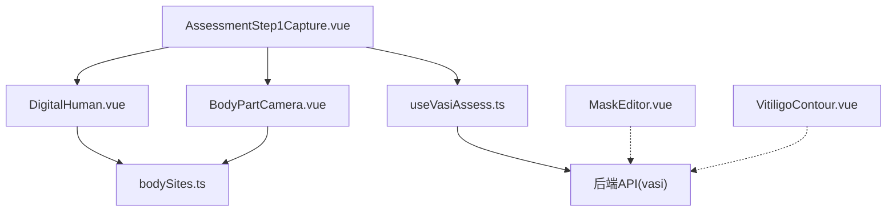
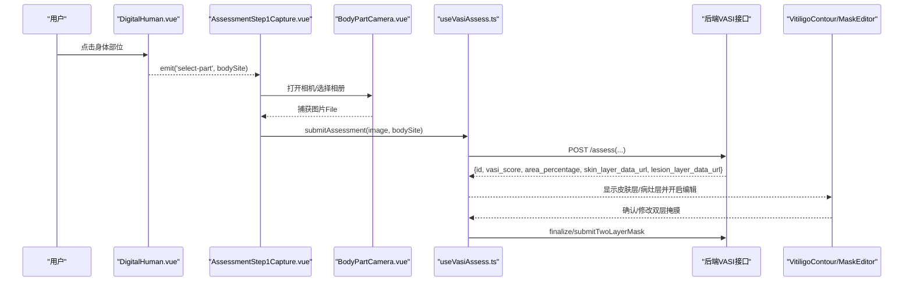
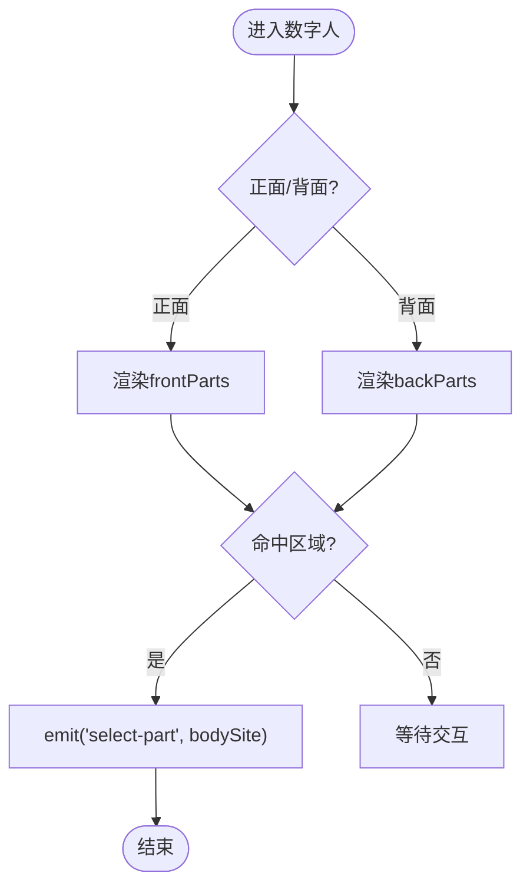
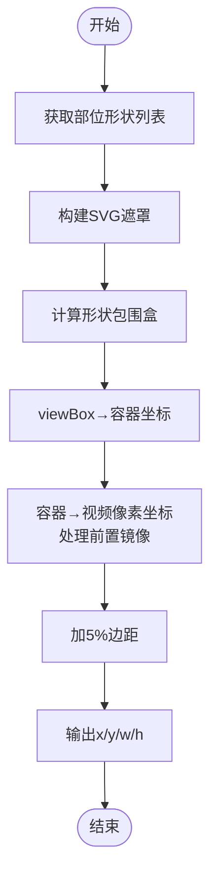
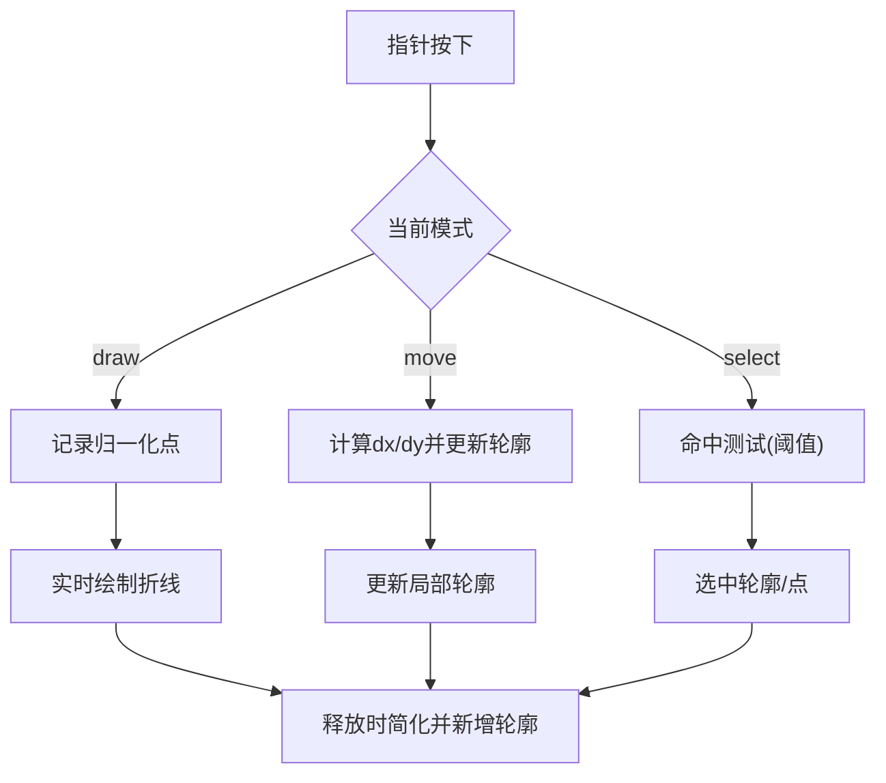
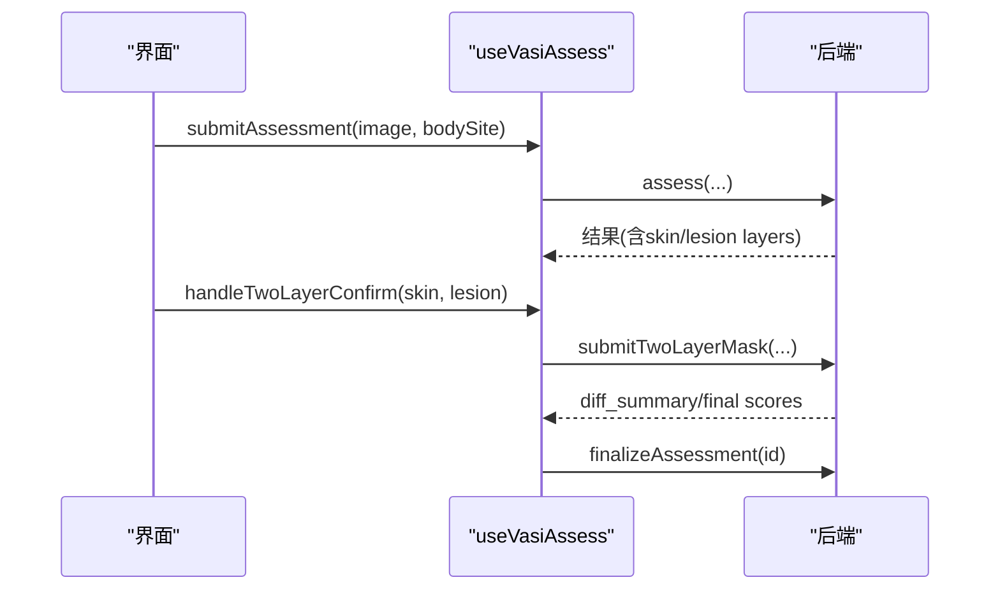
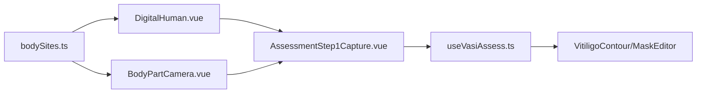

# 3D人体模型渲染

<cite>
**本文引用的文件**
- [DigitalHuman.vue](file://web/app/src/components/tracker/DigitalHuman.vue)
- [bodySites.ts](file://web/app/src/constants/bodySites.ts)
- [BodyPartCamera.vue](file://web/app/src/components/tracker/BodyPartCamera.vue)
- [MaskEditor.vue](file://web/app/src/components/tracker/MaskEditor.vue)
- [VitiligoContour.vue](file://web/app/src/components/tracker/VitiligoContour.vue)
- [AssessmentStep1Capture.vue](file://web/app/src/components/tracker/AssessmentStep1Capture.vue)
- [useVasiAssess.ts](file://web/app/src/composables/useVasiAssess.ts)
- [SKILL.md](file://.agents/skills/3d-model-work/SKILL.md)
</cite>

## 目录
1. [简介](#简介)
2. [项目结构](#项目结构)
3. [核心组件](#核心组件)
4. [架构总览](#架构总览)
5. [详细组件分析](#详细组件分析)
6. [依赖关系分析](#依赖关系分析)
7. [性能考虑](#性能考虑)
8. [故障排查指南](#故障排查指南)
9. [结论](#结论)
10. [附录](#附录)

## 简介
本技术文档围绕 VASI 评估系统中的“3D人体模型展示与交互”能力进行系统化说明。需要特别指出：当前生产实现已采用 SVG 矢量“数字人”替代 Three.js 3D 模型，以显著降低包体大小并提升加载与交互性能；同时保留 GLB/Draco 等 3D 资源与解码器以备未来扩展。文档将覆盖：
- 身体部位选择面板（正面/背面、点击高亮、标签连线）
- 2D图像标注与坐标转换（归一化坐标与像素坐标互转）
- 移动端触摸手势支持（拖拽、捏合缩放、双指平移）
- 性能优化与内存管理策略
- 模型文件格式规范与自定义部位添加方法
- 可视化效果配置选项（雨幕/波浪动画、高亮样式等）

## 项目结构
与“数字人/部位选择/标注”相关的前端代码主要位于 web/app/src/components/tracker 与 constants 目录中，配合 composable 完成评估流程编排。

图表来源
- [AssessmentStep1Capture.vue:1-150](file://web/app/src/components/tracker/AssessmentStep1Capture.vue#L1-L150)
- [DigitalHuman.vue:1-325](file://web/app/src/components/tracker/DigitalHuman.vue#L1-L325)
- [BodyPartCamera.vue:64-183](file://web/app/src/components/tracker/BodyPartCamera.vue#L64-L183)
- [useVasiAssess.ts:1-186](file://web/app/src/composables/useVasiAssess.ts#L1-L186)
- [bodySites.ts:1-87](file://web/app/src/constants/bodySites.ts#L1-L87)

章节来源
- [SKILL.md:14-73](file://.agents/skills/3d-model-work/SKILL.md#L14-L73)
- [AssessmentStep1Capture.vue:1-150](file://web/app/src/components/tracker/AssessmentStep1Capture.vue#L1-L150)

## 核心组件
- DigitalHuman.vue：SVG 数字人，提供正面/背面切换、部位命中区域、点击高亮与标签连线，输出 bodySite 事件。
- BodyPartCamera.vue：相机取景框与裁剪计算，基于部位形状生成遮罩，并将 SVG viewBox 坐标映射到视频像素坐标。
- MaskEditor.vue：图片标注画布，支持平移、捏合缩放、历史撤销/重做、最大尺寸限制与浅引用历史栈以降低内存占用。
- VitiligoContour.vue：白斑轮廓编辑与可视化，提供点选、绘制、移动模式，归一化坐标与像素坐标互转。
- AssessmentStep1Capture.vue：评估入口页面，整合数字人、相机、上传与提交按钮，自动滚动至提交区。
- useVasiAssess.ts：评估提交流程编排，包含上传阶段、结果解析、双层掩膜确认与最终化。

章节来源
- [DigitalHuman.vue:1-325](file://web/app/src/components/tracker/DigitalHuman.vue#L1-L325)
- [BodyPartCamera.vue:64-183](file://web/app/src/components/tracker/BodyPartCamera.vue#L64-L183)
- [MaskEditor.vue:74-111](file://web/app/src/components/tracker/MaskEditor.vue#L74-L111)
- [VitiligoContour.vue:1-400](file://web/app/src/components/tracker/VitiligoContour.vue#L1-L400)
- [AssessmentStep1Capture.vue:1-150](file://web/app/src/components/tracker/AssessmentStep1Capture.vue#L1-L150)
- [useVasiAssess.ts:1-186](file://web/app/src/composables/useVasiAssess.ts#L1-L186)

## 架构总览
前端通过 DigitalHuman 选择身体部位，触发 BodyPartCamera 打开相机或从相册选择图片，随后由 useVasiAssess 调用后端 API 进行评估，返回皮肤层与病灶层数据 URL，并在 VitiligoContour/MaskEditor 中进行可视化与手动修正。

图表来源
- [DigitalHuman.vue:137-139](file://web/app/src/components/tracker/DigitalHuman.vue#L137-L139)
- [AssessmentStep1Capture.vue:36-51](file://web/app/src/components/tracker/AssessmentStep1Capture.vue#L36-L51)
- [useVasiAssess.ts:63-104](file://web/app/src/composables/useVasiAssess.ts#L63-L104)
- [useVasiAssess.ts:106-140](file://web/app/src/composables/useVasiAssess.ts#L106-L140)

## 详细组件分析

### 数字人与部位选择面板（DigitalHuman.vue）
- 正面/背面视图：通过 currentView 控制 visibleParts，使用 CSS transform 翻转背面图。
- 部位映射：内置 frontParts/backParts 数组，每个部位包含 hits（命中椭圆）、anchors（锚点）、labelX/Y（标签位置）。
- 交互与高亮：点击命中区域或标签时 emit('select-part', bodySite)，activePart 驱动高亮样式（颜色、阴影、圆点半径）。
- 动画过渡：rain/wave 两种模式，rain 模式通过 curtain 扫光+字符列下落增强视觉提示；wave 模式为扫描线动画。
- 移动端适配：touchstart/touchend/cancel 监听，避免默认滚动干扰。

图表来源
- [DigitalHuman.vue:105-135](file://web/app/src/components/tracker/DigitalHuman.vue#L105-L135)
- [DigitalHuman.vue:137-139](file://web/app/src/components/tracker/DigitalHuman.vue#L137-L139)
- [DigitalHuman.vue:144-170](file://web/app/src/components/tracker/DigitalHuman.vue#L144-L170)

章节来源
- [DigitalHuman.vue:1-325](file://web/app/src/components/tracker/DigitalHuman.vue#L1-L325)

### 相机取景与裁剪（BodyPartCamera.vue）
- 形状遮罩：根据部位获取 mask shapes，构造 SVG mask，对视频背景进行半透明遮罩，突出拍摄区域。
- 坐标映射：将 SVG viewBox 中的矩形/椭圆边界转换为容器坐标，再映射到视频像素坐标，考虑前置摄像头镜像翻转。
- 自适应裁剪：在形状边界基础上增加 5% 边距，得到最终 x/y/w/h 的裁剪框。

图表来源
- [BodyPartCamera.vue:64-95](file://web/app/src/components/tracker/BodyPartCamera.vue#L64-L95)
- [BodyPartCamera.vue:101-183](file://web/app/src/components/tracker/BodyPartCamera.vue#L101-L183)

章节来源
- [BodyPartCamera.vue:64-183](file://web/app/src/components/tracker/BodyPartCamera.vue#L64-L183)

### 标注与坐标转换（VitiligoContainer.vue / MaskEditor.vue）
- 归一化坐标 ↔ 像素坐标：toPixel/toNorm 在图片显示尺寸上双向转换，保证缩放/平移后仍准确。
- 交互模式：select/draw/move 三种模式，支持点选控制点、手绘多边形、整体移动轮廓。
- 路径简化：simplifyPath 对密集采样点进行抽稀，减少渲染与存储开销。
- 历史记录：MaskEditor 使用 shallowRef 保存 ImageData 历史，限制最大步数，避免深代理带来的内存压力。

图表来源
- [VitiligoContour.vue:39-48](file://web/app/src/components/tracker/VitiligoContour.vue#L39-L48)
- [VitiligoContour.vue:102-168](file://web/app/src/components/tracker/VitiligoContour.vue#L102-L168)
- [VitiligoContour.vue:170-192](file://web/app/src/components/tracker/VitiligoContour.vue#L170-L192)
- [MaskEditor.vue:74-111](file://web/app/src/components/tracker/MaskEditor.vue#L74-L111)

章节来源
- [VitiligoContour.vue:1-400](file://web/app/src/components/tracker/VitiligoContour.vue#L1-L400)
- [MaskEditor.vue:74-111](file://web/app/src/components/tracker/MaskEditor.vue#L74-L111)

### 评估提交流程（useVasiAssess.ts）
- 上传阶段：uploading → segmenting → analyzing，便于 UI 反馈。
- 结果解析：填充评分、面积、分类、阶段、置信度、精度等级，以及皮肤层/病灶层 data URL。
- 双层掩膜确认：允许用户在 AI 结果基础上微调，提交差异用于模型迭代。
- 最终化：finalizeAssessment 完成本次评估归档。

图表来源
- [useVasiAssess.ts:63-104](file://web/app/src/composables/useVasiAssess.ts#L63-L104)
- [useVasiAssess.ts:106-140](file://web/app/src/composables/useVasiAssess.ts#L106-L140)

章节来源
- [useVasiAssess.ts:1-186](file://web/app/src/composables/useVasiAssess.ts#L1-L186)

### 概念性概览（非代码映射）
- 传统 3D 管线（Three.js）：场景初始化 → 加载 GLTF/GLB → 材质/光照 → 动画循环 → 渲染输出。
- 当前实现：SVG 数字人 + 2D 标注，兼顾性能与可维护性；如需回归 3D，可在现有流程中替换 DigitalHuman 为 Three.js 渲染容器，并保持 bodySite 事件契约不变。

[本节为概念性说明，不直接分析具体文件]

## 依赖关系分析
- DigitalHuman.vue 依赖 bodySites.ts 的部位枚举与标签映射，确保前后端一致。
- AssessmentStep1Capture.vue 组合 DigitalHuman、BodyPartCamera 与 useVasiAssess，形成端到端评估入口。
- BodyPartCamera.vue 依赖 bodySites.ts 的形状分组逻辑，统一不同侧别部位的取景框。
- VitiligoContour.vue 与 MaskEditor.vue 均依赖统一的归一化坐标约定，便于与后端算法对接。

图表来源
- [bodySites.ts:1-87](file://web/app/src/constants/bodySites.ts#L1-L87)
- [DigitalHuman.vue:105-135](file://web/app/src/components/tracker/DigitalHuman.vue#L105-L135)
- [BodyPartCamera.vue:64-95](file://web/app/src/components/tracker/BodyPartCamera.vue#L64-L95)
- [AssessmentStep1Capture.vue:1-150](file://web/app/src/components/tracker/AssessmentStep1Capture.vue#L1-L150)
- [useVasiAssess.ts:1-186](file://web/app/src/composables/useVasiAssess.ts#L1-L186)

章节来源
- [bodySites.ts:1-87](file://web/app/src/constants/bodySites.ts#L1-L87)
- [DigitalHuman.vue:105-135](file://web/app/src/components/tracker/DigitalHuman.vue#L105-L135)
- [BodyPartCamera.vue:64-95](file://web/app/src/components/tracker/BodyPartCamera.vue#L64-L95)
- [AssessmentStep1Capture.vue:1-150](file://web/app/src/components/tracker/AssessmentStep1Capture.vue#L1-L150)
- [useVasiAssess.ts:1-186](file://web/app/src/composables/useVasiAssess.ts#L1-L186)

## 性能考虑
- 包体与加载：当前 DigitalHuman 为 SVG 实现，生产 bundle 约 9.8KB，远小于 3D 模型方案；若启用 3D，建议使用 Draco 压缩 GLB 与按需加载解码器。
- 渲染优化：SVG 使用 preserveAspectRatio 与 viewBox 自适应，避免重复布局；动画使用 CSS 关键帧与 Transition，减少 JS 主线程压力。
- 内存管理：MaskEditor 使用 shallowRef 存储 ImageData 历史，限制 HISTORY_MAX，避免 Vue 深度代理大对象；workingDims 限制最大画布尺寸，防止高分辨率图片导致内存峰值。
- 移动端手势：禁用默认滚动（touchAction: none），使用 passive 事件监听，减少滚动抖动；捏合缩放与双指平移仅在必要时启用。
- 网络与缓存：图片预览使用 Blob URL，减少重复下载；data URL 仅用于本地叠加层，避免持久化大对象。

[本节提供通用指导，不直接分析具体文件]

## 故障排查指南
- 无法选择部位：检查 DigitalHuman 的 activePart 是否与 bodySites 枚举一致；确认可见部位数组是否按视图正确切换。
- 相机取景偏移：核对 BodyPartCamera 的坐标映射逻辑，尤其是前置摄像头的水平翻转与 object-cover 缩放导致的偏移。
- 标注错位：确认 VitiligoContour 的图片显示尺寸更新时机（onload/ResizeObserver），确保 toPixel/toNorm 使用的宽高有效。
- 内存溢出：检查 MaskEditor 的历史步数与 MAX_CANVAS_DIM 设置；避免在 deep reactive 中持有大对象。
- 提交失败：查看 useVasiAssess 的错误分支，确认鉴权状态与后端返回 detail；必要时重试或降级精度。

章节来源
- [DigitalHuman.vue:137-139](file://web/app/src/components/tracker/DigitalHuman.vue#L137-L139)
- [BodyPartCamera.vue:143-183](file://web/app/src/components/tracker/BodyPartCamera.vue#L143-L183)
- [VitiligoContour.vue:59-87](file://web/app/src/components/tracker/VitiligoContour.vue#L59-L87)
- [MaskEditor.vue:74-111](file://web/app/src/components/tracker/MaskEditor.vue#L74-L111)
- [useVasiAssess.ts:96-104](file://web/app/src/composables/useVasiAssess.ts#L96-L104)

## 结论
当前 VASI 评估系统采用 SVG 数字人方案替代 Three.js 3D 模型，在保证交互体验的同时显著降低了包体与复杂度。通过标准化的 bodySite 枚举、精确的坐标转换与完善的移动端手势支持，实现了稳定的部位选择、拍照采集与标注修正闭环。若未来需回归 3D 渲染，可在保持事件与数据契约的前提下平滑替换渲染层，并利用 Draco 压缩与按需加载保障性能。

[本节为总结性内容，不直接分析具体文件]

## 附录

### 模型文件格式规范
- 3D 资源：GLB（推荐 Draco 压缩），解码器位于部署目录 draco/。
- 2D 资源：PNG/JPG/WebP 图片作为数字人或备用贴图。
- 部署路径：public/models/pbr 与 public/draco，静态资源由 Nginx 托管。

章节来源
- [SKILL.md:14-27](file://.agents/skills/3d-model-work/SKILL.md#L14-L27)
- [SKILL.md:62-65](file://.agents/skills/3d-model-work/SKILL.md#L62-L65)

### 自定义部位添加方法
- 在 DigitalHuman.vue 的 frontParts/backParts 中添加新部位条目，包含 id、label、bodySite、hits、anchors、labelX/Y。
- 在 bodySites.ts 的 BODY_SITES 中补充对应枚举与元信息（bsaPercent、group、side、view）。
- 如涉及相机取景，确保 getCameraShapeKey 能映射到新部位组。

章节来源
- [DigitalHuman.vue:105-133](file://web/app/src/components/tracker/DigitalHuman.vue#L105-L133)
- [bodySites.ts:32-47](file://web/app/src/constants/bodySites.ts#L32-L47)
- [bodySites.ts:66-81](file://web/app/src/constants/bodySites.ts#L66-L81)

### 可视化效果配置选项
- 模式：mode='rain' | 'wave'，控制雨幕或波浪扫描动画。
- 视图：view='front' | 'back'，切换正背面。
- 显示控制：showParts、showViewToggle、activePart，控制部位面板与高亮。
- 样式：SVG 滤镜与 CSS 动画（发光、虚线、阴影）用于高亮与动效。

章节来源
- [DigitalHuman.vue:15-27](file://web/app/src/components/tracker/DigitalHuman.vue#L15-L27)
- [DigitalHuman.vue:209-316](file://web/app/src/components/tracker/DigitalHuman.vue#L209-L316)