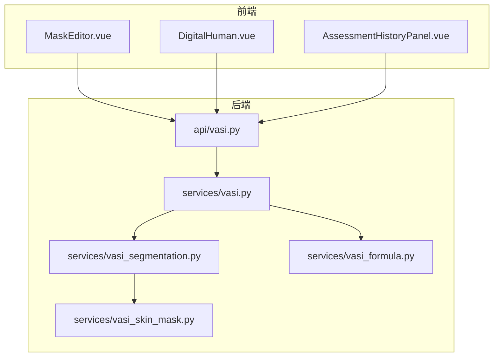
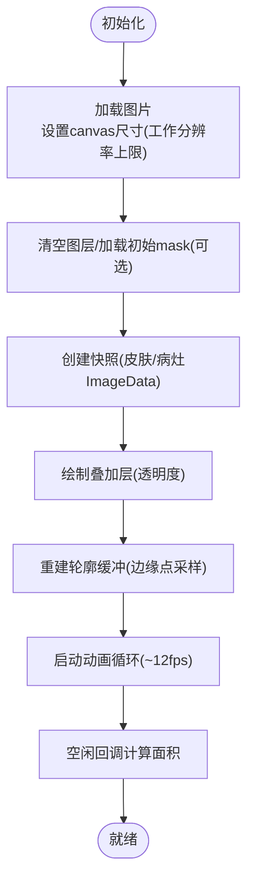
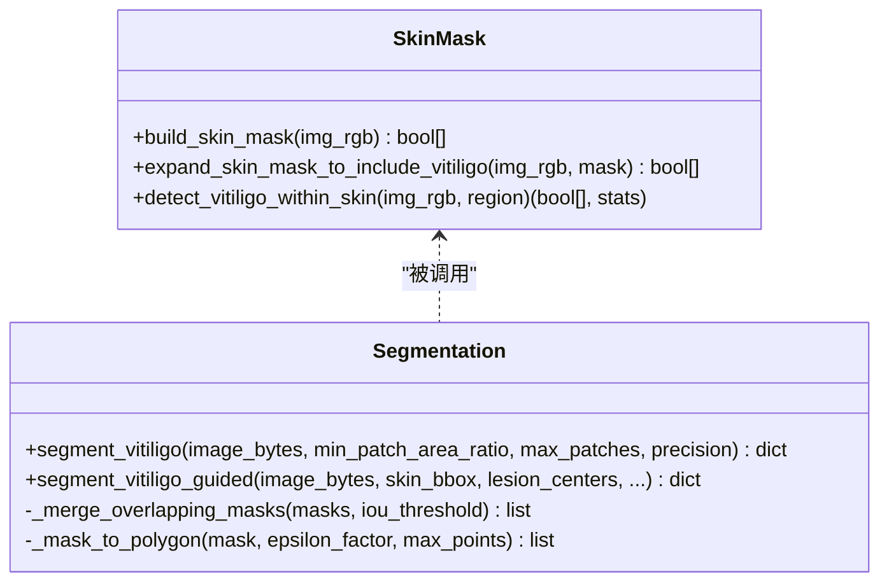
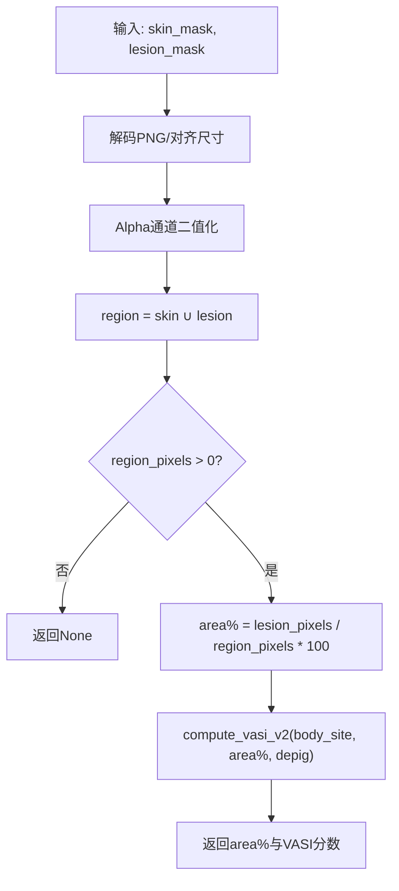
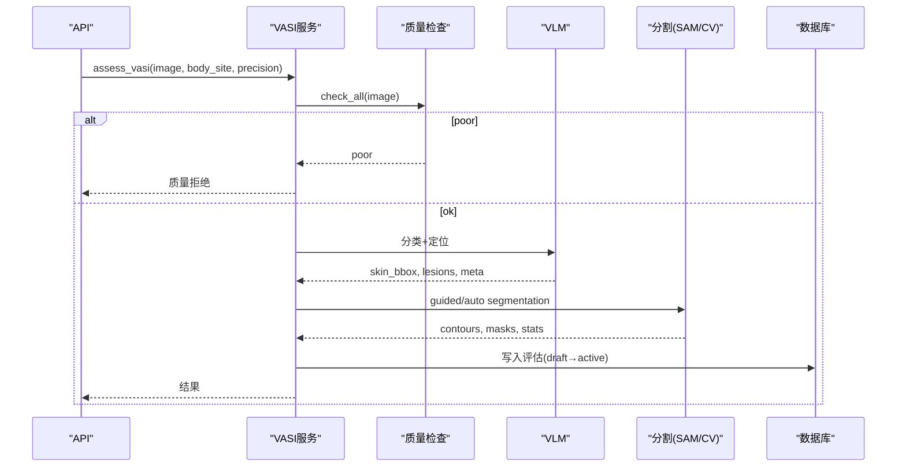
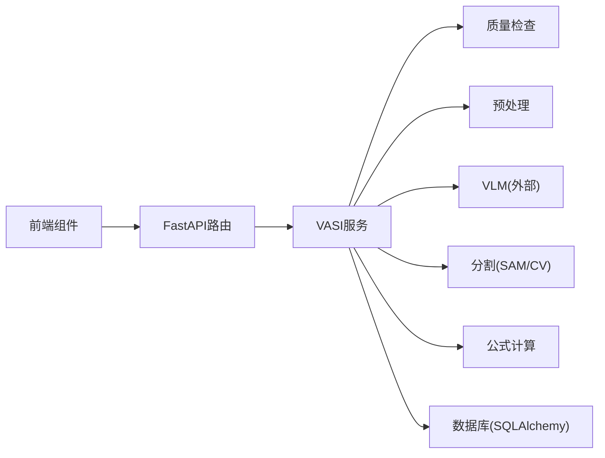

# VASI评估系统

<cite>
**本文引用的文件**   
- [MaskEditor.vue](file://web/app/src/components/tracker/MaskEditor.vue)
- [DigitalHuman.vue](file://web/app/src/components/tracker/DigitalHuman.vue)
- [vasi_segmentation.py](file://web/backend/services/vasi_segmentation.py)
- [vasi_skin_mask.py](file://web/backend/services/vasi_skin_mask.py)
- [vasi_formula.py](file://web/backend/services/vasi_formula.py)
- [vasi.py（服务）](file://web/backend/services/vasi.py)
- [vasi.py（API）](file://web/backend/api/vasi.py)
- [AssessmentHistoryPanel.vue](file://web/app/src/components/tracker/AssessmentHistoryPanel.vue)
- [SKILL.md（3D模型工作）](file://.agents/skills/3d-model-work/SKILL.md)
</cite>

## 目录
1. [简介](#简介)
2. [项目结构](#项目结构)
3. [核心组件](#核心组件)
4. [架构总览](#架构总览)
5. [详细组件分析](#详细组件分析)
6. [依赖关系分析](#依赖关系分析)
7. [性能考量](#性能考量)
8. [故障排查指南](#故障排查指南)
9. [结论](#结论)
10. [附录](#附录)

## 简介
本技术文档面向Subskin VASI白斑评估系统，覆盖图像分割算法、3D人体模型渲染现状、面积计算逻辑与VASI评分、评估报告生成、MaskEditor交互设计、图像处理流水线、AI分割模型集成、手动修正功能、数据可视化展示、历史记录管理与对比分析。同时给出算法参数配置、性能优化策略与移动端适配方案，帮助开发者快速理解并扩展系统能力。

## 项目结构
系统由前端应用（Vue 3 + TypeScript）、后端服务（FastAPI + SQLAlchemy）、以及AI分割与质量检查模块组成：
- 前端：MaskEditor用于交互式标注与叠加显示；DigitalHuman为SVG人体部位选择器（非3D）；历史面板提供分页、多选与对比入口。
- 后端：VASI服务编排质量检查、预处理、VLM引导的SAM分割、nnU-Net回退、结果持久化与趋势统计；API层暴露REST接口。
- AI：皮肤区域检测、相对亮度白斑识别、SAM自动/引导分割、轮廓多边形提取与合并。



图表来源
- [MaskEditor.vue](file://web/app/src/components/tracker/MaskEditor.vue)
- [DigitalHuman.vue](file://web/app/src/components/tracker/DigitalHuman.vue)
- [AssessmentHistoryPanel.vue](file://web/app/src/components/tracker/AssessmentHistoryPanel.vue)
- [vasi.py（API）](file://web/backend/api/vasi.py)
- [vasi.py（服务）](file://web/backend/services/vasi.py)
- [vasi_segmentation.py](file://web/backend/services/vasi_segmentation.py)
- [vasi_skin_mask.py](file://web/backend/services/vasi_skin_mask.py)
- [vasi_formula.py](file://web/backend/services/vasi_formula.py)

章节来源
- [vasi.py（服务）](file://web/backend/services/vasi.py)
- [vasi.py（API）](file://web/backend/api/vasi.py)

## 核心组件
- MaskEditor：双图层Canvas（肤色层/白斑层），支持画笔、橡皮擦、撤销/重做、缩放平移、动画轮廓描边、面积实时估算与导出data URL。
- DigitalHuman：SVG人体部位图，支持正背面切换与点击事件，作为部位选择入口。
- VASI服务：统一编排质量检查、预处理、VLM引导SAM分割、nnU-Net回退、结果入库、趋势与历史查询。
- 分割服务：皮肤掩膜构建、相对亮度白斑检测、SAM自动/引导模式、轮廓多边形提取与合并。
- 公式服务：按身体部位体表面积权重计算VASI分数，支持双层mask面积计算。

章节来源
- [MaskEditor.vue](file://web/app/src/components/tracker/MaskEditor.vue)
- [DigitalHuman.vue](file://web/app/src/components/tracker/DigitalHuman.vue)
- [vasi.py（服务）](file://web/backend/services/vasi.py)
- [vasi_segmentation.py](file://web/backend/services/vasi_segmentation.py)
- [vasi_skin_mask.py](file://web/backend/services/vasi_skin_mask.py)
- [vasi_formula.py](file://web/backend/services/vasi_formula.py)

## 架构总览
端到端流程：用户上传图片 → 质量检查 → 可选预处理 → VLM定位与分类 → SAM引导分割 → 轮廓提取与合并 → 面积与VASI计算 → 结果入库与返回 → 前端可视化与修正。

```mermaid
sequenceDiagram
participant U as "用户"
participant FE as "前端(MaskEditor/DigitalHuman)"
participant API as "后端API(assess)"
participant SVC as "VASI服务"
participant QC as "质量检查"
participant PRE as "预处理"
participant VLM as "视觉大模型(VLM)"
participant SAM as "SAM分割"
FORM as "公式计算"
DB as "数据库"
U->>FE : 上传图像+选择部位
FE->>API : POST /assess(image, body_site, precision)
API->>SVC : assess_vasi(...)
SVC->>QC : check_all(image)
alt 质量不合格
QC-->>SVC : poor(建议)
SVC-->>API : 质量拒绝响应
API-->>FE : 返回建议(不保存临床评分)
else 质量合格
SVC->>PRE : preprocess(image)
PRE-->>SVC : processed_image
SVC->>VLM : classification + localization
VLM-->>SVC : skin_bbox, lesions, meta
SVC->>SAM : segment_vitiligo_guided(...)
SAM-->>SVC : contours, masks, stats
SVC->>FORM : compute_vasi_v2(area%, BSA, depig)
FORM-->>SVC : vasi_score
SVC->>DB : 写入评估记录
SVC-->>API : 评估结果
API-->>FE : 返回contours/masks/分数
FE->>FE : MaskEditor叠加与修正
FE->>API : 提交修正(contour/mask)
API->>SVC : submit_contour_correction(...)
SVC->>FORM : 重新计算最终分数
SVC->>DB : 更新final_vasi_score等
end
```

图表来源
- [vasi.py（API）](file://web/backend/api/vasi.py)
- [vasi.py（服务）](file://web/backend/services/vasi.py)
- [vasi_segmentation.py](file://web/backend/services/vasi_segmentation.py)
- [vasi_skin_mask.py](file://web/backend/services/vasi_skin_mask.py)
- [vasi_formula.py](file://web/backend/services/vasi_formula.py)

## 详细组件分析

### MaskEditor组件（交互设计与图像处理流水线）
- 双图层Canvas：皮肤层（蓝色半透明）与白斑层（粉色半透明），支持透明度调节与叠加显示。
- 工具集：病灶画笔、皮肤画笔、橡皮擦；撤销/重做基于shallowRef快照，限制最大历史长度避免内存压力。
- 交互：指针事件处理、双指捏合缩放、中键/右键平移、滚轮缩放；移动端多点触控与防抖。
- 性能优化：工作分辨率上限（MAX_CANVAS_DIM=1024）降低像素操作开销；overlay上下文缓存；动画帧降频至约12fps；requestIdleCallback延迟面积计算。
- 面积计算：alpha通道计数与并集区域统计，实时更新皮肤/病灶/区域占比，输出area_percent。
- 导出：确认时发射confirm事件携带skinMaskDataUrl与lesionMaskDataUrl供后端二次计算。



图表来源
- [MaskEditor.vue](file://web/app/src/components/tracker/MaskEditor.vue)

章节来源
- [MaskEditor.vue](file://web/app/src/components/tracker/MaskEditor.vue)

### 数字人组件（当前实现为SVG，非3D）
- 使用SVG矢量图展示人体部位，支持正面/背面切换与点击事件，触发部位选择。
- 内置“雨幕”和“波浪”动画增强体验，轻量且跨平台兼容。
- 根据SKILL说明，生产环境已采用SVG替代Three.js 3D模型以降低bundle体积。

章节来源
- [DigitalHuman.vue](file://web/app/src/components/tracker/DigitalHuman.vue)
- [SKILL.md（3D模型工作）](file://.agents/skills/3d-model-work/SKILL.md)

### 图像分割算法（SAM + 皮肤感知 + 相对亮度）
- 两阶段策略：先构建皮肤前景掩膜，再在皮肤区域内进行相对亮度阈值检测，避免白背景误判。
- SAM自动模式：快速/精确两种精度，网格点与稳定性阈值可调；对候选mask进行皮肤重叠度过滤与颜色特征验证。
- 引导模式：VLM提供皮肤bbox与病灶中心/边界点，驱动SamPredictor精准定位；若失败则回退到颜色法。
- 轮廓提取：形态学闭运算平滑锯齿，approxPolyDP简化顶点，归一化坐标输出；纯Python回退路径保证可用性。
- 连通分量：最小面积过滤，合并重叠mask，输出多斑块列表及总面积百分比。



图表来源
- [vasi_skin_mask.py](file://web/backend/services/vasi_skin_mask.py)
- [vasi_segmentation.py](file://web/backend/services/vasi_segmentation.py)

章节来源
- [vasi_segmentation.py](file://web/backend/services/vasi_segmentation.py)
- [vasi_skin_mask.py](file://web/backend/services/vasi_skin_mask.py)

### VASI评分与面积计算
- 双层mask面积：以皮肤∪病灶为分母，病灶为分子，得到区域占比；兼容单mask回退。
- VASI v2公式：hand_units = area% × BSA(body_site)/100；VASI = hand_units × depigmentation_level × 10，范围[0,100]。
- 部位权重：中英文映射一致，默认未知部位取9%。
- 用户修正：提交修正后优先采用双层mask计算，否则回退到单mask并按存储的皮肤区域比例换算。



图表来源
- [vasi_formula.py](file://web/backend/services/vasi_formula.py)

章节来源
- [vasi_formula.py](file://web/backend/services/vasi_formula.py)

### 评估服务与API
- 质量检查：模糊度、皮肤存在率、光照、分辨率综合评分，poor直接拒绝并返回改进建议。
- 预处理：可选图像增强/标准化。
- VLM引导：置信度分级过滤、bbox尺寸合理性校验、per-lesion元数据传递。
- 分割回退：无VLM或失败时走auto SAM或CV回退；nnU-Net远程服务可用时作为额外回退。
- 持久化：草稿状态active后才进入历史与趋势；删除时保留ImageLabel元数据。
- 趋势与历史：仅统计active评估，支持部位筛选与日期范围，计算变化量与趋势标签。



图表来源
- [vasi.py（服务）](file://web/backend/services/vasi.py)
- [vasi.py（API）](file://web/backend/api/vasi.py)

章节来源
- [vasi.py（服务）](file://web/backend/services/vasi.py)
- [vasi.py（API）](file://web/backend/api/vasi.py)

### 历史记录与对比分析
- 历史面板：分页、多选、滑动删除、查看详情、对比选中项。
- 后端接口：/history支持limit/offset/body_site/date_range；/trend返回时间序列与总结（稳定/好转/恶化）。
- 对比：前端可基于选中多条记录进行前后对比（如BeforeAfterSlider），结合MaskEditor叠加显示差异。

章节来源
- [AssessmentHistoryPanel.vue](file://web/app/src/components/tracker/AssessmentHistoryPanel.vue)
- [vasi.py（API）](file://web/backend/api/vasi.py)

## 依赖关系分析
- 前端依赖：Vue 3、TypeScript、Canvas API、Pointer Events、requestAnimationFrame、requestIdleCallback。
- 后端依赖：FastAPI、SQLAlchemy、Pillow、OpenCV（可选）、NumPy、Torch/Segment Anything（可选）、httpx（可选）。
- 模块耦合：VASI服务聚合质量检查、预处理、分割、公式计算；分割模块依赖皮肤掩膜与形态学工具；API层负责鉴权、参数校验与响应封装。



图表来源
- [vasi.py（API）](file://web/backend/api/vasi.py)
- [vasi.py（服务）](file://web/backend/services/vasi.py)

章节来源
- [vasi.py（服务）](file://web/backend/services/vasi.py)
- [vasi.py（API）](file://web/backend/api/vasi.py)

## 性能考量
- 前端
  - Canvas工作分辨率上限（1024px）显著降低内存与CPU占用。
  - overlay上下文缓存与动画帧降频（~12fps）减少主线程阻塞。
  - shallowRef管理历史快照，避免深度代理开销。
  - requestIdleCallback延迟面积计算，提升交互流畅性。
- 后端
  - SAM模型懒加载与两级精度（quick/precise）平衡速度与精度。
  - 质量检查前置拒绝低质图片，避免无效AI调用。
  - nnU-Net远程服务异步调用，失败回退本地CV路径。
  - 数据库仅统计active评估，减少无关数据干扰趋势。

## 故障排查指南
- 图片加载失败：检查网络与资源路径；MaskEditor错误提示明确。
- 分割失败：确认SAM是否可用；若无GPU或依赖缺失将回退CV路径；检查皮肤区域比例是否过低。
- 质量拒绝：根据返回建议调整拍摄条件（清晰度、光照、皮肤占比）。
- 历史/趋势为空：确认评估已finalize为active；检查筛选条件。
- 修正未生效：确保提交包含skin_mask_image与lesion_mask_image；检查depigmentation_level范围。

章节来源
- [MaskEditor.vue](file://web/app/src/components/tracker/MaskEditor.vue)
- [vasi.py（服务）](file://web/backend/services/vasi.py)
- [vasi.py（API）](file://web/backend/api/vasi.py)

## 结论
本系统通过“质量检查→VLM引导→SAM分割→面积与VASI计算→用户修正”的闭环，实现了高精度、可解释、可干预的白斑评估流程。前端MaskEditor提供高效交互与可视化，后端服务稳健回退与可扩展架构，满足移动端与桌面端使用场景。未来可在3D人体模型渲染上按需引入Three.js，但当前SVG方案已兼顾性能与兼容性。

## 附录
- 算法参数配置
  - SAM精度：quick（points_per_side=16）/ precise（points_per_side=32）
  - 最小斑块面积占比：min_patch_area_ratio（默认0.005）
  - 最大斑块数：max_patches（默认5）
  - 皮肤掩膜阈值：HSV/YCrCb自适应Fitzpatrick类型
  - 相对亮度阈值：skin_median_L + 12（L*），chroma上限35
- 移动端适配
  - 多点触控缩放/平移、防抖与节流、触摸事件优化
  - 工作分辨率上限与动画帧降频保障流畅性
- 数据可视化
  - 历史面板分页与多选对比
  - 趋势曲线（稳定/好转/恶化）与摘要统计