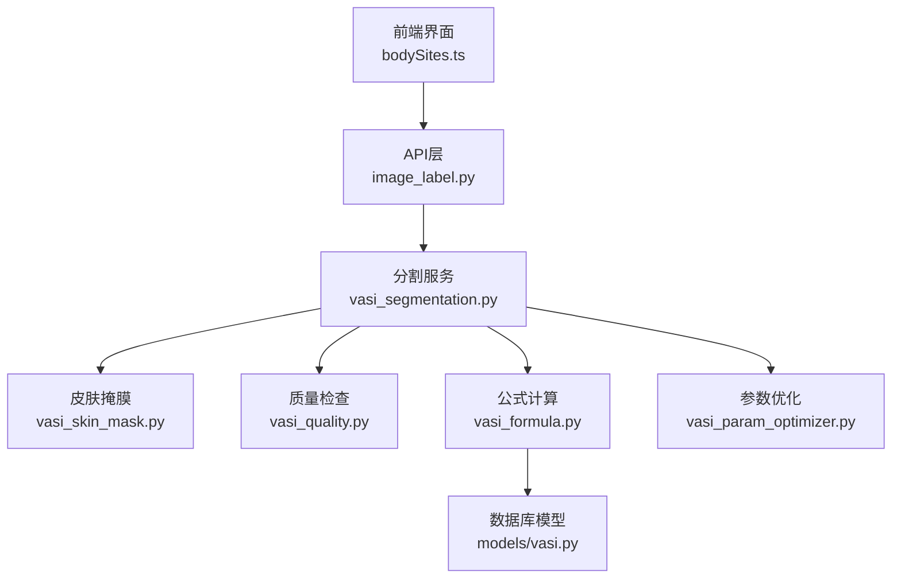
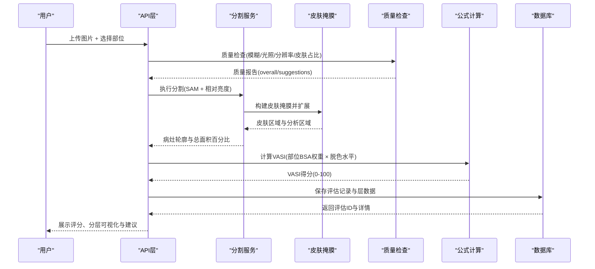
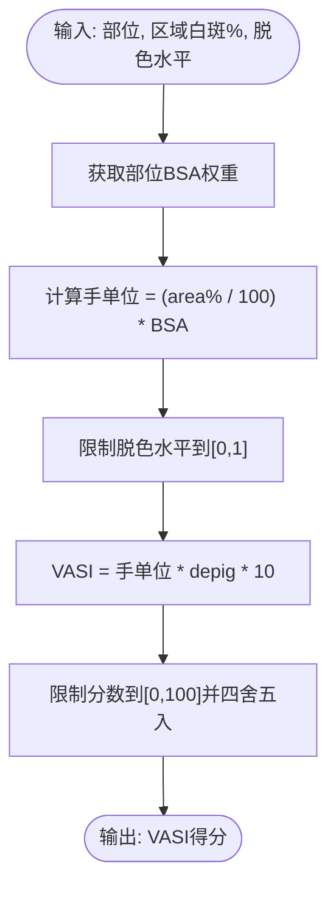
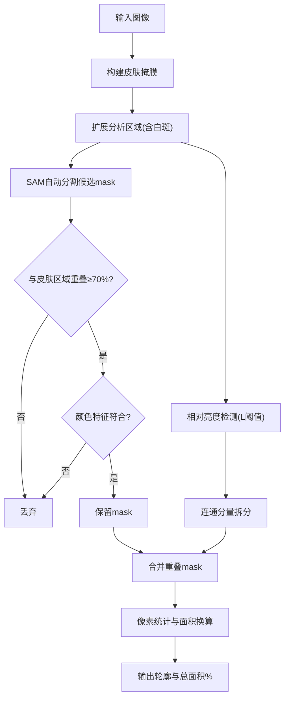
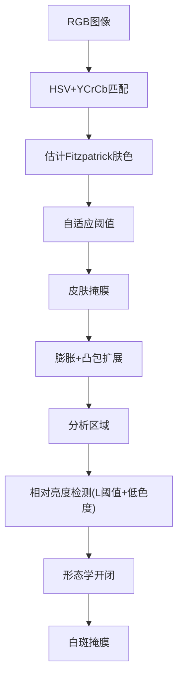
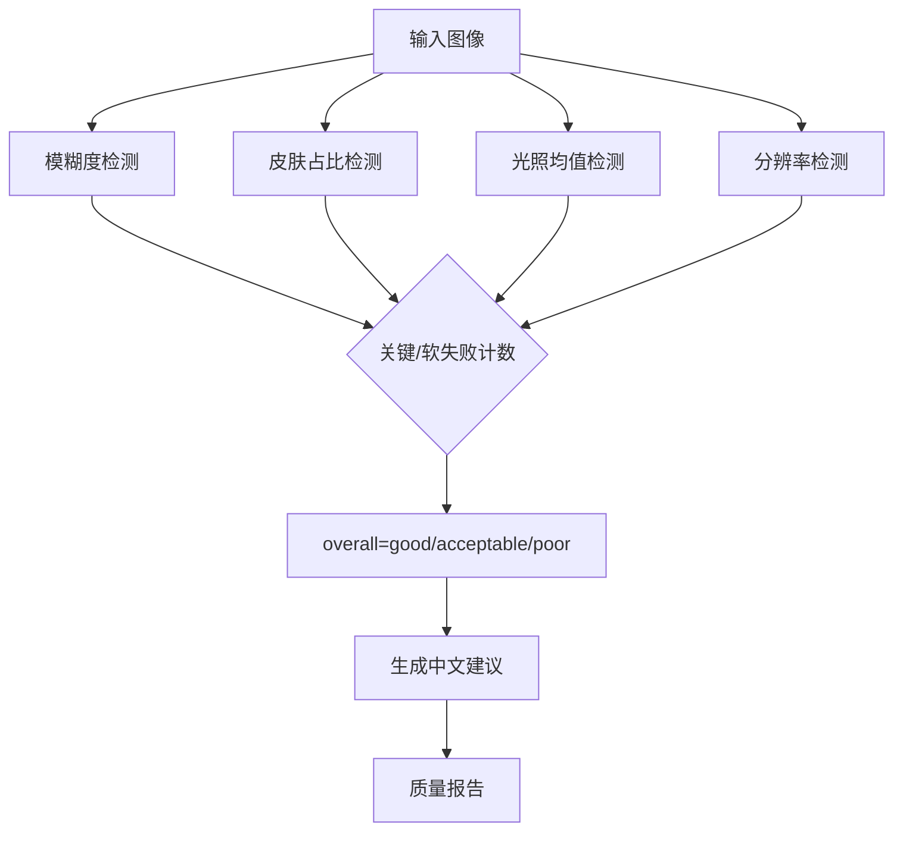
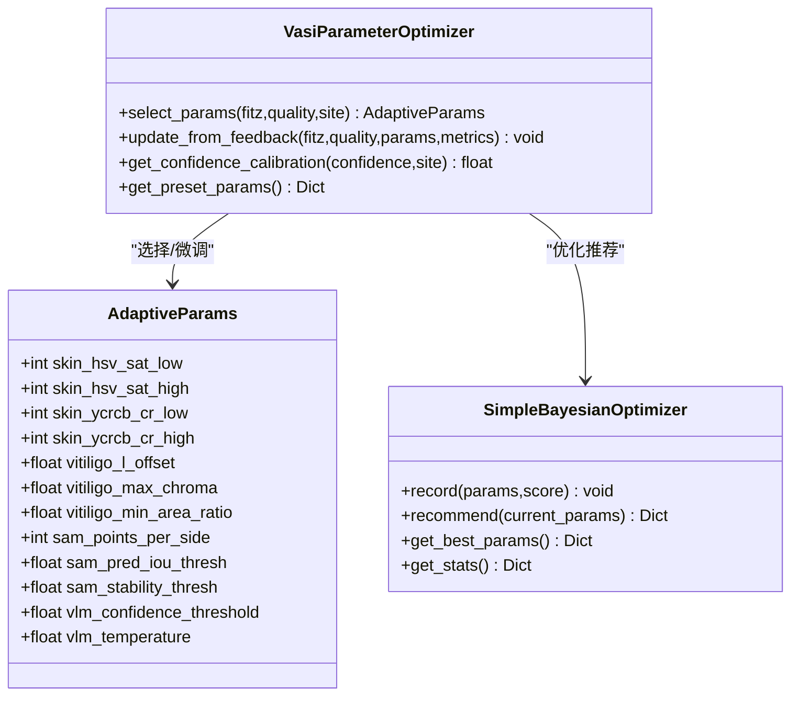
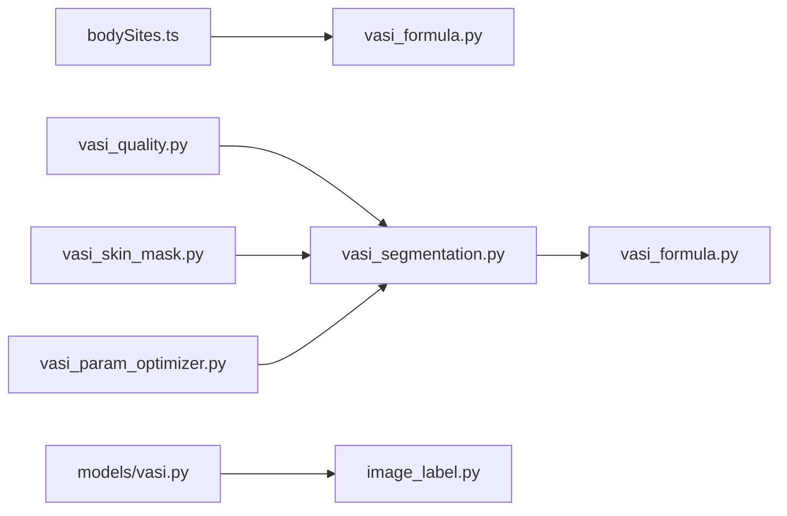

# VASI评分算法

<cite>
**本文引用的文件**
- [web/backend/services/vasi_formula.py](file://web/backend/services/vasi_formula.py)
- [web/backend/services/vasi_segmentation.py](file://web/backend/services/vasi_segmentation.py)
- [web/backend/services/vasi_skin_mask.py](file://web/backend/services/vasi_skin_mask.py)
- [web/backend/services/vasi_quality.py](file://web/backend/services/vasi_quality.py)
- [web/backend/services/vasi_param_optimizer.py](file://web/backend/services/vasi_param_optimizer.py)
- [web/backend/models/vasi.py](file://web/backend/models/vasi.py)
- [web/app/src/constants/bodySites.ts](file://web/app/src/constants/bodySites.ts)
- [web/backend/api/image_label.py](file://web/backend/api/image_label.py)
- [scripts/diagnose_vasi.py](file://scripts/diagnose_vasi.py)
</cite>

## 目录
1. [简介](#简介)
2. [项目结构](#项目结构)
3. [核心组件](#核心组件)
4. [架构总览](#架构总览)
5. [详细组件分析](#详细组件分析)
6. [依赖关系分析](#依赖关系分析)
7. [性能考量](#性能考量)
8. [故障排查指南](#故障排查指南)
9. [结论](#结论)
10. [附录](#附录)

## 简介
本技术文档面向VASI（白癜风面积严重度指数）评估系统的核心评分算法，系统性阐述：
- VASI计算公式与医学标准：白斑面积百分比、身体部位权重系数、病情阶段判定逻辑。
- AI分割结果的量化处理：像素统计、面积换算、精度验证与质量评估。
- 参数优化算法：阈值调整、置信度过滤与结果校正机制。
- 临床分型判断、严重程度分级与趋势分析能力。
- 算法参数调优指南、准确性测试方法与医学验证流程。

该实现遵循改良版VASI手单位体系，结合皮肤区域检测与相对亮度判定的两阶段算法，确保在不同肤色与光照条件下稳定输出可解释的评分。

## 项目结构
与VASI评分相关的后端服务主要分布在以下模块：
- 公式计算：基于部位BSA权重与脱色水平的VASI得分计算。
- 图像分割：SAM自动分割 + 颜色空间相对亮度检测的两阶段方案。
- 皮肤掩膜：自适应Fitzpatrick肤色的皮肤区域提取与扩展。
- 质量检查：模糊、光照、分辨率与皮肤占比的综合质量报告。
- 参数优化：按肤色×质量×部位的自适应参数选择与贝叶斯优化。
- 数据模型：评估记录、反馈信号、训练样本与版本追踪。
- 前端常量：统一的身体部位标识与BSA权重定义。

图表来源
- [web/backend/services/vasi_segmentation.py:278-432](file://web/backend/services/vasi_segmentation.py#L278-L432)
- [web/backend/services/vasi_skin_mask.py:124-210](file://web/backend/services/vasi_skin_mask.py#L124-L210)
- [web/backend/services/vasi_quality.py:188-271](file://web/backend/services/vasi_quality.py#L188-L271)
- [web/backend/services/vasi_formula.py:71-101](file://web/backend/services/vasi_formula.py#L71-L101)
- [web/backend/models/vasi.py:26-105](file://web/backend/models/vasi.py#L26-L105)
- [web/app/src/constants/bodySites.ts:32-47](file://web/app/src/constants/bodySites.ts#L32-L47)

章节来源
- [web/backend/services/vasi_segmentation.py:278-432](file://web/backend/services/vasi_segmentation.py#L278-L432)
- [web/backend/services/vasi_skin_mask.py:124-210](file://web/backend/services/vasi_skin_mask.py#L124-L210)
- [web/backend/services/vasi_quality.py:188-271](file://web/backend/services/vasi_quality.py#L188-L271)
- [web/backend/services/vasi_formula.py:71-101](file://web/backend/services/vasi_formula.py#L71-L101)
- [web/backend/models/vasi.py:26-105](file://web/backend/models/vasi.py#L26-L105)
- [web/app/src/constants/bodySites.ts:32-47](file://web/app/src/constants/bodySites.ts#L32-L47)

## 核心组件
- VASI公式计算：依据部位BSA权重与脱色水平计算手单位并映射到0-100评分范围。
- 图像分割：SAM自动模式生成候选mask，结合皮肤区域约束与相对亮度检测，输出多病灶轮廓与总面积百分比。
- 皮肤掩膜：基于HSV+YCrCb双色彩空间与Fitzpatrick自适应阈值构建皮肤前景，并通过形态学膨胀与凸包扩展以包含白斑区域。
- 质量检查：评估模糊度、皮肤占比、光照强度与分辨率，给出整体质量等级与改进建议。
- 参数优化：根据肤色类型、图片质量与部位预设参数集，叠加部位微调，并在有足够观测时进行贝叶斯优化推荐。
- 数据模型：持久化评估结果、用户修正、AI层、质量报告与自进化反馈信号。

章节来源
- [web/backend/services/vasi_formula.py:71-101](file://web/backend/services/vasi_formula.py#L71-L101)
- [web/backend/services/vasi_segmentation.py:278-432](file://web/backend/services/vasi_segmentation.py#L278-L432)
- [web/backend/services/vasi_skin_mask.py:124-210](file://web/backend/services/vasi_skin_mask.py#L124-L210)
- [web/backend/services/vasi_quality.py:188-271](file://web/backend/services/vasi_quality.py#L188-L271)
- [web/backend/services/vasi_param_optimizer.py:239-318](file://web/backend/services/vasi_param_optimizer.py#L239-L318)
- [web/backend/models/vasi.py:26-105](file://web/backend/models/vasi.py#L26-L105)

## 架构总览
下图展示了从上传图像到最终VASI评分的关键调用链路与数据流：

图表来源
- [web/backend/services/vasi_quality.py:188-271](file://web/backend/services/vasi_quality.py#L188-L271)
- [web/backend/services/vasi_segmentation.py:278-432](file://web/backend/services/vasi_segmentation.py#L278-L432)
- [web/backend/services/vasi_skin_mask.py:124-210](file://web/backend/services/vasi_skin_mask.py#L124-L210)
- [web/backend/services/vasi_formula.py:71-101](file://web/backend/services/vasi_formula.py#L71-L101)
- [web/backend/models/vasi.py:26-105](file://web/backend/models/vasi.py#L26-L105)

## 详细组件分析

### VASI公式与医学标准
- 部位BSA权重：采用改良手单位体系，不同身体部位对应不同的体表面积百分比；前后端通过统一常量保持一致。
- 脱色水平：由视觉语言模型或人工标注提供，取值0-1，表示完全无色素到正常色素的连续程度。
- 计算公式：手单位 = (区域内白斑面积百分比 / 100) × 部位BSA百分比；VASI = 手单位 × 脱色水平 × 10，结果限制在[0,100]并四舍五入至一位小数。
- 默认值：当脱色水平缺失时使用中位默认值，避免极端偏差。

图表来源
- [web/backend/services/vasi_formula.py:71-101](file://web/backend/services/vasi_formula.py#L71-L101)
- [web/app/src/constants/bodySites.ts:32-47](file://web/app/src/constants/bodySites.ts#L32-L47)

章节来源
- [web/backend/services/vasi_formula.py:71-101](file://web/backend/services/vasi_formula.py#L71-L101)
- [web/app/src/constants/bodySites.ts:32-47](file://web/app/src/constants/bodySites.ts#L32-L47)

### 图像分割与像素统计
- 两阶段策略：先构建皮肤前景，再在皮肤区域内用相对亮度阈值检测白斑，避免将白色背景/衣物误判为白斑。
- SAM自动分割：生成候选mask后，仅保留与皮肤分析区域重叠≥70%且满足颜色特征的mask。
- 连通分量与合并：对相对亮度检测结果进行连通分量拆分与重叠mask合并，得到独立病灶轮廓。
- 像素统计：计算每个病灶在皮肤区域内的面积百分比与整图面积百分比，汇总得到总面积百分比。
- 容错回退：若SAM不可用或皮肤区域不足，则回退到纯颜色空间检测路径。

图表来源
- [web/backend/services/vasi_segmentation.py:278-432](file://web/backend/services/vasi_segmentation.py#L278-L432)
- [web/backend/services/vasi_skin_mask.py:177-210](file://web/backend/services/vasi_skin_mask.py#L177-L210)
- [web/backend/services/vasi_skin_mask.py:212-288](file://web/backend/services/vasi_skin_mask.py#L212-L288)

章节来源
- [web/backend/services/vasi_segmentation.py:278-432](file://web/backend/services/vasi_segmentation.py#L278-L432)
- [web/backend/services/vasi_skin_mask.py:177-210](file://web/backend/services/vasi_skin_mask.py#L177-L210)
- [web/backend/services/vasi_skin_mask.py:212-288](file://web/backend/services/vasi_skin_mask.py#L212-L288)

### 皮肤掩膜与相对亮度检测
- 皮肤掩膜构建：使用HSV与YCrCb双色彩空间匹配，结合Fitzpatrick肤色估计自适应阈值，形态学开闭操作去噪与填充空洞。
- 区域扩展：对皮肤掩膜进行膨胀与凸包填充，确保白斑区域被纳入分析区域，避免漏检。
- 相对亮度检测：在分析区域内计算皮肤中位L值，设置阈值高于中位一定偏移，并结合低色度条件识别白斑像素。
- 形态学后处理：开闭操作平滑边缘，提升稳定性。

图表来源
- [web/backend/services/vasi_skin_mask.py:124-210](file://web/backend/services/vasi_skin_mask.py#L124-L210)
- [web/backend/services/vasi_skin_mask.py:212-288](file://web/backend/services/vasi_skin_mask.py#L212-L288)

章节来源
- [web/backend/services/vasi_skin_mask.py:124-210](file://web/backend/services/vasi_skin_mask.py#L124-L210)
- [web/backend/services/vasi_skin_mask.py:212-288](file://web/backend/services/vasi_skin_mask.py#L212-L288)

### 质量检查与置信度过滤
- 质量维度：模糊度（拉普拉斯方差）、皮肤占比、光照均值、分辨率。
- 综合评级：根据关键失败与软失败数量给出“good/acceptable/poor”总体评价，并提供中文改进建议。
- 置信度过滤：在分割流程中通过重叠阈值、最小面积比例与颜色特征过滤降低误检；在参数优化中结合历史观测进行置信度校准。

图表来源
- [web/backend/services/vasi_quality.py:188-271](file://web/backend/services/vasi_quality.py#L188-L271)

章节来源
- [web/backend/services/vasi_quality.py:188-271](file://web/backend/services/vasi_quality.py#L188-L271)

### 参数优化与结果校正
- 分组策略：按Fitzpatrick肤色×图片质量×部位三维分组，每组维护一组最优参数。
- 预设参数：针对不同场景（浅肤色/深肤色、好质量/差质量、特定部位）设定皮肤检测、白斑检测与SAM参数的初始组合。
- 贝叶斯优化：基于历史观测（Dice与面积误差）推荐参数微调方向，支持探索与利用两种策略。
- 部位微调：针对面部反光、手部小面积、躯干大面积等特性调整阈值与最小面积比例。
- 置信度校准：根据历史数据学习confidence→准确率映射，必要时对原始置信度进行校正。

图表来源
- [web/backend/services/vasi_param_optimizer.py:35-73](file://web/backend/services/vasi_param_optimizer.py#L35-L73)
- [web/backend/services/vasi_param_optimizer.py:152-233](file://web/backend/services/vasi_param_optimizer.py#L152-L233)
- [web/backend/services/vasi_param_optimizer.py:239-318](file://web/backend/services/vasi_param_optimizer.py#L239-L318)

章节来源
- [web/backend/services/vasi_param_optimizer.py:35-73](file://web/backend/services/vasi_param_optimizer.py#L35-L73)
- [web/backend/services/vasi_param_optimizer.py:152-233](file://web/backend/services/vasi_param_optimizer.py#L152-L233)
- [web/backend/services/vasi_param_optimizer.py:239-318](file://web/backend/services/vasi_param_optimizer.py#L239-L318)

### 临床分型、严重程度与趋势分析
- 分型字段：节段型/非节段型/混合型/未定型，存储于评估记录中，用于后续分析与训练样本标注。
- 病情阶段：好转/稳定/扩散，用于趋势跟踪与疗效评估。
- 趋势分析：通过多次评估记录的VASI得分、面积百分比与阶段变化，绘制时间序列曲线，辅助临床决策。
- 数据支撑：评估记录包含用户修正、AI层、质量报告与反馈信号，支持多维度回溯与模型自进化。

章节来源
- [web/backend/models/vasi.py:26-105](file://web/backend/models/vasi.py#L26-L105)
- [web/backend/models/vasi.py:179-283](file://web/backend/models/vasi.py#L179-L283)

## 依赖关系分析
- 前后端一致性：前端bodySites.ts与后端BODY_SITE_BSA_PERCENT保持同步，确保部位权重一致。
- 服务耦合：分割服务依赖皮肤掩膜与质量检查；公式计算依赖部位权重与脱色水平；参数优化依赖历史观测与质量等级。
- 外部依赖：OpenCV、NumPy、Pillow、Torch与Segment Anything Model；在不可用时提供降级路径。

图表来源
- [web/app/src/constants/bodySites.ts:32-47](file://web/app/src/constants/bodySites.ts#L32-L47)
- [web/backend/services/vasi_formula.py:71-101](file://web/backend/services/vasi_formula.py#L71-L101)
- [web/backend/services/vasi_quality.py:188-271](file://web/backend/services/vasi_quality.py#L188-L271)
- [web/backend/services/vasi_segmentation.py:278-432](file://web/backend/services/vasi_segmentation.py#L278-L432)
- [web/backend/services/vasi_skin_mask.py:124-210](file://web/backend/services/vasi_skin_mask.py#L124-L210)
- [web/backend/services/vasi_param_optimizer.py:239-318](file://web/backend/services/vasi_param_optimizer.py#L239-L318)
- [web/backend/models/vasi.py:26-105](file://web/backend/models/vasi.py#L26-L105)
- [web/backend/api/image_label.py:1786-1813](file://web/backend/api/image_label.py#L1786-L1813)

章节来源
- [web/app/src/constants/bodySites.ts:32-47](file://web/app/src/constants/bodySites.ts#L32-L47)
- [web/backend/services/vasi_formula.py:71-101](file://web/backend/services/vasi_formula.py#L71-L101)
- [web/backend/services/vasi_quality.py:188-271](file://web/backend/services/vasi_quality.py#L188-L271)
- [web/backend/services/vasi_segmentation.py:278-432](file://web/backend/services/vasi_segmentation.py#L278-L432)
- [web/backend/services/vasi_skin_mask.py:124-210](file://web/backend/services/vasi_skin_mask.py#L124-L210)
- [web/backend/services/vasi_param_optimizer.py:239-318](file://web/backend/services/vasi_param_optimizer.py#L239-L318)
- [web/backend/models/vasi.py:26-105](file://web/backend/models/vasi.py#L26-L105)
- [web/backend/api/image_label.py:1786-1813](file://web/backend/api/image_label.py#L1786-L1813)

## 性能考量
- SAM加载与缓存：模型权重与服务实例全局缓存，减少重复初始化开销。
- 快速与精确模式：quick模式适合实时交互，precise模式用于高精度离线分析。
- 降级策略：当OpenCV或深度学习库不可用时，回退到纯颜色空间检测，保证可用性。
- 内存与IO：mask与图像数据尽量以布尔数组与data URL形式传递，减少序列化成本。

[本节为通用性能指导，不直接分析具体文件]

## 故障排查指南
- 无皮肤区域：检查图像质量报告中的skin_ratio与suggestions，确保画面内皮肤完整可见。
- 无白斑检测：确认相对亮度阈值与色度阈值是否合理，查看vitiligo_stats中的skin_median_l与l_threshold。
- SAM不可用：检查torch与segment_anything依赖安装，或启用fallback路径。
- 参数异常：通过参数优化器统计信息定位当前分组表现，必要时重置为预设参数。
- 诊断脚本：使用诊断脚本对分割与评分链路进行端到端验证。

章节来源
- [web/backend/services/vasi_quality.py:188-271](file://web/backend/services/vasi_quality.py#L188-L271)
- [web/backend/services/vasi_skin_mask.py:212-288](file://web/backend/services/vasi_skin_mask.py#L212-L288)
- [web/backend/services/vasi_segmentation.py:278-432](file://web/backend/services/vasi_segmentation.py#L278-L432)
- [web/backend/services/vasi_param_optimizer.py:239-318](file://web/backend/services/vasi_param_optimizer.py#L239-L318)
- [scripts/diagnose_vasi.py](file://scripts/diagnose_vasi.py)

## 结论
本VASI评分算法实现了从图像质量评估、皮肤区域检测、白斑分割到公式计算的完整闭环，具备跨肤色与光照条件的鲁棒性。通过参数优化与质量检查，系统能够在不同场景下提供稳定、可解释的评分结果。结合临床分型与阶段字段，支持长期趋势分析与疗效评估。未来可进一步引入更多高质量标注数据，完善贝叶斯优化与置信度校准机制，持续提升准确性与泛化能力。

[本节为总结性内容，不直接分析具体文件]

## 附录
- 参数调优指南：
  - 浅肤色+好质量：提高L偏移与色度上限，保守SAM阈值。
  - 深肤色+差质量：放宽L偏移与色度上限，降低最小面积比例。
  - 面部：提高L偏移与色度上限，增加SAM稳定性阈值。
  - 手部/足部：降低最小面积比例以适应小病灶。
- 准确性测试方法：
  - 使用管理员精标注作为gold standard，计算Dice与面积误差百分比。
  - 对比AI层与用户层的差异指标，记录到训练样本表。
- 医学验证流程：
  - 收集多中心、多肤色、多阶段的评估数据。
  - 由皮肤科医生复核分型与阶段，形成反馈信号。
  - 定期评估模型版本指标，发布新版本并记录变更详情。

[本节为补充说明，不直接分析具体文件]