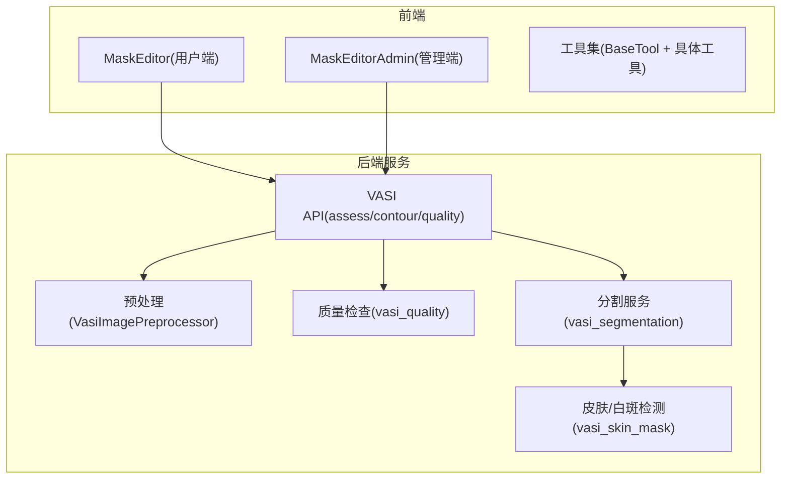
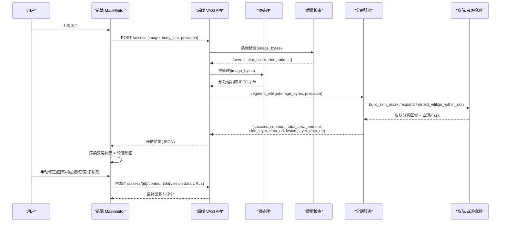
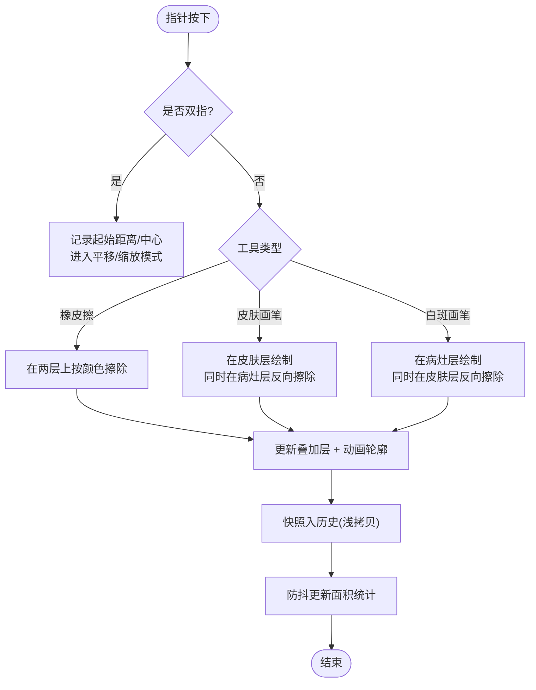
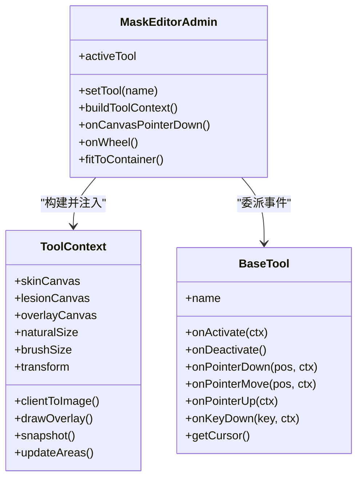
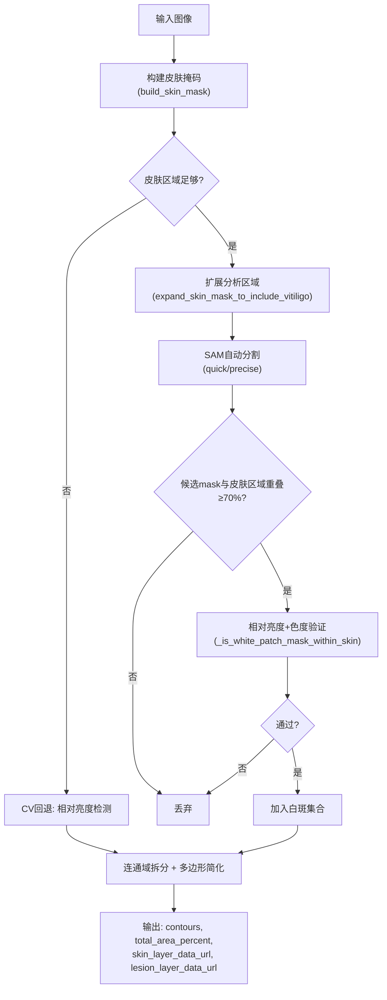
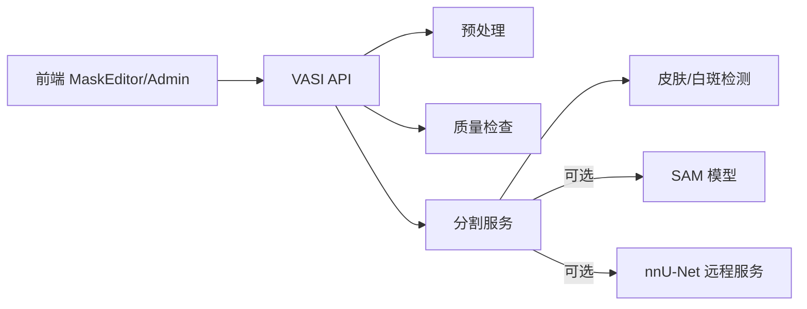

# 图像处理与分割

<cite>
**本文引用的文件**
- [MaskEditor.vue](file://web/app/src/components/tracker/MaskEditor.vue)
- [MaskEditorAdmin.vue](file://web/admin/src/components/labeling/MaskEditorAdmin.vue)
- [BaseTool.ts](file://web/admin/src/components/labeling/tools/BaseTool.ts)
- [vasi_segmentation.py](file://web/backend/services/vasi_segmentation.py)
- [vasi_skin_mask.py](file://web/backend/services/vasi_skin_mask.py)
- [vasi_preprocess.py](file://web/backend/services/vasi_preprocess.py)
- [vasi.py](file://web/backend/api/vasi.py)
- [vasi_quality.py](file://web/backend/services/vasi_quality.py)
</cite>

## 目录
1. [简介](#简介)
2. [项目结构](#项目结构)
3. [核心组件](#核心组件)
4. [架构总览](#架构总览)
5. [详细组件分析](#详细组件分析)
6. [依赖关系分析](#依赖关系分析)
7. [性能考虑](#性能考虑)
8. [故障排查指南](#故障排查指南)
9. [结论](#结论)
10. [附录：API与配置](#附录api与配置)

## 简介
本技术文档聚焦 VASI 评估系统的“图像处理与分割”模块，覆盖前端 MaskEditor 的 Canvas 绘图、图层管理、手动标注工具交互；后端 AI 图像分割（SAM-Med2D/SAM 自动模式 + 皮肤层/病灶层分离、置信度与自动修正）；以及图像预处理、质量检查、参考卡检测与增强策略。同时给出移动端适配方案、性能优化要点、错误处理机制与调试方法，并提供 API 接口说明与参数配置选项。

## 项目结构
该模块由前后端协同构成：
- 前端：提供 MaskEditor（用户侧与管理侧两套实现），负责多图层叠加、画笔/橡皮擦/套索/多边形等工具的交互、缩放平移、动画轮廓渲染与面积统计。
- 后端：提供图像预处理、质量检查、皮肤区域检测、白斑分割（SAM 自动模式 + 相对亮度法）、轮廓提取、置信度计算与结果回传；暴露 REST API 供前端调用。

图表来源
- [MaskEditor.vue:1-120](file://web/app/src/components/tracker/MaskEditor.vue#L1-L120)
- [MaskEditorAdmin.vue:1-120](file://web/admin/src/components/labeling/MaskEditorAdmin.vue#L1-L120)
- [BaseTool.ts:1-72](file://web/admin/src/components/labeling/tools/BaseTool.ts#L1-L72)
- [vasi_preprocess.py:47-224](file://web/backend/services/vasi_preprocess.py#L47-L224)
- [vasi_quality.py:1-200](file://web/backend/services/vasi_quality.py#L1-L200)
- [vasi_skin_mask.py:124-289](file://web/backend/services/vasi_skin_mask.py#L124-L289)
- [vasi_segmentation.py:278-436](file://web/backend/services/vasi_segmentation.py#L278-L436)
- [vasi.py:45-165](file://web/backend/api/vasi.py#L45-L165)

章节来源
- [MaskEditor.vue:1-120](file://web/app/src/components/tracker/MaskEditor.vue#L1-L120)
- [MaskEditorAdmin.vue:1-120](file://web/admin/src/components/labeling/MaskEditorAdmin.vue#L1-L120)
- [BaseTool.ts:1-72](file://web/admin/src/components/labeling/tools/BaseTool.ts#L1-L72)
- [vasi_preprocess.py:47-224](file://web/backend/services/vasi_preprocess.py#L47-L224)
- [vasi_quality.py:1-200](file://web/backend/services/vasi_quality.py#L1-L200)
- [vasi_skin_mask.py:124-289](file://web/backend/services/vasi_skin_mask.py#L124-L289)
- [vasi_segmentation.py:278-436](file://web/backend/services/vasi_segmentation.py#L278-L436)
- [vasi.py:45-165](file://web/backend/api/vasi.py#L45-L165)

## 核心组件
- 前端 MaskEditor（用户端）
  - 三层 Canvas：皮肤层、病灶层、叠加层；支持缩放/平移、双指捏合、滚轮缩放、键盘快捷键。
  - 工具：皮肤画笔、白斑画笔、橡皮擦；支持撤销/重做、面积统计、动画轮廓描边。
  - 性能：工作分辨率上限（最大边 1024px）、willReadFrequently 上下文选择、离屏缓冲预渲染轮廓点阵、requestIdleCallback 延迟面积计算。
- 前端 MaskEditorAdmin（管理端）
  - 插件化工具系统（BaseTool + 具体工具），支持皮肤/白斑画笔、智能填充、套索、多边形、橡皮擦等。
  - 统一事件委托：指针事件→当前工具；支持全屏、缩放平移、快捷键、历史快照。
- 后端预处理
  - 白平衡（灰世界）、对比度增强（CLAHE/PIL 回退）、锐化、尺寸归一化（最大边 1024）。
- 后端质量检查
  - 模糊度、皮肤占比、亮度、分辨率等指标，返回建议。
- 后端分割
  - SAM 自动模式生成候选 mask → 与皮肤分析区域重叠过滤 → 相对亮度+色度判定 → 连通域拆分 → 多边形简化 → 输出 skin/lesion 双层 data URL 与面积百分比。
  - 回退路径：当 SAM 不可用或皮肤区域不足时，使用纯 CV 相对亮度法。

章节来源
- [MaskEditor.vue:58-120](file://web/app/src/components/tracker/MaskEditor.vue#L58-L120)
- [MaskEditorAdmin.vue:20-120](file://web/admin/src/components/labeling/MaskEditorAdmin.vue#L20-L120)
- [BaseTool.ts:9-72](file://web/admin/src/components/labeling/tools/BaseTool.ts#L9-L72)
- [vasi_preprocess.py:47-224](file://web/backend/services/vasi_preprocess.py#L47-L224)
- [vasi_quality.py:1-200](file://web/backend/services/vasi_quality.py#L1-L200)
- [vasi_segmentation.py:278-436](file://web/backend/services/vasi_segmentation.py#L278-L436)

## 架构总览
端到端流程：用户上传图像 → 后端质量检查与预处理 → 皮肤区域检测与白斑分割（SAM + CV 回退）→ 返回 skin/lesion 双层掩码与轮廓 → 前端加载并允许人工修正 → 提交修正后重新计算面积与 VASI 评分。

图表来源
- [vasi.py:45-165](file://web/backend/api/vasi.py#L45-L165)
- [vasi_segmentation.py:278-436](file://web/backend/services/vasi_segmentation.py#L278-L436)
- [vasi_skin_mask.py:124-289](file://web/backend/services/vasi_skin_mask.py#L124-L289)
- [MaskEditor.vue:635-715](file://web/app/src/components/tracker/MaskEditor.vue#L635-L715)

## 详细组件分析

### 前端 MaskEditor（用户端）
- Canvas 与图层
  - 三个 offscreen canvas：皮肤层、病灶层、叠加层；叠加层仅写入，避免 willReadFrequent 开销。
  - 工作分辨率限制：最大边 1024px，降低内存与 CPU 占用，保持视觉反馈质量。
- 交互逻辑
  - 指针事件：单指绘制/擦除；双指捏合缩放+平移；滚轮缩放；Ctrl/Meta+拖拽平移。
  - 工具：皮肤画笔、白斑画笔、橡皮擦；自动在另一层反向擦除以保持互斥。
- 动画轮廓
  - 边缘像素缓存 + 两阶段离屏缓冲（相位A/B），每帧仅 drawImage，显著减少 fillRect 调用。
  - 动画帧率目标约 12fps，隐藏标签页时暂停以省电。
- 历史与面积
  - shallowRef 保存 ImageData 历史（最多 10 步），撤销/重做直接 putImageData。
  - 面积统计通过 getImageData 计数 alpha > 阈值像素，防抖更新避免阻塞主线程。

图表来源
- [MaskEditor.vue:165-321](file://web/app/src/components/tracker/MaskEditor.vue#L165-L321)
- [MaskEditor.vue:323-467](file://web/app/src/components/tracker/MaskEditor.vue#L323-L467)
- [MaskEditor.vue:523-616](file://web/app/src/components/tracker/MaskEditor.vue#L523-L616)

章节来源
- [MaskEditor.vue:58-120](file://web/app/src/components/tracker/MaskEditor.vue#L58-L120)
- [MaskEditor.vue:165-321](file://web/app/src/components/tracker/MaskEditor.vue#L165-L321)
- [MaskEditor.vue:323-467](file://web/app/src/components/tracker/MaskEditor.vue#L323-L467)
- [MaskEditor.vue:523-616](file://web/app/src/components/tracker/MaskEditor.vue#L523-L616)

### 前端 MaskEditorAdmin（管理端）
- 插件化工具系统
  - BaseTool 定义工具上下文与生命周期；MaskEditorAdmin 作为宿主管理画布与事件，将指针事件委派给当前激活工具。
  - 工具包括：皮肤画笔、白斑画笔、智能填充（可 Shift+点击填充皮肤）、套索、多边形、橡皮擦。
- 视图与交互
  - 支持全屏、缩放平移、快捷键（空格拖拽、R 适应窗口、F 全屏、1-6 切换工具）。
  - 图层透明度调节、笔刷大小、容差（填充工具）。
- 历史与导出
  - 基于 useLabelHistory 的快照/撤销/重做；导出 skin/lesion data URL 与标注合成图。

图表来源
- [BaseTool.ts:9-72](file://web/admin/src/components/labeling/tools/BaseTool.ts#L9-L72)
- [MaskEditorAdmin.vue:164-220](file://web/admin/src/components/labeling/MaskEditorAdmin.vue#L164-L220)
- [MaskEditorAdmin.vue:222-351](file://web/admin/src/components/labeling/MaskEditorAdmin.vue#L222-L351)

章节来源
- [BaseTool.ts:9-72](file://web/admin/src/components/labeling/tools/BaseTool.ts#L9-L72)
- [MaskEditorAdmin.vue:164-220](file://web/admin/src/components/labeling/MaskEditorAdmin.vue#L164-L220)
- [MaskEditorAdmin.vue:222-351](file://web/admin/src/components/labeling/MaskEditorAdmin.vue#L222-L351)

### 后端分割与皮肤/病灶层分离
- 皮肤区域检测
  - 自适应 HSV/YCrCb 阈值（根据 Fitzpatrick 肤色估计），形态学开闭去噪；可选排除纯白参考对象。
  - 膨胀 + 凸包扩展，确保白斑（低色素）被纳入分析区域。
- 白斑检测
  - 相对亮度测试：在皮肤区域内，若 L* 高于周围皮肤中位数一定偏移且色度较低，则判定为白斑。
  - 形态学开闭平滑，连通域拆分，最小面积过滤。
- SAM 自动模式
  - 生成候选 mask，要求与皮肤分析区域重叠 ≥70%；进一步用相对亮度与色度筛选。
  - 合并重叠 mask，转多边形（Douglas-Peucker 简化 + 顶点采样），输出 skin/lesion 双层 data URL。
- 回退路径
  - 当 SAM 不可用或皮肤区域不足时，走纯 CV 相对亮度法，仍输出双层掩码与轮廓。

图表来源
- [vasi_skin_mask.py:124-289](file://web/backend/services/vasi_skin_mask.py#L124-L289)
- [vasi_segmentation.py:278-436](file://web/backend/services/vasi_segmentation.py#L278-L436)
- [vasi_segmentation.py:439-568](file://web/backend/services/vasi_segmentation.py#L439-L568)

章节来源
- [vasi_skin_mask.py:124-289](file://web/backend/services/vasi_skin_mask.py#L124-L289)
- [vasi_segmentation.py:278-436](file://web/backend/services/vasi_segmentation.py#L278-L436)
- [vasi_segmentation.py:439-568](file://web/backend/services/vasi_segmentation.py#L439-L568)

### 图像预处理与质量检查
- 预处理
  - 白平衡（灰世界算法）、对比度增强（CLAHE 优先，PIL 回退）、锐化（UnsharpMask）、尺寸归一化（最大边 1024）。
  - 针对 SAM 的专用 resize：最长边 ≤ max_size，最短边不低于 256。
- 质量检查
  - 模糊度、皮肤占比、亮度均值、分辨率等指标，返回整体质量与建议。

章节来源
- [vasi_preprocess.py:47-224](file://web/backend/services/vasi_preprocess.py#L47-L224)
- [vasi_quality.py:1-200](file://web/backend/services/vasi_quality.py#L1-L200)

### 移动端适配与性能优化
- 移动端适配
  - 双指捏合缩放与平移；触摸事件与 PointerEvent 统一处理；容器尺寸动态测量，避免 nextTick 死循环。
  - 动画帧率降至约 12fps，隐藏标签页暂停动画；shallowRef 避免大对象深度响应式开销。
- 性能优化
  - 工作分辨率上限 1024px；叠加层不使用 willReadFrequently；离屏缓冲预渲染轮廓点阵；requestIdleCallback 延迟面积计算；防抖更新。

章节来源
- [MaskEditor.vue:58-120](file://web/app/src/components/tracker/MaskEditor.vue#L58-L120)
- [MaskEditor.vue:323-467](file://web/app/src/components/tracker/MaskEditor.vue#L323-L467)
- [MaskEditor.vue:523-616](file://web/app/src/components/tracker/MaskEditor.vue#L523-L616)
- [MaskEditor.vue:635-715](file://web/app/src/components/tracker/MaskEditor.vue#L635-L715)

## 依赖关系分析
- 前端依赖
  - Vue 响应式与 DOM API；Canvas 2D 上下文；PointerEvent 与 requestAnimationFrame。
- 后端依赖
  - PIL/numpy/OpenCV（条件导入，缺失时降级）；PyTorch/segment_anything（SAM，可选）；httpx（远程 nnU-Net，可选）。
- 耦合与内聚
  - 前端工具解耦（BaseTool 抽象），宿主集中管理事件与画布；后端分割服务分层清晰（预处理→质量→皮肤→分割→API）。

图表来源
- [BaseTool.ts:9-72](file://web/admin/src/components/labeling/tools/BaseTool.ts#L9-L72)
- [vasi_preprocess.py:47-224](file://web/backend/services/vasi_preprocess.py#L47-L224)
- [vasi_quality.py:1-200](file://web/backend/services/vasi_quality.py#L1-L200)
- [vasi_segmentation.py:278-436](file://web/backend/services/vasi_segmentation.py#L278-L436)
- [vasi_segmentation.py:571-686](file://web/backend/services/vasi_segmentation.py#L571-L686)

章节来源
- [BaseTool.ts:9-72](file://web/admin/src/components/labeling/tools/BaseTool.ts#L9-L72)
- [vasi_preprocess.py:47-224](file://web/backend/services/vasi_preprocess.py#L47-L224)
- [vasi_quality.py:1-200](file://web/backend/services/vasi_quality.py#L1-L200)
- [vasi_segmentation.py:278-436](file://web/backend/services/vasi_segmentation.py#L278-L436)
- [vasi_segmentation.py:571-686](file://web/backend/services/vasi_segmentation.py#L571-L686)

## 性能考虑
- 前端
  - 工作分辨率上限与 offscreen 缓冲大幅降低内存与 CPU；动画帧率控制与可见性监听节省电量。
  - shallowRef 与防抖避免频繁重绘与主线程阻塞。
- 后端
  - SAM 快速/精确两种模式；皮肤区域不足时自动回退；形态学操作与连通域拆分控制复杂度。
  - 预处理流水线失败时回退到原图，保证鲁棒性。

[本节为通用性能指导，不直接分析具体文件]

## 故障排查指南
- 图片加载失败
  - 前端显示错误状态并提供重试；检查网络与资源可用性。
- 皮肤区域不足
  - 后端日志提示皮肤比例过低，建议使用更近拍摄或调整构图；自动回退至 CV 相对亮度法。
- SAM 不可用
  - 环境缺少 PyTorch/segment_anything 或权重路径错误；系统自动降级至 CV 回退路径。
- 质量检查不合格
  - 模糊度过高、皮肤占比过低、亮度异常；根据建议重新拍摄。

章节来源
- [MaskEditor.vue:717-722](file://web/app/src/components/tracker/MaskEditor.vue#L717-L722)
- [vasi_segmentation.py:323-336](file://web/backend/services/vasi_segmentation.py#L323-L336)
- [vasi_segmentation.py:495-568](file://web/backend/services/vasi_segmentation.py#L495-L568)
- [vasi.py:511-541](file://web/backend/api/vasi.py#L511-L541)

## 结论
本模块通过前端多层 Canvas 与高效动画渲染，结合后端 SAM 自动分割与相对亮度法的稳健回退，实现了高精度的白斑分割与可视化编辑。预处理与质量检查保障输入质量，移动端适配与性能优化确保流畅体验。用户修正闭环使系统具备持续改进能力，并为后续自进化训练提供数据基础。

[本节为总结性内容，不直接分析具体文件]

## 附录：API与配置
- 创建评估
  - 路径：POST /assess
  - 参数：image（文件）、body_site（部位）、precision（quick/precise）、has_reference（布尔字符串）
  - 返回：VASI 评分、面积百分比、分类、分期、轮廓、skin/lesion 双层 data URL、置信度、源信息等
- 提交轮廓修正
  - 路径：POST /assess/{assessment_id}/contour
  - 参数：contours（多边形列表）、skin_mask_image/lesion_mask_image（data URL）、depigmentation_level（0-1）
  - 返回：最终面积百分比与评分、差异摘要
- 质量检查
  - 路径：POST /check-photo-quality
  - 参数：image（文件）
  - 返回：整体质量、模糊度、皮肤占比、亮度、分辨率与建议
- 获取历史/趋势
  - 路径：GET /history、GET /trend
  - 参数：分页、部位、日期范围、天数
  - 返回：历史记录列表、趋势数据

章节来源
- [vasi.py:45-165](file://web/backend/api/vasi.py#L45-L165)
- [vasi.py:511-541](file://web/backend/api/vasi.py#L511-L541)
- [vasi.py:544-737](file://web/backend/api/vasi.py#L544-L737)
- [vasi.py:204-256](file://web/backend/api/vasi.py#L204-L256)
- [vasi.py:448-472](file://web/backend/api/vasi.py#L448-L472)