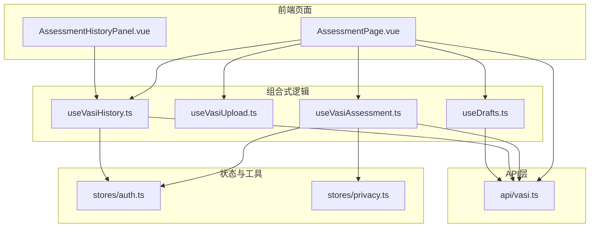
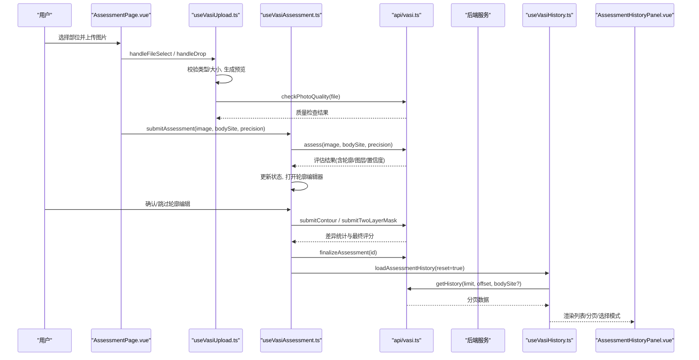
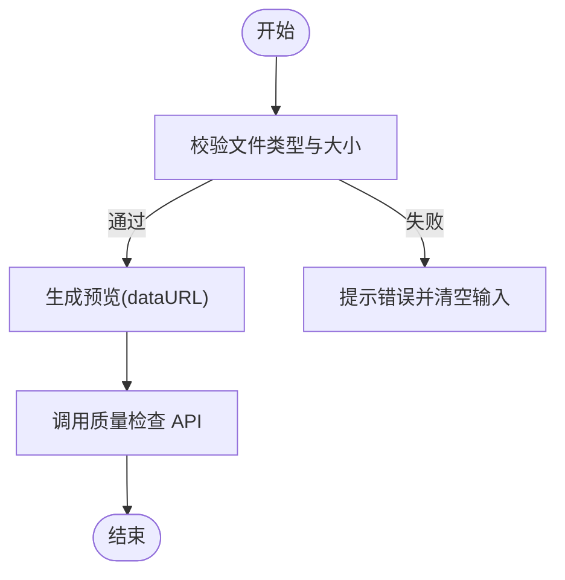
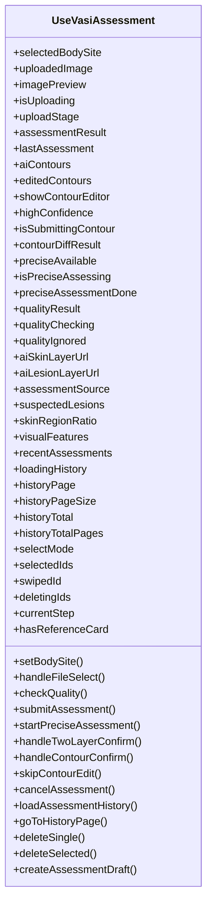
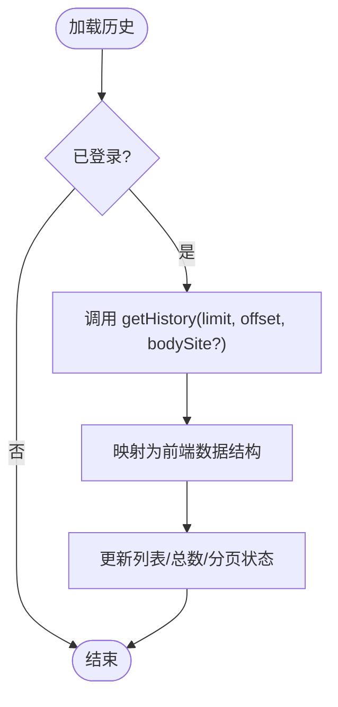
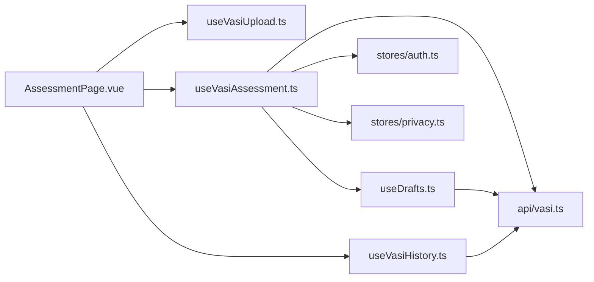

# 数据管理与历史

<cite>
**本文引用的文件**   
- [web/app/src/composables/useVasiAssessment.ts](file://web/app/src/composables/useVasiAssessment.ts)
- [web/app/src/composables/useVasiHistory.ts](file://web/app/src/composables/useVasiHistory.ts)
- [web/app/src/composables/useVasiUpload.ts](file://web/app/src/composables/useVasiUpload.ts)
- [web/app/src/api/vasi.ts](file://web/app/src/api/vasi.ts)
- [web/app/src/views/AssessmentPage.vue](file://web/app/src/views/AssessmentPage.vue)
- [web/app/src/components/tracker/AssessmentHistoryPanel.vue](file://web/app/src/components/tracker/AssessmentHistoryPanel.vue)
- [web/app/src/composables/useDrafts.ts](file://web/app/src/composables/useDrafts.ts)
- [web/app/src/stores/privacy.ts](file://web/app/src/stores/privacy.ts)
- [web/app/src/stores/auth.ts](file://web/app/src/stores/auth.ts)
</cite>

## 目录
1. [简介](#简介)
2. [项目结构](#项目结构)
3. [核心组件](#核心组件)
4. [架构总览](#架构总览)
5. [详细组件分析](#详细组件分析)
6. [依赖关系分析](#依赖关系分析)
7. [性能与大数据处理](#性能与大数据处理)
8. [故障排查指南](#故障排查指南)
9. [结论](#结论)
10. [附录：数据模型与API接口](#附录数据模型与api接口)

## 简介
本技术文档聚焦 VASI 评估系统的数据管理与历史记录能力，覆盖以下关键主题：
- 本地存储策略：基于 localStorage 的草稿与隐私设置同步、前端状态缓存；当前仓库未实现 IndexedDB，建议作为后续扩展方向。
- 历史记录管理：分页加载、按部位筛选、选择模式、滑动删除、批量删除与对比分析入口。
- 上传组件状态管理：文件选择、拖拽、预览生成、质量检查、进度阶段控制。
- 数据模型与 API：VASI 评估、历史、趋势、轮廓/掩码提交、反馈等接口契约。
- 错误恢复与健壮性：网络异常降级、草稿持久化、登录态与令牌刷新。
- 导出与备份恢复：基于草稿系统的本地+云端双写机制，支持隐私保护。
- 性能优化：分页与增量加载、内存释放、大图片处理建议。

## 项目结构
VASI 数据管理与历史功能由多个 composable、API 层、视图与 UI 面板协作完成：
- 业务逻辑与状态：useVasiAssessment（综合流程）、useVasiUpload（上传与预览）、useVasiHistory（历史分页与操作）
- API 封装：vasi.ts 定义类型与请求方法
- 页面编排：AssessmentPage.vue 串联三步流程与历史侧边栏
- 历史面板：AssessmentHistoryPanel.vue 提供分页、多选、对比、删除交互
- 草稿与同步：useDrafts.ts 负责本地草稿与服务器草稿合并、过期清理
- 隐私与认证：privacy.ts 与 auth.ts 提供隐私遮罩与登录态管理

图表来源
- [web/app/src/views/AssessmentPage.vue:1-200](file://web/app/src/views/AssessmentPage.vue#L1-L200)
- [web/app/src/components/tracker/AssessmentHistoryPanel.vue:1-200](file://web/app/src/components/tracker/AssessmentHistoryPanel.vue#L1-L200)
- [web/app/src/composables/useVasiAssessment.ts:1-646](file://web/app/src/composables/useVasiAssessment.ts#L1-L646)
- [web/app/src/composables/useVasiUpload.ts:1-111](file://web/app/src/composables/useVasiUpload.ts#L1-L111)
- [web/app/src/composables/useVasiHistory.ts:1-184](file://web/app/src/composables/useVasiHistory.ts#L1-L184)
- [web/app/src/api/vasi.ts:1-274](file://web/app/src/api/vasi.ts#L1-L274)
- [web/app/src/composables/useDrafts.ts:1-326](file://web/app/src/composables/useDrafts.ts#L1-L326)
- [web/app/src/stores/auth.ts:1-259](file://web/app/src/stores/auth.ts#L1-L259)
- [web/app/src/stores/privacy.ts:1-91](file://web/app/src/stores/privacy.ts#L1-L91)

章节来源
- [web/app/src/views/AssessmentPage.vue:1-200](file://web/app/src/views/AssessmentPage.vue#L1-L200)
- [web/app/src/components/tracker/AssessmentHistoryPanel.vue:1-200](file://web/app/src/components/tracker/AssessmentHistoryPanel.vue#L1-L200)
- [web/app/src/composables/useVasiAssessment.ts:1-646](file://web/app/src/composables/useVasiAssessment.ts#L1-L646)
- [web/app/src/composables/useVasiUpload.ts:1-111](file://web/app/src/composables/useVasiUpload.ts#L1-L111)
- [web/app/src/composables/useVasiHistory.ts:1-184](file://web/app/src/composables/useVasiHistory.ts#L1-L184)
- [web/app/src/api/vasi.ts:1-274](file://web/app/src/api/vasi.ts#L1-L274)
- [web/app/src/composables/useDrafts.ts:1-326](file://web/app/src/composables/useDrafts.ts#L1-L326)
- [web/app/src/stores/auth.ts:1-259](file://web/app/src/stores/auth.ts#L1-L259)
- [web/app/src/stores/privacy.ts:1-91](file://web/app/src/stores/privacy.ts#L1-L91)

## 核心组件
- useVasiUpload：负责文件选择、拖拽校验、预览生成、质量检查、参考卡标记等上传相关状态与方法。
- useVasiAssessment：整合上传、AI 分析、轮廓/掩码编辑、精确评估、结果展示、历史加载与操作、草稿生成与跳转。
- useVasiHistory：独立的历史管理逻辑，包含分页、筛选、选择模式、滑动删除、批量删除与折线图数据计算。
- AssessmentPage：页面编排，驱动三步流程（拍照→分析→结果），联动历史面板与草稿系统。
- AssessmentHistoryPanel：历史列表 UI，支持分页、多选、对比、删除、滑动删除。
- useDrafts：本地草稿与服务器草稿的合并、保存、同步、过期清理与删除。
- privacy：隐私模式开关、敏感信息遮罩、与后端同步。
- auth：登录态、令牌刷新、用户信息持久化与文件访问令牌维护。

章节来源
- [web/app/src/composables/useVasiUpload.ts:1-111](file://web/app/src/composables/useVasiUpload.ts#L1-L111)
- [web/app/src/composables/useVasiAssessment.ts:1-646](file://web/app/src/composables/useVasiAssessment.ts#L1-L646)
- [web/app/src/composables/useVasiHistory.ts:1-184](file://web/app/src/composables/useVasiHistory.ts#L1-L184)
- [web/app/src/views/AssessmentPage.vue:1-200](file://web/app/src/views/AssessmentPage.vue#L1-L200)
- [web/app/src/components/tracker/AssessmentHistoryPanel.vue:1-200](file://web/app/src/components/tracker/AssessmentHistoryPanel.vue#L1-L200)
- [web/app/src/composables/useDrafts.ts:1-326](file://web/app/src/composables/useDrafts.ts#L1-L326)
- [web/app/src/stores/privacy.ts:1-91](file://web/app/src/stores/privacy.ts#L1-L91)
- [web/app/src/stores/auth.ts:1-259](file://web/app/src/stores/auth.ts#L1-L259)

## 架构总览
VASI 数据流从用户上传到结果落库与历史展示的完整链路如下：

图表来源
- [web/app/src/views/AssessmentPage.vue:1-200](file://web/app/src/views/AssessmentPage.vue#L1-L200)
- [web/app/src/composables/useVasiUpload.ts:1-111](file://web/app/src/composables/useVasiUpload.ts#L1-L111)
- [web/app/src/composables/useVasiAssessment.ts:1-646](file://web/app/src/composables/useVasiAssessment.ts#L1-L646)
- [web/app/src/api/vasi.ts:1-274](file://web/app/src/api/vasi.ts#L1-L274)
- [web/app/src/composables/useVasiHistory.ts:1-184](file://web/app/src/composables/useVasiHistory.ts#L1-L184)
- [web/app/src/components/tracker/AssessmentHistoryPanel.vue:1-200](file://web/app/src/components/tracker/AssessmentHistoryPanel.vue#L1-L200)

## 详细组件分析

### 上传组件（useVasiUpload）
- 职责：文件选择与拖拽、类型与大小校验、预览生成、质量检查、参考卡标记。
- 关键点：
  - 使用 FileReader 生成 data URL 用于预览，避免 blob URL 失效问题。
  - 统一的质量检查调用 vasiApi.checkPhotoQuality，返回模糊度、皮肤占比、亮度、分辨率等指标与建议。
  - 支持“是否包含参考卡”标记，影响后续评估精度。

图表来源
- [web/app/src/composables/useVasiUpload.ts:1-111](file://web/app/src/composables/useVasiUpload.ts#L1-L111)
- [web/app/src/api/vasi.ts:1-274](file://web/app/src/api/vasi.ts#L1-L274)

章节来源
- [web/app/src/composables/useVasiUpload.ts:1-111](file://web/app/src/composables/useVasiUpload.ts#L1-L111)
- [web/app/src/api/vasi.ts:1-274](file://web/app/src/api/vasi.ts#L1-L274)

### 评估流程（useVasiAssessment）
- 职责：整合上传、AI 分析、轮廓/掩码编辑、精确评估、结果展示、历史加载与操作、草稿生成。
- 关键点：
  - 分阶段状态：uploading → segmenting → analyzing，便于 UI 反馈。
  - 支持快速与精确两种评估模式，精确模式会先放弃已有草稿再发起新评估，避免脏数据。
  - 轮廓/掩码提交后计算差异统计（匹配、平均点距离），用于模型改进。
  - 历史加载支持 page 与 append 两种模式，兼容不同页面场景。
  - 草稿生成将评估结果写入社区草稿系统，支持跳转到新建页面。

图表来源
- [web/app/src/composables/useVasiAssessment.ts:1-646](file://web/app/src/composables/useVasiAssessment.ts#L1-L646)

章节来源
- [web/app/src/composables/useVasiAssessment.ts:1-646](file://web/app/src/composables/useVasiAssessment.ts#L1-L646)

### 历史记录（useVasiHistory）
- 职责：历史加载、分页、筛选、选择模式、滑动删除、批量删除、折线图数据计算。
- 关键点：
  - 分页参数 limit/offset，支持按 body_site 筛选。
  - 选择模式切换时清空已选项，防止误删。
  - 滑动删除阈值控制，提升移动端体验。
  - 删除后自动回退页码，保证列表连续性。
  - sparklineData 计算最近 7 条评分用于趋势展示。

图表来源
- [web/app/src/composables/useVasiHistory.ts:1-184](file://web/app/src/composables/useVasiHistory.ts#L1-L184)
- [web/app/src/api/vasi.ts:1-274](file://web/app/src/api/vasi.ts#L1-L274)

章节来源
- [web/app/src/composables/useVasiHistory.ts:1-184](file://web/app/src/composables/useVasiHistory.ts#L1-L184)
- [web/app/src/api/vasi.ts:1-274](file://web/app/src/api/vasi.ts#L1-L274)

### 页面编排（AssessmentPage.vue）
- 职责：三步流程编排、历史面板联动、草稿生成与跳转、标注图合成。
- 关键点：
  - 监听上传状态变化，自动进入步骤 2（需要编辑）或步骤 3（直接结果）。
  - 支持跳过轮廓编辑时合成标注图（原图+皮肤层+病灶层叠加）。
  - 取消评估时调用 abandonAssessment，确保草稿清理。
  - 新评估时清理所有中间状态，重置上传与评估状态。

章节来源
- [web/app/src/views/AssessmentPage.vue:1-200](file://web/app/src/views/AssessmentPage.vue#L1-L200)

### 历史面板（AssessmentHistoryPanel.vue）
- 职责：历史列表渲染、分页控件、选择模式、对比与批量删除入口、滑动删除按钮。
- 关键点：
  - 根据 stage 动态着色（好转/稳定期 vs 扩散/进展期）。
  - 多选模式下启用对比与批量删除按钮。
  - 分页下拉框限制可选值（10/20/50），提升一致性。

章节来源
- [web/app/src/components/tracker/AssessmentHistoryPanel.vue:1-200](file://web/app/src/components/tracker/AssessmentHistoryPanel.vue#L1-L200)

### 草稿与同步（useDrafts.ts）
- 职责：本地草稿与服务器草稿合并、保存、同步、过期清理、删除。
- 关键点：
  - 本地草稿以 localStorage 存储，键名前缀 community-draft-，最大存活 30 天。
  - 服务器草稿通过社区 API 获取私有帖子，合并去重（标题+时间戳近似）。
  - saveDraftWithSync 异步同步至服务器，成功后回填 serverId，避免重复创建。
  - 删除草稿时若存在 serverId，则尝试删除服务器记录。

章节来源
- [web/app/src/composables/useDrafts.ts:1-326](file://web/app/src/composables/useDrafts.ts#L1-L326)

### 隐私与认证（privacy.ts, auth.ts）
- 隐私模式：
  - 默认开启，持久化至 localStorage，支持后端同步。
  - 提供手机号与邮箱遮罩方法，保障隐私显示。
- 认证管理：
  - 登录态与用户信息持久化，支持刷新令牌与自动刷新文件访问令牌。
  - 登出时清理本地存储与文件令牌。

章节来源
- [web/app/src/stores/privacy.ts:1-91](file://web/app/src/stores/privacy.ts#L1-L91)
- [web/app/src/stores/auth.ts:1-259](file://web/app/src/stores/auth.ts#L1-L259)

## 依赖关系分析
- 组件耦合：
  - AssessmentPage 依赖三个 composable（upload/assess/history）与 API 层。
  - useVasiAssessment 依赖 vasiApi、authStore、privacyStore、useDrafts。
  - useVasiHistory 依赖 vasiApi、authStore。
- 外部依赖：
  - vasiApi 封装所有 VASI 相关 HTTP 请求，包括评估、历史、趋势、轮廓/掩码提交、反馈等。
  - 草稿系统依赖社区 API（创建/更新/删除帖子）。
- 潜在循环依赖：无直接循环，但需注意在页面中避免重复初始化 composable。

图表来源
- [web/app/src/views/AssessmentPage.vue:1-200](file://web/app/src/views/AssessmentPage.vue#L1-L200)
- [web/app/src/composables/useVasiAssessment.ts:1-646](file://web/app/src/composables/useVasiAssessment.ts#L1-L646)
- [web/app/src/composables/useVasiHistory.ts:1-184](file://web/app/src/composables/useVasiHistory.ts#L1-L184)
- [web/app/src/composables/useVasiUpload.ts:1-111](file://web/app/src/composables/useVasiUpload.ts#L1-L111)
- [web/app/src/api/vasi.ts:1-274](file://web/app/src/api/vasi.ts#L1-L274)
- [web/app/src/composables/useDrafts.ts:1-326](file://web/app/src/composables/useDrafts.ts#L1-L326)
- [web/app/src/stores/auth.ts:1-259](file://web/app/src/stores/auth.ts#L1-L259)
- [web/app/src/stores/privacy.ts:1-91](file://web/app/src/stores/privacy.ts#L1-L91)

章节来源
- [web/app/src/views/AssessmentPage.vue:1-200](file://web/app/src/views/AssessmentPage.vue#L1-L200)
- [web/app/src/composables/useVasiAssessment.ts:1-646](file://web/app/src/composables/useVasiAssessment.ts#L1-L646)
- [web/app/src/composables/useVasiHistory.ts:1-184](file://web/app/src/composables/useVasiHistory.ts#L1-L184)
- [web/app/src/composables/useVasiUpload.ts:1-111](file://web/app/src/composables/useVasiUpload.ts#L1-L111)
- [web/app/src/api/vasi.ts:1-274](file://web/app/src/api/vasi.ts#L1-L274)
- [web/app/src/composables/useDrafts.ts:1-326](file://web/app/src/composables/useDrafts.ts#L1-L326)
- [web/app/src/stores/auth.ts:1-259](file://web/app/src/stores/auth.ts#L1-L259)
- [web/app/src/stores/privacy.ts:1-91](file://web/app/src/stores/privacy.ts#L1-L91)

## 性能与大数据处理
- 分页与增量加载：
  - 历史加载采用分页（limit/offset），避免一次性拉取大量数据。
  - 支持 append 模式用于“加载更多”，减少频繁重绘。
- 内存管理：
  - 上传完成后及时清理中间状态（uploadedImage、imagePreview、aiContours 等），避免内存泄漏。
  - 预览使用 data URL 而非 blob URL，避免浏览器撤销 URL 导致的失效。
- 大图片处理建议：
  - 前端可引入压缩库（如 pica、browser-image-compression）在上传前压缩图片，降低传输与解析开销。
  - 对大图进行缩略图生成与懒加载，减少首屏压力。
- IndexedDB 扩展建议：
  - 当前未使用 IndexedDB，可在未来将大对象（如 base64 图像、临时 mask）迁移至 IndexedDB，减轻 localStorage 容量压力。
- 并发与超时：
  - 评估接口设置较长超时（180s），避免长耗时任务被中断。
  - 草稿同步采用异步非阻塞方式，避免阻塞主流程。

[本节为通用指导，不直接分析具体文件]

## 故障排查指南
- 上传失败：
  - 检查文件类型与大小限制，确保 image/* 且 ≤10MB。
  - 查看质量检查结果 suggestions，针对性调整拍摄条件。
- 评估失败：
  - 检查登录态与 token 有效性，必要时触发 refreshToken。
  - 查看网络错误响应 detail，定位后端具体错误。
- 历史加载异常：
  - 确认已登录，检查 limit/offset 参数是否正确。
  - 若列表为空，检查分页回退逻辑是否生效。
- 草稿丢失：
  - 检查 localStorage 是否被清理或跨设备不同步。
  - 确认服务器草稿是否成功创建并回填 serverId。
- 隐私显示异常：
  - 检查 privacyMode 状态是否与后端一致。
  - 确认遮罩方法调用位置正确。

章节来源
- [web/app/src/composables/useVasiUpload.ts:1-111](file://web/app/src/composables/useVasiUpload.ts#L1-L111)
- [web/app/src/composables/useVasiAssessment.ts:1-646](file://web/app/src/composables/useVasiAssessment.ts#L1-L646)
- [web/app/src/composables/useVasiHistory.ts:1-184](file://web/app/src/composables/useVasiHistory.ts#L1-L184)
- [web/app/src/composables/useDrafts.ts:1-326](file://web/app/src/composables/useDrafts.ts#L1-L326)
- [web/app/src/stores/privacy.ts:1-91](file://web/app/src/stores/privacy.ts#L1-L91)
- [web/app/src/stores/auth.ts:1-259](file://web/app/src/stores/auth.ts#L1-L259)

## 结论
VASI 评估系统的前端数据管理与历史记录功能通过清晰的组件拆分与 API 封装，实现了稳定的上传、评估、历史与草稿管理能力。当前实现以 localStorage 为主，结合服务器草稿同步，满足基本需求。未来可扩展 IndexedDB 以提升大对象存储能力，并引入前端图片压缩与更细粒度的缓存策略，进一步优化性能与用户体验。

[本节为总结，不直接分析具体文件]

## 附录：数据模型与API接口
- 数据模型（节选）：
  - VasiAssessmentResponse：评估结果，包含 id、image_url、vasi_score、body_site、area_percentage、classification、stage、contours、confidence、precision_level、final_vasi_score 等。
  - VasiHistoryItem：历史记录项，包含 id、image_url、vasi_score、body_site、area_percentage、classification、stage、assessment_date、final_vasi_score 等。
  - QualityCheckResult：质量检查结果，包含 overall、blur_score、skin_ratio、brightness_mean、resolution、suggestions 等。
  - VisualFeatures：六维视觉特征分析，包含 visibility/color/border/shape/surface/distribution 及描述与建议。
- API 接口（节选）：
  - assess(image, bodySite, precision, options)：提交评估，返回评估结果。
  - getHistory(limit, offset, bodySite?)：获取历史分页数据。
  - submitContour(assessmentId, contours, maskImage?)：提交轮廓修正。
  - submitTwoLayerMask(assessmentId, skinMaskImage, lesionMaskImage)：提交双层掩码。
  - finalizeAssessment(assessmentId)：完成评估，落库。
  - abandonAssessment(assessmentId)：放弃评估，清理草稿。
  - checkPhotoQuality(image)：照片质量检查。
  - preparePromptable/click/refineCircle：交互式提示点选与圆环细化接口。
  - 反馈接口：getPrompt、submitRating、submitActiveQuery、recordStay、recordShare。

章节来源
- [web/app/src/api/vasi.ts:1-274](file://web/app/src/api/vasi.ts#L1-L274)