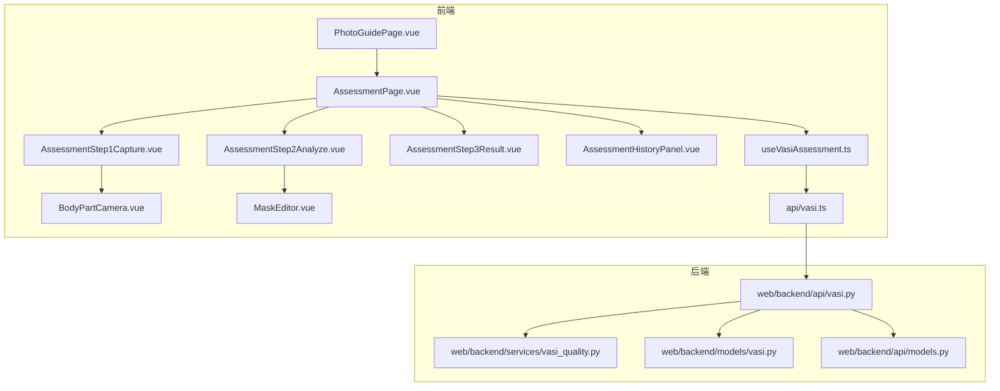
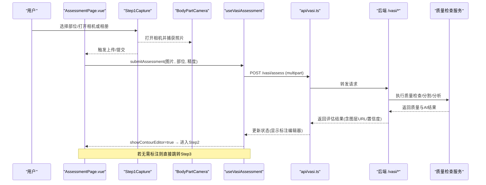
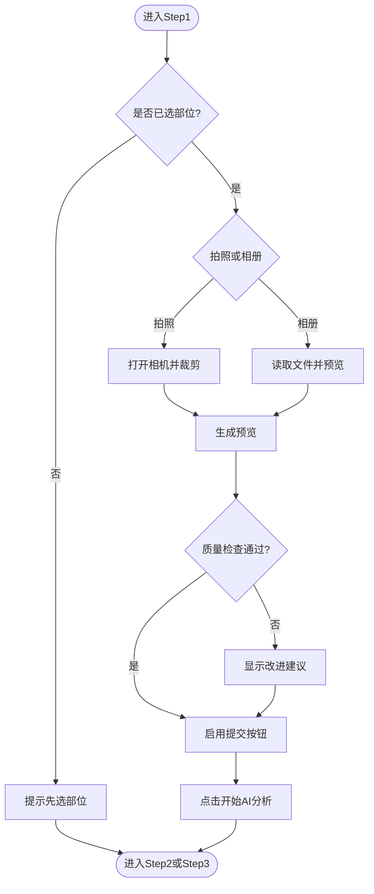
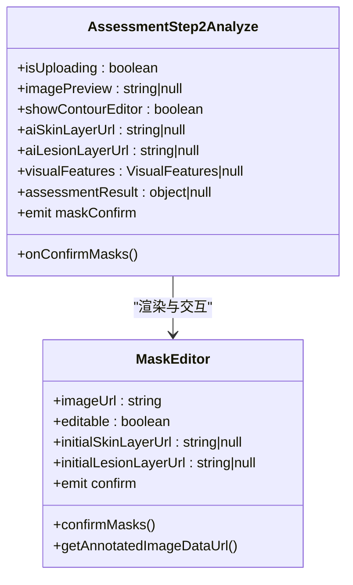
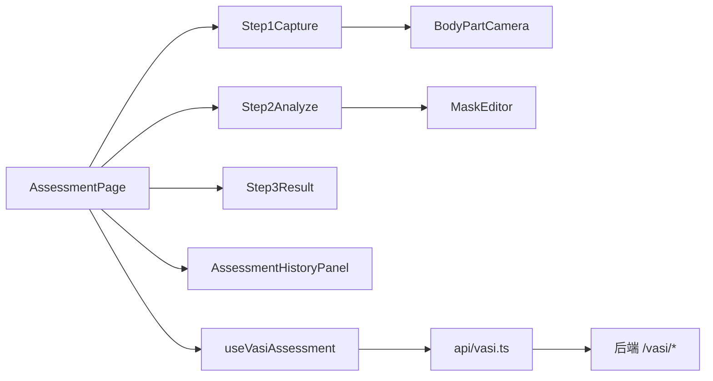

# 用户界面组件

<cite>
**本文引用的文件**
- [AssessmentPage.vue](file://web/app/src/views/AssessmentPage.vue)
- [AssessmentStep1Capture.vue](file://web/app/src/components/tracker/AssessmentStep1Capture.vue)
- [AssessmentStep2Analyze.vue](file://web/app/src/components/tracker/AssessmentStep2Analyze.vue)
- [AssessmentStep3Result.vue](file://web/app/src/components/tracker/AssessmentStep3Result.vue)
- [BodyPartCamera.vue](file://web/app/src/components/tracker/BodyPartCamera.vue)
- [MaskEditor.vue](file://web/app/src/components/tracker/MaskEditor.vue)
- [useVasiAssessment.ts](file://web/app/src/composables/useVasiAssessment.ts)
- [vasi.ts](file://web/app/src/api/vasi.ts)
- [vasi.py](file://web/backend/api/vasi.py)
- [vasi_quality.py](file://web/backend/services/vasi_quality.py)
- [models.py](file://web/backend/api/models.py)
- [vasi_model.py](file://web/backend/models/vasi.py)
- [PhotoGuidePage.vue](file://web/app/src/views/PhotoGuidePage.vue)
- [AssessmentHistoryPanel.vue](file://web/app/src/components/tracker/AssessmentHistoryPanel.vue)
</cite>

## 目录
1. [简介](#简介)
2. [项目结构](#项目结构)
3. [核心组件](#核心组件)
4. [架构总览](#架构总览)
5. [详细组件分析](#详细组件分析)
6. [依赖关系分析](#依赖关系分析)
7. [性能考量](#性能考量)
8. [故障排查指南](#故障排查指南)
9. [结论](#结论)
10. [附录](#附录)

## 简介
本文件面向VASI评估系统的用户界面开发，围绕“三步评估流程”的UI设计、状态管理、数据流转与交互逻辑进行系统化说明。内容覆盖：
- 拍照引导（数字人部位选择、相机取景框、相册上传）
- AI分析进度（上传、分割、分析阶段提示）
- 结果展示（评分、阶段、趋势、解读与建议）
- 标注确认（双图层/轮廓编辑、撤销重做、面积统计）
- 历史记录（桌面端侧边栏、移动端底部抽屉）
- 图片质量检查、分享与草稿生成
- 响应式布局、可访问性、错误处理与国际化最佳实践

## 项目结构
前端采用Vue 3 + TypeScript，按功能域组织：
- 视图层：AssessmentPage 作为三步流程编排入口；PhotoGuidePage 提供拍照指导
- 组件层：步骤组件（Step1/Step2/Step3）、BodyPartCamera、MaskEditor、历史面板
- 组合式函数：useVasiAssessment 封装上传、质量检查、AI评估、标注提交、历史等状态与方法
- API层：vasi.ts 统一封装后端接口调用
- 后端：API路由、服务层质量检查、模型与数据模型定义

图表来源
- [AssessmentPage.vue:1-200](file://web/app/src/views/AssessmentPage.vue#L1-L200)
- [AssessmentStep1Capture.vue:1-150](file://web/app/src/components/tracker/AssessmentStep1Capture.vue#L1-L150)
- [AssessmentStep2Analyze.vue:1-119](file://web/app/src/components/tracker/AssessmentStep2Analyze.vue#L1-L119)
- [AssessmentStep3Result.vue:1-119](file://web/app/src/components/tracker/AssessmentStep3Result.vue#L1-L119)
- [BodyPartCamera.vue:1-389](file://web/app/src/components/tracker/BodyPartCamera.vue#L1-L389)
- [MaskEditor.vue:1-200](file://web/app/src/components/tracker/MaskEditor.vue#L1-L200)
- [useVasiAssessment.ts:1-200](file://web/app/src/composables/useVasiAssessment.ts#L1-L200)
- [vasi.ts:122-237](file://web/app/src/api/vasi.ts#L122-L237)
- [vasi.py:511-541](file://web/backend/api/vasi.py#L511-L541)
- [vasi_quality.py:237-271](file://web/backend/services/vasi_quality.py#L237-L271)
- [models.py:46-93](file://web/backend/api/models.py#L46-L93)
- [vasi_model.py:95-128](file://web/backend/models/vasi.py#L95-L128)

章节来源
- [AssessmentPage.vue:1-200](file://web/app/src/views/AssessmentPage.vue#L1-L200)
- [vasi.ts:122-237](file://web/app/src/api/vasi.ts#L122-L237)
- [vasi.py:511-541](file://web/backend/api/vasi.py#L511-L541)
- [vasi_quality.py:237-271](file://web/backend/services/vasi_quality.py#L237-L271)
- [models.py:46-93](file://web/backend/api/models.py#L46-L93)
- [vasi_model.py:95-128](file://web/backend/models/vasi.py#L95-L128)

## 核心组件
- AssessmentPage：三步流程编排、标签页切换（白斑测评/体检报告）、历史面板联动、结果分享草稿生成
- Step1（拍照引导）：数字人部位选择、相机取景、相册上传、预览与质量提示、自动滚动至提交按钮
- Step2（AI分析与标注）：信息条、视觉特征卡片、MaskEditor画布、确认/跳过/取消操作
- Step3（结果展示）：评分卡、阶段说明、趋势折线、低信心提示、分享与继续测评
- BodyPartCamera：相机权限、前后摄像头切换、SVG遮罩定位、裁剪捕获
- MaskEditor：双图层（皮肤/病灶）绘制、缩放平移、撤销重做、面积统计、导出标注图
- useVasiAssessment：统一状态机与业务方法（上传、质量检查、评估、标注提交、历史、草稿）
- vasi.ts：前端API封装（评估、历史、趋势、标注、质量检查、反馈）

章节来源
- [AssessmentPage.vue:1-200](file://web/app/src/views/AssessmentPage.vue#L1-L200)
- [AssessmentStep1Capture.vue:1-150](file://web/app/src/components/tracker/AssessmentStep1Capture.vue#L1-L150)
- [AssessmentStep2Analyze.vue:1-119](file://web/app/src/components/tracker/AssessmentStep2Analyze.vue#L1-L119)
- [AssessmentStep3Result.vue:1-119](file://web/app/src/components/tracker/AssessmentStep3Result.vue#L1-L119)
- [BodyPartCamera.vue:1-389](file://web/app/src/components/tracker/BodyPartCamera.vue#L1-L389)
- [MaskEditor.vue:1-200](file://web/app/src/components/tracker/MaskEditor.vue#L1-L200)
- [useVasiAssessment.ts:1-200](file://web/app/src/composables/useVasiAssessment.ts#L1-L200)
- [vasi.ts:122-237](file://web/app/src/api/vasi.ts#L122-L237)

## 架构总览
三步评估流程从页面到后端的完整调用链如下：

图表来源
- [AssessmentPage.vue:54-122](file://web/app/src/views/AssessmentPage.vue#L54-L122)
- [AssessmentStep1Capture.vue:36-86](file://web/app/src/components/tracker/AssessmentStep1Capture.vue#L36-L86)
- [BodyPartCamera.vue:185-260](file://web/app/src/components/tracker/BodyPartCamera.vue#L185-L260)
- [useVasiAssessment.ts:214-259](file://web/app/src/composables/useVasiAssessment.ts#L214-L259)
- [vasi.ts:122-134](file://web/app/src/api/vasi.ts#L122-L134)
- [vasi.py:511-541](file://web/backend/api/vasi.py#L511-L541)
- [vasi_quality.py:237-271](file://web/backend/services/vasi_quality.py#L237-L271)

## 详细组件分析

### 步骤一：拍照引导（AssessmentStep1Capture）
- 职责：数字人部位选择、相机/相册输入、预览、质量提示、自动滚动至提交按钮
- 关键交互：
  - 未选部位时阻止上传/拍照，给出提示
  - 上传后自动解码图片并滚动到“开始AI分析”按钮
  - 根据质量检查结果展示建议提示
- 事件：selectPart、uploadFile、cameraCapture、removeImage、submit

图表来源
- [AssessmentStep1Capture.vue:36-86](file://web/app/src/components/tracker/AssessmentStep1Capture.vue#L36-L86)
- [AssessmentStep1Capture.vue:118-144](file://web/app/src/components/tracker/AssessmentStep1Capture.vue#L118-L144)

章节来源
- [AssessmentStep1Capture.vue:1-150](file://web/app/src/components/tracker/AssessmentStep1Capture.vue#L1-L150)

### 步骤二：AI分析与标注（AssessmentStep2Analyze + MaskEditor）
- 职责：展示AI分析进度、视觉特征、双图层标注、确认/跳过/取消
- 关键交互：
  - 顶部信息条显示VASI分数、阶段、高置信病灶数量
  - 可视化特征卡片可折叠查看
  - MaskEditor支持皮肤/病灶画笔、橡皮擦、缩放平移、撤销重做、面积统计
  - 确认时导出标注合成图用于分享
- 事件：maskConfirm、skipContourEdit、cancelAssessment

图表来源
- [AssessmentStep2Analyze.vue:11-54](file://web/app/src/components/tracker/AssessmentStep2Analyze.vue#L11-L54)
- [MaskEditor.vue:1-200](file://web/app/src/components/tracker/MaskEditor.vue#L1-L200)

章节来源
- [AssessmentStep2Analyze.vue:1-119](file://web/app/src/components/tracker/AssessmentStep2Analyze.vue#L1-L119)
- [MaskEditor.vue:1-200](file://web/app/src/components/tracker/MaskEditor.vue#L1-L200)

### 步骤三：结果展示（AssessmentStep3Result）
- 职责：评分卡、阶段说明、趋势折线、低信心提示、分享与继续测评
- 关键交互：
  - 根据分数区间显示不同颜色与解读
  - 当存在历史数据时绘制迷你趋势线
  - 低信心时提示重新拍摄
  - 一键分享并生成社区草稿

章节来源
- [AssessmentStep3Result.vue:1-119](file://web/app/src/components/tracker/AssessmentStep3Result.vue#L1-L119)

### 相机与取景（BodyPartCamera）
- 职责：获取媒体流、叠加SVG遮罩、计算裁剪区域、镜像前摄输出
- 关键点：
  - 根据部位动态生成遮罩形状（椭圆/矩形）
  - 将SVG坐标映射到视频像素坐标，计算裁剪矩形
  - 捕获为JPEG Blob并回传父组件

章节来源
- [BodyPartCamera.vue:1-389](file://web/app/src/components/tracker/BodyPartCamera.vue#L1-L389)

### 组合式函数：useVasiAssessment
- 职责：统一管理上传、质量检查、评估、标注、历史、草稿等状态与方法
- 关键流程：
  - 选择部位→上传→质量检查→提交评估→显示标注→提交标注→完成→加载历史
  - 精确模式：在快速评估后可再次发起更精细的分析
  - 历史分页：支持page/append两种模式，支持删除与批量删除
  - 草稿：将评估结果写入社区草稿并跳转

章节来源
- [useVasiAssessment.ts:1-200](file://web/app/src/composables/useVasiAssessment.ts#L1-L200)
- [useVasiAssessment.ts:214-388](file://web/app/src/composables/useVasiAssessment.ts#L214-L388)
- [useVasiAssessment.ts:406-592](file://web/app/src/composables/useVasiAssessment.ts#L406-L592)

### API与后端对接
- 前端API封装：评估、历史、趋势、标注提交、质量检查、反馈
- 后端质量检查：blur、brightness、skin_ratio、resolution等指标，综合评分与建议
- 数据模型：评估项、历史项、趋势汇总、错误响应

章节来源
- [vasi.ts:122-237](file://web/app/src/api/vasi.ts#L122-L237)
- [vasi.py:511-541](file://web/backend/api/vasi.py#L511-L541)
- [vasi_quality.py:237-271](file://web/backend/services/vasi_quality.py#L237-L271)
- [models.py:46-93](file://web/backend/api/models.py#L46-L93)
- [vasi_model.py:95-128](file://web/backend/models/vasi.py#L95-L128)

## 依赖关系分析
- AssessmentPage 依赖三个步骤组件与历史面板，并通过 useVasiAssessment 协调状态
- Step1 依赖 BodyPartCamera 与 Toast 提示
- Step2 依赖 MaskEditor 与 VisualFeaturesCard
- Step3 依赖评分解读与阶段描述工具函数
- 所有网络请求通过 vasi.ts 统一封装，后端由 vasi.py 路由分发至服务层

图表来源
- [AssessmentPage.vue:1-200](file://web/app/src/views/AssessmentPage.vue#L1-L200)
- [useVasiAssessment.ts:1-200](file://web/app/src/composables/useVasiAssessment.ts#L1-L200)
- [vasi.ts:122-237](file://web/app/src/api/vasi.ts#L122-L237)

章节来源
- [AssessmentPage.vue:1-200](file://web/app/src/views/AssessmentPage.vue#L1-L200)
- [useVasiAssessment.ts:1-200](file://web/app/src/composables/useVasiAssessment.ts#L1-L200)
- [vasi.ts:122-237](file://web/app/src/api/vasi.ts#L122-L237)

## 性能考量
- 画布工作分辨率限制：MaskEditor将最大维度限制为1024px，显著降低内存与CPU占用，同时保持视觉质量
- 上下文优化：仅对需要读像素的画布使用 willReadFrequent，覆盖层画布避免该标志以获得GPU加速
- 图片预览：使用Data URL确保上传后仍可用，避免blob失效问题
- 相机裁剪：基于SVG viewBox与object-cover映射计算裁剪矩形，减少无效像素处理
- 历史分页：默认每页10条，支持切换大小，避免一次性加载过多数据

[本节为通用性能建议，不直接引用具体代码行]

## 故障排查指南
- 相机权限被拒绝：BodyPartCamera捕获异常并提示用户前往设置允许
- 图片过大：后端质量检查接口限制单张不超过20MB，超出返回413
- 质量不达标：前端根据overall/suggestions提示改进（模糊、过暗/过亮、无皮肤区域、分辨率过低）
- 评估失败：捕获后端detail或message并toast提示，保留当前步骤便于重试
- 标注提交失败：记录差异距离并提示，必要时回退到跳过或重新标注
- 历史加载失败：catch并打印错误日志，保持UI可用

章节来源
- [BodyPartCamera.vue:185-207](file://web/app/src/components/tracker/BodyPartCamera.vue#L185-L207)
- [vasi.py:511-541](file://web/backend/api/vasi.py#L511-L541)
- [useVasiAssessment.ts:214-259](file://web/app/src/composables/useVasiAssessment.ts#L214-L259)
- [useVasiAssessment.ts:314-368](file://web/app/src/composables/useVasiAssessment.ts#L314-L368)

## 结论
本系统以清晰的三步流程组织VASI评估体验：从拍照引导到AI分析再到结果展示，配合标注确认与历史记录，形成闭环。通过组合式函数集中管理状态，组件职责单一且可复用，前后端接口契约明确。整体设计兼顾移动端与桌面端体验，具备完善的错误处理与性能优化策略，适合持续迭代与扩展。

[本节为总结性内容，不直接引用具体代码行]

## 附录

### 组件属性接口与事件回调（摘要）
- AssessmentStep1Capture
  - 属性：selectedBodySite、imagePreview、qualityResult、qualityChecking、isSubmitting、uploadStage
  - 事件：selectPart、uploadFile、openCamera、cameraCapture、removeImage、submit
- AssessmentStep2Analyze
  - 属性：isUploading、uploadStage、imagePreview、showContourEditor、aiSkinLayerUrl、aiLesionLayerUrl、assessmentSource、suspectedLesions、visualFeatures、highConfidence、isSubmittingContour、assessmentResult
  - 事件：maskConfirm、skipContourEdit、cancelAssessment
- AssessmentStep3Result
  - 属性：lastAssessment、sparklineData
  - 事件：newAssessment、shareResult
- BodyPartCamera
  - 属性：modelValue、bodyPart
  - 事件：update:modelValue、captured(file, meta)
- MaskEditor
  - 属性：imageUrl、editable、fullHeight、initialSkinLayerUrl、initialLesionLayerUrl
  - 事件：confirm({ skinMaskDataUrl, lesionMaskDataUrl })、cancel

章节来源
- [AssessmentStep1Capture.vue:18-27](file://web/app/src/components/tracker/AssessmentStep1Capture.vue#L18-L27)
- [AssessmentStep2Analyze.vue:11-19](file://web/app/src/components/tracker/AssessmentStep2Analyze.vue#L11-L19)
- [AssessmentStep3Result.vue:10-15](file://web/app/src/components/tracker/AssessmentStep3Result.vue#L10-L15)
- [BodyPartCamera.vue:4-12](file://web/app/src/components/tracker/BodyPartCamera.vue#L4-L12)
- [MaskEditor.vue:4-15](file://web/app/src/components/tracker/MaskEditor.vue#L4-L15)

### 样式定制选项与可访问性
- 主题与深色模式：组件广泛使用Tailwind dark变体，支持深色背景与对比度调整
- 安全区适配：底部操作区域考虑safe-area-inset-bottom，避免被导航遮挡
- 可访问性：按钮最小触控尺寸、aria-label、语义化元素、键盘友好
- 国际化：文案集中在模板中，便于替换为多语言资源

章节来源
- [AssessmentStep1Capture.vue:90-144](file://web/app/src/components/tracker/AssessmentStep1Capture.vue#L90-L144)
- [AssessmentStep2Analyze.vue:57-119](file://web/app/src/components/tracker/AssessmentStep2Analyze.vue#L57-L119)
- [AssessmentStep3Result.vue:31-119](file://web/app/src/components/tracker/AssessmentStep3Result.vue#L31-L119)

### 用户体验优化与错误处理最佳实践
- 上传前校验：类型、大小、部位选择
- 质量检查：实时反馈改进建议，避免无效提交
- 进度提示：上传/分割/分析阶段清晰标识
- 容错：失败时保留状态，允许重试或降级（如跳过标注）
- 反馈：成功/失败/信息类toast，区分场景与时长

章节来源
- [useVasiAssessment.ts:149-207](file://web/app/src/composables/useVasiAssessment.ts#L149-L207)
- [useVasiAssessment.ts:214-259](file://web/app/src/composables/useVasiAssessment.ts#L214-L259)
- [AssessmentStep1Capture.vue:36-86](file://web/app/src/components/tracker/AssessmentStep1Capture.vue#L36-L86)

### 历史记录展示（桌面端侧边栏与移动端底部抽屉）
- AssessmentHistoryPanel 接收历史列表、分页、选择模式、滑动删除等状态
- 桌面端固定左侧宽度，移动端通过父组件控制底部抽屉显示
- 支持查看详情、比较选中项、新建评估、翻页与每页条数设置

章节来源
- [AssessmentHistoryPanel.vue:1-45](file://web/app/src/components/tracker/AssessmentHistoryPanel.vue#L1-L45)
- [AssessmentPage.vue:1-200](file://web/app/src/views/AssessmentPage.vue#L1-L200)

### 图片上传组件、质量检查提示、标注确认界面与结果分享
- 图片上传：相机/相册双通道，预览与移除
- 质量检查：后端多维指标，前端展示建议
- 标注确认：双图层编辑、面积统计、差异记录
- 结果分享：生成带图层叠加的合成图，创建社区草稿并跳转

章节来源
- [AssessmentStep1Capture.vue:118-144](file://web/app/src/components/tracker/AssessmentStep1Capture.vue#L118-L144)
- [AssessmentStep2Analyze.vue:35-54](file://web/app/src/components/tracker/AssessmentStep2Analyze.vue#L35-L54)
- [AssessmentPage.vue:147-172](file://web/app/src/views/AssessmentPage.vue#L147-L172)
- [vasi.ts:122-191](file://web/app/src/api/vasi.ts#L122-L191)