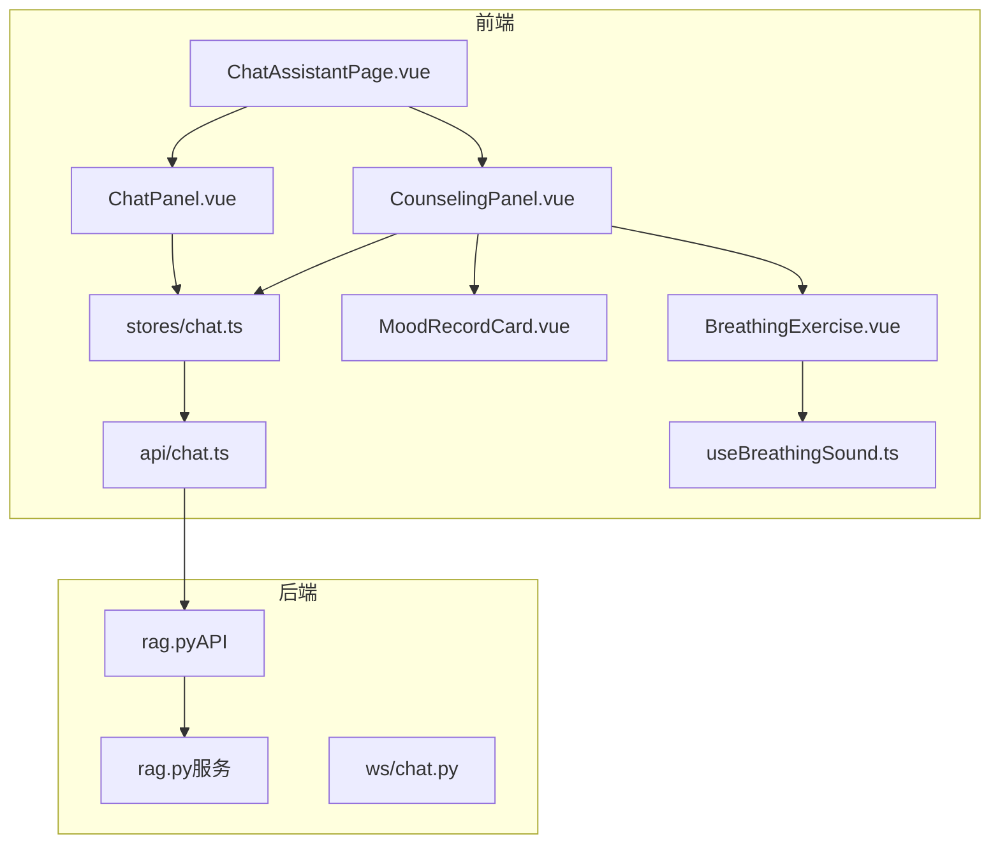
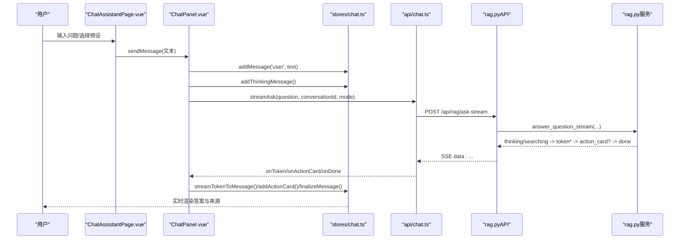
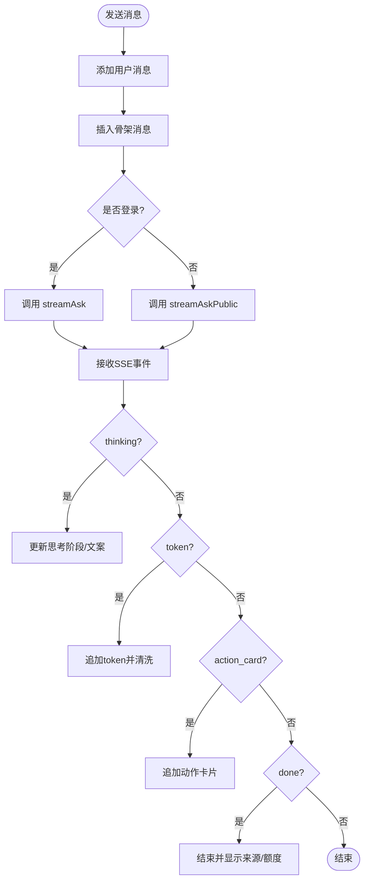
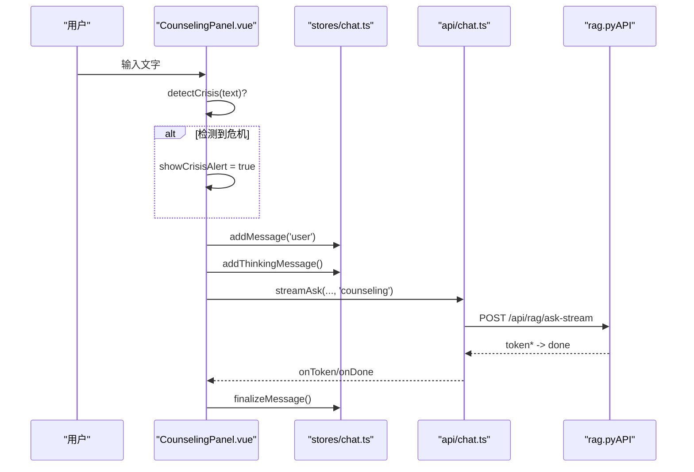
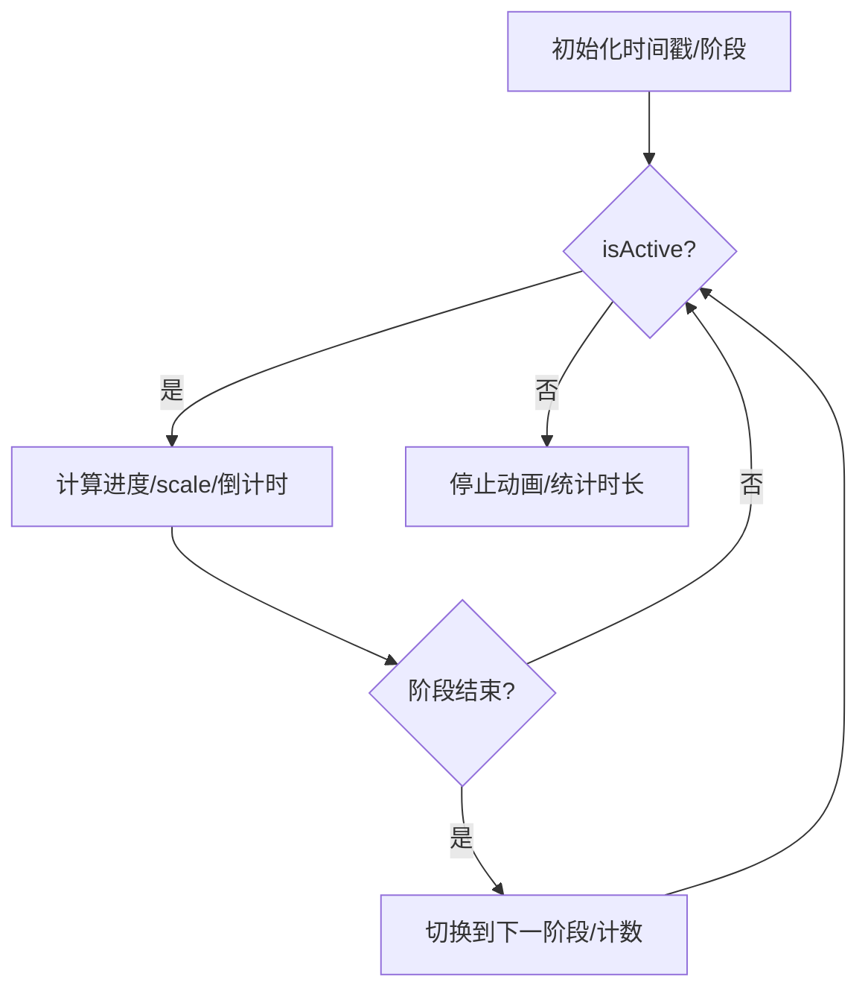
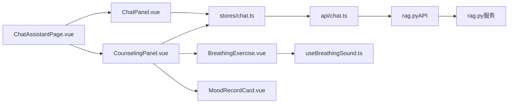

# AI助手模块

<cite>
**本文引用的文件**
- [ChatPanel.vue](file://web/app/src/components/assistant/ChatPanel.vue)
- [CounselingPanel.vue](file://web/app/src/components/assistant/CounselingPanel.vue)
- [BreathingExercise.vue](file://web/app/src/components/assistant/BreathingExercise.vue)
- [MoodRecordCard.vue](file://web/app/src/components/assistant/MoodRecordCard.vue)
- [ChatAssistantPage.vue](file://web/app/src/views/ChatAssistantPage.vue)
- [chat.ts](file://web/app/src/api/chat.ts)
- [chat.ts（store）](file://web/app/src/stores/chat.ts)
- [useBreathingSound.ts](file://web/app/src/composables/useBreathingSound.ts)
- [rag.py（API）](file://web/backend/api/rag.py)
- [rag.py（服务）](file://web/backend/services/rag.py)
- [chat.py（WebSocket）](file://web/backend/ws/chat.py)
</cite>

## 目录
1. [简介](#简介)
2. [项目结构](#项目结构)
3. [核心组件](#核心组件)
4. [架构总览](#架构总览)
5. [详细组件分析](#详细组件分析)
6. [依赖关系分析](#依赖关系分析)
7. [性能考虑](#性能考虑)
8. [故障排查指南](#故障排查指南)
9. [结论](#结论)
10. [附录：API与交互示例](#附录api与交互示例)

## 简介
本模块提供AI助手的聊天界面、心理咨询面板、呼吸练习与情绪记录卡片，以及前后端流式对话、上下文管理与会话持久化能力。前端通过SSE流式读取后端事件，实现“思考阶段提示—逐字渲染—动作卡片—完成”的完整体验；后端对访客与登录用户分别进行配额与速率限制，并支持RAG检索、附件解析、动作卡片确认等能力。同时提供独立的WebSocket通道用于即时消息的已读回执等场景。

## 项目结构
- 前端页面与组件
  - 页面入口：ChatAssistantPage.vue 负责模式切换、输入框、滚动联动与预设问题轮播
  - 聊天面板：ChatPanel.vue 处理知识问答模式的流式对话、历史侧边栏、访客额度展示
  - 咨询面板：CounselingPanel.vue 处理心理陪伴模式、危机词检测、正念呼吸与心情记录弹窗
  - 呼吸练习：BreathingExercise.vue 提供可视化呼吸圈、节拍音效与分享功能
  - 情绪记录：MoodRecordCard.vue 提供结构化记录与社区分享
  - 状态与API：stores/chat.ts 管理消息、会话ID、动作卡片；api/chat.ts 封装SSE流式客户端与错误清洗
  - 音频工具：composables/useBreathingSound.ts 提供环境音与节拍提示
- 后端接口与服务
  - API层：web/backend/api/rag.py 暴露问答、流式问答、访客配额、临时上传、动作确认等接口
  - 服务层：web/backend/services/rag.py 实现RAG检索、LLM调用、文档/图片解析、动作卡片生成与保存
  - WebSocket：web/backend/ws/chat.py 维护连接、已读回执广播等

**图表来源**
- [ChatAssistantPage.vue:1-200](file://web/app/src/views/ChatAssistantPage.vue#L1-L200)
- [ChatPanel.vue:1-156](file://web/app/src/components/assistant/ChatPanel.vue#L1-L156)
- [CounselingPanel.vue:1-158](file://web/app/src/components/assistant/CounselingPanel.vue#L1-L158)
- [BreathingExercise.vue:1-204](file://web/app/src/components/assistant/BreathingExercise.vue#L1-L204)
- [MoodRecordCard.vue:1-135](file://web/app/src/components/assistant/MoodRecordCard.vue#L1-L135)
- [chat.ts（store）:1-164](file://web/app/src/stores/chat.ts#L1-L164)
- [chat.ts:1-272](file://web/app/src/api/chat.ts#L1-L272)
- [rag.py（API）:1-800](file://web/backend/api/rag.py#L1-L800)
- [rag.py（服务）:1-200](file://web/backend/services/rag.py#L1-L200)
- [chat.py（WebSocket）:1-111](file://web/backend/ws/chat.py#L1-L111)

**章节来源**
- [ChatAssistantPage.vue:1-200](file://web/app/src/views/ChatAssistantPage.vue#L1-L200)
- [ChatPanel.vue:1-156](file://web/app/src/components/assistant/ChatPanel.vue#L1-L156)
- [CounselingPanel.vue:1-158](file://web/app/src/components/assistant/CounselingPanel.vue#L1-L158)
- [BreathingExercise.vue:1-204](file://web/app/src/components/assistant/BreathingExercise.vue#L1-L204)
- [MoodRecordCard.vue:1-135](file://web/app/src/components/assistant/MoodRecordCard.vue#L1-L135)
- [chat.ts（store）:1-164](file://web/app/src/stores/chat.ts#L1-L164)
- [chat.ts:1-272](file://web/app/src/api/chat.ts#L1-L272)
- [rag.py（API）:1-800](file://web/backend/api/rag.py#L1-L800)
- [rag.py（服务）:1-200](file://web/backend/services/rag.py#L1-L200)
- [chat.py（WebSocket）:1-111](file://web/backend/ws/chat.py#L1-L111)

## 核心组件
- ChatPanel（知识问答）
  - 发送消息时插入骨架消息，监听SSE的thinking/token/action_card/done事件，最终落库并显示参考来源
  - 访客额度展示与登录引导
  - 历史对话侧边栏，支持新建与加载
- CounselingPanel（心理陪伴）
  - 危机关键词检测，弹出资源提示
  - 快捷工具：正念呼吸、心情记录
  - 流式对话仅token与done，简化为倾听陪伴
- BreathingExercise（正念呼吸）
  - 三阶段循环（吸气/屏息/呼气），动态缩放圆环与倒计时
  - 可选环境音与节拍提示，完成后统计轮数与用时并可分享到社区
- MoodRecordCard（情绪记录）
  - 五段式结构化记录（情境/想法/感受/反思/新视角）
  - 完成后格式化内容并分享到社区
- ChatAssistantPage（页面编排）
  - 模式切换（知识问答/知心陪伴），自动清空上下文避免串扰
  - 输入框内预设问题轮播与匹配建议
  - 滚动联动：答案区与主滚动区域在边界处无缝衔接

**章节来源**
- [ChatPanel.vue:17-72](file://web/app/src/components/assistant/ChatPanel.vue#L17-L72)
- [CounselingPanel.vue:21-60](file://web/app/src/components/assistant/CounselingPanel.vue#L21-L60)
- [BreathingExercise.vue:61-118](file://web/app/src/components/assistant/BreathingExercise.vue#L61-L118)
- [MoodRecordCard.vue:25-79](file://web/app/src/components/assistant/MoodRecordCard.vue#L25-L79)
- [ChatAssistantPage.vue:123-184](file://web/app/src/views/ChatAssistantPage.vue#L123-L184)

## 架构总览
前端通过SSE流式读取后端事件，将“思考阶段—逐字输出—动作卡片—完成”映射到UI；后端基于RAG检索知识库、必要时解析附件并生成动作卡片，结合LLM生成回答。会话上下文由数据库持久化，访客与登录用户分别受配额与速率限制保护。

**图表来源**
- [ChatPanel.vue:17-54](file://web/app/src/components/assistant/ChatPanel.vue#L17-L54)
- [chat.ts（store）:60-105](file://web/app/src/stores/chat.ts#L60-L105)
- [chat.ts:75-125](file://web/app/src/api/chat.ts#L75-L125)
- [rag.py（API）:534-629](file://web/backend/api/rag.py#L534-L629)
- [rag.py（服务）:632-800](file://web/backend/services/rag.py#L632-L800)

## 详细组件分析

### ChatPanel 组件（知识问答）
- 流式对话处理
  - 创建骨架消息，绑定thinking/token/action_card/done回调
  - 使用sanitizeAssistantText清洗异常类名，避免泄露内部错误
  - 访客额度与登录引导
- 消息渲染
  - 骨架动画、光标闪烁、参考来源列表
- 输入处理与错误恢复
  - 防重复发送、网络/鉴权/限流错误友好提示
  - 失败时移除骨架消息并给出兜底文案

**图表来源**
- [ChatPanel.vue:17-54](file://web/app/src/components/assistant/ChatPanel.vue#L17-L54)
- [chat.ts（store）:83-105](file://web/app/src/stores/chat.ts#L83-L105)
- [chat.ts:151-166](file://web/app/src/api/chat.ts#L151-L166)

**章节来源**
- [ChatPanel.vue:17-72](file://web/app/src/components/assistant/ChatPanel.vue#L17-L72)
- [chat.ts（store）:60-105](file://web/app/src/stores/chat.ts#L60-L105)
- [chat.ts:116-166](file://web/app/src/api/chat.ts#L116-L166)

### CounselingPanel 组件（心理陪伴）
- 危机检测与资源提示
  - 检测到敏感词即弹出全屏提示，列出援助热线
- 快捷工具
  - 正念呼吸与心情记录以全屏遮罩呈现，互斥切换
- 流式对话
  - 仅token与done，强调陪伴感与低干扰

**图表来源**
- [CounselingPanel.vue:21-40](file://web/app/src/components/assistant/CounselingPanel.vue#L21-L40)
- [chat.ts（store）:60-105](file://web/app/src/stores/chat.ts#L60-L105)
- [rag.py（API）:534-565](file://web/backend/api/rag.py#L534-L565)

**章节来源**
- [CounselingPanel.vue:18-60](file://web/app/src/components/assistant/CounselingPanel.vue#L18-L60)

### BreathingExercise 组件（正念呼吸）
- 三阶段循环控制
  - 吸气/屏息/呼气，按duration推进，计算scale与secondsLeft
  - requestAnimationFrame驱动动画，结束时统计轮数与用时
- 声音系统
  - 环境音（雨声/溪流/风声）与节拍提示（木鱼/颂钵/鸟鸣）
  - 生命周期清理AudioContext与节点
- 分享
  - 生成HTML片段并通过社区API发布

**图表来源**
- [BreathingExercise.vue:61-118](file://web/app/src/components/assistant/BreathingExercise.vue#L61-L118)
- [useBreathingSound.ts:197-223](file://web/app/src/composables/useBreathingSound.ts#L197-L223)

**章节来源**
- [BreathingExercise.vue:61-118](file://web/app/src/components/assistant/BreathingExercise.vue#L61-L118)
- [useBreathingSound.ts:197-223](file://web/app/src/composables/useBreathingSound.ts#L197-L223)

### MoodRecordCard 组件（情绪记录）
- 编辑态：多行文本域自适应高度，校验至少填写一项
- 完成态：格式化展示各字段，支持一键分享或仅保存
- 分享：构造长文帖子并发布至社区

**章节来源**
- [MoodRecordCard.vue:25-79](file://web/app/src/components/assistant/MoodRecordCard.vue#L25-L79)

### ChatAssistantPage（页面编排）
- 模式切换：切换时清空会话与消息，避免上下文串扰
- 输入框：占位符随模式变化，预设问题轮播与匹配建议
- 滚动联动：桌面滚轮与移动端触摸在答案区边界处传递到父容器

**章节来源**
- [ChatAssistantPage.vue:123-184](file://web/app/src/views/ChatAssistantPage.vue#L123-L184)
- [ChatAssistantPage.vue:202-266](file://web/app/src/views/ChatAssistantPage.vue#L202-L266)

## 依赖关系分析
- 前端
  - ChatAssistantPage 依赖 ChatPanel/CounselingPanel
  - 两个面板均依赖 stores/chat.ts 管理消息与会话
  - 面板通过 api/chat.ts 发起SSE请求
  - CounselingPanel 组合 BreathingExercise/MoodRecordCard
  - BreathingExercise 依赖 useBreathingSound
- 后端
  - rag.py（API）路由到 rag.py（服务）执行RAG与LLM流程
  - 访客配额与速率限制在API层统一处理
  - WebSocket独立于RAG，用于IM已读回执等

**图表来源**
- [ChatAssistantPage.vue:1-200](file://web/app/src/views/ChatAssistantPage.vue#L1-L200)
- [ChatPanel.vue:1-156](file://web/app/src/components/assistant/ChatPanel.vue#L1-L156)
- [CounselingPanel.vue:1-158](file://web/app/src/components/assistant/CounselingPanel.vue#L1-L158)
- [chat.ts（store）:1-164](file://web/app/src/stores/chat.ts#L1-L164)
- [chat.ts:1-272](file://web/app/src/api/chat.ts#L1-L272)
- [rag.py（API）:1-800](file://web/backend/api/rag.py#L1-L800)
- [rag.py（服务）:1-200](file://web/backend/services/rag.py#L1-L200)
- [useBreathingSound.ts:1-224](file://web/app/src/composables/useBreathingSound.ts#L1-L224)

**章节来源**
- [ChatAssistantPage.vue:1-200](file://web/app/src/views/ChatAssistantPage.vue#L1-L200)
- [chat.ts（store）:1-164](file://web/app/src/stores/chat.ts#L1-L164)
- [chat.ts:1-272](file://web/app/src/api/chat.ts#L1-L272)
- [rag.py（API）:1-800](file://web/backend/api/rag.py#L1-L800)
- [rag.py（服务）:1-200](file://web/backend/services/rag.py#L1-L200)
- [useBreathingSound.ts:1-224](file://web/app/src/composables/useBreathingSound.ts#L1-L224)

## 性能考虑
- 流式渲染
  - 使用SSE分片推送token，减少首屏等待；前端增量拼接并清洗异常信息
- 滚动优化
  - 答案区与主滚动区在边界处联动，避免重复滚动与卡顿
- 并发与限速
  - 后端对用户与访客分别实施速率限制与每日配额，防止滥用
- 媒体与音频
  - 环境音按需启动并在组件卸载时释放AudioContext，避免内存泄漏
- 数据持久化
  - 会话与消息落库，历史可加载；动作卡片确认后持久化到对应模块

[本节为通用指导，不直接分析具体文件]

## 故障排查指南
- 流式读取失败
  - 检查浏览器是否支持ReadableStream与SSE
  - 查看toFriendlyError转换后的错误文案，区分网络、鉴权、限流、超时
- 访客额度耗尽
  - 前端根据remaining_quota提示登录；后端返回429并附带剩余次数
- 动作卡片未生效
  - 确认confirm-action请求参数正确；检查临时文件所有权校验与路径提升逻辑
- 心跳与WebSocket
  - 使用ping/pong维持连接；read事件需验证会话成员身份后写入已读记录

**章节来源**
- [chat.ts:116-166](file://web/app/src/api/chat.ts#L116-L166)
- [rag.py（API）:273-330](file://web/backend/api/rag.py#L273-L330)
- [rag.py（API）:385-531](file://web/backend/api/rag.py#L385-L531)
- [chat.py（WebSocket）:45-111](file://web/backend/ws/chat.py#L45-L111)

## 结论
本模块以SSE流式为核心，实现了高响应性的AI对话体验，并通过RAG增强回答质量与可信度。心理咨询模式内置危机识别与自助工具，兼顾安全与关怀。前后端职责清晰、扩展点明确，便于后续接入更多能力（如语音转写、多模态附件、个性化推荐）。

[本节为总结性内容，不直接分析具体文件]

## 附录：API与交互示例
- 流式问答（已登录）
  - 请求：POST /api/rag/ask-stream
  - 载荷：{ question, conversation_id, mode }
  - 事件：thinking(token/stream)、token、action_card、done
- 流式问答（访客）
  - 请求：POST /api/rag/ask-public-stream
  - 载荷：{ question, mode }
  - 事件同上；done中携带remaining_quota
- 动作确认
  - 请求：POST /api/rag/confirm-action
  - 载荷：{ conversation_id, card_type, card_data, action }
- 访客配额查询
  - 请求：GET /api/rag/guest-quota
  - 响应：{ used, limit, remaining }

**章节来源**
- [chat.ts:75-125](file://web/app/src/api/chat.ts#L75-L125)
- [rag.py（API）:534-629](file://web/backend/api/rag.py#L534-L629)
- [rag.py（API）:385-531](file://web/backend/api/rag.py#L385-L531)
- [rag.py（API）:333-342](file://web/backend/api/rag.py#L333-L342)