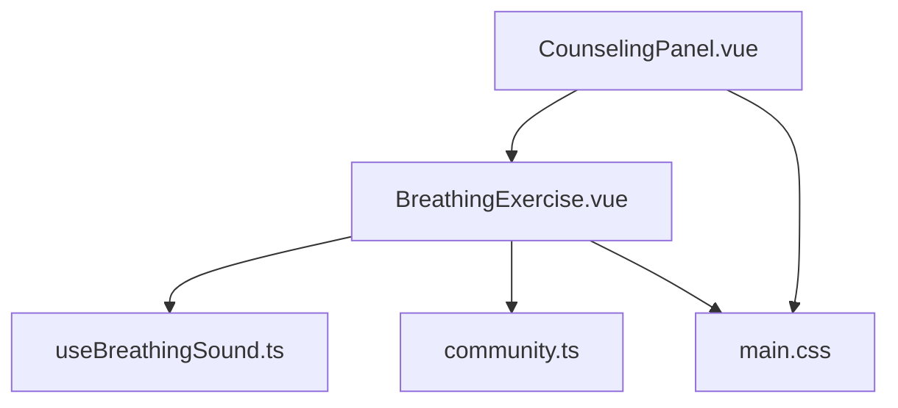
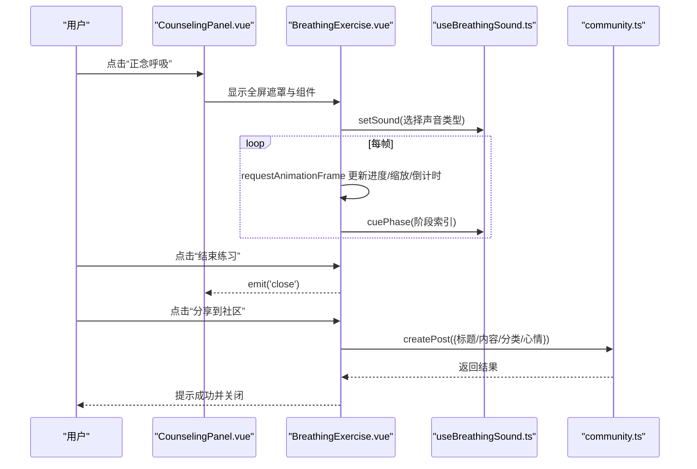
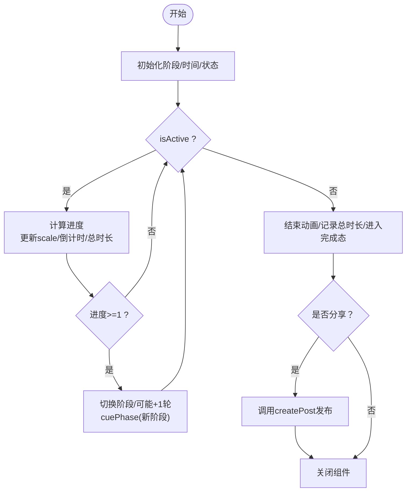
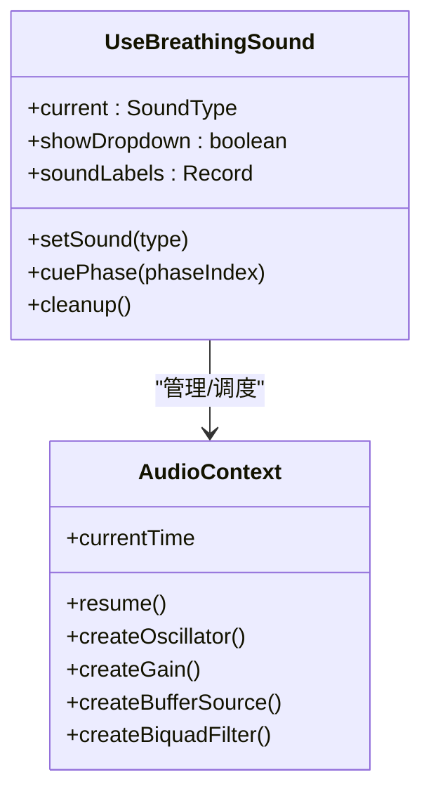
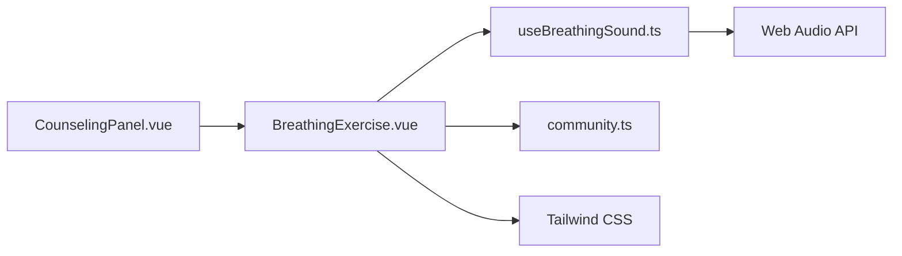

# 呼吸练习功能

<cite>
**本文引用的文件**
- [BreathingExercise.vue](file://web/app/src/components/assistant/BreathingExercise.vue)
- [useBreathingSound.ts](file://web/app/src/composables/useBreathingSound.ts)
- [CounselingPanel.vue](file://web/app/src/components/assistant/CounselingPanel.vue)
- [community.ts](file://web/app/src/api/community.ts)
- [main.css](file://web/app/src/styles/main.css)
</cite>

## 目录
1. [简介](#简介)
2. [项目结构](#项目结构)
3. [核心组件](#核心组件)
4. [架构总览](#架构总览)
5. [详细组件分析](#详细组件分析)
6. [依赖关系分析](#依赖关系分析)
7. [性能考量](#性能考量)
8. [故障排查指南](#故障排查指南)
9. [结论](#结论)
10. [附录](#附录)

## 简介
本文件面向“正念呼吸练习”功能，系统性梳理 BreathingExercise 组件与 useBreathingSound 组合式函数的设计与实现。内容涵盖：
- 呼吸动画效果（吸气、屏息、呼气三阶段）
- 声音引导（颂钵、木鱼节奏、自然白噪音等）
- 节奏控制（requestAnimationFrame 驱动、阶段切换、循环计数）
- 与社区分享的集成（完成后生成分享文案并创建帖子）
- 用户体验设计考虑、无障碍支持与移动端适配方案

该功能嵌入在心理咨询面板中，通过全屏覆盖层提供沉浸式体验，并在结束时支持一键分享到社区。

## 项目结构
呼吸练习相关代码主要位于前端应用 web/app/src 下：
- 组件层：BreathingExercise.vue（呼吸练习主界面）、CounselingPanel.vue（入口与遮罩管理）
- 组合式函数：useBreathingSound.ts（音频上下文、环境音、阶段提示音）
- API 层：community.ts（创建帖子用于分享）
- 样式层：main.css（全局主题与安全区域变量）

图表来源
- [CounselingPanel.vue:1-158](file://web/app/src/components/assistant/CounselingPanel.vue#L1-L158)
- [BreathingExercise.vue:1-204](file://web/app/src/components/assistant/BreathingExercise.vue#L1-L204)
- [useBreathingSound.ts:1-224](file://web/app/src/composables/useBreathingSound.ts#L1-L224)
- [community.ts:1-200](file://web/app/src/api/community.ts#L1-L200)
- [main.css:1-200](file://web/app/src/styles/main.css#L1-L200)

章节来源
- [CounselingPanel.vue:1-158](file://web/app/src/components/assistant/CounselingPanel.vue#L1-L158)
- [BreathingExercise.vue:1-204](file://web/app/src/components/assistant/BreathingExercise.vue#L1-L204)
- [useBreathingSound.ts:1-224](file://web/app/src/composables/useBreathingSound.ts#L1-L224)
- [community.ts:1-200](file://web/app/src/api/community.ts#L1-L200)
- [main.css:1-200](file://web/app/src/styles/main.css#L1-L200)

## 核心组件
- BreathingExercise.vue：负责呼吸三阶段（吸气/屏息/呼气）的可视化、计时、循环计数、结束状态与分享；通过 requestAnimationFrame 驱动动画，调用 useBreathingSound.cuePhase 触发阶段提示音。
- useBreathingSound.ts：封装 Web Audio API，提供环境背景音（雨声/溪流/风声）与阶段提示音（颂钵、木鱼节奏、鸟鸣），并提供设置当前声音类型与清理资源的能力。
- CounselingPanel.vue：作为入口，管理全屏遮罩与呼吸练习的显示/隐藏，同时提供“心情记录”并列工具。
- community.ts：提供 createPost 接口，用于将练习结果以长文形式发布到社区。
- main.css：定义安全区域变量与基础交互样式，支撑移动端适配与触摸目标尺寸。

章节来源
- [BreathingExercise.vue:1-204](file://web/app/src/components/assistant/BreathingExercise.vue#L1-L204)
- [useBreathingSound.ts:1-224](file://web/app/src/composables/useBreathingSound.ts#L1-L224)
- [CounselingPanel.vue:1-158](file://web/app/src/components/assistant/CounselingPanel.vue#L1-L158)
- [community.ts:1-200](file://web/app/src/api/community.ts#L1-L200)
- [main.css:1-200](file://web/app/src/styles/main.css#L1-L200)

## 架构总览
呼吸练习由“视图层 + 音频层 + 数据层”构成：
- 视图层：BreathingExercise.vue 渲染圆形呼吸指示器、倒计时、鼓励语与操作按钮；CounselingPanel.vue 提供全屏覆盖层与开关逻辑。
- 音频层：useBreathingSound.ts 基于 AudioContext 管理环境音与阶段提示音，按阶段索引 cuePhase 播放对应音效。
- 数据层：完成练习后，调用 communityApi.createPost 将练习轮数与用时、随机鼓励语组成内容并发布到社区。

图表来源
- [CounselingPanel.vue:42-100](file://web/app/src/components/assistant/CounselingPanel.vue#L42-L100)
- [BreathingExercise.vue:61-118](file://web/app/src/components/assistant/BreathingExercise.vue#L61-L118)
- [useBreathingSound.ts:197-223](file://web/app/src/composables/useBreathingSound.ts#L197-L223)
- [community.ts:83-86](file://web/app/src/api/community.ts#L83-L86)

## 详细组件分析

### BreathingExercise 组件
- 呼吸阶段与视觉反馈
  - 三阶段：吸气（放大）、屏息（保持）、呼气（缩小），分别配置颜色、光晕、提示文案与缩放起止值。
  - 使用 computed 动态计算圆圈的样式（背景色、阴影、缩放）。
- 动画与节奏控制
  - 使用 requestAnimationFrame 驱动，根据当前阶段时长计算进度，更新 scale、secondsLeft、totalSeconds。
  - 阶段结束时切换 phaseIndex，若回到起始阶段则 cycleCount++，并调用 sound.cuePhase(phaseIndex)。
- 生命周期与资源管理
  - onMounted 启动动画与计时；onUnmounted 停止动画并调用 sound.cleanup() 释放音频资源。
- 分享流程
  - 结束后展示总结信息（轮数、用时、随机鼓励语）。
  - 点击“分享到社区”调用 communityApi.createPost，携带标题、内容、分类、心情等字段，成功后提示并关闭。

图表来源
- [BreathingExercise.vue:61-118](file://web/app/src/components/assistant/BreathingExercise.vue#L61-L118)
- [BreathingExercise.vue:87-106](file://web/app/src/components/assistant/BreathingExercise.vue#L87-L106)

章节来源
- [BreathingExercise.vue:1-204](file://web/app/src/components/assistant/BreathingExercise.vue#L1-L204)

### useBreathingSound 组合式函数
- 音频上下文与环境音
  - 单例 AudioContext，自动恢复 suspended 状态。
  - 环境音：雨声/溪流/风声，通过噪声缓冲（白/粉/棕）+ 滤波器 + 增益控制，支持 LFO 调制风声音高。
  - 切换声音时先 stopAmbient 再 startNoiseAmbient，避免多实例叠加。
- 阶段提示音
  - 颂钵：多频正弦波叠加，指数衰减营造余韵。
  - 木鱼：按阶段不同节奏（吸气/屏息每秒一次，呼气每0.5秒一次）调度短促敲击。
  - 鸟鸣：随机频率与包络模拟短促鸟叫。
- 公共 API
  - current/showDropdown：UI 绑定当前声音类型与下拉菜单显隐。
  - setSound：设置当前声音类型并启动对应环境音。
  - cuePhase：根据阶段索引播放对应提示音。
  - cleanup：停止环境音并关闭 AudioContext。

图表来源
- [useBreathingSound.ts:18-22](file://web/app/src/composables/useBreathingSound.ts#L18-L22)
- [useBreathingSound.ts:88-119](file://web/app/src/composables/useBreathingSound.ts#L88-L119)
- [useBreathingSound.ts:146-193](file://web/app/src/composables/useBreathingSound.ts#L146-L193)
- [useBreathingSound.ts:197-223](file://web/app/src/composables/useBreathingSound.ts#L197-L223)

章节来源
- [useBreathingSound.ts:1-224](file://web/app/src/composables/useBreathingSound.ts#L1-L224)

### CounselingPanel 入口与遮罩
- 提供“正念呼吸”和“心情记录”两个快捷工具按钮。
- 使用 Teleport 将全屏遮罩挂载至 body，确保层级与滚动隔离。
- 通过 showBreathing / showMoodRecord 控制遮罩内容与组件切换。
- 当显示呼吸练习时，传入 close 事件回调以关闭遮罩。

章节来源
- [CounselingPanel.vue:1-158](file://web/app/src/components/assistant/CounselingPanel.vue#L1-L158)

### 社区分享集成
- 分享文案包含：完成轮数、用时、随机鼓励语。
- 调用 communityApi.createPost，指定分类与心情标签，便于后续统计与展示。
- 失败时捕获错误并通过 Toast 提示。

章节来源
- [BreathingExercise.vue:87-106](file://web/app/src/components/assistant/BreathingExercise.vue#L87-L106)
- [community.ts:83-86](file://web/app/src/api/community.ts#L83-L86)

## 依赖关系分析
- 组件耦合
  - BreathingExercise.vue 依赖 useBreathingSound.ts 进行音频控制，依赖 community.ts 进行分享。
  - CounselingPanel.vue 仅负责 UI 容器与状态切换，低耦合。
- 外部依赖
  - Web Audio API：浏览器原生能力，无需额外库。
  - Tailwind CSS：样式原子化，提升开发效率。
- 潜在循环依赖
  - 无直接循环引用；组件与组合式函数单向依赖。

图表来源
- [BreathingExercise.vue:1-204](file://web/app/src/components/assistant/BreathingExercise.vue#L1-L204)
- [useBreathingSound.ts:1-224](file://web/app/src/composables/useBreathingSound.ts#L1-L224)
- [community.ts:1-200](file://web/app/src/api/community.ts#L1-L200)
- [CounselingPanel.vue:1-158](file://web/app/src/components/assistant/CounselingPanel.vue#L1-L158)

章节来源
- [BreathingExercise.vue:1-204](file://web/app/src/components/assistant/BreathingExercise.vue#L1-L204)
- [useBreathingSound.ts:1-224](file://web/app/src/composables/useBreathingSound.ts#L1-L224)
- [community.ts:1-200](file://web/app/src/api/community.ts#L1-L200)
- [CounselingPanel.vue:1-158](file://web/app/src/components/assistant/CounselingPanel.vue#L1-L158)

## 性能考量
- 动画性能
  - 使用 requestAnimationFrame 保证与屏幕刷新同步，减少重排重绘。
  - 仅在必要时更新 DOM（Vue 响应式最小化变更）。
- 音频性能
  - 环境音采用 BufferSource 循环播放，避免频繁创建销毁。
  - 切换声音前统一 stopAmbient，防止多节点叠加导致 CPU 占用升高。
  - 使用 BiquadFilter 与 Gain 控制音色与音量，降低解码开销。
- 内存管理
  - onUnmounted 中 cancelAnimationFrame 并 cleanup 音频资源，避免泄漏。
- 网络请求
  - 分享为一次性 POST，失败路径已处理；可考虑重试与去抖策略（可选优化）。

[本节为通用性能建议，不直接分析具体文件]

## 故障排查指南
- 无法播放声音
  - 检查浏览器是否允许自动播放音频；首次交互后通常可恢复。
  - 确认 setSound 已调用且非静音模式；若选择环境音，确认 startNoiseAmbient 已执行。
  - 若页面卸载未清理，可能导致 AudioContext 异常；确保 cleanup 被调用。
- 动画卡顿或不准确
  - 检查是否在后台标签页运行（部分浏览器会节流 rAF）。
  - 确认没有大量阻塞任务影响主线程。
- 分享失败
  - 检查网络与权限；查看 toast 错误信息定位后端返回 detail。
  - 确认分类 ID 与 post_type 是否符合后端要求。

章节来源
- [BreathingExercise.vue:108-118](file://web/app/src/components/assistant/BreathingExercise.vue#L108-L118)
- [useBreathingSound.ts:187-193](file://web/app/src/composables/useBreathingSound.ts#L187-L193)
- [useBreathingSound.ts:217-220](file://web/app/src/composables/useBreathingSound.ts#L217-L220)
- [BreathingExercise.vue:87-106](file://web/app/src/components/assistant/BreathingExercise.vue#L87-L106)

## 结论
呼吸练习功能通过清晰的职责划分实现了良好的可维护性与扩展性：
- 视图层专注交互与可视化，音频层封装复杂 Web Audio 细节，数据层负责社区分享。
- 节奏控制稳定可靠，声音引导丰富多样，用户体验友好。
- 移动端适配完善，具备基本的无障碍支持（aria-label、语义化按钮）。
未来可扩展点包括：自定义呼吸节奏模板、更多环境音与提示音、离线缓存、更丰富的分享模板与数据分析。

[本节为总结性内容，不直接分析具体文件]

## 附录

### 用户体验设计考虑
- 视觉：柔和渐变背景、呼吸圈颜色随阶段变化，光晕增强沉浸感。
- 文案：每阶段提示简洁明确；完成页展示鼓励语，正向强化。
- 交互：大触控目标、清晰按钮反馈；遮罩全屏聚焦注意力。

### 无障碍支持
- 按钮提供 aria-label 描述用途。
- 文本对比度与字体大小满足可读性要求。
- 键盘可达性：按钮可通过 Tab 聚焦与 Enter 激活（浏览器默认行为）。

### 移动端适配方案
- 使用 safe-area-inset 变量适配刘海屏与底部横条。
- 触摸目标最小高度 44px，提升点击成功率。
- 禁用双击缩放与长按选中文本，改善手势体验。

章节来源
- [main.css:5-35](file://web/app/src/styles/main.css#L5-L35)
- [main.css:62-70](file://web/app/src/styles/main.css#L62-L70)
- [CounselingPanel.vue:88-100](file://web/app/src/components/assistant/CounselingPanel.vue#L88-L100)
- [BreathingExercise.vue:128-159](file://web/app/src/components/assistant/BreathingExercise.vue#L128-L159)