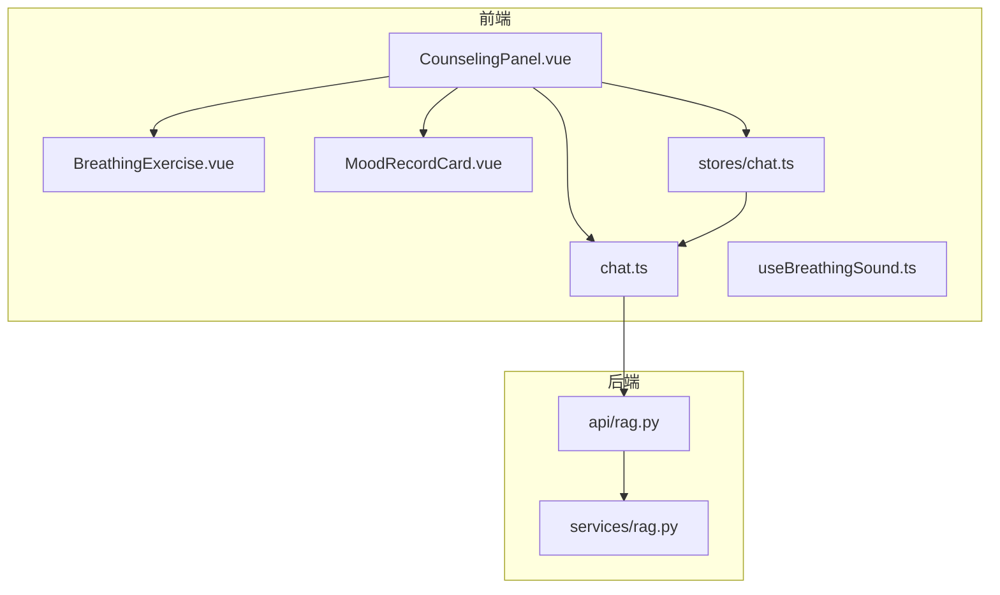
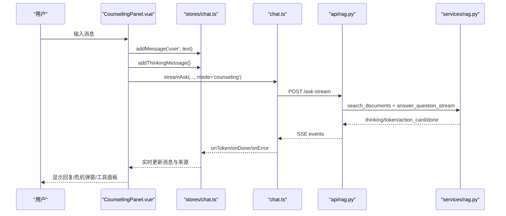
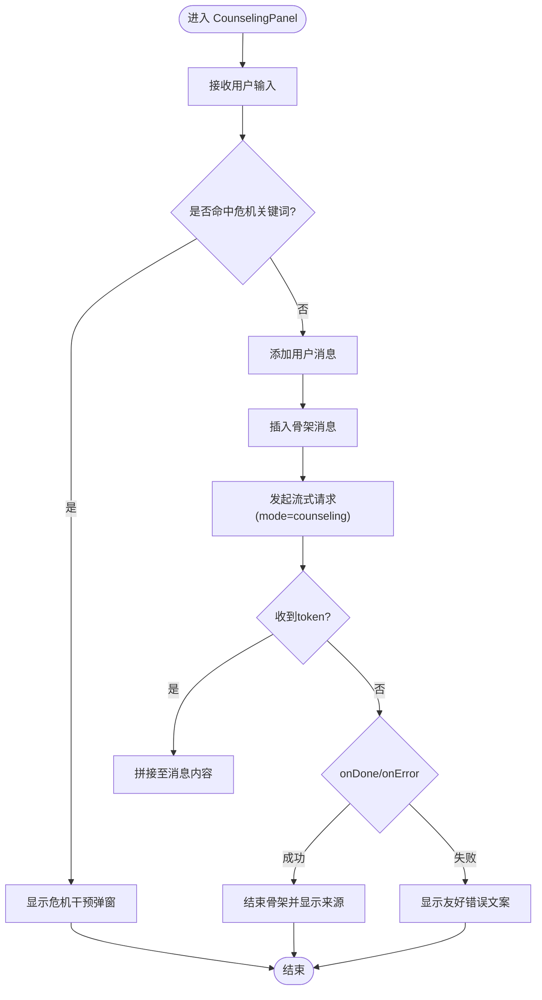
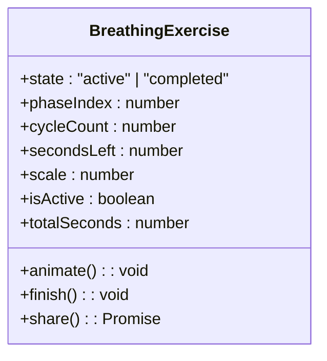
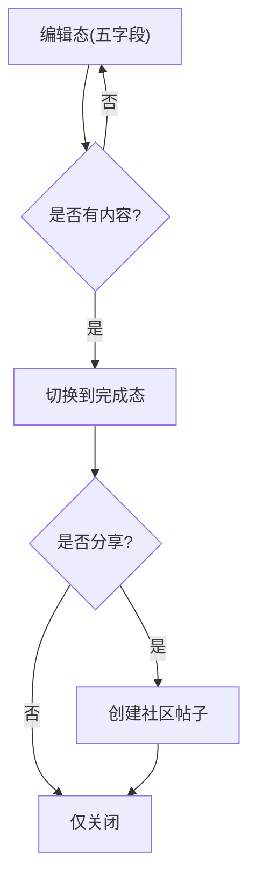
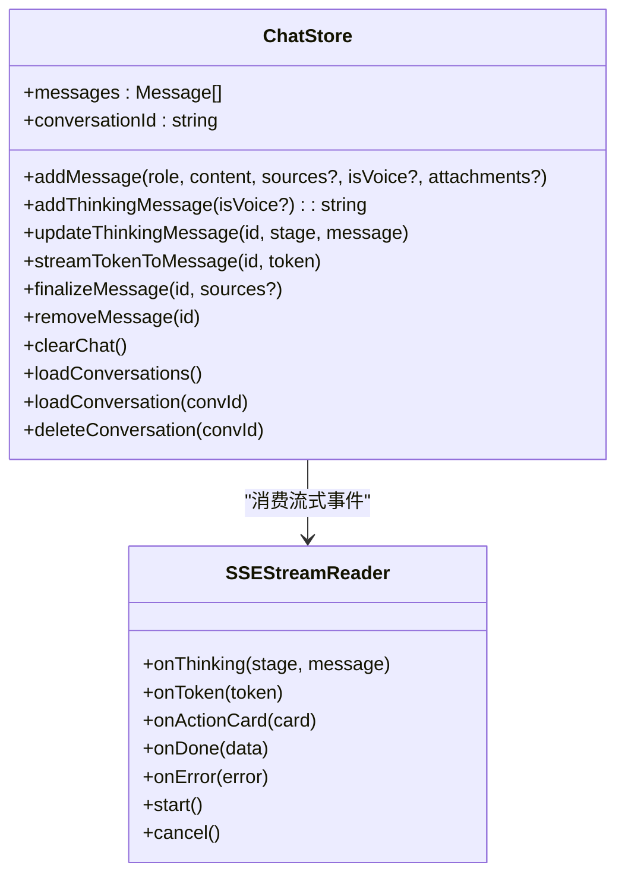
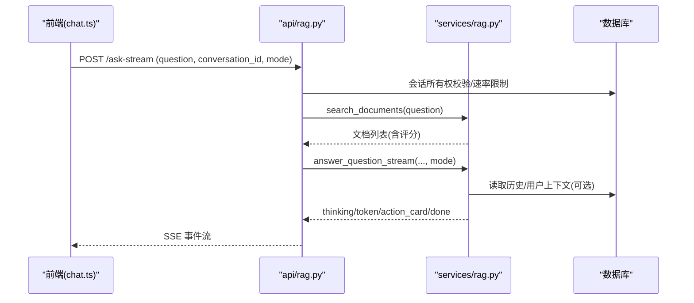
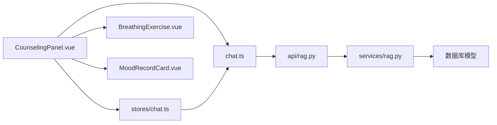

# 心理咨询面板

<cite>
**本文引用的文件**   
- [CounselingPanel.vue](file://web/app/src/components/assistant/CounselingPanel.vue)
- [ChatPanel.vue](file://web/app/src/components/assistant/ChatPanel.vue)
- [BreathingExercise.vue](file://web/app/src/components/assistant/BreathingExercise.vue)
- [MoodRecordCard.vue](file://web/app/src/components/assistant/MoodRecordCard.vue)
- [chat.ts](file://web/app/src/api/chat.ts)
- [chat.ts（store）](file://web/app/src/stores/chat.ts)
- [useBreathingSound.ts](file://web/app/src/composables/useBreathingSound.ts)
- [rag.py（API）](file://web/backend/api/rag.py)
- [rag.py（服务）](file://web/backend/services/rag.py)
- [index.ts（类型）](file://web/app/src/types/index.ts)
</cite>

## 目录
1. [引言](#引言)
2. [项目结构](#项目结构)
3. [核心组件](#核心组件)
4. [架构总览](#架构总览)
5. [详细组件分析](#详细组件分析)
6. [依赖关系分析](#依赖关系分析)
7. [性能考量](#性能考量)
8. [故障排查指南](#故障排查指南)
9. [结论](#结论)
10. [附录](#附录)

## 引言
本文件面向“心理咨询面板”功能，围绕 CounselingPanel 组件的设计理念与实现细节展开，涵盖心理评估工具、情绪识别、咨询建议生成、与 AI 助手的集成方式、隐私保护与数据安全策略，以及专业心理学知识整合、用户情感识别与个性化建议算法。该面板以“知心陪伴”模式为核心，结合正念呼吸与心情记录等自助工具，提供安全、温暖、可追溯的在线心理支持体验。

## 项目结构
心理咨询面板由前端 Vue 组件、状态管理、SSE 流式 API 客户端与后端 RAG/LLM 服务共同构成：
- 前端交互层：CounselingPanel、BreathingExercise、MoodRecordCard
- 状态与消息流：chat store、chat API 客户端
- 后端能力层：RAG 检索、LLM 对话流、危机关键词检测、访客配额与速率限制、附件解析与行动卡片生成

**图表来源** 
- [CounselingPanel.vue:1-158](file://web/app/src/components/assistant/CounselingPanel.vue#L1-L158)
- [chat.ts:1-272](file://web/app/src/api/chat.ts#L1-L272)
- [chat.ts（store）:1-164](file://web/app/src/stores/chat.ts#L1-L164)
- [rag.py（API）:1-800](file://web/backend/api/rag.py#L1-L800)
- [rag.py（服务）:1-800](file://web/backend/services/rag.py#L1-L800)

**章节来源**
- [CounselingPanel.vue:1-158](file://web/app/src/components/assistant/CounselingPanel.vue#L1-L158)
- [chat.ts:1-272](file://web/app/src/api/chat.ts#L1-L272)
- [chat.ts（store）:1-164](file://web/app/src/stores/chat.ts#L1-L164)
- [rag.py（API）:1-800](file://web/backend/api/rag.py#L1-L800)
- [rag.py（服务）:1-800](file://web/backend/services/rag.py#L1-L800)

## 核心组件
- CounselingPanel：心理咨询主面板，负责消息收发、危机预警、正念呼吸与心情记录的切换与全屏遮罩展示。
- BreathingExercise：正念呼吸练习，包含阶段动画、计时、音效选择与分享功能。
- MoodRecordCard：结构化心情记录（情境-想法-感受-反思-新视角），支持一键分享到社区。
- chat.ts（API）：SSE 流式客户端，封装 ask/ask-public 及流式接口，统一错误友好化与文本清洗。
- stores/chat.ts：聊天消息状态管理，处理骨架消息、流式 token 拼接、思考阶段更新与来源展示。
- useBreathingSound.ts：Web Audio API 实现的背景音与阶段提示音（木鱼、颂钵、雨声、溪流、风声、鸟鸣）。
- 后端 rag.py（API/服务）：RAG 检索、LLM 调用、模式路由（knowledge/counseling）、危机检测、访客配额与限速、附件解析与 Action Card 生成。

**章节来源**
- [CounselingPanel.vue:1-158](file://web/app/src/components/assistant/CounselingPanel.vue#L1-L158)
- [BreathingExercise.vue:1-204](file://web/app/src/components/assistant/BreathingExercise.vue#L1-L204)
- [MoodRecordCard.vue:1-135](file://web/app/src/components/assistant/MoodRecordCard.vue#L1-L135)
- [chat.ts:1-272](file://web/app/src/api/chat.ts#L1-L272)
- [chat.ts（store）:1-164](file://web/app/src/stores/chat.ts#L1-L164)
- [useBreathingSound.ts:1-224](file://web/app/src/composables/useBreathingSound.ts#L1-L224)
- [rag.py（API）:1-800](file://web/backend/api/rag.py#L1-L800)
- [rag.py（服务）:1-800](file://web/backend/services/rag.py#L1-L800)

## 架构总览
心理咨询面板采用“前端流式 UI + 后端 RAG/LLM”的协作架构。用户在 CounselingPanel 输入内容后，前端通过 SSE 流式读取后端回答，并实时渲染；同时根据关键词触发危机干预流程，并提供正念呼吸与心情记录等自助工具。后端在“counseling”模式下使用专门的系统提示词进行共情倾听与认知行为引导，并在必要时输出危机资源信息。

**图表来源** 
- [CounselingPanel.vue:1-158](file://web/app/src/components/assistant/CounselingPanel.vue#L1-L158)
- [chat.ts:1-272](file://web/app/src/api/chat.ts#L1-L272)
- [chat.ts（store）:1-164](file://web/app/src/stores/chat.ts#L1-L164)
- [rag.py（API）:534-630](file://web/backend/api/rag.py#L534-L630)
- [rag.py（服务）:1296-1363](file://web/backend/services/rag.py#L1296-L1363)

## 详细组件分析

### CounselingPanel 组件
- 功能要点
  - 发送消息：区分登录/访客路径，调用对应流式接口，mode=counseling。
  - 危机检测：本地关键词匹配，命中则弹出危机干预提示与热线资源。
  - 工具面板：正念呼吸与心情记录全屏遮罩，互斥显示。
  - 消息渲染：骨架消息、流式光标、错误回退文案。
- 数据流
  - 用户输入 → 添加用户消息 → 插入骨架消息 → 流式 token 拼接 → 完成或错误处理。
- 关键实现点
  - 危机关键词列表与检测函数。
  - 暴露 sendMessage 与 showOverlay 供外部控制。
  - Teleport 全屏遮罩与过渡动画。

**图表来源** 
- [CounselingPanel.vue:1-158](file://web/app/src/components/assistant/CounselingPanel.vue#L1-L158)
- [chat.ts:1-272](file://web/app/src/api/chat.ts#L1-L272)
- [chat.ts（store）:1-164](file://web/app/src/stores/chat.ts#L1-L164)

**章节来源**
- [CounselingPanel.vue:1-158](file://web/app/src/components/assistant/CounselingPanel.vue#L1-L158)

### BreathingExercise 组件
- 功能要点
  - 三阶段呼吸循环（吸气-屏息-呼气），动态缩放圆环与倒计时。
  - 多音效模式（静音/木鱼/颂钵/雨声/溪流/风声/鸟鸣），基于 Web Audio API。
  - 完成后统计轮数与用时，支持一键分享到社区。
- 用户体验
  - 柔和渐变背景、鼓励语随机展示、关闭按钮与退出清理。
- 技术要点
  - requestAnimationFrame 驱动动画，AudioContext 管理音频节点，生命周期内清理避免内存泄漏。

**图表来源** 
- [BreathingExercise.vue:1-204](file://web/app/src/components/assistant/BreathingExercise.vue#L1-L204)
- [useBreathingSound.ts:1-224](file://web/app/src/composables/useBreathingSound.ts#L1-L224)

**章节来源**
- [BreathingExercise.vue:1-204](file://web/app/src/components/assistant/BreathingExercise.vue#L1-L204)
- [useBreathingSound.ts:1-224](file://web/app/src/composables/useBreathingSound.ts#L1-L224)

### MoodRecordCard 组件
- 功能要点
  - 五字段结构化记录（情境/想法/感受/反思/新视角），自动高度自适应。
  - 完成态汇总展示，支持分享到社区或仅保存不分享。
- 数据流
  - 编辑态 → 校验非空 → 完成态 → 可选分享 → 关闭。
- 技术要点
  - 计算属性格式化 HTML 内容与摘要，Toast 反馈操作结果。

**图表来源** 
- [MoodRecordCard.vue:1-135](file://web/app/src/components/assistant/MoodRecordCard.vue#L1-L135)

**章节来源**
- [MoodRecordCard.vue:1-135](file://web/app/src/components/assistant/MoodRecordCard.vue#L1-L135)

### ChatStore 与 Chat API
- ChatStore
  - 维护消息数组、会话 ID、历史对话加载与删除。
  - 骨架消息、思考阶段更新、流式 token 拼接、来源注入。
  - 对 LLM 返回异常文本进行清洗，避免暴露内部错误类名。
- Chat API
  - 封装 ask/ask-public 与流式接口，统一错误友好化。
  - SSEStreamReader 解析 data: JSON 事件，分发 thinking/token/action_card/done/error。
  - 认证头注入与取消机制。

**图表来源** 
- [chat.ts（store）:1-164](file://web/app/src/stores/chat.ts#L1-L164)
- [chat.ts:1-272](file://web/app/src/api/chat.ts#L1-L272)

**章节来源**
- [chat.ts（store）:1-164](file://web/app/src/stores/chat.ts#L1-L164)
- [chat.ts:1-272](file://web/app/src/api/chat.ts#L1-L272)

### 后端 RAG 与 LLM 集成
- 模式路由
  - knowledge：医学知识库问答，强调权威来源与网站导航。
  - counseling：知心陪伴模式，强调共情倾听、CBT 框架与危机干预模板。
- 检索与生成
  - 混合检索（向量+关键词），按权威权重与时效性打分。
  - 流式生成，thinking/token/action_card/done 事件推送。
- 安全与合规
  - 访客每日限额、登录用户速率限制、会话所有权校验、敏感词过滤。
  - 个人上下文聚合（档案/日记摘要/用药提醒/治疗事件），长度限制与降级策略。
- 附件处理
  - 图片 VASI 分析、文档文本提取与报告解读，生成 Action Card 供前端确认保存。

**图表来源** 
- [rag.py（API）:534-800](file://web/backend/api/rag.py#L534-L800)
- [rag.py（服务）:880-916](file://web/backend/services/rag.py#L880-L916)
- [rag.py（服务）:1296-1363](file://web/backend/services/rag.py#L1296-L1363)

**章节来源**
- [rag.py（API）:1-800](file://web/backend/api/rag.py#L1-L800)
- [rag.py（服务）:1-800](file://web/backend/services/rag.py#L1-L800)
- [rag.py（服务）:800-1559](file://web/backend/services/rag.py#L800-L1559)

## 依赖关系分析
- 前端依赖
  - CounselingPanel 依赖 chat store、chat API、BreathingExercise、MoodRecordCard。
  - chat store 依赖 chat API 的类型与 SSE 事件模型。
  - BreathingExercise 依赖 useBreathingSound 的音频能力。
- 后端依赖
  - api/rag.py 依赖 services/rag.py 的检索、生成与附件处理能力。
  - services/rag.py 依赖数据库模型（对话、消息、用户档案、日记、用药提醒、治疗事件）。
  - 所有 LLM/Embedding 调用通过统一的配置模块获取密钥与端点。

**图表来源** 
- [CounselingPanel.vue:1-158](file://web/app/src/components/assistant/CounselingPanel.vue#L1-L158)
- [chat.ts:1-272](file://web/app/src/api/chat.ts#L1-L272)
- [chat.ts（store）:1-164](file://web/app/src/stores/chat.ts#L1-L164)
- [rag.py（API）:1-800](file://web/backend/api/rag.py#L1-L800)
- [rag.py（服务）:1-800](file://web/backend/services/rag.py#L1-L800)

**章节来源**
- [index.ts（类型）:1-420](file://web/app/src/types/index.ts#L1-L420)

## 性能考量
- 流式渲染
  - 前端逐 token 拼接，减少首屏等待；骨架消息提升感知速度。
- 检索优化
  - 混合检索（向量+关键词）确保新文档即时可用；维度不一致时回退关键词搜索。
- 上下文控制
  - 对话历史窗口限制（最近 N 条），防止上下文溢出与成本膨胀。
  - 用户个人上下文最大字符限制，异常降级为通用问答。
- 音频与动画
  - requestAnimationFrame 与 AudioContext 生命周期管理，避免内存泄漏。
- 限流与配额
  - 访客每日限额、登录用户速率限制，降低滥用风险与成本。

[本节为通用指导，无需特定文件引用]

## 故障排查指南
- 常见问题定位
  - 流式连接失败：检查网络、代理、SSEStreamReader 的错误回调与 toFriendlyError 映射。
  - 文本泄露异常：sanitizeAssistantText 清洗规则是否生效，避免暴露异常类名。
  - 危机弹窗未触发：核对危机关键词列表与 detectCrisis 逻辑。
  - 访客配额耗尽：查看 guest-quota 接口与 _check_guest_limit/_increment_guest_usage。
  - 附件解析失败：确认文件类型白名单、大小限制、元数据校验与权限检查。
- 调试建议
  - 前端：打开浏览器控制台观察 SSE 事件与 store 消息变化。
  - 后端：查看日志中的 embedding/LLM 调用、检索评分、guest 指纹与配额计数。

**章节来源**
- [chat.ts:1-272](file://web/app/src/api/chat.ts#L1-L272)
- [chat.ts（store）:1-164](file://web/app/src/stores/chat.ts#L1-L164)
- [rag.py（API）:1-800](file://web/backend/api/rag.py#L1-L800)
- [rag.py（服务）:1-800](file://web/backend/services/rag.py#L1-L800)

## 结论
心理咨询面板以“知心陪伴”为核心，结合流式 AI 对话、危机干预与自助工具，构建了安全、温暖且专业的在线心理支持体验。前后端协同实现了高响应性与强容错能力，并通过严格的隐私保护与数据安全策略保障用户权益。未来可在情绪识别精度、个性化建议算法与多模态交互方面持续优化。

[本节为总结性内容，无需特定文件引用]

## 附录
- 专业心理学知识整合
  - CBT 框架用于认知重构，强调开放式提问与共情表达。
  - 情绪标签识别覆盖容貌焦虑、社交恐惧、治疗绝望感、被歧视感、确诊冲击、复发焦虑等。
- 用户情感识别
  - 危机关键词前置检测，确保高危信息直达助手并输出资源。
  - 对话历史与个人上下文辅助理解用户情绪轨迹。
- 个性化建议算法
  - 登录用户注入个人档案、日记摘要、用药提醒与治疗事件，形成简洁中文上下文块。
  - 知识库权威等级与时效性加权，保证回答严谨与实用。

[本节为概念性内容，无需特定文件引用]