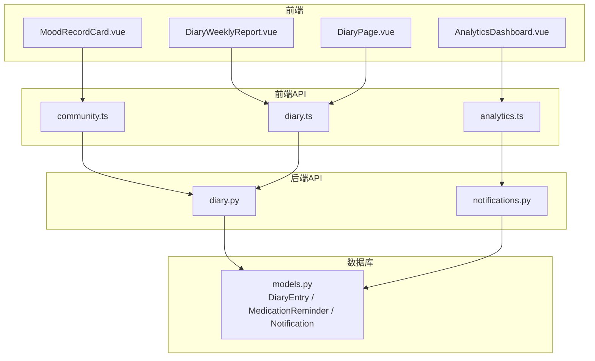
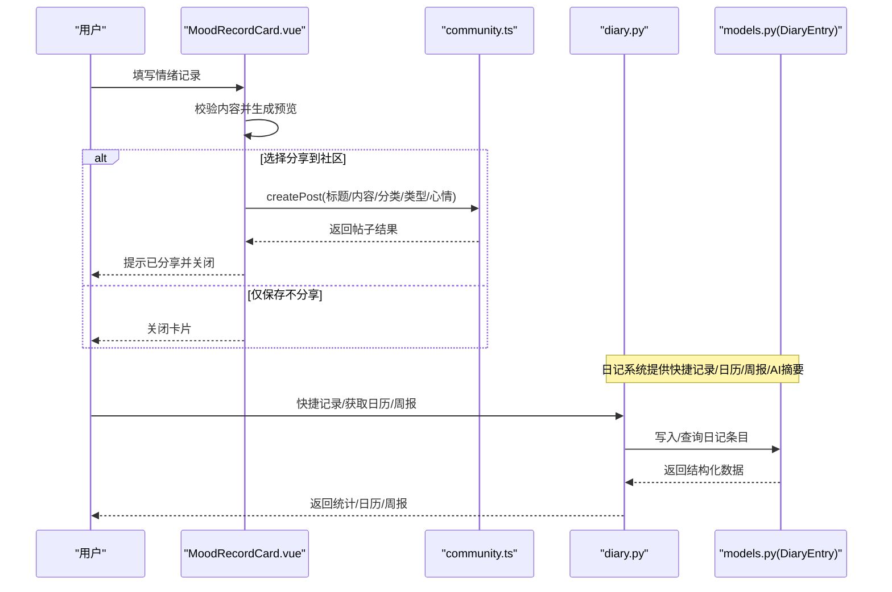
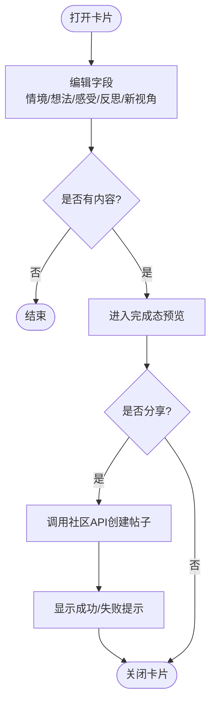
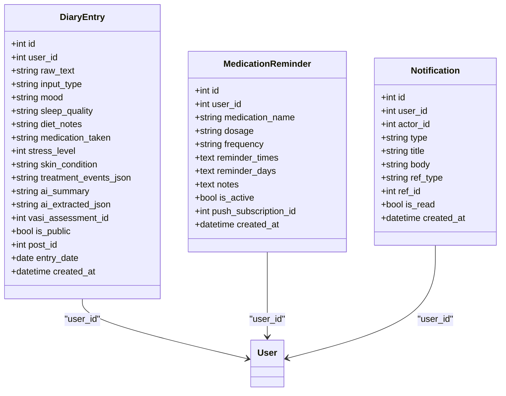
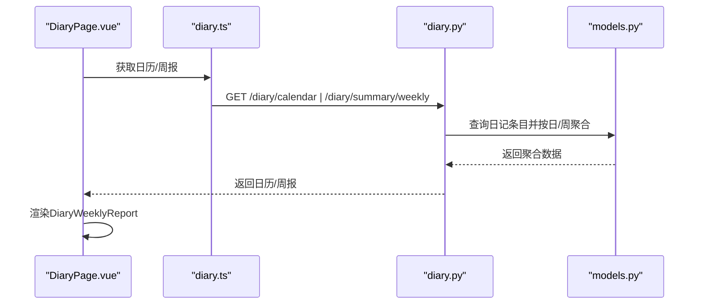
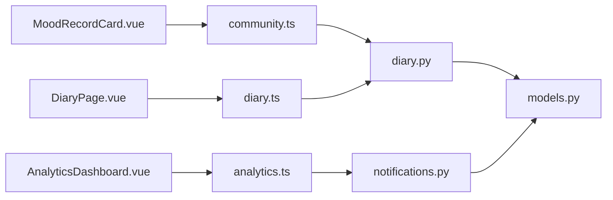

# 情绪记录卡片

<cite>
**本文引用的文件**
- [MoodRecordCard.vue](file://web/app/src/components/assistant/MoodRecordCard.vue)
- [community.ts](file://web/app/src/api/community.ts)
- [diary.py](file://web/backend/api/diary.py)
- [models.py](file://web/backend/database/models.py)
- [DiaryWeeklyReport.vue](file://web/app/src/components/diary/DiaryWeeklyReport.vue)
- [DiaryPage.vue](file://web/app/src/views/DiaryPage.vue)
- [analytics.ts](file://web/app/src/api/analytics.ts)
- [AnalyticsDashboard.vue](file://web/app/src/components/analytics/AnalyticsDashboard.vue)
- [notifications.py](file://web/backend/api/notifications.py)
</cite>

## 目录
1. [简介](#简介)
2. [项目结构](#项目结构)
3. [核心组件](#核心组件)
4. [架构总览](#架构总览)
5. [详细组件分析](#详细组件分析)
6. [依赖关系分析](#依赖关系分析)
7. [性能与可扩展性](#性能与可扩展性)
8. [故障排查指南](#故障排查指南)
9. [结论](#结论)
10. [附录](#附录)

## 简介
本文件围绕“情绪记录卡片”（MoodRecordCard）进行系统化文档化，覆盖其功能实现、数据模型设计、存储策略、可视化展示方式，以及与历史查看、分析统计、提醒功能和社区模块的数据联动。该组件提供轻量化的情绪结构化记录体验，支持一键完成并选择是否分享到社区；同时与日记系统、周报、通知和用药提醒等能力形成闭环，帮助用户持续追踪情绪变化并获得洞察。

## 项目结构
情绪记录卡片位于前端助手区域，通过社区API将内容发布为长文帖子；后端日记系统提供快捷记录、日历视图、周报统计与AI摘要；数据库层统一持久化日记条目、用药提醒与通知等实体。

图表来源
- [MoodRecordCard.vue:1-135](file://web/app/src/components/assistant/MoodRecordCard.vue#L1-L135)
- [community.ts:55-120](file://web/app/src/api/community.ts#L55-L120)
- [diary.py:172-423](file://web/backend/api/diary.py#L172-L423)
- [models.py:1160-1197](file://web/backend/database/models.py#L1160-L1197)

章节来源
- [MoodRecordCard.vue:1-135](file://web/app/src/components/assistant/MoodRecordCard.vue#L1-L135)
- [community.ts:55-120](file://web/app/src/api/community.ts#L55-L120)
- [diary.py:172-423](file://web/backend/api/diary.py#L172-L423)
- [models.py:1160-1197](file://web/backend/database/models.py#L1160-L1197)

## 核心组件
- 情绪记录卡片（MoodRecordCard）：提供情境、想法、感受、反思、新视角的结构化输入，支持自动高度适配的文本域、完成态预览与一键分享。
- 日记系统（后端）：提供快捷记录、列表查询、日历视图、周报统计、AI摘要与连续记录天数计算。
- 周报卡片（DiaryWeeklyReport）：可视化心情轨迹、睡眠与压力概况、VASI评估次数、AI总结与洞察。
- 分析看板（AnalyticsDashboard）：聚合平台级指标与趋势，可用于扩展情绪趋势分析。
- 通知系统（notifications.py）：用于触发与展示系统或社交类通知，可作为提醒入口。

章节来源
- [MoodRecordCard.vue:1-135](file://web/app/src/components/assistant/MoodRecordCard.vue#L1-L135)
- [diary.py:172-423](file://web/backend/api/diary.py#L172-L423)
- [DiaryWeeklyReport.vue:1-196](file://web/app/src/components/diary/DiaryWeeklyReport.vue#L1-L196)
- [AnalyticsDashboard.vue:94-374](file://web/app/src/components/analytics/AnalyticsDashboard.vue#L94-L374)
- [notifications.py:1-56](file://web/backend/api/notifications.py#L1-L56)

## 架构总览
情绪记录卡片的前端交互通过社区API创建帖子，而后端日记系统提供结构化记录、统计与可视化能力。数据最终落库于日记条目表，并可关联VASI评估与社区帖子。通知与用药提醒作为辅助能力，可与情绪记录形成联动。

图表来源
- [MoodRecordCard.vue:57-79](file://web/app/src/components/assistant/MoodRecordCard.vue#L57-L79)
- [community.ts:83-86](file://web/app/src/api/community.ts#L83-L86)
- [diary.py:328-370](file://web/backend/api/diary.py#L328-L370)
- [models.py:1160-1197](file://web/backend/database/models.py#L1160-L1197)

## 详细组件分析

### 情绪记录卡片（MoodRecordCard）
- 功能要点
  - 结构化字段：情境、想法、感受、反思、新视角，支持自动高度调整。
  - 完成态预览：将各字段渲染为带标签的富文本片段，便于确认。
  - 分享流程：调用社区接口创建长文帖子，携带标题、内容、分类ID、帖子类型与心情标签。
  - 错误处理：捕获分享失败并提示，保持状态一致。
- 数据流
  - 本地状态维护编辑/完成两种状态。
  - 通过 communityApi.createPost 提交到后端社区模块。
  - 可选择仅保存不分享，直接关闭卡片。
- 可拓展点
  - 增加本地草稿缓存（如localStorage），避免意外关闭丢失。
  - 增加情绪强度评分或标签选择器，增强结构化程度。
  - 与日记快捷记录打通，将结构化字段映射为 mood/stress_level/sleep_quality 等。

图表来源
- [MoodRecordCard.vue:21-79](file://web/app/src/components/assistant/MoodRecordCard.vue#L21-L79)
- [community.ts:83-86](file://web/app/src/api/community.ts#L83-L86)

章节来源
- [MoodRecordCard.vue:1-135](file://web/app/src/components/assistant/MoodRecordCard.vue#L1-L135)
- [community.ts:55-120](file://web/app/src/api/community.ts#L55-L120)

### 日记系统与数据存储
- 数据模型
  - DiaryEntry：包含原始输入、AI提取字段（心情、睡眠、饮食、用药、压力、患处）、关联VASI评估、公开标记、关联社区帖子、日期与时间戳。
  - MedicationReminder：用药提醒配置，支持频率、时间与周期。
  - Notification：用户通知（含类型、标题、正文、关联对象、已读状态）。
- 存储策略
  - 日记条目按用户与日期索引，支持分页与范围查询。
  - 快捷记录将结构化字段直接写入，减少用户输入成本。
  - 周报统计在服务器端聚合心情分布、睡眠分布、平均压力、VASI次数与每日心情序列。
- 关键逻辑
  - 连续记录天数（streak）从今日或昨日回溯计算。
  - 周报LLM摘要具备内存缓存与降级拼接策略，保障可用性。

图表来源
- [models.py:1160-1197](file://web/backend/database/models.py#L1160-L1197)
- [models.py:1119-1155](file://web/backend/database/models.py#L1119-L1155)
- [models.py:1060-1084](file://web/backend/database/models.py#L1060-L1084)

章节来源
- [diary.py:172-423](file://web/backend/api/diary.py#L172-L423)
- [models.py:1160-1197](file://web/backend/database/models.py#L1160-L1197)
- [models.py:1119-1155](file://web/backend/database/models.py#L1119-L1155)
- [models.py:1060-1084](file://web/backend/database/models.py#L1060-L1084)

### 历史查看与分析统计
- 历史查看
  - 日历视图：按月聚合日记条目数量、心情集合与是否包含评估。
  - 周报卡片：展示记录天数、日记条数、连续天数、心情轨迹、睡眠与压力、VASI评估次数、AI总结与洞察。
- 分析统计
  - 平台级概览：注册用户、UV/PV、活跃用户等。
  - 趋势与漏斗：支持7天/30天切换，ECharts渲染。
  - 功能使用：按功能维度统计UV/PV。
- 联动建议
  - 将情绪记录卡片的结构化字段映射到日记快捷记录，以便纳入周报统计。
  - 在周报中增加“来自情绪记录卡片”的来源标记，便于归因分析。

图表来源
- [DiaryPage.vue:265-311](file://web/app/src/views/DiaryPage.vue#L265-L311)
- [diary.py:376-575](file://web/backend/api/diary.py#L376-L575)
- [models.py:1160-1197](file://web/backend/database/models.py#L1160-L1197)

章节来源
- [DiaryWeeklyReport.vue:1-196](file://web/app/src/components/diary/DiaryWeeklyReport.vue#L1-L196)
- [diary.py:376-575](file://web/backend/api/diary.py#L376-L575)
- [AnalyticsDashboard.vue:94-374](file://web/app/src/components/analytics/AnalyticsDashboard.vue#L94-L374)
- [analytics.ts:58-78](file://web/app/src/api/analytics.ts#L58-L78)

### 提醒功能与其他模块联动
- 提醒能力
  - 用药提醒：支持频率、时间与周期配置，结合推送订阅可实现定时提醒。
  - 通知系统：支持点赞、评论、关注、收藏、系统通知等类型，可作为情绪记录完成后的反馈入口。
- 联动场景
  - 情绪记录完成后，若检测到负面情绪频次上升，可触发提醒（如深呼吸练习、就医建议）。
  - 周报中若发现压力偏高或睡眠偏差，可推荐用药提醒或心理咨询入口。
  - 将情绪记录卡片的内容同步至社区时，可附带标签与心情，便于社区检索与互动。

章节来源
- [notifications.py:1-56](file://web/backend/api/notifications.py#L1-L56)
- [models.py:1119-1155](file://web/backend/database/models.py#L1119-L1155)

## 依赖关系分析
- 前端依赖
  - MoodRecordCard 依赖 community.ts 以创建社区帖子。
  - 日记页面依赖 diary.ts 获取日历与周报数据。
  - 分析看板依赖 analytics.ts 获取平台指标。
- 后端依赖
  - diary.py 依赖 models.py 中的 DiaryEntry、MedicationReminder、Notification 等模型。
  - notifications.py 依赖 UserNotification 与相关模型。
- 潜在耦合
  - 情绪记录卡片与社区模块强耦合（直接发帖），可通过抽象服务层降低耦合度。
  - 周报统计依赖日记数据质量，建议在记录阶段加强结构化字段采集。

图表来源
- [MoodRecordCard.vue:1-135](file://web/app/src/components/assistant/MoodRecordCard.vue#L1-L135)
- [community.ts:55-120](file://web/app/src/api/community.ts#L55-L120)
- [diary.py:172-423](file://web/backend/api/diary.py#L172-L423)
- [models.py:1160-1197](file://web/backend/database/models.py#L1160-L1197)
- [notifications.py:1-56](file://web/backend/api/notifications.py#L1-L56)

章节来源
- [MoodRecordCard.vue:1-135](file://web/app/src/components/assistant/MoodRecordCard.vue#L1-L135)
- [community.ts:55-120](file://web/app/src/api/community.ts#L55-L120)
- [diary.py:172-423](file://web/backend/api/diary.py#L172-L423)
- [models.py:1160-1197](file://web/backend/database/models.py#L1160-L1197)
- [notifications.py:1-56](file://web/backend/api/notifications.py#L1-L56)

## 性能与可扩展性
- 性能考虑
  - 日记列表与周报采用分页与聚合查询，避免全量扫描。
  - 周报LLM摘要具备内存缓存与降级策略，降低外部服务依赖风险。
  - 前端图表按需初始化与销毁，监听窗口尺寸变化自适应。
- 可扩展性
  - 可在情绪记录卡片中引入更多结构化字段（如情绪强度、触发事件），提升后续分析粒度。
  - 将社区帖子与日记条目建立双向关联，便于溯源与统计。
  - 引入消息队列异步处理AI摘要与通知，提高响应速度。

[本节为通用指导，无需特定文件来源]

## 故障排查指南
- 分享失败
  - 现象：点击“分享到社区”后提示失败。
  - 排查：检查网络请求与后端返回的错误详情；确认分类ID与帖子类型是否正确。
  - 参考路径：[MoodRecordCard.vue:57-79](file://web/app/src/components/assistant/MoodRecordCard.vue#L57-L79)、[community.ts:83-86](file://web/app/src/api/community.ts#L83-L86)
- 日记上限
  - 现象：创建日记时报错达到上限。
  - 排查：确认当日日记数量限制（默认10条），必要时调整策略或清理旧记录。
  - 参考路径：[diary.py:186-197](file://web/backend/api/diary.py#L186-L197)
- 周报为空
  - 现象：周报无数据或AI摘要为空。
  - 排查：确认本周是否有日记条目；检查LLM摘要缓存与降级逻辑。
  - 参考路径：[diary.py:453-575](file://web/backend/api/diary.py#L453-L575)
- 通知未显示
  - 现象：通知图标无未读数或列表为空。
  - 排查：检查通知类型与读取状态；确认用户权限与数据隔离。
  - 参考路径：[notifications.py:1-56](file://web/backend/api/notifications.py#L1-L56)

章节来源
- [MoodRecordCard.vue:57-79](file://web/app/src/components/assistant/MoodRecordCard.vue#L57-L79)
- [community.ts:83-86](file://web/app/src/api/community.ts#L83-L86)
- [diary.py:186-197](file://web/backend/api/diary.py#L186-L197)
- [diary.py:453-575](file://web/backend/api/diary.py#L453-L575)
- [notifications.py:1-56](file://web/backend/api/notifications.py#L1-L56)

## 结论
情绪记录卡片以轻量、结构化的方式帮助用户快速记录情绪，并通过社区分享扩大价值。后端日记系统提供完整的记录、统计与可视化能力，周报与AI摘要为用户带来洞察与激励。结合通知与用药提醒，可构建更完整的情绪健康闭环。未来可进一步增强结构化字段、优化AI摘要质量，并完善与社区、分析模块的双向联动。

[本节为总结性内容，无需特定文件来源]

## 附录
- 关键API路径
  - 社区帖子：POST /community/posts
  - 日记快捷记录：POST /diary/quick
  - 日记列表：GET /diary/entries
  - 日记日历：GET /diary/calendar
  - 日记周报：GET /diary/summary/weekly
  - 平台概览：GET /analytics/overview
  - 通知列表：GET /api/notifications（由后端路由定义）

章节来源
- [community.ts:83-86](file://web/app/src/api/community.ts#L83-L86)
- [diary.py:328-423](file://web/backend/api/diary.py#L328-L423)
- [diary.py:453-575](file://web/backend/api/diary.py#L453-L575)
- [analytics.ts:58-78](file://web/app/src/api/analytics.ts#L58-L78)
- [notifications.py:1-56](file://web/backend/api/notifications.py#L1-L56)