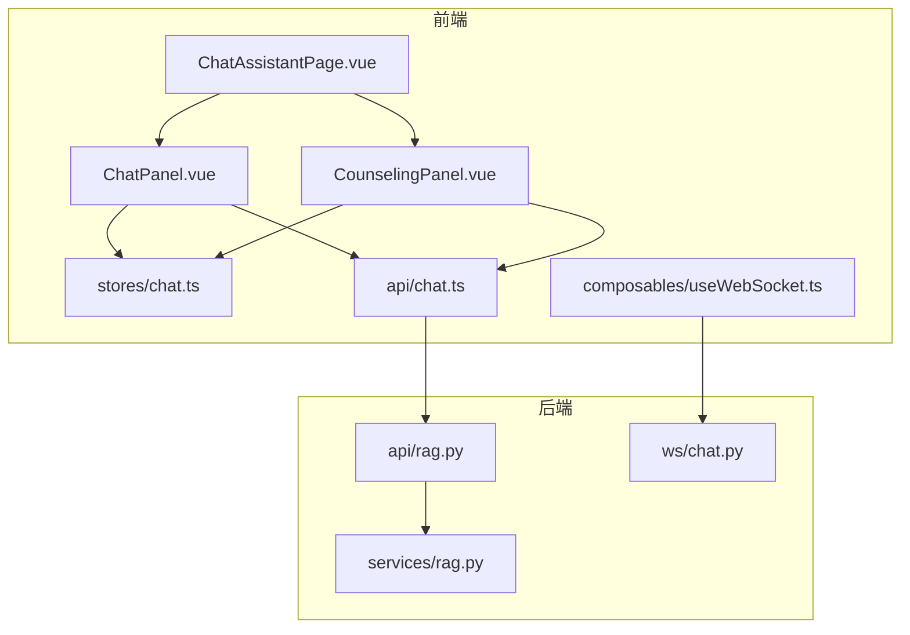
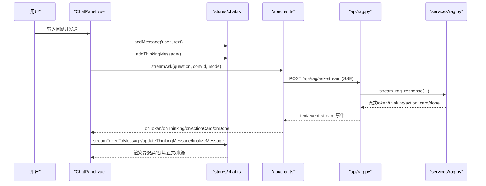
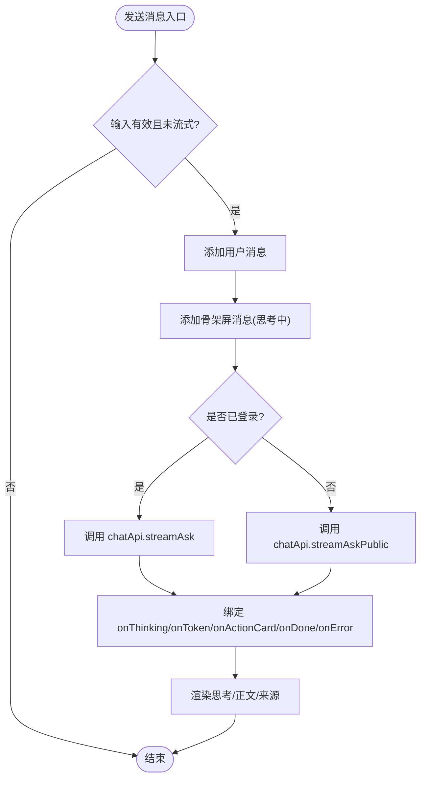
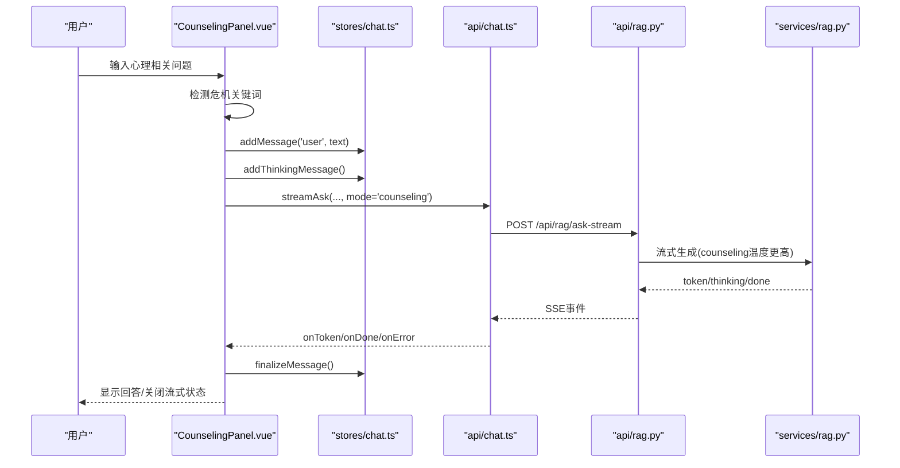
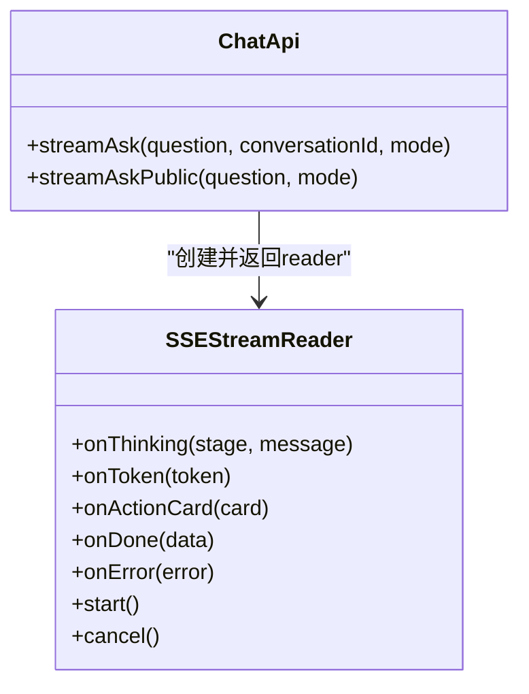
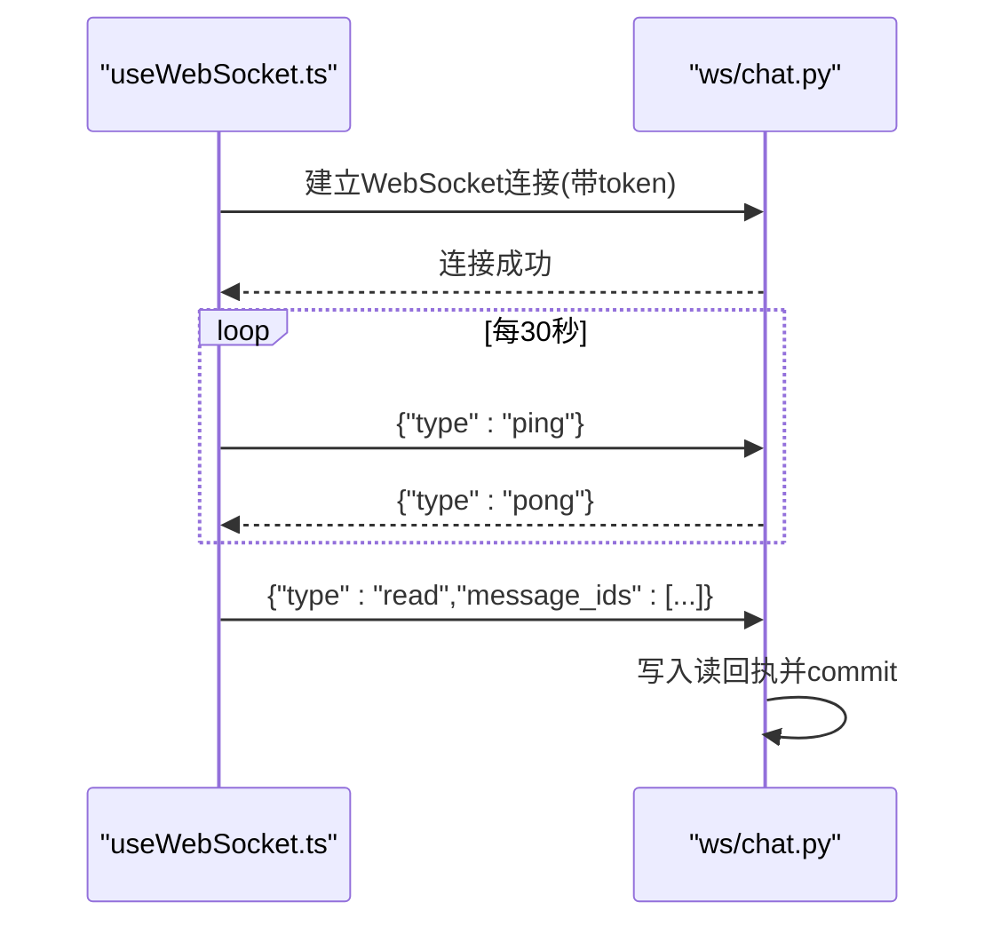
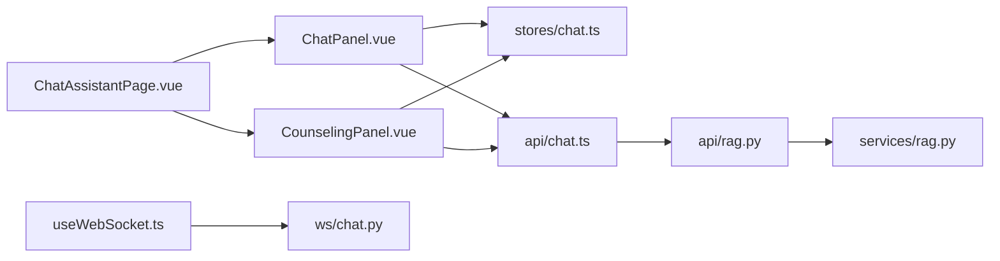

# 聊天界面组件

<cite>
**本文引用的文件**
- [ChatPanel.vue](file://web/app/src/components/assistant/ChatPanel.vue)
- [CounselingPanel.vue](file://web/app/src/components/assistant/CounselingPanel.vue)
- [ChatAssistantPage.vue](file://web/app/src/views/ChatAssistantPage.vue)
- [chat.ts（前端API与SSE流）](file://web/app/src/api/chat.ts)
- [chat.ts（Pinia状态管理）](file://web/app/src/stores/chat.ts)
- [useWebSocket.ts](file://web/app/src/composables/useWebSocket.ts)
- [rag.py（后端RAG API路由）](file://web/backend/api/rag.py)
- [rag.py（后端RAG服务实现）](file://web/backend/services/rag.py)
- [chat.py（后端WebSocket实时消息）](file://web/backend/ws/chat.py)
</cite>

## 目录
1. [简介](#简介)
2. [项目结构](#项目结构)
3. [核心组件](#核心组件)
4. [架构总览](#架构总览)
5. [详细组件分析](#详细组件分析)
6. [依赖关系分析](#依赖关系分析)
7. [性能考量](#性能考量)
8. [故障排查指南](#故障排查指南)
9. [结论](#结论)
10. [附录：API调用示例](#附录api调用示例)

## 简介
本文件面向聊天界面组件，重点围绕 ChatPanel 组件的实现进行深入说明，涵盖以下方面：
- 流式对话处理：基于服务端事件流（SSE）的逐字增量渲染、思考阶段提示、动作卡片扩展。
- 消息渲染：骨架屏、光标闪烁、来源引用展示、滚动联动等UI细节。
- 输入处理：模式切换、预设问题轮播、输入框自适应高度、键盘交互。
- 错误恢复机制：网络异常、限流、鉴权失败、额度耗尽等场景的用户友好提示与降级策略。
- 实时通信：WebSocket用于IM读回执与心跳；SSE用于问答流式响应。
- 上下文管理与会话持久化：历史对话加载、消息裁剪、会话ID隔离、登录态区分。
- 性能优化：流式增量更新、内容长度限制、滚动链优化、缓存与重试策略。

## 项目结构
聊天功能由“视图层 + 组件层 + 状态层 + API层 + 后端服务”构成：
- 视图层：ChatAssistantPage.vue 负责页面布局、模式切换、输入区与滚动行为。
- 组件层：ChatPanel.vue 与 CounselingPanel.vue 分别承载知识问答与心理陪伴两种模式的对话UI与交互。
- 状态层：stores/chat.ts 维护消息列表、会话ID、历史对话、动作卡片等。
- API层：api/chat.ts 封装REST与SSE流式接口，提供统一的事件回调模型。
- 后端：backend/api/rag.py 暴露 /rag/* 接口；backend/services/rag.py 实现RAG检索与流式生成；backend/ws/chat.py 提供WebSocket通道。

图表来源
- [ChatAssistantPage.vue:1-200](file://web/app/src/views/ChatAssistantPage.vue#L1-L200)
- [ChatPanel.vue:1-156](file://web/app/src/components/assistant/ChatPanel.vue#L1-L156)
- [CounselingPanel.vue:1-158](file://web/app/src/components/assistant/CounselingPanel.vue#L1-L158)
- [chat.ts（API）:1-272](file://web/app/src/api/chat.ts#L1-L272)
- [chat.ts（Store）:1-164](file://web/app/src/stores/chat.ts#L1-L164)
- [useWebSocket.ts:1-75](file://web/app/src/composables/useWebSocket.ts#L1-L75)
- [rag.py（API）:531-565](file://web/backend/api/rag.py#L531-L565)
- [rag.py（服务）:1300-1499](file://web/backend/services/rag.py#L1300-L1499)
- [chat.py（WS）:1-111](file://web/backend/ws/chat.py#L1-L111)

章节来源
- [ChatAssistantPage.vue:1-200](file://web/app/src/views/ChatAssistantPage.vue#L1-L200)
- [ChatPanel.vue:1-156](file://web/app/src/components/assistant/ChatPanel.vue#L1-L156)
- [CounselingPanel.vue:1-158](file://web/app/src/components/assistant/CounselingPanel.vue#L1-L158)
- [chat.ts（API）:1-272](file://web/app/src/api/chat.ts#L1-L272)
- [chat.ts（Store）:1-164](file://web/app/src/stores/chat.ts#L1-L164)
- [useWebSocket.ts:1-75](file://web/app/src/composables/useWebSocket.ts#L1-L75)
- [rag.py（API）:531-565](file://web/backend/api/rag.py#L531-L565)
- [rag.py（服务）:1300-1499](file://web/backend/services/rag.py#L1300-L1499)
- [chat.py（WS）:1-111](file://web/backend/ws/chat.py#L1-L111)

## 核心组件
- ChatPanel.vue：知识问答模式的对话面板，负责发送消息、监听SSE事件、渲染骨架屏与来源引用、处理访客配额提示与历史对话侧边栏。
- CounselingPanel.vue：心理陪伴模式面板，包含危机关键词检测、正念呼吸与心情记录工具、流式回答与错误处理。
- stores/chat.ts：集中管理消息、会话ID、历史对话、动作卡片、流式token追加与最终化、错误清理。
- api/chat.ts：封装REST与SSE流式请求，定义SSEStreamReader类，统一thinking/token/action_card/done/error事件。
- useWebSocket.ts：通用WebSocket封装，支持连接、重连、ping/pong、按类型分发消息。
- 后端：
  - api/rag.py：/rag/ask-stream、/rag/ask-public-stream 等SSE端点，鉴权、限流、访客配额控制。
  - services/rag.py：RAG检索、构建消息、流式调用LLM、上下文聚合、历史裁剪。
  - ws/chat.py：WebSocket连接管理、读回执、心跳。

章节来源
- [ChatPanel.vue:1-156](file://web/app/src/components/assistant/ChatPanel.vue#L1-L156)
- [CounselingPanel.vue:1-158](file://web/app/src/components/assistant/CounselingPanel.vue#L1-L158)
- [chat.ts（Store）:1-164](file://web/app/src/stores/chat.ts#L1-L164)
- [chat.ts（API）:1-272](file://web/app/src/api/chat.ts#L1-L272)
- [useWebSocket.ts:1-75](file://web/app/src/composables/useWebSocket.ts#L1-L75)
- [rag.py（API）:531-565](file://web/backend/api/rag.py#L531-L565)
- [rag.py（服务）:1300-1499](file://web/backend/services/rag.py#L1300-L1499)
- [chat.py（WS）:1-111](file://web/backend/ws/chat.py#L1-L111)

## 架构总览
聊天系统采用“前端SSE流式渲染 + 后端RAG流式生成 + WebSocket辅助实时能力”的混合架构：
- 用户输入触发 ChatPanel/CounselingPanel 调用 chatApi.streamAsk/streamAskPublic。
- 前端通过 SSEStreamReader 发起POST到 /api/rag/ask-stream 或 /api/rag/ask-public-stream。
- 后端鉴权、限流、访客配额校验后，进入 RAG 服务进行文档检索与LLM流式生成。
- 后端以 text/event-stream 形式推送 thinking/token/action_card/done 事件。
- 前端根据事件类型更新消息状态：骨架屏→思考提示→逐字渲染→来源引用→完成。
- WebSocket 用于IM读回执与心跳，与问答SSE解耦。

图表来源
- [ChatPanel.vue:17-54](file://web/app/src/components/assistant/ChatPanel.vue#L17-L54)
- [chat.ts（API）:75-125](file://web/app/src/api/chat.ts#L75-L125)
- [chat.ts（API）:168-271](file://web/app/src/api/chat.ts#L168-L271)
- [rag.py（API）:531-565](file://web/backend/api/rag.py#L531-L565)
- [rag.py（服务）:1300-1363](file://web/backend/services/rag.py#L1300-L1363)

## 详细组件分析

### ChatPanel 组件分析
职责与流程：
- 发送消息：去重空输入与防重复提交；添加用户消息；插入骨架屏消息；根据登录态选择流式接口。
- 流式事件绑定：onThinking更新思考阶段与文案；onToken追加内容；onActionCard追加动作卡片；onDone收尾并携带来源与剩余配额；onError清理骨架并提示。
- UI细节：骨架屏三点跳动+思考文案；流式光标闪烁；参考来源列表；访客配额提示与登录引导；历史对话侧边栏。

图表来源
- [ChatPanel.vue:17-54](file://web/app/src/components/assistant/ChatPanel.vue#L17-L54)
- [chat.ts（API）:75-125](file://web/app/src/api/chat.ts#L75-L125)
- [chat.ts（API）:168-271](file://web/app/src/api/chat.ts#L168-L271)

章节来源
- [ChatPanel.vue:1-156](file://web/app/src/components/assistant/ChatPanel.vue#L1-L156)
- [chat.ts（API）:75-125](file://web/app/src/api/chat.ts#L75-L125)
- [chat.ts（API）:168-271](file://web/app/src/api/chat.ts#L168-L271)

### CounselingPanel 组件分析
职责与流程：
- 危机检测：识别敏感词并弹出关怀提示与资源电话。
- 流式回答：与ChatPanel类似，但使用counseling模式参数；完成后重置流式状态。
- 工具集成：正念呼吸与心情记录弹窗，覆盖在对话之上。

图表来源
- [CounselingPanel.vue:21-40](file://web/app/src/components/assistant/CounselingPanel.vue#L21-L40)
- [chat.ts（API）:75-125](file://web/app/src/api/chat.ts#L75-L125)
- [rag.py（服务）:1332-1363](file://web/backend/services/rag.py#L1332-L1363)

章节来源
- [CounselingPanel.vue:1-158](file://web/app/src/components/assistant/CounselingPanel.vue#L1-L158)
- [chat.ts（API）:75-125](file://web/app/src/api/chat.ts#L75-L125)
- [rag.py（服务）:1332-1363](file://web/backend/services/rag.py#L1332-L1363)

### 流式对话处理与SSE解析
- SSEStreamReader：
  - 建立POST请求至 /api/rag/ask-stream 或 /api/rag/ask-public-stream，附加Authorization头（若存在）。
  - 读取ReadableStream，按行解析data: JSON事件，分派到onThinking/onToken/onActionCard/onDone。
  - 错误路径：网络异常、HTTP非200、流读取异常均转为友好错误字符串。
- 文本清洗：sanitizeAssistantText剥离异常后缀与原始异常类名，避免泄露内部错误信息。

图表来源
- [chat.ts（API）:116-125](file://web/app/src/api/chat.ts#L116-L125)
- [chat.ts（API）:168-271](file://web/app/src/api/chat.ts#L168-L271)

章节来源
- [chat.ts（API）:116-125](file://web/app/src/api/chat.ts#L116-L125)
- [chat.ts（API）:168-271](file://web/app/src/api/chat.ts#L168-L271)

### 消息渲染与UI细节
- 骨架屏：isSkeleton为true时显示三点跳动与思考文案；收到首个token后切换为正文并保留光标闪烁。
- 来源引用：done事件中携带sources数组，渲染为可点击链接列表。
- 滚动联动：答案内容区域与外层聊天滚动容器在边界处联动，提升长文阅读体验。
- 访客配额：未登录时显示剩余次数，低配额时引导登录。

章节来源
- [ChatPanel.vue:104-127](file://web/app/src/components/assistant/ChatPanel.vue#L104-L127)
- [ChatAssistantPage.vue:202-266](file://web/app/src/views/ChatAssistantPage.vue#L202-L266)

### 输入处理与模式切换
- 输入框自适应高度、Enter发送、焦点/失焦控制预设轮播。
- 模式切换：智能问答与知心陪伴模式独立会话上下文，切换时清空消息与conversationId，避免上下文污染。
- 预设问题：输入为空且未聚焦时自动轮播推荐问题，提升冷启动体验。

章节来源
- [ChatAssistantPage.vue:15-184](file://web/app/src/views/ChatAssistantPage.vue#L15-L184)
- [ChatAssistantPage.vue:346-424](file://web/app/src/views/ChatAssistantPage.vue#L346-L424)

### 错误恢复机制
- 前端：
  - toFriendlyError将认证、限流、超时等错误转换为友好文案。
  - sanitizeAssistantText过滤异常类名与错误后缀，防止泄露。
  - onError时移除骨架消息并给出兜底提示。
- 后端：
  - 限流与访客配额：_enforce_chat_rate_limit与访客计数、退款逻辑。
  - LLM异常：捕获openai.APIError并以友好文本流式返回。

章节来源
- [chat.ts（API）:127-166](file://web/app/src/api/chat.ts#L127-L166)
- [chat.ts（API）:230-271](file://web/app/src/api/chat.ts#L230-L271)
- [rag.py（API）:531-565](file://web/backend/api/rag.py#L531-L565)
- [rag.py（服务）:1349-1363](file://web/backend/services/rag.py#L1349-L1363)

### WebSocket实时通信
- useWebSocket.ts：
  - 连接URL带token鉴权；onopen开启每30秒ping；onmessage按type分发；onclose指数退避重连；onerror关闭。
  - 提供on/off/send方法，便于订阅特定事件。
- 后端chat.py：
  - 验证token，维护active连接；处理ping/pong与read回执；异常断开清理。

图表来源
- [useWebSocket.ts:11-73](file://web/app/src/composables/useWebSocket.ts#L11-L73)
- [chat.py（WS）:45-111](file://web/backend/ws/chat.py#L45-L111)

章节来源
- [useWebSocket.ts:1-75](file://web/app/src/composables/useWebSocket.ts#L1-L75)
- [chat.py（WS）:1-111](file://web/backend/ws/chat.py#L1-L111)

### 上下文管理与会话持久化
- 会话ID：每个会话唯一conversationId，切换模式时重建，避免跨模式上下文污染。
- 历史对话：loadConversations/list conversations；loadConversation获取最近N条消息并渲染。
- 历史裁剪：后端对conversation_history限制最大回合数，避免上下文膨胀影响成本与延迟。
- 个人上下文：登录用户聚合档案/日记摘要/用药等信息注入system prompt，访客不注入。

章节来源
- [chat.ts（Store）:117-136](file://web/app/src/stores/chat.ts#L117-L136)
- [rag.py（服务）:1393-1433](file://web/backend/services/rag.py#L1393-L1433)

## 依赖关系分析
- 组件依赖：
  - ChatPanel.vue 依赖 stores/chat.ts 与 api/chat.ts。
  - CounselingPanel.vue 依赖 stores/chat.ts 与 api/chat.ts。
  - ChatAssistantPage.vue 组合两个面板，管理输入与滚动。
- API依赖：
  - api/chat.ts 依赖 fetch与ReadableStream，构造SSEStreamReader。
  - 后端api/rag.py 依赖 services/rag.py 实现RAG与流式生成。
- WebSocket依赖：
  - useWebSocket.ts 依赖 auth store获取token，连接后端ws/chat.py。

图表来源
- [ChatPanel.vue:1-156](file://web/app/src/components/assistant/ChatPanel.vue#L1-L156)
- [CounselingPanel.vue:1-158](file://web/app/src/components/assistant/CounselingPanel.vue#L1-L158)
- [ChatAssistantPage.vue:1-200](file://web/app/src/views/ChatAssistantPage.vue#L1-L200)
- [chat.ts（API）:1-272](file://web/app/src/api/chat.ts#L1-L272)
- [rag.py（API）:531-565](file://web/backend/api/rag.py#L531-L565)
- [rag.py（服务）:1300-1499](file://web/backend/services/rag.py#L1300-L1499)
- [useWebSocket.ts:1-75](file://web/app/src/composables/useWebSocket.ts#L1-L75)
- [chat.py（WS）:1-111](file://web/backend/ws/chat.py#L1-L111)

章节来源
- [ChatPanel.vue:1-156](file://web/app/src/components/assistant/ChatPanel.vue#L1-L156)
- [CounselingPanel.vue:1-158](file://web/app/src/components/assistant/CounselingPanel.vue#L1-L158)
- [ChatAssistantPage.vue:1-200](file://web/app/src/views/ChatAssistantPage.vue#L1-L200)
- [chat.ts（API）:1-272](file://web/app/src/api/chat.ts#L1-L272)
- [rag.py（API）:531-565](file://web/backend/api/rag.py#L531-L565)
- [rag.py（服务）:1300-1499](file://web/backend/services/rag.py#L1300-L1499)
- [useWebSocket.ts:1-75](file://web/app/src/composables/useWebSocket.ts#L1-L75)
- [chat.py（WS）:1-111](file://web/backend/ws/chat.py#L1-L111)

## 性能考量
- 流式渲染：SSE逐字推送，减少首屏等待时间，提升感知速度。
- 历史裁剪：后端限制conversation_history最大回合数，降低上下文大小与成本。
- 滚动优化：答案内容区域与外层滚动联动，避免移动端滚动卡顿。
- 错误降级：toFriendlyError与sanitizeAssistantText确保错误不泄露且用户体验平滑。
- 访客配额：后端按客户端指纹统计每日用量，避免滥用；失败时尝试退款计数。
- WebSocket心跳：每30秒ping保持连接活跃，断线指数退避重连。

[本节为通用性能建议，不直接分析具体文件]

## 故障排查指南
常见问题与定位：
- 流式无响应：检查SSE连接是否建立、浏览器是否支持ReadableStream、后端是否返回text/event-stream。
- 鉴权失败：确认localStorage中的subskin_token是否存在且有效；后端verify_token_ws是否通过。
- 额度耗尽：前端onError中包含“已用完/429/quota”判断，提示登录；后端_guest_limit与guest usage计数需核对。
- 异常泄露：若出现AuthenticationError等字样，检查sanitizeAssistantText是否生效。
- WebSocket断连：检查onclose重连逻辑、后端ConnectionManager是否清理连接。

章节来源
- [chat.ts（API）:127-166](file://web/app/src/api/chat.ts#L127-L166)
- [chat.ts（API）:230-271](file://web/app/src/api/chat.ts#L230-L271)
- [useWebSocket.ts:44-53](file://web/app/src/composables/useWebSocket.ts#L44-L53)
- [chat.py（WS）:45-111](file://web/backend/ws/chat.py#L45-L111)

## 结论
ChatPanel组件通过SSE流式渲染实现了低延迟、高响应的对话体验，结合骨架屏、思考提示、来源引用与错误恢复机制，提供了完整的用户交互闭环。配合CounselingPanel的心理陪伴模式与ChatAssistantPage的模式切换，形成多场景适配的聊天界面。后端RAG服务保证检索质量与个性化上下文注入，WebSocket提供实时能力支撑。整体架构清晰、可扩展性强，具备良好的性能与容错能力。

[本节为总结性内容，不直接分析具体文件]

## 附录：API调用示例
- 流式问答（已登录）：
  - 前端调用：chatApi.streamAsk(question, conversationId, mode)
  - 后端端点：POST /api/rag/ask-stream
  - 事件类型：thinking、token、action_card、done
- 流式问答（访客）：
  - 前端调用：chatApi.streamAskPublic(question, mode)
  - 后端端点：POST /api/rag/ask-public-stream
- 非流式问答：
  - 前端调用：chatApi.ask(question, conversationId, mode)
  - 后端端点：POST /rag/ask
- 访客配额查询：
  - 前端调用：chatApi.getGuestQuota()
  - 后端端点：GET /rag/guest-quota
- 历史对话：
  - 列表：GET /rag/conversations
  - 消息：GET /rag/conversations/{conversationId}/messages
  - 删除：DELETE /rag/conversations/{conversationId}

章节来源
- [chat.ts（API）:31-114](file://web/app/src/api/chat.ts#L31-L114)
- [rag.py（API）:531-565](file://web/backend/api/rag.py#L531-L565)