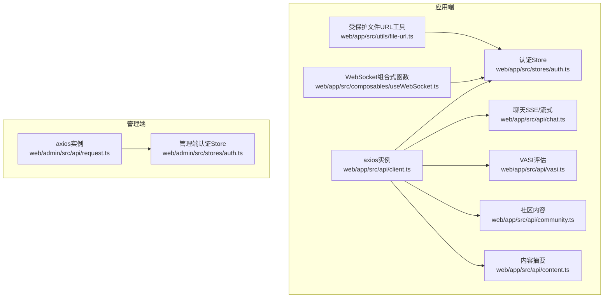
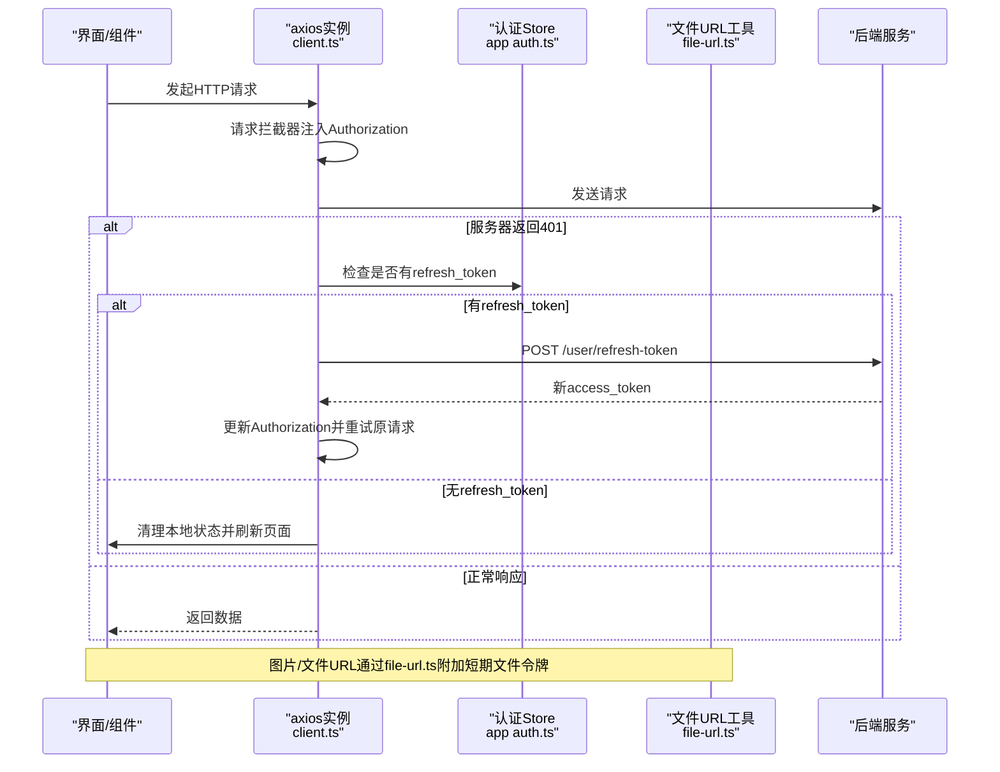
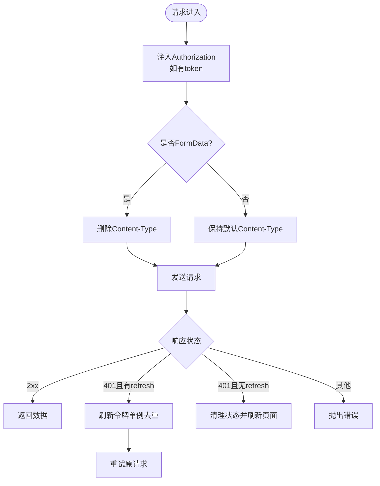
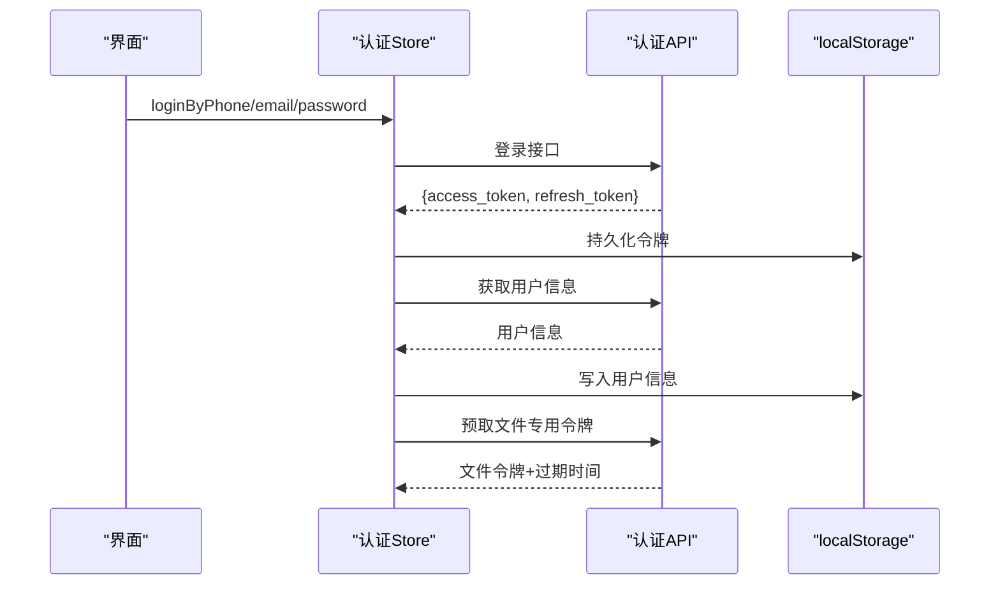
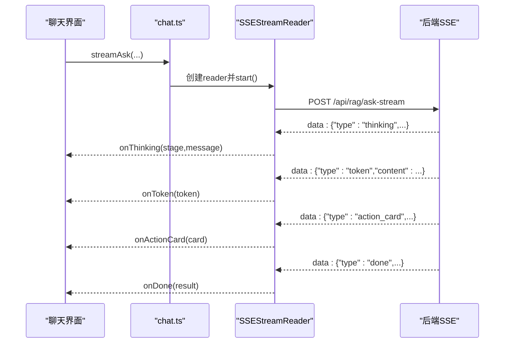
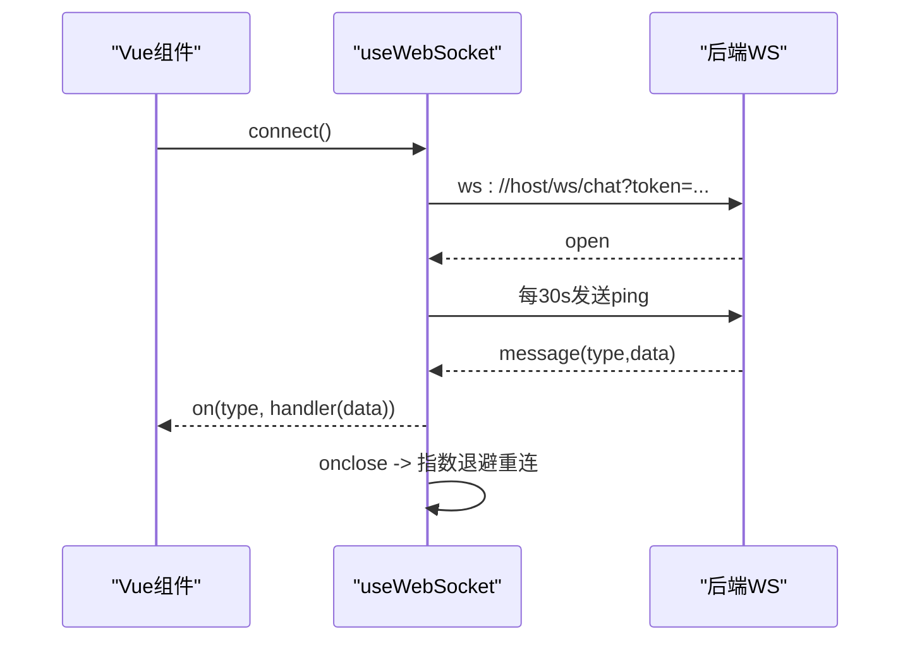
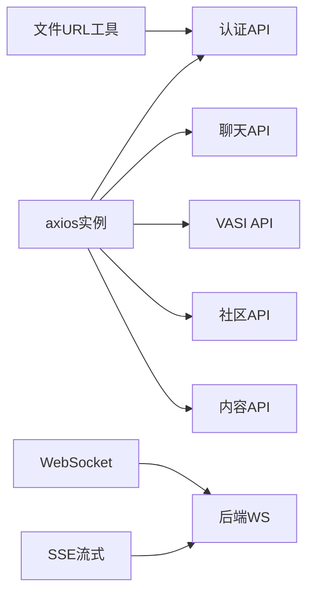

# API客户端

<cite>
**本文引用的文件**
- [client.ts](file://web/app/src/api/client.ts)
- [request.ts](file://web/admin/src/api/request.ts)
- [auth.ts](file://web/app/src/api/auth.ts)
- [chat.ts](file://web/app/src/api/chat.ts)
- [vasi.ts](file://web/app/src/api/vasi.ts)
- [community.ts](file://web/app/src/api/community.ts)
- [content.ts](file://web/app/src/api/content.ts)
- [useWebSocket.ts](file://web/app/src/composables/useWebSocket.ts)
- [auth.ts（应用端）](file://web/app/src/stores/auth.ts)
- [auth.ts（管理端）](file://web/admin/src/stores/auth.ts)
- [file-url.ts](file://web/app/src/utils/file-url.ts)
</cite>

## 目录
1. [简介](#简介)
2. [项目结构](#项目结构)
3. [核心组件](#核心组件)
4. [架构总览](#架构总览)
5. [详细组件分析](#详细组件分析)
6. [依赖关系分析](#依赖关系分析)
7. [性能与可靠性](#性能与可靠性)
8. [故障排查指南](#故障排查指南)
9. [结论](#结论)
10. [附录：接口定义规范与最佳实践](#附录接口定义规范与最佳实践)

## 简介
本文件面向前端API客户端，系统性说明HTTP请求封装、认证管理、请求拦截器、响应处理、超时控制、重试策略、RESTful调用、WebSocket连接、文件上传下载与流式数据传输，以及错误码处理、日志与调试、版本管理与Mock测试策略。文档以仓库中的实际实现为依据，帮助开发者快速理解并扩展客户端能力。

## 项目结构
前端包含两个独立的应用入口：
- 应用端 web/app：面向用户的核心业务，提供统一的 axios 实例、认证状态管理、聊天流式SSE、VASI评估、社区内容等API封装。
- 管理端 web/admin：面向管理员的后台，提供独立的 axios 实例与管理端认证流程。

图表来源
- [client.ts:1-84](file://web/app/src/api/client.ts#L1-L84)
- [request.ts:1-32](file://web/admin/src/api/request.ts#L1-L32)
- [auth.ts（应用端）:1-259](file://web/app/src/stores/auth.ts#L1-L259)
- [auth.ts（管理端）:1-59](file://web/admin/src/stores/auth.ts#L1-L59)
- [chat.ts:1-272](file://web/app/src/api/chat.ts#L1-L272)
- [vasi.ts:1-274](file://web/app/src/api/vasi.ts#L1-L274)
- [community.ts:1-284](file://web/app/src/api/community.ts#L1-L284)
- [content.ts:1-53](file://web/app/src/api/content.ts#L1-L53)
- [useWebSocket.ts:1-75](file://web/app/src/composables/useWebSocket.ts#L1-L75)
- [file-url.ts:1-155](file://web/app/src/utils/file-url.ts#L1-L155)

章节来源
- [client.ts:1-84](file://web/app/src/api/client.ts#L1-L84)
- [request.ts:1-32](file://web/admin/src/api/request.ts#L1-L32)

## 核心组件
- HTTP基础客户端
  - 应用端：基于 axios 创建统一实例，设置基础路径、默认超时、默认请求头；在请求拦截器中自动注入访问令牌，并在FormData场景下移除Content-Type以避免边界问题；在响应拦截器中集中处理401未授权，支持无感刷新令牌与并发去重。
  - 管理端：独立的 axios 实例，仅注入管理端令牌，401时清除本地令牌但不自动跳转，交由路由守卫或页面逻辑处理。
- 认证与状态管理
  - 应用端：Pinia store维护access_token、refresh_token与用户信息；登录成功后持久化令牌并预取短生命周期文件令牌；提供多方式登录、绑定、密码重置、登出等能力；在获取用户信息失败时尝试刷新令牌，失败则登出。
  - 管理端：简单令牌存储与校验，登录后强制校验管理员权限，否则拒绝登录。
- 文件安全与访问
  - 通过短生命周期“文件专用令牌”为静态资源链接附加临时凭证，降低泄露风险；HTML渲染时对src/href进行重写，确保受保护资源可被正确加载。
- 实时通信
  - WebSocket：封装连接、心跳保活、断线指数退避重连、事件订阅与发送。
  - SSE流式：聊天问答采用服务端推送事件流，前端解析data:行并分发到不同回调。

章节来源
- [client.ts:1-84](file://web/app/src/api/client.ts#L1-L84)
- [request.ts:1-32](file://web/admin/src/api/request.ts#L1-L32)
- [auth.ts（应用端）:1-259](file://web/app/src/stores/auth.ts#L1-L259)
- [auth.ts（管理端）:1-59](file://web/admin/src/stores/auth.ts#L1-L59)
- [file-url.ts:1-155](file://web/app/src/utils/file-url.ts#L1-L155)
- [useWebSocket.ts:1-75](file://web/app/src/composables/useWebSocket.ts#L1-L75)
- [chat.ts:1-272](file://web/app/src/api/chat.ts#L1-L272)

## 架构总览
下图展示从发起请求到返回响应的完整链路，包括认证注入、401刷新、文件令牌与流式传输。

图表来源
- [client.ts:11-81](file://web/app/src/api/client.ts#L11-L81)
- [auth.ts（应用端）:33-79](file://web/app/src/stores/auth.ts#L33-L79)
- [file-url.ts:42-83](file://web/app/src/utils/file-url.ts#L42-L83)

## 详细组件分析

### HTTP客户端与拦截器
- 应用端axios实例
  - 基础配置：baseURL、超时时间、默认Content-Type。
  - 请求拦截器：读取本地令牌并注入Authorization；当数据为FormData时删除Content-Type，让浏览器自动设置multipart boundary。
  - 响应拦截器：捕获401，若存在refresh_token则调用刷新接口，使用单例Promise去重并发刷新；刷新成功则更新Authorization并重试原请求；否则清理本地状态并刷新页面。
- 管理端axios实例
  - 仅注入admin_token；401时清理本地令牌，不自动跳转，由上层决定行为。

图表来源
- [client.ts:11-81](file://web/app/src/api/client.ts#L11-L81)

章节来源
- [client.ts:11-81](file://web/app/src/api/client.ts#L11-L81)
- [request.ts:8-29](file://web/admin/src/api/request.ts#L8-L29)

### 认证管理
- 应用端
  - 登录成功后持久化access_token与refresh_token，并预取短生命周期文件令牌；定时刷新文件令牌以保证长会话中资源可用。
  - 获取用户信息失败时尝试刷新令牌，失败则登出。
  - 登出时先尝试撤销refresh token（网络失败不影响本地清理），再清空本地状态。
- 管理端
  - 登录使用表单提交，成功后保存admin_token并拉取当前用户信息；非管理员直接拒绝登录。

图表来源
- [auth.ts（应用端）:63-79](file://web/app/src/stores/auth.ts#L63-L79)
- [auth.ts（应用端）:171-183](file://web/app/src/stores/auth.ts#L171-L183)
- [auth.ts（应用端）:210-227](file://web/app/src/stores/auth.ts#L210-L227)

章节来源
- [auth.ts（应用端）:1-259](file://web/app/src/stores/auth.ts#L1-L259)
- [auth.ts（管理端）:1-59](file://web/admin/src/stores/auth.ts#L1-L59)

### RESTful API调用与类型定义
- 认证相关：短信/邮箱验证码、多种登录方式、注册、绑定、密码管理、登出、刷新令牌、获取用户信息、头像上传等。
- 聊天与RAG：提问、公共提问、会话列表与消息、临时附件上传、流式问答（SSE）。
- VASI评估：图片质量检查、评估、轮廓提交、趋势查询、批量删除、提示词准备与交互、最终确认与放弃等。
- 社区内容：分类、帖子CRUD、评论、收藏、标签、关注/屏蔽/举报、合集管理等。
- 内容摘要：每日简报、最新内容、时间线。

章节来源
- [auth.ts:1-195](file://web/app/src/api/auth.ts#L1-L195)
- [chat.ts:1-272](file://web/app/src/api/chat.ts#L1-L272)
- [vasi.ts:1-274](file://web/app/src/api/vasi.ts#L1-L274)
- [community.ts:1-284](file://web/app/src/api/community.ts#L1-L284)
- [content.ts:1-53](file://web/app/src/api/content.ts#L1-L53)

### 流式数据传输（SSE）
- 聊天流式接口通过自定义SSEStreamReader实现：
  - 使用fetch建立POST请求，携带Authorization与JSON Body。
  - 读取ReadableStream并按行解析data:前缀的事件。
  - 根据event.type分发thinking、token、action_card、done等事件。
  - 对异常进行友好化处理，避免暴露内部错误类型。
  - 支持取消与清理。

图表来源
- [chat.ts:75-125](file://web/app/src/api/chat.ts#L75-L125)
- [chat.ts:168-272](file://web/app/src/api/chat.ts#L168-L272)

章节来源
- [chat.ts:75-125](file://web/app/src/api/chat.ts#L75-L125)
- [chat.ts:168-272](file://web/app/src/api/chat.ts#L168-L272)

### WebSocket连接
- useWebSocket组合式函数：
  - 根据协议选择ws/wss，附带token参数建立连接。
  - 每30秒发送ping保活。
  - 支持按事件类型订阅与取消订阅，通用*通配符订阅。
  - 断线后指数退避重连，最多5次。
  - 组件卸载时关闭连接。

图表来源
- [useWebSocket.ts:11-53](file://web/app/src/composables/useWebSocket.ts#L11-L53)
- [useWebSocket.ts:55-73](file://web/app/src/composables/useWebSocket.ts#L55-L73)

章节来源
- [useWebSocket.ts:1-75](file://web/app/src/composables/useWebSocket.ts#L1-75)

### 文件上传下载与受保护资源
- 上传：多处使用FormData与multipart/form-data，如头像、社区媒体、VASI评估图片等。
- 下载：通过file-url.ts将/uploads/路径转换为/api/files/serve/并附加短期文件令牌；HTML渲染时重写所有src/href以确保受保护资源可加载。
- 安全：优先使用短期文件令牌，泄露影响范围小；若无文件令牌则回退到访问令牌。

章节来源
- [community.ts:132-157](file://web/app/src/api/community.ts#L132-L157)
- [vasi.ts:123-134](file://web/app/src/api/vasi.ts#L123-L134)
- [file-url.ts:72-101](file://web/app/src/utils/file-url.ts#L72-L101)
- [file-url.ts:103-155](file://web/app/src/utils/file-url.ts#L103-L155)

## 依赖关系分析
- 耦合度
  - 各业务API模块均依赖统一的axios实例，保证认证与错误处理一致。
  - 认证Store与文件URL工具解耦，通过异步预取与缓存机制避免循环依赖。
  - 聊天SSE与axios解耦，直接使用fetch以适配流式读取。
- 外部依赖
  - axios用于常规HTTP请求。
  - DOMPurify用于HTML清洗，防止XSS。
  - WebSocket/SSE用于实时通信。

图表来源
- [client.ts:1-84](file://web/app/src/api/client.ts#L1-L84)
- [file-url.ts:42-83](file://web/app/src/utils/file-url.ts#L42-L83)
- [useWebSocket.ts:11-53](file://web/app/src/composables/useWebSocket.ts#L11-L53)
- [chat.ts:168-272](file://web/app/src/api/chat.ts#L168-L272)

章节来源
- [client.ts:1-84](file://web/app/src/api/client.ts#L1-L84)
- [file-url.ts:1-155](file://web/app/src/utils/file-url.ts#L1-L155)
- [useWebSocket.ts:1-75](file://web/app/src/composables/useWebSocket.ts#L1-75)
- [chat.ts:1-272](file://web/app/src/api/chat.ts#L1-L272)

## 性能与可靠性
- 超时控制
  - 全局默认超时120秒，满足AI预处理耗时需求。
  - VASI评估等重型操作可单独设置更长超时（例如180秒）。
- 重试策略
  - 401时自动刷新令牌并重试一次；并发401通过单例Promise去重，避免重复刷新。
  - WebSocket断线采用指数退避重连，限制最大次数。
- 流式传输
  - SSE流式减少首屏等待，提升用户体验；支持取消与清理，避免内存泄漏。
- 文件访问
  - 短期文件令牌降低泄露风险；HTML渲染时自动重写资源URL，保障长会话稳定加载。

[本节为通用指导，无需具体文件引用]

## 故障排查指南
- 常见401问题
  - 检查是否存在refresh_token；若无则需重新登录。
  - 检查刷新接口是否可达；网络异常会触发登出流程。
- 文件无法加载
  - 确认file-url.ts是否正确转换/uploads/为/api/files/serve/并附加access_token。
  - 检查HTML渲染是否经过DOMPurify清洗并重写src/href。
- 流式中断
  - 检查SSEStreamReader是否正确解析data:行；网络错误或AbortError会导致中断。
  - 确认后端SSE端点是否持续输出事件。
- WebSocket断开
  - 检查心跳ping是否正常发送；断线后是否按指数退避重连。

章节来源
- [client.ts:44-81](file://web/app/src/api/client.ts#L44-L81)
- [file-url.ts:72-101](file://web/app/src/utils/file-url.ts#L72-L101)
- [chat.ts:168-272](file://web/app/src/api/chat.ts#L168-L272)
- [useWebSocket.ts:44-53](file://web/app/src/composables/useWebSocket.ts#L44-L53)

## 结论
该API客户端通过统一的axios实例、完善的认证与错误处理、安全的文件访问机制、稳定的WebSocket与SSE流式通信，构建了高可靠的前端数据层。各业务模块职责清晰、依赖解耦，便于扩展与维护。建议在实际使用中遵循本文档的接口规范与最佳实践，确保一致性、安全性与性能。

[本节为总结性内容，无需具体文件引用]

## 附录：接口定义规范与最佳实践
- 接口设计
  - 统一baseURL与超时；业务模块仅关注数据契约与错误分支。
  - 明确请求/响应类型定义，便于TS类型推断与IDE提示。
- 认证与安全
  - 所有需要鉴权的请求通过请求拦截器注入Authorization。
  - 文件资源使用短期令牌，避免长期令牌泄露风险。
- 错误处理
  - 401统一处理刷新与登出；其他错误向上抛出，由调用方决定展示。
  - 流式错误进行友好化转换，避免暴露内部异常。
- 日志与调试
  - 建议在开发环境开启请求/响应日志；生产环境按需记录关键节点。
  - 对SSE与WebSocket增加连接状态与错误事件上报。
- 版本管理
  - 通过URL路径或请求头标识API版本；向后兼容变更需保留旧接口。
- Mock与测试
  - 使用Mock服务模拟后端接口，覆盖成功、失败、限流、超时等场景。
  - 针对401刷新、SSE流式、WebSocket重连编写单元测试与集成测试。

[本节为通用指导，无需具体文件引用]