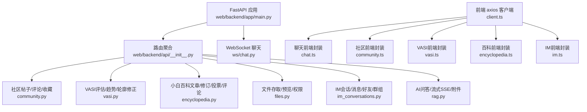
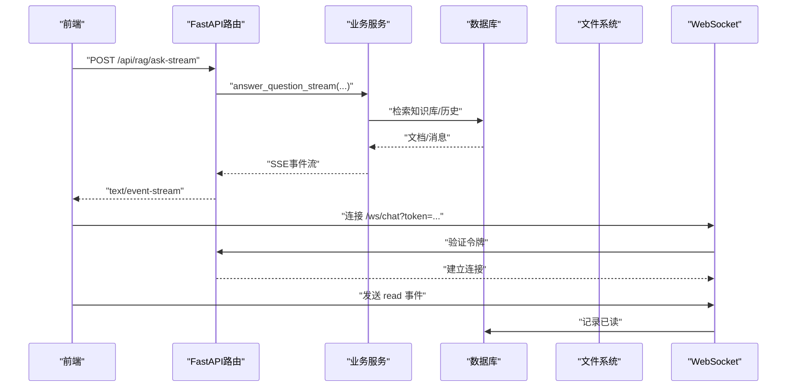
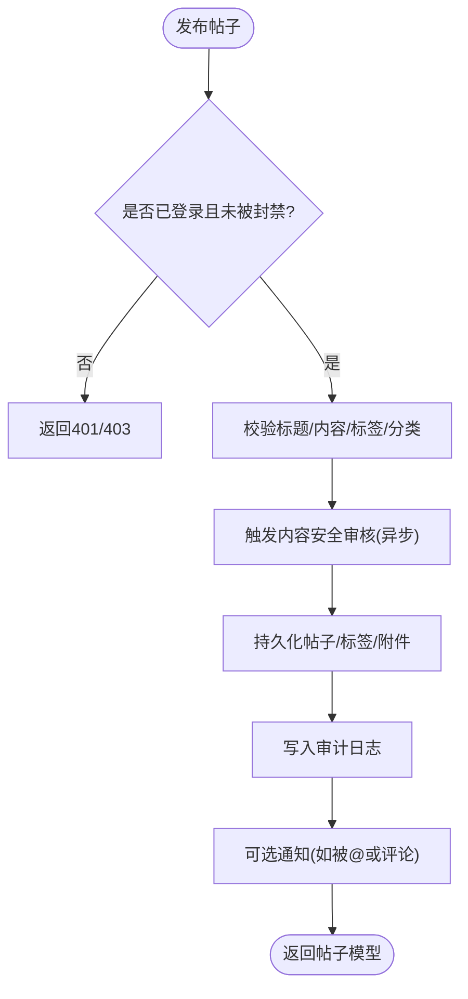
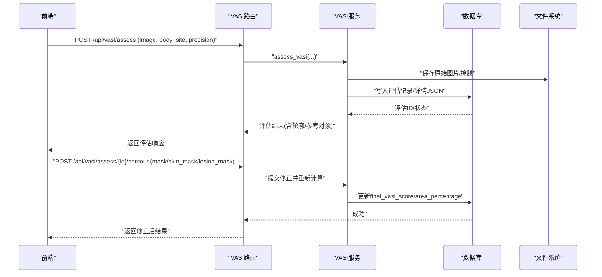
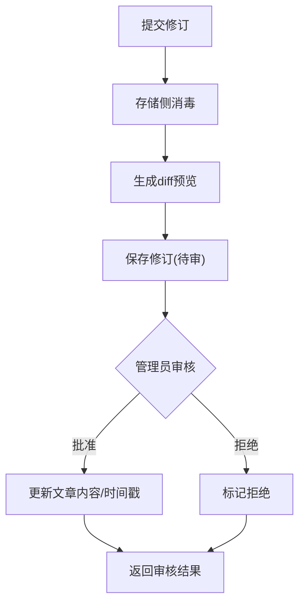
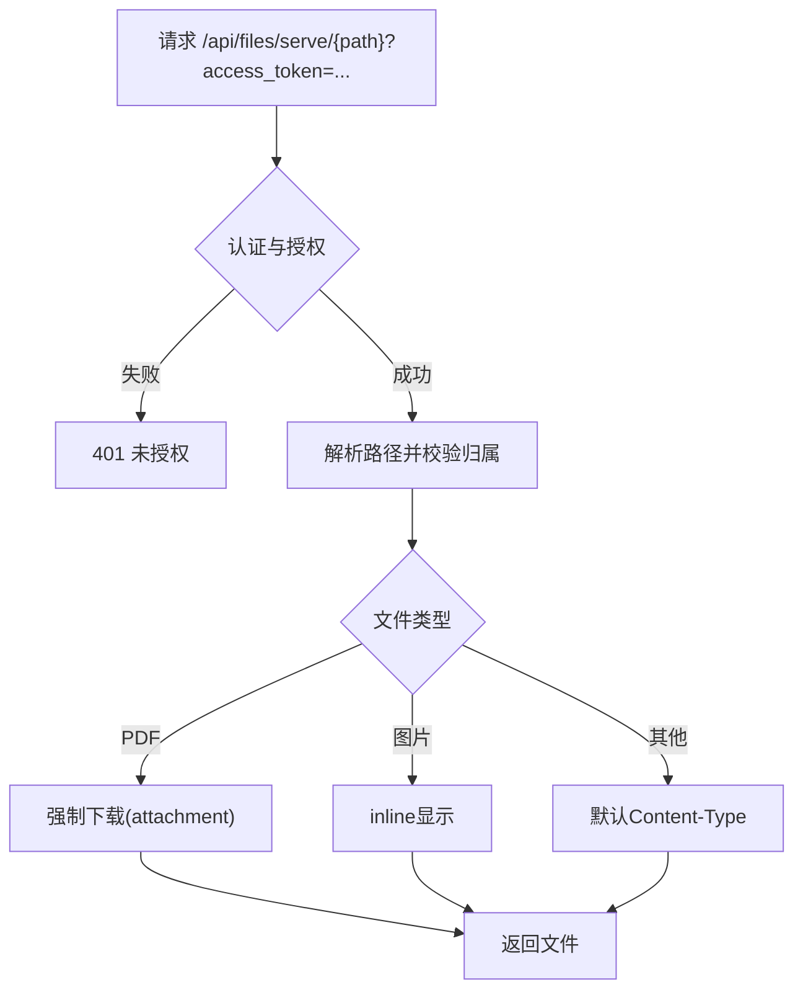
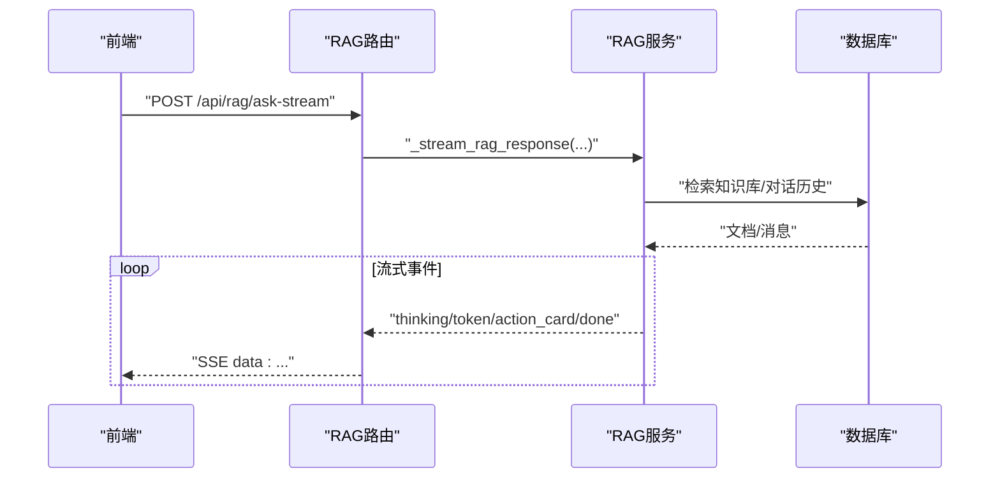
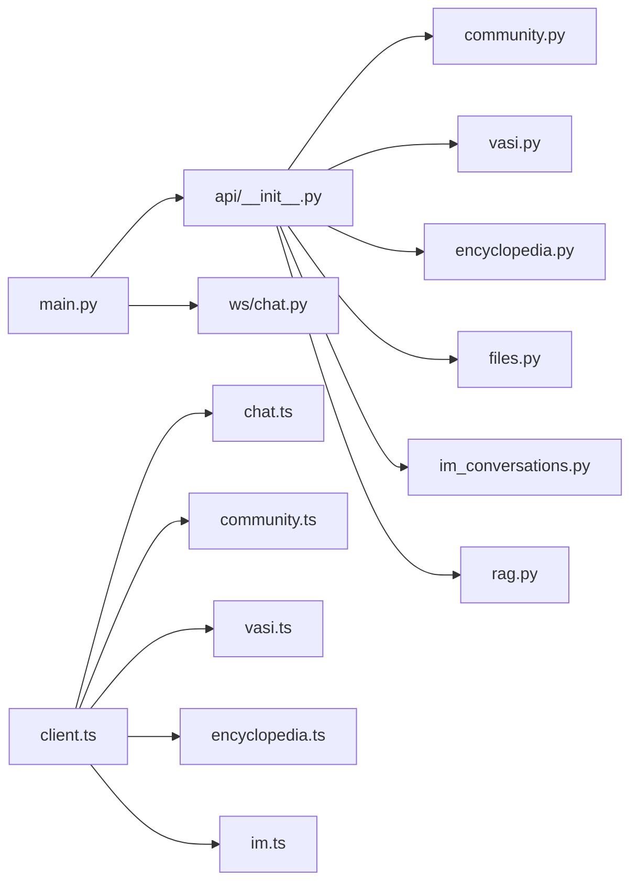

# API模块封装

<cite>
**本文引用的文件**
- [web/backend/app/main.py](file://web/backend/app/main.py)
- [web/backend/api/__init__.py](file://web/backend/api/__init__.py)
- [web/backend/api/community.py](file://web/backend/api/community.py)
- [web/backend/api/vasi.py](file://web/backend/api/vasi.py)
- [web/backend/api/encyclopedia.py](file://web/backend/api/encyclopedia.py)
- [web/backend/api/files.py](file://web/backend/api/files.py)
- [web/backend/ws/chat.py](file://web/backend/ws/chat.py)
- [web/backend/api/im_conversations.py](file://web/backend/api/im_conversations.py)
- [web/backend/api/rag.py](file://web/backend/api/rag.py)
- [web/app/src/api/client.ts](file://web/app/src/api/client.ts)
- [web/app/src/api/chat.ts](file://web/app/src/api/chat.ts)
- [web/app/src/api/community.ts](file://web/app/src/api/community.ts)
- [web/app/src/api/vasi.ts](file://web/app/src/api/vasi.ts)
- [web/app/src/api/encyclopedia.ts](file://web/app/src/api/encyclopedia.ts)
- [web/app/src/api/im.ts](file://web/app/src/api/im.ts)
</cite>

## 目录
1. [简介](#简介)
2. [项目结构](#项目结构)
3. [核心组件](#核心组件)
4. [架构总览](#架构总览)
5. [详细组件分析](#详细组件分析)
6. [依赖关系分析](#依赖关系分析)
7. [性能与扩展性](#性能与扩展性)
8. [故障排查指南](#故障排查指南)
9. [结论](#结论)
10. [附录：API契约与调用示例](#附录api契约与调用示例)

## 简介
本文件面向SubSkin项目的后端API模块封装，系统性梳理聊天对话、社区互动、VASI评估、百科知识等核心能力的REST接口设计、请求参数校验、响应数据解构与错误处理策略；并说明文件上传下载、流式数据传输（SSE）、WebSocket实时通信以及批量操作的实现方式。文档同时提供前端客户端封装的调用示例与异常处理建议，帮助开发者快速集成与排错。

## 项目结构
后端采用FastAPI模块化路由组织，应用启动时集中注册各业务路由，并提供CORS、监控、数据库初始化、临时文件清理等基础设施能力。前端通过统一的axios客户端封装鉴权、刷新令牌、超时与错误处理，并按业务域拆分API模块。

图表来源
- [web/backend/app/main.py:264-319](file://web/backend/app/main.py#L264-L319)
- [web/backend/api/__init__.py:5-31](file://web/backend/api/__init__.py#L5-L31)

章节来源
- [web/backend/app/main.py:264-319](file://web/backend/app/main.py#L264-L319)
- [web/backend/api/__init__.py:5-31](file://web/backend/api/__init__.py#L5-L31)

## 核心组件
- 统一入口与生命周期管理：应用启动时创建数据库表、执行列迁移、初始化监控、定时清理临时文件与过期刷新令牌。
- 路由注册：按业务域划分路由前缀与标签，便于文档化与权限控制。
- 认证与授权：基于JWT访问令牌与短期文件访问令牌，支持用户级与资源级访问控制。
- 限流与配额：访客每日提问次数限制、登录用户聊天速率限制、写操作频率限制。
- 文件服务：分桶存储、路径白名单、所有权校验、PDF分页预览与HTML内嵌查看器。
- 实时通信：WebSocket连接管理与读回执；SSE流式返回AI回答与动作卡片。
- 数据模型与序列化：Pydantic模型定义请求/响应结构，保证参数校验与类型安全。

章节来源
- [web/backend/app/main.py:228-349](file://web/backend/app/main.py#L228-L349)
- [web/backend/api/files.py:37-94](file://web/backend/api/files.py#L37-L94)
- [web/backend/api/rag.py:228-244](file://web/backend/api/rag.py#L228-L244)
- [web/backend/ws/chat.py:14-42](file://web/backend/ws/chat.py#L14-L42)

## 架构总览
系统以FastAPI为核心，围绕“认证-路由-服务-存储”分层展开。前端通过统一客户端发起HTTP/SSE/WebSocket请求，后端根据路由分发到对应业务模块，调用服务层完成业务逻辑，最终持久化或返回结果。

图表来源
- [web/backend/api/rag.py:534-629](file://web/backend/api/rag.py#L534-L629)
- [web/backend/ws/chat.py:45-111](file://web/backend/ws/chat.py#L45-L111)
- [web/backend/app/main.py:340-342](file://web/backend/app/main.py#L340-L342)

## 详细组件分析

### 社区互动模块（帖子、评论、收藏、标签）
- 功能范围：帖子CRUD、评论、点赞、收藏、标签管理、分类、同城定位、内容审核标记、日记日历、交互日志、批量删除等。
- 关键接口
  - 获取帖子列表：支持分类、标签、类型、推荐/热门/关注/本地等feed类型、分页游标、私密可见性过滤。
  - 发布/更新/删除帖子：写入审计日志，异步内容安全审核。
  - 评论：写频限制、禁言/封禁检查、通知作者。
  - 图片/音频/文件上传：统一返回URL与元信息。
  - 收藏集：创建、更新、增删条目、分页查询。
  - 标签：热门标签、模糊搜索。
- 参数校验与错误处理
  - 使用Pydantic模型进行请求体校验；非法输入返回400。
  - 未登录或无权限访问私密内容返回401/403。
  - 资源不存在返回404；内部错误返回500并记录日志。
- 性能优化
  - 批量转换避免N+1查询。
  - 读操作启用读取限流中间件。
  - IP地理定位缓存TTL降低外部依赖延迟。

图表来源
- [web/backend/api/community.py:219-293](file://web/backend/api/community.py#L219-L293)
- [web/backend/api/community.py:587-643](file://web/backend/api/community.py#L587-L643)
- [web/backend/api/community.py:683-757](file://web/backend/api/community.py#L683-L757)

章节来源
- [web/backend/api/community.py:114-169](file://web/backend/api/community.py#L114-L169)
- [web/backend/api/community.py:219-353](file://web/backend/api/community.py#L219-L353)
- [web/backend/api/community.py:445-540](file://web/backend/api/community.py#L445-L540)
- [web/backend/api/community.py:587-757](file://web/backend/api/community.py#L587-L757)

### VASI评估模块（图像评估、轮廓修正、趋势与反馈）
- 功能范围：上传白斑照片自动计算VASI评分、草稿确认/放弃、历史与趋势查询、轮廓修正（单图层/双图层mask）、质量检查、提示点选/圆框精修、批量删除等。
- 关键接口
  - 评估：支持quick/precise精度，返回评分、分期、区域百分比、轮廓、参考对象、皮肤Fitzpatrick类型等。
  - 草稿管理：finalize/abandon状态机。
  - 历史与趋势：分页、部位筛选、日期范围、曲线数据。
  - 轮廓修正：支持用户覆盖AI轮廓，计算差异指标（Dice、面积误差），回写最终评分。
  - 质量检查：模糊度、皮肤占比、亮度、分辨率、尺寸建议。
  - 提示交互：prepare/click/refine-circle用于交互式分割。
- 参数校验与错误处理
  - 图片大小上限、格式校验；超出返回413。
  - 未找到评估记录返回404；服务不可用返回503/500。
  - 缓存失效返回410。
- 性能与安全
  - 耗时计算放入线程池避免阻塞事件循环。
  - 严格的用户/资源归属校验，防止越权访问。

图表来源
- [web/backend/api/vasi.py:45-164](file://web/backend/api/vasi.py#L45-L164)
- [web/backend/api/vasi.py:167-201](file://web/backend/api/vasi.py#L167-L201)
- [web/backend/api/vasi.py:544-737](file://web/backend/api/vasi.py#L544-L737)

章节来源
- [web/backend/api/vasi.py:45-164](file://web/backend/api/vasi.py#L45-L164)
- [web/backend/api/vasi.py:204-350](file://web/backend/api/vasi.py#L204-L350)
- [web/backend/api/vasi.py:357-445](file://web/backend/api/vasi.py#L357-L445)
- [web/backend/api/vasi.py:448-508](file://web/backend/api/vasi.py#L448-L508)
- [web/backend/api/vasi.py:511-541](file://web/backend/api/vasi.py#L511-L541)
- [web/backend/api/vasi.py:544-737](file://web/backend/api/vasi.py#L544-L737)

### 小白百科模块（文章、修订、投票、评论）
- 功能范围：文章分类树、文章详情、修订提交与审核、版本回滚、投票、评论树。
- 关键接口
  - 文章：列出分类树、获取详情（自增浏览量）。
  - 修订：提交修订（内容消毒、diff预览）、审核（批准/拒绝）、回滚。
  - 投票：上/下投票，去重与切换。
  - 评论：顶级评论与回复树，需审核。
- 参数校验与错误处理
  - 内容长度、模式枚举校验；非法输入返回400。
  - 非管理员审核/回滚返回403；资源不存在返回404。
- 安全加固
  - 存储侧轻量消毒剔除危险标签与事件处理器，前端渲染主防线为DOMPurify。

图表来源
- [web/backend/api/encyclopedia.py:139-147](file://web/backend/api/encyclopedia.py#L139-L147)
- [web/backend/api/encyclopedia.py:227-271](file://web/backend/api/encyclopedia.py#L227-L271)
- [web/backend/api/encyclopedia.py:311-361](file://web/backend/api/encyclopedia.py#L311-L361)
- [web/backend/api/encyclopedia.py:364-404](file://web/backend/api/encyclopedia.py#L364-L404)
- [web/backend/api/encyclopedia.py:409-469](file://web/backend/api/encyclopedia.py#L409-L469)
- [web/backend/api/encyclopedia.py:474-555](file://web/backend/api/encyclopedia.py#L474-L555)
- [web/backend/api/encyclopedia.py:560-585](file://web/backend/api/encyclopedia.py#L560-L585)

章节来源
- [web/backend/api/encyclopedia.py:187-216](file://web/backend/api/encyclopedia.py#L187-L216)
- [web/backend/api/encyclopedia.py:227-308](file://web/backend/api/encyclopedia.py#L227-L308)
- [web/backend/api/encyclopedia.py:311-404](file://web/backend/api/encyclopedia.py#L311-L404)
- [web/backend/api/encyclopedia.py:409-555](file://web/backend/api/encyclopedia.py#L409-L555)
- [web/backend/api/encyclopedia.py:560-585](file://web/backend/api/encyclopedia.py#L560-L585)

### 文件上传下载模块（分桶、权限、预览）
- 功能范围：短效文件访问令牌、通用文件服务、医疗报告文件与分页预览、HTML查看器、临时文件清理、IM图片上传。
- 关键接口
  - 获取文件访问令牌：短时效、仅用于文件读取。
  - 通用文件服务：路径解析、所有权校验、媒体类型推断、PDF强制下载。
  - 医疗报告：按报告ID与页码提供分页PNG预览。
  - HTML查看器：PDF分页浏览、图片全屏、不支持格式下载引导。
  - IM图片：按用户分桶存储，返回URL与大小。
- 权限模型
  - 头像：任意登录用户可访问。
  - 社区图片：所有者或公开且未被屏蔽的帖子引用可访问。
  - 报告/文件/IM：严格的所有者校验。
  - VASI：评估记录归属或管理员训练图可访问。
- 错误处理
  - 路径穿越防护、不存在返回404、无权访问返回403、服务异常返回500。

图表来源
- [web/backend/api/files.py:37-48](file://web/backend/api/files.py#L37-L48)
- [web/backend/api/files.py:55-94](file://web/backend/api/files.py#L55-L94)
- [web/backend/api/files.py:138-227](file://web/backend/api/files.py#L138-L227)
- [web/backend/api/files.py:293-331](file://web/backend/api/files.py#L293-L331)
- [web/backend/api/files.py:341-370](file://web/backend/api/files.py#L341-L370)
- [web/backend/api/files.py:373-476](file://web/backend/api/files.py#L373-L476)
- [web/backend/api/files.py:479-502](file://web/backend/api/files.py#L479-L502)

章节来源
- [web/backend/api/files.py:37-94](file://web/backend/api/files.py#L37-L94)
- [web/backend/api/files.py:138-227](file://web/backend/api/files.py#L138-L227)
- [web/backend/api/files.py:293-331](file://web/backend/api/files.py#L293-L331)
- [web/backend/api/files.py:341-476](file://web/backend/api/files.py#L341-L476)
- [web/backend/api/files.py:479-502](file://web/backend/api/files.py#L479-L502)

### 聊天对话与实时通信（SSE与WebSocket）
- SSE流式问答：支持带附件的RAG问答，逐步输出思考阶段、token流、动作卡片（VASI评估、报告解读、日记分享），完成后返回来源与剩余配额。
- WebSocket实时消息：连接鉴权、心跳ping/pong、读回执记录、未读数广播。
- 前端封装：SSEStreamReader解析事件流，友好错误文案与中断取消。

图表来源
- [web/backend/api/rag.py:534-629](file://web/backend/api/rag.py#L534-L629)
- [web/backend/api/rag.py:632-800](file://web/backend/api/rag.py#L632-L800)
- [web/app/src/api/chat.ts:168-271](file://web/app/src/api/chat.ts#L168-L271)

章节来源
- [web/backend/api/rag.py:246-330](file://web/backend/api/rag.py#L246-L330)
- [web/backend/api/rag.py:534-629](file://web/backend/api/rag.py#L534-L629)
- [web/backend/ws/chat.py:45-111](file://web/backend/ws/chat.py#L45-L111)
- [web/app/src/api/chat.ts:168-271](file://web/app/src/api/chat.ts#L168-L271)

### IM会话与消息（会话、消息、好友、群组）
- 会话管理：列出会话、创建私聊、获取消息、标记已读、置顶。
- 消息与社交：发消息、撤回、好友申请/接受/拒绝、群组创建/成员管理、分享帖子、联系人匹配与搜索。
- 前端封装：统一方法映射后端路由，简化调用。

章节来源
- [web/backend/api/im_conversations.py:21-103](file://web/backend/api/im_conversations.py#L21-L103)
- [web/app/src/api/im.ts:3-53](file://web/app/src/api/im.ts#L3-L53)

## 依赖关系分析
- 路由聚合：main.py集中引入各模块路由并设置前缀与标签，便于文档与权限隔离。
- 服务层依赖：各API路由通过服务类封装业务逻辑，减少耦合。
- 数据库与模型：SQLAlchemy ORM模型与迁移脚本保障数据结构一致性。
- 前端依赖：axios客户端统一管理鉴权、刷新令牌、超时与错误拦截；各业务模块独立封装API方法。

图表来源
- [web/backend/app/main.py:264-319](file://web/backend/app/main.py#L264-L319)
- [web/backend/api/__init__.py:5-31](file://web/backend/api/__init__.py#L5-L31)
- [web/app/src/api/client.ts:1-84](file://web/app/src/api/client.ts#L1-L84)

章节来源
- [web/backend/app/main.py:264-319](file://web/backend/app/main.py#L264-L319)
- [web/backend/api/__init__.py:5-31](file://web/backend/api/__init__.py#L5-L31)
- [web/app/src/api/client.ts:1-84](file://web/app/src/api/client.ts#L1-L84)

## 性能与扩展性
- 并发与阻塞规避：同步IO（如IP定位、图像处理）通过线程池执行，避免阻塞事件循环。
- 批处理与N+1优化：批量转换模型、预加载关联数据，减少数据库往返。
- 限流与配额：访客每日额度、登录用户聊天速率限制、写操作频率限制，保护LLM成本与系统稳定性。
- 缓存策略：IP定位缓存、临时文件清理任务、刷新令牌定期清理。
- 可扩展点：新增业务模块只需在main中注册路由；服务层可独立演进；前端按模块拆分API封装。

[本节为通用指导，不直接分析具体文件]

## 故障排查指南
- 常见错误码
  - 400：参数校验失败、内容过长、不支持的文件类型。
  - 401：未登录或令牌无效；文件访问令牌缺失。
  - 403：无权限访问资源（私有内容、非所有者文件）。
  - 404：资源不存在（帖子、评估、修订、文件）。
  - 410：图片缓存失效（提示重新准备）。
  - 413：图片过大。
  - 429：访客额度用完或聊天限流。
  - 500/503：服务暂时不可用或依赖服务异常。
- 排查步骤
  - 检查请求头Authorization与文件访问令牌。
  - 核对路径与分桶归属，确保文件存在且可访问。
  - 查看服务端日志定位异常堆栈与上下文。
  - 对SSE流式接口，检查浏览器控制台网络面板与事件类型。
  - 对WebSocket，检查心跳与断开原因码。

章节来源
- [web/backend/api/vasi.py:511-541](file://web/backend/api/vasi.py#L511-L541)
- [web/backend/api/rag.py:273-330](file://web/backend/api/rag.py#L273-L330)
- [web/backend/api/files.py:55-94](file://web/backend/api/files.py#L55-L94)
- [web/backend/ws/chat.py:45-111](file://web/backend/ws/chat.py#L45-L111)

## 结论
本API模块封装以FastAPI为中心，围绕社区、VASI、百科、文件、IM与AI问答构建清晰的边界与职责。通过严格的参数校验、细粒度权限控制、限流与配额、流式传输与实时通信，兼顾了用户体验与系统稳定性。前端按业务域拆分封装，统一鉴权与错误处理，便于维护与扩展。

[本节为总结性内容，不直接分析具体文件]

## 附录：API契约与调用示例

### RESTful调用规范
- 基础URL：/api
- 认证：Authorization: Bearer <access_token>；文件访问使用 ?access_token=<file_token>
- 内容类型：JSON默认application/json；文件上传使用multipart/form-data
- 分页：limit/offset或after游标
- 错误响应：包含detail字段描述错误原因

章节来源
- [web/app/src/api/client.ts:1-84](file://web/app/src/api/client.ts#L1-L84)
- [web/backend/api/files.py:37-94](file://web/backend/api/files.py#L37-L94)

### 聊天对话（SSE）
- 接口：POST /api/rag/ask-stream
- 请求体：question、conversation_id、mode、attachment_ids
- 响应：text/event-stream，事件类型包括thinking、token、action_card、done
- 前端示例：使用chat.ts中的SSEStreamReader订阅事件并展示

章节来源
- [web/backend/api/rag.py:534-629](file://web/backend/api/rag.py#L534-L629)
- [web/app/src/api/chat.ts:75-98](file://web/app/src/api/chat.ts#L75-L98)
- [web/app/src/api/chat.ts:168-271](file://web/app/src/api/chat.ts#L168-L271)

### 社区互动
- 接口：POST /api/community/posts、GET /api/community/posts、POST /api/community/posts/{id}/like、POST /api/community/posts/{id}/comments
- 文件上传：POST /api/community/upload、/upload/audio、/upload/file
- 前端示例：community.ts封装方法，使用FormData上传文件

章节来源
- [web/backend/api/community.py:219-353](file://web/backend/api/community.py#L219-L353)
- [web/backend/api/community.py:587-757](file://web/backend/api/community.py#L587-L757)
- [web/app/src/api/community.ts:55-176](file://web/app/src/api/community.ts#L55-L176)

### VASI评估
- 接口：POST /api/vasi/assess、GET /api/vasi/history、GET /api/vasi/trend、POST /api/vasi/assess/{id}/contour
- 质量检查：POST /api/vasi/check-photo-quality
- 前端示例：vasi.ts封装评估、历史、趋势、轮廓修正与质量检查

章节来源
- [web/backend/api/vasi.py:45-164](file://web/backend/api/vasi.py#L45-L164)
- [web/backend/api/vasi.py:204-350](file://web/backend/api/vasi.py#L204-L350)
- [web/backend/api/vasi.py:511-541](file://web/backend/api/vasi.py#L511-L541)
- [web/backend/api/vasi.py:544-737](file://web/backend/api/vasi.py#L544-L737)
- [web/app/src/api/vasi.ts:122-237](file://web/app/src/api/vasi.ts#L122-L237)

### 小白百科
- 接口：GET /api/encyclopedia/articles、GET /api/encyclopedia/articles/{slug}、POST /api/encyclopedia/articles/{slug}/revision、POST /api/encyclopedia/revisions/{id}/review
- 投票与评论：POST /api/encyclopedia/revisions/{id}/vote、GET/POST /api/encyclopedia/articles/{slug}/comments
- 前端示例：encyclopedia.ts封装文章、修订、投票、评论方法

章节来源
- [web/backend/api/encyclopedia.py:187-216](file://web/backend/api/encyclopedia.py#L187-L216)
- [web/backend/api/encyclopedia.py:227-308](file://web/backend/api/encyclopedia.py#L227-L308)
- [web/backend/api/encyclopedia.py:311-404](file://web/backend/api/encyclopedia.py#L311-L404)
- [web/backend/api/encyclopedia.py:409-555](file://web/backend/api/encyclopedia.py#L409-L555)
- [web/backend/api/encyclopedia.py:560-585](file://web/backend/api/encyclopedia.py#L560-L585)
- [web/app/src/api/encyclopedia.ts:66-133](file://web/app/src/api/encyclopedia.ts#L66-L133)

### 文件上传下载
- 接口：GET /api/files/access-token、GET /api/files/serve/{path}、GET /api/files/view/{file_id}、POST /api/files/upload/im-image
- 权限：访问令牌或JWT；路径归属校验；PDF强制下载
- 前端示例：通过client.ts携带Authorization或access_token访问

章节来源
- [web/backend/api/files.py:37-94](file://web/backend/api/files.py#L37-L94)
- [web/backend/api/files.py:293-331](file://web/backend/api/files.py#L293-L331)
- [web/backend/api/files.py:373-476](file://web/backend/api/files.py#L373-L476)
- [web/app/src/api/client.ts:11-22](file://web/app/src/api/client.ts#L11-L22)

### WebSocket实时通信
- 接口：/ws/chat?token=...
- 事件：ping/pong、read（记录已读）
- 前端示例：使用useWebSocket或原生WebSocket连接，发送read事件更新未读数

章节来源
- [web/backend/ws/chat.py:45-111](file://web/backend/ws/chat.py#L45-L111)
- [web/backend/app/main.py:340-342](file://web/backend/app/main.py#L340-L342)