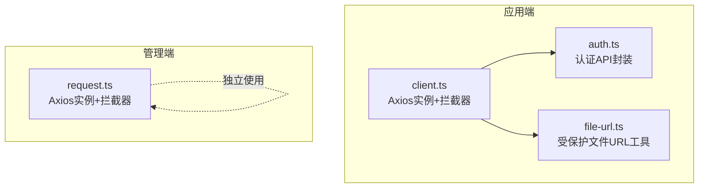
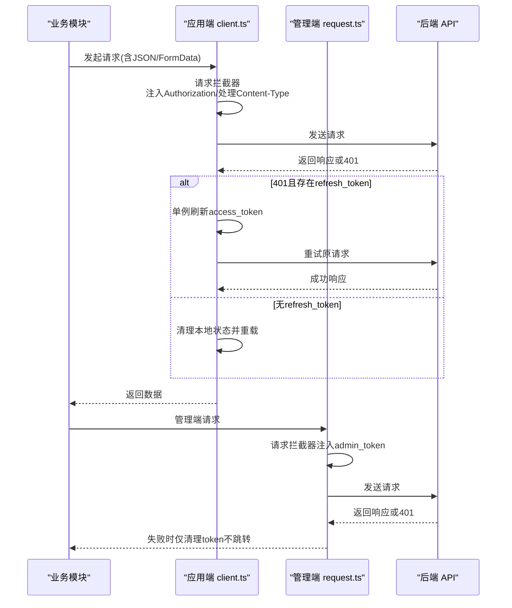
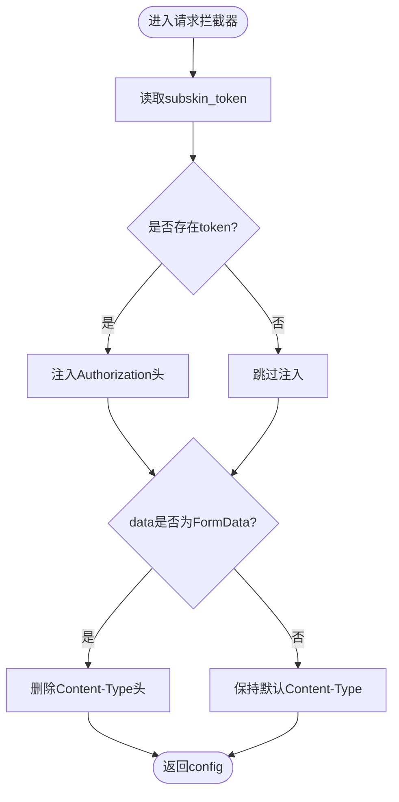
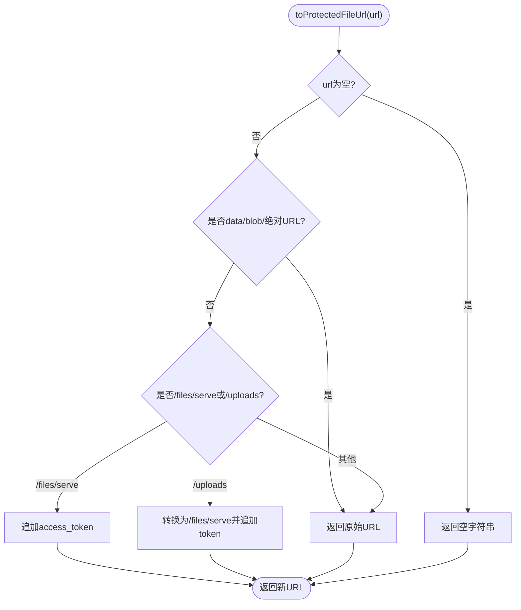
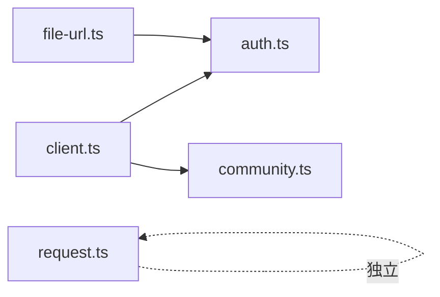

# HTTP客户端核心

<cite>
**本文引用的文件**   
- [web/app/src/api/client.ts](file://web/app/src/api/client.ts)
- [web/admin/src/api/request.ts](file://web/admin/src/api/request.ts)
- [web/app/src/api/auth.ts](file://web/app/src/api/auth.ts)
- [web/app/src/utils/file-url.ts](file://web/app/src/utils/file-url.ts)
</cite>

## 目录
1. [简介](#简介)
2. [项目结构](#项目结构)
3. [核心组件](#核心组件)
4. [架构总览](#架构总览)
5. [详细组件分析](#详细组件分析)
6. [依赖关系分析](#依赖关系分析)
7. [性能考量](#性能考量)
8. [故障排查指南](#故障排查指南)
9. [结论](#结论)
10. [附录：扩展与自定义示例](#附录扩展与自定义示例)

## 简介
本文件聚焦于前端HTTP客户端的核心实现，围绕Axios实例配置、基础URL设置、超时配置、请求头管理、请求拦截器（自动令牌注入、FormData处理、Content-Type自动检测）、响应拦截器（错误处理、状态码管理、响应数据转换）、通用配置选项、代理设置与调试工具集成等方面展开。文档同时给出可扩展的自定义实践，帮助读者在现有基础上快速扩展HTTP客户端能力。

## 项目结构
本项目包含两套独立的Axios客户端：
- 应用端客户端：位于 web/app/src/api/client.ts，负责用户侧API调用，具备完整的令牌刷新与文件上传支持。
- 管理端客户端：位于 web/admin/src/api/request.ts，面向后台管理场景，提供基础的认证与错误处理。

图表来源
- [web/app/src/api/client.ts:1-84](file://web/app/src/api/client.ts#L1-L84)
- [web/admin/src/api/request.ts:1-32](file://web/admin/src/api/request.ts#L1-L32)
- [web/app/src/api/auth.ts:1-195](file://web/app/src/api/auth.ts#L1-L195)
- [web/app/src/utils/file-url.ts:1-155](file://web/app/src/utils/file-url.ts#L1-L155)

章节来源
- [web/app/src/api/client.ts:1-84](file://web/app/src/api/client.ts#L1-L84)
- [web/admin/src/api/request.ts:1-32](file://web/admin/src/api/request.ts#L1-L32)

## 核心组件
- Axios实例配置
  - 基础URL：统一指向 /api，便于通过反向代理或CDN进行路由转发。
  - 超时：默认120秒，适配AI相关长耗时接口。
  - 默认请求头：application/json；对FormData请求自动移除该头以启用浏览器自动边界生成。
- 请求拦截器
  - 自动注入Authorization头（Bearer token）。
  - FormData自动识别并删除Content-Type，交由浏览器生成multipart/form-data及boundary。
- 响应拦截器
  - 401未授权时尝试刷新access_token；无refresh_token则清理本地状态并重载页面。
  - 并发401场景下使用单例刷新Promise去重，避免重复刷新。
- 文件访问安全
  - 短时效文件访问令牌缓存，优先用于受保护文件URL，降低泄露风险。
  - HTML内容清洗与受保护URL重写，防止XSS并确保资源可访问。

章节来源
- [web/app/src/api/client.ts:1-84](file://web/app/src/api/client.ts#L1-L84)
- [web/app/src/utils/file-url.ts:1-155](file://web/app/src/utils/file-url.ts#L1-L155)

## 架构总览
下图展示了应用端与管理端两个Axios实例的职责分工与交互关系，以及关键拦截器流程。

图表来源
- [web/app/src/api/client.ts:11-82](file://web/app/src/api/client.ts#L11-L82)
- [web/admin/src/api/request.ts:8-29](file://web/admin/src/api/request.ts#L8-L29)

## 详细组件分析

### 应用端Axios实例（client.ts）
- 实例配置
  - baseURL: /api
  - timeout: 120000ms
  - headers: Content-Type为application/json
- 请求拦截器
  - 从localStorage读取subskin_token并注入Authorization头。
  - 当data为FormData时删除Content-Type，让浏览器自动设置multipart/form-data与boundary。
- 响应拦截器
  - 捕获401，若存在refresh_token则调用刷新接口更新access_token并重试原请求。
  - 并发401时使用全局refreshPromise去重，避免多次刷新。
  - 刷新失败或无refresh_token时清理本地存储并重载页面。
- 典型用法
  - JSON请求直接post/get即可。
  - 文件上传构造FormData并传入，无需手动设置Content-Type。

图表来源
- [web/app/src/api/client.ts:11-22](file://web/app/src/api/client.ts#L11-L22)

章节来源
- [web/app/src/api/client.ts:1-84](file://web/app/src/api/client.ts#L1-L84)

### 管理端Axios实例（request.ts）
- 实例配置
  - baseURL: /api
  - timeout: 120000ms
- 请求拦截器
  - 读取admin_token并注入Authorization头。
- 响应拦截器
  - 401时清理admin_token，不自动跳转，由上层决定登录时机。

章节来源
- [web/admin/src/api/request.ts:1-32](file://web/admin/src/api/request.ts#L1-L32)

### 认证API封装（auth.ts）
- 提供登录、注册、短信/邮箱验证码、绑定凭证、密码重置、登出等接口。
- 使用应用端client.ts发起请求，部分接口采用FormData（如用户名密码登录、头像上传），配合拦截器的Content-Type自动处理。
- 提供获取短期文件访问令牌的接口，供文件URL工具使用。

章节来源
- [web/app/src/api/auth.ts:1-195](file://web/app/src/api/auth.ts#L1-L195)

### 受保护文件URL工具（file-url.ts）
- 短时效文件令牌缓存
  - 首次需要时异步获取，缓存至localStorage，并在过期前主动刷新。
- URL重写
  - 将/uploads路径转换为/api/files/serve并附加access_token参数。
  - 对HTML内容进行DOMPurify清洗，并递归替换所有src/href为受保护URL。
- 安全策略
  - 优先使用短时效文件令牌，降低泄露影响范围。
  - 若无文件令牌则回退到长期access_token，确保图片等资源正常加载。

图表来源
- [web/app/src/utils/file-url.ts:85-101](file://web/app/src/utils/file-url.ts#L85-L101)

章节来源
- [web/app/src/utils/file-url.ts:1-155](file://web/app/src/utils/file-url.ts#L1-L155)

## 依赖关系分析
- 应用端client.ts被auth.ts、community.ts等API模块引用，作为统一的HTTP入口。
- file-url.ts依赖auth.ts提供的短期文件令牌接口，形成“认证→文件访问”的链路。
- 管理端request.ts独立运行，不与应用端共享实例，避免跨域权限混淆。

图表来源
- [web/app/src/api/client.ts:1-84](file://web/app/src/api/client.ts#L1-L84)
- [web/app/src/api/auth.ts:1-195](file://web/app/src/api/auth.ts#L1-L195)
- [web/app/src/utils/file-url.ts:1-155](file://web/app/src/utils/file-url.ts#L1-L155)
- [web/admin/src/api/request.ts:1-32](file://web/admin/src/api/request.ts#L1-L32)

章节来源
- [web/app/src/api/client.ts:1-84](file://web/app/src/api/client.ts#L1-L84)
- [web/app/src/api/auth.ts:1-195](file://web/app/src/api/auth.ts#L1-L195)
- [web/app/src/utils/file-url.ts:1-155](file://web/app/src/utils/file-url.ts#L1-L155)
- [web/admin/src/api/request.ts:1-32](file://web/admin/src/api/request.ts#L1-L32)

## 性能考量
- 超时配置
  - 120秒适用于AI预处理等长耗时任务，可根据不同接口类型细化超时策略。
- 并发刷新优化
  - 单例refreshPromise避免多个401并发触发多次刷新，减少无效网络请求。
- 文件令牌缓存
  - 短时效令牌缓存与提前刷新机制，降低频繁刷新带来的开销与安全风险。
- Content-Type自动处理
  - 对FormData自动删除Content-Type，避免浏览器二次编码导致的422错误。

[本节为通用指导，不直接分析具体文件]

## 故障排查指南
- 401未授权
  - 检查localStorage中是否存在subskin_token与subskin_refresh_token。
  - 确认刷新接口可用且返回正确的access_token与可选的refresh_token。
  - 若刷新失败，系统会清理本地状态并重新加载页面。
- 文件上传失败（422）
  - 确认请求体为FormData且未手动设置Content-Type，交由浏览器自动生成boundary。
  - 检查服务端接口是否接受multipart/form-data。
- 受保护文件无法加载
  - 确认已调用ensureFileToken()或在渲染前获取短期文件令牌。
  - 检查URL是否经过toProtectedFileUrl处理，确保附加了access_token。
- 管理端401行为
  - 管理端不会自动跳转登录页，需在上层逻辑中处理未授权状态。

章节来源
- [web/app/src/api/client.ts:24-82](file://web/app/src/api/client.ts#L24-L82)
- [web/app/src/utils/file-url.ts:42-64](file://web/app/src/utils/file-url.ts#L42-L64)
- [web/admin/src/api/request.ts:19-29](file://web/admin/src/api/request.ts#L19-L29)

## 结论
本HTTP客户端核心基于Axios实现了稳定、安全、可扩展的请求基础设施。通过统一的实例配置、智能的请求拦截与健壮的响应处理，覆盖了常见的认证、文件上传、错误处理与性能优化需求。结合短期文件令牌与HTML清洗，进一步提升了安全性与用户体验。后续可在该基础上按需扩展更多拦截器与中间件，以满足复杂业务场景。

[本节为总结性内容，不直接分析具体文件]

## 附录：扩展与自定义示例
- 添加全局日志记录
  - 在请求拦截器中打印请求方法与URL，在响应拦截器中记录状态码与耗时。
- 增加重试机制
  - 针对特定状态码（如5xx）或网络错误，实现指数退避重试。
- 多租户/环境切换
  - 根据环境变量动态设置baseURL与超时，支持开发、测试、生产环境隔离。
- 自定义错误提示
  - 在响应拦截器中统一解析错误消息并展示给用户，提升交互体验。
- 代理与调试
  - 在Vite或Webpack中配置代理，将/api转发至后端服务，便于本地调试。
  - 使用浏览器开发者工具的Network面板查看请求详情与响应内容。

[本节为概念性指导，不直接分析具体文件]