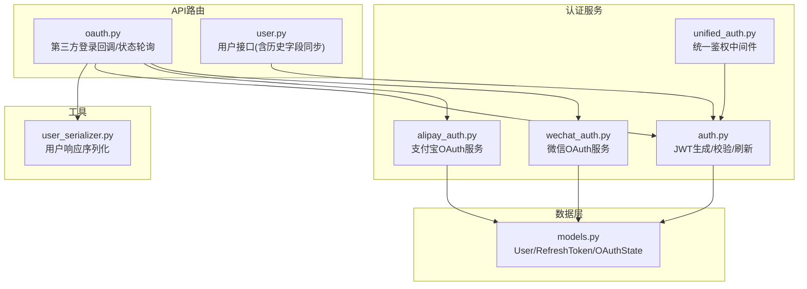
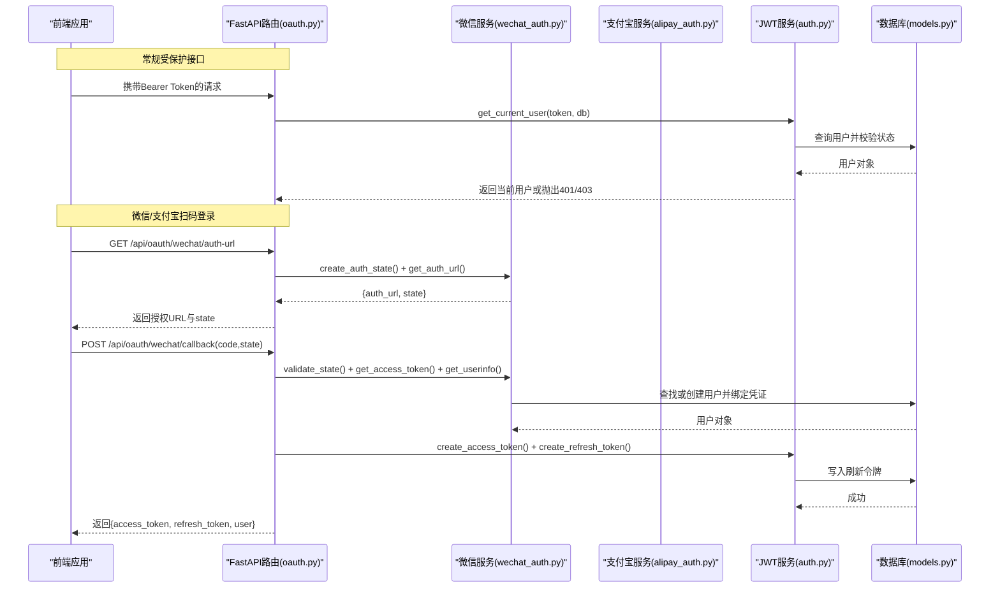
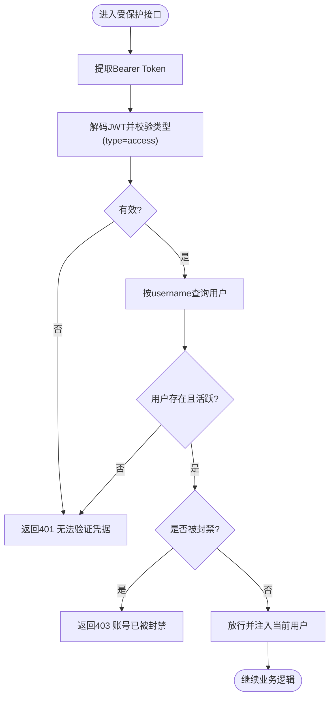
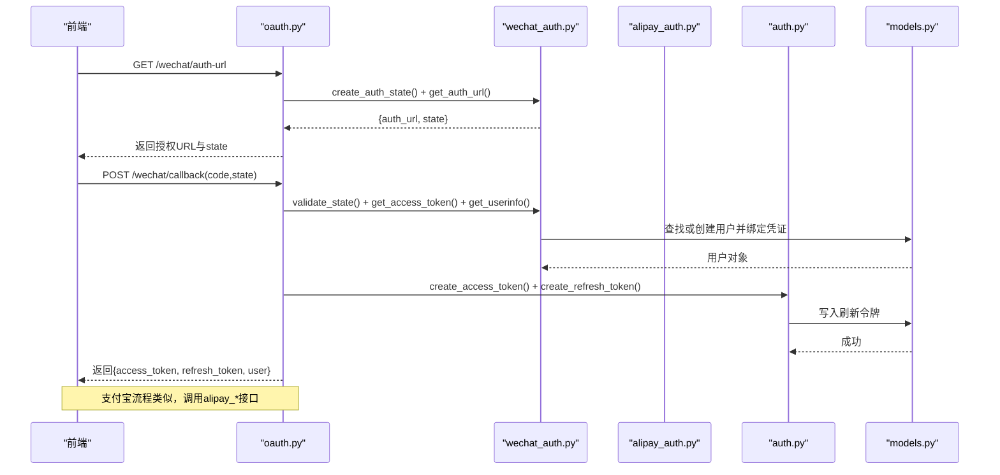
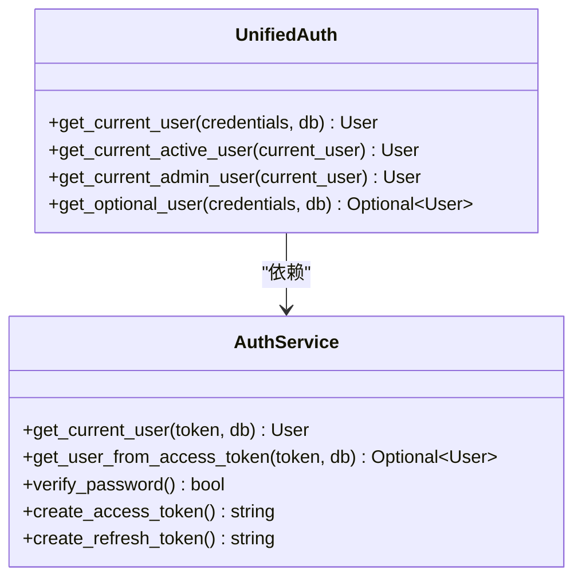
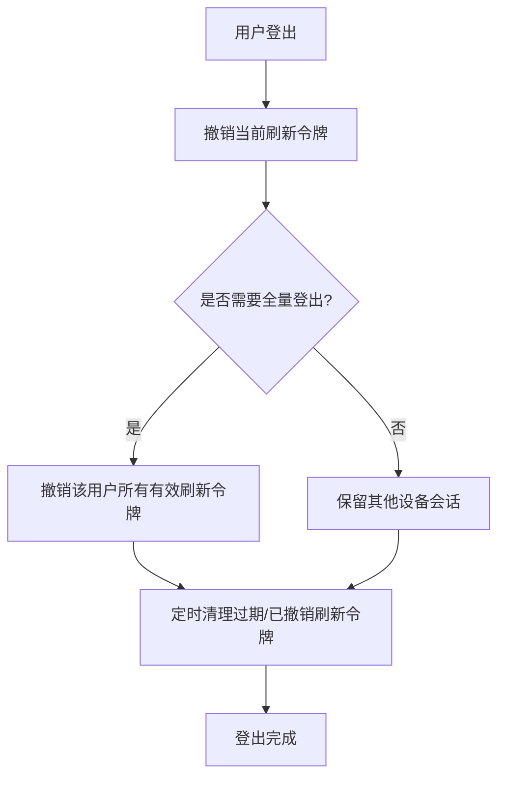
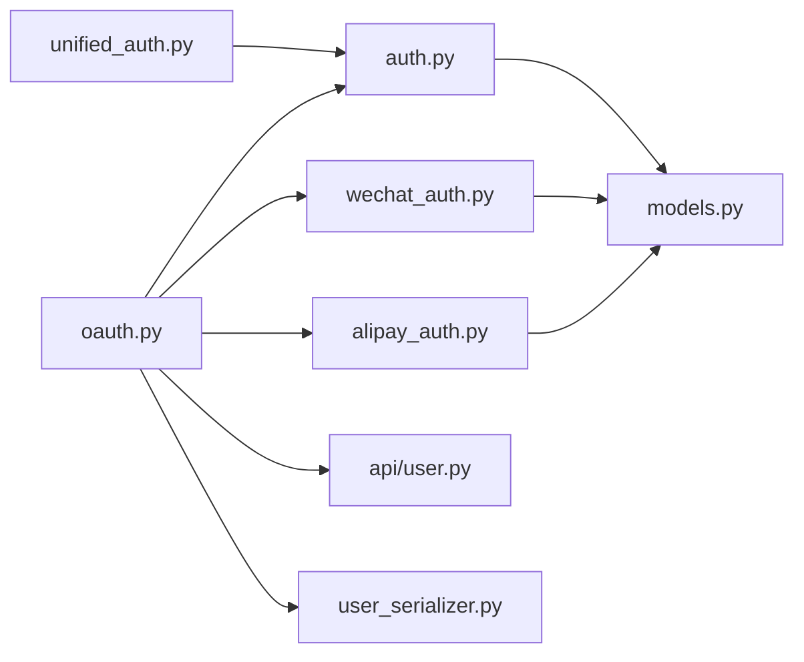

# 认证管理

<cite>
**本文引用的文件**   
- [web/backend/services/auth.py](file://web/backend/services/auth.py)
- [web/backend/services/unified_auth.py](file://web/backend/services/unified_auth.py)
- [web/backend/services/wechat_auth.py](file://web/backend/services/wechat_auth.py)
- [web/backend/services/alipay_auth.py](file://web/backend/services/alipay_auth.py)
- [web/backend/api/oauth.py](file://web/backend/api/oauth.py)
- [web/backend/database/models.py](file://web/backend/database/models.py)
- [web/backend/api/user.py](file://web/backend/api/user.py)
- [web/backend/services/user_serializer.py](file://web/backend/services/user_serializer.py)
</cite>

## 目录
1. [简介](#简介)
2. [项目结构](#项目结构)
3. [核心组件](#核心组件)
4. [架构总览](#架构总览)
5. [详细组件分析](#详细组件分析)
6. [依赖关系分析](#依赖关系分析)
7. [性能考虑](#性能考虑)
8. [故障排查指南](#故障排查指南)
9. [结论](#结论)
10. [附录](#附录)

## 简介
本文件面向认证与授权子系统，系统性阐述JWT令牌管理机制（访问令牌与刷新令牌）、OAuth2.0第三方登录集成（微信、支付宝）、用户会话管理、权限验证与登出清理流程。文档同时给出关键流程图与时序图，帮助读者快速理解并落地安全的认证流程与错误处理策略。

## 项目结构
认证相关代码主要分布在后端服务层与API层：
- 服务层：auth.py（JWT核心）、unified_auth.py（统一鉴权中间件）、wechat_auth.py（微信OAuth）、alipay_auth.py（支付宝OAuth）
- API层：oauth.py（第三方扫码登录路由）、user.py（用户相关接口，含历史字段同步等）
- 数据模型：database/models.py（User、RefreshToken、OAuthState等）
- 序列化：services/user_serializer.py（用户响应序列化）

**图表来源** 
- [web/backend/services/auth.py](file://web/backend/services/auth.py)
- [web/backend/services/unified_auth.py](file://web/backend/services/unified_auth.py)
- [web/backend/services/wechat_auth.py](file://web/backend/services/wechat_auth.py)
- [web/backend/services/alipay_auth.py](file://web/backend/services/alipay_auth.py)
- [web/backend/api/oauth.py](file://web/backend/api/oauth.py)
- [web/backend/database/models.py](file://web/backend/database/models.py)
- [web/backend/services/user_serializer.py](file://web/backend/services/user_serializer.py)

**章节来源**
- [web/backend/services/auth.py](file://web/backend/services/auth.py)
- [web/backend/services/unified_auth.py](file://web/backend/services/unified_auth.py)
- [web/backend/services/wechat_auth.py](file://web/backend/services/wechat_auth.py)
- [web/backend/services/alipay_auth.py](file://web/backend/services/alipay_auth.py)
- [web/backend/api/oauth.py](file://web/backend/api/oauth.py)
- [web/backend/database/models.py](file://web/backend/database/models.py)
- [web/backend/services/user_serializer.py](file://web/backend/services/user_serializer.py)

## 核心组件
- JWT令牌服务（auth.py）
  - 访问令牌：支持普通用户与管理员不同过期时间；包含type、is_admin等声明
  - 刷新令牌：持久化至数据库，支持撤销与批量撤销
  - 文件专用短时效令牌：仅用于文件读取，限制作用域
  - 当前用户解析：从Access Token解析用户，并检查账号状态（停用/封禁）
  - WebSocket鉴权：从查询参数解析JWT并校验用户有效性
  - 刷新令牌清理：定时清理过期或已撤销的刷新令牌，防止表膨胀
- 统一鉴权中间件（unified_auth.py）
  - 基于HTTPBearer提取Bearer Token，委托auth.py进行校验
  - 提供“必须登录”、“可选登录”、“管理员”等常用依赖
- 微信OAuth服务（wechat_auth.py）
  - 生成授权URL、创建state、校验state、换取access_token、获取用户信息
  - 根据unionid/openid查找或创建用户，绑定凭证
- 支付宝OAuth服务（alipay_auth.py）
  - 生成授权URL、创建state、校验state、换取token、获取用户信息
  - 根据alipay_user_id查找或创建用户，绑定凭证
- 第三方登录API（oauth.py）
  - 微信/支付宝授权URL获取、回调处理、状态轮询
  - 登录成功后返回access_token与refresh_token，并序列化用户信息

**章节来源**
- [web/backend/services/auth.py](file://web/backend/services/auth.py)
- [web/backend/services/unified_auth.py](file://web/backend/services/unified_auth.py)
- [web/backend/services/wechat_auth.py](file://web/backend/services/wechat_auth.py)
- [web/backend/services/alipay_auth.py](file://web/backend/services/alipay_auth.py)
- [web/backend/api/oauth.py](file://web/backend/api/oauth.py)
- [web/backend/services/user_serializer.py](file://web/backend/services/user_serializer.py)

## 架构总览
下图展示从前端发起请求到后端鉴权的整体流程，以及第三方登录的交互时序。

**图表来源** 
- [web/backend/api/oauth.py](file://web/backend/api/oauth.py)
- [web/backend/services/wechat_auth.py](file://web/backend/services/wechat_auth.py)
- [web/backend/services/alipay_auth.py](file://web/backend/services/alipay_auth.py)
- [web/backend/services/auth.py](file://web/backend/services/auth.py)
- [web/backend/database/models.py](file://web/backend/database/models.py)

## 详细组件分析

### JWT令牌管理与存储策略
- 访问令牌（Access Token）
  - 由auth.py的create_access_token生成，包含sub、exp、type、is_admin等声明
  - 普通用户默认过期时间较长（可通过环境变量配置），管理员使用更长过期时间
  - 文件专用短时效令牌：type="file"且scope="files"，仅允许文件读取端点接受
- 刷新令牌（Refresh Token）
  - 由create_refresh_token生成，持久化到RefreshToken表，记录user_id与expired_at
  - verify_refresh_token校验未撤销且未过期的刷新令牌，返回对应用户
  - revoke_refresh_token与revoke_all_user_tokens支持单条与批量撤销
  - cleanup_expired_refresh_tokens定期清理过期或已撤销的刷新令牌
- 当前用户解析与权限控制
  - get_current_user_optional/get_required_user分别实现可选与强制登录
  - 对被封禁用户返回403并附带封禁原因，便于前端提示
  - WebSocket鉴权verify_token_ws从查询参数解析JWT并校验用户有效性

**图表来源** 
- [web/backend/services/auth.py](file://web/backend/services/auth.py)

**章节来源**
- [web/backend/services/auth.py](file://web/backend/services/auth.py)

### OAuth2.0集成：微信与支付宝
- 微信登录流程
  - 前端调用GET /api/oauth/wechat/auth-url获取授权URL与state
  - 用户完成扫码后回调POST /api/oauth/wechat/callback(code,state)
  - 服务端校验state、换取access_token、拉取用户信息、查找或创建用户、绑定凭证
  - 成功后返回access_token与refresh_token，并支持状态轮询接口
- 支付宝登录流程
  - 前端调用GET /api/oauth/alipay/auth-url获取授权URL与state
  - 用户完成扫码后回调POST /api/oauth/alipay/callback(code,state)
  - 服务端校验state、换取token、拉取用户信息、查找或创建用户、绑定凭证
  - 成功后返回access_token与refresh_token，并支持状态轮询接口

**图表来源** 
- [web/backend/api/oauth.py](file://web/backend/api/oauth.py)
- [web/backend/services/wechat_auth.py](file://web/backend/services/wechat_auth.py)
- [web/backend/services/alipay_auth.py](file://web/backend/services/alipay_auth.py)
- [web/backend/services/auth.py](file://web/backend/services/auth.py)
- [web/backend/database/models.py](file://web/backend/database/models.py)

**章节来源**
- [web/backend/api/oauth.py](file://web/backend/api/oauth.py)
- [web/backend/services/wechat_auth.py](file://web/backend/services/wechat_auth.py)
- [web/backend/services/alipay_auth.py](file://web/backend/services/alipay_auth.py)
- [web/backend/services/auth.py](file://web/backend/services/auth.py)

### 统一鉴权中间件与权限验证
- unified_auth.py提供统一的Bearer校验入口，内部委托auth.py的get_current_user_jwt
- 提供以下依赖：
  - get_current_user：必须登录，失败返回401
  - get_current_active_user：必须登录且账号激活，否则403
  - get_current_admin_user：必须登录且为管理员，否则403
  - get_optional_user：可选登录，失败视为匿名

**图表来源** 
- [web/backend/services/unified_auth.py](file://web/backend/services/unified_auth.py)
- [web/backend/services/auth.py](file://web/backend/services/auth.py)

**章节来源**
- [web/backend/services/unified_auth.py](file://web/backend/services/unified_auth.py)
- [web/backend/services/auth.py](file://web/backend/services/auth.py)

### 用户会话管理与登出清理
- 会话管理
  - 访问令牌无状态，客户端自行保存（建议HttpOnly Cookie或安全存储）
  - 刷新令牌有状态，存储在RefreshToken表，支持撤销与批量撤销
- 登出清理
  - 调用revoke_refresh_token撤销单个刷新令牌
  - 调用revoke_all_user_tokens撤销某用户所有有效刷新令牌
  - 定时任务cleanup_expired_refresh_tokens清理过期或已撤销的刷新令牌，避免表膨胀

**图表来源** 
- [web/backend/services/auth.py](file://web/backend/services/auth.py)

**章节来源**
- [web/backend/services/auth.py](file://web/backend/services/auth.py)

## 依赖关系分析
- auth.py依赖：
  - database.models.User、RefreshToken
  - fastapi.security.OAuth2PasswordBearer
  - jose.jwt、passlib CryptContext
- unified_auth.py依赖：
  - auth.get_current_user_jwt
  - database.database.get_db
- wechat_auth.py与alipay_auth.py依赖：
  - database.models.User、OAuthState
  - services.credential（bind_credential、find_user_by_credential）
  - utils.uid.generate_uid
- oauth.py依赖：
  - wechat_auth.py、alipay_auth.py、auth.py
  - api.user._sync_legacy_user_fields
  - services.user_serializer.get_user_response

**图表来源** 
- [web/backend/services/auth.py](file://web/backend/services/auth.py)
- [web/backend/services/unified_auth.py](file://web/backend/services/unified_auth.py)
- [web/backend/services/wechat_auth.py](file://web/backend/services/wechat_auth.py)
- [web/backend/services/alipay_auth.py](file://web/backend/services/alipay_auth.py)
- [web/backend/api/oauth.py](file://web/backend/api/oauth.py)
- [web/backend/database/models.py](file://web/backend/database/models.py)
- [web/backend/services/user_serializer.py](file://web/backend/services/user_serializer.py)

**章节来源**
- [web/backend/services/auth.py](file://web/backend/services/auth.py)
- [web/backend/services/unified_auth.py](file://web/backend/services/unified_auth.py)
- [web/backend/services/wechat_auth.py](file://web/backend/services/wechat_auth.py)
- [web/backend/services/alipay_auth.py](file://web/backend/services/alipay_auth.py)
- [web/backend/api/oauth.py](file://web/backend/api/oauth.py)
- [web/backend/database/models.py](file://web/backend/database/models.py)
- [web/backend/services/user_serializer.py](file://web/backend/services/user_serializer.py)

## 性能考虑
- 访问令牌无状态，校验开销低；刷新令牌需数据库查询，建议：
  - 合理设置过期时间，减少频繁刷新
  - 使用索引优化RefreshToken查询（token、user_id、expired_at）
- 并发请求去重与重试
  - 前端应在刷新令牌时进行去重（同一时刻仅一个刷新请求）
  - 失败重试应限制次数，避免雪崩
- 文件专用短时效令牌降低泄露风险，缩短暴露窗口
- 定时清理刷新令牌，避免数据库膨胀影响查询性能

[本节为通用指导，不直接分析具体文件]

## 故障排查指南
- 401未授权
  - 检查请求是否携带正确的Bearer Token
  - 确认Token未过期且type=access
  - 若为WebSocket连接，检查查询参数中的token是否正确传递
- 403禁止访问
  - 账号被封禁会返回403并附带封禁原因，前端应友好提示
  - 非管理员访问管理员接口将返回403
- 第三方登录失败
  - 微信/支付宝回调中state无效或过期会导致400错误
  - 网络异常或服务不可用将返回500错误，建议前端重试或提示稍后重试
- 刷新令牌问题
  - 刷新令牌被撤销或过期将无法刷新，需重新登录
  - 批量撤销后，所有设备均需重新登录

**章节来源**
- [web/backend/services/auth.py](file://web/backend/services/auth.py)
- [web/backend/api/oauth.py](file://web/backend/api/oauth.py)

## 结论
本认证体系以JWT为核心，结合有状态的刷新令牌机制，实现了安全、可扩展的认证与授权能力。通过统一的鉴权中间件简化了权限控制，微信与支付宝OAuth提供了便捷的第三方登录方式。配合完善的错误处理与清理机制，确保了系统的健壮性与可维护性。建议在生产环境中严格配置环境变量、启用HTTPS、合理设置令牌过期时间，并在前端实现安全的令牌存储与刷新去重逻辑。

[本节为总结性内容，不直接分析具体文件]

## 附录
- 环境变量建议
  - SECRET_KEY：JWT签名密钥（必须设置）
  - ALGORITHM：JWT算法（默认HS256）
  - ACCESS_TOKEN_EXPIRE_MINUTES：访问令牌过期时间（分钟）
  - REFRESH_TOKEN_EXPIRE_DAYS：刷新令牌过期时间（天）
  - ADMIN_TOKEN_EXPIRE_DAYS：管理员令牌过期时间（天）
  - FILE_TOKEN_EXPIRE_MINUTES：文件专用令牌过期时间（分钟）
  - WECHAT_APP_ID、WECHAT_APP_SECRET、WECHAT_REDIRECT_URI：微信配置
  - ALIPAY_APP_ID、ALIPAY_PRIVATE_KEY、ALIPAY_PUBLIC_KEY、ALIPAY_REDIRECT_URI：支付宝配置

[本节为配置参考，不直接分析具体文件]