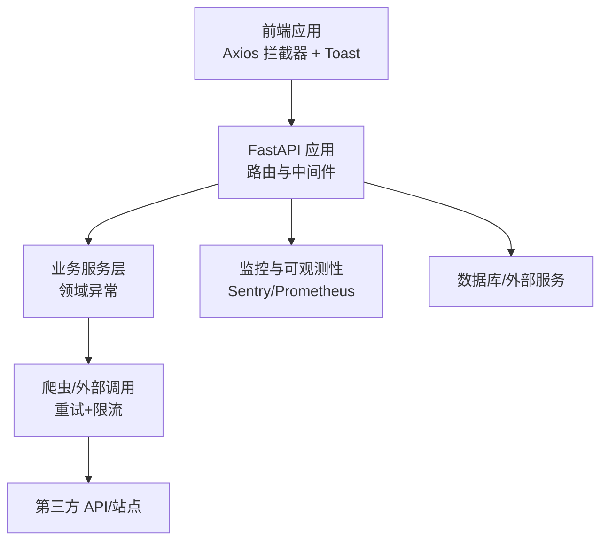
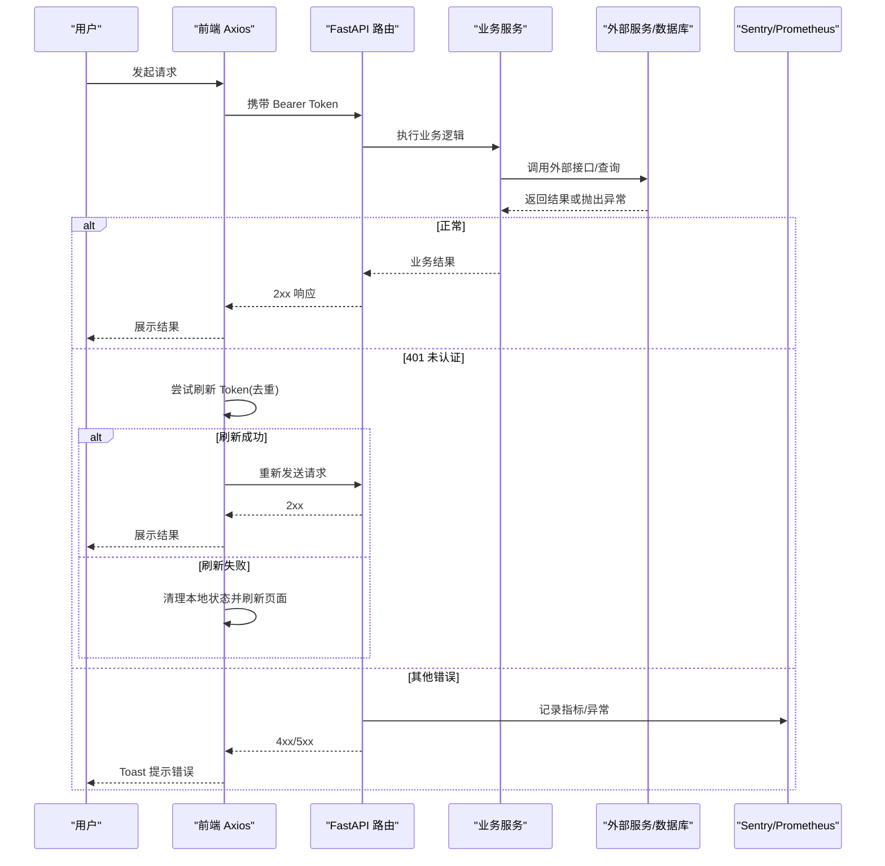
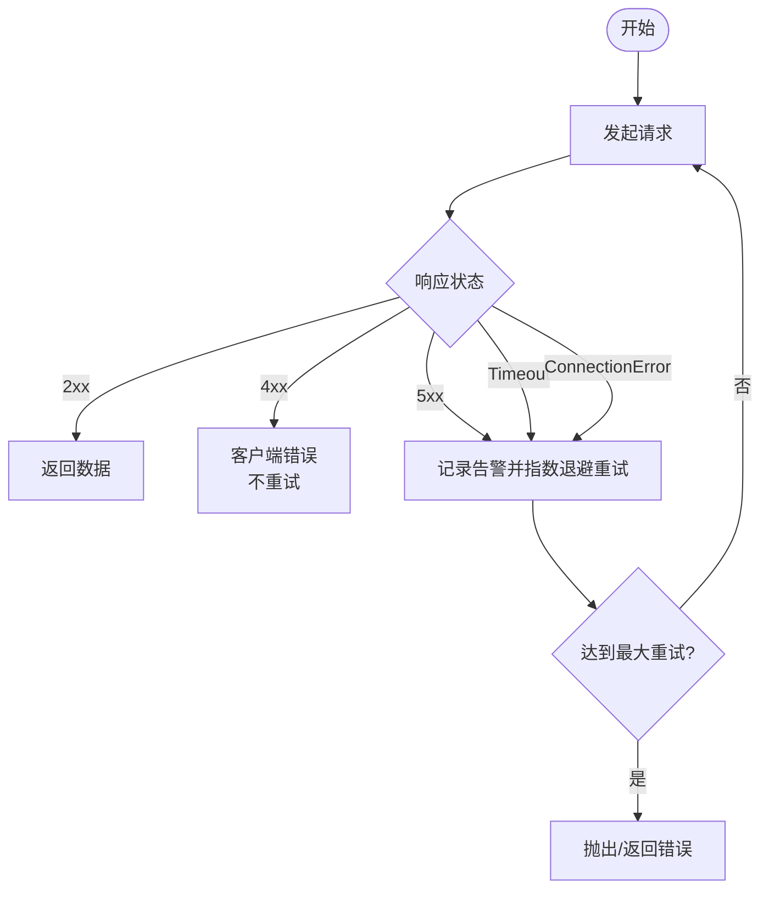
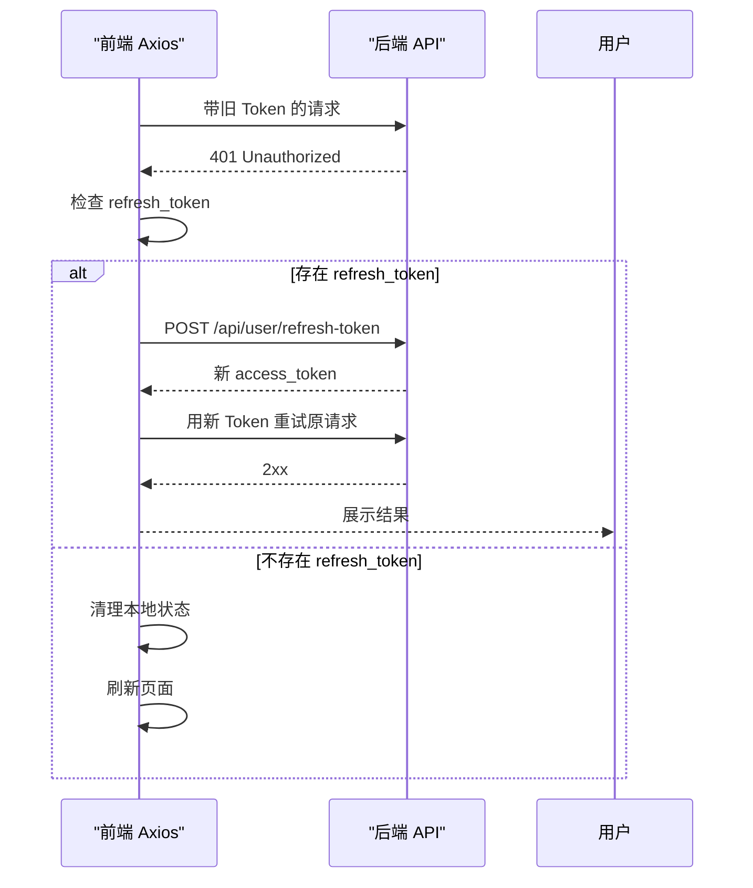
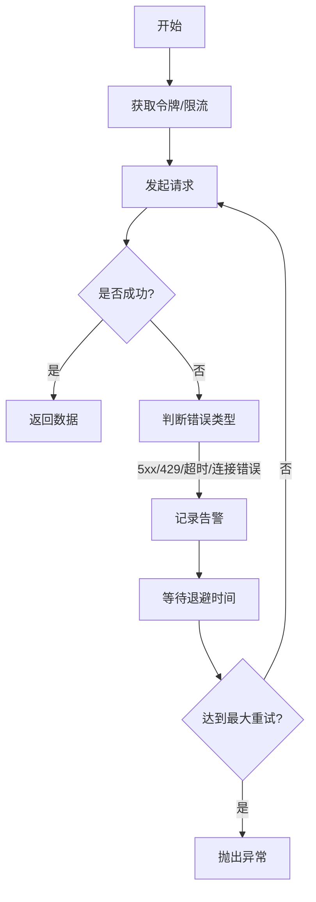
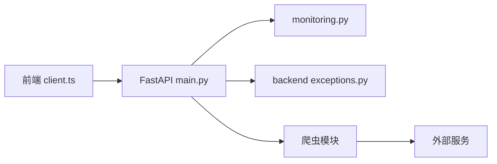

# 错误处理机制

<cite>
**本文引用的文件**
- [web/backend/app/main.py](file://web/backend/app/main.py)
- [web/backend/services/monitoring.py](file://web/backend/services/monitoring.py)
- [web/backend/api/admin_general.py](file://web/backend/api/admin_general.py)
- [web/backend/api/user.py](file://web/backend/api/user.py)
- [web/backend/api/image_label.py](file://web/backend/api/image_label.py)
- [web/backend/api/encyclopedia.py](file://web/backend/api/encyclopedia.py)
- [src/exceptions.py](file://src/exceptions.py)
- [web/backend/exceptions.py](file://web/backend/exceptions.py)
- [src/utils/logger.py](file://src/utils/logger.py)
- [src/settings/logging.py](file://src/settings/logging.py)
- [src/crawlers/semantic_scholar_crawler.py](file://src/crawlers/semantic_scholar_crawler.py)
- [src/crawlers/clinical_trials_crawler.py](file://src/crawlers/clinical_trials_crawler.py)
- [src/crawlers/pubmed_fulltext.py](file://src/crawlers/pubmed_fulltext.py)
- [web/app/src/api/client.ts](file://web/app/src/api/client.ts)
- [web/app/src/composables/useToast.ts](file://web/app/src/composables/useToast.ts)
</cite>

## 目录
1. [简介](#简介)
2. [项目结构](#项目结构)
3. [核心组件](#核心组件)
4. [架构总览](#架构总览)
5. [详细组件分析](#详细组件分析)
6. [依赖关系分析](#依赖关系分析)
7. [性能考量](#性能考量)
8. [故障排查指南](#故障排查指南)
9. [结论](#结论)
10. [附录](#附录)

## 简介
本文件系统化梳理 SubSkin 项目的错误处理机制，覆盖网络异常分类与处理策略（连接超时、服务器错误、网络中断等）、用户友好的错误提示系统（本地化文案、重试建议、降级方案）、日志记录与可观测性（堆栈跟踪、性能指标、调试信息收集），以及错误恢复策略（自动重试、缓存回退、用户引导）。文档同时提供代码级流程图与时序图，帮助读者快速理解并落地健壮的错误处理流程。

## 项目结构
后端以 FastAPI 为入口，集中注册路由与监控中间件；爬虫模块统一封装重试与限流；前端通过 Axios 拦截器实现统一的认证刷新与错误传播，配合 Toast 组件进行用户提示。

图表来源
- [web/backend/app/main.py:264-327](file://web/backend/app/main.py#L264-L327)
- [web/backend/services/monitoring.py:28-63](file://web/backend/services/monitoring.py#L28-L63)
- [web/app/src/api/client.ts:1-84](file://web/app/src/api/client.ts#L1-L84)

章节来源
- [web/backend/app/main.py:264-327](file://web/backend/app/main.py#L264-L327)
- [web/backend/services/monitoring.py:28-63](file://web/backend/services/monitoring.py#L28-L63)
- [web/app/src/api/client.ts:1-84](file://web/app/src/api/client.ts#L1-L84)

## 核心组件
- 自定义异常体系
  - 爬虫侧：CrawlerError 及其子类 APIError、RateLimitError、CacheError，用于区分请求失败、限速、缓存异常等。
  - 业务侧：SubSkinException 及凭证相关细分异常，便于 API 层转换为 HTTP 响应。
- 日志与可观测性
  - 统一日志工具 get_logger，支持控制台输出与按天轮转的文件输出。
  - Sentry 集成：初始化、敏感数据过滤、手动捕获异常上报。
  - Prometheus 中间件：采集请求总量、耗时、并发数等指标。
- 前端错误处理
  - Axios 拦截器：自动附加 Token、401 时基于 refresh token 去重刷新、失败后清理状态并重载。
  - Toast 组件：成功/警告/错误/信息四类提示，支持定时消失与移除。

章节来源
- [src/exceptions.py:13-38](file://src/exceptions.py#L13-L38)
- [web/backend/exceptions.py:4-19](file://web/backend/exceptions.py#L4-L19)
- [src/utils/logger.py:19-80](file://src/utils/logger.py#L19-L80)
- [src/settings/logging.py:14-57](file://src/settings/logging.py#L14-L57)
- [web/backend/services/monitoring.py:28-90](file://web/backend/services/monitoring.py#L28-L90)
- [web/app/src/api/client.ts:11-80](file://web/app/src/api/client.ts#L11-L80)
- [web/app/src/composables/useToast.ts:12-30](file://web/app/src/composables/useToast.ts#L12-L30)

## 架构总览
下图展示一次典型 API 请求从前端到后端再到外部服务的完整链路，以及错误在各层的处理与上报路径。

图表来源
- [web/app/src/api/client.ts:44-80](file://web/app/src/api/client.ts#L44-L80)
- [web/backend/app/main.py:321-327](file://web/backend/app/main.py#L321-L327)
- [web/backend/services/monitoring.py:28-90](file://web/backend/services/monitoring.py#L28-L90)

## 详细组件分析

### 网络错误分类与处理策略
- 连接超时
  - 爬虫端对 requests.Timeout 进行捕获并记录告警，结合指数退避重试。
  - 管理接口在调用系统命令时设置超时，超时则返回 504。
- 服务器错误（5xx）
  - 爬虫端对 5xx 进行重试；非 5xx 的 HTTPError 直接上抛。
  - 临床实验爬虫将 5xx 包装为 APIError 并附带状态码，供上层重试策略识别。
- 网络中断/连接错误
  - 捕获 ConnectionError 并记录告警，进入重试循环。
- 速率限制（429）
  - 客户端侧通过 RateLimiter 控制请求频率；服务端在特定场景下返回 429，触发客户端重试与退避。

图表来源
- [src/crawlers/semantic_scholar_crawler.py:114-153](file://src/crawlers/semantic_scholar_crawler.py#L114-L153)
- [src/crawlers/clinical_trials_crawler.py:124-163](file://src/crawlers/clinical_trials_crawler.py#L124-L163)
- [web/backend/api/admin_general.py:173-189](file://web/backend/api/admin_general.py#L173-L189)

章节来源
- [src/crawlers/semantic_scholar_crawler.py:114-153](file://src/crawlers/semantic_scholar_crawler.py#L114-L153)
- [src/crawlers/clinical_trials_crawler.py:124-163](file://src/crawlers/clinical_trials_crawler.py#L124-L163)
- [web/backend/api/admin_general.py:173-189](file://web/backend/api/admin_general.py#L173-L189)

### 用户友好的错误提示系统
- 前端统一拦截
  - 401 时自动刷新 Token，若刷新失败则清理本地状态并刷新页面，避免“假死”体验。
  - 上传表单自动调整 Content-Type，避免因默认头导致 422。
- 用户提示
  - 使用 Toast 组件显示 success/warning/error/info 消息，支持时长与移除。
- 后端错误文案
  - 针对常见校验失败（如图片大小、必填字段）返回明确的中文 detail，便于前端直出或二次翻译。
- 降级与引导
  - 当外部服务不可用时，可在前端提供“重试”按钮或切换到离线/缓存视图（由业务决定）。

章节来源
- [web/app/src/api/client.ts:11-80](file://web/app/src/api/client.ts#L11-L80)
- [web/app/src/composables/useToast.ts:12-30](file://web/app/src/composables/useToast.ts#L12-L30)
- [web/backend/api/user.py:339-379](file://web/backend/api/user.py#L339-L379)

### 日志记录与可观测性
- 日志
  - 统一 logger 工具支持控制台与按天轮转的文件输出，便于问题回溯。
  - 配置化日志级别，便于不同环境切换。
- 错误追踪
  - Sentry 初始化时注入 FastAPI/Starlette/SQLAlchemy 集成，自动捕获异常；before_send 过滤敏感头。
  - 提供 capture_exception 以便在关键路径手动上报上下文。
- 性能监控
  - Prometheus 中间件采集 http_requests_total、http_request_duration_seconds、http_requests_in_progress 等指标，便于容量规划与瓶颈定位。

章节来源
- [src/utils/logger.py:19-80](file://src/utils/logger.py#L19-L80)
- [src/settings/logging.py:14-57](file://src/settings/logging.py#L14-L57)
- [web/backend/services/monitoring.py:28-90](file://web/backend/services/monitoring.py#L28-L90)
- [web/backend/app/main.py:321-327](file://web/backend/app/main.py#L321-L327)

### 错误恢复策略
- 自动重试
  - 爬虫层对 5xx、429、超时、连接错误采用指数退避重试，并在达到最大次数后抛出异常。
  - 测试用例验证了 429、超时、连接错误均能触发重试。
- 缓存回退
  - 爬虫具备缓存键生成与 TTL 机制，可在失败时优先返回缓存（具体命中逻辑由上层调用方决定）。
- 用户引导
  - 前端在 401 时自动刷新 Token，失败则引导重新登录；上传失败时可通过 UI 提示重试。

章节来源
- [src/crawlers/clinical_trials_crawler.py:124-163](file://src/crawlers/clinical_trials_crawler.py#L124-L163)
- [tests/test_translator.py:165-226](file://tests/test_translator.py#L165-L226)
- [web/app/src/api/client.ts:44-80](file://web/app/src/api/client.ts#L44-L80)

### 关键流程时序图

#### 前端 401 自动刷新流程

图表来源
- [web/app/src/api/client.ts:24-80](file://web/app/src/api/client.ts#L24-L80)

#### 爬虫指数退避重试流程

图表来源
- [src/crawlers/semantic_scholar_crawler.py:114-153](file://src/crawlers/semantic_scholar_crawler.py#L114-L153)
- [src/crawlers/clinical_trials_crawler.py:124-163](file://src/crawlers/clinical_trials_crawler.py#L124-L163)

## 依赖关系分析
- 前端依赖
  - Axios 拦截器依赖本地存储的 token/refresh_token，依赖后端 /api/user/refresh-token。
  - Toast 组件独立于网络层，仅负责 UI 提示。
- 后端依赖
  - FastAPI 应用集中注册路由与监控中间件；业务路由抛出 HTTPException 或领域异常。
  - 监控模块依赖环境变量启用 Sentry/Prometheus。
- 爬虫依赖
  - 依赖 requests、RateLimiter、Cache，统一封装重试与限流。

图表来源
- [web/app/src/api/client.ts:1-84](file://web/app/src/api/client.ts#L1-L84)
- [web/backend/app/main.py:264-327](file://web/backend/app/main.py#L264-L327)
- [web/backend/services/monitoring.py:28-117](file://web/backend/services/monitoring.py#L28-L117)
- [web/backend/exceptions.py:4-19](file://web/backend/exceptions.py#L4-L19)
- [src/crawlers/semantic_scholar_crawler.py:114-153](file://src/crawlers/semantic_scholar_crawler.py#L114-L153)

章节来源
- [web/app/src/api/client.ts:1-84](file://web/app/src/api/client.ts#L1-L84)
- [web/backend/app/main.py:264-327](file://web/backend/app/main.py#L264-L327)
- [web/backend/services/monitoring.py:28-117](file://web/backend/services/monitoring.py#L28-L117)
- [web/backend/exceptions.py:4-19](file://web/backend/exceptions.py#L4-L19)
- [src/crawlers/semantic_scholar_crawler.py:114-153](file://src/crawlers/semantic_scholar_crawler.py#L114-L153)

## 性能考量
- 重试与退避
  - 指数退避避免雪崩，降低瞬时压力；合理设置最大重试次数与初始退避时间。
- 限流
  - 使用 RateLimiter 控制请求速率，防止触发 429。
- 监控
  - 通过 Prometheus 观察请求耗时与并发，定位慢接口；Sentry 捕获异常堆栈，辅助快速定位。
- 前端超时
  - Axios 设置较长超时以适应 AI 任务（如 VLM/SAM），避免误判超时。

[本节为通用指导，无需引用具体文件]

## 故障排查指南
- 常见问题定位
  - 401 频繁出现：检查 refresh_token 是否存在且有效；确认前端拦截器是否正确去重刷新。
  - 504 超时：检查外部命令或下游服务响应时间；适当增大超时或优化下游。
  - 429 限速：检查 RateLimiter 配置与上游限流策略；必要时增加退避时间。
  - 上传失败：确认 FormData 的 Content-Type 未被覆盖；检查文件大小限制。
- 日志与指标
  - 查看应用日志与轮转文件，定位异常堆栈。
  - 通过 Prometheus 指标观察错误率与延迟变化。
  - 使用 Sentry 事件查看异常上下文与过滤后的敏感信息。

章节来源
- [web/app/src/api/client.ts:44-80](file://web/app/src/api/client.ts#L44-L80)
- [web/backend/api/admin_general.py:173-189](file://web/backend/api/admin_general.py#L173-L189)
- [src/utils/logger.py:19-80](file://src/utils/logger.py#L19-L80)
- [web/backend/services/monitoring.py:28-117](file://web/backend/services/monitoring.py#L28-L117)

## 结论
本项目构建了前后端协同的错误处理体系：前端通过 Axios 拦截器统一处理认证与错误提示，后端通过 FastAPI 路由与领域异常规范错误响应，并结合 Sentry/Prometheus 实现可观测性；爬虫层提供稳健的重试与限流机制。整体设计兼顾用户体验与系统稳定性，建议在新增功能时遵循相同模式，确保一致性与可维护性。

[本节为总结，无需引用具体文件]

## 附录
- 参考实现路径
  - 前端 401 刷新与错误传播：[web/app/src/api/client.ts:24-80](file://web/app/src/api/client.ts#L24-L80)
  - 用户提示组件：[web/app/src/composables/useToast.ts:12-30](file://web/app/src/composables/useToast.ts#L12-L30)
  - 爬虫重试与限流：[src/crawlers/clinical_trials_crawler.py:124-163](file://src/crawlers/clinical_trials_crawler.py#L124-L163)
  - 监控与上报：[web/backend/services/monitoring.py:28-117](file://web/backend/services/monitoring.py#L28-L117)
  - 日志工具：[src/utils/logger.py:19-80](file://src/utils/logger.py#L19-L80)

[本节为索引，无需额外分析]