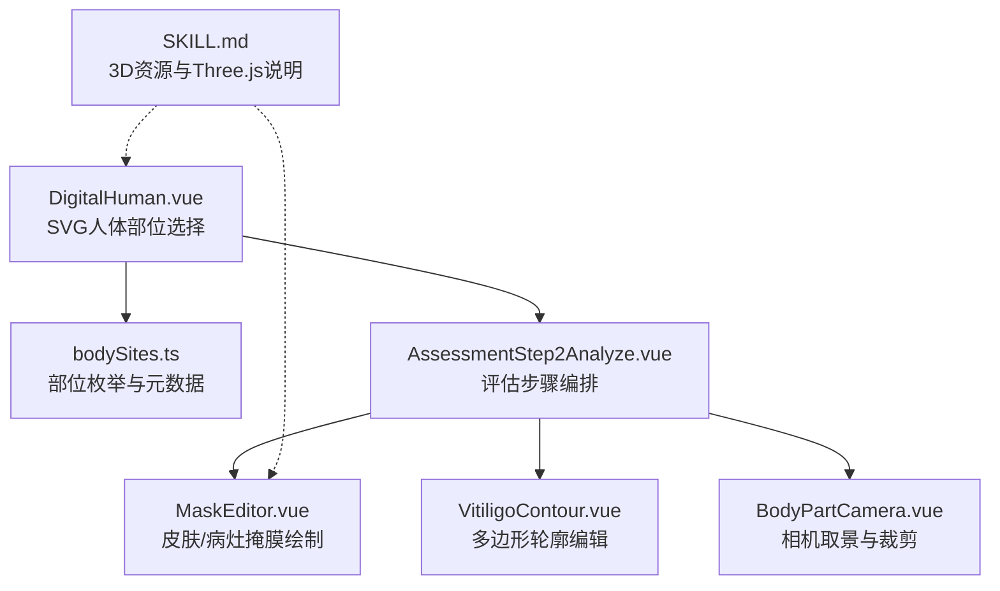
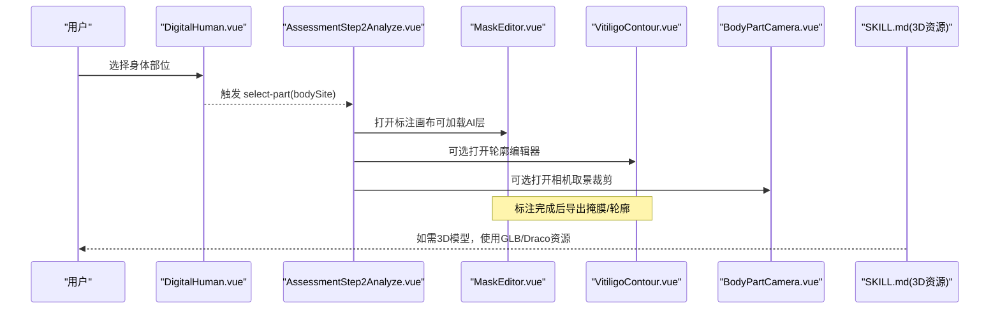
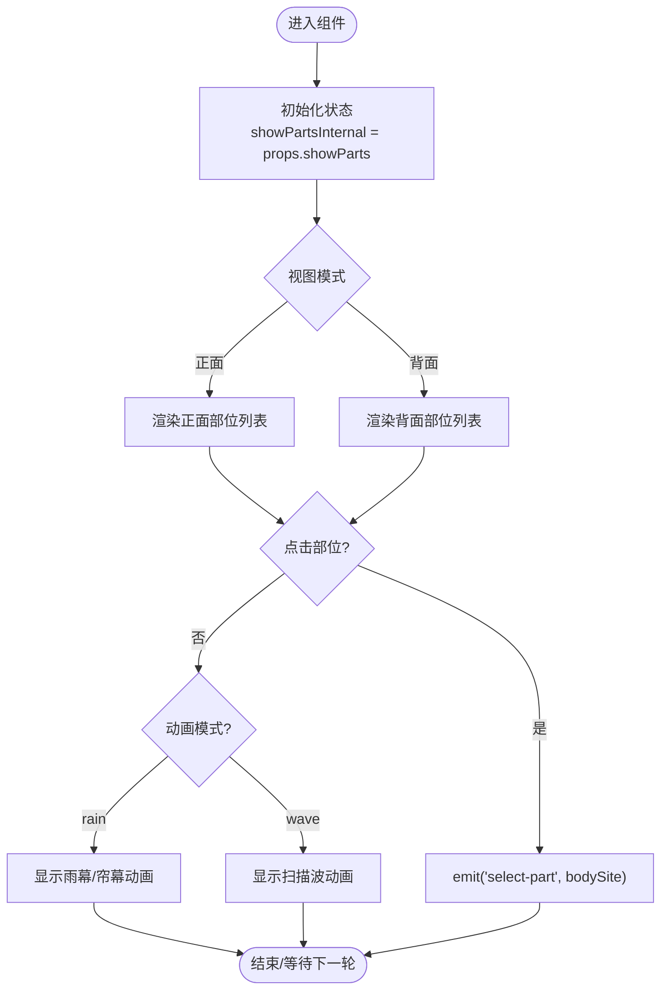
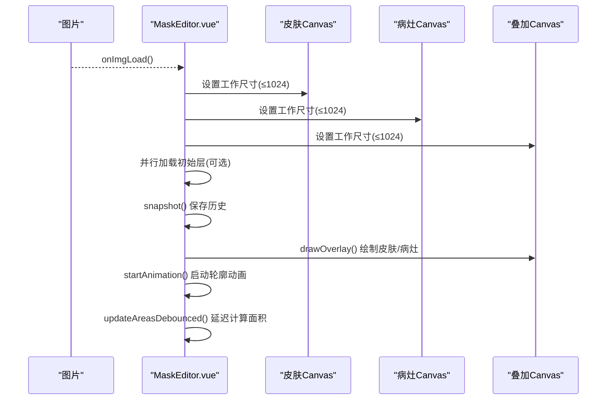
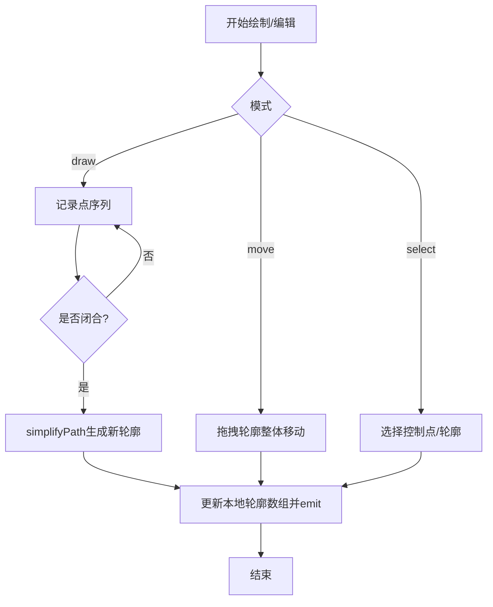
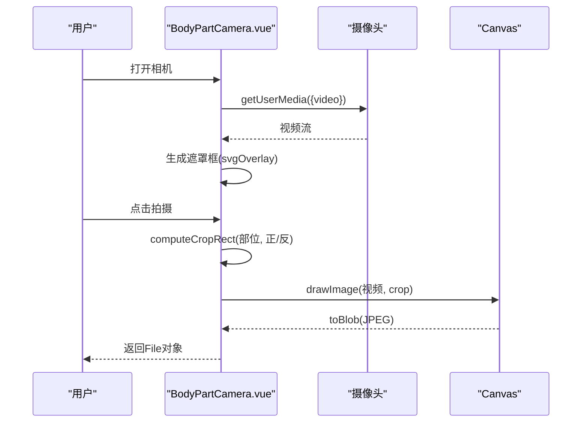
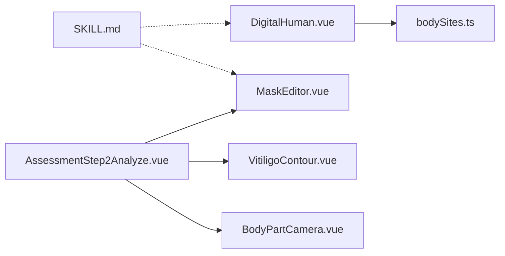

# 3D人体模型展示

<cite>
**本文引用的文件**
- [DigitalHuman.vue](file://web/app/src/components/tracker/DigitalHuman.vue)
- [bodySites.ts](file://web/app/src/constants/bodySites.ts)
- [MaskEditor.vue](file://web/app/src/components/tracker/MaskEditor.vue)
- [VitiligoContour.vue](file://web/app/src/components/tracker/VitiligoContour.vue)
- [BodyPartCamera.vue](file://web/app/src/components/tracker/BodyPartCamera.vue)
- [AssessmentStep2Analyze.vue](file://web/app/src/components/tracker/AssessmentStep2Analyze.vue)
- [SKILL.md（3D模型工作）](file://.agents/skills/3d-model-work/SKILL.md)
</cite>

## 目录
1. [简介](#简介)
2. [项目结构](#项目结构)
3. [核心组件](#核心组件)
4. [架构总览](#架构总览)
5. [详细组件分析](#详细组件分析)
6. [依赖关系分析](#依赖关系分析)
7. [性能与内存优化](#性能与内存优化)
8. [故障排查指南](#故障排查指南)
9. [结论](#结论)
10. [附录：3D场景配置与自定义模型集成方案](#附录3d场景配置与自定义模型集成方案)

## 简介
本文件面向“3D人体模型展示”能力，围绕 DigitalHuman 组件及其周边标注、相机采集与分析流程进行系统化说明。需要特别说明的是：当前生产实现已将 DigitalHuman 从 Three.js 3D 模型切换为基于 SVG 的“木头小人”人体部位图，以显著降低包体与渲染成本；同时保留 GLB/Draco 等 3D 资源与解码器，便于未来扩展或回退到 3D 渲染。文档将覆盖：
- 人体部位选择与可视化标记
- 病灶区域标注与轮廓编辑
- 相机取景与裁剪捕获
- 交互体验（视角切换、动画效果）
- 性能优化、内存管理与跨浏览器兼容
- 3D 场景配置与自定义模型集成路径

## 项目结构
与人体模型展示相关的代码集中在前端应用 web/app 的 tracker 模块中，主要包含：
- 人体部位选择与视图切换：DigitalHuman.vue
- 身体部位常量与映射：bodySites.ts
- 病灶区域标注与画布编辑：MaskEditor.vue、VitiligoContour.vue
- 相机取景与裁剪：BodyPartCamera.vue
- 评估步骤编排：AssessmentStep2Analyze.vue
- 3D 资源与技能说明：.agents/skills/3d-model-work/SKILL.md

图表来源
- [DigitalHuman.vue:105-139](file://web/app/src/components/tracker/DigitalHuman.vue#L105-L139)
- [bodySites.ts:32-55](file://web/app/src/constants/bodySites.ts#L32-L55)
- [AssessmentStep2Analyze.vue:1-119](file://web/app/src/components/tracker/AssessmentStep2Analyze.vue#L1-L119)
- [MaskEditor.vue:58-128](file://web/app/src/components/tracker/MaskEditor.vue#L58-L128)
- [VitiligoContour.vue:1-100](file://web/app/src/components/tracker/VitiligoContour.vue#L1-L100)
- [BodyPartCamera.vue:185-260](file://web/app/src/components/tracker/BodyPartCamera.vue#L185-L260)
- [SKILL.md:14-73](file://.agents/skills/3d-model-work/SKILL.md#L14-L73)

章节来源
- [DigitalHuman.vue:1-171](file://web/app/src/components/tracker/DigitalHuman.vue#L1-L171)
- [bodySites.ts:1-87](file://web/app/src/constants/bodySites.ts#L1-L87)
- [AssessmentStep2Analyze.vue:1-119](file://web/app/src/components/tracker/AssessmentStep2Analyze.vue#L1-L119)
- [MaskEditor.vue:1-128](file://web/app/src/components/tracker/MaskEditor.vue#L1-L128)
- [VitiligoContour.vue:1-100](file://web/app/src/components/tracker/VitiligoContour.vue#L1-L100)
- [BodyPartCamera.vue:1-100](file://web/app/src/components/tracker/BodyPartCamera.vue#L1-L100)
- [SKILL.md:14-73](file://.agents/skills/3d-model-work/SKILL.md#L14-L73)

## 核心组件
- DigitalHuman.vue：提供正面/背面人体部位图，支持点击部位触发事件，内置雨幕/波浪动画，用于引导用户选择身体部位。
- bodySites.ts：统一的人体部位标识、标签、分组、BSA占比与视图可见性，作为前后端一致的数据契约。
- MaskEditor.vue：基于 Canvas 的皮肤/病灶掩膜绘制，支持缩放平移、撤销重做、边缘轮廓动画、面积统计与导出。
- VitiligoContour.vue：基于 SVG 的多边形轮廓编辑，支持手绘、拖拽控制点、整体移动、删除与确认。
- BodyPartCamera.vue：调用设备摄像头，按部位生成遮罩框，计算并裁剪目标区域，输出照片。
- AssessmentStep2Analyze.vue：编排 AI 分析与手动标注流程，串联 MaskEditor 与相关 UI。

章节来源
- [DigitalHuman.vue:1-171](file://web/app/src/components/tracker/DigitalHuman.vue#L1-L171)
- [bodySites.ts:1-87](file://web/app/src/constants/bodySites.ts#L1-L87)
- [MaskEditor.vue:58-128](file://web/app/src/components/tracker/MaskEditor.vue#L58-L128)
- [VitiligoContour.vue:1-100](file://web/app/src/components/tracker/VitiligoContour.vue#L1-L100)
- [BodyPartCamera.vue:185-260](file://web/app/src/components/tracker/BodyPartCamera.vue#L185-L260)
- [AssessmentStep2Analyze.vue:1-119](file://web/app/src/components/tracker/AssessmentStep2Analyze.vue#L1-L119)

## 架构总览
下图展示了从“人体部位选择”到“病灶标注与提交”的整体流程，以及 3D 资源在系统中的位置与用途。

图表来源
- [DigitalHuman.vue:137-139](file://web/app/src/components/tracker/DigitalHuman.vue#L137-L139)
- [AssessmentStep2Analyze.vue:35-51](file://web/app/src/components/tracker/AssessmentStep2Analyze.vue#L35-L51)
- [MaskEditor.vue:635-715](file://web/app/src/components/tracker/MaskEditor.vue#L635-L715)
- [VitiligoContour.vue:154-168](file://web/app/src/components/tracker/VitiligoContour.vue#L154-L168)
- [BodyPartCamera.vue:185-260](file://web/app/src/components/tracker/BodyPartCamera.vue#L185-L260)
- [SKILL.md:14-73](file://.agents/skills/3d-model-work/SKILL.md#L14-L73)

## 详细组件分析

### DigitalHuman.vue：人体部位选择与视图切换
- 功能要点
  - 正面/背面视图切换，通过镜像翻转吉祥物图片实现。
  - 定义前/后各12个身体部位的命中区域（椭圆）、锚点与标签坐标。
  - 点击部位或标签触发 select-part 事件，携带 bodySite。
  - 支持 rain/wave 两种动画模式，增强视觉反馈。
- 交互与状态
  - 内部 showPartsInternal 控制部位图层显隐。
  - 定时器管理雨幕与循环播放。
  - 触摸事件绑定与清理，避免内存泄漏。
- 可访问性与无障碍
  - 部位组具备 role="button"、tabindex、aria-label，键盘 Enter/Space 可触发。

图表来源
- [DigitalHuman.vue:105-139](file://web/app/src/components/tracker/DigitalHuman.vue#L105-L139)
- [DigitalHuman.vue:144-171](file://web/app/src/components/tracker/DigitalHuman.vue#L144-L171)
- [DigitalHuman.vue:209-299](file://web/app/src/components/tracker/DigitalHuman.vue#L209-L299)

章节来源
- [DigitalHuman.vue:1-171](file://web/app/src/components/tracker/DigitalHuman.vue#L1-L171)
- [DigitalHuman.vue:173-325](file://web/app/src/components/tracker/DigitalHuman.vue#L173-L325)

### bodySites.ts：部位数据契约
- 作用
  - 统一定义所有 bodySite 标识、标签、侧别、分组、BSA占比与视图可见性。
  - 提供校验函数 isValidBodySite 与工具函数 getCameraShapeKey、getBodySide。
- 影响范围
  - DigitalHuman 的部位映射与选择结果需与此保持一致。
  - 后端 body_site 字段也依赖该枚举，确保端到端一致性。

章节来源
- [bodySites.ts:1-87](file://web/app/src/constants/bodySites.ts#L1-L87)

### MaskEditor.vue：病灶掩膜绘制与可视化
- 功能要点
  - 三层 Canvas：皮肤层、病灶层、叠加层。叠加层仅写入，避免 willReadFrequently 带来的性能损耗。
  - 工作分辨率上限 MAX_CANVAS_DIM=1024，大幅降低内存与CPU占用。
  - 缩放/平移：鼠标滚轮、双指捏合、拖拽平移，支持移动端手势。
  - 历史快照：shallowRef 存储 ImageData，限制最大步数，避免深度代理开销。
  - 边缘轮廓动画：预渲染两个离屏缓冲（相位A/B），每帧仅 drawImage，减少大量 fillRect 调用。
  - 面积统计：延迟计算，防抖更新，避免主线程阻塞。
- 关键流程
  - 图片加载 → 设置 Canvas 尺寸 → 并行加载初始层 → 分阶段执行快照/绘制/动画/面积计算。
  - 动画循环：约12fps，隐藏标签页时暂停，节省电量。

图表来源
- [MaskEditor.vue:635-715](file://web/app/src/components/tracker/MaskEditor.vue#L635-L715)
- [MaskEditor.vue:469-507](file://web/app/src/components/tracker/MaskEditor.vue#L469-L507)
- [MaskEditor.vue:323-339](file://web/app/src/components/tracker/MaskEditor.vue#L323-L339)

章节来源
- [MaskEditor.vue:58-128](file://web/app/src/components/tracker/MaskEditor.vue#L58-L128)
- [MaskEditor.vue:165-182](file://web/app/src/components/tracker/MaskEditor.vue#L165-L182)
- [MaskEditor.vue:361-467](file://web/app/src/components/tracker/MaskEditor.vue#L361-L467)
- [MaskEditor.vue:523-565](file://web/app/src/components/tracker/MaskEditor.vue#L523-L565)
- [MaskEditor.vue:567-715](file://web/app/src/components/tracker/MaskEditor.vue#L567-L715)

### VitiligoContour.vue：多边形轮廓编辑
- 功能要点
  - 支持选择、绘制、移动三种模式。
  - 手绘闭合形成新轮廓，自动简化路径。
  - 拖拽控制点调整形状，支持添加/删除点与整区删除。
  - 实时面积百分比汇总。
- 交互细节
  - 指针事件统一处理，适配鼠标与触摸。
  - 归一化坐标与像素坐标互转，保证响应式缩放。

图表来源
- [VitiligoContour.vue:102-168](file://web/app/src/components/tracker/VitiligoContour.vue#L102-L168)
- [VitiligoContour.vue:170-228](file://web/app/src/components/tracker/VitiligoContour.vue#L170-L228)

章节来源
- [VitiligoContour.vue:1-100](file://web/app/src/components/tracker/VitiligoContour.vue#L1-L100)
- [VitiligoContour.vue:102-228](file://web/app/src/components/tracker/VitiligoContour.vue#L102-L228)

### BodyPartCamera.vue：相机取景与裁剪
- 功能要点
  - 根据部位生成 SVG 遮罩框，提示用户对准拍摄。
  - 计算视频像素坐标下的裁剪矩形，考虑前置摄像头镜像。
  - 捕获指定区域为 JPEG Blob，返回给上层。
- 关键点
  - 使用 MediaDevices.getUserMedia 获取视频流。
  - 通过 computeCropRect 将 SVG viewBox 映射到容器与视频像素空间。

图表来源
- [BodyPartCamera.vue:185-260](file://web/app/src/components/tracker/BodyPartCamera.vue#L185-L260)
- [BodyPartCamera.vue:101-183](file://web/app/src/components/tracker/BodyPartCamera.vue#L101-L183)

章节来源
- [BodyPartCamera.vue:1-100](file://web/app/src/components/tracker/BodyPartCamera.vue#L1-L100)
- [BodyPartCamera.vue:185-260](file://web/app/src/components/tracker/BodyPartCamera.vue#L185-L260)

### AssessmentStep2Analyze.vue：评估步骤编排
- 功能要点
  - 组合 VisualFeaturesCard、MaskEditor，提供信息栏与底部操作。
  - 拦截 MaskEditor 的 confirm 事件，附加标注后的合成图像 URL。
  - 支持跳过标注或直接提交。

章节来源
- [AssessmentStep2Analyze.vue:1-119](file://web/app/src/components/tracker/AssessmentStep2Analyze.vue#L1-L119)

## 依赖关系分析
- DigitalHuman.vue 依赖 bodySites.ts 的部位语义，但当前实现内嵌了前/后部位数据；建议后续统一引用 bodySites.ts 以增强一致性。
- MaskEditor.vue 与 VitiligoContour.vue 均服务于病灶标注，前者侧重像素级掩膜，后者侧重矢量轮廓。
- BodyPartCamera.vue 产出裁剪后的照片，可与 MaskEditor 配合完成“先拍后标”。
- 3D 资源与技能说明（SKILL.md）为未来 3D 渲染提供基础，当前不直接参与运行期逻辑。

图表来源
- [DigitalHuman.vue:105-139](file://web/app/src/components/tracker/DigitalHuman.vue#L105-L139)
- [bodySites.ts:32-55](file://web/app/src/constants/bodySites.ts#L32-L55)
- [AssessmentStep2Analyze.vue:35-51](file://web/app/src/components/tracker/AssessmentStep2Analyze.vue#L35-L51)
- [SKILL.md:14-73](file://.agents/skills/3d-model-work/SKILL.md#L14-L73)

章节来源
- [DigitalHuman.vue:105-139](file://web/app/src/components/tracker/DigitalHuman.vue#L105-L139)
- [bodySites.ts:32-55](file://web/app/src/constants/bodySites.ts#L32-L55)
- [AssessmentStep2Analyze.vue:35-51](file://web/app/src/components/tracker/AssessmentStep2Analyze.vue#L35-L51)
- [SKILL.md:14-73](file://.agents/skills/3d-model-work/SKILL.md#L14-L73)

## 性能与内存优化
- 工作分辨率限制：MaskEditor 将 Canvas 工作尺寸限制在 1024px 以内，显著降低内存占用与 CPU 压力。
- 上下文优化：读取型 Canvas 使用 willReadFrequently，叠加层不使用该选项以获得 GPU 加速。
- 动画降频：轮廓动画目标约 12fps，并在标签页隐藏时暂停，减少能耗。
- 批量绘制：边缘轮廓预渲染至离屏缓冲，每帧仅进行少量 drawImage。
- 历史快照：使用 shallowRef 存储 ImageData，避免 Vue 深度代理带来的额外开销。
- 防抖与分片：面积计算采用防抖，图片加载后分阶段执行快照/绘制/动画/面积计算，避免主线程阻塞。
- 3D 资源：如启用 Three.js，建议使用 Draco 压缩 GLB，并合理设置纹理与几何体复杂度。

[本节为通用指导，无需具体文件来源]

## 故障排查指南
- 相机权限被拒绝
  - 现象：BodyPartCamera 报错 NotAllowedError。
  - 处理：引导用户在系统设置中允许相机权限。
- 图片加载失败
  - 现象：MaskEditor 显示错误消息。
  - 处理：检查网络与图片链接有效性，重试加载。
- 容器尺寸为0导致缩放死循环
  - 现象：zoomToFit 无法正确计算。
  - 处理：使用 requestAnimationFrame 重试，直至容器有尺寸；必要时重置缩放。
- 动画卡顿
  - 现象：轮廓动画掉帧。
  - 处理：确认已启用离屏缓冲与降频动画；检查是否在后台标签页仍运行。

章节来源
- [BodyPartCamera.vue:200-207](file://web/app/src/components/tracker/BodyPartCamera.vue#L200-L207)
- [MaskEditor.vue:717-722](file://web/app/src/components/tracker/MaskEditor.vue#L717-L722)
- [MaskEditor.vue:741-776](file://web/app/src/components/tracker/MaskEditor.vue#L741-L776)
- [MaskEditor.vue:469-507](file://web/app/src/components/tracker/MaskEditor.vue#L469-L507)

## 结论
当前实现以轻量高效的 SVG + Canvas 方案完成了人体部位选择与病灶标注的核心能力，兼顾移动端性能与用户体验。3D 资源与技能说明为未来扩展至 Three.js 渲染预留了路径。建议在后续迭代中：
- 统一 DigitalHuman 的部位数据源至 bodySites.ts
- 按需引入 Three.js 与 Draco 解码器，提供 3D 人体模型查看与病灶标记能力
- 持续优化大图的加载与渲染管线，保障低端设备流畅度

[本节为总结性内容，无需具体文件来源]

## 附录：3D场景配置与自定义模型集成方案
- 资源准备
  - 使用 GLB/GLTF 格式模型，优先 Draco 压缩以降低体积。
  - 将模型放置于部署根目录（例如 /usr/share/nginx/html/subskin*/），并确保 draco 解码器可用。
- 运行时集成
  - 在需要 3D 的场景中引入 Three.js 与 GLTFLoader/DracoLoader。
  - 创建场景、相机、渲染器，加载模型并挂载到 DOM。
  - 为病灶位置提供 3D 标记（如 Marker、Sprite），并与 DigitalHuman 的选择事件联动。
- 交互与动画
  - 支持旋转、缩放、视角切换（正面/背面）。
  - 对选中部位高亮，对病灶位置进行脉冲/发光等视觉提示。
- 性能与兼容性
  - 限制模型面数与纹理大小，按需加载 LOD。
  - 在移动端禁用不必要的后处理，降低功耗。
  - 检测 WebGL 支持，无支持时回退到 SVG/2D 方案。

章节来源
- [SKILL.md:14-73](file://.agents/skills/3d-model-work/SKILL.md#L14-L73)