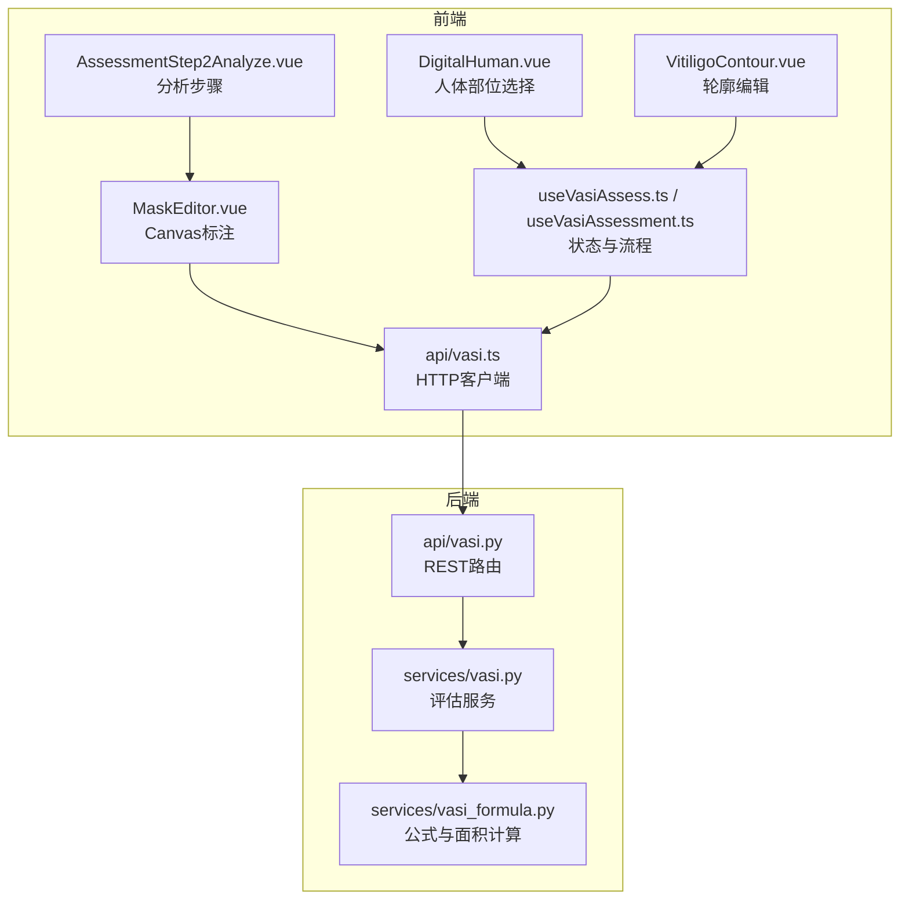
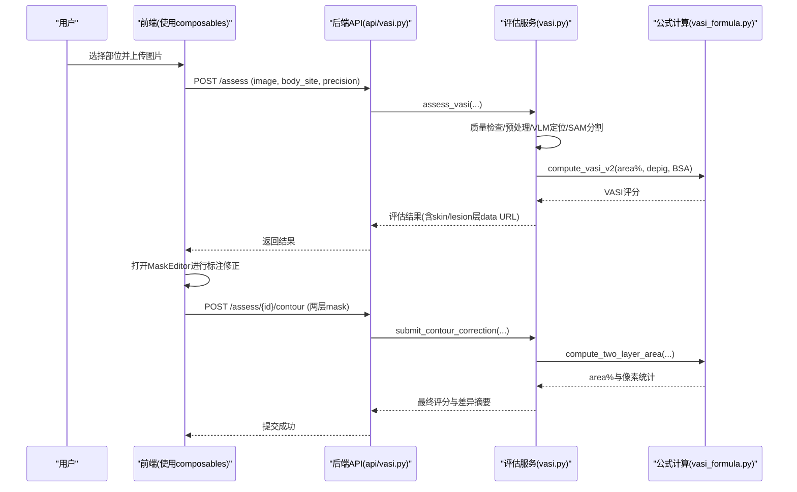
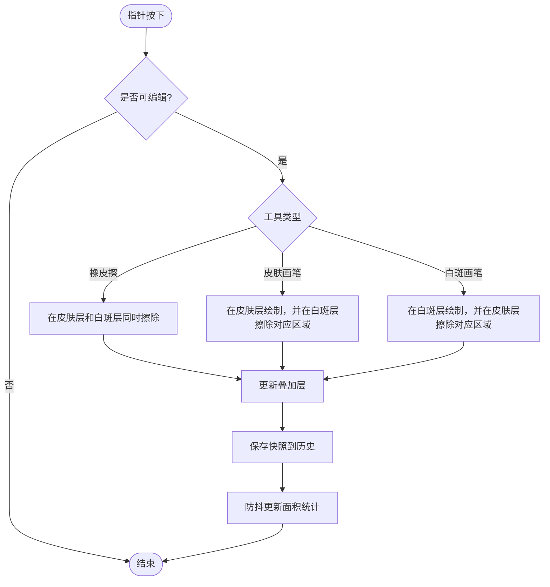
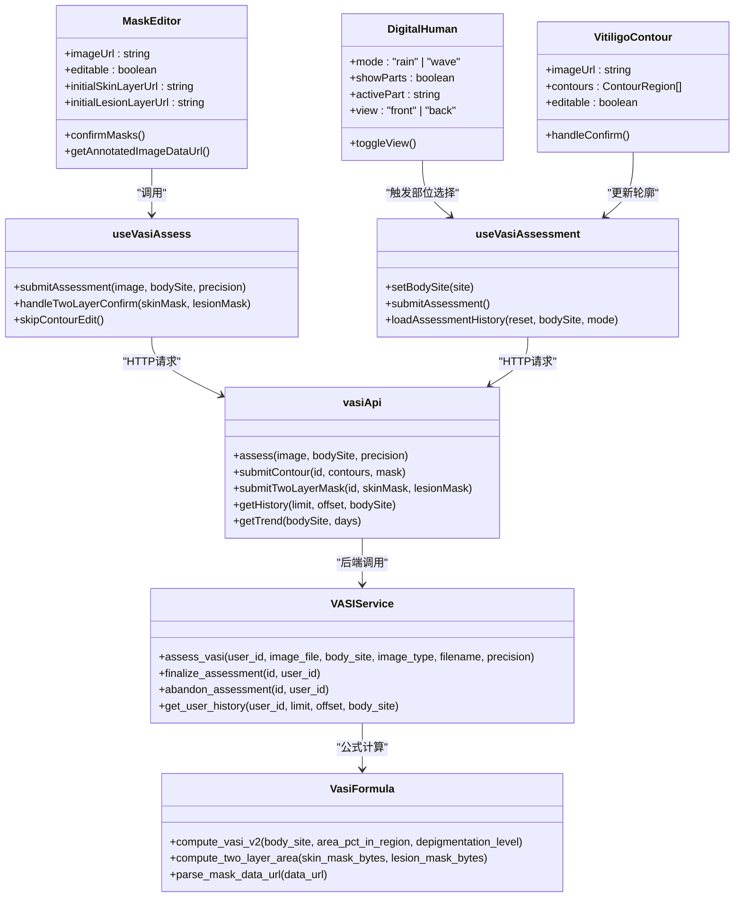

# VASI评估模块

<cite>
**本文引用的文件**   
- [MaskEditor.vue](file://web/app/src/components/tracker/MaskEditor.vue)
- [DigitalHuman.vue](file://web/app/src/components/tracker/DigitalHuman.vue)
- [useVasiAssess.ts](file://web/app/src/composables/useVasiAssess.ts)
- [useVasiAssessment.ts](file://web/app/src/composables/useVasiAssessment.ts)
- [vasi.ts（前端API）](file://web/app/src/api/vasi.ts)
- [vasi.py（后端服务）](file://web/backend/services/vasi.py)
- [api/vasi.py（后端API路由）](file://web/backend/api/vasi.py)
- [vasi_formula.py（VASI公式与面积计算）](file://web/backend/services/vasi_formula.py)
- [VitiligoContour.vue（轮廓编辑组件）](file://web/app/src/components/tracker/VitiligoContour.vue)
- [AssessmentStep2Analyze.vue（分析步骤页面）](file://web/app/src/components/tracker/AssessmentStep2Analyze.vue)
- [FloodFillTool.ts（填充工具）](file://web/admin/src/components/labeling/tools/FloodFillTool.ts)
- [BrushTool.ts（画笔工具）](file://web/admin/src/components/labeling/tools/BrushTool.ts)
- [EraserTool.ts（橡皮擦工具）](file://web/admin/src/components/labeling/tools/EraserTool.ts)
- [LassoTool.ts（套索工具）](file://web/admin/src/components/labeling/tools/LassoTool.ts)
</cite>

## 目录
1. [简介](#简介)
2. [项目结构](#项目结构)
3. [核心组件](#核心组件)
4. [架构总览](#架构总览)
5. [详细组件分析](#详细组件分析)
6. [依赖关系分析](#依赖关系分析)
7. [性能考量](#性能考量)
8. [故障排查指南](#故障排查指南)
9. [结论](#结论)
10. [附录](#附录)

## 简介
本文件为“VASI评估模块”的完整技术文档，聚焦白斑面积严重度指数（VASI）评估系统的实现。内容涵盖：
- 图像上传处理、质量检查与预处理
- Canvas图像编辑（皮肤层/白斑层双图层）、病灶轮廓标注
- 3D人体模型展示与部位选择
- 评估结果计算（含两图层面积计算、去色素权重、VASI评分）
- MaskEditor组件的画笔、橡皮擦、填充、套索等工具实现
- 图像处理算法、坐标转换、区域面积计算与报告生成
- 用户操作流程、技术细节与性能优化方案

## 项目结构
VASI评估模块由前端应用（Vue + TypeScript）、后端服务（FastAPI + SQLAlchemy）以及标注工具集组成。关键目录与职责如下：
- 前端应用（web/app）
  - 组件：MaskEditor（Canvas标注）、DigitalHuman（人体部位选择）、VitiligoContour（轮廓编辑）、AssessmentStep2Analyze（分析步骤页）
  - Composables：useVasiAssess（提交与结果管理）、useVasiAssessment（全流程状态与历史）
  - API：vasi.ts（封装所有VASI相关接口）
- 后端服务（web/backend）
  - 服务：vasi.py（评估流程编排）、vasi_formula.py（VASI公式与面积计算）
  - API路由：api/vasi.py（REST端点）
- 标注工具（web/admin）
  - 工具：BrushTool、EraserTool、FloodFillTool、LassoTool（基于BaseTool接口）

**图表来源** 
- [MaskEditor.vue](file://web/app/src/components/tracker/MaskEditor.vue)
- [DigitalHuman.vue](file://web/app/src/components/tracker/DigitalHuman.vue)
- [VitiligoContour.vue](file://web/app/src/components/tracker/VitiligoContour.vue)
- [AssessmentStep2Analyze.vue](file://web/app/src/components/tracker/AssessmentStep2Analyze.vue)
- [useVasiAssess.ts](file://web/app/src/composables/useVasiAssess.ts)
- [useVasiAssessment.ts](file://web/app/src/composables/useVasiAssessment.ts)
- [vasi.ts（前端API）](file://web/app/src/api/vasi.ts)
- [api/vasi.py（后端API路由）](file://web/backend/api/vasi.py)
- [vasi.py（后端服务）](file://web/backend/services/vasi.py)
- [vasi_formula.py（VASI公式与面积计算）](file://web/backend/services/vasi_formula.py)

**章节来源**
- [MaskEditor.vue](file://web/app/src/components/tracker/MaskEditor.vue)
- [DigitalHuman.vue](file://web/app/src/components/tracker/DigitalHuman.vue)
- [useVasiAssess.ts](file://web/app/src/composables/useVasiAssess.ts)
- [useVasiAssessment.ts](file://web/app/src/composables/useVasiAssessment.ts)
- [vasi.ts（前端API）](file://web/app/src/api/vasi.ts)
- [api/vasi.py（后端API路由）](file://web/backend/api/vasi.py)
- [vasi.py（后端服务）](file://web/backend/services/vasi.py)
- [vasi_formula.py（VASI公式与面积计算）](file://web/backend/services/vasi_formula.py)

## 核心组件
- MaskEditor（Canvas标注）
  - 双图层：皮肤层（蓝色）与白斑层（粉色），支持缩放、平移、动画轮廓描边
  - 工具：皮肤画笔、白斑画笔、橡皮擦；支持撤销/重做、历史记录快照
  - 面积统计：实时计算皮肤区、白斑区、并集区域百分比
  - 性能：工作分辨率上限（MAX_CANVAS_DIM=1024），离屏缓冲绘制，requestIdleCallback延迟计算
- DigitalHuman（人体部位选择）
  - 正/背面视图切换，SVG覆盖层定义可点击部位热区
  - 雨滴/波浪动效增强交互体验
- VitiligoContour（轮廓编辑）
  - 多边形轮廓编辑：选择、绘制、移动、增删控制点
  - 标准化坐标归一化（0-1），便于跨尺寸显示
- 评估流程Composables
  - useVasiAssess：提交评估、AI分析状态、两层掩码确认、结果清理
  - useVasiAssessment：全流程状态机、历史分页、趋势数据、草稿与删除

**章节来源**
- [MaskEditor.vue](file://web/app/src/components/tracker/MaskEditor.vue)
- [DigitalHuman.vue](file://web/app/src/components/tracker/DigitalHuman.vue)
- [VitiligoContour.vue](file://web/app/src/components/tracker/VitiligoContour.vue)
- [useVasiAssess.ts](file://web/app/src/composables/useVasiAssess.ts)
- [useVasiAssessment.ts](file://web/app/src/composables/useVasiAssessment.ts)

## 架构总览
端到端流程：用户上传图像 → 前端质量检查 → 后端评估（VLM+SAM→nnU-Net→公式计算）→ 返回结果与AI层 → 用户修正标注 → 提交两层掩码 → 最终VASI评分。

**图表来源** 
- [useVasiAssess.ts](file://web/app/src/composables/useVasiAssess.ts)
- [api/vasi.py（后端API路由）](file://web/backend/api/vasi.py)
- [vasi.py（后端服务）](file://web/backend/services/vasi.py)
- [vasi_formula.py（VASI公式与面积计算）](file://web/backend/services/vasi_formula.py)

## 详细组件分析

### MaskEditor（Canvas标注）
- 功能要点
  - 双图层渲染：皮肤层与白斑层分别绘制，叠加到overlayCanvas
  - 指针事件：支持鼠标/触摸、中键/右键平移、Ctrl/Meta平移、双指捏合缩放
  - 动画轮廓：预渲染两个离屏缓冲（相位A/B），每帧仅drawImage，避免大量fillRect
  - 面积计算：countAlpha/UnionAlpha遍历alpha通道，使用debounce降低主线程阻塞
  - 历史快照：shallowRef存储ImageData数组，限制长度HISTORY_MAX=10
- 坐标转换
  - clientToCanvas将屏幕坐标映射到canvas自然尺寸，考虑displayW/displayH与scaleX/scaleY
- 性能优化
  - MAX_CANVAS_DIM=1024限制工作分辨率，CSS保持原图清晰度
  - getCtx使用willReadFrequently优化读取密集型上下文
  - overlayCtx缓存避免重复getContext开销
  - requestAnimationFrame节流动画至~12fps，tab隐藏时暂停

**图表来源** 
- [MaskEditor.vue](file://web/app/src/components/tracker/MaskEditor.vue)

**章节来源**
- [MaskEditor.vue](file://web/app/src/components/tracker/MaskEditor.vue)

### DigitalHuman（人体部位选择）
- 功能要点
  - SVG覆盖层定义各部位热区（椭圆），点击触发select-part事件
  - 正/背面视图切换，镜像翻转图片
  - 雨滴/波浪动效用于引导注意力与视觉反馈
- 交互设计
  - 支持键盘导航（Tab/Enter/Space）
  - 触摸事件监听防止默认滚动干扰

**章节来源**
- [DigitalHuman.vue](file://web/app/src/components/tracker/DigitalHuman.vue)

### VitiligoContour（轮廓编辑）
- 功能要点
  - 多边形轮廓编辑：选择模式、绘制模式、移动模式
  - 控制点增删、整体移动、路径简化（Ramer-Douglas-Peucker近似）
  - 标准化坐标（0-1）与像素坐标双向转换
- 可视化
  - 每个轮廓不同颜色，选中高亮发光滤镜
  - 实时显示各区域面积百分比与合计

**章节来源**
- [VitiligoContour.vue](file://web/app/src/components/tracker/VitiligoContour.vue)

### 评估流程Composables
- useVasiAssess
  - 提交评估：调用vasiApi.assess，解析响应并设置AI层URL
  - 两层掩码确认：submitTwoLayerMask，计算差异与最终评分
  - 跳过/取消：finalize或abandon评估记录
- useVasiAssessment
  - 全流程状态机：选择部位→上传→质量检查→AI分析→标注→确认
  - 历史分页：page-based与legacy append两种模式
  - 趋势数据：getTrend接口获取时间序列

**章节来源**
- [useVasiAssess.ts](file://web/app/src/composables/useVasiAssess.ts)
- [useVasiAssessment.ts](file://web/app/src/composables/useVasiAssessment.ts)

### 后端服务与API
- api/vasi.py
  - /assess：创建评估，返回VASI评分、轮廓、置信度、AI层URL
  - /assess/{id}/contour：提交用户修正，计算Dice与面积误差，更新最终评分
  - /history、/trend：历史与趋势查询
- vasi.py
  - assess_vasi：输入校验→上传→VLM分类与定位→SAM分割→nnU-Net回退→公式计算
  - finalize/abandon：状态管理（draft→active/abandoned）
  - get_user_history：仅返回active状态的评估记录
- vasi_formula.py
  - compute_vasi_v2：按身体部位BSA权重计算手单位×去色素等级
  - compute_two_layer_area：两图层面积计算（白斑/皮肤并集）
  - parse_mask_data_url：解码data URL为PNG字节

**章节来源**
- [api/vasi.py（后端API路由）](file://web/backend/api/vasi.py)
- [vasi.py（后端服务）](file://web/backend/services/vasi.py)
- [vasi_formula.py（VASI公式与面积计算）](file://web/backend/services/vasi_formula.py)

### 标注工具集（Admin）
- BaseTool接口：统一工具上下文（skinCanvas、lesionCanvas、overlayCanvas、naturalSize、brushSize、transform、clientToImage、drawOverlay、snapshot、updateAreas）
- BrushTool：自由手绘，支持皮肤/白斑画笔，互斥绘制
- EraserTool：同时在两层擦除
- FloodFillTool：基于原始图像像素的泛洪填充，支持容差调节
- LassoTool：手绘闭合路径后填充内部区域

**章节来源**
- [BaseTool.ts](file://web/admin/src/components/labeling/tools/BaseTool.ts)
- [BrushTool.ts](file://web/admin/src/components/labeling/tools/BrushTool.ts)
- [EraserTool.ts](file://web/admin/src/components/labeling/tools/EraserTool.ts)
- [FloodFillTool.ts](file://web/admin/src/components/labeling/tools/FloodFillTool.ts)
- [LassoTool.ts](file://web/admin/src/components/labeling/tools/LassoTool.ts)

## 依赖关系分析

**图表来源** 
- [MaskEditor.vue](file://web/app/src/components/tracker/MaskEditor.vue)
- [DigitalHuman.vue](file://web/app/src/components/tracker/DigitalHuman.vue)
- [VitiligoContour.vue](file://web/app/src/components/tracker/VitiligoContour.vue)
- [useVasiAssess.ts](file://web/app/src/composables/useVasiAssess.ts)
- [useVasiAssessment.ts](file://web/app/src/composables/useVasiAssessment.ts)
- [vasi.ts（前端API）](file://web/app/src/api/vasi.ts)
- [api/vasi.py（后端API路由）](file://web/backend/api/vasi.py)
- [vasi.py（后端服务）](file://web/backend/services/vasi.py)
- [vasi_formula.py（VASI公式与面积计算）](file://web/backend/services/vasi_formula.py)

## 性能考量
- 前端性能
  - Canvas工作分辨率限制（MAX_CANVAS_DIM=1024），减少内存占用与CPU负载
  - willReadFrequently优化读取密集型上下文，避免GPU加速冲突
  - 离屏缓冲预渲染轮廓点阵，每帧仅2-3次drawImage调用
  - requestIdleCallback延迟面积计算，避免阻塞主线程
  - 动画帧率降至~12fps，标签隐藏时暂停动画循环
- 后端性能
  - 质量检查前置，拒绝低质量图片避免无效AI调用
  - VLM集成可选ensemble模式（精确模式启用），平衡稳定性与成本
  - SAM分割支持VLM引导（bbox/center/edge points），提升精度
  - 两图层面积计算使用PIL+NumPy向量化操作，高效统计像素

[无需来源，因为本节提供一般性指导]

## 故障排查指南
- 图像加载失败
  - 检查网络与图片有效性，onImgError会设置错误消息
  - 确保容器尺寸非零，zoomToFit使用requestAnimationFrame重试
- Canvas绘制异常
  - 验证context获取（getCtx/getOverlayCtx），确保canvas尺寸正确
  - 检查pointer事件绑定与preventDefault调用
- 面积计算不准确
  - 确认alpha阈值（>32）与union逻辑正确
  - 检查两图层mask尺寸一致性，必要时resize对齐
- API调用失败
  - 检查认证状态（authStore.isLoggedIn）
  - 查看后端日志与错误响应（detail字段）
- 历史加载问题
  - 确认仅返回active状态记录，draft/abandoned不显示
  - 分页参数limit/offset范围校验

**章节来源**
- [MaskEditor.vue](file://web/app/src/components/tracker/MaskEditor.vue)
- [api/vasi.py（后端API路由）](file://web/backend/api/vasi.py)
- [vasi.py（后端服务）](file://web/backend/services/vasi.py)

## 结论
VASI评估模块通过前后端协同实现了完整的白斑面积严重度指数评估流程。前端MaskEditor提供直观的Canvas标注能力，后端服务整合VLM与SAM实现高精度分割，公式计算确保临床意义的VASI评分。系统注重性能优化与用户体验，支持多层级标注工具与交互式人体模型。未来可扩展更多标注工具与AI模型以提升准确率与效率。

[无需来源，因为本节总结而不分析具体文件]

## 附录
- 用户操作流程
  1. 选择身体部位（DigitalHuman）
  2. 上传照片（支持拖拽/文件选择）
  3. 质量检查与预览
  4. AI分析（VLM+SAM）
  5. 标注修正（MaskEditor/VitiligoContour）
  6. 提交两层掩码或轮廓
  7. 查看结果与历史趋势
- 技术实现细节
  - 坐标转换：clientToCanvas/toPixel/toNorm
  - 面积计算：countAlpha/UnionAlpha/compute_two_layer_area
  - VASI公式：compute_vasi_v2（BSA权重×去色素等级）
- 最佳实践
  - 使用shallowRef管理大对象（ImageData）
  - 批量异步任务分帧执行（requestAnimationFrame）
  - 防抖与节流避免频繁计算
  - 错误边界与用户友好提示

**章节来源**
- [AssessmentStep2Analyze.vue](file://web/app/src/components/tracker/AssessmentStep2Analyze.vue)
- [vasi_formula.py（VASI公式与面积计算）](file://web/backend/services/vasi_formula.py)
- [MaskEditor.vue](file://web/app/src/components/tracker/MaskEditor.vue)