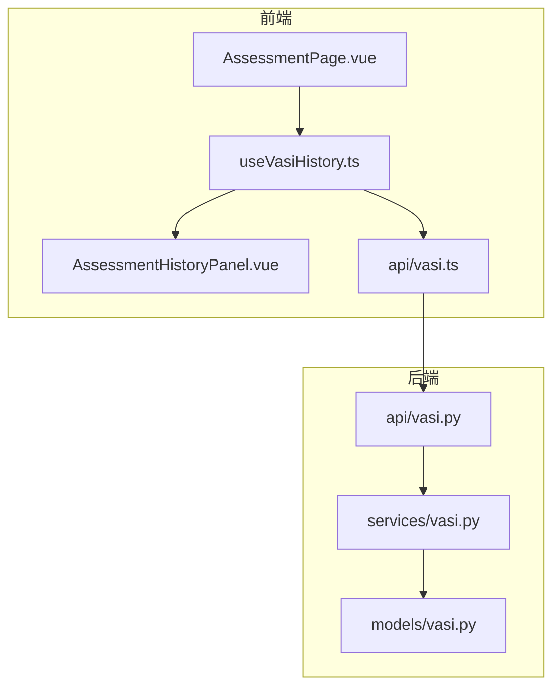
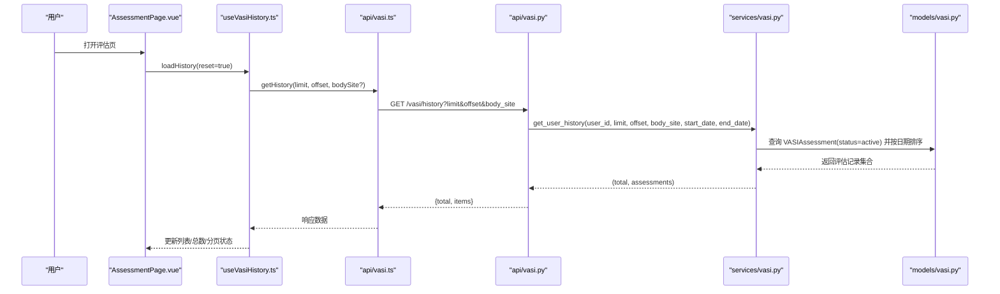
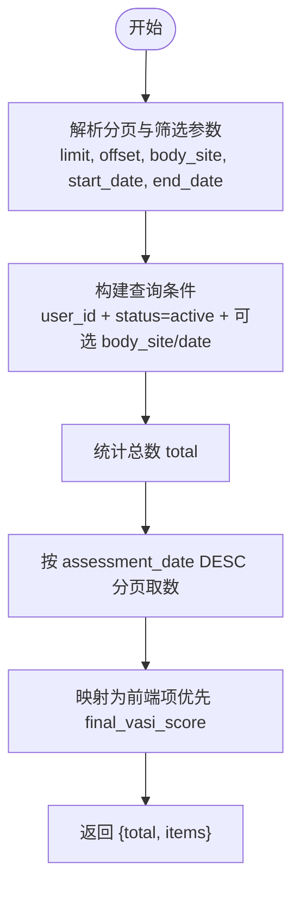
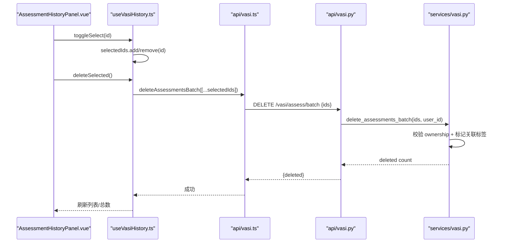
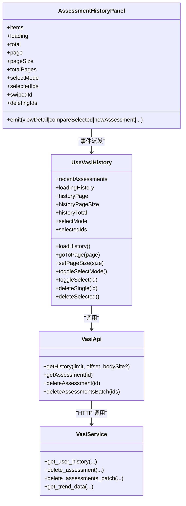

# 历史记录管理

<cite>
**本文引用的文件**   
- [web/app/src/composables/useVasiHistory.ts](file://web/app/src/composables/useVasiHistory.ts)
- [web/app/src/components/tracker/AssessmentHistoryPanel.vue](file://web/app/src/components/tracker/AssessmentHistoryPanel.vue)
- [web/app/src/views/AssessmentPage.vue](file://web/app/src/views/AssessmentPage.vue)
- [web/app/src/api/vasi.ts](file://web/app/src/api/vasi.ts)
- [web/backend/api/vasi.py](file://web/backend/api/vasi.py)
- [web/backend/services/vasi.py](file://web/backend/services/vasi.py)
- [web/backend/models/vasi.py](file://web/backend/models/vasi.py)
- [web/app/vite.config.ts](file://web/app/vite.config.ts)
- [web/app/vite.config.staging.ts](file://web/app/vite.config.staging.ts)
- [web/deploy/nginx.conf](file://web/deploy/nginx.conf)
- [web/app/src/stores/auth.ts](file://web/app/src/stores/auth.ts)
- [web/app/src/utils/file-url.ts](file://web/app/src/utils/file-url.ts)
- [tests/backend/api/test_vasi.py](file://tests/backend/api/test_vasi.py)
- [tests/backend/services/test_vasi.py](file://tests/backend/services/test_vasi.py)
</cite>

## 目录
1. [简介](#简介)
2. [项目结构](#项目结构)
3. [核心组件](#核心组件)
4. [架构总览](#架构总览)
5. [详细组件分析](#详细组件分析)
6. [依赖关系分析](#依赖关系分析)
7. [性能考量](#性能考量)
8. [故障排查指南](#故障排查指南)
9. [结论](#结论)
10. [附录](#附录)

## 简介
本文件围绕“评估历史”的完整生命周期进行系统化说明，涵盖：
- 数据存储与模型设计（数据库字段、状态机）
- 查询过滤与分页（部位筛选、日期范围、分页参数）
- 批量操作（多选删除、对比选择）
- 对比功能（双记录对比、同部位智能匹配建议）
- UI 实现（侧边栏面板、移动端抽屉、滑动删除、分页控件）
- 本地缓存策略、数据持久化与云端同步机制
- 导出与分享能力（当前实现现状与建议扩展点）

## 项目结构
前端以 Vue 组合式函数 + 组件组织历史逻辑；后端以 FastAPI 路由 + Service + ORM 模型分层。关键路径如下：
- 前端 API 封装：web/app/src/api/vasi.ts
- 前端历史 Composable：web/app/src/composables/useVasiHistory.ts
- 历史面板组件：web/app/src/components/tracker/AssessmentHistoryPanel.vue
- 页面集成入口：web/app/src/views/AssessmentPage.vue
- 后端路由：web/backend/api/vasi.py
- 业务服务：web/backend/services/vasi.py
- 数据模型：web/backend/models/vasi.py
- PWA/缓存策略：web/app/vite.config.ts、web/app/vite.config.staging.ts、web/deploy/nginx.conf
- 认证与文件访问：web/app/src/stores/auth.ts、web/app/src/utils/file-url.ts

图表来源
- [web/app/src/views/AssessmentPage.vue](file://web/app/src/views/AssessmentPage.vue)
- [web/app/src/composables/useVasiHistory.ts](file://web/app/src/composables/useVasiHistory.ts)
- [web/app/src/components/tracker/AssessmentHistoryPanel.vue](file://web/app/src/components/tracker/AssessmentHistoryPanel.vue)
- [web/app/src/api/vasi.ts](file://web/app/src/api/vasi.ts)
- [web/backend/api/vasi.py](file://web/backend/api/vasi.py)
- [web/backend/services/vasi.py](file://web/backend/services/vasi.py)
- [web/backend/models/vasi.py](file://web/backend/models/vasi.py)

章节来源
- [web/app/src/views/AssessmentPage.vue](file://web/app/src/views/AssessmentPage.vue)
- [web/app/src/composables/useVasiHistory.ts](file://web/app/src/composables/useVasiHistory.ts)
- [web/app/src/components/tracker/AssessmentHistoryPanel.vue](file://web/app/src/components/tracker/AssessmentHistoryPanel.vue)
- [web/app/src/api/vasi.ts](file://web/app/src/api/vasi.ts)
- [web/backend/api/vasi.py](file://web/backend/api/vasi.py)
- [web/backend/services/vasi.py](file://web/backend/services/vasi.py)
- [web/backend/models/vasi.py](file://web/backend/models/vasi.py)

## 核心组件
- useVasiHistory.ts：负责历史数据的加载、分页、筛选、选择模式、滑动删除、批量删除等交互逻辑。
- AssessmentHistoryPanel.vue：渲染历史列表、分页控件、多选/对比/删除按钮、滑动删除区域。
- vasi.ts：前端 API 封装，提供 getHistory、deleteAssessment、deleteAssessmentsBatch 等方法。
- api/vasi.py：后端路由，暴露 /history、/assess/{id}、/assess/batch 等接口，支持分页、筛选、批量删除。
- services/vasi.py：核心业务逻辑，包含 get_user_history、get_trend_data、删除与权限校验、趋势计算等。
- models/vasi.py：VASIAssessment 表结构与相关辅助表，定义字段、索引、迁移保障。

章节来源
- [web/app/src/composables/useVasiHistory.ts](file://web/app/src/composables/useVasiHistory.ts)
- [web/app/src/components/tracker/AssessmentHistoryPanel.vue](file://web/app/src/components/tracker/AssessmentHistoryPanel.vue)
- [web/app/src/api/vasi.ts](file://web/app/src/api/vasi.ts)
- [web/backend/api/vasi.py](file://web/backend/api/vasi.py)
- [web/backend/services/vasi.py](file://web/backend/services/vasi.py)
- [web/backend/models/vasi.py](file://web/backend/models/vasi.py)

## 架构总览
历史数据从前端发起请求，经 API 层进入服务层，最终通过 ORM 查询数据库并返回结构化结果。前端使用组合式函数维护状态，组件仅做展示与事件派发。

图表来源
- [web/app/src/views/AssessmentPage.vue](file://web/app/src/views/AssessmentPage.vue)
- [web/app/src/composables/useVasiHistory.ts](file://web/app/src/composables/useVasiHistory.ts)
- [web/app/src/api/vasi.ts](file://web/app/src/api/vasi.ts)
- [web/backend/api/vasi.py](file://web/backend/api/vasi.py)
- [web/backend/services/vasi.py](file://web/backend/services/vasi.py)
- [web/backend/models/vasi.py](file://web/backend/models/vasi.py)

## 详细组件分析

### 数据模型与存储
- VASIAssessment 表关键字段：
  - 基础信息：user_id、image_url、image_key、image_hash
  - 评估结果：vasi_score、area_percentage、classification、stage、body_site
  - 详情与原始响应：details、raw_api_response、assessment_source
  - 用户修正：user_contours、contour_diff、is_user_corrected、final_vasi_score、final_area_percentage、depigmentation_level、user_mask_image
  - 双层掩码：ai_skin_layer、ai_lesion_layer、user_skin_layer、user_lesion_layer
  - 状态与时间：status（draft/active/abandoned）、assessment_date、created_at、updated_at
- 索引与约束：
  - user_id、body_site、assessment_date、status 均建立索引以提升查询性能
- 迁移保障：
  - ensure_vasi_columns 动态检测并添加缺失列，兼容 SQLite/PostgreSQL

章节来源
- [web/backend/models/vasi.py](file://web/backend/models/vasi.py)

### 查询过滤与分页
- 后端接口 /vasi/history：
  - 支持 limit、offset、body_site、start_date、end_date
  - 限制最大 limit（如 50），防止过大分页
  - 仅返回 status=active 的记录，草稿与放弃记录不进入历史
- 前端分页：
  - useVasiHistory 维护 historyPage、historyPageSize、historyTotal、historyTotalPages
  - 支持设置每页条数（10/20/50/100），切换时重置到第 1 页
  - 根据 currentBodySiteFilter 传递 body_site 筛选

图表来源
- [web/backend/api/vasi.py](file://web/backend/api/vasi.py)
- [web/backend/services/vasi.py](file://web/backend/services/vasi.py)

章节来源
- [web/backend/api/vasi.py](file://web/backend/api/vasi.py)
- [web/backend/services/vasi.py](file://web/backend/services/vasi.py)
- [web/app/src/composables/useVasiHistory.ts](file://web/app/src/composables/useVasiHistory.ts)

### 批量操作与对比
- 批量删除：
  - 前端：useVasiHistory 维护 selectedIds，调用 deleteAssessmentsBatch(ids)
  - 后端：delete_assessments_batch 校验所有权，避免跨用户 IDOR 风险，同时标记关联 ImageLabel.is_user_deleted
- 对比选择：
  - 前端：AssessmentHistoryPanel 支持多选，触发 compareSelected 事件
  - 对比页面：VasiComparePage 并行获取两条评估详情，自动按时间排序，若部位不同则尝试同部位匹配建议

图表来源
- [web/app/src/components/tracker/AssessmentHistoryPanel.vue](file://web/app/src/components/tracker/AssessmentHistoryPanel.vue)
- [web/app/src/composables/useVasiHistory.ts](file://web/app/src/composables/useVasiHistory.ts)
- [web/app/src/api/vasi.ts](file://web/app/src/api/vasi.ts)
- [web/backend/api/vasi.py](file://web/backend/api/vasi.py)
- [web/backend/services/vasi.py](file://web/backend/services/vasi.py)

章节来源
- [web/app/src/components/tracker/AssessmentHistoryPanel.vue](file://web/app/src/components/tracker/AssessmentHistoryPanel.vue)
- [web/app/src/composables/useVasiHistory.ts](file://web/app/src/composables/useVasiHistory.ts)
- [web/backend/api/vasi.py](file://web/backend/api/vasi.py)
- [web/backend/services/vasi.py](file://web/backend/services/vasi.py)

### UI 实现与交互
- 桌面端：左侧固定宽度侧边栏（w-52），显示历史列表、分页控件、多选/对比/删除按钮
- 移动端：底部抽屉/面板（由父组件控制显示），支持滑动删除
- 交互细节：
  - 滑动删除：onTouchStart/onTouchEnd 计算 deltaX，触发 swipedId 显示删除按钮
  - 分页控件：支持 10/20/50 条切换，上一页/下一页按钮
  - 空状态与加载中：无数据时显示空态提示，加载时显示旋转图标

章节来源
- [web/app/src/components/tracker/AssessmentHistoryPanel.vue](file://web/app/src/components/tracker/AssessmentHistoryPanel.vue)
- [web/app/src/views/AssessmentPage.vue](file://web/app/src/views/AssessmentPage.vue)

### 趋势与总结
- 趋势接口 /vasi/trend：
  - 支持 days、body_site 筛选
  - 返回 data（按时间升序）、summary（首尾分数、变化量、变化百分比、趋势判断）
- 前端汇总：
  - useTrackingSummary 拉取最近 50 条历史，计算评估次数、跟踪天数、改善率等

章节来源
- [web/backend/api/vasi.py](file://web/backend/api/vasi.py)
- [web/backend/services/vasi.py](file://web/backend/services/vasi.py)
- [web/app/src/composables/useTrackingSummary.ts](file://web/app/src/composables/useTrackingSummary.ts)

## 依赖关系分析
- 前端依赖：
  - useVasiHistory 依赖 authStore（登录状态）、toast（提示）、vasiApi（HTTP 客户端）
  - AssessmentHistoryPanel 依赖 PART_LABELS（部位标签映射）
- 后端依赖：
  - api/vasi.py 依赖 services/vasi.py、models/vasi.py、auth 中间件
  - services/vasi.py 依赖 database session、其他子服务（预处理、质量检查、分割）
- 安全与权限：
  - 所有接口通过 get_current_user 鉴权
  - 批量删除严格校验 ownership，防止跨用户修改

图表来源
- [web/app/src/composables/useVasiHistory.ts](file://web/app/src/composables/useVasiHistory.ts)
- [web/app/src/components/tracker/AssessmentHistoryPanel.vue](file://web/app/src/components/tracker/AssessmentHistoryPanel.vue)
- [web/app/src/api/vasi.ts](file://web/app/src/api/vasi.ts)
- [web/backend/services/vasi.py](file://web/backend/services/vasi.py)

章节来源
- [web/app/src/composables/useVasiHistory.ts](file://web/app/src/composables/useVasiHistory.ts)
- [web/app/src/components/tracker/AssessmentHistoryPanel.vue](file://web/app/src/components/tracker/AssessmentHistoryPanel.vue)
- [web/app/src/api/vasi.ts](file://web/app/src/api/vasi.ts)
- [web/backend/services/vasi.py](file://web/backend/services/vasi.py)

## 性能考量
- 分页与限流：
  - 后端限制 limit ≤ 50，避免大偏移与大页大小导致慢查询
  - 前端默认 10 条/页，支持切换至 20/50/100
- 索引优化：
  - user_id、body_site、assessment_date、status 均有索引，提升筛选与排序效率
- 网络与缓存：
  - 生产环境禁用 SW 缓存敏感 API 与上传资源，确保隐私与安全
  - 预发环境对特定 API 启用 NetworkFirst 缓存（5 分钟 TTL），提升体验
- 内存与渲染：
  - 列表渲染采用虚拟滚动或分页，避免一次性渲染过多 DOM

章节来源
- [web/backend/api/vasi.py](file://web/backend/api/vasi.py)
- [web/backend/models/vasi.py](file://web/backend/models/vasi.py)
- [web/app/vite.config.ts](file://web/app/vite.config.ts)
- [web/app/vite.config.staging.ts](file://web/app/vite.config.staging.ts)

## 故障排查指南
- 常见问题定位：
  - 未授权访问：确认登录状态与 token 有效性（authStore）
  - 图片过大：后端质量检查与大小限制（MAX_PHOTO_BYTES）
  - 分页异常：检查 limit/offset 计算是否正确，是否越界
  - 删除失败：确认 ownership 校验与关联标签处理
- 日志与错误：
  - 后端记录详细错误日志（logger.error），便于定位问题
  - 前端 toast 提示用户操作结果

章节来源
- [web/backend/api/vasi.py](file://web/backend/api/vasi.py)
- [web/app/src/stores/auth.ts](file://web/app/src/stores/auth.ts)
- [tests/backend/api/test_vasi.py](file://tests/backend/api/test_vasi.py)
- [tests/backend/services/test_vasi.py](file://tests/backend/services/test_vasi.py)

## 结论
本系统实现了完整的评估历史管理功能，包括数据持久化、查询过滤、分页加载、批量操作与对比功能。前端 UI 交互流畅，后端逻辑严谨且具备良好安全性。未来可进一步扩展导出与分享能力，以满足更多用户需求。

## 附录

### 本地缓存策略与数据持久化
- 浏览器本地存储：
  - localStorage 用于保存 token、用户信息、隐私设置、地理位置缓存等
  - 文件访问使用短时效 file_token，降低泄露风险
- PWA 缓存策略：
  - 生产环境禁用敏感 API 与上传资源的 SW 缓存
  - 预发环境对部分 API 启用 NetworkFirst 缓存，提升离线体验

章节来源
- [web/app/src/stores/auth.ts](file://web/app/src/stores/auth.ts)
- [web/app/src/utils/file-url.ts](file://web/app/src/utils/file-url.ts)
- [web/app/vite.config.ts](file://web/app/vite.config.ts)
- [web/app/vite.config.staging.ts](file://web/app/vite.config.staging.ts)
- [web/deploy/nginx.conf](file://web/deploy/nginx.conf)

### 云端同步机制
- 当前历史数据直接通过 HTTP API 与后端同步，无额外云同步层
- 草稿同步机制（社区帖子）可作为参考，实现异步合并与冲突解决

章节来源
- [web/app/src/composables/useDrafts.ts](file://web/app/src/composables/useDrafts.ts)

### 历史数据导出与分享功能
- 导出功能：
  - 当前未发现专门的 VASI 历史导出接口或前端导出逻辑
  - 可参考 JSONExporter 实现 CSV/JSON 导出，按日期归档
- 分享功能：
  - 微信分享工具已实现（useWechatShare），可用于分享脱敏后的摘要数据
  - 隐私政策明确用户主动分享的范围与审计要求

章节来源
- [src/exporters/json_exporter.py](file://src/exporters/json_exporter.py)
- [web/app/src/composables/useWechatShare.ts](file://web/app/src/composables/useWechatShare.ts)
- [web/app/src/views/PrivacyPolicyPage.vue](file://web/app/src/views/PrivacyPolicyPage.vue)