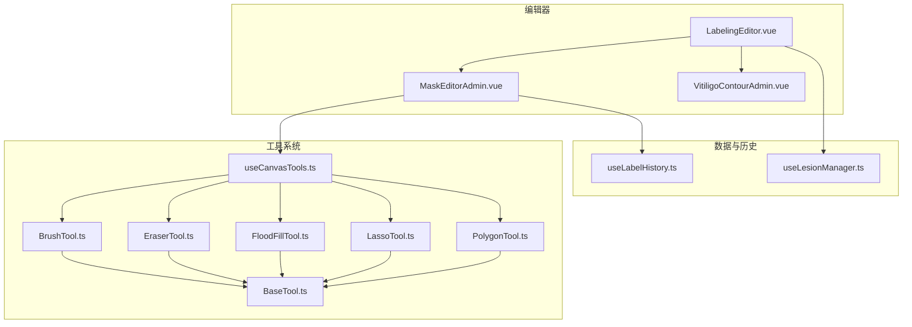
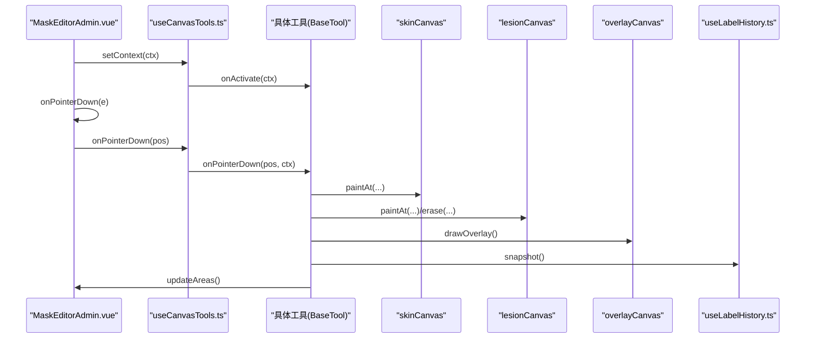
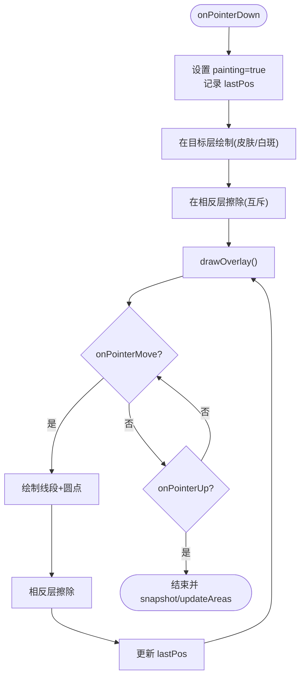
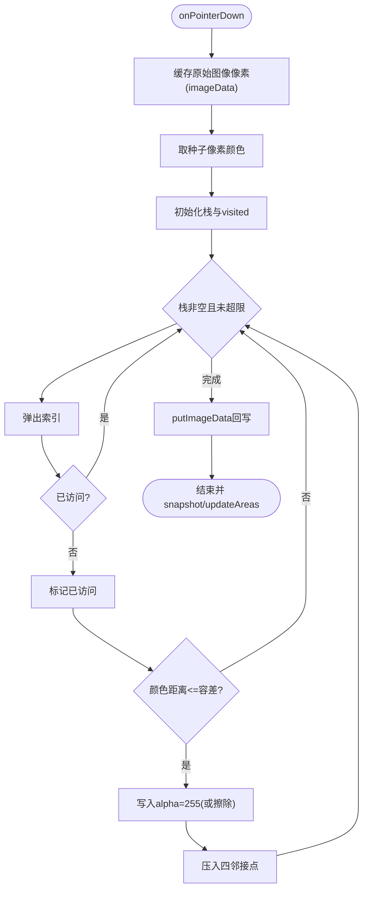
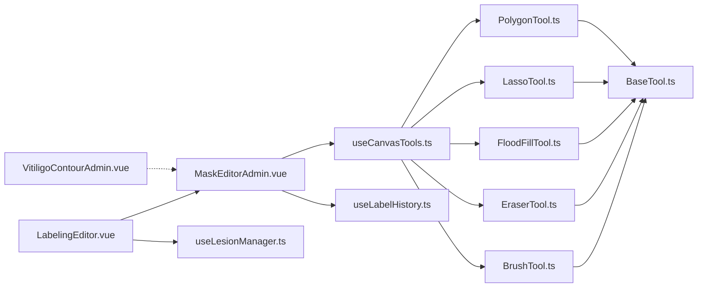

# Canvas工具集

<cite>
**本文引用的文件**   
- [BaseTool.ts](file://web/admin/src/components/labeling/tools/BaseTool.ts)
- [BrushTool.ts](file://web/admin/src/components/labeling/tools/BrushTool.ts)
- [EraserTool.ts](file://web/admin/src/components/labeling/tools/EraserTool.ts)
- [FloodFillTool.ts](file://web/admin/src/components/labeling/tools/FloodFillTool.ts)
- [LassoTool.ts](file://web/admin/src/components/labeling/tools/LassoTool.ts)
- [PolygonTool.ts](file://web/admin/src/components/labeling/tools/PolygonTool.ts)
- [useCanvasTools.ts](file://web/admin/src/composables/useCanvasTools.ts)
- [useLabelHistory.ts](file://web/admin/src/composables/useLabelHistory.ts)
- [MaskEditorAdmin.vue](file://web/admin/src/components/labeling/MaskEditorAdmin.vue)
- [VitiligoContourAdmin.vue](file://web/admin/src/components/labeling/VitiligoContourAdmin.vue)
- [useLesionManager.ts](file://web/admin/src/composables/useLesionManager.ts)
- [LabelingEditor.vue](file://web/admin/src/components/labeling/LabelingEditor.vue)
</cite>

## 目录
1. [简介](#简介)
2. [项目结构](#项目结构)
3. [核心组件](#核心组件)
4. [架构总览](#架构总览)
5. [详细组件分析](#详细组件分析)
6. [依赖关系分析](#依赖关系分析)
7. [性能考量](#性能考量)
8. [故障排查指南](#故障排查指南)
9. [结论](#结论)
10. [附录](#附录)

## 简介
本文件为“Canvas工具集”的技术文档，聚焦于管理员标注与可视化编辑能力。内容涵盖：
- 画笔、橡皮擦、智能填充、套索、多边形等工具的像素级实现
- 鼠标/指针事件处理、路径绘制算法、图层混合与叠加渲染
- 皮肤层与病变层的分离管理与互斥策略
- 工具状态管理、撤销重做、快捷键支持
- 实时轮廓动画的渲染优化
- 工具扩展接口与自定义工具开发指南

## 项目结构
Canvas工具集位于前端管理端（admin）模块中，采用“组件 + 组合式函数 + 工具类”的分层组织方式：
- 工具类：tools 目录下定义各工具的抽象接口与具体实现
- 组合式函数：composables 下提供工具生命周期管理、历史快照、病灶列表管理等
- 编辑器组件：MaskEditorAdmin.vue 作为画布宿主，协调工具、图层、事件与渲染
- 轮廓编辑：VitiligoContourAdmin.vue 使用 SVG 进行轮廓绘制与动画展示
- 上层编排：LabelingEditor.vue 整合表单、AI预标注与标注结果提交



**图表来源** 
- [MaskEditorAdmin.vue:1-120](file://web/admin/src/components/labeling/MaskEditorAdmin.vue#L1-L120)
- [useCanvasTools.ts:1-127](file://web/admin/src/composables/useCanvasTools.ts#L1-L127)
- [BaseTool.ts:1-72](file://web/admin/src/components/labeling/tools/BaseTool.ts#L1-L72)
- [useLabelHistory.ts:1-87](file://web/admin/src/composables/useLabelHistory.ts#L1-L87)
- [useLesionManager.ts:1-149](file://web/admin/src/composables/useLesionManager.ts#L1-L149)
- [VitiligoContourAdmin.vue:1-120](file://web/admin/src/components/labeling/VitiligoContourAdmin.vue#L1-L120)

**章节来源**
- [MaskEditorAdmin.vue:1-120](file://web/admin/src/components/labeling/MaskEditorAdmin.vue#L1-L120)
- [useCanvasTools.ts:1-127](file://web/admin/src/composables/useCanvasTools.ts#L1-L127)
- [BaseTool.ts:1-72](file://web/admin/src/components/labeling/tools/BaseTool.ts#L1-L72)

## 核心组件
- BaseTool 抽象接口：统一工具契约（激活/停用、指针事件、键盘事件、光标样式），并提供 ToolContext 上下文（双离屏图层、叠加层、坐标转换、绘制与统计更新）。
- 工具实现：
  - BrushTool：圆形画笔，皮肤/白斑互斥涂抹
  - EraserTool：橡皮擦，同时擦除皮肤与白斑层
  - FloodFillTool：基于颜色容差的连通区域填充（4连通），支持 Shift+点击填充皮肤
  - LassoTool：自由手绘闭合选区并填充
  - PolygonTool：多点放置顶点，双击或回车闭合填充
- 工具管理器 useCanvasTools：维护活跃工具实例、切换逻辑、快捷键映射、指针事件转发。
- 历史记录 useLabelHistory：环形缓冲区保存 skin/lesion 的 ImageData 快照，支持撤销/重做。
- 病灶管理 useLesionManager：多病灶列表、激活切换、掩码数据持久化。
- 画布宿主 MaskEditorAdmin.vue：三层 Canvas（skin、lesion、overlay）、坐标变换（缩放/平移）、事件分发、面积统计、全屏适配。
- 轮廓编辑 VitiligoContourAdmin.vue：SVG 叠加层，归一化坐标、实时轮廓动画、点控制与移动。

**章节来源**
- [BaseTool.ts:1-72](file://web/admin/src/components/labeling/tools/BaseTool.ts#L1-L72)
- [BrushTool.ts:1-122](file://web/admin/src/components/labeling/tools/BrushTool.ts#L1-L122)
- [EraserTool.ts:1-92](file://web/admin/src/components/labeling/tools/EraserTool.ts#L1-L92)
- [FloodFillTool.ts:1-265](file://web/admin/src/components/labeling/tools/FloodFillTool.ts#L1-L265)
- [LassoTool.ts:1-180](file://web/admin/src/components/labeling/tools/LassoTool.ts#L1-L180)
- [PolygonTool.ts:1-196](file://web/admin/src/components/labeling/tools/PolygonTool.ts#L1-L196)
- [useCanvasTools.ts:1-127](file://web/admin/src/composables/useCanvasTools.ts#L1-L127)
- [useLabelHistory.ts:1-87](file://web/admin/src/composables/useLabelHistory.ts#L1-L87)
- [useLesionManager.ts:1-149](file://web/admin/src/composables/useLesionManager.ts#L1-L149)
- [MaskEditorAdmin.vue:1-200](file://web/admin/src/components/labeling/MaskEditorAdmin.vue#L1-L200)
- [VitiligoContourAdmin.vue:1-120](file://web/admin/src/components/labeling/VitiligoContourAdmin.vue#L1-L120)

## 架构总览
整体架构围绕“宿主-工具-图层-历史”展开：
- 宿主（MaskEditorAdmin.vue）负责图像加载、坐标变换、事件捕获、图层合成与统计更新
- 工具通过统一接口与宿主交互，操作离屏 Canvas（skin/lesion）并在 overlay 上合成显示
- 历史记录以 ImageData 快照形式存储，保证撤销/重做的像素级一致性
- 轮廓编辑独立于像素层，使用 SVG 叠加层进行矢量编辑与动画



**图表来源** 
- [MaskEditorAdmin.vue:180-220](file://web/admin/src/components/labeling/MaskEditorAdmin.vue#L180-L220)
- [useCanvasTools.ts:80-127](file://web/admin/src/composables/useCanvasTools.ts#L80-L127)
- [BrushTool.ts:60-112](file://web/admin/src/components/labeling/tools/BrushTool.ts#L60-L112)
- [useLabelHistory.ts:24-57](file://web/admin/src/composables/useLabelHistory.ts#L24-L57)

## 详细组件分析

### 工具抽象与上下文（BaseTool）
- 定义 ToolName、ToolDef、BaseTool 接口与 ALL_TOOLS 配置
- ToolContext 暴露：
  - 离屏 skinCanvas、lesionCanvas 与叠加 overlayCanvas
  - 自然尺寸 naturalSize、当前笔刷大小 brushSize、变换 transform
  - 坐标转换 clientToImage、绘制 drawOverlay、快照 snapshot、面积更新 updateAreas

```mermaid
classDiagram
class BaseTool {
+name : ToolName
+onActivate(ctx) : void
+onDeactivate() : void
+onPointerDown(pos, ctx) : void
+onPointerMove(pos, ctx) : void
+onPointerUp(ctx) : void
+onKeyDown(key, ctx) : void
+getCursor() : string
}
class ToolContext {
+skinCanvas : HTMLCanvasElement
+lesionCanvas : HTMLCanvasElement
+overlayCanvas : HTMLCanvasElement
+naturalSize : {width : number;height : number}
+brushSize : number
+transform : {scale : number;offsetX : number;offsetY : number}
+clientToImage(clientX,clientY) : [number,number]|null
+drawOverlay() : void
+snapshot() : void
+updateAreas() : void
}
class ToolDef {
+name : ToolName
+label : string
+icon : string
+shortcut : string
+cursor : string
+available : boolean
}
BaseTool <|-- BrushTool
BaseTool <|-- EraserTool
BaseTool <|-- FloodFillTool
BaseTool <|-- LassoTool
BaseTool <|-- PolygonTool
```

**图表来源** 
- [BaseTool.ts:1-72](file://web/admin/src/components/labeling/tools/BaseTool.ts#L1-L72)

**章节来源**
- [BaseTool.ts:1-72](file://web/admin/src/components/labeling/tools/BaseTool.ts#L1-L72)

### 画笔工具（BrushTool）
- 功能：圆形画笔在 skin/lesion 层绘制，自动互斥（在同位置涂皮肤会擦除白斑，反之亦然）
- 关键实现：
  - 使用 globalCompositeOperation 控制绘制/擦除
  - 线段+圆点填充确保平滑连续
  - 每次操作后调用 drawOverlay 与 snapshot/updateAreas



**图表来源** 
- [BrushTool.ts:60-112](file://web/admin/src/components/labeling/tools/BrushTool.ts#L60-L112)

**章节来源**
- [BrushTool.ts:1-122](file://web/admin/src/components/labeling/tools/BrushTool.ts#L1-L122)

### 橡皮擦（EraserTool）
- 功能：同时在 skin 与 lesion 层擦除
- 实现要点：
  - 使用 destination-out 模式擦除
  - 保持与画笔一致的线宽与圆角

**章节来源**
- [EraserTool.ts:1-92](file://web/admin/src/components/labeling/tools/EraserTool.ts#L1-L92)

### 智能填充（FloodFillTool）
- 算法：4连通域填充，基于原始图像像素采样与颜色容差
- 特性：
  - Shift+点击填充皮肤，默认点击填充白斑
  - 支持键盘调整容差（[ / ]）
  - 最大迭代次数保护，避免超大图像卡死



**图表来源** 
- [FloodFillTool.ts:117-182](file://web/admin/src/components/labeling/tools/FloodFillTool.ts#L117-L182)

**章节来源**
- [FloodFillTool.ts:1-265](file://web/admin/src/components/labeling/tools/FloodFillTool.ts#L1-L265)

### 套索选择（LassoTool）
- 功能：拖拽绘制自由曲线，释放后自动闭合并填充
- 实现要点：
  - 临时路径绘制在 overlay 上
  - 扫描线填充算法对多边形内部进行像素填充
  - 支持 Escape 取消

**章节来源**
- [LassoTool.ts:1-180](file://web/admin/src/components/labeling/tools/LassoTool.ts#L1-L180)

### 多边形选择（PolygonTool）
- 功能：点击放置顶点，双击或回车闭合填充
- 实现要点：
  - 顶点绘制与边虚线预览
  - 扫描线填充算法与 Lasso 一致
  - Backspace 删除顶点，Escape 清空

**章节来源**
- [PolygonTool.ts:1-196](file://web/admin/src/components/labeling/tools/PolygonTool.ts#L1-L196)

### 工具管理器（useCanvasTools）
- 职责：
  - 维护工具实例字典与活跃工具名
  - 工具切换时触发 onDeactivate/onActivate
  - 快捷键映射（字母键与数字键）
  - 指针事件转发到活跃工具
  - 获取 FloodFillTool 实例以支持 Shift+点击填充皮肤

**章节来源**
- [useCanvasTools.ts:1-127](file://web/admin/src/composables/useCanvasTools.ts#L1-L127)

### 历史记录（useLabelHistory）
- 数据结构：环形数组保存 {skin: ImageData, lesion: ImageData}
- 操作：
  - snapshot：推入新快照，截断 redo 分支
  - undo/redo：移动索引并应用快照
  - reset：清空历史

**章节来源**
- [useLabelHistory.ts:1-87](file://web/admin/src/composables/useLabelHistory.ts#L1-L87)

### 画布宿主（MaskEditorAdmin.vue）
- 三层 Canvas：
  - skinCanvas：皮肤区域（蓝色）
  - lesionCanvas：白斑区域（粉色）
  - overlayCanvas：合成显示层（透明度可调）
- 坐标与变换：
  - clientToImage：将屏幕坐标转换为自然图像坐标
  - 滚轮缩放、空格拖拽平移、适应窗口、实际大小
- 事件分发：
  - 指针事件转发至活跃工具
  - 特殊处理 Shift+点击（智能填充皮肤）
- 面积统计：
  - 分别统计 skin/lesion 的 alpha>阈值像素数
  - 计算 union 区域百分比与白斑占比
- 键盘快捷键：
  - 工具切换（B/L/G/S/P/E/C 及数字键）
  - 撤销/重做（Ctrl/Cmd+Z/Y）
  - F 全屏、R 适应窗口、空格平移

**章节来源**
- [MaskEditorAdmin.vue:1-200](file://web/admin/src/components/labeling/MaskEditorAdmin.vue#L1-L200)
- [MaskEditorAdmin.vue:200-400](file://web/admin/src/components/labeling/MaskEditorAdmin.vue#L200-L400)
- [MaskEditorAdmin.vue:400-667](file://web/admin/src/components/labeling/MaskEditorAdmin.vue#L400-L667)

### 轮廓编辑（VitiligoContourAdmin.vue）
- 使用 SVG 叠加层绘制与管理轮廓
- 归一化坐标（0-1）便于跨分辨率稳定
- 支持三种模式：选择/绘制/移动
- 实时轮廓动画（CSS 动画 dash-march）
- 点增删、整体移动、面积估算

**章节来源**
- [VitiligoContourAdmin.vue:1-200](file://web/admin/src/components/labeling/VitiligoContourAdmin.vue#L1-L200)
- [VitiligoContourAdmin.vue:200-500](file://web/admin/src/components/labeling/VitiligoContourAdmin.vue#L200-L500)
- [VitiligoContourAdmin.vue:500-749](file://web/admin/src/components/labeling/VitiligoContourAdmin.vue#L500-L749)

### 病灶管理（useLesionManager）
- 管理多个病灶的标签、掩码数据、分类信息与激活状态
- 支持添加/删除/切换病灶，更新 active 病灶的 mask 数据
- 从后端标注数据批量加载

**章节来源**
- [useLesionManager.ts:1-149](file://web/admin/src/composables/useLesionManager.ts#L1-L149)

### 编辑器编排（LabelingEditor.vue）
- 整合 MaskEditorAdmin 与表单数据
- 支持 AI 预标注与管理员标注的回显
- 提交前合并标注结果与合成图

**章节来源**
- [LabelingEditor.vue:1-200](file://web/admin/src/components/labeling/LabelingEditor.vue#L1-L200)

## 依赖关系分析
- MaskEditorAdmin.vue 依赖 useCanvasTools 与 useLabelHistory
- useCanvasTools 依赖所有工具实现与 BaseTool 接口
- 工具实现依赖 ToolContext（由宿主提供）
- VitiligoContourAdmin.vue 独立于像素层，仅依赖图片与容器尺寸
- LabelingEditor.vue 聚合 MaskEditorAdmin 与病灶管理



**图表来源** 
- [MaskEditorAdmin.vue:1-120](file://web/admin/src/components/labeling/MaskEditorAdmin.vue#L1-L120)
- [useCanvasTools.ts:1-127](file://web/admin/src/composables/useCanvasTools.ts#L1-L127)
- [BaseTool.ts:1-72](file://web/admin/src/components/labeling/tools/BaseTool.ts#L1-L72)
- [useLabelHistory.ts:1-87](file://web/admin/src/composables/useLabelHistory.ts#L1-L87)
- [useLesionManager.ts:1-149](file://web/admin/src/composables/useLesionManager.ts#L1-L149)
- [LabelingEditor.vue:1-120](file://web/admin/src/components/labeling/LabelingEditor.vue#L1-L120)

**章节来源**
- [MaskEditorAdmin.vue:1-200](file://web/admin/src/components/labeling/MaskEditorAdmin.vue#L1-L200)
- [useCanvasTools.ts:1-127](file://web/admin/src/composables/useCanvasTools.ts#L1-L127)
- [BaseTool.ts:1-72](file://web/admin/src/components/labeling/tools/BaseTool.ts#L1-L72)

## 性能考量
- 离屏 Canvas：skin/lesion 隐藏定位，减少主线程重绘开销
- willReadFrequently：创建 Context 时启用频繁读取优化
- 像素级操作：
  - 使用 ImageData 直接读写 alpha 通道，避免多次 drawImage
  - 填充算法限制最大迭代次数，防止大图像卡顿
- 合成渲染：
  - overlay 仅在必要时重绘，使用 globalAlpha 控制透明度
- 历史快照：
  - 环形缓冲限制最大历史数量，避免内存膨胀
- 坐标变换：
  - CSS transform 缩放与平移，GPU 加速
- 轮廓动画：
  - CSS 动画替代 JS 逐帧更新，降低 CPU 占用

[本节为通用指导，不直接分析具体文件]

## 故障排查指南
- 图片加载失败：
  - 检查 imgRef 是否就绪，naturalWidth 是否为 0
  - 重试加载机制与错误状态提示
- 坐标转换异常：
  - 确认 totalScale > 0，rect 宽高有效
  - 边界检查 natX/natY 是否在图像范围内
- 填充无效果：
  - 检查 imageData 缓存是否成功
  - 容差设置是否过小
  - 最大迭代次数是否达到
- 撤销/重做无效：
  - 确认 historyIndex 范围与 canUndo/canRedo 状态
  - 检查 applySnapshot 是否正确 putImageData
- 轮廓动画卡顿：
  - 减少点数或使用简化算法
  - 避免频繁重绘 SVG

**章节来源**
- [MaskEditorAdmin.vue:320-360](file://web/admin/src/components/labeling/MaskEditorAdmin.vue#L320-L360)
- [FloodFillTool.ts:170-182](file://web/admin/src/components/labeling/tools/FloodFillTool.ts#L170-L182)
- [useLabelHistory.ts:47-71](file://web/admin/src/composables/useLabelHistory.ts#L47-L71)

## 结论
Canvas工具集通过清晰的抽象接口与分层架构，实现了高效、可扩展的医疗图像标注能力。工具间解耦良好，像素级操作与图层管理保证了标注精度，撤销重做与快捷键提升了用户体验。轮廓编辑与实时动画进一步优化了可视化体验。建议后续可引入 WebAssembly 加速复杂算法，并增加更多高级分割工具。

[本节为总结性内容，不直接分析具体文件]

## 附录

### 工具扩展接口与自定义工具开发指南
- 实现 BaseTool 接口：
  - name、onActivate、onDeactivate、onPointerDown/Move/Up、onKeyDown、getCursor
- 注册工具：
  - 在 useCanvasTools 的工具实例字典中添加实例
  - 在 ALL_TOOLS 中声明工具元信息（名称、图标、快捷键、可用性）
- 利用 ToolContext：
  - 操作 skinCanvas/lesionCanvas 进行像素绘制
  - 调用 drawOverlay/snapshot/updateAreas 同步视图与历史

**章节来源**
- [BaseTool.ts:1-72](file://web/admin/src/components/labeling/tools/BaseTool.ts#L1-L72)
- [useCanvasTools.ts:16-30](file://web/admin/src/composables/useCanvasTools.ts#L16-L30)

### 皮肤层与病变层分离管理机制
- 分离原则：
  - skinCanvas 与 lesionCanvas 独立存储 alpha 通道
  - overlayCanvas 按透明度合成显示
- 互斥策略：
  - 画笔工具在同位置绘制时会擦除相反层，避免重复计数
  - 橡皮擦同时擦除两层
- 面积统计：
  - 分别统计两层 alpha>阈值的像素数
  - 计算 union 区域与白斑占比

**章节来源**
- [BrushTool.ts:70-104](file://web/admin/src/components/labeling/tools/BrushTool.ts#L70-L104)
- [EraserTool.ts:55-82](file://web/admin/src/components/labeling/tools/EraserTool.ts#L55-L82)
- [MaskEditorAdmin.vue:125-156](file://web/admin/src/components/labeling/MaskEditorAdmin.vue#L125-L156)

### 实时轮廓动画的渲染优化技术
- 使用 CSS 动画（@keyframes dash-march）实现描边流动效果
- SVG 元素与图片同步 transform，避免额外计算
- 点控制与移动模式分离，减少不必要的重绘
- 轮廓数据归一化，提升跨分辨率稳定性

**章节来源**
- [VitiligoContourAdmin.vue:725-749](file://web/admin/src/components/labeling/VitiligoContourAdmin.vue#L725-L749)
- [VitiligoContourAdmin.vue:480-520](file://web/admin/src/components/labeling/VitiligoContourAdmin.vue#L480-L520)