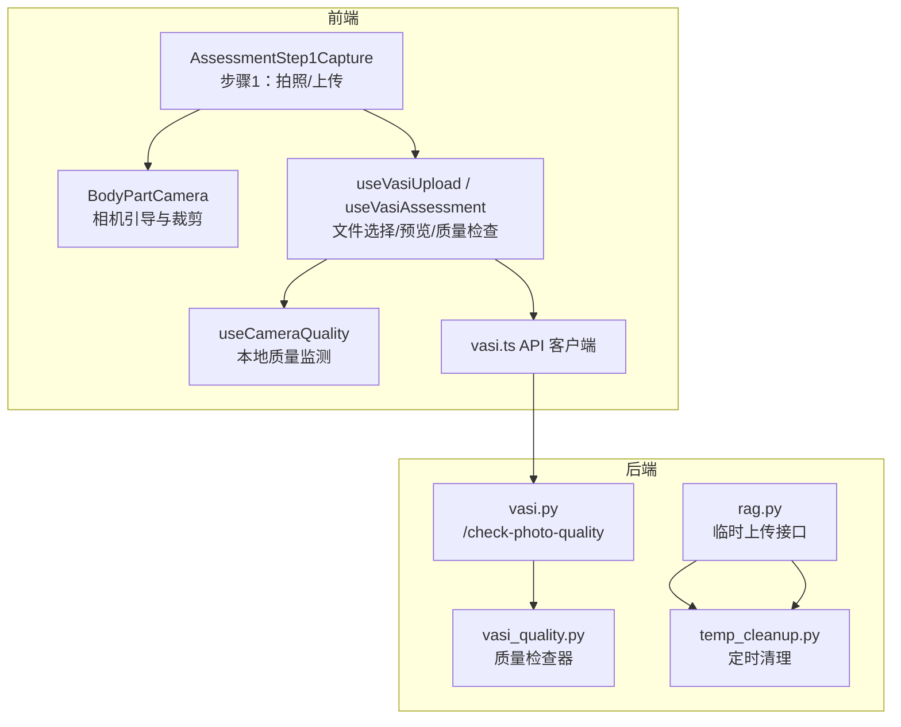
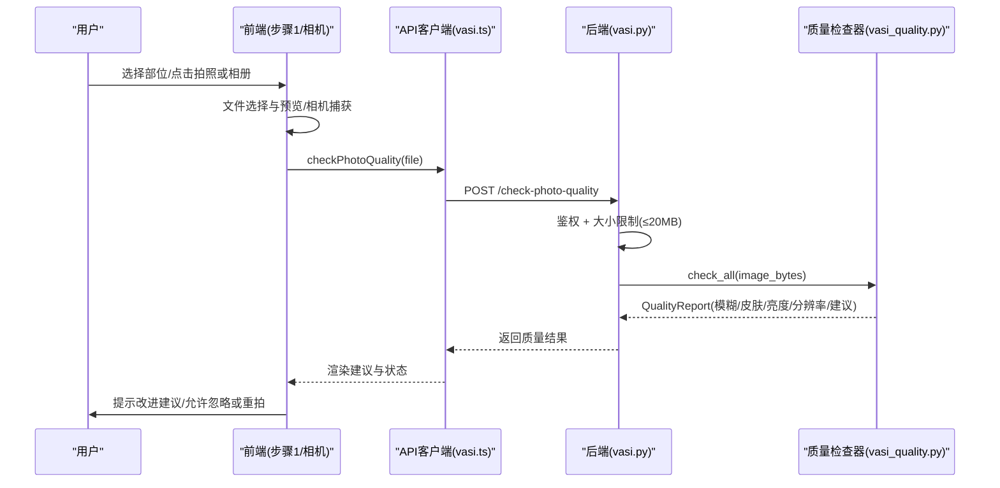
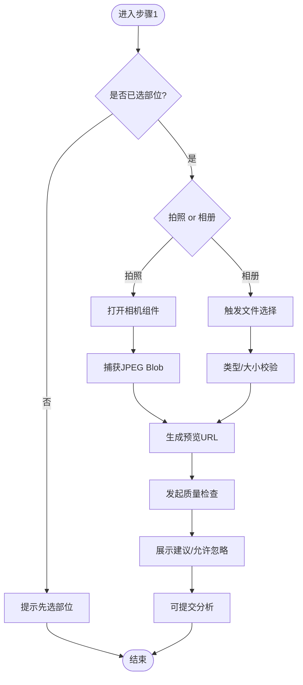
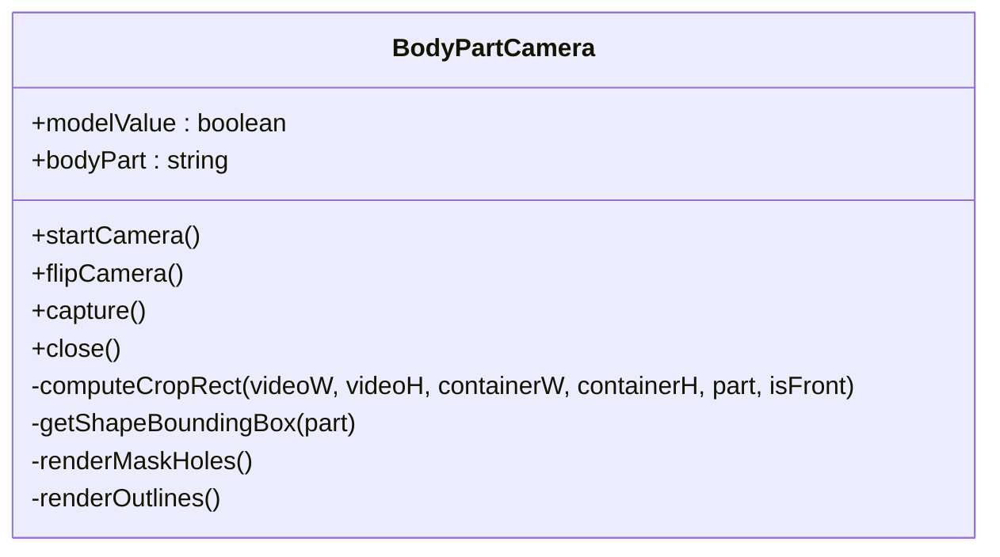
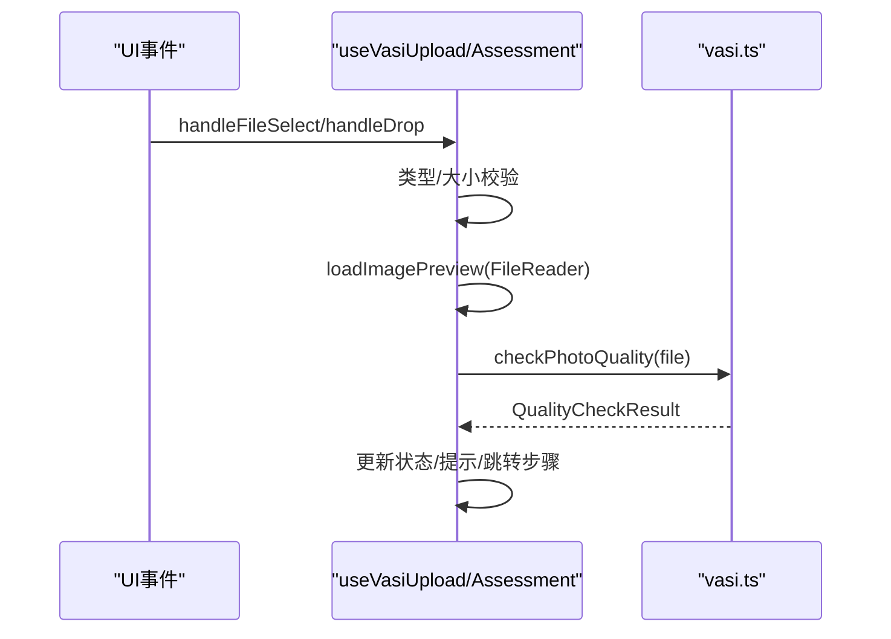
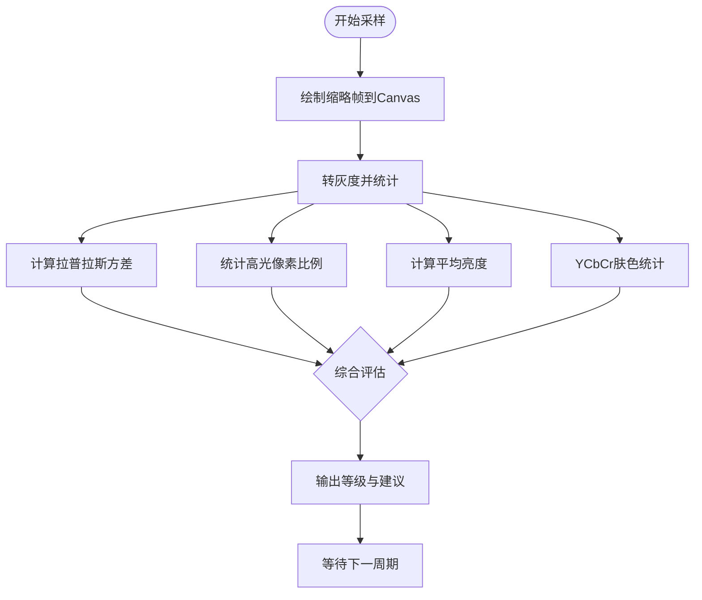
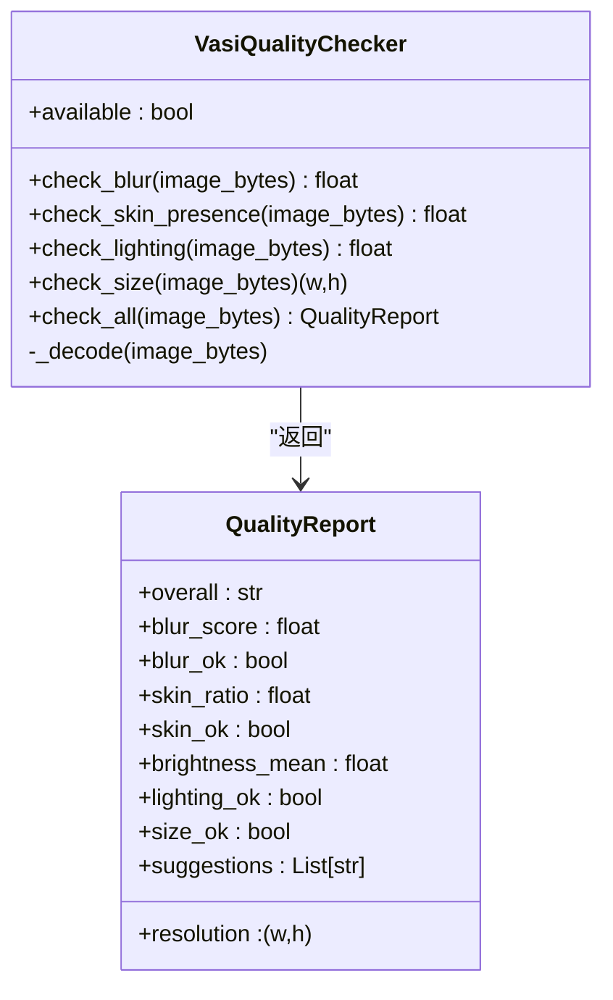
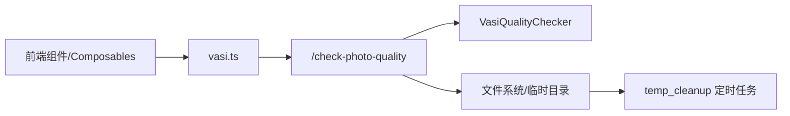

# 图像上传与质量检查

<cite>
**本文引用的文件**   
- [AssessmentStep1Capture.vue](file://web/app/src/components/tracker/AssessmentStep1Capture.vue)
- [BodyPartCamera.vue](file://web/app/src/components/tracker/BodyPartCamera.vue)
- [useVasiUpload.ts](file://web/app/src/composables/useVasiUpload.ts)
- [useVasiAssessment.ts](file://web/app/src/composables/useVasiAssessment.ts)
- [useCameraQuality.ts](file://web/app/src/composables/useCameraQuality.ts)
- [vasi.ts](file://web/app/src/api/vasi.ts)
- [vasi.py](file://web/backend/api/vasi.py)
- [vasi_quality.py](file://web/backend/services/vasi_quality.py)
- [ReportUploader.vue](file://web/app/src/components/tracker/ReportUploader.vue)
- [temp_cleanup.py](file://web/backend/services/temp_cleanup.py)
- [rag.py](file://web/backend/api/rag.py)
- [web_config.yaml](file://configs/web_config.yaml)
</cite>

## 目录
1. [简介](#简介)
2. [项目结构](#项目结构)
3. [核心组件](#核心组件)
4. [架构总览](#架构总览)
5. [详细组件分析](#详细组件分析)
6. [依赖关系分析](#依赖关系分析)
7. [性能考量](#性能考量)
8. [故障排查指南](#故障排查指南)
9. [结论](#结论)
10. [附录](#附录)

## 简介
本文件面向“图像上传与质量检查”功能，覆盖从前端文件选择、相机调用、图片预览到后端质量检测的完整链路。重点说明：
- 图像格式验证、尺寸检查、清晰度评估、光照条件判断
- 错误处理、重试机制、进度反馈与用户提示
- 上传配置选项与质量标准定义
- 移动端相机适配、图片压缩优化与内存管理策略

## 项目结构
该功能涉及前后端多模块协作：
- 前端：步骤化采集界面（数字人+拍照/相册）、实时相机引导、本地质量监测、预览与上传流程编排
- 后端：鉴权校验、大小限制、质量检查服务、临时文件清理、安全存储与访问控制

**图表来源** 
- [AssessmentStep1Capture.vue:1-150](file://web/app/src/components/tracker/AssessmentStep1Capture.vue#L1-L150)
- [BodyPartCamera.vue:1-389](file://web/app/src/components/tracker/BodyPartCamera.vue#L1-L389)
- [useVasiUpload.ts:44-85](file://web/app/src/composables/useVasiUpload.ts#L44-L85)
- [useVasiAssessment.ts:148-212](file://web/app/src/composables/useVasiAssessment.ts#L148-L212)
- [useCameraQuality.ts:1-191](file://web/app/src/composables/useCameraQuality.ts#L1-L191)
- [vasi.ts:184-191](file://web/app/src/api/vasi.ts#L184-L191)
- [vasi.py:511-541](file://web/backend/api/vasi.py#L511-L541)
- [vasi_quality.py:1-285](file://web/backend/services/vasi_quality.py#L1-L285)
- [rag.py:367-401](file://web/backend/api/rag.py#L367-L401)
- [temp_cleanup.py:1-65](file://web/backend/services/temp_cleanup.py#L1-L65)

**章节来源**
- [AssessmentStep1Capture.vue:1-150](file://web/app/src/components/tracker/AssessmentStep1Capture.vue#L1-L150)
- [BodyPartCamera.vue:1-389](file://web/app/src/components/tracker/BodyPartCamera.vue#L1-L389)
- [useVasiUpload.ts:44-85](file://web/app/src/composables/useVasiUpload.ts#L44-L85)
- [useVasiAssessment.ts:148-212](file://web/app/src/composables/useVasiAssessment.ts#L148-L212)
- [useCameraQuality.ts:1-191](file://web/app/src/composables/useCameraQuality.ts#L1-L191)
- [vasi.ts:184-191](file://web/app/src/api/vasi.ts#L184-L191)
- [vasi.py:511-541](file://web/backend/api/vasi.py#L511-L541)
- [vasi_quality.py:1-285](file://web/backend/services/vasi_quality.py#L1-L285)
- [rag.py:367-401](file://web/backend/api/rag.py#L367-L401)
- [temp_cleanup.py:1-65](file://web/backend/services/temp_cleanup.py#L1-L65)

## 核心组件
- 步骤1采集界面：提供数字人部位选择、拍照/相册入口、预览展示与提交按钮；自动滚动至可操作区域提升体验
- 相机组件：基于 getUserMedia 启动摄像头，按身体部位生成遮罩与轮廓，计算裁剪矩形并镜像输出，生成 JPEG Blob
- 上传编排：统一处理文件选择与拖拽、类型与大小校验、预览加载、触发质量检查与状态流转
- 本地质量监测：对视频帧进行降采样灰度采样，计算拉普拉斯方差（模糊）、高光比例（反光）、平均亮度（暗/过曝）与肤色占比，给出整体建议
- 后端质量检查：读取二进制图片，使用 OpenCV/Numpy 计算模糊度、皮肤占比、亮度均值与分辨率，输出结构化报告与建议
- 临时文件与清理：支持临时上传与元数据落盘，后台定时清理过期文件释放磁盘

**章节来源**
- [AssessmentStep1Capture.vue:1-150](file://web/app/src/components/tracker/AssessmentStep1Capture.vue#L1-L150)
- [BodyPartCamera.vue:185-281](file://web/app/src/components/tracker/BodyPartCamera.vue#L185-L281)
- [useVasiUpload.ts:44-85](file://web/app/src/composables/useVasiUpload.ts#L44-L85)
- [useVasiAssessment.ts:148-212](file://web/app/src/composables/useVasiAssessment.ts#L148-L212)
- [useCameraQuality.ts:47-191](file://web/app/src/composables/useCameraQuality.ts#L47-L191)
- [vasi_quality.py:81-285](file://web/backend/services/vasi_quality.py#L81-L285)
- [rag.py:367-401](file://web/backend/api/rag.py#L367-L401)
- [temp_cleanup.py:1-65](file://web/backend/services/temp_cleanup.py#L1-L65)

## 架构总览
下图展示了从用户交互到服务端质量检查的端到端流程，以及关键的质量阈值与反馈点。

**图表来源** 
- [AssessmentStep1Capture.vue:1-150](file://web/app/src/components/tracker/AssessmentStep1Capture.vue#L1-L150)
- [BodyPartCamera.vue:185-281](file://web/app/src/components/tracker/BodyPartCamera.vue#L185-L281)
- [useVasiUpload.ts:44-85](file://web/app/src/composables/useVasiUpload.ts#L44-L85)
- [useVasiAssessment.ts:148-212](file://web/app/src/composables/useVasiAssessment.ts#L148-L212)
- [vasi.ts:184-191](file://web/app/src/api/vasi.ts#L184-L191)
- [vasi.py:511-541](file://web/backend/api/vasi.py#L511-L541)
- [vasi_quality.py:188-271](file://web/backend/services/vasi_quality.py#L188-L271)

## 详细组件分析

### 组件A：步骤1采集与预览（AssessmentStep1Capture.vue）
- 职责：部位选择后打开相机或相册；显示预览；根据质量结果给出提示；自动滚动至提交按钮
- 关键点：
  - 未选部位时阻止上传/拍照并提示
  - 预览图解码完成后滚动定位，避免布局抖动
  - 非“good”质量结果以温和提示呈现，不阻断流程

**图表来源** 
- [AssessmentStep1Capture.vue:36-86](file://web/app/src/components/tracker/AssessmentStep1Capture.vue#L36-L86)
- [useVasiUpload.ts:44-85](file://web/app/src/composables/useVasiUpload.ts#L44-L85)
- [useVasiAssessment.ts:148-212](file://web/app/src/composables/useVasiAssessment.ts#L148-L212)

**章节来源**
- [AssessmentStep1Capture.vue:1-150](file://web/app/src/components/tracker/AssessmentStep1Capture.vue#L1-L150)

### 组件B：移动端相机适配（BodyPartCamera.vue）
- 职责：请求摄像头权限、按部位绘制遮罩与轮廓、计算裁剪矩形、镜像输出、生成高质量JPEG
- 关键点：
  - 前置摄像头输出镜像，保证所见即所得
  - 将SVG viewBox形状映射到容器与视频像素坐标，考虑 object-cover 缩放与翻转
  - 捕获后以 JPEG 0.9 质量输出，减少体积同时保持清晰度
  - 生命周期内正确释放媒体流，避免内存泄漏

**图表来源** 
- [BodyPartCamera.vue:100-183](file://web/app/src/components/tracker/BodyPartCamera.vue#L100-L183)
- [BodyPartCamera.vue:185-281](file://web/app/src/components/tracker/BodyPartCamera.vue#L185-L281)

**章节来源**
- [BodyPartCamera.vue:1-389](file://web/app/src/components/tracker/BodyPartCamera.vue#L1-L389)

### 组件C：上传编排与预览（useVasiUpload.ts / useVasiAssessment.ts）
- 职责：统一处理文件选择/拖拽、类型与大小校验、预览加载、质量检查、步骤切换
- 关键点：
  - 仅接受 image/*，单张 ≤10MB（前端），后端上限为 20MB
  - 使用 FileReader 生成 data URL 作为预览，避免 blob URL 被回收导致失效
  - 质量检查失败时清空结果并继续流程，允许用户忽略

**图表来源** 
- [useVasiUpload.ts:44-85](file://web/app/src/composables/useVasiUpload.ts#L44-L85)
- [useVasiAssessment.ts:148-212](file://web/app/src/composables/useVasiAssessment.ts#L148-L212)
- [vasi.ts:184-191](file://web/app/src/api/vasi.ts#L184-L191)

**章节来源**
- [useVasiUpload.ts:44-85](file://web/app/src/composables/useVasiUpload.ts#L44-L85)
- [useVasiAssessment.ts:148-212](file://web/app/src/composables/useVasiAssessment.ts#L148-L212)

### 组件D：本地相机质量监测（useCameraQuality.ts）
- 职责：每 800ms 采样一次缩略灰度帧，计算模糊、反光、明暗与肤色占比，给出整体质量等级与建议
- 关键点：
  - 拉普拉斯方差衡量清晰度，阈值分 fail/warn/ok
  - 高光像素比例衡量反光强度
  - 平均亮度衡量暗/过曝
  - 肤色范围在 YCbCr 空间判定，兼顾不同肤色与光照
  - 轻量实现，零依赖，低开销

**图表来源** 
- [useCameraQuality.ts:70-160](file://web/app/src/composables/useCameraQuality.ts#L70-L160)

**章节来源**
- [useCameraQuality.ts:1-191](file://web/app/src/composables/useCameraQuality.ts#L1-L191)

### 组件E：后端质量检查（vasi_quality.py）
- 职责：对上传的二进制图片执行模糊、皮肤存在性、光照与分辨率检测，输出结构化报告与中文建议
- 关键点：
  - 模糊：Laplacian 方差，阈值区分清晰/一般/模糊
  - 皮肤：HSV 双区间 + YCrCb 联合掩码，降低误判
  - 光照：灰度均值，暗/过曝阈值
  - 分辨率：最小宽高要求
  - 降级：OpenCV/Numpy 不可用时返回“acceptable”并提示

**图表来源** 
- [vasi_quality.py:81-285](file://web/backend/services/vasi_quality.py#L81-L285)

**章节来源**
- [vasi_quality.py:1-285](file://web/backend/services/vasi_quality.py#L1-L285)

### 组件F：临时上传与清理（rag.py / temp_cleanup.py）
- 职责：接收临时文件与元数据，后台定时清理过期文件，防止磁盘膨胀
- 关键点：
  - 临时文件命名带随机ID，元数据记录用户ID
  - 默认最大保留24小时，每小时扫描一次
  - 删除失败记录警告日志，不影响主流程

**章节来源**
- [rag.py:367-401](file://web/backend/api/rag.py#L367-L401)
- [temp_cleanup.py:1-65](file://web/backend/services/temp_cleanup.py#L1-L65)

## 依赖关系分析
- 前端依赖：Vue 组件与组合式函数、浏览器 MediaDevices/Canvas/FileReader API
- 后端依赖：FastAPI 路由、OpenCV/Numpy（可选，具备降级逻辑）、文件系统与异步任务
- 配置与安全：CORS、CSP、速率限制等通过配置文件生效

**图表来源** 
- [vasi.ts:184-191](file://web/app/src/api/vasi.ts#L184-L191)
- [vasi.py:511-541](file://web/backend/api/vasi.py#L511-L541)
- [vasi_quality.py:188-271](file://web/backend/services/vasi_quality.py#L188-L271)
- [temp_cleanup.py:1-65](file://web/backend/services/temp_cleanup.py#L1-L65)

**章节来源**
- [web_config.yaml:253-284](file://configs/web_config.yaml#L253-L284)

## 性能考量
- 前端预览：使用 FileReader 生成 data URL，避免 blob URL 失效问题；必要时预解码图片再滚动定位
- 相机捕获：JPEG 0.9 质量输出，平衡清晰度与体积；按部位计算裁剪矩形，减少无关区域
- 本地质量监测：160×120 缩略帧采样，纯 JS 计算，约 3ms/次
- 后端处理：OpenCV/Numpy 加速；若不可用则降级返回“acceptable”，保障可用性
- 内存管理：Canvas 工作分辨率上限（如 1024px）降低大图内存占用；及时释放媒体流与定时器

[本节为通用指导，无需特定文件引用]

## 故障排查指南
- 相机无法启动：检查权限拒绝与设备不可用错误，提示用户授权或更换设备
- 预览不显示：确认 FileReader 成功回调；确保图片类型与大小合法
- 质量检查失败：查看后端日志；确认 OpenCV/Numpy 可用；检查输入字节流完整性
- 临时文件堆积：确认清理任务运行；检查磁盘路径权限与异常日志
- 网络超时：调整 API 超时时间；检查代理与跨域配置

**章节来源**
- [BodyPartCamera.vue:200-212](file://web/app/src/components/tracker/BodyPartCamera.vue#L200-L212)
- [useVasiUpload.ts:75-85](file://web/app/src/composables/useVasiUpload.ts#L75-L85)
- [useVasiAssessment.ts:196-207](file://web/app/src/composables/useVasiAssessment.ts#L196-L207)
- [temp_cleanup.py:30-52](file://web/backend/services/temp_cleanup.py#L30-L52)

## 结论
本方案在前端提供友好的拍摄与预览体验，结合本地质量监测与后端严格的质量检查，形成闭环反馈，帮助用户拍出符合 AI 分析要求的照片。通过合理的压缩、分辨率控制与内存管理，在保证质量的同时兼顾性能与稳定性。

[本节为总结性内容，无需特定文件引用]

## 附录

### 上传配置与质量标准
- 前端限制：仅 image/*，单张 ≤10MB
- 后端限制：单张 ≤20MB，鉴权校验
- 质量标准（后端）：
  - 模糊：Laplacian 方差 ≥ 可接受阈值
  - 皮肤占比：≥ 5%
  - 光照：灰度均值处于合理区间（不过暗/不过曝）
  - 分辨率：宽≥640，高≥480
- 建议输出：中文提示，便于用户理解与改进

**章节来源**
- [useVasiUpload.ts:44-85](file://web/app/src/composables/useVasiUpload.ts#L44-L85)
- [useVasiAssessment.ts:148-212](file://web/app/src/composables/useVasiAssessment.ts#L148-L212)
- [vasi.py:511-541](file://web/backend/api/vasi.py#L511-L541)
- [vasi_quality.py:39-63](file://web/backend/services/vasi_quality.py#L39-L63)
- [vasi_quality.py:219-271](file://web/backend/services/vasi_quality.py#L219-L271)

### 体检报告上传（ReportUploader.vue）
- 支持图片/PDF，单文件 ≤20MB
- 自动生成标题，支持批量上传与历史列表
- 触发AI解读并跳转详情页

**章节来源**
- [ReportUploader.vue:48-103](file://web/app/src/components/tracker/ReportUploader.vue#L48-L103)